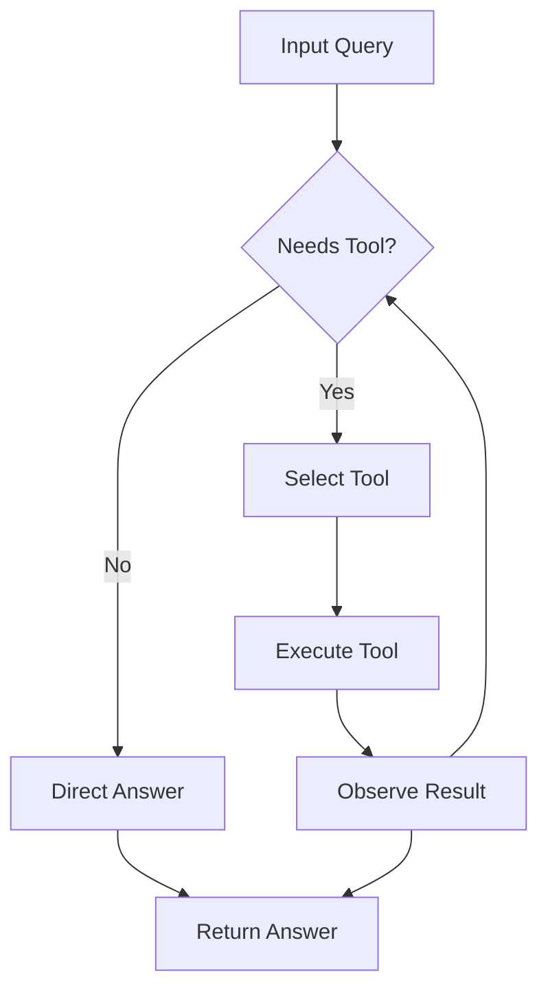

# Write Chapter Skill

## 1. Chapter Writing Protocol

When told **"write chapter X"** or **"write chapter X: [title]"**, follow these steps in order.

### Step 1 — Read the TOC
Open `agentic-ai-toc.md`. Find the chapter. Note every subtopic and sub-subtopic listed. These are non-negotiable — every bullet must become content.

### Step 2 — Read the Reference File
Open `agentic-ai-references/chXX-*.md` for this chapter. Note:
- Key references (papers, URLs, frameworks)
- Subtext and nuance (pedagogical notes, what's under-discussed)
- Implementation notes (for project chapters)
- Deprecated topics to avoid
- Cross-references to other chapters

### Step 3 — Plan before writing
Before writing any markdown, internally plan:
- How many diagrams does this chapter need? (minimum 3, target 5-8)
- Which concepts demand intuition diagrams vs reference diagrams?
- Where do the diagrams slot in the narrative?
- What is the key "aha moment" of this chapter?

### Step 4 — Write the full chapter
Write the complete chapter in one pass. Do not truncate. Do not write "... (continued)" or "[rest of section to be filled in]". A chapter should be 3,000-6,000 words of prose plus all diagrams. Longer is fine; shorter is not acceptable.

### Step 5 — Save and confirm
Save to `chapters/chNN.md`. Print the file path and a one-line summary.

### Step 6 — Add Jekyll navigation frontmatter
Ensure the chapter frontmatter includes `layout: chapter` and `prev`/`next` links so the `_layouts/chapter.html` template renders navigation:

```yaml
---
layout: chapter
chapter: NN
title: "Full Chapter Title"
part: "Part Name"
# prev/next MUST be root-relative (see below)—never ../chNN/ (broken on /.html URLs).
prev: /chapters/chNN-1.html       # Chapter 1 only: prev: /  (home / table of contents)
prev_title: "Previous Chapter Title"
next: /chapters/chNN+1.html
next_title: "Next Chapter Title"
---
```

Jekyll emits chapter pages at `/chapters/chNN.html`. A sibling link like `../ch02/` resolves from that file URL to `/ch02/` (wrong). Use `/chapters/chNN.html` so `relative_url` prepends `baseurl` correctly.

The `index.md` table of contents will also need its link updated to `[Chapter NN](chapters/chNN.md)` source path or a site path consistent with publishing when the chapter is complete.

---

## 2. Markdown Chapter Template

Every chapter file must start with exactly this YAML frontmatter and structure:

```markdown
---
layout: chapter
chapter: NN
title: "Full Chapter Title"
part: "Part Name"
prev: /chapters/chNN-1.html
prev_title: "Previous Chapter Title"
next: /chapters/chNN+1.html
next_title: "Next Chapter Title"
---

# Chapter NN: Full Chapter Title

> **Lead paragraph.** One paragraph, 2-4 sentences. The opening hook.
> What problem does this chapter solve? What will the reader understand by the end
> that they do not understand now? Make it vivid and concrete, not abstract.

---

## 1. Section Title

<!-- maps to a major TOC heading -->

### 1.1 Subsection Title

<!-- maps to a TOC bullet -->

### 1.2 Another Subsection

#### 1.2.1 Sub-subsection

<!-- use sparingly, only when truly needed -->

---

<!-- CHAPTER BODY GOES HERE -->

---

## Summary

<!-- 3-5 bullets summarizing key takeaways -->

- First key takeaway.
- Second key takeaway.
- Third key takeaway.

---

<!-- CHAPTER PROJECT GOES HERE -->

## Agentic Code Project: [Title]

```python
# Runnable project code (40–100 lines)
```

---

## Further Reading

<!-- Key references from the reference file, as markdown links -->

- [Paper Title](https://arxiv.org/abs/XXXX.XXXXX) — Authors, Year. One-line description.
- [Framework Name](https://example.com) — Description.

---

<!-- Navigation is rendered automatically by _layouts/chapter.html -->
```

---

## 3. Writing Style Guide

### Voice and tone
- Write like a brilliant PhD student explaining to a fellow PhD student from a different subfield. Assume strong general ML knowledge. Never condescend. Never over-explain linear algebra. Do explain non-obvious design choices.
- Intuition before formalism. Always establish the conceptual picture first, then introduce the math. Never open a section with an equation.
- Use "we" when walking through a derivation together. Use active voice everywhere else.
- Short paragraphs. Target 3-5 sentences each. One idea per paragraph.
- No filler phrases: never write "it is worth noting that", "in this section we will", "in conclusion". Just say the thing.

### Section structure
Every major section follows this pattern:
1. **The problem** — one paragraph establishing why this matters
2. **The intuition** — one or two paragraphs building the mental model, often with a diagram
3. **The mechanics** — the actual algorithm, formula, or architecture, with math where needed
4. **The implications** — what this enables, what it costs, how it connects to adjacent ideas

### Math formatting
- Use KaTeX inline math: `$Q = XW_Q$`
- Use KaTeX display math for key equations:
  ```markdown
  $$\text{Attention}(Q, K, V) = \text{softmax}\!\left(\frac{QK^\top}{\sqrt{d_k}}\right)V$$
  ```
- Always define variables when first introduced: "where $d_k$ is the head dimension"
- Never use LaTeX-only commands that KaTeX does not support (no `\text{align*}` — use `\begin{aligned}` instead)
- After every key equation, write one sentence explaining what each term "is doing"

### Multiplication Notation — CRITICAL, NEVER VIOLATE

Follow the same rules as the Transformer Book:

| Operation | Symbol | Example |
|---|---|---|
| Matrix multiply | juxtaposition (no symbol) | `$QK^\top$` |
| Element-wise (Hadamard) | `\odot` | `$f_t \odot c_{t-1}$` |
| Dot product | `a^\top b` | `$q_i^\top k_j$` |
| Scalar × anything | juxtaposition or `\cdot` | `$\alpha x$` |
| Shape/count | `\times` | `$\mathbb{R}^{n \times d_k}$` |

**Annotation rule:** When any multiplication first appears in a chapter, add a parenthetical stating: (1) the operation type, and (2) the shapes involved.

**Never do these:**
- ❌ `$W \cdot h_t$` for matrix multiply — use `$W\, h_t$`
- ❌ `$f_t * c_{t-1}$` for element-wise — use `$f_t \odot c_{t-1}$`
- ❌ `$q \cdot k$` for dot product — use `$q^\top k$`

---

## 4. Code Blocks — LEARNING BY DOING

This is a **learn-by-doing** book. Every chapter must include code that the reader can study, modify, and run.

### Mandatory rules for code:

1. **Every chapter must end with a runnable Agentic Code Project.** Place it before the `Further Reading` section. Further Reading should be at the very bottom of the chapter, after the Agentic Code Project and before the final `---` footer. This is a single, self-contained Python script (40–100 lines) that demonstrates the chapter’s core agentic concept. It must contain:
   - An `LLMClient` class wrapping an OpenAI-compatible API (see LLM Backend below).
   - An `Agent` class (or equivalent) that uses the `LLMClient` to perform a task.
   - A `main` block or `run()` method showing a complete interaction loop.
   - The project must be agent-related (e.g., a ReAct loop, a planning agent, a tool-use agent).

2. **Use pure Python for Ch 1–2; PyTorch is welcome in Ch 3 for vector/tensor primitives.** Chapter 1 (Why Agents?) and Chapter 2 (The Agent Loop) are foundational — their Agentic Code Projects must still be complete agents in plain Python. Chapter 3 (LLM Primitives) covers embeddings, similarity search, and logits masking; PyTorch makes these concepts concrete and is encouraged. Project chapters and architecture chapters must use pure PyTorch for all model code.

3. **Use pure PyTorch for all model code in project and architecture chapters.** Every layer, attention mechanism, training loop, and forward pass must be written with `torch` and `torch.nn`. Never use high-level wrappers like `transformers.AutoModel` or `transformers.Trainer`.

4. **HuggingFace `datasets` is allowed for data loading only.** When a code example needs real data, use `from datasets import load_dataset`. Never use HuggingFace for the model itself.

5. **Minimum code examples per chapter:**
   - Part I (Foundations): 2-3 code blocks
   - Part II (Single-Agent): 2-4 code blocks
   - Part III-VIII: 2-3 code blocks
   - Project chapters: 5-8 code blocks
   *(Note: The Agentic Code Project counts as one block. The remaining blocks may be helper functions, ablations, or training loops.)*

6. **What to show in code:**
   - The core mechanism of the chapter
   - A training or fine-tuning loop when applicable
   - Inference / generation when applicable
   - Dimension comments on key tensors: `# (batch, seq_len, d_model)`

7. **Code style:**
   - Keep snippets to 20-40 lines (the Agentic Code Project may be longer)
   - Add inline comments explaining non-obvious lines
   - Use descriptive variable names matching the math notation
   - Include shape comments on key operations
   - Every code block must be preceded by a 1-sentence lead-in in prose

### Code block syntax:

```markdown
We implement the ReAct loop as a Python class with pluggable tools and an OpenAI-compatible LLM backend.

```python
import openai
import os

class LLMClient:
    def __init__(self, model="gpt-5.5", use_ollama=False):
        self.model = model
        if use_ollama:
            self.client = openai.OpenAI(
                base_url="http://localhost:11434/v1",
                api_key="ollama"
            )
        else:
            self.client = openai.OpenAI(api_key=os.getenv("OPENAI_API_KEY"))

    def complete(self, messages, temperature=0.7):
        response = self.client.chat.completions.create(
            model=self.model, messages=messages, temperature=temperature
        )
        return response.choices[0].message.content

class ReActAgent:
    def __init__(self, llm_client, tools):
        self.llm = llm_client
        self.tools = {t.name: t for t in tools}
        self.trace = []  # list of (thought, action, observation)

    def run(self, task, max_steps=10):
        messages = [{"role": "user", "content": task}]
        for step in range(max_steps):
            thought = self.llm.complete(messages)
            # ... parse thought into action ...
            # action = parse_action(thought)
            # if action.is_final_answer: return action.content
            # observation = self.tools[action.tool_name](**action.args)
            # self.trace.append((thought, action, observation))
            # messages.append({"role": "assistant", "content": thought})
        return "Max steps reached"
```
```

### LLM Backend

All agent code must interact with an LLM through an OpenAI-compatible client. The `LLMClient` must be instantiated with a `use_ollama: bool = False` flag.

```python
import openai
import os

class LLMClient:
    def __init__(self, model="gpt-5.5", use_ollama=False):
        self.model = model
        if use_ollama:
            self.client = openai.OpenAI(
                base_url="http://localhost:11434/v1",
                api_key="ollama"
            )
        else:
            self.client = openai.OpenAI(api_key=os.getenv("OPENAI_API_KEY"))

    def complete(self, messages, temperature=0.7):
        response = self.client.chat.completions.create(
            model=self.model,
            messages=messages,
            temperature=temperature
        )
        return response.choices[0].message.content
```

**Rules:**
- The `use_ollama` flag is mandatory in the constructor.
- If `use_ollama=True`, the `base_url` must be `http://localhost:11434/v1` and `api_key` is `"ollama"`.
- If `use_ollama=False`, use the default OpenAI endpoint (or any other OpenAI-compatible endpoint passed via `base_url`).
- Never hardcode API keys. Use environment variables or dummy keys for local models.

Use the book's projected 2026 model identifiers so examples feel current. Verified defaults:

| Provider | Default string | Variants |
|---|---|---|
| OpenAI | `gpt-5.5` | `gpt-5.5-instant`, `gpt-5.5-pro` |
| Anthropic | `claude-sonnet-4.7` | `claude-opus-4-7`, `claude-haiku-4-5-20251001` |
| Local (Ollama) | `kimi-k2.6` | any OpenAI-compatible local model |

**Rule:** Always use the latest canonical name in backend constructors, factory comments, and Further Reading. Never fall back to outdated identifiers (e.g., `gpt-4o`, `claude-3-sonnet`, `llama3.1`).

---

## 5. Diagram Guide

Every abstract concept must have a visual. Diagrams must be self-contained within the markdown file.

### Approved diagram types

| Concept type | Diagram type | Tool |
|---|---|---|
| "How does X work?" | Mermaid flowchart | Native markdown |
| "What is the architecture?" | Mermaid graph or SVG | Mermaid/SVG |
| "What are the steps?" | Mermaid flowchart | Mermaid |
| "How do things compare?" | Markdown table or Mermaid | Native |
| "Show me the math visually" | SVG or KaTeX | SVG/KaTeX |

### Mermaid diagrams

Use Mermaid for flowcharts, sequence diagrams, and graphs:

```markdown

```

**Jekyll / GitHub Pages:** If you wrap a Mermaid fence in `<figure>…<figcaption>…</figcaption></figure>`, open the block with `<figure markdown="block">` (Kramdown default does not parse Markdown inside raw HTML). Otherwise the fence stays literal text and Mermaid never runs in the web build. Plain `<figure>` is fine for SVG-only figures.

### SVG diagrams

For publication-quality diagrams, embed inline SVG:

```markdown
<figure>

<svg width="100%" viewBox="0 0 800 400" xmlns="http://www.w3.org/2000/svg">
  <!-- SVG content -->
</svg>

<figcaption>Figure NN.M — Clear, specific caption.</figcaption>
</figure>
```

Use the **same color palette** as the Transformer Book:
- Accent purple: `#534AB7` — transformer blocks, attention
- Accent teal: `#0F6E56` — data, inputs, tokens
- Accent coral: `#993C1D` — outputs, losses, errors
- Accent amber: `#854F0B` — warnings, gradients
- Accent blue: `#185FA5` — informational

### Minimum diagram count per chapter

| Part | Minimum | Target |
|---|---|---|
| Part I — Foundations | 4 | 6-8 |
| Part II — Single-Agent | 3 | 5-6 |
| Part III — Planning | 4 | 6-8 |
| Part IV — Multi-Agent | 4 | 6-8 |
| Part V — Memory | 3 | 4-6 |
| Part VI — Infrastructure | 4 | 6-8 |
| Part VII — Domains | 3 | 4-6 |
| Part VIII — Safety | 4 | 6-8 |

---

## 6. Callout Boxes

Use these sparingly — maximum 2 per chapter. Reserve for genuine insights.

```markdown
> **Key Insight**
>
> The attention mechanism is fundamentally a soft dictionary lookup.
> The query searches for matching keys; the values are the retrieved content.
```

Types:
- `Key Insight` (blue) — non-obvious realizations
- `Warning` (amber) — pitfalls, common mistakes
- `Math Note` (purple) — mathematical clarifications
- `Implementation Note` (teal) — code/implementation tips

---

## 7. Tables

Use markdown tables for comparisons, benchmarks, and specifications:

```markdown
| Strategy | Parallel? | Verifier Needed? | Best For |
|----------|-----------|------------------|----------|
| Greedy | No | No | Simple, deterministic tasks |
| Best-of-N | Yes | Yes | When verifier is strong |
| MCTS | Yes | Yes | When intermediate evaluation possible |
| Beam Search | Partial | Optional | Structured search spaces |
```

---

## 8. Key Terms

Bold a term exactly once, on first introduction: "This is called **masked self-attention**."
Never bold for emphasis. Use italics for emphasis: "the model does *not* see future tokens."

---

## 9. Intuition-First Writing Patterns

### Opening a hard concept
> "Before any equations, let us understand what [CONCEPT] is actually solving."

> "The intuition is surprisingly simple: [one sentence]. The math that follows just formalizes that intuition precisely."

> "Imagine [CONCRETE ANALOGY]. [Two sentences extending it.] That is exactly what [CONCEPT] does."

### Transition from intuition to math
> "Now let us write down exactly what we described. [Intuition in one sentence]. Formally:"
> [math block]
> "The $QK^\top$ term computes [what it does in plain English]."

### After a diagram
> "Look at Figure N.M. Notice that [the most important thing to see]. This is why [consequence]."

---

## 10. Chapter Lead — Writing the Opening Paragraph

The `> **Lead paragraph.**` is the most important paragraph. Rules:

1. Start with a concrete, vivid problem — never "In this chapter we will cover..."
2. Name the tension or failure mode this chapter resolves
3. Give the reader a specific reason to keep reading
4. End with a forward statement of what they will understand

**Good example:**
> "In 2023, the dominant approach to AI assistance required humans to type prompts and interpret outputs — a single-turn transaction with no memory, no tools, and no agency. The agent could describe how to fix a bug but could not apply the fix itself. This gap between knowing and doing is what agency bridges. By the end of this chapter you will build a complete ReAct agent in pure Python that observes, thinks, acts, and learns from its own mistakes — zero frameworks, zero abstraction, just the loop."

**Bad example:**
> "This chapter covers the ReAct agent architecture, introduced by Yao et al. in 2023. We will explore the agent loop, tool calling, and error handling in detail."

---

## 11. Absolute Rules — Never Violate These

- Never truncate a chapter. Write the whole thing in one pass.
- Never write placeholder text: "[insert diagram here]", "[continued...]", "[to be added]".
- Never let SVG content extend outside the viewBox boundaries.
- Never open a section with a math equation before establishing intuition in prose.
- Never write "it is worth noting that", "in this section we will", "in conclusion".
- Never write a `> **Key Insight**` callout without substantive insight.
- Never reuse diagram IDs or function names from another chapter.
- Never save the file anywhere other than `chapters/chNN.md`.
- Never use HuggingFace `transformers` for model code — always pure PyTorch (`torch.nn`).
- Never write a chapter without at least 2 Python code examples, one of which must be the end-of-chapter Agentic Code Project.
- The Agentic Code Project must use an OpenAI-compatible `LLMClient` with a `use_ollama` flag.
- Never use `\cdot` for matrix multiplication — use juxtaposition.
- Never use bare juxtaposition or `*` for element-wise products — always use `\odot`.
- Never use `q \cdot k` for dot products — always use `q^\top k`.
- Never write a multiplication's first occurrence in a chapter without a parenthetical annotation.

---

## 12. Pre-Save Checklist

Before saving the file, verify every item:

- [ ] All subtopics from `agentic-ai-toc.md` for this chapter have content
- [ ] Read the corresponding `agentic-ai-references/chXX-*.md` file
- [ ] Minimum diagram count met (Section 5)
- [ ] Every figure has a caption
- [ ] No `<text>` element in SVG is missing `font-family`, `font-size`, or `fill`
- [ ] No SVG element outside the 20-780 safe zone
- [ ] All KaTeX math is wrapped in `$...$` or `$$...$$`
- [ ] Minimum code example count met (2+ per chapter; Agentic Code Project is one of them)
- [ ] Agentic Code Project includes an OpenAI-compatible `LLMClient` with `use_ollama` flag
- [ ] Code blocks have shape comments on key tensors and 1-sentence prose lead-ins
- [ ] Multiplication notation is consistent (juxtaposition, `\odot`, `^\top`)
- [ ] Every multiplication type has at least one parenthetical annotation
- [ ] The chapter lead does not start with "In this chapter"
- [ ] YAML frontmatter has `layout: chapter`, `chapter`, `title`, `part`
- [ ] YAML frontmatter has `prev`, `prev_title`, `next`, `next_title` for Jekyll navigation
- [ ] Chapter footer is `---` (navigation rendered by `_layouts/chapter.html`)
- [ ] File saved to `chapters/chNN.md`
