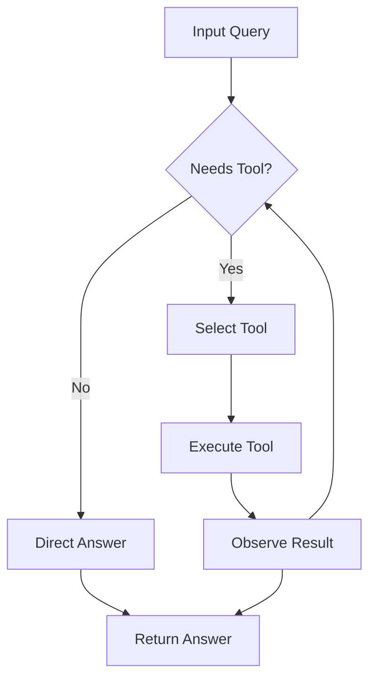

# CLAUDE.md

This file provides guidance to Claude Code (claude.ai/code) when working on the **Agentic AI Book** in this repository.

## Quick Reference

- **Primary command**: `write chapter X` — produces `chapters/chXX.md`
- **Source of truth for chapter content**: `agentic-ai-toc.md` (read before every chapter)
- **Source of truth for references**: `agentic-ai-references/chXX-*.md` (read before writing)
- **Preview**: open any `chapters/chNN.md` in a Markdown renderer (VS Code, Obsidian, GitHub, MkDocs)
- **GitHub Pages**: The entire book renders as a static site via Jekyll. Push to GitHub Pages to publish.
- **Format**: Markdown with YAML frontmatter, KaTeX math, Prism-highlighted code, Mermaid/ASCII/SVG diagrams

---

## 1. File and Project Structure

```
agentic-ai-book/
├── _config.yml                ← Jekyll / GitHub Pages configuration
├── _layouts/
│   ├── default.html           ← base HTML layout (KaTeX, styles)
│   └── chapter.html           ← chapter layout with prev/next nav
├── index.md                   ← homepage / table of contents
├── CLAUDE.md                  ← this file
├── agentic-ai-toc.md          ← source of truth for chapter titles/subtopics
├── agentic-ai-references/     ← per-chapter reference files (74 files)
│   ├── ch01-why-agents.md
│   ├── ch02-agent-loop.md
│   └── ...
├── chapters/
│   ├── ch01.md
│   ├── ch02.md
│   └── ...
├── appendices/
│   ├── appendix-a.md
│   └── ...
└── assets/
    └── diagrams/              ← shared diagram assets if needed
```

**GitHub Pages**: This book is configured for Jekyll on GitHub Pages. The `_config.yml` sets the theme and plugins. The `index.md` is the homepage. Chapters use the `chapter` layout which adds prev/next navigation automatically from frontmatter.

When writing chapter N, the output file is `chapters/chNN.md` (zero-padded to 2 digits).

---

## 2. Chapter Writing Protocol

When told **"write chapter X"** or **"write chapter X: [title]"**, follow these steps in order:

### Step 1 — Read the TOC
Open `agentic-ai-toc.md`. Find the chapter. Note every subtopic and sub-subtopic listed. These are non-negotiable — every bullet must become content.

### Step 2 — Read the Reference File
Open `agentic-ai-references/chXX-*.md` for this chapter. Note:
- Key references (papers, URLs, frameworks)
- Subtext and nuance (pedagogical notes, what's under-discussed)
- Implementation notes (for project chapters)
- Deprecated topics to avoid
- Cross-references to other chapters

### Step 3 — Plan before writing
Before writing any markdown, internally plan:
- How many diagrams does this chapter need? (minimum 3, target 5-8)
- Which concepts demand intuition diagrams vs reference diagrams?
- Where do the diagrams slot in the narrative?
- What is the key "aha moment" of this chapter?

### Step 4 — Write the full chapter
Write the complete chapter in one pass. Do not truncate. Do not write "... (continued)" or "[rest of section to be filled in]". A chapter should be 3,000-6,000 words of prose plus all diagrams. Longer is fine; shorter is not acceptable.

### Step 5 — Save and confirm
Save to `chapters/chNN.md`. Print the file path and a one-line summary.

### Step 6 — Add Jekyll navigation frontmatter
Ensure the chapter frontmatter includes `layout: chapter` and `prev`/`next` links so the `_layouts/chapter.html` template renders navigation:

```yaml
---
layout: chapter
chapter: NN
title: "Full Chapter Title"
part: "Part Name"
# prev/next MUST be root-relative (see below)—never ../chNN/ (broken on /.html URLs).
prev: /chapters/chNN-1.html       # Chapter 1 only: prev: /  (home / table of contents)
prev_title: "Previous Chapter Title"
next: /chapters/chNN+1.html
next_title: "Next Chapter Title"
---
```

Jekyll emits chapter pages at `/chapters/chNN.html`. A sibling link like `../ch02/` resolves from that file URL to `/ch02/` (wrong). Use `/chapters/chNN.html` so `relative_url` prepends `baseurl` correctly.

The `index.md` table of contents will also need its link updated to `[Chapter NN](chapters/chNN.md)` source path or a site path consistent with publishing when the chapter is complete.
---

## 3. Markdown Chapter Template

Every chapter file must start with exactly this YAML frontmatter and structure:

```markdown
---
layout: chapter
chapter: NN
title: "Full Chapter Title"
part: "Part Name"
prev: /chapters/chNN-1.html
prev_title: "Previous Chapter Title"
next: /chapters/chNN+1.html
next_title: "Next Chapter Title"
---

# Chapter NN: Full Chapter Title

> **Lead paragraph.** One paragraph, 2-4 sentences. The opening hook.
> What problem does this chapter solve? What will the reader understand by the end
> that they do not understand now? Make it vivid and concrete, not abstract.

---

## 1. Section Title

<!-- maps to a major TOC heading -->

### 1.1 Subsection Title

<!-- maps to a TOC bullet -->

### 1.2 Another Subsection

#### 1.2.1 Sub-subsection

<!-- use sparingly, only when truly needed -->

---

<!-- CHAPTER BODY GOES HERE -->

---

## Summary

<!-- 3-5 bullets summarizing key takeaways -->

- First key takeaway.
- Second key takeaway.
- Third key takeaway.

## Further Reading

<!-- Key references from the reference file, as markdown links -->

- [Paper Title](https://arxiv.org/abs/XXXX.XXXXX) — Authors, Year. One-line description.
- [Framework Name](https://example.com) — Description.

---

<!-- Navigation is rendered automatically by _layouts/chapter.html -->
```

---

## 4. Writing Style Guide

### Voice and tone
- Write like a brilliant PhD student explaining to a fellow PhD student from a different subfield. Assume strong general ML knowledge. Never condescend. Never over-explain linear algebra. Do explain non-obvious design choices.
- Intuition before formalism. Always establish the conceptual picture first, then introduce the math. Never open a section with an equation.
- Use "we" when walking through a derivation together. Use active voice everywhere else.
- Short paragraphs. Target 3-5 sentences each. One idea per paragraph.
- No filler phrases: never write "it is worth noting that", "in this section we will", "in conclusion". Just say the thing.

### Section structure
Every major section follows this pattern:
1. **The problem** — one paragraph establishing why this matters
2. **The intuition** — one or two paragraphs building the mental model, often with a diagram
3. **The mechanics** — the actual algorithm, formula, or architecture, with math where needed
4. **The implications** — what this enables, what it costs, how it connects to adjacent ideas

### Math formatting
- Use KaTeX inline math: `$Q = XW_Q$`
- Use KaTeX display math for key equations:
  ```markdown
  $$\text{Attention}(Q, K, V) = \text{softmax}\!\left(\frac{QK^\top}{\sqrt{d_k}}\right)V$$
  ```
- Always define variables when first introduced: "where $d_k$ is the head dimension"
- Never use LaTeX-only commands that KaTeX does not support (no `\text{align*}` — use `\begin{aligned}` instead)
- After every key equation, write one sentence explaining what each term "is doing"

### ⚠️ Multiplication Notation — CRITICAL, NEVER VIOLATE

Follow the same rules as the Transformer Book:

| Operation | Symbol | Example |
|---|---|---|
| Matrix multiply | juxtaposition (no symbol) | `$QK^\top$` |
| Element-wise (Hadamard) | `\odot` | `$f_t \odot c_{t-1}$` |
| Dot product | `a^\top b` | `$q_i^\top k_j$` |
| Scalar × anything | juxtaposition or `\cdot` | `$\alpha x$` |
| Shape/count | `\times` | `$\mathbb{R}^{n \times d_k}$` |

**Annotation rule:** When any multiplication first appears in a chapter, add a parenthetical stating: (1) the operation type, and (2) the shapes involved.

**Never do these:**
- ❌ `$W \cdot h_t$` for matrix multiply — use `$W\, h_t$`
- ❌ `$f_t * c_{t-1}$` for element-wise — use `$f_t \odot c_{t-1}$`
- ❌ `$q \cdot k$` for dot product — use `$q^\top k$`

---

## 5. Code Blocks — LEARNING BY DOING

This is a **learn-by-doing** book. Every chapter must include code that the reader can study, modify, and run.

### Mandatory rules for code:

1. **Use pure Python for Ch 1–2; PyTorch is welcome in Ch 3 for vector/tensor primitives.** Chapter 1 (Why Agents?) and Chapter 2 (The Agent Loop) are motivational — keep them to plain Python or pseudocode. Chapter 3 (LLM Primitives) covers embeddings, similarity search, and logits masking; PyTorch makes these concepts concrete and is encouraged. Project chapters and architecture chapters must use pure PyTorch for all model code.

2. **Use pure PyTorch for all model code in project and architecture chapters.** Every layer, attention mechanism, training loop, and forward pass must be written with `torch` and `torch.nn`. Never use high-level wrappers like `transformers.AutoModel` or `transformers.Trainer`.

3. **HuggingFace `datasets` is allowed for data loading only.** When a code example needs real data, use `from datasets import load_dataset`. Never use HuggingFace for the model itself.

4. **Minimum code examples per chapter:**
   - Part I (Foundations): 2-3 code blocks
   - Part II (Single-Agent): 2-4 code blocks
   - Part III-VIII: 2-3 code blocks
   - Project chapters: 5-8 code blocks

5. **What to show in code:**
   - The core mechanism of the chapter
   - A training or fine-tuning loop when applicable
   - Inference / generation when applicable
   - Dimension comments on key tensors: `# (batch, seq_len, d_model)`

6. **Code style:**
   - Keep snippets to 20-40 lines
   - Add inline comments explaining non-obvious lines
   - Use descriptive variable names matching the math notation
   - Include shape comments on key operations
   - Every code block must be preceded by a 1-sentence lead-in in prose

### Code block syntax:

```markdown
We implement the ReAct loop as a Python class with pluggable tools.

```python
class ReActAgent:
    def __init__(self, llm_backend, tools):
        self.llm = llm_backend
        self.tools = {t.name: t for t in tools}
        self.trace = []  # list of (thought, action, observation)
    
    def run(self, task, max_steps=10):
        for step in range(max_steps):
            thought = self.llm.think(task, self.trace)
            action = self.llm.act(thought)
            if action.is_final_answer:
                return action.content
            observation = self.tools[action.tool_name](**action.args)
            self.trace.append((thought, action, observation))
        return "Max steps reached"
```
```

---

## 6. Diagram Guide

Every abstract concept must have a visual. Diagrams must be self-contained within the markdown file.

### Approved diagram types

| Concept type | Diagram type | Tool |
|---|---|---|
| "How does X work?" | Mermaid flowchart | Native markdown |
| "What is the architecture?" | Mermaid graph or SVG | Mermaid/SVG |
| "What are the steps?" | Mermaid flowchart | Mermaid |
| "How do things compare?" | Markdown table or Mermaid | Native |
| "Show me the math visually" | SVG or KaTeX | SVG/KaTeX |

### Mermaid diagrams

Use Mermaid for flowcharts, sequence diagrams, and graphs:

```markdown

```

### SVG diagrams

For publication-quality diagrams, embed inline SVG:

```markdown
<figure>

<svg width="100%" viewBox="0 0 800 400" xmlns="http://www.w3.org/2000/svg">
  <!-- SVG content -->
</svg>

<figcaption>Figure NN.M — Clear, specific caption.</figcaption>
</figure>
```

Use the **same color palette** as the Transformer Book:
- Accent purple: `#534AB7` — transformer blocks, attention
- Accent teal: `#0F6E56` — data, inputs, tokens
- Accent coral: `#993C1D` — outputs, losses, errors
- Accent amber: `#854F0B` — warnings, gradients
- Accent blue: `#185FA5` — informational

### Minimum diagram count per chapter

| Part | Minimum | Target |
|---|---|---|
| Part I — Foundations | 4 | 6-8 |
| Part II — Single-Agent | 3 | 5-6 |
| Part III — Planning | 4 | 6-8 |
| Part IV — Multi-Agent | 4 | 6-8 |
| Part V — Memory | 3 | 4-6 |
| Part VI — Infrastructure | 4 | 6-8 |
| Part VII — Domains | 3 | 4-6 |
| Part VIII — Safety | 4 | 6-8 |

---

## 7. Callout Boxes

Use these sparingly — maximum 2 per chapter. Reserve for genuine insights.

```markdown
> **💡 Key Insight**
>
> The attention mechanism is fundamentally a soft dictionary lookup.
> The query searches for matching keys; the values are the retrieved content.
```

Types:
- `💡 Key Insight` (blue) — non-obvious realizations
- `⚠️ Warning` (amber) — pitfalls, common mistakes
- `🔢 Math Note` (purple) — mathematical clarifications
- `🛠️ Implementation Note` (teal) — code/implementation tips

---

## 8. Tables

Use markdown tables for comparisons, benchmarks, and specifications:

```markdown
| Strategy | Parallel? | Verifier Needed? | Best For |
|----------|-----------|------------------|----------|
| Greedy | No | No | Simple, deterministic tasks |
| Best-of-N | Yes | Yes | When verifier is strong |
| MCTS | Yes | Yes | When intermediate evaluation possible |
| Beam Search | Partial | Optional | Structured search spaces |
```

---

## 9. Key Terms

Bold a term exactly once, on first introduction: "This is called **masked self-attention**."
Never bold for emphasis. Use italics for emphasis: "the model does *not* see future tokens."

---

## 10. Intuition-First Writing Patterns

### Opening a hard concept
> "Before any equations, let us understand what [CONCEPT] is actually solving."

> "The intuition is surprisingly simple: [one sentence]. The math that follows just formalizes that intuition precisely."

> "Imagine [CONCRETE ANALOGY]. [Two sentences extending it.] That is exactly what [CONCEPT] does."

### Transition from intuition to math
> "Now let us write down exactly what we described. [Intuition in one sentence]. Formally:"
> [math block]
> "The $QK^\top$ term computes [what it does in plain English]."

### After a diagram
> "Look at Figure N.M. Notice that [the most important thing to see]. This is why [consequence]."

---

## 11. Chapter Lead — Writing the Opening Paragraph

The `> **Lead paragraph.**` is the most important paragraph. Rules:

1. Start with a concrete, vivid problem — never "In this chapter we will cover..."
2. Name the tension or failure mode this chapter resolves
3. Give the reader a specific reason to keep reading
4. End with a forward statement of what they will understand

**Good example:**
> "In 2023, the dominant approach to AI assistance required humans to type prompts and interpret outputs — a single-turn transaction with no memory, no tools, and no agency. The agent could describe how to fix a bug but could not apply the fix itself. This gap between knowing and doing is what agency bridges. By the end of this chapter you will build a complete ReAct agent in pure Python that observes, thinks, acts, and learns from its own mistakes — zero frameworks, zero abstraction, just the loop."

**Bad example:**
> "This chapter covers the ReAct agent architecture, introduced by Yao et al. in 2023. We will explore the agent loop, tool calling, and error handling in detail."

---

## 12. Absolute Rules — Never Violate These

- Never truncate a chapter. Write the whole thing in one pass.
- Never write placeholder text: "[insert diagram here]", "[continued...]", "[to be added]".
- Never let SVG content extend outside the viewBox boundaries.
- Never open a section with a math equation before establishing intuition in prose.
- Never write "it is worth noting that", "in this section we will", "in conclusion".
- Never write a `> **💡**` callout without substantive insight.
- Never reuse diagram IDs or function names from another chapter.
- Never save the file anywhere other than `chapters/chNN.md`.
- Never use HuggingFace `transformers` for model code — always pure PyTorch (`torch.nn`).
- Never write a chapter without at least 2 Python code examples (PyTorch for project/architecture chapters and Ch 3; plain Python for Ch 1–2).
- Never use `\cdot` for matrix multiplication — use juxtaposition.
- Never use bare juxtaposition or `*` for element-wise products — always use `\odot`.
- Never use `q \cdot k` for dot products — always use `q^\top k`.
- Never write a multiplication's first occurrence in a chapter without a parenthetical annotation.

---

## 13. Pre-Save Checklist

Before saving the file, verify every item:

- [ ] All subtopics from `agentic-ai-toc.md` for this chapter have content
- [ ] Read the corresponding `agentic-ai-references/chXX-*.md` file
- [ ] Minimum diagram count met (Section 6)
- [ ] Every figure has a caption
- [ ] No `<text>` element in SVG is missing `font-family`, `font-size`, or `fill`
- [ ] No SVG element outside the 20-780 safe zone
- [ ] All KaTeX math is wrapped in `$...$` or `$$...$$`
- [ ] Minimum code example count met (2+ per chapter, pure Python; PyTorch for project/architecture chapters)
- [ ] Code blocks have shape comments on key tensors and 1-sentence prose lead-ins
- [ ] Multiplication notation is consistent (juxtaposition, `\odot`, `^\top`)
- [ ] Every multiplication type has at least one parenthetical annotation
- [ ] The chapter lead does not start with "In this chapter"
- [ ] YAML frontmatter has `layout: chapter`, `chapter`, `title`, `part`
- [ ] YAML frontmatter has `prev`, `prev_title`, `next`, `next_title` for Jekyll navigation
- [ ] Chapter footer is `---` (navigation rendered by `_layouts/chapter.html`)
- [ ] File saved to `chapters/chNN.md`

---

*End of instructions.*
