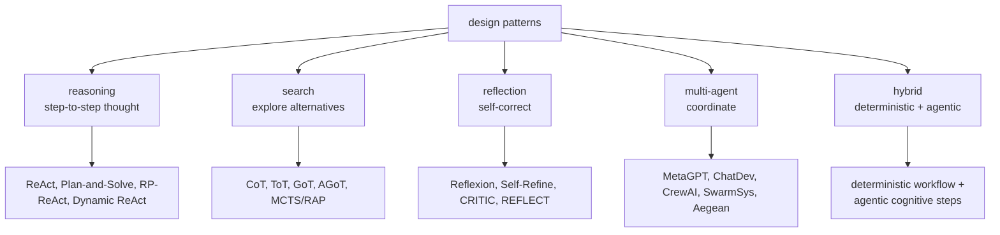
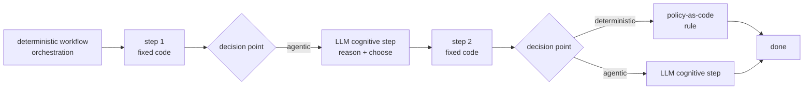

# Appendix A: Agent Design Patterns Reference

> **Lead paragraph.** This appendix collects every agent reasoning and coordination pattern named in the book into one reference. Each pattern is a *cognitive structure* — a fixed shape the agent's reasoning takes — chosen because it fits a class of problem. The patterns fall into five families: **reasoning** (how the agent thinks step to step), **search** (how it explores alternatives), **reflection** (how it corrects itself), **multi-agent** (how agents coordinate), and **hybrid** (how deterministic orchestration wraps agentic steps). Use this as a lookup: given a problem, find the family, then the pattern, then the chapter where it is built.

---

## A.1 The Five Families



<figcaption>Figure A.1 — The five design-pattern families and their members. Reasoning (step-to-step thought: ReAct, Plan-and-Solve, RP-ReAct, Dynamic ReAct), search (explore alternatives: CoT, ToT, GoT, AGoT, MCTS/RAP), reflection (self-correct: Reflexion, Self-Refine, CRITIC, REFLECT), multi-agent (coordinate: MetaGPT, ChatDev, CrewAI, SwarmSys, Aegean), and hybrid (the production pattern: deterministic workflow with agentic cognitive steps at decision points). Every pattern in the book belongs to one of these families.</figcaption>

---

## A.2 Reasoning Patterns

How the agent reasons step to step.

| Pattern | Structure | When to use | Reference |
|---|---|---|---|
| **ReAct** | Thought → Action → Observation, looped | Default agent loop; tool use interleaved with reasoning | Yao et al. 2023, [arXiv:2210.03629](https://arxiv.org/abs/2210.03629); Ch 6 |
| **Plan-and-Solve** | Generate full plan, then execute steps | Task decomposable upfront; steps mostly independent | Wang et al. 2023, [arXiv:2305.04091](https://arxiv.org/abs/2305.04091); Ch 18 |
| **RP-ReAct** | Reasoner-Planner supervises a ReAct Executor | Reasoning and execution should be separate, auditable layers | Dec 2025; Ch 25 |
| **Dynamic ReAct** | ReAct loop that adapts its control flow on feedback | Environment changes mid-task; fixed plan would go stale | Ch 25 |

---

## A.3 Search Patterns

How the agent explores alternatives rather than committing to one path.

| Pattern | Structure | When to use | Reference |
|---|---|---|---|
| **Chain-of-Thought (CoT)** | Linear chain of intermediate steps | Single reasoning path suffices | Wei et al. 2022, [arXiv:2201.11903](https://arxiv.org/abs/2201.11903); Ch 7 |
| **Tree of Thoughts (ToT)** | Tree search over thought states; backtrack | Multiple branches worth exploring; dead ends common | Yao et al. 2023, [arXiv:2305.10601](https://arxiv.org/abs/2305.10601); Ch 20 |
| **Graph of Thoughts (GoT)** | DAG with aggregation across branches | Branches should merge/contribute to a synthesis | Besta et al. 2024, [arXiv:2305.16582](https://arxiv.org/abs/2305.16582); Ch 21 |
| **AGoT** | Adaptive GoT with dynamic subgraphs | Graph structure unknown ahead; grows with the problem | 2025; Ch 21 |
| **MCTS / RAP** | Monte Carlo Tree Search; LLM as world model + agent | Long-horizon planning; value of a node must be estimated | Hao et al. 2023 (RAP), [arXiv:2305.14992](https://arxiv.org/abs/2305.14992); Ch 20 |

---

## A.4 Reflection Patterns

How the agent corrects its own output.

| Pattern | Structure | When to use | Reference |
|---|---|---|---|
| **Reflexion** | Verbal reinforcement; store failures as text memory, retry | Iterative tasks where past failures carry lessons | Shinn et al. 2023, [arXiv:2303.11366](https://arxiv.org/abs/2303.11366); Ch 22 |
| **Self-Refine** | Generate → critique self → revise, until satisfied | Single-step outputs that benefit from polish | Madaan et al. 2023, [arXiv:2303.17651](https://arxiv.org/abs/2303.17651); Ch 22 |
| **CRITIC** | Generate, then critique *with tools* (verification), then revise | Critique needs external grounding, not self-judgment | Gou et al. 2024, [arXiv:2305.11738](https://arxiv.org/abs/2305.11738); Ch 22 |
| **REFLECT** | Principle-guided reasoning; principles constrain the critique | Critique must be principled and auditable, not freeform | Jan 2026, [arXiv:2601.18730](https://arxiv.org/abs/2601.18730); Ch 22 |

---

## A.5 Multi-Agent Patterns

How multiple agents coordinate.

| Pattern | Structure | When to use | Reference |
|---|---|---|---|
| **MetaGPT** | Standard operating procedures drive a software team | Software-style roles with handoffs | Ch 33 |
| **ChatDev** | Conversational software development (PM, dev, test) | Small, scripted multi-agent dev flow | Ch 33 |
| **CrewAI** | Role-based crews, each agent a role with tools | Composable role assignments | Ch 33 |
| **SwarmSys** | Pheromone-inspired swarm coordination | Many homogeneous agents, emergent coordination | Ch 34 |
| **Aegean** | Formal consensus protocol | Agents must agree under disagreement; correctness critical | Ch 34; [arXiv:2602.00755](https://arxiv.org/abs/2602.00755) (Constitutional Evolution) |

---

## A.6 Hybrid Patterns

The production pattern: deterministic orchestration wrapping agentic cognitive steps.



<figcaption>Figure A.2 — The hybrid pattern, the production default. A deterministic workflow orchestrates fixed steps; at each decision point, the workflow either applies a deterministic rule (policy-as-code, Chapter 48) or delegates to an LLM cognitive step (reason + choose). This combines the reproducibility and auditability of deterministic orchestration with the flexibility of agentic reasoning at the points where flexibility is needed — and only there.</figcaption>

- **Deterministic workflow + agentic cognitive steps** — the production pattern. Orchestration is deterministic (reproducible, auditable); cognitive steps (the LLM calls) sit at decision points where flexibility is required. This is the shape of every production agent in Part VI and the domain chapters of Part VII — the pattern Chapter 53's SWE agent and Chapter 60's deep-research agent both instantiate.

---

## A.7 A Pattern Registry in Code

A lookup that maps a problem's properties to a recommended pattern family — the same shape the chapter projects used, condensed.

```python
from dataclasses import dataclass


@dataclass
class ProblemProfile:
    decomposable_upfront: bool   # plan can be made whole, then executed
    branches_worth_exploring: bool  # alternatives exist
    branches_merge: bool         # branches should synthesize
    benefits_from_retry: bool    # failures carry lessons
    needs_external_grounding: bool  # critique needs tools
    many_homogeneous_agents: bool


def recommend_pattern(p: ProblemProfile) -> str:
    """Map a problem's properties to a recommended pattern family."""
    if p.many_homogeneous_agents:
        return "multi-agent (swarm/crew)"
    if p.branches_merge:
        return "search: GoT"
    if p.branches_worth_exploring:
        return "search: ToT or MCTS"
    if p.needs_external_grounding:
        return "reflection: CRITIC"
    if p.benefits_from_retry:
        return "reflection: Reflexion"
    if p.decomposable_upfront:
        return "reasoning: Plan-and-Solve"
    return "reasoning: ReAct"
```

The registry is a decision tree over problem properties: many homogeneous agents → multi-agent; merging branches → GoT; alternatives to explore → ToT/MCTS; critique needing tools → CRITIC; retry carrying lessons → Reflexion; decomposable upfront → Plan-and-Solve; default → ReAct. It encodes the selection logic the book argues implicitly, made explicit so a practitioner can pick a pattern from a problem rather than from habit.

---

## Summary

- Agent design patterns fall into five families: **reasoning** (ReAct, Plan-and-Solve, RP-ReAct, Dynamic ReAct), **search** (CoT, ToT, GoT, AGoT, MCTS/RAP), **reflection** (Reflexion, Self-Refine, CRITIC, REFLECT), **multi-agent** (MetaGPT, ChatDev, CrewAI, SwarmSys, Aegean), and **hybrid** (deterministic workflow + agentic cognitive steps).
- Each pattern is a cognitive structure chosen because it fits a class of problem: ReAct for interleaved tool use, Plan-and-Solve for upfront-decomposable tasks, ToT/MCTS for branching search, GoT for merging branches, Reflexion/CRITIC for self-correction, multi-agent patterns for coordination, and the hybrid pattern for production.
- The hybrid pattern — deterministic orchestration with agentic cognitive steps at decision points — is the production default; every production agent in Part VI and Part VII instantiates it.
- The pattern registry maps a problem's properties (decomposable, branching, merging, retry-benefiting, externally-grounded, multi-agent) to a recommended family, making pattern selection a function of the problem rather than of habit.

---

## Further Reading

- [Chapter 6 — The Agent Loop] — ReAct in full.
- [Chapter 20 — Search Agents] — ToT and MCTS.
- [Chapter 22 — Self-Reflection] — Reflexion, Self-Refine, CRITIC.
- [Chapters 33–34 — Multi-Agent Systems] — coordination patterns.
- [Chapter 48 — Policy-as-Code] — the deterministic rule layer of the hybrid pattern.

---