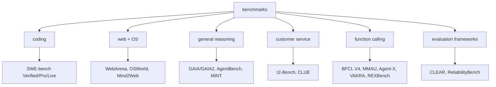
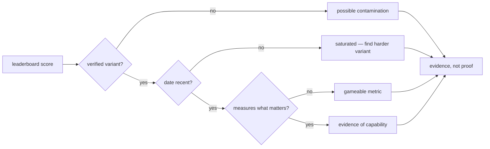

# Appendix B: Benchmarks and Leaderboards

> **Lead paragraph.** A benchmark is a fixed task set with a scoring rule; a leaderboard ranks systems on it. This appendix catalogs the benchmarks referenced across the book, grouped by what they measure: coding, web and OS, general reasoning, customer service, function calling, and evaluation frameworks. Each entry notes the task, what it measures, its URL where public, and the chapter that uses it. Two cautions apply throughout: benchmarks are **gameable** (Chapter 16, Chapter 53's SWE-bench contamination), so a score is evidence of capability, not proof; and benchmarks **date** (a frontier model saturates them, then a harder variant appears), so always check the variant and the date.

---

## B.1 Benchmark Map

<figcaption>Figure B.1 — The benchmark map. Coding (SWE-bench family), web and OS (WebArena, OSWorld, Mind2Web), general reasoning (GAIA/GAIA2, AgentBench, MINT), customer service (τ2-Bench, CLUE), function calling (BFCL V4, MMAU, Agent-X, VAKRA, REXBench), and evaluation frameworks (CLEAR, ReliabilityBench) that measure meta-properties across benchmarks.</figcaption>

---

## B.2 Coding

| Benchmark | Task | Measures | URL / Reference | Chapter |
|---|---|---|---|---|
| **SWE-bench Verified** | 500 real GitHub issues, human-verified patches | Autonomous software engineering | [swebench.com](https://www.swebench.com/), [arXiv:2310.06770](https://arxiv.org/abs/2310.06770) | Ch 53 |
| **SWE-bench Pro** | 731 harder tasks | Engineering on harder, less-scaffolded issues | [swebench.com](https://www.swebench.com/) | Ch 53 |
| **SWE-bench Live** | Monthly fresh issues | Resistance to contamination (data is too new to be in training) | [swebench.com](https://www.swebench.com/) | Ch 53 |
| **HumanEval** | Synthetic function generation | Basic code generation | Deprecated for real-world agent evaluation | Ch 16 |

The SWE-bench family is the standard for autonomous coding agents. **Verified** is the clean baseline; **Pro** raises difficulty; **Live** counters contamination (the failure mode Chapter 53 documents, where models memorize the fixed test set). HumanEval remains useful for unit capability checks but does not measure agentic software engineering.

---

## B.3 Web and OS

| Benchmark | Task | Measures | URL / Reference | Chapter |
|---|---|---|---|---|
| **WebArena Verified** | Multi-step web navigation, real websites | Browser-agent reliability | [webarena.dev](https://webarena.dev/) | Ch 11 |
| **OSWorld-Verified** | Real computer-use tasks on a desktop OS | OS-level agent control | [os-world.github.io](https://os-world.github.io/) | Ch 12 |
| **Mind2Web** | Diverse web interaction tasks across sites | Web-task generalization | [mind2web.github.io](https://mind2web.github.io/) | Ch 11 |

Web and OS benchmarks measure *grounded* agency — the agent acts in a real interface, not a text simulation. The `-Verified` variants add human-checked task definitions to filter annotator noise, the same correction SWE-bench Verified made.

---

## B.4 General Reasoning

| Benchmark | Task | Measures | URL / Reference | Chapter |
|---|---|---|---|---|
| **GAIA / GAIA2** | Multi-step general-assistant reasoning questions | Real-world reasoning across tools and steps | [arXiv:2311.12983](https://arxiv.org/abs/2311.12983) | Ch 16 |
| **AgentBench** | 8 agent environments (OS, DB, web, etc.) | Broad agent capability | [github.com/THUDM/AgentBench](https://github.com/THUDM/AgentBench) | Ch 16 |
| **MINT** | Multi-turn interaction with tools + language feedback | Multi-turn tool use and feedback use | [arXiv:2309.10691](https://arxiv.org/abs/2309.10691) | Ch 16 |

GAIA is the canonical "general assistant" benchmark — questions a human could answer with tools but that require many steps and real reasoning. GAIA2 is the updated, hardened variant. AgentBench spans environments; MINT focuses specifically on the multi-turn interaction loop.

---

## B.5 Customer Service

| Benchmark | Task | Measures | URL / Reference | Chapter |
|---|---|---|---|---|
| **τ2-Bench (Tau2-Bench)** | Customer-service dialogs with policy compliance | Policy adherence under tool use | [arXiv:2406.12045](https://arxiv.org/abs/2406.12045) (τ-bench); [arXiv:2506.07982](https://arxiv.org/abs/2506.07982) (τ²-bench dual-control) | Ch 56 |
| **CLUE** | Conversational understanding | Intent and dialog comprehension | Ch 56 |

τ-bench and its successor τ²-bench (which adds dual-control — the user and the agent can both act) are the policy-compliance benchmarks for service agents, measuring whether the agent follows policy, not merely whether it resolves the request.

---

## B.6 Function Calling

| Benchmark | Task | Measures | URL / Reference | Chapter |
|---|---|---|---|---|
| **BFCL V4** | Berkeley Function Calling Leaderboard | Tool-call accuracy and format correctness | [gorilla.cs.berkeley.edu](https://gorilla.cs.berkeley.edu/) | Ch 46 |
| **MMAU** | Multi-step multi-agent function calling | Function calling in multi-agent settings | Ch 35 |
| **Agent-X** | Function-calling variants | Robustness of call selection | Ch 46 |
| **VAKRA** | Function-calling variants | Adversarial tool-call robustness | Ch 46 |
| **REXBench** | Function-calling variants | Reliability of execution | Ch 46 |

Function-calling benchmarks measure the agent's ability to choose and format the right tool call — the layer beneath the reasoning benchmarks. BFCL V4 is the reference leaderboard; the variants probe specific failure modes (multi-agent, adversarial, reliability).

---

## B.7 Evaluation Frameworks

Frameworks that measure meta-properties *across* benchmarks, rather than a single task.

| Framework | Measures | Reference | Chapter |
|---|---|---|---|
| **CLEAR** | Accuracy, Cost, Latency, Reliability, Safety — a five-axis scorecard | Ch 52 | Ch 52 |
| **ReliabilityBench** | Consistency, perturbation tolerance, fault tolerance | Ch 52 | Ch 52 |

CLEAR is the production scorecard — capability alone (accuracy) is insufficient; a deployed agent must also be cheap, fast, reliable, and safe. ReliabilityBench measures whether the agent is consistent under perturbation and fault, the properties that distinguish a deployed agent from a demo (the argument of Chapter 52 and the synthesis of Chapter 68).

---

## B.8 Reading a Leaderboard

<figcaption>Figure B.2 — How to read a leaderboard score. Check the variant (Verified/Live counter contamination and saturation), the date (frontier models saturate old benchmarks), and whether the metric measures what matters (gameable metrics reward optimization-for-the-metric, not the intent). A score that survives all three checks is evidence of capability — but still evidence, not proof, because any metric can be optimized for rather than its intent (Chapter 16, Chapter 68's evaluation-validity open problem).</figcaption>

---

## Summary

- Benchmarks group by what they measure: coding (SWE-bench Verified/Pro/Live), web and OS (WebArena, OSWorld, Mind2Web), general reasoning (GAIA/GAIA2, AgentBench, MINT), customer service (τ2-Bench, CLUE), function calling (BFCL V4, MMAU, Agent-X, VAKRA, REXBench), and evaluation frameworks (CLEAR, ReliabilityBench).
- The `-Verified` and `-Live` variants exist to counter contamination and saturation — the failure modes where a model memorizes a fixed test set (SWE-bench, Chapter 53) or saturates an old benchmark. Always check the variant and the date.
- CLEAR (Accuracy, Cost, Latency, Reliability, Safety) and ReliabilityBench measure meta-properties across benchmarks — the production scorecard that distinguishes a deployed agent from a demo, because capability alone is insufficient.
- A leaderboard score is evidence of capability, not proof: any metric can be optimized for rather than its intent (Chapter 16), and benchmarks date. Check the variant, the date, and whether the metric measures what matters before treating a score as meaningful.

---

## Further Reading

- [Chapter 16 — Single-Agent Evaluation] — the evaluation methodology.
- [Chapter 53 — Software Engineering Agents] — SWE-bench contamination.
- [Chapter 56 — Customer Service Agents] — τ-bench and τ²-bench.
- [Chapter 52 — Production Evaluation] — CLEAR and ReliabilityBench.

---