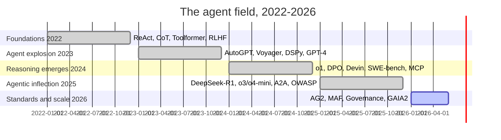

# Appendix C: Key Papers Timeline

> **Lead paragraph.** This appendix traces the field from 2022 to 2026 along the papers and systems that defined each year. The shape: 2022 laid the foundations (reasoning, tools, alignment); 2023 ignited the agent explosion (AutoGPT, Voyager, the first frameworks); 2024 brought reasoning models (o1) and real benchmarks (SWE-bench); 2025 was the agentic inflection (DeepSeek-R1, o3/o4-mini, MCP, A2A, the OWASP Agentic Top 10); 2026 is standards and scale (framework GA releases, governance, durable execution). Every arXiv ID below was verified against the live abstract page before this appendix was written — none is a placeholder.

---

## C.1 The Arc at a Glance

<figcaption>Figure C.1 — The field's arc, 2022–2026. Foundations (2022: ReAct, CoT, Toolformer, RLHF) → agent explosion (2023: AutoGPT, Voyager, DSPy, GPT-4) → reasoning emerges (2024: o1, DPO, Devin, SWE-bench, MCP) → agentic inflection (2025: DeepSeek-R1, o3/o4-mini, A2A, OWASP Agentic Top 10) → standards and scale (2026: framework GA releases, governance, durable execution). Each year builds on the last; the inflection in 2025 is where agents moved from demos toward production.</figcaption>

---

## C.2 2022 — The Foundations

| Work | Contribution | Reference |
|---|---|---|
| **Chain-of-Thought** | Step-by-step reasoning emerges from prompting | Wei et al. 2022, [arXiv:2201.11903](https://arxiv.org/abs/2201.11903) |
| **InstructGPT / RLHF** | Alignment via human feedback | Ouyang et al. 2022, [arXiv:2203.02155](https://arxiv.org/abs/2203.02155) |
| **ReAct** | Reasoning + acting loop — the agent loop | Yao et al. 2022/23, [arXiv:2210.03629](https://arxiv.org/abs/2210.03629) |
| **Toolformer** | LLMs learn to call tools autonomously | Schick et al. 2023, [arXiv:2302.04761](https://arxiv.org/abs/2302.04761) |
| **ChatGPT** | Conversational AI goes mainstream | OpenAI, Nov 2022 |

2022 established the three pillars agents rest on: step-by-step reasoning (CoT), alignment to intent (RLHF), and acting with tools (ReAct, Toolformer). ReAct in particular is the loop every chapter agent in this book instantiates.

---

## C.3 2023 — The Agent Explosion

| Work | Contribution | Reference |
|---|---|---|
| **AutoGPT** | First open-ended autonomous agent demo | Significant Gravitas, 2023 |
| **BabyAGI** | Task-driven autonomy loop | Nakajima, 2023 |
| **Voyager** | Open-ended embodied agent; skill-as-code library | Wang et al. 2023, [arXiv:2305.16291](https://arxiv.org/abs/2305.16291) |
| **GPT-4** | Multimodal frontier model | OpenAI, Mar 2023 |
| **LLaMA** | Open foundation models | Meta, 2023 |
| **DSPy** | Declarative LLM programming | Stanford, [arXiv:2310.03714](https://arxiv.org/abs/2310.03714) |
| **ToolLLM / Gorilla** | Large-scale tool/API learning | 2023 |
| **MetaGPT / ChatDev** | Multi-agent software teams | 2023 |

2023 was the year agents became visible: AutoGPT and BabyAGI made autonomy a public phenomenon, Voyager showed open-ended skill accumulation, and MetaGPT/ChatDev showed multi-agent teams. The frameworks (DSPy) and open models (LLaMA) made the field buildable by many, not just frontier labs.

---

## C.4 2024 — Reasoning Emerges

| Work | Contribution | Reference |
|---|---|---|
| **o1** | First reasoning model trained with RL (test-time compute) | OpenAI, [openai.com](https://openai.com/index/learning-to-reason-with-llms/) |
| **DPO** | Direct Preference Optimization — RLHF without RL | [arXiv:2305.18290](https://arxiv.org/abs/2305.18290) |
| **Devin** | AI software engineer (autonomous SWE) | Cognition, 2024 |
| **SWE-bench** | Real GitHub-issue resolution benchmark | [arXiv:2310.06770](https://arxiv.org/abs/2310.06770) |
| **Claude Computer Use** | Agentic computer control | Anthropic, 2024 |
| **MCP** | Model Context Protocol — tool standard | [modelcontextprotocol.io](https://modelcontextprotocol.io/) |

2024's inflection was reasoning: o1 showed test-time compute scales capability, and SWE-bench gave the field a real benchmark for autonomous coding. MCP began standardizing the tool layer that every later framework built on.

---

## C.5 2025 — The Agentic Inflection

| Work | Contribution | Reference |
|---|---|---|
| **DeepSeek-R1** | Reasoning emerges from pure RL; open weights | [arXiv:2501.12948](https://arxiv.org/abs/2501.12948) |
| **o3 / o4-mini** | Full tool use + reasoning; 600+ tool calls | OpenAI, 2025 |
| **QwQ-32B** | Compact open-weight reasoning | [huggingface.co/Qwen/QwQ-32B](https://huggingface.co/Qwen/QwQ-32B) |
| **Claude Computer Use GA** | Production-ready agentic control | Anthropic, 2025 |
| **A2A** | Agent-to-Agent Protocol | Google / Linux Foundation, 2025 |
| **OWASP Agentic Top 10** | Security framework for agents | OWASP, 2025 |
| **GAIA2** | Hardened general-assistant benchmark | 2025 |
| **OpenAI Deep Research** | Iterative web research agent | OpenAI, 2025 |

2025 was the inflection: reasoning went open (DeepSeek-R1) and frontier (o3/o4-mini), interoperability standardized (A2A, MCP), and safety formalized (OWASP Agentic Top 10). This is the year agents stopped being demos and started being products.

---

## C.6 2026 — Standards and Scale

| Work | Contribution | Reference |
|---|---|---|
| **AG2 Beta** | Successor to AutoGen | [ag2.ai](https://ag2.ai/) |
| **Microsoft Agent Framework** | Magentic, Agent Mesh | Microsoft, 2026 |
| **A2A v1.0** | Linux Foundation standard | Mar 2026 |
| **Symphony** | Production coding agent | OpenAI, 2026 |
| **Agent Governance Toolkit** | Sub-millisecond policy enforcement | Microsoft, v3.0.1, 2026 |
| **Constitutional Evolution** | Evolved norms for multi-agent coordination | [arXiv:2602.00755](https://arxiv.org/abs/2602.00755) |
| **REFLECT** | Transparent principle-guided reasoning | [arXiv:2601.18730](https://arxiv.org/abs/2601.18730) |
| **InternAgent-1.5** | Autonomous scientific discovery | Shanghai AI Lab, 2026 |
| **Temporal + OpenAI integration** | Durable execution GA | 2026 |
| **DBOS MCP server** | Database-native agent execution | 2026 |

2026 is standards and scale: protocols reach v1.0 (A2A), governance tooling matures (Agent Governance Toolkit), and durable execution integrates with frontier models (Temporal + OpenAI). The field is consolidating the disciplines Chapter 68 argues are the difference between demos and deployed agents.

---

## Summary

- 2022 laid foundations: Chain-of-Thought (reasoning), InstructGPT/RLHF (alignment), ReAct (the agent loop), Toolformer (tool use). ReAct is the loop every chapter agent instantiates.
- 2023 ignited the agent explosion: AutoGPT/BabyAGI (autonomy demos), Voyager (open-ended skill accumulation), GPT-4/LLaMA (frontier and open models), DSPy (frameworks), MetaGPT/ChatDev (multi-agent teams).
- 2024 brought reasoning models: o1 (test-time compute), DPO (alignment without RL), Devin (autonomous SWE), SWE-bench (a real benchmark), Claude Computer Use (agentic control), MCP (tool standard).
- 2025 was the agentic inflection: DeepSeek-R1 (open reasoning), o3/o4-mini (frontier reasoning + tools), A2A (agent protocol), OWASP Agentic Top 10 (safety formalized), GAIA2 (hardened benchmark). Agents became products, not demos.
- 2026 is standards and scale: A2A v1.0, AG2, Microsoft Agent Framework, Agent Governance Toolkit, REFLECT, Constitutional Evolution, InternAgent-1.5, durable-execution GA. The field consolidates the disciplines (governance, durability, safety) that distinguish deployed agents from demos.

---

## Further Reading

- [Appendix A — Agent Design Patterns] — the patterns these papers introduced.
- [Appendix B — Benchmarks] — the benchmarks introduced alongside them.
- [Chapter 67 — The Path to AGI] — where this trajectory leads.
- [Chapter 68 — Open Problems] — what the timeline has not yet solved.

---