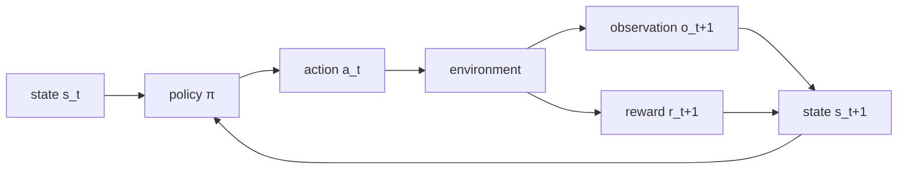

# Appendix D: Notation and Glossary

> **Lead paragraph.** This appendix fixes the notation and terminology used throughout the book. The notation follows the agent formalism (state, observation, action, reward, trajectory) and the math conventions of the front matter (juxtaposition for matrix products, `\odot` for element-wise, `^\top` for dot products). The glossary defines every term as the book uses it — because terms like "skill", "plan", and "policy" are overloaded across communities, and a fixed definition is what makes the chapters reference one another consistently.

---

## D.1 Agent Formalism

| Symbol | Name | Meaning |
|---|---|---|
| $S$ | State | Agent's internal representation at time $t$ |
| $O$ | Observation | What the agent perceives from the environment |
| $A$ | Action | What the agent does |
| $R$ | Reward | Evaluative feedback signal |
| $\tau$ | Trajectory | Sequence of $(S, O, A, R)$ over time |
| $\pi$ | Policy | Mapping from states to action distributions, $\pi(a \mid s)$ |
| $V$ | Value function | Expected cumulative reward from a state, $V(s) = \mathbb{E}\!\left[\sum_t R_t\right]$ |

<figcaption>Figure D.1 — The agent formalism. The policy $\pi$ maps state $s_t$ to action $a_t$; the environment responds with observation $o_{t+1}$ and reward $r_{t+1}$; the new state $s_{t+1}$ feeds back to the policy. A trajectory $\tau$ is the sequence of $(S, O, A, R)$ tuples; an episode is one complete task execution from start to finish.</figcaption>

---

## D.2 Math Notation

The conventions used across the book (from the front matter):

| Operation | Symbol | Example |
|---|---|---|
| Matrix multiply | juxtaposition | $QK^\top$ |
| Element-wise product | $\odot$ | $f_t \odot c_{t-1}$ |
| Dot product | $^\top$ | $q_i^\top k_j$ |
| Scalar × anything | juxtaposition or $\cdot$ | $\alpha x$ |
| Shape / count | $\times$ | $\mathbb{R}^{n \times d_k}$ |

**Never** use `\cdot` for matrix multiplication (use juxtaposition); **never** use bare juxtaposition or `*` for element-wise products (use `\odot`); **never** use $q \cdot k$ for dot products (use $q^\top k$).

---

## D.3 Architecture Terms

| Term | Definition |
|---|---|
| **Tool** | A callable function with a schema the agent can invoke |
| **Skill** | A reusable procedure learned or written from experience (Chapter 59) |
| **Plan** | A sequence or graph of subgoals toward a goal |
| **Subgoal** | An intermediate objective in a plan |
| **Checkpoint** | Saved agent state for resumption (Chapter 51) |
| **Episode** | A complete task execution from start to finish |
| **Trajectory** | The sequence of $(S, O, A, R)$ over an episode |

The distinction between **tool** (fixed function, called) and **skill** (procedure, executed as code — Voyager's pattern, Chapter 59) matters: a tool is invoked, a skill is *run* and can itself call tools. A **plan** is the structure over subgoals; a **checkpoint** is the persistence layer that makes a long plan resumable.

---

## D.4 Training Terms

| Term | Definition |
|---|---|
| **PRM** | Process Reward Model — scores each reasoning step |
| **ORM** | Outcome Reward Model — scores the final result only |
| **RLVR** | Reinforcement Learning with Verifiable Rewards |
| **GRPO** | Group Relative Policy Optimization |
| **MCTS** | Monte Carlo Tree Search |
| **DAG** | Directed Acyclic Graph |

PRM vs ORM is the central distinction in reasoning-model training (Chapter 15): a PRM rewards the *process* (each step), an ORM rewards only the *outcome* (the final answer). RLVR trains on rewards that can be verified (a math answer is right or wrong), which is why DeepSeek-R1's reasoning emerged from pure RL — the reward was verifiable. GRPO is the policy-optimization variant that scales without a separate value model.

---

## D.5 Evaluation Terms

| Term | Definition |
|---|---|
| **pass@k** | Pass rate with $k$ samples — the capability ceiling (any of $k$ passes) |
| **pass^k** | All $k$ must pass — the reliability floor (every one passes) |
| **SLA** | Service Level Agreement |
| **MTTR** | Mean Time To Recovery |

The `pass@k` vs `pass^k` distinction (Chapter 16) captures capability vs reliability: `pass@k` measures the ceiling (can it ever do this?), `pass^k` measures the floor (does it always?). A production agent is judged on `pass^k`, not `pass@k` — reliability, not peak capability.

---

## D.6 Protocol Terms

| Term | Definition |
|---|---|
| **MCP** | Model Context Protocol — standardizes tool/context exposure to models |
| **A2A** | Agent-to-Agent Protocol — standardizes agent-to-agent communication |
| **AG-UI** | Agent-User Interaction Protocol — standardizes the agent–user stream |

The three protocols (Chapter 46) layer: MCP connects agents to tools, A2A connects agents to each other, AG-UI connects agents to users. Together they are the interoperability substrate that lets agents from different frameworks cooperate.

---

## Summary

- Agent formalism: state $S$, observation $O$, action $A$, reward $R$, trajectory $\tau$ (the $(S,O,A,R)$ sequence), policy $\pi$ (state → action distribution), value function $V$ (expected cumulative reward). An episode is one complete task execution.
- Math notation: juxtaposition for matrix products, $\odot$ for element-wise, $^\top$ for dot products, $\times$ for shape/count. Never `\cdot` for matrix mult, never bare juxtaposition/`*` for element-wise, never $q \cdot k$ for dot products.
- Architecture: a tool is invoked, a skill is run (and can call tools); a plan structures subgoals; a checkpoint persists state for resumption.
- Training: PRM scores process (each step), ORM scores outcome (final only); RLVR trains on verifiable rewards; GRPO is the value-free policy optimizer. Evaluation: `pass@k` is the capability ceiling, `pass^k` is the reliability floor; production judges `pass^k`.
- Protocols: MCP (agent↔tools), A2A (agent↔agent), AG-UI (agent↔user) — the interoperability substrate.

---

## Further Reading

- [Chapter 6 — The Agent Loop] — the formalism in action.
- [Chapter 15 — PRM Training] — PRM vs ORM.
- [Chapter 16 — Evaluation] — `pass@k` vs `pass^k`.
- [Chapter 46 — MCP/A2A/AG-UI] — the protocol layer.

---