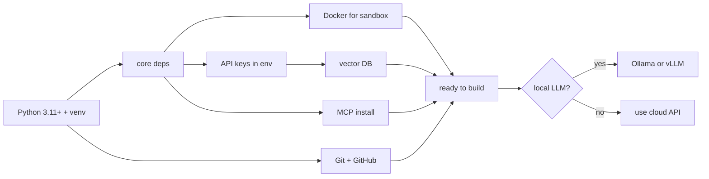

# Appendix E: Project Setup and Environment

> **Lead paragraph.** This appendix is the setup guide for every code project in the book. It covers the Python environment, core dependencies, Docker for sandboxing, API keys, vector-database setup, MCP installation, Git, and hardware requirements. Every chapter's `LLMClient` uses the same two-mode pattern (OpenAI or local Ollama), so getting the environment right once unblocks all 12 project chapters (Ch 6, 11, 12, 13, 14, 20, 25, 33, 41, 45, 53, 60). The rule throughout: **never hardcode API keys** — read them from the environment.

---

## E.1 The Setup Pipeline



<figcaption>Figure E.1 — The setup pipeline. Python 3.11+ in a venv → install core deps → Docker for sandboxing, API keys in the environment, a vector DB, MCP, and Git. With those in place, every project chapter runs. The optional branch — a local LLM via Ollama or vLLM — is what the `use_ollama=True` flag in every chapter's `LLMClient` switches to.</figcaption>

---

## E.2 Python Environment

- **Python 3.11+** required (3.12 recommended).
- **uv** (recommended, fast) or **pip** for package management.
- **Virtual environment** — isolate per-project:

```bash
python -m venv .venv
source .venv/bin/activate   # macOS/Linux
# .venv\Scripts\activate    # Windows
```

Use `uv`:

```bash
uv venv
source .venv/bin/activate
uv pip install <package>
```

---

## E.3 Core Dependencies

```bash
pip install torch numpy pandas requests        # numerical + HTTP
pip install openai anthropic                   # API clients
pip install faiss-cpu                          # vector search (or faiss-gpu)
pip install chromadb                           # alternative vector DB
pip install networkx                           # knowledge graphs
pip install playwright                         # browser automation (Ch 11)
pip install pytest                             # testing
```

**Project-chapter mapping**: `playwright` for Chapter 11 (browser agent), `networkx` for Chapter 60 (deep-research knowledge graph), `faiss-cpu`/`chromadb` for Chapter 41 (long-term memory) and Chapter 13 (RAG), `torch` for the architecture chapters (Ch 3+) and every Agentic Code Project that touches models.

---

## E.4 Docker (Sandboxing)

- **Docker Desktop** — [docker.com](https://www.docker.com/products/docker-desktop/)
- Used to sandbox agent tool execution (Chapter 47's containment, Chapter 12's terminal agent).

```bash
docker run --rm -it python:3.11-slim bash      # quick sandbox shell
```

The principle: run untrusted agent output (file writes, shell commands) inside a container with a scoped filesystem and no host network by default — the least-privilege containment of Chapter 47.

---

## E.5 API Keys (Never Hardcode)

Every chapter's `LLMClient` reads keys from the environment, never from a string literal:

```bash
export OPENAI_API_KEY="sk-..."        # https://platform.openai.com/
export ANTHROPIC_API_KEY="sk-ant-..."  # https://console.anthropic.com/
export SERPAPI_KEY="..."               # web search, https://serpapi.com/
```

Put these in a `.env` file (gitignored) or your shell profile. The `LLMClient` pattern:

```python
import os, openai

class LLMClient:
    def __init__(self, model="gpt-5.5", use_ollama=False):
        self.model = model
        if use_ollama:
            self.client = openai.OpenAI(
                base_url="http://localhost:11434/v1", api_key="ollama")
        else:
            self.client = openai.OpenAI(api_key=os.getenv("OPENAI_API_KEY"))
```

The `use_ollama` flag is the book's convention: `False` (default) uses the cloud API with `os.getenv("OPENAI_API_KEY")`; `True` flips to a local Ollama endpoint at `http://localhost:11434/v1` with the literal key `"ollama"` (Ollama ignores it). Every chapter project uses this exact shape.

---

## E.6 Optional: Local LLM

For offline or private runs, use a local model:

- **Ollama** — [ollama.com](https://ollama.com/) — easiest; OpenAI-compatible endpoint.
- **vLLM** — [github.com/vllm-project/vllm](https://github.com/vllm-project/vllm) — high-throughput serving.

```bash
ollama serve                      # start the server
ollama pull qwen2.5:7b            # pull a model
```

Then set `use_ollama=True` in any chapter's `LLMClient`. The local path trades frontier capability for privacy, latency, and zero per-call cost — the trade-off Chapter 68's "small models for edge agents" question explores.

---

## E.7 Vector Database Setup

| Option | Type | Install | Use when |
|---|---|---|---|
| **FAISS** | Local, in-process | `pip install faiss-cpu` | No server; embedded search (Ch 13, 41) |
| **Chroma** | Local with persistence | `pip install chromadb` | Persistent local store |
| **Pinecone** | Cloud | [pinecone.io](https://www.pinecone.io/) | Managed, scaled |

```python
import faiss, numpy as np

DIM = 1536
index = faiss.IndexFlatL2(DIM)
vectors = np.random.rand(100, DIM).astype("float32")
index.add(vectors)
D, I = index.search(vectors[:1], k=5)   # nearest neighbors
```

FAISS for local prototyping, Chroma for persistent local storage, Pinecone for managed cloud scale — pick by where your data and scale sit.

---

## E.8 MCP Server Installation

- **MCP SDK** — `pip install mcp`
- **Official servers** — [github.com/modelcontextprotocol/servers](https://github.com/modelcontextprotocol/servers)
- **Configuration** — `claude_desktop_config.json` or your framework's equivalent.

```bash
pip install mcp
```

MCP (Chapter 46) standardizes how tools are exposed to models; the official servers cover files, search, databases, and more, so you compose rather than build each tool integration.

---

## E.9 Git Setup

- **Git** — [git-scm.com](https://git-scm.com/)
- **GitHub account** — for the SWE agent project (Chapter 53) and source hosting.

```bash
git config --global user.name "Your Name"
git config --global user.email "you@example.com"
```

For the book repo specifically, activate the pre-commit hook that syncs raw markdown assets (Chapter on publishing):

```bash
ln -sf ../../scripts/pre-commit .git/hooks/pre-commit
```

---

## E.10 Hardware Requirements

| Tier | Spec | Runs |
|---|---|---|
| **Minimum** | 8 GB RAM, any modern CPU | All cloud-API projects |
| **Recommended** | 16 GB RAM, GPU | Local small models, faster vectors |
| **Training projects** | 24 GB+ VRAM GPU (or cloud: Lambda, RunPod, Vast.ai) | PRM/RL training (Ch 15) |

Most chapter projects run on the **minimum** tier because they call a cloud API. The GPU tiers matter only for local-LLM serving and the training chapters — and for training, cloud GPUs (Lambda, RunPod, Vast.ai) are cheaper than buying.

---

## Summary

- Setup pipeline: Python 3.11+ in a venv → core deps → Docker, env API keys, vector DB, MCP, Git → ready for every project chapter. The optional local-LLM branch (Ollama/vLLM) is what `use_ollama=True` switches to.
- Core deps map to chapters: `playwright` (Ch 11), `networkx` (Ch 60), `faiss-cpu`/`chromadb` (Ch 13, 41), `torch` (Ch 3+, architecture projects).
- **Never hardcode API keys** — read from `os.getenv`. Every chapter's `LLMClient` uses the same `use_ollama` flag: cloud API with `os.getenv("OPENAI_API_KEY")` when False, local Ollama endpoint when True.
- Vector DBs: FAISS (local in-process), Chroma (local persistent), Pinecone (cloud) — pick by data location and scale. MCP (`pip install mcp`) standardizes tool exposure; official servers cover common integrations.
- Hardware: minimum tier (8 GB, cloud API) runs most projects; GPU tiers only for local-LLM serving and training chapters, where cloud GPUs beat buying.

---

## Further Reading

- [Chapter 6 — The Agent Loop] — the first project; uses `LLMClient`.
- [Chapter 11 — Browser Agent] — uses `playwright`.
- [Chapter 41 — Long-Term Memory] — uses a vector DB.
- [Chapter 47 — Security and Sandboxing] — the Docker containment rationale.
- [Chapter 46 — MCP/A2A/AG-UI] — the MCP installation context.

---