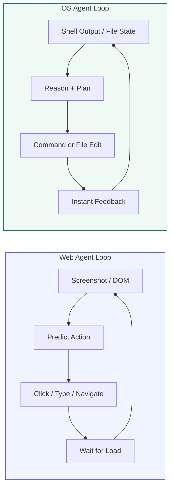
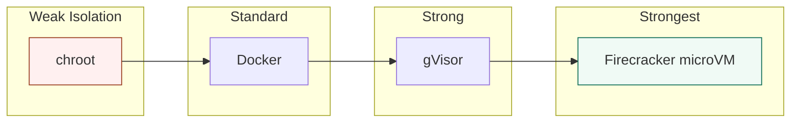
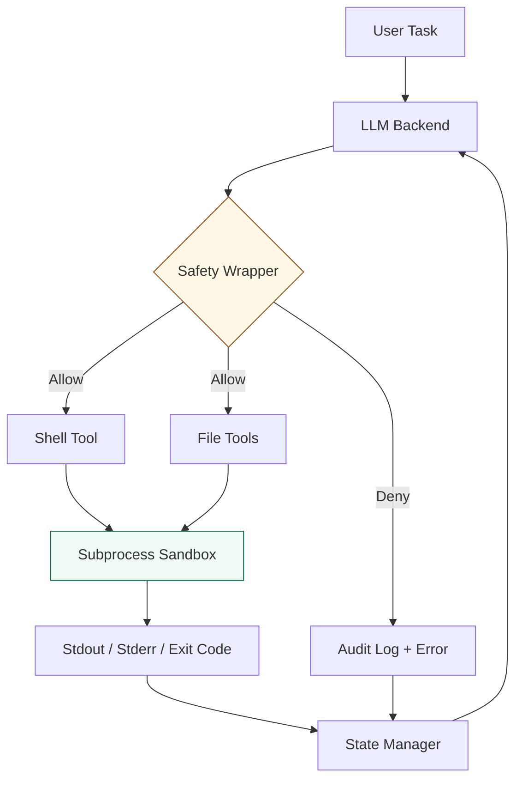

# Chapter 12: File System and OS Agents

> In 2024, the best multimodal agents could barely open a spreadsheet: OSWorld reported a 12% success rate on real desktop tasks, far below the human baseline of 72%. Two years later, frontier agents navigate terminals, edit files, install packages, and run tests with verified scores above 60% — and the gap is still closing. The difference between a web agent and an OS agent is the difference between browsing a museum and rewiring the building. The browser offers a curated viewport; the shell offers raw access to the machine itself. By the end of this chapter you will build a complete terminal agent in pure Python that executes shell commands with timeout protection, reads and writes files, manages its working directory, recovers from errors, and runs inside a configurable safety wrapper that defaults to read-only access and logs every action.

---

## 1. The OS as an Agent Environment

### 1.1 Shell, Files, and Processes

The operating system is the native environment for agency. Every other domain — the web, a database, a game engine — sits on top of it. When an agent gains shell access, it gains the ability to create, destroy, and transform anything the user can touch: source code, configuration, running services, and data.

The action space of an OS agent is deceptively simple. At the core are four primitives:

- **Shell execution**: running commands via bash, PowerShell, or zsh, with captured stdout, stderr, and exit codes.
- **File I/O**: reading, writing, listing, searching, and moving files.
- **Process management**: starting background tasks, monitoring CPU or memory, and terminating stale processes.
- **Package management**: installing dependencies via pip, npm, apt, or brew.

Each primitive seems straightforward, but composition creates explosive complexity. A single `git clone` followed by `pip install -r requirements.txt` and `pytest` can modify hundreds of files, spawn subprocesses, and alter global state. Unlike a web agent whose worst mistake is clicking the wrong button, an OS agent can corrupt a git repository, delete a home directory, or exfiltrate credentials.

The state space is also continuous in a way that web pages are not. A DOM is a discrete snapshot; a filesystem is a tree that evolves in time, with hidden state in environment variables, open file descriptors, and running daemons. The agent must maintain a mental model of this evolving state across multiple commands, not just parse a static page.

### 1.2 From Web to OS: Why the Terminal is Different

Web agents perceive through screenshots and DOM trees. OS agents perceive through text streams. This difference shapes every design decision downstream.

A screenshot is dense: a 1920×1080 RGB image contains roughly six million values. A terminal output is sparse: a few kilobytes of structured text. Where a web agent struggles with visual grounding — finding the exact pixel coordinates of a button — an OS agent struggles with semantic grounding. The output of `ls -la` is perfectly structured, but the agent must infer that `requirements.txt` implies a Python project, that `package.json` implies Node.js, and that the absence of a `.git` directory means the agent is not inside a version-controlled repository.

The feedback loop is also tighter. A web agent clicks, waits for a page load, and observes. An OS agent runs `make`, watches a stream of compiler errors in real time, and must decide whether to fix the first error, fix all errors at once, or abort because the build environment is misconfigured. The terminal demands interleaved reasoning and execution in a way that the browser does not.



<figcaption>Figure 12.1 — Web agents wait for page transitions; OS agents receive immediate, streaming feedback from the shell. The loop frequency and error density differ by orders of magnitude.</figcaption>

---

## 2. Benchmarking OS Agents

### 2.1 OSWorld and OSWorld-Verified

Until 2024, there was no rigorous way to measure whether an agent could actually use a computer. Synthetic benchmarks like MiniWOB tested isolated web forms, but real desktop workflows — opening LibreOffice, configuring Thunderbird, compiling a LaTeX document — remained unmeasured. OSWorld changed this by providing 369 open-ended tasks on live Ubuntu, Windows, and macOS instances, evaluated by an automated verifier that checks the final system state.

The original launch revealed a chasm: the best models scored 12.24% against a human baseline of 72.36%. Tasks that humans complete in thirty seconds — "change the desktop wallpaper to a solid blue color" — stumped agents for dozens of steps. The problem was not raw intelligence but grounding: agents lacked the precise mapping from high-level intent to low-level GUI coordinates and shell incantations.

In July 2025, the OSWorld team released **OSWorld-Verified**, a major revision that fixed over 300 flaky tasks and migrated evaluation to centralized AWS infrastructure. Verification is now public: researchers must schedule a live run with the maintainers to appear on the official leaderboard. This prevents the self-reported score inflation that plagued earlier benchmarks.

As of late 2025, the verified leaderboard tells a clear story. Agentic frameworks — multi-model orchestration systems with planners and verifiers — dominate over raw foundation models. CoACT-1 leads at 60.76%, followed by Agent S2.5 with o3 at 56.0%. Even the best general-purpose model, Claude 4 Sonnet, reaches only 43.9% without scaffolding. The message is unambiguous: reasoning alone is insufficient; the agent needs structured tool use, planning loops, and error recovery to operate a computer effectively.

| Rank | System | Type | OSWorld-Verified Score |
|------|--------|------|------------------------|
| 1 | CoACT-1 | Agentic Framework | 60.76% |
| 2 | Agent S2.5 w/ o3 | Agentic Framework | 56.0% |
| 3 | GTA1 w/ o3 | Agentic Framework | 53.1% |
| — | Claude 4 Sonnet | General Model | 43.9% |
| — | Human Baseline | Human | ~72.36% |

<figcaption>Table 12.1 — Verified OSWorld leaderboard as of late 2025. Agentic frameworks consistently outperform raw foundation models, but even the best system remains more than ten points below human performance.</figcaption>

### 2.2 OSWorld-MCP: Tools Plus GUI

A second development in 2025 reframed what it means to be an OS agent. **OSWorld-MCP** augments the benchmark with 158 structured tools accessed via the Model Context Protocol (MCP), allowing agents to invoke APIs — open a file, send an email, resize a window — rather than relying solely on GUI interaction. The results are striking: proper MCP tool use improves success rates by up to 15.7% in some task categories.

This validates a hypothesis central to this chapter. The best terminal and OS agents are not pure visual agents that click and type like humans. They are hybrid systems that use structured tools — shell commands, file APIs, package managers — wherever possible, and fall back to GUI interaction only when no API exists. A terminal agent that can run `git status` directly is more reliable than one that tries to parse a screenshot of the terminal window.

> **💡 Key Insight**
>
> The terminal is not a handicap; it is a superpower. Structured text output from shell commands is far easier for an LLM to parse and act upon than pixel-based perception. The best OS agents use the terminal as their primary sensor and actuator, reserving GUI interaction for tasks that lack command-line equivalents.

---

## 3. Safety and Sandboxing

### 3.1 The Danger of Unconstrained Shell Access

Giving an LLM unrestricted shell access is among the riskiest actions in modern AI deployment. A single malicious or hallucinated command can delete data, install malware, or exfiltrate secrets. In September 2025, a documented incident involved state-sponsored exploitation via a terminal agent that executed commands embedded in an innocent-looking document. The agent parsed the document, encountered what it interpreted as instructions, and ran them against a production server.

The attack surface is broad:

- **Data destruction**: `rm -rf /` or equivalent remains a one-line catastrophe.
- **Privilege escalation**: a command run as a standard user may exploit a sudo misconfiguration.
- **Supply chain poisoning**: `pip install` can pull packages from a compromised index.
- **Exfiltration**: `curl` can POST sensitive files to an external server in milliseconds.
- **Persistence**: a background process or cron job can maintain access after the agent session ends.

The OWASP Top 10 for Agentic Applications 2025 codified this risk as **ASI-05 (Unexpected Code Execution)**, stating that software-only sandboxing is insufficient and all LLM-generated code must execute in an isolated environment with no access to the underlying host.

### 3.2 The Isolation Spectrum

Not all sandboxes are equal. The industry has settled into a four-layer hierarchy, each offering a different trade-off between isolation strength and startup latency.

At the weakest end, **chroot** changes the apparent root directory but shares the host kernel. It stops naive directory traversal but offers no protection against kernel exploits or privileged escalation. **Docker containers** improve this with namespaces and cgroups, yet they still share the host kernel. A kernel vulnerability in one container can compromise the entire host, which is unacceptable for untrusted AI-generated code.

**gVisor**, developed by Google, intercepts system calls in userspace. It provides stronger isolation than Docker without the overhead of a full virtual machine, making it popular for compute-heavy SaaS platforms. Modal and Northflank use gVisor for this reason. However, it is not hardware-enforced; a bug in the syscall interceptor is a potential escape route.

At the strongest end, **Firecracker microVMs** provide hardware-enforced isolation via KVM. Each sandbox runs its own kernel, memory space, and filesystem. Boot time is roughly 125 milliseconds — slower than a container, but negligible compared to LLM inference latency. E2B, an open-source sandboxing platform built on Firecracker, has become a standard substrate for AI agent execution, offering programmatic file and command APIs over ephemeral VMs that can spawn at rates up to 150 per second.



<figcaption>Figure 12.2 — The sandboxing hierarchy. Each step to the right adds isolation strength at a modest latency cost. For untrusted AI-generated code, Firecracker microVMs are becoming the production default.</figcaption>

In January 2026, Docker Desktop 4.58 made the shift explicit: it moved AI agent isolation from containers to microVMs, supporting Claude Code, Codex CLI, Copilot CLI, and Gemini CLI out of the box. The message from the infrastructure layer is clear — if the code came from an LLM, it runs in a VM.

### 3.3 Permission Scoping

Isolation alone is not enough. The agent must also operate under a principle of **least privilege**: read-only by default, write only to designated directories, and execution only after explicit approval. This is a runtime policy problem, not merely an infrastructure problem.

Modern terminal agents implement permission scoping through several mechanisms:

- **Capability tokens**: scoped, time-bounded permissions that grant `read:~/project` or `write:/tmp/build` rather than blanket access. Long-lived secrets are now recognized as the dominant root cause of agent-driven breaches.
- **Just-in-time (JIT) access**: credentials minted for a single session, expiring in minutes. If an agent is hijacked, the window of exploitation is narrow.
- **Default-deny policies**: every tool call is denied unless explicitly allowlisted. This inverts the traditional permissive model.
- **Approval gates**: high-stakes actions — writes outside the workspace, network egress, package installation — require human confirmation through a channel the agent cannot forge.

Claude Code implements this through permission modes cycled via `Shift+Tab`: Default (asks before edits and shell commands), Auto-accept (allows safe commands like `git status` without prompting), and Plan mode (read-only exploration before any action). OpenAI Codex CLI goes further with sandbox policies — `read-only`, `workspace-write`, and `danger-full-access` — enforced by Seatbelt on macOS, Landlock plus seccomp on Linux, and the native Windows sandbox.

### 3.4 Audit Logging

Every command executed, every file touched, every process started must be logged. Audit logging is non-negotiable for production terminal agents. A comprehensive audit record includes: agent identity, originating user, tool name and arguments, credential scope, policy decision, approval ID, timestamp, and result status.

The logs must be tamper-evident and queryable. When an incident occurs, an operator should be able to answer in seconds: which agent accessed which files, what commands were run, and who authorized them. Structured logs fed to a SIEM with anomaly detection — flagging unusual command sequences or sudden tool expansion — provide the earliest warning of compromise or runaway behavior.

---

## 4. Building a Terminal Agent

### 4.1 Architecture Overview

The terminal agent we will build follows the ReAct pattern from Chapter 6, adapted for structured environment interaction. It consists of five components:

1. **LLM backend**: generates thoughts and selects tools.
2. **Safety wrapper**: enforces permission policies before any command runs.
3. **Shell tool**: executes bash commands with timeout, capture, and exit-code tracking.
4. **File tools**: read, write, list, and search files within the workspace.
5. **State manager**: tracks the working directory, command history, and error context.



<figcaption>Figure 12.3 — TerminalAgent architecture. Every tool invocation passes through the safety wrapper before reaching the sandboxed environment. Denied actions are logged and returned as errors to the LLM, which may suggest an alternative.</figcaption>

### 4.2 The Shell Tool

The shell tool is the agent's primary actuator. It must capture output, enforce timeouts, and return structured results. We use Python's `subprocess` module with careful argument handling — never `os.system()` or `shell=True` with unsanitized input.

We implement the shell tool as a class with timeout enforcement and working-directory tracking.

```python
import subprocess
import shutil
from dataclasses import dataclass
from typing import Optional

@dataclass
class ShellResult:
    stdout: str
    stderr: str
    exit_code: int
    command: str
    cwd: str
    timed_out: bool = False

class ShellTool:
    """Execute shell commands with timeout and output capture."""

    def __init__(self, cwd: str = ".", default_timeout: int = 30):
        self.cwd = cwd
        self.default_timeout = default_timeout
        # Verify bash exists; fallback to sh
        self.shell = shutil.which("bash") or "/bin/sh"

    def run(self, command: str, timeout: Optional[int] = None) -> ShellResult:
        timeout = timeout or self.default_timeout
        try:
            proc = subprocess.run(
                [self.shell, "-c", command],
                cwd=self.cwd,
                capture_output=True,
                text=True,
                timeout=timeout,
            )
            return ShellResult(
                stdout=proc.stdout,
                stderr=proc.stderr,
                exit_code=proc.returncode,
                command=command,
                cwd=self.cwd,
                timed_out=False,
            )
        except subprocess.TimeoutExpired as exc:
            return ShellResult(
                stdout=exc.stdout or "",
                stderr=exc.stderr or "",
                exit_code=-1,
                command=command,
                cwd=self.cwd,
                timed_out=True,
            )
```

The `timeout` parameter is critical. A runaway `find /` or infinite loop in a test suite can hang an agent indefinitely. The default of thirty seconds is a pragmatic balance: long enough for most builds, short enough to prevent denial-of-service. The `timed_out` flag in the result lets the LLM decide whether to retry with a longer limit or abandon the approach.

### 4.3 File Tools

File operations give the agent structured access to the workspace without requiring shell parsing. We implement four primitives: read, write, list, and grep.

```python
import os
import glob
from pathlib import Path

class FileTools:
    """Safe file I/O scoped to a workspace directory."""

    def __init__(self, workspace: str):
        self.workspace = Path(workspace).resolve()

    def _resolve(self, rel_path: str) -> Path:
        """Resolve a path relative to workspace, preventing directory escape."""
        target = (self.workspace / rel_path).resolve()
        if not str(target).startswith(str(self.workspace)):
            raise PermissionError(f"Path escapes workspace: {rel_path}")
        return target

    def read(self, path: str, offset: int = 0, limit: int = 500) -> str:
        target = self._resolve(path)
        if not target.exists():
            return f"Error: file not found: {path}"
        with open(target, "r", encoding="utf-8", errors="replace") as f:
            lines = f.readlines()
        chunk = lines[offset:offset + limit]
        return "".join(chunk)

    def write(self, path: str, content: str, append: bool = False) -> str:
        target = self._resolve(path)
        target.parent.mkdir(parents=True, exist_ok=True)
        mode = "a" if append else "w"
        with open(target, mode, encoding="utf-8") as f:
            f.write(content)
        return f"Wrote {len(content)} characters to {path}"

    def list_dir(self, path: str = ".") -> str:
        target = self._resolve(path)
        if not target.is_dir():
            return f"Error: not a directory: {path}"
        entries = []
        for entry in sorted(target.iterdir()):
            kind = "d" if entry.is_dir() else "f"
            entries.append(f"{kind} {entry.name}")
        return "\n".join(entries)

    def grep(self, pattern: str, path: str = ".", glob_pattern: str = "*") -> str:
        target = self._resolve(path)
        matches = []
        for file_path in target.rglob(glob_pattern):
            if not file_path.is_file():
                continue
            try:
                with open(file_path, "r", encoding="utf-8", errors="replace") as f:
                    for i, line in enumerate(f, 1):
                        if pattern in line:
                            rel = file_path.relative_to(self.workspace)
                            matches.append(f"{rel}:{i}: {line.rstrip()}")
            except Exception:
                continue
        return "\n".join(matches[:50]) or "No matches found."
```

The `_resolve` method is the security hinge. By calling `resolve()` and checking that the result still starts with the workspace prefix, we prevent path-traversal attacks such as `read("../../../etc/passwd")`. This is defense in depth: even if the safety wrapper fails, the file tool itself refuses to escape the workspace.

### 4.4 Working Directory and State Management

A terminal session is stateful. `cd src` changes the context for every subsequent command. The agent must track this explicitly rather than relying on the shell process to maintain state, because each command invocation may spawn a new subprocess.

We maintain a `TerminalState` dataclass that records the working directory, environment variables, and command history. After each shell invocation, we parse the output for `cd` commands or explicit directory changes and update the state accordingly.

```python
from dataclasses import dataclass, field
from typing import List

@dataclass
class TerminalState:
    cwd: str
    env: dict = field(default_factory=dict)
    history: List[ShellResult] = field(default_factory=list)
    files_read: List[str] = field(default_factory=list)
    files_written: List[str] = field(default_factory=list)

    def update_cwd(self, new_cwd: str):
        self.cwd = str(Path(new_cwd).resolve())

class TerminalAgent:
    """ReAct agent specialized for terminal interaction."""

    def __init__(self, llm_backend, workspace: str, readonly: bool = True):
        self.llm = llm_backend
        self.workspace = Path(workspace).resolve()
        self.readonly = readonly
        self.state = TerminalState(cwd=str(self.workspace))
        self.shell = ShellTool(cwd=str(self.workspace))
        self.files = FileTools(str(self.workspace))
        self.audit_log: List[dict] = []

    def _audit(self, action: str, details: dict):
        entry = {"action": action, "details": details, "cwd": self.state.cwd}
        self.audit_log.append(entry)

    def _change_directory(self, command: str) -> bool:
        """Detect and apply cd commands to agent state."""
        stripped = command.strip()
        if stripped.startswith("cd "):
            target = stripped[3:].strip()
            new_path = (Path(self.state.cwd) / target).resolve()
            if new_path.is_dir():
                self.state.update_cwd(str(new_path))
                self.shell.cwd = str(new_path)
                return True
        return False
```

Notice how the agent intercepts `cd` before it reaches the shell tool. This keeps the working directory synchronized between the agent's internal model and the actual filesystem. Without this, a sequence like `cd src`, `ls` would list the wrong directory because each `subprocess.run` starts fresh.

### 4.5 Error Recovery

Terminal agents encounter errors constantly: missing commands, syntax mistakes, failed tests, and permission denials. The agent must parse these errors and suggest fixes rather than halting.

We implement a lightweight error classifier that maps common stderr patterns to recovery strategies.

```python
import re

class ErrorRecovery:
    """Parse shell errors and suggest recovery actions."""

    PATTERNS = {
        r"command not found": "INSTALL_OR_ALTERNATIVE",
        r"No such file or directory": "CHECK_PATH",
        r"Permission denied": "CHECK_PERMISSIONS",
        r"SyntaxError": "FIX_SYNTAX",
        r"ModuleNotFoundError": "INSTALL_DEPENDENCY",
        r"FAIL|ERROR.*test": "ANALYZE_TEST_OUTPUT",
    }

    @classmethod
    def classify(cls, stderr: str) -> str:
        for pattern, action in cls.PATTERNS.items():
            if re.search(pattern, stderr, re.IGNORECASE):
                return action
        return "UNKNOWN"

    @classmethod
    def suggest(cls, stderr: str, command: str) -> str:
        action = cls.classify(stderr)
        suggestions = {
            "INSTALL_OR_ALTERNATIVE": (
                f"Command in '{command}' not found. "
                "Try installing it or using an alternative tool."
            ),
            "CHECK_PATH": (
                "A file or directory in the command does not exist. "
                "Verify paths with `ls` before running commands."
            ),
            "CHECK_PERMISSIONS": (
                "Permission denied. Check file ownership or use a permitted directory."
            ),
            "FIX_SYNTAX": (
                "A syntax error was detected. Review quotes, brackets, and escapes."
            ),
            "INSTALL_DEPENDENCY": (
                "A Python module is missing. Consider running `pip install <module>`."
            ),
            "ANALYZE_TEST_OUTPUT": (
                "Tests failed. Read the traceback to identify the failing line, then inspect the source."
            ),
        }
        return suggestions.get(action, "An unknown error occurred. Inspect stderr carefully.")
```

The recovery module does not fix the error automatically. Instead, it generates a structured hint that is fed back to the LLM as an observation. This preserves the ReAct loop: the LLM reasons about the error, selects a new action, and retries. In practice, this pattern resolves a majority of transient failures — a missing package installed, a typo corrected, a path adjusted — without human intervention.

### 4.6 The Safety Wrapper

The safety wrapper is the gatekeeper. It intercepts every tool call, evaluates it against a policy, and either allows execution or returns a denial. Our implementation supports three modes: `read-only`, `workspace-write`, and `audit-only`. The default is `read-only`, meaning the agent can inspect files and run non-destructive commands, but any write or network operation is blocked unless explicitly permitted.

```python
import fnmatch
import time
from typing import List, Optional

class SafetyWrapper:
    """Enforce permission policies and maintain audit trails."""

    def __init__(
        self,
        workspace: str,
        mode: str = "read-only",
        allowed_commands: Optional[List[str]] = None,
    ):
        self.workspace = Path(workspace).resolve()
        self.mode = mode
        self.allowed_commands = set(allowed_commands or ["ls", "cat", "pwd", "echo", "grep", "find"])
        self.blocked_patterns = [
            "rm -rf /", "mkfs.", "dd if=", "> /dev/sd",
            "curl*http", "wget*http", "nc -e", "bash -i",
        ]
        self.audit: List[dict] = []

    def check_shell(self, command: str) -> tuple[bool, str]:
        # Deny known dangerous patterns
        for pattern in self.blocked_patterns:
            if fnmatch.fnmatch(command, pattern):
                return False, f"Blocked dangerous pattern: {pattern}"

        # In read-only mode, deny write-heavy commands
        if self.mode == "read-only":
            write_verbs = ["rm", "mv", "cp", "touch", "mkdir", "chmod", "chown", ">", ">>"]
            if any(verb in command for verb in write_verbs):
                return False, "Write operations denied in read-only mode"

        # In workspace-write mode, still deny network egress
        if self.mode == "workspace-write":
            net_verbs = ["curl", "wget", "scp", "ssh", "nc", "ftp"]
            if any(verb in command for verb in net_verbs):
                return False, "Network egress denied in workspace-write mode"

        return True, ""

    def check_file_write(self, path: str) -> tuple[bool, str]:
        target = (self.workspace / path).resolve()
        if not str(target).startswith(str(self.workspace)):
            return False, "Write outside workspace denied"
        if self.mode == "read-only":
            return False, "File writes denied in read-only mode"
        return True, ""

    def log(self, decision: str, command: str, reason: str = ""):
        self.audit.append({
            "timestamp": time.time(),
            "decision": decision,
            "command": command,
            "reason": reason,
        })
```

The wrapper is intentionally conservative. It errs on the side of denial, letting the LLM adapt rather than risking a destructive operation. When a denial occurs, the wrapper logs the attempt and returns a clear message — `Write operations denied in read-only mode` — which the LLM can reason about and potentially request elevated permissions or a different approach.

### 4.7 Evaluation Harness

A terminal agent is only as good as its measured performance. We define three metrics: **task completion** (binary pass/fail), **safety violations** (how many denied actions occurred), and **command efficiency** (number of commands used to complete the task).

The evaluation harness runs the agent on a suite of curated tasks, captures every action, and scores the outcome.

```python
from dataclasses import dataclass
from typing import Callable, List

@dataclass
class TaskResult:
    task_id: str
    success: bool
    steps: int
    safety_violations: int
    total_time: float
    final_answer: str

class EvalHarness:
    """Evaluate terminal agents on a benchmark task suite."""

    def __init__(self, agent_factory: Callable, tasks: List[dict]):
        self.agent_factory = agent_factory
        self.tasks = tasks

    def run_task(self, task: dict) -> TaskResult:
        agent = self.agent_factory()
        max_steps = task.get("max_steps", 20)
        success = False
        steps = 0
        violations = 0

        for step in range(max_steps):
            action = agent.act(task["prompt"])
            allowed, reason = (
                agent.safety.check_shell(action["command"])
                if action.get("type") == "shell"
                else (True, "")
            )
            if not allowed:
                violations += 1
                agent.observe(f"Safety denial: {reason}")
                continue

            result = agent.execute(action)
            agent.observe(result)
            steps += 1

            if task["verifier"](agent.state):
                success = True
                break

        return TaskResult(
            task_id=task["id"],
            success=success,
            steps=steps,
            safety_violations=violations,
            total_time=0.0,
            final_answer=agent.state.history[-1].stdout if agent.state.history else "",
        )

    def run_all(self) -> List[TaskResult]:
        return [self.run_task(t) for t in self.tasks]
```

A minimal benchmark suite for this harness might include: navigate to a directory and count Python files, read a JSON file and extract a specific key, create a new file with formatted content, run a Python script and fix the `ModuleNotFoundError` that occurs, and find all occurrences of a function name across a codebase. These tasks exercise navigation, reading, writing, error recovery, and search — the full repertoire of a terminal agent.

> **⚠️ Warning**
>
> Never run an unevaluated terminal agent on your home directory or a production repository. Always begin evaluation inside a disposable workspace — a temporary directory or a Firecracker microVM — and inspect the audit log after every run. An agent that appears harmless on simple tasks may still hallucinate a `rm -rf` when confused by a complex prompt.

---

## Summary

- The operating system is the foundational environment for agency. Shell access, file I/O, process management, and package installation compose an action space that is simple in primitives but explosive in combinatorial complexity.
- Benchmarks like OSWorld-Verified and OSWorld-MCP show that structured tool use — especially terminal commands accessed via MCP — consistently outperforms pure GUI interaction. The best OS agents are hybrid systems that use APIs wherever possible.
- Safety is not optional. The industry hierarchy runs from chroot to Docker to gVisor to Firecracker microVMs, with microVMs becoming the default for untrusted AI-generated code in 2025–2026.
- Permission scoping and audit logging are runtime necessities. Read-only by default, workspace-write with network egress blocked, and tamper-evident logs of every command form the minimum viable security posture.
- Error recovery transforms a brittle script into a robust agent. Parsing stderr for known patterns — missing commands, permission denials, syntax errors — and feeding structured hints back to the LLM closes the ReAct loop around failure.

## Further Reading

- [OSWorld: Benchmarking Multimodal Agents for Open-Ended Tasks in Real Computer Environments](https://arxiv.org/abs/2404.07972) — Xie et al., 2024. The foundational benchmark for computer-use agents.
- [OSWorld-Verified](https://xlang.ai/blog/osworld-verified) — XLANG Lab, July 2025. Verified evaluation infrastructure and official leaderboard.
- [E2B Documentation](https://docs.e2b.dev/) — Open-source Firecracker-based sandboxing for AI agents.
- [OWASP Top 10 for Agentic Applications 2025](https://owasp.org/www-project-agentic-ai/) — Codifies ASI-05 (Unexpected Code Execution) and sandboxing requirements.
- [gVisor](https://gvisor.dev/) — Google userspace kernel for container isolation.
- [Firecracker microVMs](https://firecracker-microvm.github.io/) — AWS open-source virtual machine monitor powering modern agent sandboxes.
- [Claude Code Documentation](https://code.claude.com/docs) — Anthropic's terminal agent with checkpoint-based recovery and permission modes.
- [OpenAI Codex CLI](https://developers.openai.com/codex/cli) — Sandbox-first terminal agent with Seatbelt, Landlock, and seccomp policies.

---

<!-- Navigation is rendered automatically by _layouts/chapter.html -->
