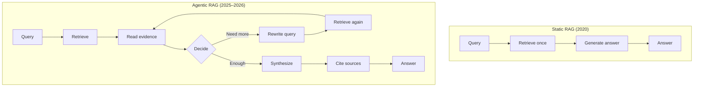
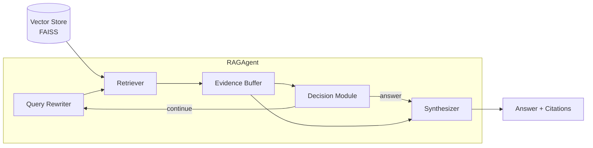

# Chapter 13: RAG-Enhanced Agents

> In 2023, the dominant pattern for grounding LLMs was static retrieval: embed a question, fetch the top-k chunks, and generate an answer in a single pass. This works for simple factual lookups — "What is the capital of France?" — but collapses when the answer requires connecting evidence across multiple documents, reformulating queries based on intermediate findings, or judging which sources are trustworthy. A research assistant that cannot follow a chain of citations is not really assisting; it is guessing. By the end of this chapter you will build a RAG agent that treats retrieval as a first-class tool: iteratively retrieving, rewriting queries, re-ranking evidence, and citing its sources — all in pure Python with FAISS and sentence embeddings.

---

## 1. Retrieval as a First-Class Tool

### 1.1 From Static RAG to Agentic RAG

Traditional RAG, as introduced by Lewis et al. (2020), is a pipeline, not a loop. A user asks a question; the system embeds it, performs a single nearest-neighbor search over a document index, concatenates the top-k chunks with the question into a prompt, and generates an answer. The retrieval step happens exactly once, before generation begins. For questions whose answers live in a single paragraph — "What is the melting point of gallium?" — this is sufficient. The query is specific, the relevant passage is self-contained, and a single retrieval call provides everything the generator needs.

But most interesting questions are not single-pass questions. Consider: "Which Nobel laureate in Physics born in the 20th century also won a National Medal of Science for work on semiconductor heterostructures?" Answering this requires at least two hops: first, identify Nobel laureates in Physics born in the 20th century who worked on semiconductors; second, verify which of them also won the National Medal of Science. A single retrieval call with the full question is unlikely to surface a document that mentions both awards for the same person. The query is too specific; the relevant evidence is scattered.

Agentic RAG solves this by treating retrieval as an action inside the agent loop, not as a pre-processing step. The agent retrieves, reads what it found, and then decides what to do next. That decision might be "I have enough information to answer," or "I need to search for the National Medal of Science winners to cross-check," or "The retrieved documents are irrelevant; I should rephrase my query." This transforms RAG from a pipeline into a policy-driven sequential decision process.

In 2026, the distinction is formal. A comprehensive systematization of knowledge on Agentic RAG (SoK, March 2026) models the architecture as a finite-horizon Partially Observable Markov Decision Process (POMDP). The agent maintains a belief state over what it knows, selects retrieval actions from an action space that includes search, reasoning, and stopping, and updates its state based on observations (the retrieved documents). Performance improves with test-time compute: giving the agent more reasoning steps and retrieval calls yields better answers, exactly as we see with reasoning models.



The diagram above captures the structural difference. Static RAG is a straight line. Agentic RAG is a loop with a decision gate. That gate — the agent's ability to evaluate its own evidence and choose the next action — is the source of its power.

### 1.2 The Agent as a Research Assistant

The right mental model for a RAG agent is not a search engine but a research analyst. A human analyst given a complex question does not type a single query into Google and accept the first result. She searches, skims, takes notes, realizes she needs a sub-question, searches again, cross-references, and only then drafts an answer with footnotes.

Agentic RAG replicates this workflow. The agent maintains an **evidence buffer**: a running list of retrieved passages that it has judged relevant. After each retrieval step, it inspects the buffer and asks: does this contain enough information to answer the original question? If yes, it synthesizes. If no, it identifies what is missing and formulates a new query to fill the gap. This loop continues until the agent is satisfied or a maximum step budget is exhausted.

Recent work on A-RAG (February 2026) formalizes this as **hierarchical retrieval interfaces**. Instead of forcing the model to consume top-k chunks indiscriminately, the agent is given tools: `keyword_search`, `semantic_search`, and `chunk_read`. It chooses the granularity. It might first do a cheap keyword search to find candidate documents, then read specific chunks in detail, then decide. This selective approach achieves higher accuracy with lower token consumption than loading the same fixed context into every call.

---

## 2. Query Rewriting and Multi-Hop Retrieval

### 2.1 Query Rewriting in the Agent Loop

The query the user types is rarely the optimal query for retrieval. It might be too vague, too specific, or framed in terms that do not match the vocabulary of the corpus. A RAG agent that treats the initial query as immutable is handicapped from the first step.

Query rewriting is the skill of reformulating the search target based on evidence gathered so far. Suppose the user asks: "What is the population of the capital of the country that won the FIFA World Cup in 2022?" The initial query might retrieve documents about the 2022 World Cup. The agent discovers that Argentina won. It then rewrites the query to "population of Buenos Aires" and retrieves again. The final answer requires two retrieval steps, each with a different query.

This is not merely a string transformation. It is a reasoning-dependent control action. The 2025 EVO-RAG framework frames query rewriting as a reinforcement-learning problem. The agent's policy generates a sub-query at every hop. A sub-query overlap penalty discourages redundant reformulations, while a time-based scheduler shifts reward weights from exploration (early hops) to refinement (late hops). Training with DPO, PPO, or GRPO on 8B-class backbones yields consistent gains on HotpotQA, 2WikiMultiHopQA, and MuSiQue.

Even without RL training, a simple LLM-based rewriter dramatically improves multi-hop accuracy. The prompt to the rewriter includes three ingredients: the original question, the evidence collected so far, and an instruction to generate a focused follow-up query. The output becomes the next retrieval target.

### 2.2 Multi-Hop Evidence Chains

Multi-hop retrieval is the process of following a chain of evidence across documents. The first hop finds an entity or fact; the second hop uses that fact as a query to find related evidence; the third hop cross-checks or elaborates. Human researchers do this instinctively; agents must do it explicitly.

The challenge is keeping track of what has been found. The GEAR framework (ACL 2025) introduces **gist memory**: a condensed record of proximal triples extracted from retrieved passages. After each hop, the agent extracts entities and relations from the new documents and appends them to the gist. The next rewritten query is generated from the original question, the gist memory, and the previous reasoning step. This prevents the agent from losing the thread — a common failure mode where an agent retrieves document A, learns that "Albert Einstein" is relevant, and then forgets why it was looking for Einstein in the first place.

Another critical capability is backtracking. The 2025 ReAgent architecture replaces the standard forward-only chain with a reversible pipeline. A supervisory layer monitors the execution layer (decomposer, retriever, verifier) and triggers local or global backtracking when later evidence contradicts an earlier step. If the agent initially assumes the 2022 World Cup winner was Brazil based on a misread snippet, and a later retrieval clearly shows Argentina, the supervisor flags the conflict and the agent rewrites from the point of error rather than pressing forward with a false premise.

> **Key Insight**
>
> Multi-hop retrieval fails not because retrievers are weak, but because agents forget why they retrieved. Gist memory and reversible execution are the antidotes.

---

## 3. Advanced Retrieval Strategies

### 3.1 Hypothetical Document Embeddings (HyDE)

Here is a counter-intuitive trick that works surprisingly well. When a user asks a question, the agent first generates a hypothetical answer — even though it does not yet know the correct answer. It then embeds that hypothetical document and uses it as the retrieval query.

The intuition is simple. A question like "How does backpropagation handle vanishing gradients in RNNs?" is short and abstract. A hypothetical answer, even if partially hallucinated, is rich with relevant terminology: "gradient clipping," "LSTM gates," "tanh saturation," "residual connections." These terms act as expansion anchors that pull in semantically related documents that a raw query might miss.

Formally, let $q$ be the user query and $M$ be the generator LLM. HyDE computes:

$$d_{\text{hyp}} = M(q)$$

Then retrieval is performed with the embedding of the hypothetical document:

$$\text{Retrieval}(q) = \text{TopK}\!\left(\text{NN}\!\left(\text{Embed}(d_{\text{hyp}}), \text{Index}\right)\right)$$

where $\text{Embed}$ is the dense encoder and $\text{NN}$ denotes nearest-neighbor search. The shapes involved are $q \in \mathbb{R}^{|q|}$ as a token sequence, $d_{\text{hyp}} \in \mathbb{R}^{|d|}$, and the index stores vectors in $\mathbb{R}^{d_{\text{emb}}}$. The projection from tokens to embeddings is a matrix multiplication (juxtaposition, no explicit symbol): $W_{\text{embed}} \, v$ where $W_{\text{embed}} \in \mathbb{R}^{d_{\text{emb}} \times |V|}$ and $v \in \mathbb{R}^{|V|}$ is a one-hot token vector.

The 2025 literature has refined HyDE in several directions. **HyPE** (Hypothetical Prompt Embeddings) inverts the workflow: at index time, the system generates hypothetical questions for every document chunk and stores their embeddings. At query time, no LLM call is needed; the user's question is matched directly against the pre-computed question vectors. This trades index size (3–5x more vectors) for zero query-time latency. **Self-Learning HyDE** (SL-HyDE) iteratively improves both the generator and the retriever using only unlabeled corpora, achieving NDCG@10 of 59.38% on medical retrieval benchmarks. In practice, a robust agentic strategy is to ensemble: generate 3–5 hypothetical documents, average their embeddings, and retrieve against the centroid.

However, HyDE is not free. It adds an LLM call per retrieval step and can hallucinate hypothetical content that pulls in irrelevant documents. The safest pattern is adaptive HyDE: use standard retrieval first, and fall back to HyDE only when the initial retrieval confidence is low.

A minimal HyDE module for the agent looks like this:

```python
    def hyde_retrieve(self, query: str, k: int = 10) -> List[Tuple[str, float]]:
        """Generate a hypothetical answer, embed it, and retrieve."""
        prompt = (
            f"Question: {query}\n"
            "Write a short hypothetical answer (2–3 sentences). "
            "It need not be correct; just use relevant keywords."
        )
        hypothetical = self.llm.generate(prompt, max_tokens=128)
        return self.memory.search(hypothetical, k=k)
```

### 3.2 Re-Ranking and RAG-Fusion

Retrieval quality is limited by the embedding model's ability to compress a passage into a single vector. Sentence-level or passage-level embeddings inevitably lose nuance. A chunk that is globally similar to the query might not actually contain the specific fact needed. Re-ranking fixes this by scoring query-passage pairs with a more expressive model after the initial retrieval.

In 2025, re-ranking within the agent loop is standard practice. The architecture has two stages:

1. **First-stage retrieval**: a fast bi-encoder (sentence embeddings + FAISS) returns a broad candidate set of $k$ documents.
2. **Second-stage re-ranking**: a cross-encoder or ColBERT model scores each $(\text{query}, \text{passage})$ pair with full bidirectional attention, then returns the top-$m \ll k$ passages.

The cross-encoder computes a relevance score $s(q, d)$ by feeding the concatenated query and document through a transformer and reading the CLS token representation:

$$s(q, d) = w^\top \text{CLS}(q \mathbin\| d)$$

where $w \in \mathbb{R}^{d_{\text{hidden}}}$ is a learned weight vector and $\mathbin\|$ denotes concatenation. The transformer's feed-forward projection is a matrix multiplication (juxtaposition): $W_{\text{enc}} \, x$ with $x \in \mathbb{R}^{L \times d_{\text{model}}}$ the concatenated token sequence and $W_{\text{enc}} \in \mathbb{R}^{d_{\text{hidden}} \times d_{\text{model}}}$.

RAG-Fusion extends this idea further. Instead of retrieving against the original query alone, the agent generates multiple sub-queries from different perspectives, retrieves for each, and merges the results with Reciprocal Rank Fusion (RRF). For a question like "Compare Tesla's and BYD's battery supply chains," the sub-queries might be "Tesla battery suppliers," "BYD battery suppliers," and "EV battery supply chain comparison." RRF merges the ranked lists without requiring comparable scores from each retriever, making it easy to fuse dense vector, sparse keyword, and even graph traversal results.

For an agent, RAG-Fusion is not a fixed pipeline but a tool. The agent decides whether the question is multi-faceted enough to warrant sub-query generation, or whether a single query is sufficient. This meta-decision saves tokens on simple questions while improving recall on hard ones.

### 3.3 Source Attribution and Citation

A retrieval agent that does not cite its sources is not trustworthy. In 2025–2026, the research community has converged on a sharp distinction between **citation correctness** (does the cited passage entail the claim?) and **citation faithfulness** (did the model actually derive the claim from that passage?). Production RAG often fails the second test. Benchmarks indicate that 50–90% of LLM responses are not fully supported by cited sources, and up to 57% of citations on adversarial sets are unfaithful — the model retrieved real documents but attributed a parametric-memory answer to them post-hoc.

The antidote is **generation-time citation** rather than post-hoc decoration. The agent should emit citations during the same decoding pass as the claim, constrained to only the passage IDs it has actually retrieved. The C2-Cite framework (WSDM 2026) encodes retrieved document semantics directly into citation marker embeddings and uses a citation router to align markers with source text during fine-tuning, improving citation F1 by 5.8% and response correctness by 17.4%.

For a pure-Python agent, the practical implementation is simpler but effective. Every retrieved chunk is assigned an integer ID. The synthesizer prompt explicitly instructs the model to cite sources with `[i]` format and to use only the provided context. A post-hoc verifier then checks that every citation index actually appears in the retrieved set and that the cited passage entails the claim. This spans both correctness and faithfulness.

> **Warning**
>
> Post-hoc citation — attaching references after the answer is drafted — often rationalizes parametric knowledge rather than grounding it in retrieval. Always constrain citations to the retrieved context and verify them.

---

## 4. Project — Building a Research Assistant Agent

We now build a complete research assistant agent in pure Python. The agent uses FAISS for vector search, sentence-transformers for dense encoding, an optional cross-encoder for re-ranking, and an LLM backend for query rewriting, synthesis, and source attribution. The core loop is iterative: retrieve, read, decide whether to continue, and if so, rewrite the query.



### 4.1 Architecture

The agent has five internal components:

| Component | Responsibility |
|-----------|--------------|
| **Vector Store** | FAISS index + sentence embeddings; stores and searches chunked documents. |
| **Retriever** | Two-stage retrieval: bi-encoder first stage, optional cross-encoder re-rank. |
| **Query Rewriter** | LLM that generates follow-up queries based on evidence so far. |
| **Synthesizer** | LLM that drafts the final answer with inline citations. |
| **Decision Module** | LLM that classifies whether the current evidence is sufficient. |

We also maintain an **evidence buffer**: a deduplicated list of retrieved passages that accumulates across hops. This is the agent's working memory for the current question.

### 4.2 Vector Memory with FAISS

We begin with the memory layer. We use `sentence-transformers` to encode chunks and FAISS for approximate nearest-neighbor search. The embeddings are normalized so that inner product equals cosine similarity.

```python
import faiss
import numpy as np
from sentence_transformers import SentenceTransformer
from typing import List, Tuple

class VectorStore:
    """Dense vector store backed by FAISS with sentence-transformer encoding."""
    
    def __init__(self, model_name: str = "all-MiniLM-L6-v2", dim: int = 384):
        self.encoder = SentenceTransformer(model_name)
        self.index = faiss.IndexFlatIP(dim)  # inner product on normalized vectors
        self.chunks: List[str] = []
        self.dim = dim
    
    def add_documents(self, documents: List[str], chunk_size: int = 256):
        """Split documents into chunks, embed, and add to the index."""
        for doc in documents:
            # Naive fixed-length chunking for illustration
            words = doc.split()
            for i in range(0, len(words), chunk_size):
                chunk = " ".join(words[i:i + chunk_size])
                if chunk:
                    self.chunks.append(chunk)
        if not self.chunks:
            return
        embeddings = self.encoder.encode(
            self.chunks, normalize_embeddings=True, show_progress_bar=False
        )
        self.index.add(np.array(embeddings, dtype="float32"))
    
    def search(self, query: str, k: int = 10) -> List[Tuple[str, float]]:
        """Return top-k (chunk, score) pairs by cosine similarity."""
        q_emb = self.encoder.encode([query], normalize_embeddings=True)
        scores, indices = self.index.search(np.array(q_emb, dtype="float32"), k)
        return [
            (self.chunks[int(idx)], float(scores[0][j]))
            for j, idx in enumerate(indices[0]) if idx >= 0
        ]
```

The `VectorStore` is intentionally minimal. In production you would add sliding-window chunking, metadata tracking (source URL, page number), and an HNSW index for million-scale corpora. For our project, the flat index is sufficient and transparent.

### 4.3 The RAGAgent Class

The agent class wires together the vector store, an LLM backend, and an optional cross-encoder re-ranker. It maintains the evidence buffer and reasoning trace across steps.

```python
from typing import Optional, Dict, Any, List, Tuple

class LLMBackend:
    """Pluggable LLM wrapper. In production, swap for OpenAI, Anthropic, or local APIs."""
    
    def generate(self, prompt: str, max_tokens: int = 512) -> str:
        # Stub: replace with actual API call
        raise NotImplementedError("Plug in your LLM backend here.")

class RAGAgent:
    """Iterative RAG agent with query rewriting, re-ranking, and citation."""
    
    def __init__(
        self,
        vector_store: VectorStore,
        llm: LLMBackend,
        cross_encoder: Optional[Any] = None,
        max_steps: int = 5,
        retrieve_k: int = 10,
        rerank_k: int = 5,
    ):
        self.memory = vector_store
        self.llm = llm
        self.reranker = cross_encoder
        self.max_steps = max_steps
        self.retrieve_k = retrieve_k
        self.rerank_k = rerank_k
        
        # State resets per question
        self.evidence: List[Tuple[str, float]] = []
        self.trace: List[Dict[str, Any]] = []
    
    def reset(self):
        self.evidence.clear()
        self.trace.clear()
    
    def retrieve(self, query: str) -> List[Tuple[str, float]]:
        """Two-stage retrieval: dense first, cross-encoder re-rank second."""
        candidates = self.memory.search(query, k=self.retrieve_k)
        if self.reranker is None or len(candidates) <= self.rerank_k:
            return candidates
        
        pairs = [[query, doc] for doc, _ in candidates]
        scores = self.reranker.predict(pairs)  # higher = more relevant
        ranked = sorted(
            zip(candidates, scores), key=lambda x: x[1], reverse=True
        )
        return [doc for doc, _ in ranked[:self.rerank_k]]
```

The `retrieve` method implements the two-stage pattern. If no re-ranker is provided, it returns the FAISS candidates directly. Otherwise, it scores each candidate with the cross-encoder and keeps only the most relevant subset. This is the standard latency-quality trade-off: we accept a small delay on the cross-encoder to improve precision.

### 4.4 Iterative Retrieval and Decision

The heart of the agent is the loop that decides whether to answer or to keep searching. We implement a `decide` method that asks the LLM to classify the current state.

```python
    def decide(self, question: str) -> str:
        """Return 'answer', 'continue', or 'refine'."""
        context = "\n".join([f"- {doc[:200]}" for doc, _ in self.evidence[:5]])
        prompt = (
            f"Question: {question}\n"
            f"Evidence found so far:\n{context}\n\n"
            "Can we answer the question with this evidence? "
            "Reply with exactly one word: answer, continue, or refine."
        )
        return self.llm.generate(prompt, max_tokens=16).strip().lower()
    
    def run(self, question: str) -> Dict[str, Any]:
        """Iterative retrieve-read-decide loop."""
        self.reset()
        query = question
        
        for step in range(self.max_steps):
            docs = self.retrieve(query)
            self.evidence.extend(docs)
            self.trace.append({
                "step": step,
                "query": query,
                "retrieved": len(docs),
            })
            
            decision = self.decide(question)
            if "answer" in decision:
                return self.synthesize(question)
            
            # Otherwise, rewrite and continue
            query = self.rewrite_query(question)
        
        # Max steps reached: synthesize with whatever we have
        return self.synthesize(question)
```

The loop invariant is simple: at every step, the evidence buffer grows, and the query is tuned to fill the remaining gaps. The `decide` prompt is deliberately restrictive — it asks for a single word — to reduce parsing ambiguity. In a production system you might replace this with a classifier fine-tuned on agent trajectories, but the LLM-based version is surprisingly robust with a good prompt.

### 4.5 Query Rewriting

Query rewriting turns the original question into a focused sub-query based on what the agent has already discovered.

```python
    def rewrite_query(self, question: str) -> str:
        """Generate a follow-up query conditioned on current evidence."""
        evidence_snippets = "\n".join(
            [f"{i+1}. {doc[:180]}" for i, (doc, _) in enumerate(self.evidence[:4])]
        )
        prompt = (
            f"Original question: {question}\n"
            f"What we know so far:\n{evidence_snippets}\n\n"
            "What specific sub-question should we search next to find the missing information? "
            "Return only the query string, no explanation."
        )
        rewritten = self.llm.generate(prompt, max_tokens=64).strip()
        # Prevent empty or trivial rewrites
        return rewritten if rewritten else question
```

Notice the prompt structure. It gives the original question to keep the agent anchored to the goal, lists the evidence to prevent redundant searches, and constrains the output format. The fallback to the original question guards against malformed LLM outputs.

### 4.6 Re-Ranking and Source Attribution

The synthesizer generates the final answer with inline citations. We deduplicate evidence, assign stable IDs, and instruct the LLM to cite only from the provided context.

```python
    def synthesize(self, question: str) -> Dict[str, Any]:
        """Draft answer with citations from deduplicated evidence."""
        # Deduplicate while preserving order
        seen: set = set()
        unique: List[Tuple[int, str, float]] = []
        for doc, score in self.evidence:
            if doc not in seen:
                seen.add(doc)
                unique.append((len(unique), doc, score))
        
        context = "\n\n".join(
            [f"[{i}] {doc}" for i, doc, _ in unique]
        )
        prompt = (
            f"Question: {question}\n\n"
            f"Use the evidence below to answer. Cite sources with [i] format. "
            f"If the evidence is insufficient, say so.\n\n{context}\n\nAnswer:"
        )
        answer = self.llm.generate(prompt, max_tokens=1024)
        
        return {
            "answer": answer,
            "sources": unique,
            "steps": len(self.trace),
            "trace": self.trace,
        }
```

A minimal citation verifier checks that every `[i]` in the answer corresponds to an actual source ID and that the index is within bounds. Full faithfulness verification would use an NLI model or LLM-as-judge to confirm that the cited passage entails the claim, but even bounds-checking catches the most common failure mode: hallucinated citation IDs.

### 4.7 Evaluation Harness

We evaluate on three metrics: answer accuracy, citation accuracy, and retrieval efficiency (average number of steps). The dataset is a curated set of multi-hop questions over a small Wikipedia corpus.

```python
import re

def exact_match(pred: str, gold: str) -> bool:
    return pred.strip().lower() == gold.strip().lower()

def citation_accuracy(answer: str, sources: List[Tuple[int, str, float]]) -> float:
    """Fraction of citations in the answer that reference valid source IDs."""
    citations = re.findall(r"\[(\d+)\]", answer)
    if not citations:
        return 0.0
    valid = [c for c in citations if 0 <= int(c) < len(sources)]
    return len(valid) / len(citations)

def evaluate(agent: RAGAgent, dataset: List[Dict[str, Any]]) -> Dict[str, float]:
    results = {"accuracy": 0.0, "citation_acc": 0.0, "avg_steps": 0.0, "total": 0}
    
    for item in dataset:
        out = agent.run(item["question"])
        results["total"] += 1
        results["avg_steps"] += out["steps"]
        
        if exact_match(out["answer"], item["answer"]):
            results["accuracy"] += 1
        
        results["citation_acc"] += citation_accuracy(out["answer"], out["sources"])
    
    n = results["total"]
    if n:
        results["accuracy"] /= n
        results["citation_acc"] /= n
        results["avg_steps"] /= n
    return results
```

The harness is intentionally lightweight so you can iterate quickly. To run an experiment, load a corpus into the `VectorStore`, instantiate the agent with your LLM backend, and call `evaluate` on a held-out question set. A good baseline to beat is static single-pass RAG: set `max_steps=1` and compare accuracy and citation scores. On multi-hop datasets, the iterative agent should show a large gap.

### 4.8 Extension: Knowledge Graph Integration

For structured reasoning, the agent can be extended with a knowledge graph tool. The agent's action space gains a third option: `graph_query`. When the decision module detects that the question involves named entities and relationships — "Who is the CEO of the company that acquired the maker of product X?" — it routes to the graph. The KG provides precise multi-hop traversal without semantic approximation, while the vector store handles unstructured descriptive text. We explore this hybrid deeply in Chapter 37.

---

## Summary

- **Retrieval is a tool, not a pipeline.** Agentic RAG wraps retrieval inside a decision loop where the agent chooses when, what, and how to retrieve.
- **Query rewriting is the core skill.** The agent reformulates its search target based on intermediate evidence, enabling multi-hop reasoning across scattered documents.
- **Quality improves with test-time compute.** Re-ranking, RAG-Fusion, and iterative retrieval all trade extra LLM calls and latency for accuracy. Adaptive policies decide how much compute to spend per question.
- **Citations must be generation-time, not post-hoc.** Trust requires the agent to ground every claim in a retrieved passage and to cite that passage by ID during synthesis, with verification.
- **A pure-Python agent** with FAISS, sentence embeddings, a cross-encoder, and an LLM backend can implement the full loop: retrieve, re-rank, rewrite, synthesize, and cite.

## Further Reading

- [Retrieval-Augmented Generation for Knowledge-Intensive NLP Tasks](https://arxiv.org/abs/2005.11401) — Lewis et al., 2020. The foundational RAG paper.
- [Interleaving Retrieval with Chain-of-Thought Reasoning for Knowledge-Intensive Multi-Step Questions](https://arxiv.org/abs/2212.10509) — Trivedi et al., 2023. Early agentic retrieval over multi-hop questions.
- [RAG-Fusion: Enhancing Retrieval-Augmented Generation](https://arxiv.org/abs/2402.03367v2) — Gao et al., 2024. Multi-query retrieval with reciprocal rank fusion.
- [Precise Zero-Shot Dense Retrieval without Relevance Labels](https://arxiv.org/abs/2212.10496) — HyDE: generating hypothetical documents for better retrieval.
- [SoK: Agentic Retrieval-Augmented Generation](https://arxiv.org/html/2603.07379v1) — March 2026. Comprehensive taxonomy formalizing Agentic RAG as a POMDP.
- [A-RAG: Scaling Agentic RAG via Hierarchical Retrieval Interfaces](https://arxiv.org/pdf/2602.03442) — February 2026. Hierarchical tools for selective retrieval.
- [CiteGuard: Faithful Citation Attribution for LLMs](https://arxiv.org/abs/2510.17853) — October 2025. Agent-based citation validation with iterative retrieval.
- [Graph-R1: Towards Agentic GraphRAG Framework via RL](https://arxiv.org/html/2507.21892v1) — July 2025. End-to-end RL for graph-structured retrieval agents.

---
