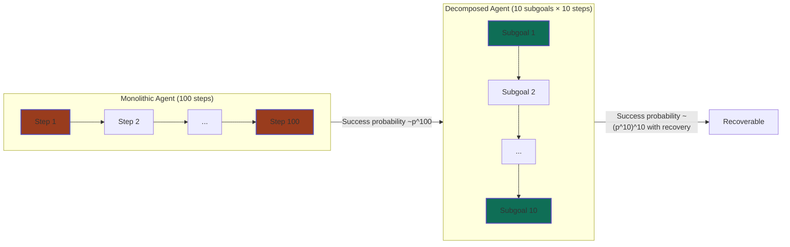
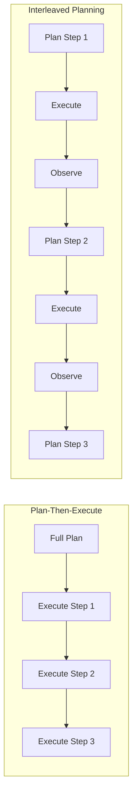
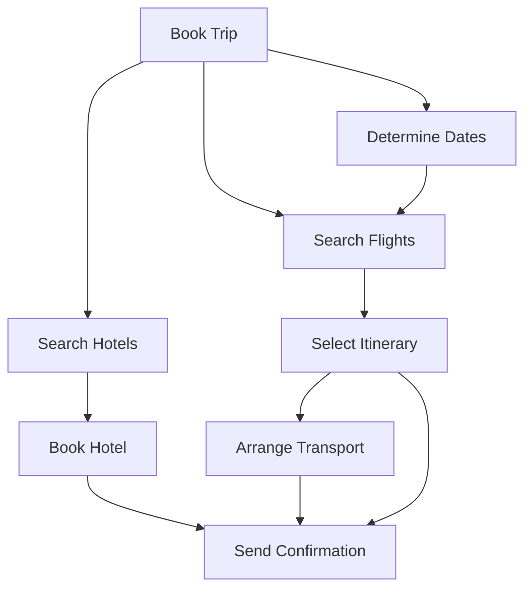

# Chapter 17: Task Decomposition and Subgoal Generation

> In 2024, the most capable coding agents could resolve short GitHub issues in ten steps but collapsed on tasks requiring fifty. The difference was not model size or training data; it was structure. A monolithic agent attempting fifty atomic actions in sequence faces a success probability that decays exponentially with every step. Decomposition is the bridge from fragile sequential chains to reliable long-horizon agency. By the end of this chapter you will understand why decomposition is not merely convenient but mathematically necessary, and you will build a pure-Python subgoal generator that produces dependency-aware plans, validates them for cycles, and triggers replanning when execution diverges.

---

## 1. Why Decomposition Matters

### 1.1 The Curse of Dimensionality in Action Spaces

Consider an agent that must book a multi-city business trip. At each step it can choose among dozens of actions: search a flight, adjust dates, compare hotels, read cancellation policies, enter passenger details, select seats, confirm payment. A task that a human completes in fifteen minutes can easily require fifty to one hundred discrete actions. If the agent's action space contains even ten choices per step, a hundred-step task has $10^{100}$ possible action sequences — a space so vast that exhaustive search is laughable.

This is the **curse of dimensionality** applied to agency. In reinforcement learning, the state-action space grows exponentially with the number of decision variables. In agent systems, the analogous problem is not merely the branching factor but the **planning horizon**: the number of sequential decisions that separate the current state from the goal. Long horizons break single-shot reasoning, single-pass tool execution, and monolithic ReAct loops alike.

The standard response is to plan. But "planning" is not a monolithic technique. The critical question is whether the agent plans at the level of individual tool calls or at a higher level of abstraction. Decomposition raises the planning level from atoms to molecules, collapsing the effective search depth from hundreds of steps to tens of subgoals.

### 1.2 The Exponential Failure Law

Here is the central mathematical fact that makes decomposition non-negotiable. Suppose an agent has a per-step accuracy of $p$ — the probability that any single action is correct. If errors are independent, the probability that the agent survives $N$ consecutive steps without a fatal mistake is:

$$P(\text{success}) = p^N$$

A model with $p = 0.99$ — ninety-nine percent single-step accuracy, which sounds excellent — has only a thirty-six percent chance of surviving one hundred steps. At one thousand steps, the success probability is effectively zero.

But errors are not independent. Recent work on long-horizon execution shows that agents exhibit **self-conditioning**: once an error enters the reasoning trace, the model becomes more likely to generate subsequent errors because it conditions on its own mistaken output. Khanal et al. (2026) bound the success probability under correlated errors as:

$$\Pr[\text{all succeed}] \leq \exp\!\left(-\epsilon T - \frac{\rho \epsilon^2 T(T-1)}{2}\right)$$

where $\epsilon$ is the per-step failure rate and $\rho > 0$ is the positive correlation between consecutive errors. The quadratic term in $T$ means the decay is **super-exponential**. Even frontier models with ostensibly high single-step accuracy experience what Sinha et al. call "meltdown onset points" — entropy spikes after which the agent enters non-productive loops. The pass@1 rate on aggregate benchmarks drops from $76.3\%$ on short tasks to $52.1\%$ on very-long tasks, a collapse that short-horizon benchmarks completely conceal.

Decomposition does not change the base accuracy $p$, but it changes the structure of the problem. If we break the task into $k$ subgoals of $N/k$ steps each, and we can detect and recover from failures within individual subgoals, the effective horizon per planning unit drops dramatically. Instead of one chain of one hundred steps, we have ten chains of ten steps — each of which can be retried or repaired independently. The probability of completing each subgoal becomes tractable, and the overall task becomes feasible through divide-and-conquer.



<figcaption>Figure 17.1 — Monolithic execution chains N steps into a single brittle sequence. Decomposition breaks the chain into k subgoals of N/k steps each, enabling localized retry and reducing the effective failure exponent.</figcaption>

### 1.3 What Human Planners Teach Us

Human expertise in complex domains is overwhelmingly hierarchical. A chef does not plan a dinner party as a sequence of individual muscle movements. The chef plans at multiple levels: menu selection, ingredient procurement, prep sequence, plating. Each level decomposes into the next. If the fish market is out of salmon, the chef replans at the menu level, not by substituting individual muscle commands.

Research on human problem solving identifies three consistent strategies that LLM agents can emulate:

1. **Means-ends analysis**: identify the difference between the current state and the goal, then select an operator that reduces the largest difference first.
2. **Subgoal chunking**: humans naturally segment continuous tasks at points of maximal information change — when the problem representation shifts.
3. **Template retrieval**: experts solve familiar problems by retrieving stereotyped plans from memory and adapting them to the current situation.

The remainder of this chapter translates these human strategies into implementable agent architectures.

---

## 2. Decomposition Strategies

### 2.1 Recursive Decomposition

The simplest decomposition strategy is recursive: break the goal into subgoals, then break each subgoal into further subgoals, until the leaves are atomic actions executable by a single tool call or reasoning step. This produces a **subgoal tree** rooted at the original task.

The STEP Planner (2025) formalizes this for embodied agents using two models: a *subgoal decomposition model* that proposes children for any given node, and a *leaf-node termination model* that decides when a node is sufficiently concrete to execute without further refinement. The termination criterion is critical — infinite recursion is the obvious failure mode.

In language-based agents, recursive decomposition is typically driven by a prompt. The LLM receives the task and is asked to produce subgoals, each with a difficulty estimate. The agent then recurses on any subgoal whose difficulty exceeds a threshold.

```python
class RecursiveDecomposer:
    def __init__(self, llm_backend, max_depth=3, difficulty_threshold=0.7):
        self.llm = llm_backend
        self.max_depth = max_depth
        self.threshold = difficulty_threshold

    def decompose(self, task, depth=0):
        """Recursively decompose task into a tree of subgoals."""
        if depth >= self.max_depth:
            return {"goal": task, "difficulty": 0.3, "children": []}

        subgoals = self.llm.generate_subgoals(task)  # list of dicts
        children = []
        for sg in subgoals:
            if sg["difficulty"] > self.threshold:
                children.extend(self.decompose(sg["description"], depth + 1))
            else:
                children.append(sg)
        return {"goal": task, "difficulty": 0.5, "children": children}
```

The recursion depth and difficulty threshold act as guardrails. In practice, depth-two or depth-three decomposition is sufficient for most agent tasks; deeper trees introduce coordination overhead that outweighs their benefits.

### 2.2 Least-to-Most Prompting

Least-to-most prompting, introduced by Zhou et al. (2023), inverts the natural tendency to tackle the hardest part first. Instead, the agent solves the simplest subproblem, uses the solution to inform the next subproblem, and builds complexity incrementally.

The canonical example is compositional generalization on SCAN: given a command like "jump left twice and walk thrice," the model first solves "jump left twice," then extends the result to include "walk thrice." Standard chain-of-thought achieves roughly sixteen percent accuracy on length-split generalization; least-to-most prompting pushes this above ninety-nine percent.

In 2025, least-to-most prompting has matured from a research novelty to an engineering pattern. The key implementation rules are:

- **Structured decomposition outputs**: force the model to return an ordered list of subproblems via JSON schema, not free text.
- **Context threading**: each solving step receives the original problem plus the answers to all prior subproblems.
- **Early termination**: if the answer becomes obvious before the plan completes, halt.
- **Per-step evaluability**: treat each subproblem as an independently evaluable span.

Unlike Tree of Thoughts (Chapter 9), least-to-most is strictly linear. It does not explore alternative branches, which makes it cheaper and more deterministic, but it cannot recover from a bad initial decomposition. For tasks where the decomposition itself is uncertain, linear strategies should be paired with verification or replanning.

### 2.3 Plan-Then-Execute vs. Interleaved Planning

Decomposition strategies bifurcate along a critical axis: when does planning happen?

**Plan-then-execute** generates the complete subgoal graph before any action is taken. This is appropriate in stable environments where the world state does not change meaningfully during execution — theorem proving, code refactoring against a fixed codebase, or batch data processing. The advantage is global optimization: the planner can see the entire dependency structure and schedule subgoals in an efficient order. The disadvantage is plan obsolescence: if the environment changes, the precomputed plan may become irrelevant.

**Interleaved planning** generates only the immediate next subgoal, executes it, observes the result, and then plans the subsequent step. This is the ReAct pattern extended to the subgoal level. It is appropriate in dynamic environments — web browsing, live database interaction, conversational agents — where observations alter the problem structure.

Recent work has sharpened this trade-off. Task-Decoupled Planning (TDP, 2026) takes a hybrid approach: a Supervisor module decomposes the task into a full DAG upfront, but each node is dispatched with **scoped context** — only node-relevant history and prerequisite outcomes are visible. If a node fails, replanning is confined to that node without disrupting independent siblings. This cuts token consumption by up to eighty-two percent compared to global-replanning baselines while maintaining or improving accuracy.



<figcaption>Figure 17.2 — Plan-then-execute commits to a full subgoal graph before acting; interleaved planning observes and replans after each subgoal. Modern agents increasingly blend both via scoped-context DAGs.</figcaption>

### 2.4 Template-Based Decomposition

Not all tasks require novel decomposition. Experts in any domain rely on stereotyped plans. A debugging session follows a recognizable template: reproduce the bug, isolate the failing component, hypothesize the cause, implement a fix, run tests, verify resolution. A travel booking follows another: search flights, filter by constraints, select itinerary, book accommodation, arrange ground transport, confirm.

**Template-based decomposition** retrieves a known plan skeleton from a library and adapts it to the current task. TemplateRL (2025) formalizes this by building a library of high-level problem-solving patterns — divide-and-conquer, system analysis, chain-of-thought — via offline Monte Carlo Tree Search on a seed set. During policy optimization, the retrieved template steers rollouts, improving sample efficiency and cross-domain generalization.

For agent builders, a template library can be as simple as a dictionary mapping task types to subgoal sequences:

```python
TEMPLATE_LIBRARY = {
    "debug": [
        {"description": "Reproduce the reported issue", "dependencies": []},
        {"description": "Identify the failing function or module", "dependencies": [0]},
        {"description": "Formulate a hypothesis for the root cause", "dependencies": [1]},
        {"description": "Implement the minimal fix", "dependencies": [2]},
        {"description": "Run the relevant test suite", "dependencies": [3]},
        {"description": "Verify the fix and check for regressions", "dependencies": [4]},
    ],
    "travel_booking": [
        {"description": "Determine origin, destination, and dates", "dependencies": []},
        {"description": "Search and filter flight options", "dependencies": [0]},
        {"description": "Select itinerary and hold reservation", "dependencies": [1]},
        {"description": "Search accommodation near destination", "dependencies": [1]},
        {"description": "Book hotel and confirm cancellation policy", "dependencies": [3]},
        {"description": "Arrange ground transport", "dependencies": [1]},
        {"description": "Send confirmation to traveler", "dependencies": [2, 4, 5]},
    ],
}

class TemplateDecomposer:
    def decompose(self, task_type, task_description):
        template = TEMPLATE_LIBRARY.get(task_type, [])
        # Adapt template to specific task via LLM rewrite
        return [self._instantiate(sg, task_description) for sg in template]

    def _instantiate(self, subgoal_template, task_description):
        # In practice, call LLM to rewrite generic description with specifics
        return {
            "description": subgoal_template["description"],
            "dependencies": subgoal_template["dependencies"],
        }
```

Templates provide three advantages: speed (no need to generate a plan from scratch), reliability (proven structure), and interpretability (auditors can inspect the template). The cost is rigidity: novel tasks may not match any template, requiring fallback to recursive or least-to-most decomposition.

---

## 3. Subgoal Generation with LLMs

### 3.1 From Task Description to Subgoal Graph

The core operation in subgoal generation is transforming a natural language task description into a structured subgoal graph. A well-formed subgoal graph is a directed acyclic graph in which nodes are subgoals and edges represent dependencies: subgoal $B$ depends on subgoal $A$ if $B$ cannot begin until $A$ completes.

A practical prompt for subgoal generation follows this structure:

```
You are a task decomposition engine. Given a task description, produce a list of subgoals.
For each subgoal, provide:
- description: what must be accomplished
- dependencies: list of indices of subgoals that must finish before this one
- estimated_difficulty: a float from 0.0 (trivial) to 1.0 (very hard)
- verification: how we will know this subgoal is complete

Task: {task_description}
```

The response is parsed into a graph data structure. Crucially, the LLM is asked to produce *verification criteria* for each subgoal. Without explicit verification, the agent has no way to know whether a subgoal succeeded, which undermines the entire decomposition strategy.

Here is a minimal subgoal generator in pure Python that uses a mock LLM backend. In production, the backend would be an API call to a frontier model.

```python
import json
from dataclasses import dataclass, field
from typing import List, Optional

@dataclass
class Subgoal:
    id: int
    description: str
    dependencies: List[int] = field(default_factory=list)
    difficulty: float = 0.5
    verification: str = ""
    status: str = "pending"  # pending, in_progress, completed, failed

class SubgoalGenerator:
    def __init__(self, llm_backend):
        self.llm = llm_backend

    def generate(self, task: str) -> List[Subgoal]:
        prompt = (
            "Decompose the following task into ordered subgoals. "
            "Return a JSON list of objects with keys: description, dependencies, "
            "difficulty, verification.\n\nTask: " + task
        )
        raw = self.llm.complete(prompt)
        data = json.loads(raw)
        return [
            Subgoal(
                id=i,
                description=sg["description"],
                dependencies=sg.get("dependencies", []),
                difficulty=sg.get("difficulty", 0.5),
                verification=sg.get("verification", ""),
            )
            for i, sg in enumerate(data)
        ]
```

The `verification` field is the linchpin. It transforms decomposition from a hopeful suggestion into a contract: the agent knows exactly what success looks like for each subgoal.

### 3.2 Dependency Detection and Topological Scheduling

A decomposition is only as good as its dependency graph. If the agent attempts subgoal $B$ before its prerequisite $A$, the result is usually a failure that wastes tokens and time. Dependency detection is the process of inferring, from the task description and domain knowledge, which subgoals must precede others.

The most reliable method is to ask the LLM explicitly, as in the prompt above. But LLM-generated dependencies are error-prone. A post-generation validation step is essential.

The validation step must check two properties:
1. **Acyclicity**: the dependency graph contains no cycles. A cycle means subgoal $A$ needs $B$, $B$ needs $C$, and $C$ needs $A$ — an unsolvable deadlock.
2. **Reachability**: every subgoal is reachable from the start, and the goal is reachable from the subgoals.

Topological sort provides the execution order. A DAG with $n$ nodes has at least one topological ordering. If the graph has multiple valid orderings, the agent can prioritize by difficulty, estimated cost, or parallelizability.

The following `PlanValidator` implements cycle detection via DFS color marking and topological sort via Kahn's algorithm.

```python
from collections import deque
from typing import List, Tuple

class PlanValidator:
    def validate(self, subgoals: List[Subgoal]) -> Tuple[bool, str]:
        """Return (is_valid, reason_if_invalid)."""
        n = len(subgoals)
        adj = {sg.id: [] for sg in subgoals}
        indeg = {sg.id: 0 for sg in subgoals}

        for sg in subgoals:
            for dep in sg.dependencies:
                if dep not in adj:
                    return False, f"Dependency {dep} of subgoal {sg.id} does not exist"
                adj[dep].append(sg.id)
                indeg[sg.id] += 1

        # Cycle detection via DFS
        WHITE, GRAY, BLACK = 0, 1, 2
        color = {sg.id: WHITE for sg in subgoals}

        def dfs(node):
            color[node] = GRAY
            for nb in adj[node]:
                if color[nb] == GRAY:
                    return False  # back edge = cycle
                if color[nb] == WHITE and not dfs(nb):
                    return False
            color[node] = BLACK
            return True

        for sg in subgoals:
            if color[sg.id] == WHITE:
                if not dfs(sg.id):
                    return False, "Cycle detected in dependency graph"

        return True, "Valid DAG"

    def topological_order(self, subgoals: List[Subgoal]) -> List[int]:
        """Kahn's algorithm. Assumes graph is acyclic."""
        adj = {sg.id: [] for sg in subgoals}
        indeg = {sg.id: 0 for sg in subgoals}
        for sg in subgoals:
            for dep in sg.dependencies:
                adj[dep].append(sg.id)
                indeg[sg.id] += 1

        queue = deque([sg.id for sg in subgoals if indeg[sg.id] == 0])
        order = []
        while queue:
            node = queue.popleft()
            order.append(node)
            for nb in adj[node]:
                indeg[nb] -= 1
                if indeg[nb] == 0:
                    queue.append(nb)

        return order
```

The `validate` method catches the most common LLM failure modes: referencing non-existent subgoal IDs, creating circular dependencies, or producing disconnected components. In production, this validation should run before any subgoal is executed.



<figcaption>Figure 17.3 — A subgoal DAG for travel booking. Nodes are subgoals; edges are dependencies. The DAG structure enables parallel execution of independent branches (flights and hotels can be searched concurrently) while enforcing ordering constraints.</figcaption>

### 3.3 Verifying Subgoal Feasibility Before Execution

Validation ensures the graph is structurally sound, but it does not ensure the subgoals are achievable. A subgoal like "access the restricted database" may be logically dependent on "obtain credentials" but physically impossible if the agent lacks permissions.

**Feasibility verification** checks three things before execution begins:

1. **Precondition satisfaction**: does the current environment state contain everything the subgoal requires? For example, "run the test suite" requires that the test files exist and the test runner is installed.
2. **Permission alignment**: does the agent have the necessary tool access? A subgoal that requires write access cannot proceed if the agent is operating in a read-only sandbox.
3. **Resource estimation**: is the subgoal's estimated token or compute cost within budget? This is increasingly important for agents with cost constraints.

Feasibility verification can be implemented as a lightweight pre-flight check:

```python
class FeasibilityChecker:
    def __init__(self, available_tools, permissions):
        self.tools = available_tools
        self.permissions = permissions

    def check(self, subgoal: Subgoal, env_state: dict) -> Tuple[bool, str]:
        # 1. Tool availability
        required_tools = self._extract_tools(subgoal.description)
        missing = [t for t in required_tools if t not in self.tools]
        if missing:
            return False, f"Missing tools: {missing}"

        # 2. Permission alignment
        if "write" in subgoal.description.lower() and "write" not in self.permissions:
            return False, "Write permission required but not granted"

        # 3. Simple precondition check via LLM
        prompt = (
            f"Given environment state {env_state}, can subgoal "
            f"'{subgoal.description}' be started immediately? Answer yes/no."
        )
        answer = self.llm.complete(prompt).strip().lower()
        if not answer.startswith("yes"):
            return False, "Preconditions not satisfied"

        return True, "Feasible"

    def _extract_tools(self, description: str) -> List[str]:
        # Simplified: in practice, use an LLM or keyword matcher
        keywords = ["search", "write", "read", "execute", "database"]
        return [kw for kw in keywords if kw in description.lower()]
```

If a subgoal fails feasibility verification, the agent has two options: resolve the missing precondition (e.g., install a missing tool) or flag the subgoal as blocked and request human intervention.

### 3.4 Handling Decomposition Failures: Replanning

No initial decomposition is perfect. The environment changes, tools return unexpected results, and LLM-generated plans contain hallucinated dependencies. The distinguishing mark of a mature agent is not that it never plans poorly, but that it detects planning failures and repairs them.

**Replanning** is the process of regenerating the subgoal graph from the current state when execution diverges from expectation. There are three triggers for replanning:

1. **Subgoal failure**: a subgoal's verification criterion is not met after execution.
2. **Environment drift**: an observation invalidates a pending subgoal's preconditions.
3. **Novel information**: the agent discovers a requirement that was not visible during initial decomposition.

The critical design question is the **scope of replanning**. Global replanning regenerates the entire subgoal graph from scratch. Local replanning regenerates only the subgraph rooted at the failed subgoal. Global replanning is simpler to implement but expensive in tokens and risky — it may discard valid portions of the plan. Local replanning is more efficient but requires the dependency graph to isolate the affected region.

RP-ReAct (December 2025) formalizes this with a two-agent architecture: a **Reasoner-Planner Agent** (RPA) handles high-level adaptive planning and subgoal decomposition, while a **Proxy-Execution Agent** (PEA) translates each sub-step into concrete tool interactions via a ReAct loop. When the PEA fails, the RPA receives a condensed failure summary and regenerates only the affected subgoals. This separation prevents execution noise from corrupting the planner's context.

ReAcTree (2025) extends this idea to a dynamic tree structure. Each node in the tree is an agent assigned to a specific subgoal. Nodes can **expand** — proposing new subgoals when a task proves more complex than anticipated. Control flow nodes (sequence, fallback, parallel) coordinate execution, enabling sophisticated recovery patterns such as trying an alternative subgoal when the primary path fails.

The following `ReplanningTrigger` implements local replanning scoped to a failed subgoal:

```python
class ReplanningTrigger:
    def __init__(self, generator: SubgoalGenerator, validator: PlanValidator):
        self.generator = generator
        self.validator = validator

    def handle_failure(self, failed_subgoal: Subgoal, remaining: List[Subgoal], task_context: str):
        """Replan from failed_subgoal, preserving independent remaining subgoals."""
        # Identify dependents: anything that transitively depends on failed_subgoal
        dependents = self._collect_dependents(failed_subgoal.id, remaining)
        preserved = [sg for sg in remaining if sg.id not in dependents]

        # Generate replacement subgoals for the failed branch
        new_branch = self.generator.generate(
            task=f"Retry or alternative approach for: {failed_subgoal.description}. "
                 f"Context: {task_context}"
        )

        # Offset IDs to avoid collision with preserved subgoals
        offset = max((sg.id for sg in preserved), default=-1) + 1
        for sg in new_branch:
            sg.id += offset
            sg.dependencies = [d + offset for d in sg.dependencies]

        # Re-validate the merged plan
        merged = preserved + new_branch
        valid, reason = self.validator.validate(merged)
        if not valid:
            raise ValueError(f"Replanning produced invalid graph: {reason}")

        return merged

    def _collect_dependents(self, root_id: int, subgoals: List[Subgoal]) -> set:
        """Return all subgoal IDs that transitively depend on root_id."""
        adj = {sg.id: [] for sg in subgoals}
        for sg in subgoals:
            for dep in sg.dependencies:
                adj[dep].append(sg.id)
        visited = set()
        stack = [root_id]
        while stack:
            node = stack.pop()
            if node not in visited:
                visited.add(node)
                stack.extend(adj[node])
        return visited
```

The `_collect_dependents` method ensures that replanning is localized. If subgoal 3 fails, but subgoal 5 is independent, the agent preserves subgoal 5 and its entire subtree. This is the same principle that makes Task-Decoupled Planning efficient: errors are contained.

---

## 4. Error Compounding and the Case for Fine-Grained Verification

The exponential failure law tells us that coarse-grained decomposition is not enough. If a "subgoal" is itself fifty steps long, the agent has merely traded one exponential for another. The 2025–2026 research on million-step reliability converges on a single principle: **verification must happen at the finest possible granularity**.

Meyerson et al. (2025) demonstrate this with the MAKER system, which solves million-step tasks with zero errors by decomposing tasks into single-step subtasks and applying majority voting per subtask. The cost scaling becomes log-linear rather than exponential:

$$\mathbb{E}[\text{cost}] = \Theta(s \ln s)$$

This is a profound result. It implies that the path to reliable long-horizon agency is not through larger models or longer context windows — though both help — but through **structured decomposition with per-step verification and recovery**. An agent that can detect an error at step 47 and repair it locally is exponentially more reliable than an agent that discovers the error only at step 500.

For practical agent builders, this translates to three design rules:

1. **Make subgoals verifiable**: every subgoal must have an observable, automatable completion criterion.
2. **Scope context locally**: each subgoal executor should see only the information relevant to that subgoal, not the entire execution history. This prevents self-conditioning on prior errors.
3. **Retry at the subgoal level**: when verification fails, retry or replan the subgoal before proceeding. Do not propagate ambiguous states downstream.

These rules bridge Part II (single-agent systems) and Part III (planning and test-time reasoning). The chapters that follow — hierarchical planning with HTN networks, Monte Carlo Tree Search for agent reasoning, and the full planner-agent project in Chapter 25 — build on the decomposition foundation laid here. The planner-agent project explicitly combines the subgoal generator from this chapter with a searcher that explores plan variants via MCTS and an executor that runs ReAct loops on individual subgoals.

---

## Summary

- **Long-horizon tasks break monolithic agents** because per-step errors compound exponentially. A model with $99\%$ single-step accuracy has roughly $36\%$ chance of surviving one hundred steps; correlated errors make the decay super-exponential.
- **Decomposition is divide-and-conquer for agency**: by breaking tasks into subgoals, agents reduce the effective planning horizon and enable localized recovery.
- **Recursive decomposition, least-to-most prompting, and template-based methods** offer complementary strategies for generating subgoals. Templates provide speed and reliability for familiar domains; recursive methods handle novel tasks.
- **Plan-then-execute suits stable environments**; **interleaved planning suits dynamic ones**. Modern systems like Task-Decoupled Planning blend both by computing a full DAG upfront but executing with scoped contexts and local replanning.
- **Dependency detection and topological validation** are non-negotiable. LLM-generated plans must be checked for cycles, disconnected components, and infeasible preconditions before execution.
- **Replanning must be localized**. Global replanning is expensive and risky. Architectures like RP-ReAct and ReAcTree isolate failures to affected subgoals, preserving independent progress.
- **Fine-grained verification** is the key to breaking the exponential curve. Every subgoal needs an explicit, automatable completion criterion, and retries should happen at the subgoal level.

## Further Reading

- [Zhou et al., "Least-to-Most Prompting Enables Complex Reasoning in Large Language Models"](https://arxiv.org/abs/2205.10625) — ICLR 2023. The foundational paper on incremental decomposition.
- [Wang et al., "Plan-and-Solve Prompting: Improving Zero-Shot Chain-of-Thought Reasoning"](https://arxiv.org/abs/2305.04091) — Plan-then-execute prompting for arithmetic and symbolic reasoning.
- [Khot et al., "Decomposed Prompting: A Modular Approach for Solving Complex Tasks"](https://arxiv.org/abs/2210.02406) — Modular decomposition with swappable sub-task handlers.
- [Meyerson et al., "Solving a Million-Step LLM Task with Zero Errors"](https://arxiv.org/abs/2511.09030) — Fine-grained decomposition with per-step voting achieves log-linear cost scaling.
- [Sinha et al., "The Illusion of Diminishing Returns: Measuring Long Horizon Execution in LLMs"](https://arxiv.org/abs/2509.09677) — Empirical measurement of self-conditioning and error compounding across models.
- [Li et al., "Beyond Entangled Planning: Task-Decoupled Planning for Long-Horizon Agents"](https://arxiv.org/abs/2601.07577) — DAG-based decomposition with scoped contexts and localized replanning.
- [Choi et al., "ReAcTree: Hierarchical LLM Agent Trees with Control Flow for Long-Horizon Task Planning"](https://arxiv.org/abs/2511.02424) — Dynamic agent trees with behavior-tree-inspired control flow.
- [Molinari & Ciravegna, "Reason-Plan-ReAct: A Reasoner-Planner Supervising a ReAct Executor for Complex Enterprise Tasks"](https://arxiv.org/abs/2512.03560) — Decoupled high-level planning and low-level execution with context saving.
- [Wang et al., "A Subgoal-driven Framework for Improving Long-Horizon LLM Agents"](https://arxiv.org/abs/2603.19685) — Milestone-based RL with dense potential-based rewards for web agents.

---
