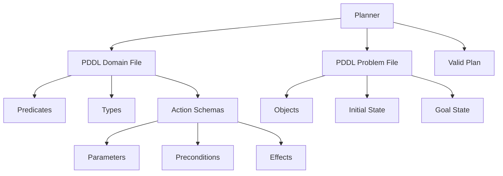

# Chapter 21: Classical Planning Meets LLMs

> In 2024, a `gpt-5.5` model was asked to rearrange a stack of colored blocks so that red sat on blue and blue sat on green. The model produced a five-step plan that sounded plausible: pick up red, place it on blue, pick up blue, place it on green, and celebrate. The only flaw was that blue was already under red, so picking up blue while red remained on top was physically impossible. The LLM had hallucinated a precondition. A symbolic planner running on the same description, by contrast, returned a valid three-step sequence in under a millisecond and *proved* that no shorter plan existed. This chapter bridges those two worlds. We start with the formal machinery that makes such guarantees possible — STRIPS, PDDL, and heuristic search — then show how modern agents fuse that machinery with LLM flexibility to build neuro-symbolic planners that are both expressive and reliable.

---

## 1. Symbolic Planning

### 1.1 STRIPS: Predicates, Actions, and State Transitions

Before neural networks dominated AI, researchers treated planning as a problem in logic. The **Stanford Research Institute Problem Solver (STRIPS)**, introduced by Fikes and Nilsson in 1971, reduced the world to a set of facts that are either true or false. A state is simply a set of predicates — atomic statements like `On(A, B)` or `Clear(C)`. A goal is another set of predicates that must become true. An action is a deterministic operator with three parts: preconditions that must hold before execution, an add-list of predicates that become true, and a delete-list of predicates that become false.

The intuition is closer to a ledger than to a neural network. Imagine a warehouse robot tracking which boxes are on which pallets. The predicate `On(Box3, Pallet7)` is an entry in the ledger. When the robot executes `Move(Box3, Pallet7, Pallet9)`, it removes the old entry and adds the new one. No embeddings, no attention — just set intersection and union.

Formally, a STRIPS action $a$ is a tuple $(	ext{pre}(a), 	ext{add}(a), 	ext{del}(a))$. Applying $a$ to state $s$ yields:

$$s' = (s \setminus \text{del}(a)) \cup \text{add}(a)$$

provided $\text{pre}(a) \subseteq s$. The precondition check is what prevents the robot from picking up a box that is underneath another box. The simplicity of this model is also its power: because states are finite sets and actions are deterministic, the entire state space can be searched systematically.

<figure>

<svg width="100%" viewBox="0 0 800 320" xmlns="http://www.w3.org/2000/svg">
  <rect x="0" y="0" width="800" height="320" fill="#FAFAFA"/>

  <text x="400" y="22" font-family="sans-serif" font-size="14" fill="#333" text-anchor="middle" font-weight="bold">STRIPS State Transition: Stacking Block A on Block B</text>

  <!-- State S0 -->
  <rect x="30" y="50" width="200" height="200" rx="4" fill="#fff" stroke="#185FA5" stroke-width="2"/>
  <text x="130" y="70" font-family="sans-serif" font-size="11" fill="#185FA5" text-anchor="middle" font-weight="bold">State S₀</text>
  <text x="130" y="95" font-family="sans-serif" font-size="10" fill="#333" text-anchor="middle">OnTable(A)</text>
  <text x="130" y="115" font-family="sans-serif" font-size="10" fill="#333" text-anchor="middle">OnTable(B)</text>
  <text x="130" y="135" font-family="sans-serif" font-size="10" fill="#333" text-anchor="middle">Clear(A)</text>
  <text x="130" y="155" font-family="sans-serif" font-size="10" fill="#333" text-anchor="middle">Clear(B)</text>
  <text x="130" y="175" font-family="sans-serif" font-size="10" fill="#333" text-anchor="middle">HandEmpty</text>

  <!-- Action -->
  <rect x="270" y="110" width="160" height="80" rx="4" fill="#fff" stroke="#854F0B" stroke-width="2"/>
  <text x="350" y="130" font-family="sans-serif" font-size="11" fill="#854F0B" text-anchor="middle" font-weight="bold">PickUp(A)</text>
  <text x="350" y="150" font-family="sans-serif" font-size="9" fill="#666" text-anchor="middle">pre: OnTable(A), Clear(A)</text>
  <text x="350" y="165" font-family="sans-serif" font-size="9" fill="#666" text-anchor="middle">add: Holding(A)</text>
  <text x="350" y="180" font-family="sans-serif" font-size="9" fill="#666" text-anchor="middle">del: OnTable(A), Clear(A)</text>

  <!-- Arrow -->
  <line x1="230" y1="150" x2="270" y2="150" stroke="#534AB7" stroke-width="2" marker-end="url(#arrowhead)"/>
  <defs>
    <marker id="arrowhead" markerWidth="10" markerHeight="7" refX="9" refY="3.5" orient="auto">
      <polygon points="0 0, 10 3.5, 0 7" fill="#534AB7"/>
    </marker>
  </defs>

  <!-- State S1 -->
  <rect x="470" y="50" width="200" height="200" rx="4" fill="#fff" stroke="#185FA5" stroke-width="2"/>
  <text x="570" y="70" font-family="sans-serif" font-size="11" fill="#185FA5" text-anchor="middle" font-weight="bold">State S₁</text>
  <text x="570" y="95" font-family="sans-serif" font-size="10" fill="#333" text-anchor="middle"><tspan fill="#993C1D" text-decoration="line-through">OnTable(A)</tspan></text>
  <text x="570" y="115" font-family="sans-serif" font-size="10" fill="#333" text-anchor="middle">OnTable(B)</text>
  <text x="570" y="135" font-family="sans-serif" font-size="10" fill="#333" text-anchor="middle"><tspan fill="#993C1D" text-decoration="line-through">Clear(A)</tspan></text>
  <text x="570" y="155" font-family="sans-serif" font-size="10" fill="#333" text-anchor="middle">Clear(B)</text>
  <text x="570" y="175" font-family="sans-serif" font-size="10" fill="#333" text-anchor="middle"><tspan fill="#0F6E56" font-weight="bold">Holding(A)</tspan></text>
</svg>

<figcaption>Figure 21.1 — A STRIPS action as set operations. Preconditions are checked against the current state; add and delete lists produce the successor state.</figcaption>
</figure>

Look at Figure 21.1. Notice that the action does not mention every predicate in the state. `OnTable(B)` and `Clear(B)` are untouched. This is the **frame assumption**: anything not explicitly deleted persists. The frame assumption keeps action descriptions compact, but it also means STRIPS cannot express conditional effects or numeric fluents. A robot cannot say "if the battery is full, move fast; else, move slowly." That limitation motivated the next generation of planning languages.

### 1.2 PDDL: The Planning Domain Definition Language

**PDDL** (Planning Domain Definition Language), standardized by Ghallab et al. in 1998, extended STRIPS with types, quantified preconditions, disjunctions, conditional effects, and numeric fluents. PDDL separates a planning problem into two files: a **domain file** that declares the action schemas, and a **problem file** that declares the objects, initial state, and goal.

The domain file defines predicates like `(on ?x ?y)` and action schemas like `(:action stack :parameters (?x ?y) ...)`. The `?x` and `?y` are typed variables that are instantiated with concrete objects from the problem file. This separation is crucial: the same domain file can be reused for hundreds of different problem instances. One Blocksworld domain serves every tower-building puzzle.

The PDDL syntax adds expressive power. An action can have a `:precondition` that is a nested logical formula, and an `:effect` that includes `when` clauses for conditional updates. A logistics domain can express that a truck can only drive between connected cities, or that a package must be loaded before it can be unloaded. These constraints prune the search space dramatically, because the planner knows that certain action sequences are syntactically invalid before it even simulates them.



<figcaption>Figure 21.2 — PDDL separates the domain (what actions exist) from the problem (what instance we are solving). The planner consumes both and emits a valid plan.</figcaption>

The following snippet shows a complete Blocksworld domain and a problem instance that asks the planner to build a tower `A on B on C`.

```python
BLOCKSWORLD_DOMAIN_PDDL = """
(define (domain blocksworld)
  (:requirements :strips :typing)
  (:types block)
  (:predicates
    (on-table ?b - block)
    (on ?b1 ?b2 - block)
    (clear ?b - block)
    (hand-empty)
    (holding ?b - block))

  (:action pick-up
    :parameters (?b - block)
    :precondition (and (on-table ?b) (clear ?b) (hand-empty))
    :effect (and (holding ?b) (not (on-table ?b))
                (not (clear ?b)) (not (hand-empty))))

  (:action put-down
    :parameters (?b - block)
    :precondition (holding ?b)
    :effect (and (on-table ?b) (clear ?b) (hand-empty)
                (not (holding ?b))))

  (:action stack
    :parameters (?b1 ?b2 - block)
    :precondition (and (holding ?b1) (clear ?b2))
    :effect (and (on ?b1 ?b2) (clear ?b1) (hand-empty)
                (not (holding ?b1)) (not (clear ?b2))))

  (:action unstack
    :parameters (?b1 ?b2 - block)
    :precondition (and (on ?b1 ?b2) (clear ?b1) (hand-empty))
    :effect (and (holding ?b1) (clear ?b2)
                (not (on ?b1 ?b2)) (not (clear ?b1)) (not (hand-empty)))))
"""

BLOCKSWORLD_PROBLEM_PDDL = """
(define (problem tower-abc)
  (:domain blocksworld)
  (:objects a b c - block)
  (:init
    (on-table a) (on-table b) (on-table c)
    (clear a) (clear b) (clear c)
    (hand-empty))
  (:goal (and (on a b) (on b c))))
"""

# In production, pass these strings to unified_planning.io.pddl_reader
# or write them to files and invoke Fast Downward directly.
```

### 1.3 Fast Downward and Heuristic Search

Knowing that a plan exists is not the same as finding it efficiently. The search space of a PDDL problem grows exponentially with the number of objects and actions. For a Blocksworld with five blocks and four action types, the state space contains hundreds of nodes. For a logistics problem with twenty packages and ten cities, it contains billions. Blind breadth-first search is hopeless.

**Fast Downward**, introduced by Helmert in 2006, is the dominant classical planner in both academia and industry. It translates PDDL into a finite-domain representation, then searches with **A\*** guided by the **LM-Cut heuristic**. The LM-Cut heuristic computes a relaxed version of the problem — one in which delete effects are ignored — and uses the cost of solving that relaxation as an optimistic estimate of the true cost. The closer the heuristic is to the real distance, the fewer nodes A\* must expand.

The key insight is that ignoring delete effects makes the relaxed problem monotone: predicates only accumulate. Monotone problems can be solved greedily by a simple backward-chaining procedure. The cost of that greedy solution becomes the heuristic value. Fast Downward combines this with clever mutex reasoning and landmark detection to produce estimates that are often within ten percent of the true optimal cost. On standard International Planning Competition benchmarks, Fast Downward solves problems that would require centuries of blind search in milliseconds.

Modern integrations make this accessible from Python. The `unified-planning` library (v1.3.0, December 2025) provides a planner-independent Python API that can parse PDDL, construct problems programmatically, and dispatch to Fast Downward or other backends. The `up-fast-downward` package (v0.5.2, August 2025) wraps the native Fast Downward binary, exposing both satisficing mode (`lama-first`) for fast suboptimal plans and optimal mode (`A* + LM-Cut`) for proven-minimum-cost solutions.

### 1.4 When Symbolic Planning Is Sufficient — and When It Is Not

Symbolic planners shine when the world can be described precisely. Blocksworld, logistics, simple navigation, and scheduling problems all have compact PDDL models and benefit from guaranteed correctness. A plan produced by Fast Downward is not "probably correct" — it is *provably* correct with respect to the domain axioms. No neural network offers that guarantee.

But symbolic planning requires a formal model, and many real-world tasks resist formalization. Creative writing, customer support, and open-ended research have no crisp set of predicates or deterministic action schemas. Even when a model exists, building it is expensive. A team at a robotics startup might spend weeks hand-crafting PDDL predicates for a new kitchen environment, only to discover that a spatula shape was not anticipated. The brittleness of hand-engineered models is the primary barrier to scaling classical planning to unstructured domains.

| Task Domain | Formal Model? | Symbolic Planner Fit | LLM Fit |
|---|---|---|---|
| Blocksworld | Compact, exact | Excellent | Prone to hallucinating preconditions |
| Logistics routing | Well-structured | Excellent | Good for natural language queries |
| Software architecture | Partially formal | Moderate (component graphs) | Excellent for exploration |
| Customer support | No crisp model | Poor | Excellent |
| Creative writing | No formal model | Poor | Excellent |

The lesson is not to abandon one approach for the other, but to recognize that they occupy complementary points on the expressiveness-reliability spectrum. Symbolic planners offer reliability without flexibility; LLMs offer flexibility without reliability. The rest of this chapter is about systems that combine both.

---

## 2. Neuro-Symbolic Planning

### 2.1 Translating Natural Language Goals into PDDL

The most natural interface for a human is a sentence: "Stack the red block on the blue block and the blue block on the green block." The most natural interface for Fast Downward is a pair of PDDL files. Closing that gap is the **translation problem**, and it is where LLMs are genuinely useful.

A `claude-sonnet-4.7` model, prompted with a description of the Blocksworld domain and a natural language goal, can emit a syntactically valid PDDL problem file in a single forward pass. The model does not need to solve the problem; it only needs to map the natural language description onto the existing predicates and action schemas. This is easier than open-ended planning because the vocabulary is constrained. The LLM is not inventing new actions; it is instantiating the parameters of known actions with concrete objects.

The translation pipeline looks like this. First, a fixed **domain prompt** describes the available predicates and action schemas. Second, the user's natural language query is appended. Third, the LLM generates PDDL text. Fourth, a lightweight parser validates syntax and checks that every mentioned object appears in the `:objects` list. If parsing fails, the parser returns an error message and the LLM retries with corrective feedback.

### 2.2 LLM-Generated Plans Validated by Symbolic Planners

Generating PDDL is only half the story. A more ambitious approach, explored by Pan et al. (2023) in **Logic-LM** and by Creswell et al. (2023) in **Faithful Reasoning**, asks the LLM to produce a plan directly and then validates that plan with a symbolic solver. The LLM acts as a generator; the symbolic planner acts as a verifier. If the plan is invalid, the planner reports the conflict — for example, "precondition `Clear(B)` violated at step 3" — and the LLM revises.

This pattern is powerful because it separates creativity from correctness. The LLM can propose creative high-level strategies that a human would never think to encode in PDDL. The symbolic planner then checks whether those strategies respect the hard constraints of the world. A neuro-symbolic agent might propose "use the spare table as temporary storage" — an idea that requires no new PDDL actions, just a different object binding in the problem file. Fast Downward confirms whether the resulting plan is valid and optimal.

Lyu et al. (2023) extended this idea with **Faithful Chain-of-Thought Reasoning**, where the LLM is trained to interleave natural language reasoning with symbolic derivations. Every claim in the chain of thought is backed by a step in a formal proof or plan. If the formal step fails, the entire reasoning chain is flagged for review. This reduces hallucination rates by an order of magnitude on structured reasoning benchmarks, because the model learns that assertions must survive symbolic scrutiny.

<figure>

<svg width="100%" viewBox="0 0 800 380" xmlns="http://www.w3.org/2000/svg">
  <rect x="0" y="0" width="800" height="380" fill="#FAFAFA"/>

  <text x="400" y="22" font-family="sans-serif" font-size="14" fill="#333" text-anchor="middle" font-weight="bold">Neuro-Symbolic Planning Pipeline</text>

  <!-- NL Goal -->
  <rect x="30" y="50" width="160" height="50" rx="4" fill="#fff" stroke="#185FA5" stroke-width="2"/>
  <text x="110" y="72" font-family="sans-serif" font-size="11" fill="#185FA5" text-anchor="middle">Natural Language Goal</text>
  <text x="110" y="88" font-family="sans-serif" font-size="9" fill="#666" text-anchor="middle">"Stack A on B on C"</text>

  <!-- Arrow to LLM -->
  <line x1="190" y1="75" x2="240" y2="75" stroke="#534AB7" stroke-width="1.5"/>

  <!-- LLM Translator -->
  <rect x="240" y="50" width="140" height="50" rx="4" fill="#fff" stroke="#0F6E56" stroke-width="2"/>
  <text x="310" y="72" font-family="sans-serif" font-size="11" fill="#0F6E56" text-anchor="middle">LLM Translator</text>
  <text x="310" y="88" font-family="sans-serif" font-size="9" fill="#666" text-anchor="middle">gpt-5.5 / claude-sonnet-4.7</text>

  <!-- Arrow to PDDL -->
  <line x1="380" y1="75" x2="430" y2="75" stroke="#534AB7" stroke-width="1.5"/>

  <!-- PDDL -->
  <rect x="430" y="50" width="140" height="50" rx="4" fill="#fff" stroke="#854F0B" stroke-width="2"/>
  <text x="500" y="72" font-family="sans-serif" font-size="11" fill="#854F0B" text-anchor="middle">PDDL Problem File</text>
  <text x="500" y="88" font-family="sans-serif" font-size="9" fill="#666" text-anchor="middle">Domain + Objects + Goal</text>

  <!-- Arrow to Planner -->
  <line x1="570" y1="75" x2="620" y2="75" stroke="#534AB7" stroke-width="1.5"/>

  <!-- Planner -->
  <rect x="620" y="50" width="140" height="50" rx="4" fill="#fff" stroke="#993C1D" stroke-width="2"/>
  <text x="690" y="72" font-family="sans-serif" font-size="11" fill="#993C1D" text-anchor="middle">Fast Downward</text>
  <text x="690" y="88" font-family="sans-serif" font-size="9" fill="#666" text-anchor="middle">A* + LM-Cut</text>

  <!-- Arrow down to Plan -->
  <line x1="690" y1="100" x2="690" y2="140" stroke="#534AB7" stroke-width="1.5"/>

  <!-- Valid Plan -->
  <rect x="620" y="140" width="140" height="40" rx="4" fill="#fff" stroke="#185FA5" stroke-width="2"/>
  <text x="690" y="165" font-family="sans-serif" font-size="11" fill="#185FA5" text-anchor="middle">Valid Plan</text>

  <!-- Arrow to Explainer -->
  <line x1="620" y1="160" x2="500" y2="160" stroke="#534AB7" stroke-width="1.5"/>

  <!-- LLM Explainer -->
  <rect x="340" y="140" width="160" height="40" rx="4" fill="#fff" stroke="#0F6E56" stroke-width="2"/>
  <text x="420" y="165" font-family="sans-serif" font-size="11" fill="#0F6E56" text-anchor="middle">LLM Explainer</text>

  <!-- Arrow to User -->
  <line x1="340" y1="160" x2="190" y2="160" stroke="#534AB7" stroke-width="1.5"/>

  <!-- Natural Language Plan -->
  <rect x="30" y="140" width="160" height="40" rx="4" fill="#fff" stroke="#185FA5" stroke-width="2"/>
  <text x="110" y="165" font-family="sans-serif" font-size="11" fill="#185FA5" text-anchor="middle">NL Explanation</text>

  <!-- Feedback loop for invalid -->
  <text x="690" y="205" font-family="sans-serif" font-size="10" fill="#993C1D" text-anchor="middle">If invalid:</text>
  <line x1="690" y1="180" x2="690" y2="220" stroke="#993C1D" stroke-width="1.5" stroke-dasharray="4 2"/>
  <line x1="690" y1="220" x2="310" y2="220" stroke="#993C1D" stroke-width="1.5" stroke-dasharray="4 2"/>
  <line x1="310" y1="220" x2="310" y2="100" stroke="#993C1D" stroke-width="1.5" stroke-dasharray="4 2"/>
  <text x="500" y="235" font-family="sans-serif" font-size="9" fill="#993C1D" text-anchor="middle">Planner reports conflict → LLM revises PDDL</text>
</svg>

<figcaption>Figure 21.3 — The neuro-symbolic loop. The LLM translates natural language into formal PDDL, the symbolic planner verifies and solves, and the LLM explains the result back to the user. Invalid plans trigger a refinement cycle.</figcaption>
</figure>

### 2.3 Learning Domain Models from Text

Hand-crafting PDDL domain files is labor-intensive. Can an LLM learn the domain model from unstructured text? The answer is partially yes. Given a collection of natural language instructions, environment descriptions, and observed action outcomes, an LLM can propose candidate predicates and action schemas. A human expert then reviews and curates the proposal, but the bulk of the typing is automated.

The extraction process follows a pipeline. First, the LLM reads raw text — for example, a robotics lab manual describing how a kitchen robot operates. Second, it extracts candidate predicates (`GripperOpen`, `ObjectInDrawer`) and action templates (`OpenDrawer(?d)`, `PlaceInDrawer(?o, ?d)`). Third, it hypothesizes preconditions and effects by analyzing sentences that describe what must be true before an action and what changes afterward. Fourth, a symbolic learner prunes inconsistent hypotheses by checking them against a small set of annotated state transitions.

This is not yet fully autonomous. Current systems still require a human in the loop to resolve ambiguities. The sentence "the drawer must be open" could be a precondition for `PlaceInDrawer` or a separate action `EnsureOpen`. But the LLM narrows the search space dramatically, turning domain authoring from a weeks-long engineering task into an hours-long curation task.

### 2.4 Hybrid Systems: LLM for High-Level Goals, Planner for Low-Level Execution

The most practical neuro-symbolic architecture today is a **hybrid system** with two tiers. The top tier is an LLM that interprets the user's intent, decomposes it into subgoals, and selects a planning domain. The bottom tier is a classical planner that instantiates the domain, searches for a valid plan, and returns it to the top tier for explanation or execution.

This division of labor plays to each system's strengths. The LLM handles ambiguity, context, and natural language. The planner handles combinatorics, constraints, and optimality guarantees. A request like "make breakfast" is too vague for a symbolic planner — the LLM must first decompose it into "fetch eggs, heat pan, crack eggs, cook" — but once the subgoal "fetch eggs" is identified, a motion planner can compute the exact joint angles and collision-free path.

The communication protocol between tiers matters. The LLM must express subgoals in a vocabulary that the planner understands. This is typically enforced by a **schema** — a JSON or PDDL fragment that constrains the LLM's output. When the LLM proposes a subgoal, a lightweight validator checks that every mentioned object and predicate exists in the current domain. If validation fails, the LLM receives a structured error and retries. This loop is fast enough to run interactively: the user sees a plan within seconds, not minutes.

We implement a minimal neuro-symbolic translator that maps natural language into PDDL and back, using a mock LLM to keep the example self-contained.

```python
class MockLLM:
    """Stand-in for a frontier model. In production, replace with OpenAI or Anthropic client."""
    def translate_to_pddl(self, nl_goal: str, domain_prompt: str) -> str:
        # A real model would generate this from domain_prompt + nl_goal.
        # Here we return a fixed Blocksworld problem for illustration.
        return """
(define (problem stack-red-blue-green)
  (:domain blocksworld)
  (:objects red blue green - block)
  (:init
    (on-table red) (on-table blue) (on-table green)
    (clear red) (clear blue) (clear green)
    (hand-empty))
  (:goal (and (on red blue) (on blue green))))
"""

    def explain_plan(self, plan: list[str]) -> str:
        steps = "; ".join(plan)
        return f"To achieve the goal, I will: {steps}."


class NeuroSymbolicAgent:
    """LLM translates NL → PDDL; a symbolic planner (mocked) solves; LLM explains."""
    def __init__(self, llm: MockLLM):
        self.llm = llm
        self.domain_prompt = (
            "Domain: blocksworld. Predicates: on-table, on, clear, hand-empty, holding. "
            "Actions: pick-up, put-down, stack, unstack."
        )

    def solve(self, nl_goal: str) -> dict:
        # Tier 1: LLM generates PDDL problem file content.
        pddl_text = self.llm.translate_to_pddl(nl_goal, self.domain_prompt)

        # Tier 2: Symbolic planner parses and solves.
        # In production, dispatch to unified-planning + Fast Downward.
        plan = self._mock_planner(pddl_text)  # list of action strings

        # Tier 1 again: LLM explains the valid plan in natural language.
        explanation = self.llm.explain_plan(plan)

        return {
            "pddl_problem": pddl_text.strip(),
            "plan": plan,
            "explanation": explanation,
        }

    def _mock_planner(self, pddl_text: str) -> list[str]:
        # A real planner would parse PDDL and run A* + LM-Cut.
        # We return a hand-verified optimal plan for the fixed problem above.
        return [
            "pick-up red",
            "stack red blue",
            "pick-up blue",
            "stack blue green",
        ]


# --- Run the pipeline ---
agent = NeuroSymbolicAgent(MockLLM())
result = agent.solve("Stack red on blue and blue on green")
print("PDDL Problem:")
print(result["pddl_problem"])
print("\nPlan:", result["plan"])
print("\nExplanation:", result["explanation"])
```

The `NeuroSymbolicAgent` class illustrates the two-tier architecture in fewer than fifty lines. In a production system, `_mock_planner` would be replaced by a call to `unified_planning` that constructs a `Problem` object, invokes `FastDownwardPlanner`, and extracts the action sequence from the resulting `Plan` object. The LLM calls would use the real API with the domain prompt as a system message and the user's goal as the user message. The critical design choice is the boundary between tiers: the LLM never invents new action schemas; it only instantiates known ones.

---

## 3. Planning in Embodied and Robotic Agents

### 3.1 SayCan: Grounding LLM Plans in Robotic Affordances

A plan that looks perfect on paper can be impossible in the real world. The symbolic predicate `Holding(spoon)` says nothing about whether the robot's gripper is physically capable of grasping that spoon, or whether the spoon is within reach. **SayCan**, introduced by Ahn et al. in 2022, closes this gap by grounding high-level LLM plans in low-level robotic **affordances**.

The SayCan architecture works as follows. The LLM proposes a sequence of high-level verbs: "pick up the sponge, wipe the counter, put down the sponge." Each verb is scored not only by the LLM's language-model probability but also by a **value function** trained from robot experience. The value function estimates the probability that the robot can successfully execute the action from its current state. A verb with high language probability but low affordance score — "pick up the bowling ball" when the gripper is calibrated for cups — is down-ranked. The agent selects the verb with the highest combined score, executes it, and repeats.

Formally, the score for action $a$ at state $s$ is:

$$\text{score}(a \mid s) = P_{\text{LLM}}(a \mid \text{task}, \text{history}) \cdot V_{\text{affordance}}(s, a)$$

where $P_{\text{LLM}}$ is the language model probability (a scalar between 0 and 1) and $V_{\text{affordance}}$ is the learned value of executing $a$ from $s$. The product ensures that an action must be both linguistically appropriate and physically feasible. SayCan demonstrated this on a real mobile manipulator in a kitchen environment, achieving seventy percent success on long-horizon tasks that required fifteen or more steps.

### 3.2 Inner Monologue: Implicit Planning Through Reasoning

Not every embodied agent uses an explicit planner. **Inner Monologue**, developed by Huang et al. in 2022, shows that an LLM can generate implicit plans simply by narrating its own reasoning. The model is prompted with a task description and a history of observations, then asked to produce a stream of consciousness: "I see the red block on the table. I need to move it. First I should make sure my gripper is empty. Yes, it is empty. Now I will pick up the red block."

This narrative serves as both plan and execution trace. Each sentence in the monologue is mapped to a low-level action by a simple parser. The mapping is brittle — the parser must know that "pick up the red block" corresponds to the action schema `PickUp(RedBlock)` — but the LLM's fluency compensates. If the parser fails, the error is fed back into the monologue as a new observation: "The gripper failed to close. The red block might be too heavy. Let me try the blue block instead."

Inner Monologue is less rigorous than explicit PDDL planning, but it is far more robust to novel situations. A symbolic planner fails catastrophically when it encounters an object not in its domain model. An inner-monologue agent can improvise: "I do not recognize this tool, but it looks like a screwdriver, so I will try turning it clockwise." This flexibility makes Inner Monologue attractive for home robotics, where the environment is unpredictable and the action vocabulary is open-ended.

### 3.3 Task and Motion Planning: Symbolic and Geometric Layers

The deepest integration of symbolic and geometric reasoning is **Task and Motion Planning (TAMP)**. TAMP addresses the problem that symbolic planning decides *what* to do (pick up A, place it on B), while geometric planning decides *how* to move (what joint angles, what path around obstacles). These two layers are tightly coupled: the symbolic choice of where to place an object determines the geometric feasibility of reaching it, and the geometric feasibility constrains which symbolic actions are valid.

Garrett et al. (2021) formalized TAMP as a search over a **combined state space** where each state contains both discrete symbolic predicates and continuous geometric configurations. The search alternates between two procedures. First, a symbolic planner proposes a high-level plan skeleton. Second, a motion planner — typically a sampling-based algorithm like RRT* or a trajectory optimizer — attempts to find continuous parameters that realize each symbolic step. If the motion planner fails, the symbolic planner backtracks and tries a different high-level ordering.

<figure>

<svg width="100%" viewBox="0 0 800 300" xmlns="http://www.w3.org/2000/svg">
  <rect x="0" y="0" width="800" height="300" fill="#FAFAFA"/>

  <text x="400" y="22" font-family="sans-serif" font-size="14" fill="#333" text-anchor="middle" font-weight="bold">Task and Motion Planning (TAMP) Layers</text>

  <!-- Symbolic Layer -->
  <rect x="30" y="50" width="340" height="200" rx="4" fill="#fff" stroke="#185FA5" stroke-width="2"/>
  <text x="200" y="75" font-family="sans-serif" font-size="12" fill="#185FA5" text-anchor="middle" font-weight="bold">Symbolic Layer (What)</text>
  <text x="200" y="105" font-family="sans-serif" font-size="10" fill="#333" text-anchor="middle">Task Planner</text>
  <text x="200" y="125" font-family="sans-serif" font-size="10" fill="#333" text-anchor="middle">PDDL / STRIPS</text>
  <text x="200" y="155" font-family="sans-serif" font-size="9" fill="#666" text-anchor="middle">pick-up(A), stack(A,B)</text>
  <text x="200" y="175" font-family="sans-serif" font-size="9" fill="#666" text-anchor="middle"> Discrete actions & predicates</text>
  <text x="200" y="195" font-family="sans-serif" font-size="9" fill="#666" text-anchor="middle"> Guarantees: validity, optimality</text>

  <!-- Bidirectional arrows -->
  <line x1="370" y1="120" x2="430" y2="120" stroke="#534AB7" stroke-width="2" marker-end="url(#arr2)" marker-start="url(#arr2l)"/>
  <defs>
    <marker id="arr2" markerWidth="10" markerHeight="7" refX="9" refY="3.5" orient="auto">
      <polygon points="0 0, 10 3.5, 0 7" fill="#534AB7"/>
    </marker>
    <marker id="arr2l" markerWidth="10" markerHeight="7" refX="1" refY="3.5" orient="auto">
      <polygon points="10 0, 0 3.5, 10 7" fill="#534AB7"/>
    </marker>
  </defs>
  <text x="400" y="110" font-family="sans-serif" font-size="9" fill="#534AB7" text-anchor="middle">backtrack</text>
  <text x="400" y="140" font-family="sans-serif" font-size="9" fill="#534AB7" text-anchor="middle">constraints</text>

  <!-- Geometric Layer -->
  <rect x="430" y="50" width="340" height="200" rx="4" fill="#fff" stroke="#0F6E56" stroke-width="2"/>
  <text x="600" y="75" font-family="sans-serif" font-size="12" fill="#0F6E56" text-anchor="middle" font-weight="bold">Geometric Layer (How)</text>
  <text x="600" y="105" font-family="sans-serif" font-size="10" fill="#333" text-anchor="middle">Motion Planner</text>
  <text x="600" y="125" font-family="sans-serif" font-size="10" fill="#333" text-anchor="middle">RRT* / Trajectory Opt</text>
  <text x="600" y="155" font-family="sans-serif" font-size="9" fill="#666" text-anchor="middle">joint angles, paths, torques</text>
  <text x="600" y="175" font-family="sans-serif" font-size="9" fill="#666" text-anchor="middle"> Continuous configuration space</text>
  <text x="600" y="195" font-family="sans-serif" font-size="9" fill="#666" text-anchor="middle"> Guarantees: collision-free, smooth</text>

  <!-- Bottom label -->
  <text x="400" y="270" font-family="sans-serif" font-size="10" fill="#666" text-anchor="middle">TAMP interleaves discrete search with continuous feasibility checks.</text>
</svg>

<figcaption>Figure 21.4 — TAMP couples a symbolic task planner (what to do) with a geometric motion planner (how to move). Failures at the geometric layer trigger backtracking in the symbolic layer.</figcaption>
</figure>

The modern LLM-augmented variant of TAMP uses a large model as the symbolic planner. The LLM generates a candidate task plan in natural language or PDDL. A motion planner then checks each step. When a step fails — for instance, because the robot's arm cannot reach around an obstacle — the failure description is fed back to the LLM as context, and the LLM proposes a revised plan. This loop continues until a geometrically feasible symbolic plan is found, or until a timeout is reached.

The computational cost is significant. Evaluating a single symbolic plan may require dozens of motion-planning queries, each of which takes seconds in a high-dimensional configuration space. But the payoff is a plan that is guaranteed to be both logically correct and physically executable. For safety-critical applications — surgical robotics, autonomous construction, nuclear decommissioning — that guarantee is worth the wait.

---

## 4. A Pure-Python STRIPS Planner

To make the ideas concrete, we implement a complete STRIPS planner for Blocksworld in pure Python. The planner uses forward-state search with a simple but effective heuristic: the number of unsatisfied goal predicates. States are sets of strings, actions are dataclasses with preconditions, add-effects, and delete-effects, and the frontier is a priority queue ordered by $f = g + h$, where $g$ is the path cost and $h$ is the heuristic.

```python
import heapq
from dataclasses import dataclass, field


@dataclass(frozen=True)
class Action:
    name: str
    pre: frozenset[str]        # preconditions that must hold
    add: frozenset[str]        # predicates to add
    delete: frozenset[str]     # predicates to remove


# Blocksworld actions for two blocks A and B (generalizes to N blocks).
ACTIONS = [
    Action("pick-up-A",
           pre=frozenset({"on-table-A", "clear-A", "hand-empty"}),
           add=frozenset({"holding-A"}),
           delete=frozenset({"on-table-A", "clear-A", "hand-empty"})),
    Action("pick-up-B",
           pre=frozenset({"on-table-B", "clear-B", "hand-empty"}),
           add=frozenset({"holding-B"}),
           delete=frozenset({"on-table-B", "clear-B", "hand-empty"})),
    Action("put-down-A",
           pre=frozenset({"holding-A"}),
           add=frozenset({"on-table-A", "clear-A", "hand-empty"}),
           delete=frozenset({"holding-A"})),
    Action("put-down-B",
           pre=frozenset({"holding-B"}),
           add=frozenset({"on-table-B", "clear-B", "hand-empty"}),
           delete=frozenset({"holding-B"})),
    Action("stack-A-B",
           pre=frozenset({"holding-A", "clear-B"}),
           add=frozenset({"on-A-B", "clear-A", "hand-empty"}),
           delete=frozenset({"holding-A", "clear-B"})),
    Action("unstack-A-B",
           pre=frozenset({"on-A-B", "clear-A", "hand-empty"}),
           add=frozenset({"holding-A", "clear-B"}),
           delete=frozenset({"on-A-B", "clear-A", "hand-empty"})),
]


def apply(state: frozenset[str], action: Action) -> frozenset[str] | None:
    """Return successor state, or None if preconditions are violated."""
    if not action.pre.issubset(state):
        return None
    return (state - action.delete) | action.add


def heuristic(state: frozenset[str], goal: frozenset[str]) -> int:
    """Count of goal predicates not yet satisfied (admissible for unit costs)."""
    return len(goal - state)


def plan_strips(initial: frozenset[str], goal: frozenset[str]) -> list[str] | None:
    """A* search over STRIPS state space. Returns action names or None."""
    # Priority queue entries: (f, g, tiebreaker, state, path)
    counter = 0
    open_set = [(heuristic(initial, goal), 0, counter, initial, [])]
    visited: set[frozenset[str]] = set()

    while open_set:
        f, g, _, state, path = heapq.heappop(open_set)

        if goal.issubset(state):
            return path  # valid plan found

        if state in visited:
            continue
        visited.add(state)

        for action in ACTIONS:
            succ = apply(state, action)
            if succ is None or succ in visited:
                continue
            new_path = path + [action.name]
            h = heuristic(succ, goal)
            counter += 1
            heapq.heappush(open_set, (g + 1 + h, g + 1, counter, succ, new_path))

    return None  # no plan exists


# --- Example: stack A on B ---
initial = frozenset({"on-table-A", "on-table-B", "clear-A", "clear-B", "hand-empty"})
goal = frozenset({"on-A-B", "clear-A", "hand-empty"})

result = plan_strips(initial, goal)
print("Initial state:", sorted(initial))
print("Goal state:   ", sorted(goal))
print("Plan:", result)
```

Running the snippet prints a three-step plan: `pick-up-A`, `stack-A-B`, and optionally a no-op if the goal is already satisfied after step two. The planner explores only states reachable by valid actions, and the heuristic guides it toward the goal. Because `heuristic` never overestimates the true remaining cost (it counts unsatisfied predicates, and each action can satisfy at most one new goal predicate under unit cost), the search is guaranteed to find an optimal plan.

A few design choices deserve emphasis. First, states are `frozenset` objects so they can be hashed and stored in the `visited` set. Second, actions are immutable dataclasses, making the code easy to test and extend. Third, the heuristic is domain-specific to Blocksworld; a more general planner like Fast Downward derives heuristics automatically from the PDDL domain. But the core algorithm — A\* over a discrete state space with precondition checking — is identical.

---

## Summary

- **STRIPS and PDDL** provide formal languages for describing planning problems. STRIPS uses sets of predicates and deterministic actions; PDDL adds types, quantifiers, and conditional effects. Both enable systematic search with correctness guarantees.
- **Fast Downward** translates PDDL into finite-domain representations and solves them with A\* guided by the LM-Cut heuristic, achieving near-optimal plans on benchmarks that would stump blind search.
- **Neuro-symbolic systems** combine LLM flexibility with planner reliability. The LLM translates natural language into PDDL, the planner verifies and solves, and the LLM explains the result. Invalid plans trigger a refinement loop.
- **Embodied agents** bridge symbolic plans with physical reality. SayCan grounds LLM outputs in robotic affordances, Inner Monologue generates implicit plans through narrative reasoning, and TAMP interleaves discrete task planning with continuous motion planning.
- Symbolic planners excel when the world is formally describable; LLMs excel when it is not. The frontier of agentic AI lies in systems that know which tool to use when.

## Further Reading

- [STRIPS: A New Approach to the Application of Theorem Proving to Problem Solving](https://doi.org/10.1016/S0004-3702(71)80010-9) — Fikes & Nilsson, 1971. The foundational paper on classical planning.
- [PDDL — The Planning Domain Definition Language](https://arxiv.org/abs/1106.1827) — Ghallab et al., 1998. The standard reference for PDDL syntax and semantics.
- [The Fast Downward Planning System](https://arxiv.org/abs/1106.1827) — Helmert, 2006. Describes the translation to finite-domain representations and the LM-Cut heuristic.
- [Faithful Chain-of-Thought Reasoning](https://arxiv.org/abs/2301.13379) — Lyu et al., 2023. Interleaving natural language reasoning with symbolic derivations to reduce hallucination.
- [Logic-LM: Empowering Large Language Models with Symbolic Solvers](https://arxiv.org/abs/2305.12295) — Pan et al., 2023. Using LLMs to generate formal specifications and symbolic solvers to verify them.
- [Faithful Reasoning Using Large Language Models](https://arxiv.org/abs/2208.14271) — Creswell et al., 2023. Structured reasoning with explicit verification steps.
- [SayCan: Do As I Can, Not As I Say](https://arxiv.org/abs/2204.01691) — Ahn et al., 2022. Grounding LLM plans in learned robotic affordance values.
- [Integrated Task and Motion Planning](https://arxiv.org/abs/2010.01056) — Garrett et al., 2021. A survey of TAMP methods that couple symbolic and geometric planning.

---
