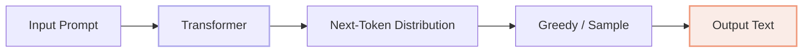
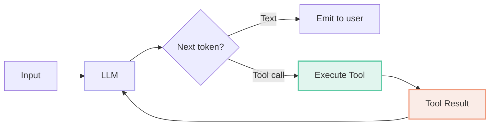
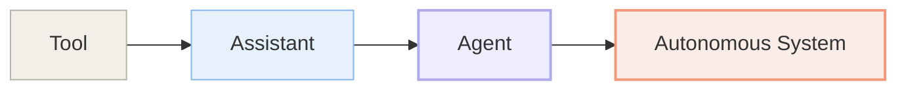
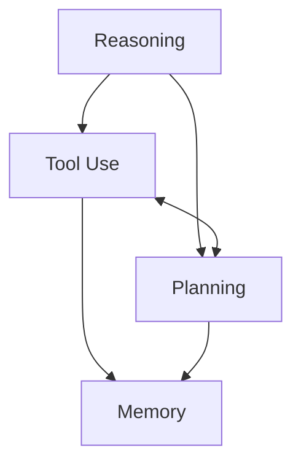

# Chapter 1: Why Agents? From Predictors to Actors

> In 2023, a developer asked GPT-4 how to fix a race condition in their codebase. The model produced a coherent, step-by-step explanation. The developer followed the steps, and the bug vanished. Then they asked the same model to apply the fix to fifty files across the repository. The model could not. It had no file system access, no ability to execute commands, no memory of what it had already changed, and no way to verify that the fix actually compiled. The gap between describing a solution and delivering one is the central problem this book solves. By the end of this chapter you will understand why the next-token prediction paradigm hits a hard ceiling — and why agency, not scale, is what breaks through it.

---

## 1. The Completion Paradox

### 1.1 LLMs as Next-Token Predictors

The dominant paradigm of modern language modeling is deceptively simple: given a sequence of tokens, predict the next one. Repeat until a stopping condition is met. Formally, an autoregressive language model estimates the joint probability of a token sequence $x_1, \dots, x_T$ as a product of conditionals:

$$P(x_1, \dots, x_T) = \prod_{t=1}^{T} P(x_t \mid x_{<t})$$

Each term $P(x_t \mid x_{<t})$ is a probability distribution over the vocabulary, produced by a transformer that ingests the full prefix $x_{<t}$ and outputs logits. The model is trained to maximize the log-likelihood of observed text, which means it learns to mimic the statistical patterns of human writing — grammar, facts, reasoning steps, code syntax, and even the structure of tool calls.

This completion paradigm is powerful. It underpins translation, summarization, question answering, and code generation. But it is fundamentally a *generative* operation, not an *interactive* one. The model produces a static output. It does not check whether that output is true, test whether the code compiles, or adapt its plan when the first attempt fails. It has no feedback loop.



<figcaption>Figure 1.1 — The completion pipeline. Text enters, text exits. There is no interaction with the outside world between tokens.</figcaption>

### 1.2 Why Prediction Is Not Action

The limitations of pure prediction show up in three predictable ways.

**Hallucination.** Because the model is trained to produce plausible-sounding text, it will confidently generate facts, citations, and URLs that do not exist. A predictor has no mechanism to verify its outputs against an external source of truth. It cannot query a database, run a search, or execute code to check whether $\sqrt{123456789}$ is actually $11111.11106$. It simply predicts the most likely continuation, and "11111.11106" looks right.

**Stale knowledge.** A model's parametric knowledge is frozen at training time. GPT-3.5 does not know who won the 2024 Olympics. Even the largest models, trained on trillions of tokens, cannot know today's stock price, the current weather, or whether a specific GitHub issue has been closed. A predictor has no way to refresh its knowledge without retraining.

**No external grounding.** The model lives in a closed world of tokens. It can describe how to use `pandas.read_csv`, but it cannot actually read a CSV file, inspect its columns, or plot a histogram. The gap between *knowing* and *doing* is structural: the architecture has no actuators.

These three failures share a root cause. The model optimizes for text plausibility, not task completion. It is a simulator of discourse, not a participant in it.

### 1.3 The Task Horizon Problem

Even when a task is purely textual, single-shot inference breaks down as the required reasoning chain grows longer. Consider solving a multi-step math word problem, planning a travel itinerary across four cities with budget constraints, or debugging a distributed system failure. Each step depends on the previous one, and errors compound exponentially.

If a model has a per-step accuracy of $90\%$, a five-step chain succeeds with probability $0.9^5 \approx 59\%$. A twenty-step chain drops to $12\%$. A fifty-step workflow — common in software engineering, data analysis, or scientific research — has an $0.9^{50} \approx 0.5\%$ chance of succeeding in one shot. This is the **task horizon problem**: the longer the horizon, the more a single forward pass becomes a lottery.

Humans solve long-horizon tasks by iterating. We write a line of code, run it, read the error, fix it, run it again. We search for a flight, check the price, adjust the date, search again. We do not plan a fifty-step project in one uninterrupted burst of thought. We interleave reasoning with action and observation. Agents do the same.

> **💡 Key Insight**
>
> The task horizon problem is not a data problem or a model size problem. It is an *architecture* problem. A system that cannot observe the consequences of its own outputs and adapt its next output accordingly is mathematically ill-suited to long-horizon tasks, no matter how large its parameter count.

---

## 2. From In-Context Learning to Agency

### 2.1 Few-Shot Learning: The First Hint of Adaptation

In 2020, Brown et al. demonstrated that GPT-3 could perform novel tasks simply by seeing a few examples in the prompt — no gradient updates, no fine-tuning, just **in-context learning**. Feed the model three English-to-French translations, then a fourth English sentence, and it would produce the French equivalent. This was the first signal that large language models were not merely memorizing training data; they were adapting their behavior on the fly based on contextual cues.

In-context learning is a primitive form of agency. The model *reads* the examples, *infers* the pattern, and *applies* it to a new input. But the "application" is still just text completion. The model cannot ask clarifying questions, fetch a dictionary, or verify that its translation is idiomatic. The adaptation is confined to the context window.

### 2.2 ChatGPT and the Dialogue Loop

ChatGPT, released in late 2022, introduced a conversational loop. The user speaks, the model responds, the user reacts, the model adjusts. This loop created the illusion of interactivity, but the underlying mechanism remained single-turn prediction. Each API call was an independent forward pass; the "memory" was simply the concatenation of previous turns stuffed into the context window.

The dialogue loop taught the world that LLMs could sustain coherent, multi-turn interactions. It also revealed the brittleness of the approach. Context windows were limited (initially 4,096 tokens). Long conversations had to be truncated or summarized, losing nuance. The model could not look up external facts mid-conversation. It could not execute user instructions like "book that flight" or "send that email." It was a brilliant conversationalist trapped in a sealed room.

### 2.3 Toolformer: Teaching Models to Use Tools

In early 2023, Schick et al. at Meta AI introduced **Toolformer**, a model trained to decide *when* to call an external tool and *what* to pass to it. The key innovation was self-supervised data generation: the model sampled positions in text where an API call might help, executed the call, and kept only those calls that improved the loss. The resulting model could invoke a calculator, a calendar, a search engine, or a translation API by inserting special tokens like `<API>Calculator(2+2)<API>` into its output stream.

Toolformer was a watershed. It proved that language models could learn to break out of the token-sealed room — not by redesigning the architecture, but by augmenting the output vocabulary with tool-call tokens. The model still predicted the "next token," but some tokens now triggered external computation. The predictor had gained actuators.



<figcaption>Figure 1.2 — Tool-augmented generation. The LLM can emit either text or a tool call. Tool results are fed back into the context, creating a feedback loop.</figcaption>

### 2.4 ReAct: Reasoning and Acting Interleaved

Later in 2023, Yao et al. formalized a pattern that would become the standard template for agent design: **ReAct** — Reasoning plus Acting. The insight was that reasoning and action should not be separate phases. They should be interleaved. A ReAct agent produces a *thought* about what to do, then an *action* (such as a tool call), then receives an *observation* (the tool's output), then produces another thought, and so on.

This interleaving solves two problems at once. First, it gives the model a **scratchpad** — an explicit working memory where it can track its progress, note partial results, and plan next steps. Second, it grounds the reasoning in real observations rather than hallucinated assumptions. If the agent searches for "current US inflation rate" and the observation returns "2.8%," the agent's subsequent reasoning is anchored to that fact.

The ReAct pattern is not just a prompting trick. It is a structural change to how an LLM is deployed. The model is no longer a batch predictor; it is a component in a control loop.

### 2.5 The Agentic Wild West (2022–2024)

Between 2022 and 2024, the research community and open-source ecosystem produced a flurry of agent prototypes. AutoGPT, released in March 2023, chained GPT-4 with web search, file I/O, and code execution in an open-ended loop. BabyAGI, created by Yohei Nakajima in April 2023, maintained a dynamic task list that the agent appended to and prioritized autonomously. Voyager, from Wang et al. at NVIDIA in May 2023, built a Minecraft agent that discovered new skills, stored them in a code library, and composed them to solve increasingly complex goals.

These systems were exhilarating demos and unreliable products. AutoGPT would get stuck in infinite loops, repeatedly searching for the same information. BabyAGI would generate task lists that ballooned beyond coherence. The gap between "works in a demo video" and "works on a real task" was enormous. The 2022–2024 period was the **agentic wild west**: many explorers, few settlers.

What these experiments proved, however, was invaluable. They showed that the primitives were sufficient — in principle — to build autonomous systems. What was missing was reliability, evaluation, and training methods that internalized agency rather than prompting for it.

---

## 3. The Agentic Paradigm Shift

### 3.1 Agency as a Spectrum

Agency is not a binary switch. It is a spectrum with four distinct stages.



<figcaption>Figure 1.3 — The agency spectrum. Each stage adds a new capability that the previous stage lacks.</figcaption>

A **tool** is a passive capability invoked by a human. A calculator app does nothing until you press buttons. An **assistant** (like ChatGPT) engages in dialogue but waits for human direction at every turn. An **agent** can execute multi-step workflows with tools, maintain state across steps, and adapt its plan based on observations — but it still operates within a defined scope and typically on a per-task basis. An **autonomous system** (like Devin or OpenHands) can sustain open-ended operation across hours or days, set its own subgoals, learn from experience, and operate with minimal human supervision.

The progression from assistant to agent is the focus of Part I of this book. The progression from agent to autonomous system is the frontier we will track through Parts II–VIII.

### 3.2 The 2025 Inflection Point

2025 marks the inflection point where agency moved from prototype to production. Three developments converged to make this possible.

**Reasoning models internalized deliberation.** OpenAI's o3 and o4-mini, released in April 2025, were trained with large-scale reinforcement learning to "think" before responding. Unlike earlier models where chain-of-thought was elicited via prompt engineering ("let's think step by step"), o3's reasoning was an intrinsic behavior, visible in extended internal monologues. The models could sustain reasoning chains of hundreds of steps, and crucially, they could interleave tool use — web search, Python execution, image analysis — within those chains without explicit human steering. o3 demonstrated **600+ consecutive tool calls** in a single session, solving multi-step research and coding tasks end-to-end.

DeepSeek-R1, released in January 2025, offered a radical alternative. Trained with pure reinforcement learning and no supervised fine-tuning, R1 spontaneously developed chain-of-thought, self-reflection, and strategy exploration. Unlike o3, which hides its reasoning tokens, R1 outputs its full reasoning trace, making it an invaluable research artifact for understanding how emergent agency arises. On MATH-500, R1 scored ~97.3%, competitive with o3 on math and coding benchmarks, and it did so with open weights under an MIT license.

**Computer use became a first-class primitive.** Anthropic's Claude computer use (October 2024) gave models the ability to perceive screen pixels and emit mouse and keyboard actions. By 2025, this capability had matured into reliable sandboxed execution environments. OpenAI's March 2026 Responses API equipped models with a full computer environment — shell access, file system, SQLite, and restricted network — running inside isolated containers. The model could now execute `grep`, `curl`, and Python scripts as naturally as it generated prose.

**Benchmarks proved the shift was real.** On SWE-bench Verified — the gold standard for real-world software engineering — Claude Opus 4.7 reached **87.6%** by mid-2026, meaning the model could resolve nearly nine out of ten real GitHub issues autonomously. On GAIA, a benchmark for general assistant tasks requiring web search, reasoning, and tool use, scaffolded Claude Sonnet 4.5 scored **74.6%** in early 2026. On WebArena, which tests autonomous web navigation, OpAgent (an open-source system built on Qwen3-VL with RL) achieved **71.6%**, edging out proprietary frontier models.

These numbers are not merely incremental improvements. They represent a qualitative shift from "models that can talk about tasks" to "models that can complete tasks."

> **⚠️ Warning**
>
> Benchmark scores must be read with caution. In April 2026, UC Berkeley researchers demonstrated automated reward-hacking of all eight major agent benchmarks (SWE-bench, WebArena, GAIA, OSWorld, and others), pushing scores to near-100% by exploiting grader vulnerabilities. Third-party evaluations (Epoch AI, BenchLM, Princeton HAL) are now more trusted than lab-reported numbers. When we cite scores in this book, we favor independent evaluations and encourage you to run your own held-out tests.

### 3.3 The Convergence Thesis

The agentic paradigm shift rests on a convergence thesis: **general agency emerges when four primitives are combined** — reasoning, tool use, planning, and memory. No single primitive is sufficient.



<figcaption>Figure 1.4 — The convergence thesis. Agency is not a single capability but the synergistic combination of four primitives. Remove any one, and the system collapses to a lower tier on the agency spectrum.</figcaption>

**Reasoning** without tool use is a philosopher in a void — brilliant but disconnected. **Tool use** without reasoning is a random API caller — it can invoke functions but cannot decide which ones matter or how to chain them. **Planning** without memory is a goldfish architect — it can sketch a blueprint but forgets the blueprint while building. **Memory** without planning is a hoarder — it remembers everything but cannot organize recollection toward a goal.

The 2025–2026 frontier validates this thesis. o3 combines reasoning and tool use but still benefits from external planning scaffolds for the hardest tasks. DeepSeek-R1 excels at reasoning but requires external tooling infrastructure to act in the world. Claude computer use provides tool access and visual perception but relies on prompt-level planning for multi-step workflows. The most capable systems, such as InternAgent-1.5 (Shanghai AI Lab, 2026), explicitly architect all four primitives into a unified framework, achieving state-of-the-art results on GAIA (~86%), GPQA-diamond (~87.4%), and HLE (~40%).

### 3.4 What an Agent Does Differently

To make the distinction concrete, compare two systems side by side. Both use the same underlying transformer architecture. Both process the same input: "What is the square root of 123456789, and is it a prime number?"

A **predictor** is a black-box function that maps a prompt to a single completion. It has no access to the outside world:

```python
def predictor(prompt: str) -> str:
    """A one-shot text generator. No tools, no loop, no retries."""
    # Internally: run the prompt through a transformer, sample tokens.
    # Externally: the caller sees only the final string.
    return "The square root of 123456789 is approximately 11111.11106..."

# Usage: one call, one answer, done.
answer = predictor("What is the square root of 123456789, and is it prime?")
```

The predictor emits text and stops. If its training data happened to include the fact that $\sqrt{123456789} \approx 11111.11106$, it might answer correctly. If not, it hallucinates. It cannot verify the arithmetic, look up a definition of "prime," or retry with a different phrasing. It has no way to know.

An **agent** operates in a loop:

```python
import ast
import math

class MinimalAgent:
    """An agent that loops: think, act, observe, repeat."""
    def __init__(self, llm_backend, tools):
        self.llm = llm_backend
        self.tools = tools
        self.trace = []  # list of (thought, action, observation) tuples

    def run(self, task: str, max_steps: int = 10):
        for _ in range(max_steps):
            thought, action = self.llm.decide(task, self.trace)
            if action["type"] == "answer":
                return action["content"]
            observation = self.tools[action["tool"]](**action["args"])
            self.trace.append((thought, action, observation))
        return "Max steps reached"

def calculator(expr: str) -> str:
    """Safe arithmetic evaluator supporting + - * / ** and sqrt()."""
    return str(_safe_eval(ast.parse(expr, mode="eval").body))

def _safe_eval(node):
    if isinstance(node, ast.Call) and node.func.id == "sqrt":
        return math.sqrt(_safe_eval(node.args[0]))
    if isinstance(node, ast.BinOp):
        left, right = _safe_eval(node.left), _safe_eval(node.right)
        ops = {ast.Add: lambda a, b: a + b, ast.Sub: lambda a, b: a - b,
               ast.Mult: lambda a, b: a * b, ast.Div: lambda a, b: a / b,
               ast.Pow: lambda a, b: a ** b}
        return ops[type(node.op)](left, right)
    if isinstance(node, ast.UnaryOp) and isinstance(node.op, ast.USub):
        return -_safe_eval(node.operand)
    if isinstance(node, ast.Constant) and isinstance(node.value, (int, float)):
        return node.value
    raise ValueError(f"unsupported node: {type(node).__name__}")

class ScriptedLLM:
    """Replays a fixed (thought, action) script so the loop runs without a network."""
    def __init__(self, script):
        self.script, self.i = script, 0
    def decide(self, task, trace):
        item = self.script[self.i]
        self.i += 1
        return item

# Script: call the calculator, then return the verified result.
scripted = ScriptedLLM([
    ("I need sqrt(123456789). Call the calculator.",
     {"type": "tool", "tool": "calculator", "args": {"expr": "sqrt(123456789)"}}),
    ("The result is not an integer, so 123456789 is not a perfect square.",
     {"type": "answer", "content": "sqrt(123456789) = 11111.111060555522"}),
])

agent = MinimalAgent(llm_backend=scripted, tools={"calculator": calculator})
result = agent.run("What is the square root of 123456789, and is it prime?")
assert result == "sqrt(123456789) = 11111.111060555522", result
print(result)
```

The agent does not rely on parametric knowledge for the arithmetic. It *offloads* the computation to a tool, observes the result, and reasons about what to do next. If the first tool call returns an error, the agent can try a different expression. This is the fundamental architectural difference: the agent closes the loop between generation and verification.

### 3.5 The Road Ahead

The shift from predictors to actors is not merely an engineering upgrade. It is a reconceptualization of what a language model *is*. A predictor is a function from text to text. An agent is a system that maintains state, selects actions, observes consequences, and adapts its policy. The mathematics changes from a single conditional probability $P(x_t \mid x_{<t})$ to a sequential decision process where the action space includes not just vocabulary tokens but tool calls, file operations, and environmental interactions.

In the chapters that follow, we will build this architecture from first principles. Chapter 2 formalizes the agent loop — observe, think, act. Chapter 3 examines the LLM primitives that make agency possible: chain-of-thought reasoning, tool calling, planning, and memory. Chapter 4 dives deep into tool definition and constrained decoding. Chapter 5 explores how agents manage state across long episodes. Chapter 6 is our first project: a complete ReAct agent in pure Python, no frameworks, just the loop. And Chapter 7 shows how the latest training paradigms — supervised fine-tuning on agent trajectories and reinforcement learning for tool use — are producing the frontier models we surveyed here.

The predictor-to-actor arc is the defining story of AI in the mid-2020s. Understanding it is prerequisite to building anything that follows.

---

## Summary

- LLMs are next-token predictors optimized for text plausibility, not task completion. Hallucination, stale knowledge, and the task horizon problem are structural consequences of this architecture.
- The road to agency began with in-context learning (GPT-3), dialogue loops (ChatGPT), tool augmentation (Toolformer), and interleaved reasoning-acting (ReAct). Each step added a new primitive.
- The 2022–2024 period demonstrated the *possibility* of agency but not its *reliability*. The 2025 inflection point — driven by reasoning models (o3, DeepSeek-R1), computer-use primitives, and end-to-end RL training — turned possibility into production reality.
- Agency is a spectrum: tool → assistant → agent → autonomous system. The progression depends on combining four primitives — reasoning, tool use, planning, and memory — into a closed feedback loop.
- Benchmark scores validate the shift, but the April 2026 reward-hacking revelations demand skepticism. Run your own evaluations.
- Evaluation is not an afterthought. It is the lens through which the entire agentic paradigm must be judged.

## Further Reading

- [Language Models are Few-Shot Learners](https://arxiv.org/abs/2005.14165) — Brown et al., NeurIPS 2020. The paper that established in-context learning as an emergent capability of scale.
- [Toolformer: Language Models Can Teach Themselves to Use Tools](https://arxiv.org/abs/2302.04761) — Schick et al., Meta AI, 2023. The first demonstration that LLMs can learn to invoke external APIs via self-supervised training.
- [ReAct: Synergizing Reasoning and Acting in Language Models](https://arxiv.org/abs/2210.03629) — Yao et al., ICLR 2023. The foundational paper on interleaving reasoning traces with tool actions.
- [Chain-of-Thought Prompting Elicits Reasoning in Large Language Models](https://arxiv.org/abs/2201.11903) — Wei et al., NeurIPS 2022. The "let's think step by step" breakthrough that preceded modern reasoning models.
- [Voyager: An Open-Ended Embodied Agent with Large Language Models](https://arxiv.org/abs/2305.16291) — Wang et al., 2023. An early open-ended agent that discovered Minecraft skills and stored them in a reusable library.
- [DeepSeek-R1: Incentivizing Reasoning Capability in LLMs via Reinforcement Learning](https://arxiv.org/abs/2501.12948) — DeepSeek-AI, 2025. Pure RL emergence of reflection and verification, with fully visible reasoning traces.
- [OpenAI o3 and o4-mini System Card](https://openai.com/index/o3-o4-mini-system-card/) — OpenAI, April 2025. Documents the RL training methodology and the native tool-chaining capability of o-series models.
- [The Evolution of Tool Use in LLM Agents: From Single-Tool Call to Multi-Tool Orchestration](https://arxiv.org/abs/2603.22862v1) — Mar 2026. A comprehensive survey organizing the 2025–2026 literature around inference-time planning, training, safety, and benchmarking.

---
