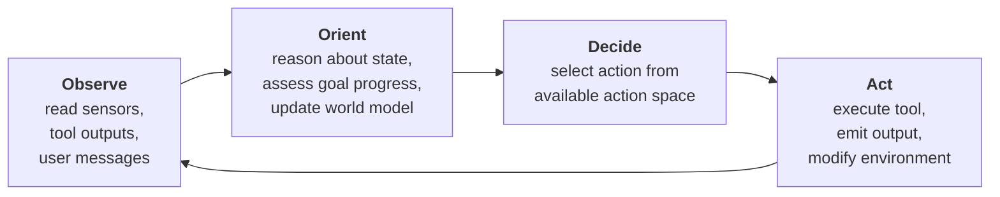
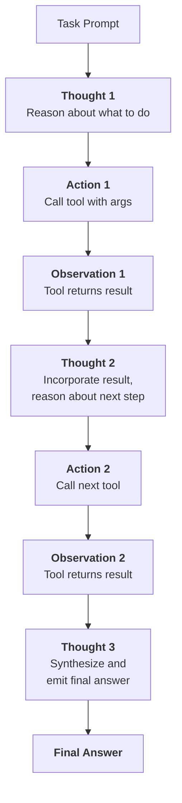
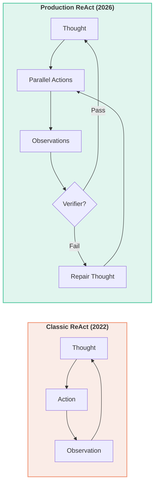

# Chapter 2: The Agent Loop — Observe, Think, Act

> In 2023, the dominant approach to AI assistance required humans to type prompts and interpret outputs — a single-turn transaction with no memory, no tools, and no agency. The model could describe how to fix a bug but could not apply the fix itself. The gap between knowing and doing is what agency bridges, and the bridge is built from a loop: observe the world, orient within it, decide what to do, and act. By the end of this chapter you will understand not just how that loop works, but how modern systems harden it with verification, parallel execution, and error recovery — and you will build a minimal ReAct agent in pure Python that runs it.

---

## 1. The OODA Loop Applied to AI

### 1.1 From Dogfights to Decision Cycles

In the 1970s, US Air Force Colonel John Boyd studied aerial combat and noticed a pattern. The pilot who won was not necessarily the one with the faster aircraft or the better radar. The pilot who won was the one who cycled through a four-step process more quickly than the opponent: **Observe** the situation, **Orient** to what it means, **Decide** on a response, and **Act** before the enemy could react. Boyd called this the **OODA loop**, and its central thesis — that faster decision cycles beat slower ones — became foundational to modern military strategy.

The same principle applies to AI agents. An agent is not a static function that maps input to output. It is a process that repeatedly samples the environment, updates its internal model of the world, selects an action, executes it, and feeds the result back into the next cycle. The faster and more accurately an agent can complete this loop, the more effectively it operates in dynamic environments.

The four phases map cleanly to agent architecture:



*Figure 2.1 — The OODA loop as an agent architecture. Each cycle feeds the next; the loop is the agent.*

Boyd's original insight was about *tempo*: compressing the cycle time relative to an adversary. For AI agents, the adversary is not an enemy pilot but entropy, ambiguity, and the accumulation of errors over long task horizons. An agent that completes ten OODA cycles in the time another completes five can recover from mistakes, explore more paths, and reach a correct answer with higher probability.

### 1.2 Observe: Perceiving the Environment

The **Observe** phase is where the agent receives raw information from its environment. Unlike a chatbot that only sees the latest user message, an agent may observe multiple streams simultaneously: the result of a web search, the stdout of a Python script, the current DOM of a browser page, or the temperature reading of a sensor.

The observation space is heterogeneous by design. A single step might produce a JSON API response, an error traceback, an image screenshot, and a status code. The agent's first job is to ingest these into a unified representation — typically text — that can be processed by the reasoning module. In modern systems this ingestion is often mediated by the **Model Context Protocol (MCP)**, which standardizes how tool outputs are serialized into the agent's context window.

A critical distinction emerges here between *observations* and *rewards*. An observation is descriptive: it tells the agent what is true about the environment right now. A reward is evaluative: it tells the agent how well it is doing. In reinforcement learning, rewards drive policy updates. In LLM-based agents, rewards are often sparse or absent; the agent relies primarily on observations to decide its next move.

### 1.3 Orient: Reasoning About State and Progress

The **Orient** phase is where the agent builds its internal model. This is the cognitive core of the loop. The agent must answer three questions on every cycle:

1. Where am I relative to the goal?
2. What did the last action achieve or fail to achieve?
3. What has changed in the environment that affects my plan?

In early agent systems, orientation was hardcoded: if observation contains "error", then retry with modified parameters. Modern agents use an LLM as the orientation engine. The model reads the observation, reads the history of previous thoughts and actions (the **scratchpad** or **trace**), and generates a reasoning step that interprets the new information in context.

This is where the 2025–2026 frontier is most active. Systems like the **Agentic OODA Loop** from cybersecurity platforms now build an explicit **world model** during orientation: confidence scores for each hypothesis, cross-domain correlations between observations, and outcome tracking that updates beliefs over time. Rather than running static scripts, the orient phase becomes a continuous Bayesian update.

### 1.4 Decide: Selecting the Next Action

The **Decide** phase maps the oriented state onto an **action space**. The action space is the set of all things the agent is allowed to do. It might be discrete (a fixed registry of tools: `search`, `calculator`, `file_read`) or continuous (parameterized motor controls in robotics). For LLM-based agents, the action space is typically a structured output: a JSON object naming a tool and providing arguments.

The decision is not always a single action. Modern APIs (OpenAI, Anthropic, Gemini as of 2025) allow **parallel tool calls**, turning the sequential ReAct trace into a directed acyclic graph of concurrent actions. An agent might decide to search the web, read a local file, and run a calculation all in the same step, then orient over the combined observations in the next cycle.

A 2026 development from policy-aware governance frameworks embeds authorization directly into the decide phase. Every proposed tool invocation is evaluated at runtime by a policy engine (for example, Cedar or OpenClaw). If the policy denies the action, the denial becomes feedback that triggers replanning rather than termination. This creates a **Zero Trust** posture where authority is continuously verified based on context and intent, not just identity.

### 1.5 Act: Execution and Feedback

The **Act** phase is where the agent touches the world. It might call an API, execute a Python function, write a file, or send a message to another agent. The action produces a new observation, and the loop begins again.

Execution is where agents fail most visibly. A tool call might timeout, return malformed data, or throw an exception. The quality of an agent system is measured not by whether it avoids these failures — it cannot — but by how quickly it observes the failure, orients to its cause, decides a recovery strategy, and acts again.

In production systems as of 2026, the act phase increasingly includes **safety guardrails**: a dedicated verifier intercepts every action payload against a policy engine before dispatch. If the verifier fails, the agent emits a **Repair Thought** before retrying. This three-layer architecture — step-level verification, sub-task-level grounding, and trajectory-level reflection — has become the default pattern in systems like Claude Code, OpenHands, and Cursor Composer.

---

## 2. Agent State and Environment

### 2.1 What the Agent Remembers Between Steps

An agent without state is just a function. State is what persists from one OODA cycle to the next, and it determines what the agent "knows" that it did not know at the start. The minimal state of a ReAct agent contains three components:

- The **task** or goal description.
- The **available tools** and their schemas.
- The **trace**: the accumulated sequence of (thought, action, observation) tuples.

This state lives in the LLM's context window, which acts as volatile RAM: fast, limited, and erased when the session ends. Long-horizon agents require additional state mechanisms — vector memory, knowledge graphs, or external databases — but the core loop operates on the trace.

```text
┌─────────────────────────────────────────┐
│           Agent State (Step k)          │
├─────────────────────────────────────────┤
│  Goal: "Calculate Q3 revenue growth"      │
│  Tools: [search, calculator, file_read] │
│  Trace:                                 │
│    Step 1: thought → action → obs       │
│    Step 2: thought → action → obs       │
│    ...                                  │
│    Step k-1: thought → action → obs     │
└─────────────────────────────────────────┘
            │
            ▼
┌─────────────────────────────────────────┐
│         Environment (External)          │
│  [Web, Files, APIs, Databases, Users]   │
└─────────────────────────────────────────┘
```

*Figure 2.2 — Agent state and environment. The state is the agent's working memory; the environment is everything outside it that the agent can observe and modify.*

The loop invariant is simple but powerful: at the start of every cycle, the agent has a goal, a set of tools, and a complete trace of everything that has happened so far. This invariant is what makes the ReAct loop mathematically well-defined. It is also what makes context windows the fundamental bottleneck of modern agents.

### 2.2 Action Space: Discrete, Continuous, and Structured

The **action space** defines what the agent can do. Three categories dominate current systems:

| Type | Example | When to Use |
|------|---------|-------------|
| **Discrete tools** | `search(query)`, `calculator(expr)` | Well-defined, reusable operations with clear schemas |
| **Continuous parameters** | Motor torque values, temperature setpoints | Robotics, control systems, physical embodiment |
| **Structured outputs** | JSON with `tool_name` and `arguments` | LLM-based agents where the model must choose and parameterize actions |

For LLM agents, the action space is typically specified as a list of tool definitions in JSON Schema format. The model does not "see" the implementation of the tools; it sees their names, descriptions, and parameter schemas. The quality of these descriptions is often the difference between a working agent and a broken one. A tool named `calc` with no description will be ignored; a tool named `python_calculator` with a clear docstring and example usage will be invoked correctly.

Modern frameworks (PydanticAI v1.94, smolagents v1.24, CrewAI v1.14) converge on the same pattern: the action space is a typed registry, and the LLM's output is validated against the schema before execution. If validation fails, the error is fed back as an observation, and the agent retries.

### 2.3 Observations vs. Rewards

It is worth being precise about feedback types. In reinforcement learning, the environment returns a tuple `(observation, reward, terminated, truncated)`. In LLM-based agents, the environment usually returns only an observation. The agent must infer progress from the observation itself.

This difference matters because it changes how we design environments for agents. A code execution environment should return the full stdout, stderr, and exit code — not just a binary pass/fail. A web search environment should return the raw search results, not a pre-synthesized summary. The agent needs rich observations to orient effectively.

When rewards are available — for example, in RL-trained reasoning models like o3/o4-mini or DeepSeek-R1 — they are typically sparse end-of-episode signals. The agent receives no reward for intermediate steps, which makes credit assignment difficult. **Process Reward Models (PRMs)** address this by scoring each step individually, but they are expensive to train and remain a frontier research topic (see Chapter 15).

### 2.4 Episodic vs. Continuing Tasks

Tasks fall into two categories. **Episodic tasks** have a clear beginning and end: answer this question, fix this bug, book this flight. The agent runs its loop until a termination condition is met, then stops. **Continuing tasks** have no natural endpoint: monitor this server, manage this inbox, play this game indefinitely.

The loop design changes with the task type. Episodic agents optimize for success probability within a step budget. Continuing agents optimize for sustained performance and must handle memory consolidation, forgetting, and drift over arbitrarily long horizons. Most of this book focuses on episodic tasks because they are the building blocks of continuing behavior.

---

## 3. The ReAct Pattern Formalized

### 3.1 From OODA to ReAct

The **ReAct** pattern, introduced by Yao et al. in 2022, formalizes the OODA loop for LLM-based agents. It interleaves three primitives in a strict sequence:

1. **Thought** — the orient phase, expressed as natural language reasoning.
2. **Action** — the decide and act phases, expressed as a structured tool call.
3. **Observation** — the observe phase, expressed as the tool's return value.

The sequence forms a **trace**: `Thought_1 → Action_1 → Observation_1 → Thought_2 → Action_2 → Observation_2 → ... → Final Answer`.



*Figure 2.3 — The ReAct trace as an interleaved reasoning-acting chain. Each observation feeds the next thought; the scratchpad accumulates the full history.*

The key insight of ReAct is that reasoning and acting should not be separated. A plan generated in isolation — without grounding in real observations — is brittle. An action taken without reasoning — pure tool chaining — is blind. By interleaving them, the agent can reason about what it observes and observe the consequences of what it reasons.

### 3.2 The Scratchpad as Working Memory

The **scratchpad** is the accumulated trace of all thoughts, actions, and observations. It is the agent's working memory, and it lives in the LLM's context window. On every cycle, the entire scratchpad is fed back into the model as part of the prompt.

This design has a critical implication: the scratchpad grows linearly with the number of steps. A 20-step ReAct trace can consume thousands of tokens, and a 100-step trace can exceed the context window of smaller models. Production systems in 2026 address this with **contextual compaction** or **TTL pruning**: early steps are auto-summarized or hidden to keep the active context within the "golden context window" of approximately 32K tokens, enabling longer loops without linear cost growth.

Some advanced systems (KDCube ReAct v2, 2026) implement **in-loop tools** that let the agent manage its own scratchpad. The agent can call `react.hide` to archive old steps or `react.memsearch` to retrieve relevant past observations from external memory. This turns the scratchpad from a passive buffer into an active resource that the agent optimizes.

### 3.3 When to Stop: Termination Conditions

An agent that does not know when to stop is dangerous. It will consume API credits, pollute databases, or loop forever. ReAct agents use a combination of termination conditions:

| Condition | Mechanism | Risk |
|-----------|-----------|------|
| **Answer found** | LLM emits a special `final_answer` action | Premature termination on wrong answer |
| **Max steps reached** | Hard limit (e.g., 10, 25, 100) | Incomplete task if limit too low |
| **No progress** | Same action repeated N times without state change | False detection if environment is stochastic |
| **Error threshold** | Consecutive tool failures exceed limit | Overly conservative if errors are recoverable |
| **User interrupt** | Human-in-the-loop approval gate | Latency and scalability cost |

The most robust strategy combines multiple conditions. A typical production agent stops when it emits a final answer *or* when it reaches 25 steps *or* when it makes the same failed tool call three times in a row. The "no progress" heuristic is particularly important because it catches the most common failure mode: infinite loops.

> **💡 Key Insight**
>
> The scratchpad is the key innovation of ReAct — not the tool calls, not the reasoning, but the accumulation of both into a persistent, inspectable trace. Without the scratchpad, each step is stateless; with it, the agent has memory, and memory is the prerequisite for learning from mistakes.

### 3.4 Failure Modes: What Can Go Wrong Inside the Loop

The ReAct loop is simple in principle and fragile in practice. Four failure modes dominate production logs:

**Infinite loops.** The agent repeats the same action with the same arguments, observes the same result, and repeats again. This happens when the reasoning module does not update its plan based on the observation. The fix is the "no progress" termination heuristic and, in 2026 systems, a **verifier layer** that flags objective errors like schema mismatches before the next cycle begins.

**Repetitive actions.** Similar to infinite loops, but the agent cycles through a set of actions without making progress toward the goal. For example: search, read, search again with a slightly different query, read again. This is harder to detect than exact repetition because the action arguments change. Modern systems use **embedding-based similarity** on the scratchpad to detect semantic repetition.

**Tool call syntax errors.** The LLM emits malformed JSON, hallucinates a tool name, or provides arguments of the wrong type. These errors must be caught at parse time, fed back to the LLM as observations, and retried. A good agent framework wraps every tool call in `try/except` and formats the exception into a natural-language observation.

**Hallucinated tool names.** The model invents a tool that does not exist, such as `deep_search` when only `search` is available. This is mitigated by strict schema validation and by including explicit "available tools" reminders in the system prompt on every cycle.



*Figure 2.5 — Evolution from classic ReAct to production ReAct. The 2026 loop adds parallel actions, step-level verifiers, and repair thoughts, but the core interleaved reasoning-acting structure remains.*

### 3.5 Modern Variants: How the Loop Evolved in 2025–2026

The core ReAct loop has changed surprisingly little since 2022, but its surroundings have become substantially more sophisticated. Production systems now converge on a **three-layer self-correction architecture**:

```text
┌──────────────────────────────────────────┐
│         Trajectory Level (Reflexion)     │
│   After full run fails, write verbal     │
│   self-reflection to memory and retry.   │
└──────────────────────────────────────────┘
                    │
                    ▼
┌──────────────────────────────────────────┐
│         Sub-Task Level (CRITIC)          │
│   Ground claims against external evidence│
│   before committing side effects.        │
└──────────────────────────────────────────┘
                    │
                    ▼
┌──────────────────────────────────────────┐
│         Step Level (ReAct + Verifier)    │
│   Cheap, fast verification gates every   │
│   action before execution.               │
└──────────────────────────────────────────┘
```

*Figure 2.4 — Three-layer self-correction architecture in 2026 production agents. Errors are caught at the cheapest level possible, with higher layers handling more complex failures.*

At the step level, a lightweight verifier (often a smaller LLM or deterministic check) gates every action. At the sub-task level, **CRITIC** grounds claims against external evidence before committing irreversible side effects like file writes or API calls. At the trajectory level, **Reflexion** writes a verbal self-critique to memory after a failed run and retries the entire task.

Another major shift is the absorption of explicit ReAct scaffolding by **reasoning models**. OpenAI o3/o4-mini, DeepSeek-R1, and Gemini 2.5 Flash Thinking execute backtracking and tool-selection strategy *internally*, as emergent behaviors from RL training. The outer loop can be stripped down to role definition, tool schemas, and stop conditions — the model handles the reasoning trace on its own.

Finally, for hard tasks, frontier systems wrap the loop in **test-time search**:

- **Best-of-N + verifier:** Run N independent ReAct trajectories and select the best.
- **Tree search (MCTS/Beam):** Search over the thought space, pruning bad branches with a Process Reward Model.
- **Self-consistency:** Sample K traces and majority-vote the final answer.

These techniques trade compute for reliability and are discussed in depth in Chapters 19 and 23.

---

## 4. Building a Minimal ReAct Loop from Scratch

### 4.1 The Loop Invariant in Code

Before any frameworks, before PydanticAI or CrewAI or smolagents, the agent is just a loop. Let us write it in pure Python. The invariant is explicit: on every iteration, the agent has a goal, a registry of tools, and a trace of everything that has happened.

We implement the ReAct loop as a Python class with pluggable tools.

```python
import json
import re

class ReActAgent:
    """Minimal ReAct agent: no frameworks, no LLM wrappers, just the loop."""

    def __init__(self, llm_backend, tools, max_steps=10):
        self.llm = llm_backend          # callable: prompt -> str
        self.tools = {t.name: t for t in tools}  # name -> Tool
        self.max_steps = max_steps
        self.trace = []                 # list of (thought, action, observation)

    def run(self, task):
        for step in range(self.max_steps):
            # Build prompt from task + trace history
            prompt = self._build_prompt(task)

            # Ask LLM to think and act
            raw = self.llm(prompt)
            thought, action = self._parse_output(raw)

            # Execute tool or return final answer
            if action["tool"] == "final_answer":
                return action["args"]["answer"]

            observation = self._execute(action)
            self.trace.append({"thought": thought, "action": action, "observation": observation})

        return "Max steps reached"

    def _build_prompt(self, task):
        header = f"Task: {task}\nAvailable tools: {list(self.tools.keys())}\n"
        history = "\n".join(
            f"Thought: {step['thought']}\nAction: {json.dumps(step['action'])}\nObservation: {step['observation']}"
            for step in self.trace
        )
        instructions = "\nThink step by step. Then choose an action as JSON with keys 'tool' and 'args'."
        return header + history + instructions

    def _parse_output(self, raw):
        # Extract thought (free text before JSON) and action (JSON block)
        thought_match = re.search(r"Thought:(.+?)(?=Action:|$)", raw, re.DOTALL)
        thought = thought_match.group(1).strip() if thought_match else ""
        action_match = re.search(r"Action:\s*(\{.*?\})", raw, re.DOTALL)
        action = json.loads(action_match.group(1)) if action_match else {"tool": "none", "args": {}}
        return thought, action

    def _execute(self, action):
        tool_name = action.get("tool")
        if tool_name not in self.tools:
            return f"Error: tool '{tool_name}' not found."
        try:
            return self.tools[tool_name].run(**action.get("args", {}))
        except Exception as e:
            return f"Error: {type(e).__name__}: {e}"
```

This is the entire loop. The agent builds a prompt from the task and its trace, asks the LLM to think and act, parses the structured action, executes it, and appends the observation to the trace. No magic, no hidden state — just the invariant maintained explicitly.

### 4.2 Tool Definitions and Running the Loop

Tools are simple objects with a name, a description, and a `run` method. The description is what the LLM sees; the `run` method is what actually executes.

```python
class Tool:
    def __init__(self, name, description, run_fn):
        self.name = name
        self.description = description
        self.run = run_fn

# A mock LLM backend for demonstration
def mock_llm(prompt):
    """Hardcoded responses to simulate reasoning."""
    if "calculator" in prompt and "100" not in prompt:
        return "Thought: I need to calculate something.\nAction: {\"tool\": \"calculator\", \"args\": {\"expr\": \"2 + 2\"}}"
    elif "100" in prompt or "2 + 2" in prompt:
        return "Thought: The result is 4. I can now answer.\nAction: {\"tool\": \"final_answer\", \"args\": {\"answer\": \"4\"}}"
    return "Thought: I will search.\nAction: {\"tool\": \"search\", \"args\": {\"query\": \"test\"}}"

# Define two simple tools
calculator = Tool(
    name="calculator",
    description="Evaluates a Python math expression. Args: expr (str).",
    run_fn=lambda expr: str(eval(expr))  # never eval untrusted input in production
)

search = Tool(
    name="search",
    description="Searches the web. Args: query (str).",
    run_fn=lambda query: f"Results for '{query}': [mock result]"
)

# Instantiate and run
agent = ReActAgent(llm_backend=mock_llm, tools=[calculator, search], max_steps=5)
result = agent.run("What is 2 + 2?")
print(result)  # Output: 4

# Inspect the trace
for step in agent.trace:
    print(f"Thought: {step['thought'][:50]}...")
    print(f"Action:  {step['action']}")
    print(f"Obs:     {step['observation'][:50]}...")
    print()
```

The trace is inspectable, which is one of the great advantages of the ReAct pattern. Every thought, action, and observation is recorded in order. When the agent fails, you can read the trace and see exactly where reasoning went wrong.

### 4.3 Error Handling and Recovery

The `_execute` method in our minimal agent wraps every tool call in a `try/except` block. When a tool fails, the exception message is converted into a string observation and fed back to the LLM. This is the simplest and most effective error recovery strategy: do not crash the loop, just tell the agent what went wrong and let it reason about the failure.

In 2026 production systems, error recovery has become more structured. Frameworks like PydanticAI attach **retry policies** to individual tools: retry up to 3 times with exponential backoff, or retry only on specific exception types. Smolagents and AG2 execute code in **sandboxed environments** (Docker, E2B, WASM) so that even catastrophic tool failures do not compromise the host system.

A subtle but important technique is **error classification**. Not all errors are equal. A network timeout might be transient; a `PermissionError` is likely permanent; a `SyntaxError` in generated code indicates a reasoning failure. Classifying errors before feeding them back as observations helps the LLM decide whether to retry, replan, or abort.

---

## Summary

- The **OODA loop** (Observe, Orient, Decide, Act) from military strategy is the foundational architecture of AI agents. Faster cycles beat slower ones because they allow faster recovery from errors and more exploration of the action space.
- **Agent state** consists of the goal, the available tools, and the accumulated trace of thoughts, actions, and observations. This trace — the **scratchpad** — is the agent's working memory and the key innovation of the ReAct pattern.
- The **action space** defines what the agent can do. Modern agents use structured tool definitions (JSON Schema) that the LLM selects from and parameterizes on each step. Parallel tool calls and policy-aware governance are 2025–2026 developments that harden the decision phase.
- **Termination** is non-trivial. Robust agents combine multiple stop conditions: final answer emission, max step limits, no-progress detection, and user interrupts.
- **Failure modes** — infinite loops, repetitive actions, syntax errors, hallucinated tools — are best handled by layered verification: step-level error wrapping, sub-task-level grounding, and trajectory-level reflection.
- The minimal ReAct loop can be written in under 50 lines of pure Python. Frameworks add safety, concurrency, and observability, but the core mechanism remains: observe, think, act, repeat.

## Further Reading

- [ReAct: Synergizing Reasoning and Acting in Language Models](https://arxiv.org/abs/2210.03629) — Yao et al., 2023. The foundational paper interleaving chain-of-thought reasoning with tool use.
- [Building Effective Agents](https://www.anthropic.com/research/building-effective-agents) — Anthropic, 2024. The industry-defining argument for maximizing single-agent capability before adding multi-agent complexity.
- [The Agentic OODA Loop](https://snyk.io/fr/blog/agentic-ooda-loop/) — Snyk, 2025. How cybersecurity platforms embed the OODA cycle into autonomous defense systems.
- [Optimizing Data Center Performance with AI Agents and the OODA Loop Strategy](https://developer.nvidia.com/blog/optimizing-data-center-performance-with-ai-agents-and-the-ooda-loop-strategy) — NVIDIA, 2024. LLo11yPop and multi-agent fleet management via OODA.
- [Self-Correcting Agents: Reflexion, CRITIC, and ReAct Loops Compared](https://callsphere.ai/blog/self-correcting-agents-reflexion-critic-react-loops-compared-2026) — CallSphere, 2026. The three-layer correction architecture in production.
- [A Policy-Aware Agent Loop with Cedar and OpenClaw](https://www.windley.com/archives/2026/02/a_policy-aware_agent_loop_with_cedar_and_openclaw.shtml) — Windley, 2026. Embedding authorization directly into the agent decision cycle.
- [RP-ReAct: Reasoner-Planner supervising ReAct Executor](https://arxiv.org) — Dec 2025. Decouples high-level planning from low-level execution; extends the basic loop into a hierarchical system.

---
