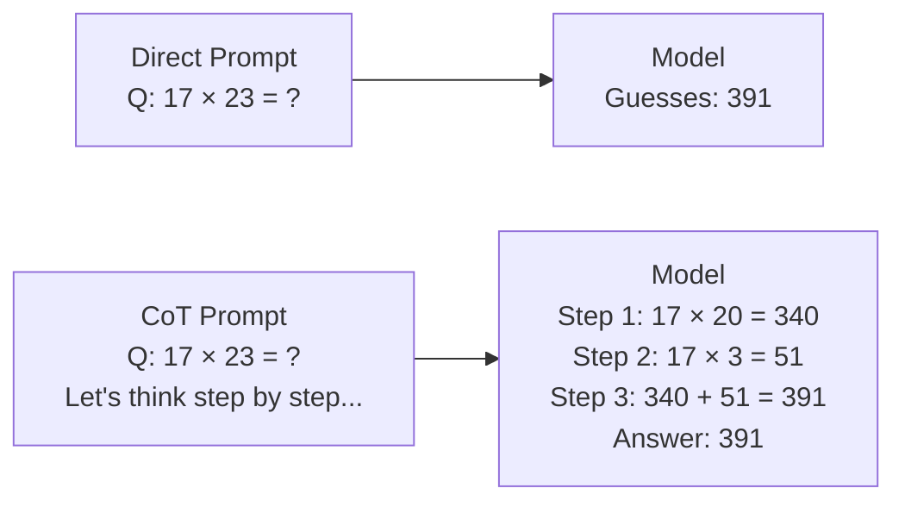
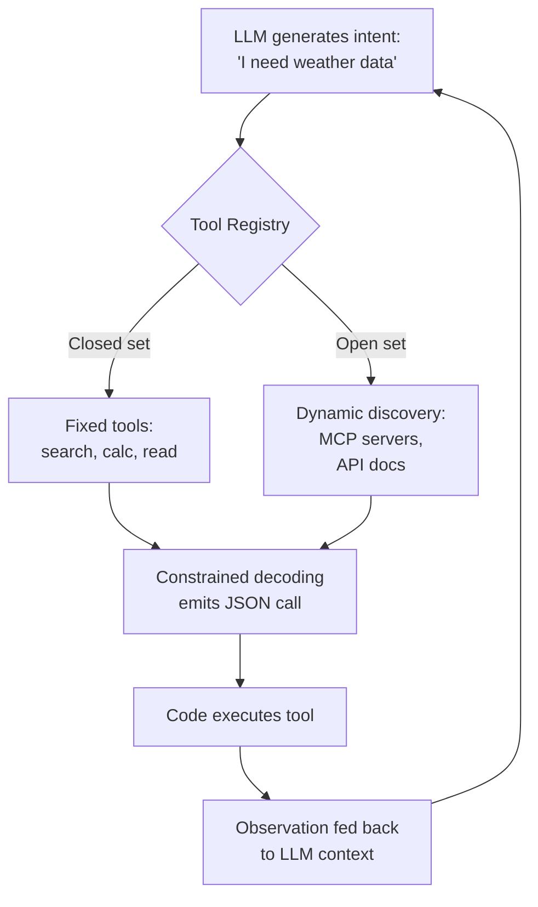
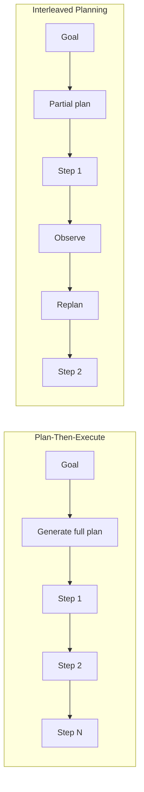
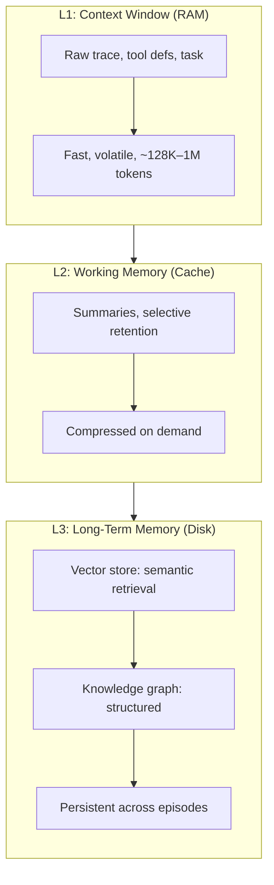

# Chapter 3: LLM Primitives for Agency

> A single call to `gpt-5.5` can write a haiku, summarize a paragraph, or translate a sentence. Ask it to calculate the Q3 revenue growth from three disparate CSV files, a stale database, and a web search, and it will hallucinate the numbers with confident prose. The problem is not model size or training data; it is that next-token prediction, in one shot, cannot reason over multiple steps, invoke external capabilities, decompose long goals, or remember what happened yesterday. The four primitives that bridge this gap — reasoning, tool use, planning, and memory — are the atomic elements from which every agent is built. By the end of this chapter you will understand how each primitive works in isolation, how they compose into the agent loop from Chapter 2, and you will implement the core mechanisms in pure PyTorch.

---

## 1. Reasoning as a Primitive

### 1.1 From Next-Token Prediction to Deliberation

An LLM trained on internet text is a supreme pattern matcher. Given "The capital of France is", it completes "Paris" because that sequence appears millions of times in its training data. But given "A train leaves Chicago at 60 mph and another leaves New York at 80 mph...", the correct completion requires arithmetic, temporal reasoning, and checking intermediate results — none of which are single-token patterns.

Before 2022, the dominant paradigm treated reasoning as an emergent property of scale: build bigger models and hope they figure it out. The **Chain-of-Thought (CoT)** breakthrough, introduced by Wei et al., rejected that premise. CoT showed that reasoning is not something a model must discover internally; it is something we can elicit by changing the *input format*. If the prompt contains examples that show step-by-step work, the model mirrors that structure and produces dramatically better answers on math, logic, and commonsense tasks.

The intuition is simple: the autoregressive objective forces the model to generate every token conditioned on all previous tokens. A scratchpad of intermediate steps turns a deep, single-pass computation into a sequence of shallow, verifiable steps. Each new token is easier to predict because the context already contains the reasoning path.



<figcaption>Figure 3.1 — Direct prompting forces the model to compress all reasoning into a single hidden state transition. CoT externalizes the reasoning trace into the context window, making each transition shallow and verifiable.</figcaption>

### 1.2 Zero-Shot CoT and Self-Consistency

**Zero-shot CoT**, discovered by Kojima et al., showed that even a single phrase — "Let's think step by step" — appended to the prompt is sufficient to trigger step-by-step reasoning without any hand-crafted examples. The model has seen so much explanatory text during pre-training that the phrase acts as a conditioned reflex, pulling the model into an "explanation mode" rather than a "completion mode." This is one of the most cost-effective tricks in the agent toolkit: zero examples, zero fine-tuning, just six words.

**Self-consistency** pushes further. Instead of trusting a single reasoning trace, we sample $N$ independent traces at a higher temperature, extract the final answer from each, and take a majority vote. The insight is that reasoning is stochastic: a model might make a sign error in one trace but get the arithmetic right in another. Voting over multiple paths washes out idiosyncratic errors. Formally, if we sample $N$ reasoning chains $r_1, \dots, r_N$ and extract answers $a_1, \dots, a_N$, the final prediction is:

$$\hat{a} = \arg\max_a \sum_{i=1}^{N} \mathbf{1}[a_i = a]$$

Self-consistency works only when the single-chain accuracy exceeds 50%. Below that threshold, the majority of samples are wrong, and voting amplifies the error. It is also expensive: every additional sample costs full inference tokens. The trade-off is reliability versus compute.

We implement self-consistency voting in PyTorch, treating extracted answers as one-hot vectors and using a simple frequency tensor.

```python
import torch

def self_consistency_vote(traces: list[str], extract_answer) -> str:
    """
    traces: list of reasoning traces (strings).
    extract_answer: callable that parses the final answer from a trace.
    Returns the majority-voted answer.
    """
    answers = [extract_answer(t) for t in traces]
    unique, counts = torch.unique(
        torch.tensor([hash(a) % 10000 for a in answers]),
        return_counts=True
    )
    # In practice, map answers to indices; here we demonstrate the tensor op
    best_idx = torch.argmax(counts)
    best_hash = int(unique[best_idx])
    # Recover answer by matching hash (simplified)
    for a in answers:
        if (hash(a) % 10000) == best_hash:
            return a
    return answers[0]

# Example: three traces with extracted numeric answers
traces = [
    "... Answer: 391",
    "... Answer: 391",
    "... Answer: 371",  # one trace with an error
]
def extract(t):
    return t.split("Answer:")[-1].strip()

print(self_consistency_vote(traces, extract))  # 391
```

### 1.3 The 2025–2026 Frontier: Hierarchical and Fractured Reasoning

The flat, linear CoT of 2022 has evolved. In 2026, **Hierarchical Chain-of-Thought (Hi-CoT)** replaces the single chain with an alternating instruction–execution structure. The model emits `<|instruction|>` tokens to plan the next subgoal, then `<|execution|>` tokens to carry it out. This creates compression bottlenecks where the model must distill its current state into a concise subgoal before proceeding. Across 13 model configurations, Hi-CoT improves average accuracy by 6.2% while *reducing* reasoning length by 13.9%, proving that structure — not just more tokens — is the primary bottleneck.

**Fractured sampling** (2025) formalizes the observation that generating the *full* reasoning trace is often unnecessary. By interpolating along three axes — number of trajectories $n$, solutions per trajectory $m$, and truncation depth $H$ — researchers find that allocating budget to intermediate-depth sampling yields the steepest gains per token. The scaling is log-linear: doubling inference compute via better primitives often outperforms doubling model size.

> **💡 Key Insight**
>
> Chain-of-Thought is not "making the model think harder." It is converting a single deep computation into a serial computation over the context window, using text as an external scratchpad. The model is not smarter; it has more time.

### 1.4 Limitations of Prompting-Based Reasoning

Despite these advances, prompting-based reasoning has hard limits. It is **shallow**: the model cannot recursively verify its own steps with the rigor of a proof assistant. It is **brittle**: changing a single word in the prompt can flip the reasoning path. It is **non-recursive**: each step is generated once and never revised unless the entire trace is regenerated.

These limitations are why the 2025 frontier shifted from *elicited* reasoning (prompt hacks) to *internalized* reasoning. Models like OpenAI o3/o4-mini, DeepSeek-R1, and Gemini 2.5 Flash Thinking were trained with reinforcement learning on verifiable rewards to produce long, self-correcting reasoning traces as an emergent behavior. The prompting techniques in this section are the foundation; the trained reasoning models in Chapter 23 are the evolution.

---

## 2. Tool Use and Function Calling

### 2.1 The Tool as an External Cortex

An LLM without tools is like a brilliant scholar locked in a library with no telephone, no calculator, and no window. The scholar knows everything printed before the training cutoff, but cannot check today's weather, run a simulation, or query a database. **Tool use** — also called **function calling** — is the mechanism by which the model reaches outside itself.

The intuition is that of a manager and an assistant. The manager (the LLM) knows what needs to be done and why. The assistant (the tool) knows how to do it and has access to systems the manager does not. The manager writes a brief instruction — "Search the web for Q3 GDP" — and the assistant executes it, returning a result that the manager then reasons over.

### 2.2 Tool Definitions: The Contract Between Model and Code

A tool definition is a contract. It tells the model three things: the tool's name, what it does, and what arguments it accepts. In practice, this contract is expressed as **JSON Schema**. Here is the definition for a web search tool:

```json
{
  "type": "function",
  "function": {
    "name": "web_search",
    "description": "Search the web and return top results. Use this for current events or facts not in your training data.",
    "parameters": {
      "type": "object",
      "properties": {
        "query": {
          "type": "string",
          "description": "The search query string."
        }
      },
      "required": ["query"]
    }
  }
}
```

The model does not see the implementation of `web_search`. It sees only the description and schema. This is critical: the quality of the description is often the difference between a working agent and a broken one. A vague description — "Searches things" — produces vague invocations. A precise description with usage examples produces precise invocations.

Modern APIs (OpenAI, Anthropic, Gemini as of 2025) support up to 128 tools per call. GPT-5.5 introduces **tool search**, which dynamically loads only relevant tools from a large catalog into the model's context, optimizing token usage rather than sending all definitions every time. The **Model Context Protocol (MCP)** has become the industry standard for decoupling tool definitions from agents, with 97M monthly SDK downloads as of March 2026.

### 2.3 Constrained Decoding: Forcing Valid Output

A raw LLM generates arbitrary text. A tool-calling LLM must generate valid, parseable function calls. **Constrained decoding** enforces this at the token level. Instead of sampling from the full vocabulary, the decoder restricts the next token to those that keep the partial output consistent with a grammar — typically JSON Schema or a context-free grammar.

The simplest form is a **logits mask**: at every generation step, we set the probability of invalid tokens to $-\infty$, so the softmax assigns them zero probability. More sophisticated systems (Outlines, guidance, jsonformer) build finite-state automata from the schema and intersect them with the model's vocabulary on the fly.

We implement a minimal constrained-decoding mask in PyTorch that forces the model to emit a JSON object with a fixed set of keys.

```python
import torch
import torch.nn.functional as F

def constrain_tool_logits(logits: torch.Tensor, valid_tokens: list[int], vocab_size: int) -> torch.Tensor:
    """
    logits: (batch, vocab_size) — raw logits from the model.
    valid_tokens: list of token IDs allowed at this position.
    Returns masked logits where invalid tokens are set to -inf.
    """
    mask = torch.full((vocab_size,), float('-inf'), device=logits.device)
    mask[valid_tokens] = 0.0
    # broadcast mask across batch dimension
    return logits + mask.unsqueeze(0)  # (batch, vocab_size)

# Example: forcing the first token to be '{' (token ID 123) for JSON
def force_json_start(logits):
    return constrain_tool_logits(logits, valid_tokens=[123], vocab_size=logits.size(-1))

# During generation loop:
# next_token_logits = model(prev_tokens)  # (1, vocab_size)
# next_token_logits = force_json_start(next_token_logits)
# probs = F.softmax(next_token_logits, dim=-1)
```

### 2.4 Open vs. Closed Tool Sets

Agents differ in whether their tools are fixed or discoverable. A **closed tool set** is hardcoded: the agent always has access to `search`, `calculator`, and `file_read`. This is simpler and safer because the action space is bounded, but it limits flexibility.

An **open tool set** allows the agent to discover new tools during execution. The agent might browse a tool registry, read API documentation, or even write new tools as code. This is the paradigm of Toolformer and Voyager: the agent learns *how* to use tools by observing examples. Open tool sets are powerful but dangerous — the action space is unbounded, and a malicious or poorly described tool can hijack the agent's behavior.

As of 2026, frontier models converge on a hybrid: a closed core of safe, vetted tools plus an open discovery layer mediated by MCP servers with signed manifests. The agent can reach new capabilities, but only through audited, versioned interfaces.



<figcaption>Figure 3.2 — The tool-calling cycle. The LLM generates an intent, the registry resolves it to a concrete tool, constrained decoding forces valid JSON, and the observation returns to the context window for the next reasoning step.</figcaption>

---

## 3. Planning and Task Decomposition

### 3.1 Why Planning Matters

Reacting to observations one step at a time works for simple tasks, but long-horizon goals suffer from **error compounding**. If each step has a 95% success probability, a 50-step task has a $0.95^{50} \approx 7.7\%$ success rate. Planning is the antidote: by decomposing a goal into subgoals before acting, the agent reduces the effective horizon and localizes errors.

The intuition is divide-and-conquer. A human asked to "plan a conference" does not immediately start booking flights. They decompose: set date → find venue → invite speakers → arrange catering → open registration. Each subgoal is smaller, more tractable, and independently verifiable.

### 3.2 Plan-Then-Execute vs. Interleaved Planning

Two strategies dominate. **Plan-then-execute** generates a full plan before any action. The LLM is prompted to produce a sequence of steps, and then each step is executed in order. This is efficient when the environment is stable and the plan is unlikely to need revision. It fails when the environment is dynamic: a web page changes, a file is missing, or an API is down.

**Interleaved planning** adjusts the plan as observations arrive. The agent generates a partial plan, executes the first step, observes the result, and then replans. This is the ReAct pattern from Chapter 2: reasoning and acting are interleaved so that the agent can adapt to surprises. The cost is more LLM calls — every replanning step requires another inference.

The choice between the two is a trade-off between optimism and pessimism. Plan-then-execute assumes the world will cooperate; interleaved planning assumes it will not. In practice, most production agents use a hybrid: a high-level plan is generated upfront, but low-level execution is interleaved.



<figcaption>Figure 3.3 — Plan-then-execute optimizes for speed in stable environments. Interleaved planning optimizes for robustness in dynamic environments by closing the loop after every step.</figcaption>

### 3.3 Hierarchical Planning

**Hierarchical planning** separates high-level strategy from low-level tactics. A high-level planner generates subgoals; a low-level executor achieves each subgoal with atomic actions. This decoupling is powerful because the two levels operate on different time scales and error budgets.

Classical AI formalized this as **Hierarchical Task Networks (HTNs)**, where compound tasks decompose into primitive tasks via methods with preconditions and effects. In 2025–2026, LLM-based hierarchical planning has matured significantly. **RP-ReAct** (Dec 2025) decouples a high-level Reasoner-Planner from a low-level ReAct Executor. **AdaPlan-H** (2026) uses imitation learning to adaptively choose planning granularity: simple tasks get coarse plans, complex tasks get fine-grained hierarchies. **HiPER** (2026) introduces hierarchical advantage estimation in RL, explicitly assigning credit to subgoal-switching decisions and achieving 97.4% success on ALFWorld.

The failure modes of planning are equally instructive:

- **Over-planning** generates excessively detailed plans for simple tasks, wasting tokens and time.
- **Under-planning** generates vague plans that leave critical decisions to the executor, causing cascading failures.
- **Plan obsolescence** occurs when the environment changes after the plan is generated but before execution completes. The plan becomes a fiction that the agent blindly follows.

> **⚠️ Warning**
>
> A plan is not a promise. In dynamic environments, the most dangerous agent is one that sticks to an outdated plan rather than observing that the world has changed. The best planners replan cheaply and often.

---

## 4. Memory for Agents

### 4.1 Short-Term Memory: The Context Window as RAM

The context window is the agent's working memory. It is fast — every token is immediately available to the attention mechanism — but limited (typically 128K–1M tokens) and volatile (erased when the session ends). For the ReAct loop, the context window holds the task description, the tool definitions, and the accumulated trace of thoughts, actions, and observations.

This design has a critical implication: the scratchpad grows linearly with the number of steps. A 20-step trace can consume 8,000–12,000 tokens. A 100-step trace can exceed the budget of smaller models. The context window is RAM: fast, expensive, and finite.

### 4.2 Working Memory Compression

When the trace approaches the limit, the agent must compress. Three strategies dominate:

- **Summarization**: An LLM call distills the early steps of the trace into a compact paragraph. The raw steps are then dropped. This saves tokens but risks losing nuance — a summary is a lossy compression.
- **Selective retention**: The agent keeps only the most salient observations (e.g., error messages, key results) and discards routine ones. This mimics human working memory, where attention filters noise.
- **Contextual compaction**: Systems like the 2026 **Focus Agent** autonomously initiate "focus phases" where exploration logs are summarized into persistent Knowledge blocks, then pruned. On SWE-bench Lite, this achieves 22.7% token reduction without accuracy loss.

The 2026 frontier moves from passive truncation to **active, agent-controlled compression**. **SimpleMem** proposes semantic lossless compression via structured memory units and online intra-session synthesis, achieving 30-fold token reduction at inference time. **Dynamic Long Context Reasoning** trains a chunk-wise compressor with end-to-end RL, extrapolating to 1.75M tokens with 6× speedup.

### 4.3 Long-Term Memory: What Persists Across Episodes

Long-term memory is what the agent knows when it wakes up tomorrow. It is not held in the context window; it is stored externally and retrieved on demand. Two architectures dominate:

**Vector memory** stores text chunks as dense embeddings in a vector database (FAISS, Chroma, Pinecone). Retrieval computes the similarity between a query embedding and document embeddings. The similarity score is typically a dot product $q^\top d$ (dot product, yields a scalar) or cosine similarity between the query vector $q \in \mathbb{R}^d$ and document vector $d \in \mathbb{R}^d$. The top-$k$ most similar chunks are fetched and injected into the context window.

**Structured memory** stores facts as entities, relations, and triples in a knowledge graph. This supports multi-hop reasoning — "Who founded the company that acquired X?" — by traversing graph edges rather than relying on semantic similarity.

### 4.4 The Memory-Retrieval Problem

The central challenge of long-term memory is not storage but retrieval. Storing everything is easy; fetching the right memory at the right time is hard. An agent with a million stored memories that retrieves irrelevant ones is no better than an agent with no memory at all.

2026 research has shifted the emphasis from ingestion to retrieval. The **LongMemEval** ablation studies show that retrieval-depth tuning (+4.2% accuracy) and context formatting (+2.0%) outweigh ingestion-side changes like sentence chunking (+0.8%). This means systems over-investing in heavy LLM-based fact extraction during ingestion may be optimizing the wrong stage.

**GAM-RAG** (March 2026) introduces **Gain-Adaptive Memory**, a training-free framework that accumulates retrieval experience across related queries using a Kalman-inspired uncertainty rule. It balances fast updates for novel signals against conservative refinement for stable memories, achieving 3.95% accuracy gains and 61% inference cost reduction.



<figcaption>Figure 3.4 — The agent memory hierarchy. Short-term memory is the context window; working memory is compressed context; long-term memory is external storage retrieved on demand.</figcaption>

We implement a minimal **Retrieval-Augmented Generation (RAG)** retrieval module in PyTorch to demonstrate the memory primitive.

```python
import torch
import torch.nn.functional as F

class MinimalRAG:
    """PyTorch RAG retriever using random projection for demo embeddings."""

    def __init__(self, dim: int = 64):
        self.dim = dim
        self.docs = []           # list of raw text chunks
        self.embeddings = None   # (n_docs, dim)

    def index(self, texts: list[str]):
        """Build embedding matrix from text chunks."""
        self.docs = texts
        # Simulate embeddings: deterministic random projection
        n = len(texts)
        self.embeddings = torch.randn(n, self.dim)
        self.embeddings = F.normalize(self.embeddings, p=2, dim=-1)

    def retrieve(self, query: str, k: int = 3) -> list[str]:
        """Retrieve top-k documents by cosine similarity."""
        # Simulate query embedding
        q = torch.randn(1, self.dim)
        q = F.normalize(q, p=2, dim=-1)  # (1, dim)

        # Cosine similarity = q @ E^T  (matrix multiply, (1,dim) x (dim,n) -> (1,n))
        scores = q @ self.embeddings.T  # (1, n_docs)
        topk = torch.topk(scores, k, dim=-1).indices.squeeze(0)
        return [self.docs[i] for i in topk.tolist()]

# Usage
rag = MinimalRAG(dim=64)
rag.index([
    "ReAct interleaves reasoning and acting.",
    "CoT improves math reasoning via step-by-step text.",
    "Tool use lets LLMs invoke external APIs.",
])
print(rag.retrieve("How does an agent reason step by step?", k=2))
```

---

## Summary

- **Chain-of-Thought** converts deep single-pass computation into a serial computation over the context window, using text as an external scratchpad. Zero-shot CoT and self-consistency extend this with no training, while hierarchical and fractured reasoning (Hi-CoT, 2026) improve efficiency and accuracy.
- **Tool use** is the mechanism by which LLMs reach outside their parametric knowledge. Tool definitions are JSON Schema contracts, and constrained decoding enforces valid output at the token level. The 2026 frontier converges on 128-tool limits with dynamic discovery via MCP.
- **Planning** reduces error compounding by decomposing long-horizon goals before execution. Plan-then-execute is fast but brittle; interleaved planning is robust but expensive; hierarchical planning separates strategy from tactics and is the dominant paradigm in 2026 (RP-ReAct, AdaPlan-H, HiPER).
- **Memory** spans three tiers: short-term (context window), working memory (compression), and long-term (vector/graph retrieval). The critical challenge is retrieval, not storage: 2026 research shows that retrieval-stage engineering matters more than ingestion-stage engineering.

## Further Reading

- [Chain-of-Thought Prompting Elicits Reasoning in Large Language Models](https://arxiv.org/abs/2201.11903) — Wei et al., 2022. The foundational paper showing that step-by-step examples dramatically improve reasoning.
- [Large Language Models are Zero-Shot Reasoners](https://arxiv.org/abs/2205.11916) — Kojima et al., 2022. The "Let's think step by step" breakthrough.
- [Self-Consistency Improves Chain of Thought Reasoning in Language Models](https://arxiv.org/abs/2203.11171) — Wang et al., 2022. Majority voting over multiple reasoning traces.
- [Hierarchical Chain-of-Thought Prompting](https://arxiv.org/html/2604.00130v1) — 2026. Hi-CoT: alternating instruction–execution structure for more efficient reasoning.
- [Fractured Chain-of-Thought Reasoning](https://arxiv.org/html/2505.12992v1) — 2025. Truncated and depth-interpolated sampling for better accuracy per token.
- [Toolformer: Language Models Can Teach Themselves to Use Tools](https://arxiv.org/abs/2302.04761) — Schick et al., 2023. Teaching LLMs to decide when and how to call APIs.
- [From Coarse to Fine: Self-Adaptive Hierarchical Planning for LLM Agents](https://arxiv.org/html/2604.23194v1) — 2026. AdaPlan-H: adaptive planning granularity via imitation learning.
- [HiPER: Hierarchical Reinforcement Learning with Explicit Credit Assignment for LLM Agents](https://arxiv.org/abs/2602.16165) — 2026. Macro-micro credit assignment for hierarchical agent RL.
- [SimpleMem: Efficient Lifelong Memory for LLM Agents](https://arxiv.org/abs/2601.02553v2) — 2026. Semantic lossless compression and intent-aware retrieval.
- [GAM-RAG: Gain-Adaptive Memory for Evolving Retrieval](https://arxiv.org/abs/2603.01783v1) — 2026. Training-free adaptive retrieval with experience accumulation.

---
