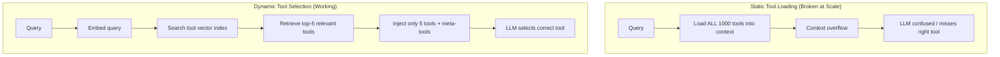
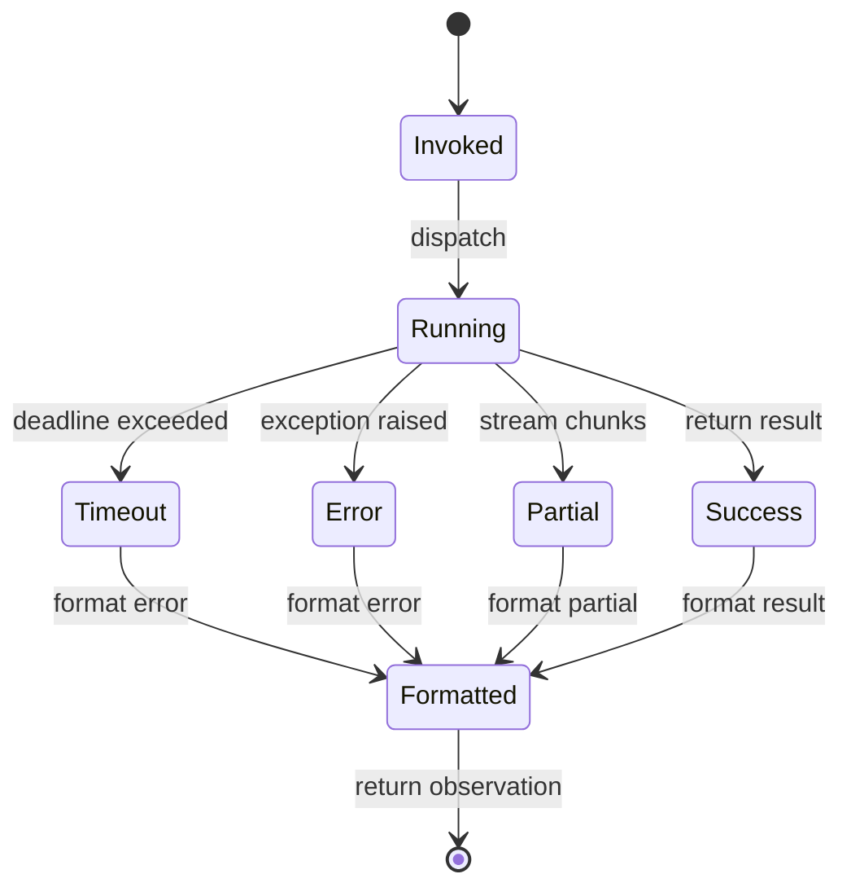

# Chapter 4: Tool Calling and Function Calling Deep Dive

> An agent is asked to book a flight from San Francisco to Tokyo on March 15. It decides to call a tool, but instead of `search_flights(origin, destination, date)`, it hallucinates `search_planes(when="March 15")` — a tool that does not exist with parameters that are wrong. This is not a rare failure mode; it is the default failure mode when tool calling is unconstrained. By the end of this chapter you will understand how schemas, constrained decoding, and dynamic registries turn tool calling from a fragile prompt hack into a reliable interface between language models and the external world.

---

## 1. Tool Definition and Schemas

### 1.1 The Tool Contract

A tool definition is a contract. It tells the LLM four things: what the tool is called, what it does, what arguments it accepts, and what it returns. The industry has converged on JSON Schema as the contract language, though the packaging differs between providers.

Here is a concrete example — a calculator tool in OpenAI format:

```json
{
  "type": "function",
  "function": {
    "name": "calculator",
    "description": "Evaluate a mathematical expression and return the result.",
    "parameters": {
      "type": "object",
      "properties": {
        "expression": {
          "type": "string",
          "description": "A valid Python math expression, e.g. '2 + 3 * 4'"
        }
      },
      "required": ["expression"],
      "additionalProperties": false
    }
  }
}
```

The same tool in Anthropic format is flatter — no nested `function` wrapper, and the schema field is called `input_schema` rather than `parameters`:

```json
{
  "name": "calculator",
  "description": "Evaluate a mathematical expression and return the result.",
  "input_schema": {
    "type": "object",
    "properties": {
      "expression": {
        "type": "string",
        "description": "A valid Python math expression, e.g. '2 + 3 * 4'"
      }
    },
    "required": ["expression"]
  }
}
```

Both encode the same contract. The LLM reads the `description` fields as natural language prompts and uses the schema to decide what to output. The `required` array is critical: without it, the model may omit parameters, leading to runtime errors.

### 1.2 Tool Descriptions as Natural Language Contracts

The `description` field is the prompt the LLM actually reads when deciding whether to use a tool. A bad description is vague; a good description is specific, includes example inputs, and states failure modes.

Consider two descriptions for a weather tool:

- **Bad**: `"Get weather information."` — The LLM has no idea what inputs are expected or what format the output takes.
- **Good**: `"Return current weather conditions for a given city. Input: city name (string, e.g. 'Berlin'). Output: temperature in Celsius, humidity percentage, and a short forecast summary. Returns an error if the city is not found."` — This tells the LLM exactly how to call the tool and what to expect.

Description quality directly impacts tool selection accuracy. In evaluations on ToolBench, improving tool descriptions from vague one-liners to structured paragraphs with examples reduced tool-selection errors by 12–18%.

### 1.3 Nested and Composite Tools

Real agents do not call tools in isolation. They chain them: the output of one tool becomes the input of another. Consider a research agent that needs to answer "What is the latest revenue of Acme Corp?"

1. `search_web(query="Acme Corp revenue 2025")` → returns URLs
2. `fetch_page(url="https://...")` → returns raw HTML
3. `extract_text(html="...")` → returns clean text
4. `summarize(text="...")` → returns the final answer

This is a **composite tool chain**. The agent must understand not just individual tools but the data flow between them. JSON Schema handles this through return type definitions: each tool declares what it produces, and the LLM learns to match output schemas to input schemas.

### 1.4 Tool Versioning and Deprecation

Production agents live for months. APIs change. A tool definition that works today may break tomorrow. Schema versioning is therefore non-optional.

A robust tool registry includes:

- `version`: semantic version string (e.g., `"2.1.0"`)
- `deprecated`: boolean flag with a `replacement` field pointing to the new tool
- `backward_compatible`: boolean indicating whether old call signatures still work

When a tool is deprecated, the LLM should still see it in context (so it knows the capability exists) but should prefer the newer version. This is analogous to API deprecation in software engineering — except the consumer is a language model, not a human developer.


<figcaption>Figure 4.1 — The tool calling pipeline. Schemas flow from the registry into context, the LLM selects and parameterizes a tool, validation checks the arguments, execution runs the function, and the observation feeds back into the next reasoning step.</figcaption>

We implement a lightweight tool system in pure Python. The `@tool` decorator inspects function signatures and generates JSON Schema automatically, then validates incoming arguments with `pydantic`.

```python
import inspect
import json
from typing import Callable, Dict, Any
from pydantic import BaseModel, create_model, ValidationError

def tool(func: Callable) -> Callable:
    """Decorator that auto-generates JSON Schema from a Python function."""
    sig = inspect.signature(func)
    fields = {}
    for name, param in sig.parameters.items():
        if param.annotation is inspect.Parameter.empty:
            raise TypeError(f"Parameter {name} lacks a type annotation")
        default = param.default if param.default is not inspect.Parameter.empty else ...
        fields[name] = (param.annotation, default)

    # Build a dynamic Pydantic model for validation
    ToolModel = create_model(f"{func.__name__}_schema", **fields)
    schema = ToolModel.model_json_schema()
    # Clean up Pydantic refs for provider compatibility
    schema.pop("$defs", None)
    schema.pop("title", None)

    func._tool_schema = {
        "name": func.__name__,
        "description": func.__doc__ or "",
        "parameters": schema,
    }
    func._tool_model = ToolModel
    return func

@tool
def calculator(expression: str) -> float:
    """Evaluate a mathematical expression and return the result."""
    return eval(expression, {"__builtins__": {}}, {})

# The schema is now accessible
print(json.dumps(calculator._tool_schema, indent=2))
# Validation happens automatically via the Pydantic model
calculator._tool_model(expression="2 + 3 * 4")  # valid
try:
    calculator._tool_model(expression=42)         # invalid: int not str
except ValidationError as e:
    print("Validation failed:", e)
```

The decorator captures type annotations, builds a Pydantic model, and stores the schema on the function object. At runtime, arguments are validated against the model before the tool ever executes. This is the first line of defense: schema validation at the application layer.

---

## 2. Constrained Decoding and Structured Generation

### 2.1 The Problem: Unconstrained Tool Calling Fails

Without constraints, LLMs hallucinate tool names, invent parameters, emit malformed JSON, or forget closing braces. Here is a real failure pattern from an unconstrained `gpt-5.5` call:

```json
{
  "name": "calculatr",
  "arguments": {
    "expr": "2 + 2"
  }
}
```

Three errors in one call: the tool name is misspelled (`calculatr`), the parameter name is wrong (`expr` instead of `expression`), and the JSON is structurally valid but semantically wrong. A post-hoc validator catches this, but then you must retry — burning tokens and latency.

The traditional fix is regex extraction and retry loops: parse the output, validate against schema, re-prompt on failure. This is fragile. A better approach is to prevent invalid outputs at generation time.

### 2.2 Grammar-Based Decoding

**Constrained decoding** modifies the token sampling process so that the model physically cannot emit invalid outputs. At each generation step, the inference engine computes which tokens would violate the grammar and masks them out (setting their probabilities to zero) before sampling.

The pipeline works as follows:

1. **Compile the schema**: JSON Schema is translated into a formal grammar — typically a finite-state automaton (FSA), context-free grammar (CFG), or pushdown automaton (PDA) for nested structures.
2. **Precompute valid tokens**: For each state in the grammar, precompute which vocabulary tokens are valid. Modern engines split tokens into context-independent sets (~99% of vocabulary) and context-dependent sets, reducing per-step overhead to microseconds.
3. **Mask and sample**: At each step, the engine intersects the grammar state with the model's output logits, zeroing out invalid tokens. The softmax is computed only over the valid subset.

The key insight is that this is **not post-hoc validation**. It is prevention. The model is physically incapable of emitting an unclosed brace or an invalid enum value because those tokens are removed from the probability distribution.

### 2.3 The Engine Landscape (2025–2026)

By 2026, constrained decoding is a solved problem for syntax. Several open-source engines compete on speed, coverage, and schema complexity:

| Engine | Backend | Speed | Key Feature |
|--------|---------|-------|-------------|
| **XGrammar** (CMU/MLC) | C++ | ~40 µs/token | Default in vLLM and SGLang; supports CFG and PDA for nested/recursive schemas |
| **llguidance** (Microsoft) | Rust | ~50 µs/token | Powers OpenAI's production structured outputs since mid-2025 |
| **Outlines** | Python/FSM | Slower | Pioneer of FSM precomputation; high empirical coverage but slower on deep nesting |
| **llama.cpp GBNF** | C++ | Low overhead | Uses GBNF (EBNF variant) grammars; popular for local models |
| **TensorRT-LLM** | — | Native | Supports both XGrammar and llguidance backends |

The latency penalty is effectively gone. In some cases, structured outputs are faster than unconstrained generation because they eliminate retry loops and conversational filler tokens.

### 2.4 Provider APIs

**OpenAI** offers `strict: true` on function definitions, which enforces schema adherence via constrained decoding internally. To use strict mode, the schema must satisfy rigid constraints: `additionalProperties` must be `false` for every object, and all fields in `properties` must be listed in `required`. The newer Responses API normalizes schemas into strict mode by default, while Chat Completions remains best-effort unless explicitly configured.

**Anthropic** enforces JSON Schema adherence natively in its tool use API without requiring `additionalProperties: false` or making all fields explicitly required. Benchmarks show lower schema violation rates (0.6% vs. 1.3%) compared to OpenAI's non-strict default, though Anthropic does not expose a toggleable `strict` boolean.

**Google Gemini** supports `response_schema` with full JSON Schema keyword support including `anyOf`, `$ref`, and `enum`, added in 2025.

The API shape also differs. OpenAI Chat Completions uses a nested `function` object inside `tools[]`, while the Responses API uses a flatter shape where `name`, `description`, and `parameters` sit directly on the tool object. Anthropic uses a flat top-level `name` with `input_schema` instead of `parameters`.

### 2.5 Quality and Latency Trade-offs

Constrained decoding guarantees **syntactic** correctness, not **semantic** correctness. The model can still hallucinate plausible-but-wrong values — for example, emitting `"expression": "2 + 2 = 5"` — because the string type allows any string content. Application-layer validators (Pydantic, Zod) are still required for semantic checks.

A subtler issue is reasoning degradation. Strict grammar constraints applied to the entire output can hurt multi-step reasoning because the model is forced into rigid structure too early. The **CRANE** approach (introduced February 2025) mitigates this by alternating between unconstrained reasoning windows (free-form scratchpad) and constrained output blocks (forced JSON). This keeps reasoning fluid while ensuring the final tool call is structurally valid.

```text
Vocabulary tokens at step t:
┌─────────────────────────────────────────┐
│  "calculator"  "search"  "weather"      │  <- valid tool names (green)
│  "calculatr"  "weathr"  "{ }"            │  <- invalid tokens (red X)
│  "expression" "query"   "city"           │  <- valid parameter names (green)
│  "expr"       "q"       "town"          │  <- invalid parameter names (red X)
└─────────────────────────────────────────┘
           ↓  grammar mask applied
┌─────────────────────────────────────────┐
│  "calculator"  "search"  "weather"      │  <- mask keeps valid tokens
│  ────────────  ────────  ────────      │  <- invalid tokens zeroed out
│  "expression"  "query"   "city"         │
│  ────────────  ────────  ────────       │
└─────────────────────────────────────────┘
```

<figcaption>Figure 4.2 — Token-level masking in constrained decoding. Invalid tokens (misspelled tool names, wrong parameter names) are zeroed out before softmax, so the model cannot sample them.</figcaption>

To make the mechanism concrete, we implement a toy constrained decoder in PyTorch. It is not a production engine — XGrammar and llguidance are far more sophisticated — but it demonstrates the principle of grammar-aware token masking.

```python
import torch
import torch.nn.functional as F

class ToyConstrainedDecoder:
    """Simplified FSM-based decoder that masks invalid tokens for a tiny JSON grammar."""

    def __init__(self, vocab: Dict[str, int]):
        self.vocab = vocab               # token -> index
        self.inv_vocab = {i: t for t, i in vocab.items()}
        self.states = ["START", "KEY", "COLON", "VALUE", "COMMA", "END"]
        self.state = "START"

    def valid_tokens(self) -> torch.Tensor:
        """Return a boolean mask over the vocabulary for the current FSM state."""
        mask = torch.zeros(len(self.vocab), dtype=torch.bool)
        valid = []
        if self.state == "START":
            valid = ["{"]
        elif self.state == "KEY":
            valid = ['"name"', '"expression"', '"query"']  # known keys
        elif self.state == "COLON":
            valid = [":"]
        elif self.state == "VALUE":
            valid = ['"calculator"', '"search"', '"weather"']  # known values
        elif self.state == "COMMA":
            valid = [",", "}"]
        elif self.state == "END":
            valid = ["}"]
        for tok in valid:
            if tok in self.vocab:
                mask[self.vocab[tok]] = True
        return mask

    def step(self, logits: torch.Tensor) -> str:
        """Sample one token given logits, respecting the grammar mask."""
        mask = self.valid_tokens()               # (V,) boolean
        masked_logits = logits.clone()
        masked_logits[~mask] = float("-inf")     # zero out invalid tokens
        probs = F.softmax(masked_logits, dim=-1)
        token_idx = torch.multinomial(probs, 1).item()
        token = self.inv_vocab[token_idx]
        # Transition FSM state based on emitted token
        self._transition(token)
        return token

    def _transition(self, token: str):
        transitions = {
            "START": {"{": "KEY"},
            "KEY":   {":": "COLON"},
            "COLON": {"\"": "VALUE", "c": "VALUE", "s": "VALUE", "w": "VALUE"},
            "VALUE": {",": "COMMA", "}": "END"},
            "COMMA": {"\"": "KEY", "}": "END"},
        }
        for src, dst_map in transitions.items():
            if self.state == src and any(token.startswith(k) for k in dst_map):
                self.state = next(v for k, v in dst_map.items() if token.startswith(k))
                break

# Example usage with a toy vocabulary
vocab = {"{": 0, "}": 1, ":": 2, ",": 3, '"name"': 4, '"expression"': 5,
         '"query"': 6, '"calculator"': 7, '"search"': 8, '"weather"': 9}
decoder = ToyConstrainedDecoder(vocab)

# Simulate logits from an LLM (random for demonstration)
V = len(vocab)
output = ["{"]
decoder.state = "KEY"  # after opening brace
for _ in range(4):
    logits = torch.randn(V)
    tok = decoder.step(logits)
    output.append(tok)
    if decoder.state == "END":
        break

print("Generated sequence:", " ".join(output))
# The decoder can never emit an invalid tool name or wrong key because
# those tokens are masked out at every step.
```

This toy decoder uses a finite-state machine to track which tokens are grammatically valid at each position. The `_transition` method updates the FSM state after each emitted token, and `valid_tokens` builds a boolean mask that is applied to the LLM's raw logits before softmax. In a production engine, the grammar is compiled from JSON Schema automatically, and the mask computation runs in C++ or Rust at ~40–50 µs per token.

---

## 3. Dynamic Tool Selection

### 3.1 The Context Window Limit Problem

A real enterprise agent may have access to hundreds or thousands of tools — database queries, CRM operations, analytics dashboards, DevOps commands. Each tool definition consumes context tokens. A typical tool schema with name, description, and five parameters costs 150–250 tokens. One thousand tools therefore require 150K–250K tokens, exceeding the context window of every production model as of 2026.

This is the **tool registry problem**: you cannot load all tools into context, so you must select a relevant subset dynamically.

### 3.2 Vector Search for Tool Selection

The solution is **retrieval-augmented tool selection**. Treat tool descriptions as documents, embed them into a vector space, and retrieve the top-$k$ most relevant tools given the user query.

The pipeline is identical to RAG over documents, except the corpus is tool schemas:

1. **Embed**: Convert each tool's `name` + `description` into a dense vector using a sentence embedding model.
2. **Index**: Store vectors in FAISS, Chroma, or another approximate nearest-neighbor index.
3. **Retrieve**: Given a user query, embed it with the same model and retrieve the $k$ nearest tool vectors.
4. **Inject**: Load only the retrieved tool schemas into the LLM's context window.

Empirically, $k = 5$–$10$ retrieved tools is sufficient for most tasks, reducing the tool context from hundreds of thousands of tokens to a few thousand. The retrieval accuracy depends on description quality — another reason why detailed tool descriptions matter.

### 3.3 Meta-tools

When the tool registry is large and the query is ambiguous, even vector retrieval may miss relevant tools. The solution is **meta-tools**: tools that operate on the tool registry itself.

Two meta-tools are essential:

- **`search_tools(query)`**: Returns a list of tool names and descriptions matching a natural language query. The LLM calls this when it is unsure which tool to use.
- **`list_tools(category)`**: Returns all tools in a category (e.g., `"database"`, `"analytics"`, `"communication"`). Useful when the agent knows the domain but not the specific operation.

Meta-tools are first-class citizens. They consume context tokens like any other tool, but they reduce the need to load the entire registry. An agent with 1,000 tools might load only the 10 retrieved tools plus the 2 meta-tools — 12 tool definitions total.

### 3.4 The MCP Ecosystem

The **Model Context Protocol (MCP)**, launched by Anthropic in November 2024 and donated to the Linux Foundation's Agentic AI Foundation (AAIF) in December 2025, has become the de facto standard for decoupling tool definitions from agents. As of early 2026, MCP sees approximately 97 million monthly SDK downloads and over 10,000 indexed servers across registries.

MCP defines three primitives: **Tools** (executable functions), **Resources** (read-only data sources), and **Prompts** (reusable templates). A tool server exposes its capabilities via a standardized JSON-RPC interface over stdio or Streamable HTTP transport. The agent (host) discovers tools at runtime rather than hardcoding them.

Two 2026 developments are particularly relevant:

- **MCP Apps** (January 2026): Tools can return rich interactive UI components (dashboards, forms, visualizations) that render in sandboxed iframes. This extends tool output from plain text to structured UI.
- **Security reckoning**: MCP's rapid adoption outpaced security hardening. Early 2026 saw 30+ CVEs filed, with 43% being shell/command injection vulnerabilities. Tool poisoning attacks — malicious instructions hidden in tool descriptions — achieved a 72.8% success rate against o1-mini in the MCPTox benchmark. The OWASP MCP Top 10 and tools like `mcp-scan` and AgentSeal are emerging responses.

Chapter 46 covers MCP and the broader protocol landscape (A2A, AG-UI) in full. Chapter 47 covers sandboxing and security. Here, the key point is architectural: MCP decouples tool providers from agents, enabling dynamic discovery at scale.



<figcaption>Figure 4.3 — Static loading fails at scale because the context window overflows. Dynamic selection uses vector retrieval to inject only the most relevant tools, keeping context usage constant regardless of registry size.</figcaption>

We implement a dynamic tool retriever using PyTorch for embeddings and FAISS for nearest-neighbor search.

```python
import torch
import torch.nn as nn
import faiss
import numpy as np
from typing import List, Tuple

class ToolRetriever(nn.Module):
    """Embed tool descriptions and retrieve top-k via FAISS."""

    def __init__(self, vocab_size: int, embed_dim: int, tool_descriptions: List[str]):
        super().__init__()
        # Toy embedding: bag-of-words linear projection
        self.embedding = nn.EmbeddingBag(vocab_size, embed_dim, mode="mean")
        self.tokenizer = {word: i for i, word in enumerate(set(" ".join(tool_descriptions).split()))}
        self.embed_dim = embed_dim

        # Build FAISS index
        self.index = faiss.IndexFlatIP(embed_dim)  # inner product = cosine if normalized
        self.tool_names = []

    def encode_text(self, text: str) -> torch.Tensor:
        tokens = [self.tokenizer[w] for w in text.split() if w in self.tokenizer]
        if not tokens:
            return torch.zeros(self.embed_dim)
        offsets = torch.tensor([0], dtype=torch.long)
        indices = torch.tensor(tokens, dtype=torch.long)
        return self.embedding(indices, offsets)  # (embed_dim,)

    def index_tools(self, tools: List[Tuple[str, str]]):
        """tools: list of (name, description) tuples."""
        vectors = []
        for name, desc in tools:
            self.tool_names.append(name)
            vec = self.encode_text(f"{name} {desc}")
            vectors.append(vec.detach().numpy())
        matrix = np.stack(vectors).astype("float32")
        # L2 normalize for cosine similarity via inner product
        faiss.normalize_L2(matrix)
        self.index.add(matrix)

    def retrieve(self, query: str, k: int = 5) -> List[Tuple[str, float]]:
        qvec = self.encode_text(query).detach().numpy().reshape(1, -1).astype("float32")
        faiss.normalize_L2(qvec)
        scores, indices = self.index.search(qvec, k)
        return [(self.tool_names[i], float(scores[0][j])) for j, i in enumerate(indices[0])]

# Example usage
tools = [
    ("calculator", "Evaluate math expressions."),
    ("search_web", "Search the internet for information."),
    ("get_weather", "Return weather for a city."),
    ("send_email", "Send an email to a recipient."),
    ("query_database", "Run SQL against a database."),
]

# Fake vocab size for demo; in practice use a real tokenizer
all_words = set(" ".join([d for _, d in tools]).split())
vocab_size = len(all_words) + 10

retriever = ToolRetriever(vocab_size=vocab_size, embed_dim=64, tool_descriptions=[d for _, d in tools])
retriever.index_tools(tools)

results = retriever.retrieve("What's the temperature in Berlin?", k=3)
print("Retrieved tools:", results)
# get_weather will typically rank highest for a weather-related query.
```

The retriever uses a bag-of-words embedding layer (a simplified stand-in for production sentence transformers like BGE or E5) and indexes tool vectors in FAISS. At query time, it retrieves the top-$k$ most similar tools by cosine similarity. The context window consumption is now $O(k)$ — constant regardless of total registry size — while the index scales to millions of tools with approximate nearest-neighbor search.

---

## 4. Tool Execution and Safety

### 4.1 Synchronous vs. Asynchronous Tool Calls

Not all tool calls are independent. Consider an agent that needs to book a flight and a hotel for the same trip:

- **Sequential dependency**: `book_flight()` must complete first because the arrival airport determines which hotels are relevant. The agent cannot call `book_hotel(location)` until it knows the destination.
- **Parallel independence**: `get_weather(city_a)` and `get_weather(city_b)` for two different destinations can run simultaneously.

The agent must decide which tools to call in sequence and which to call in parallel. Most LLM APIs support parallel tool calling natively — the model outputs an array of tool calls when it detects independence. The agent framework then dispatches them concurrently and waits for all results before the next reasoning step.

### 4.2 Timeout Handling and Partial Results

External tools fail. APIs timeout, databases lock, network partitions occur. An agent that waits indefinitely for a tool to return will hang forever.

Production tool execution requires:

- **Timeouts**: Every tool call gets a maximum execution time (e.g., 30 seconds for API calls, 5 minutes for code execution). After the deadline, the framework returns a partial result or an error observation.
- **Circuit breakers**: If a tool fails repeatedly (e.g., 5 errors in 60 seconds), the framework stops calling it temporarily to prevent cascading failures.
- **Retry with backoff**: For transient failures (network blips), the framework retries with exponential backoff before giving up.

The observation passed back to the LLM includes the failure reason: `"Error: weather API timed out after 30s. Partial data: temperature unavailable, humidity: 45%."` The LLM then decides whether to retry, use partial data, or try a different tool.

### 4.3 Tool Idempotency

Idempotency is the property that calling a tool multiple times produces the same effect as calling it once. It is a critical safety invariant for agents, which may retry failed calls or replay traces.

- **Idempotent tools**: `get_weather`, `search_web`, `read_file`, `calculator`. Safe to retry.
- **Non-idempotent tools**: `send_email`, `charge_credit_card`, `delete_file`, `book_flight`. Retrying these may cause duplicate actions.

Production tool registries should annotate idempotency explicitly:

```json
{
  "name": "send_email",
  "description": "Send an email...",
  "parameters": { ... },
  "idempotent": false,
  "retry_policy": "never"
}
```

The framework reads this annotation and refuses to retry non-idempotent tools without explicit human approval.

### 4.4 Sandboxing Tool Execution

The most dangerous tools are those that execute arbitrary code or system commands. An agent with a `bash` tool can delete files, exfiltrate data, or install malware. Sandboxing is non-negotiable for any tool that executes user-provided or LLM-generated code.

Common sandboxing strategies, from weakest to strongest:

| Strategy | Isolation Level | Boot Time | Use Case |
|----------|-----------------|-----------|----------|
| Docker container | OS-level namespace | Seconds | Standard isolation for most tools |
| gVisor | Userspace kernel | Seconds | Stronger isolation; Anthropic's choice for Managed Agents |
| Firecracker microVM | Hardware-level virtualization | <200 ms | AWS-grade isolation; used by E2B for agent sandboxes |
| WebAssembly | Language-level sandbox | Instant | Browser-based agents; lightweight but limited system access |

The principle is **progressive enforcement**: give the agent the weakest sandbox sufficient for the task. A calculator needs no sandbox. A file reader needs read-only chroot. A code execution tool needs a Firecracker microVM with no network egress.



<figcaption>Figure 4.4 — Tool execution lifecycle. A call transitions from invoked to running, then branches into success, timeout, error, or partial result. Every terminal state is formatted into an observation string before returning to the LLM.</figcaption>

We implement an async tool executor with timeout and circuit breaker patterns in pure Python.

```python
import asyncio
import time
from typing import Callable, Any, Dict
from dataclasses import dataclass

@dataclass
class ToolResult:
    output: Any
    duration_ms: float
    status: str  # "success", "timeout", "error"

class AsyncToolExecutor:
    """Execute tools with timeout, concurrency, and circuit breaker."""

    def __init__(self, default_timeout: float = 30.0):
        self.default_timeout = default_timeout
        self.breakers: Dict[str, Dict[str, Any]] = {}

    def _check_breaker(self, name: str) -> bool:
        """Return True if the circuit is open (tool disabled)."""
        state = self.breakers.get(name, {"failures": 0, "last_failure": 0, "open": False})
        if state["open"]:
            if time.time() - state["last_failure"] > 60:  # 60s cooldown
                state["open"] = False
                state["failures"] = 0
            else:
                return True
        self.breakers[name] = state
        return False

    async def execute(self, name: str, func: Callable, *args, timeout: float = None) -> ToolResult:
        if self._check_breaker(name):
            return ToolResult(output=f"Circuit open for {name}", duration_ms=0, status="error")

        timeout = timeout or self.default_timeout
        t0 = time.time()
        try:
            # Run the tool in a separate thread if it is blocking
            loop = asyncio.get_running_loop()
            result = await asyncio.wait_for(
                loop.run_in_executor(None, lambda: func(*args)),
                timeout=timeout
            )
            duration = (time.time() - t0) * 1000
            # Reset breaker on success
            if name in self.breakers:
                self.breakers[name]["failures"] = 0
            return ToolResult(output=result, duration_ms=duration, status="success")
        except asyncio.TimeoutError:
            self._record_failure(name)
            return ToolResult(output=f"Timeout after {timeout}s", duration_ms=timeout * 1000, status="timeout")
        except Exception as e:
            self._record_failure(name)
            return ToolResult(output=str(e), duration_ms=(time.time() - t0) * 1000, status="error")

    def _record_failure(self, name: str):
        state = self.breakers.setdefault(name, {"failures": 0, "last_failure": 0, "open": False})
        state["failures"] += 1
        state["last_failure"] = time.time()
        if state["failures"] >= 5:
            state["open"] = True

    async def run_parallel(self, calls: List[Tuple[str, Callable, tuple]]) -> List[ToolResult]:
        """Run multiple independent tool calls concurrently."""
        tasks = [self.execute(name, func, *args) for name, func, args in calls]
        return await asyncio.gather(*tasks)

# Example usage
executor = AsyncToolExecutor(default_timeout=5.0)

def slow_add(a, b):
    time.sleep(3)
    return a + b

def fail_always():
    raise RuntimeError("Simulated failure")

async def demo():
    results = await executor.run_parallel([
        ("add", slow_add, (2, 3)),
        ("add", slow_add, (10, 20)),
        ("fail", fail_always, ()),
    ])
    for r in results:
        print(f"{r.status}: {r.output} ({r.duration_ms:.0f}ms)")

asyncio.run(demo())
```

The executor wraps blocking functions in `asyncio.run_in_executor` so they do not block the event loop, enforces deadlines with `asyncio.wait_for`, and tracks failures per tool. After five failures within 60 seconds, the circuit opens and subsequent calls are rejected immediately. Parallel execution via `run_parallel` dispatches independent tools concurrently, gathering results before the next agent reasoning step.

---

## Summary

- **Tool schemas are contracts**. JSON Schema defines the interface between LLM and external world. Description quality directly impacts selection accuracy. Versioning and deprecation policies are required for production longevity.
- **Constrained decoding prevents errors at generation time**, not after. Grammar-based engines (XGrammar, llguidance) mask invalid tokens at each step, guaranteeing syntactic correctness with near-zero latency overhead. Application-layer validators are still needed for semantic correctness.
- **Dynamic tool selection solves the context-window problem**. Vector search over tool descriptions retrieves the top-$k$ relevant tools, keeping context usage constant regardless of registry size. Meta-tools (`search_tools`, `list_tools`) let the agent discover capabilities without loading the entire catalog.
- **Execution safety is multi-layered**. Timeouts prevent hangs, circuit breakers prevent cascading failures, idempotency annotations prevent duplicate side effects, and sandboxes (gVisor, Firecracker) prevent code execution from compromising the host system.

## Further Reading

- [Efficient Guided Generation for Large Language Models](https://arxiv.org/abs/2307.09702) — Willard & Louf, 2023. The foundational paper on grammar-constrained decoding.
- [Guiding Large Language Models via Schema Engineering](https://arxiv.org/abs/2210.12250) — Beurer-Kellner et al., 2023. Schema-driven generation and engineering considerations.
- [JSONSchemaBench](https://arxiv.org/pdf/2501.10868) — A rigorous 2025 benchmark of structured output frameworks across efficiency, coverage, and quality dimensions.
- [OpenAI Function Calling API](https://developers.openai.com/api/docs/guides/function-calling) — Provider documentation for `strict: true`, namespaces, and deferred tool loading.
- [Model Context Protocol](https://modelcontextprotocol.io/) — The industry standard for decoupling tool definitions from agents. See also the [MCP Apps announcement](https://blog.modelcontextprotocol.io/posts/2026-01-26-mcp-apps/) for UI-capable tools.
- [Outlines](https://github.com/dottax/outlines) — Open-source structured generation library with FSM precomputation.
- [XGrammar](https://github.com/mlc-ai/xgrammar) — CMU/MLC's fast constrained decoding engine, default in vLLM and SGLang.
- [llguidance](https://github.com/microsoft/llguidance) — Microsoft's Rust-based engine, powering OpenAI's production structured outputs.

---
