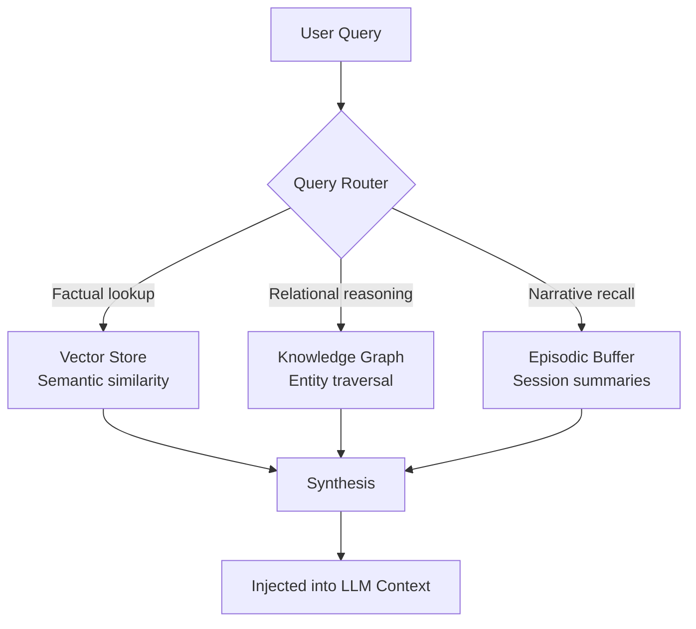

# Chapter 5: Memory and State Management

> In 2023, a chatbot could sustain a conversation for a dozen turns before the context window filled up and earlier messages were silently dropped. The user might have mentioned a peanut allergy in turn three, but by turn fifteen the model was enthusiastically recommending a Thai restaurant. This is not a reasoning failure; it is a memory failure. An agent that cannot remember what it learned five minutes ago — let alone five days ago — is not an agent; it is a goldfish with a language model. By the end of this chapter you will understand the full memory hierarchy that separates agents from chatbots: how to compress overflowing context windows, how to store and retrieve millions of facts with vector search, how to reason over structured knowledge graphs, and how to decide what deserves to be remembered at all.

---

## 1. Short-Term Memory: The Context Window

### 1.1 RAM for the Agent

The context window is the agent's working memory. Every thought, action, and observation from the ReAct loop — the **scratchpad** we introduced in Chapter 2 — lives here. It is fast: every token is immediately visible to the attention mechanism. It is limited: even frontier models in 2026 cap out around one million tokens. And it is volatile: when the session ends, the window is wiped clean.

This RAM analogy is exact. Just as a CPU cannot execute a program larger than physical RAM without paging to disk, an LLM cannot reason over a trace longer than its context window without dropping information. The difference is that the LLM does not throw a memory error; it silently forgets. The earliest turns are pushed out by the latest ones, and the agent loses the grounding facts that started the task.

The cost of this amnesia is not merely anecdotal. In long-horizon tasks, error compounds. If each step has a 95% success probability, a 50-step task has a $0.95^{50} \approx 7.7\%$ success rate. The agent repeats actions because it no longer remembers it already tried them. It contradicts itself because the contradiction spans a gap in the trace. Short-term memory is the first bottleneck every agent hits, and every other memory layer exists to relieve it.

### 1.2 Summarization and Compression

When the trace approaches the limit, the agent must compress. Three strategies dominate production systems in 2026.

**Extractive compression** selects salient tokens or sentences from the raw trace and discards the rest. The selection can be heuristic — keep error messages, keep user corrections, drop routine successful calculations — or learned, with a small scoring network that predicts which tokens the LLM will need later.

**Abstractive compression** delegates the task to the LLM itself: feed the first half of the trace into a summarization prompt, replace the raw steps with the summary, and continue. This is lossy but dense. The risk is that the summary omits the one detail the agent needs in step forty-seven.

**Key-value compression** distills the trace into a structured set of (key, value) pairs. For example, a ten-turn negotiation over pricing becomes `{"agreed_price": 450, "delivery_date": "2026-06-01", "outstanding_issue": "warranty_terms"}`. This is the most aggressive form of compression and the most brittle: if the key schema is wrong, the information is gone.

Before we implement a compressor, we define the benchmark it must pass. We construct synthetic traces where critical "fact" tokens are interleaved with noise. The compressor receives a token budget and must retain the facts. The **fact retention rate** is the fraction of critical facts still present after compression.

```python
import torch
import torch.nn as nn

class SalienceCompressor(nn.Module):
    """Extractive compressor that learns to keep tokens with high fact salience."""
    def __init__(self, dim: int, budget: int):
        super().__init__()
        self.budget = budget
        # A tiny two-layer scorer: embedding -> importance logit
        self.scorer = nn.Sequential(
            nn.Linear(dim, dim // 4),
            nn.ReLU(),
            nn.Linear(dim // 4, 1),
        )

    def forward(self, x: torch.Tensor) -> tuple[torch.Tensor, torch.Tensor]:
        # x: (seq_len, dim)
        scores = self.scorer(x).squeeze(-1)           # (seq_len,)
        k = min(self.budget, x.size(0))
        topk = torch.topk(scores, k, dim=0)
        return x[topk.indices], topk.indices          # (budget, dim), (budget,)

def fact_retention_evaluator(
    compressor: nn.Module,
    traces: list[tuple[torch.Tensor, list[int]]],
) -> float:
    """Measure what fraction of critical fact-token indices survive compression."""
    total, retained = 0, 0
    for emb, facts in traces:
        _, kept = compressor(emb)
        kept_set = set(kept.tolist())
        retained += sum(1 for f in facts if f in kept_set)
        total += len(facts)
    return retained / total if total else 0.0

# --- Synthetic benchmark ---
DIM, BUDGET, N = 32, 20, 128
torch.manual_seed(0)
traces = [
    (torch.randn(100, DIM), torch.randint(0, 100, (5,)).tolist())
    for _ in range(N)
]
compressor = SalienceCompressor(DIM, BUDGET)
# An untrained compressor scores ~budget/seq_len by chance.
baseline = fact_retention_evaluator(compressor, traces)
print(f"Baseline fact retention: {baseline:.2%}")   # ~20%
```

The benchmark makes the failure mode visible. A random compressor retains roughly 20% of facts because it keeps twenty out of one hundred tokens blindly. Training the scorer with supervised or RL-based objectives — rewarding fact retention and penalizing redundancy — is how production systems achieve 80–90% retention at 4–5× compression ratios.

### 1.3 Sliding Window and Truncation

When summarization is too expensive or too risky, simpler heuristics apply. The **sliding window** keeps only the most recent $W$ turns, dropping everything older. This is the default in many chat interfaces. It is cheap and predictable, but it deletes the user’s original goal if the conversation runs long.

Smarter truncation heuristics keep three zones: the system prompt and tool definitions at the top, the most recent turns at the bottom, and a compressed middle zone that retains only error messages and key results. The intuition is that the beginning provides grounding and the end provides recency; the middle is where redundancy lives.

### 1.4 Prompt Caching and Prefix Caching

Even before the trace overflows, repeating the same prefix on every LLM call is wasteful. System prompts, tool schemas, and static documentation can consume 10,000–80,000 tokens per call. **Prompt caching** — also called prefix caching — stores the key-value cache computed from the beginning of the prompt and reuses it across requests.

Anthropic offers explicit control via a `cache_control` parameter, granting a **90% discount** on cached input tokens with a break-even of roughly two reads. OpenAI’s caching is automatic and grants a **50% discount** for eligible prefixes of 1,024 tokens or more. Gemini matches Anthropic’s 90% discount but charges storage fees, making it economical only for high-volume workloads.

The engineering rule is simple: place all static content at the start of the prompt and all dynamic content — user queries, timestamps, the growing trace — at the end. A single misplaced timestamp invalidates the cache. For agents, this means tool schemas and system instructions should precede the scratchpad, not follow it.

> **💡 Key Insight**
>
> Prompt caching does not increase memory capacity; it reduces the cost of accessing what already fits in the context window. The real bottleneck remains the retrieval of information that left the window long ago.

---

## 2. Long-Term Memory: Vector Stores

### 2.1 Embedding-Based Retrieval

When the context window overflows, the agent must reach outside itself. **Vector memory** stores text chunks as dense embeddings and retrieves the most similar ones on demand. The pipeline is straightforward: chunk documents, embed each chunk into a vector $d_i \in \mathbb{R}^d$, and at query time embed the query into $q \in \mathbb{R}^d$. Retrieval scores each candidate by the dot product $q^\top d_i$ (dot product, yields a scalar) or by cosine similarity, which normalizes the vectors to unit length before taking the dot product.

The matrix of similarities $S = q E^\top$ (matrix multiply, $(1 \times d) \times (d \times n) \to (1 \times n)$) is computed in a single operation, where $E \in \mathbb{R}^{n \times d}$ is the matrix of stored document embeddings. The top-$k$ indices are the retrieved memories.

Chunking strategy matters more than embedding model choice for retrieval quality. **Semantic chunking** — splitting at sentence or paragraph boundaries — preserves coherence and outperforms fixed-size chunking by preserving sentence boundaries. Overlapping windows of 20% between chunks reduce the risk of cutting a critical fact in half.

### 2.2 Vector Databases: The 2026 Landscape

In 2026, vector databases have stratified into three tiers: raw libraries, embedded databases, and production engines.

| Database | Type | p99 Latency | Best For |
|----------|------|-------------|----------|
| **FAISS** | C++ library | ~0.5 ms (GPU batch) | Research, custom GPU pipelines |
| **Chroma** | Embedded DB | ~15–90 ms | Prototyping, local agents |
| **Qdrant** | Rust engine | **<8 ms** | Production agent memory |
| **Milvus** | Distributed | <15 ms | Billion-scale analytics |
| **Weaviate** | Hybrid | <50 ms | Semantic + keyword search |
| **Pinecone** | Managed SaaS | <40 ms | Zero-ops cloud deployments |

**FAISS** remains the undisputed king of raw throughput, handling ~50,000 queries per second in GPU batch mode, but it offers no persistence, no metadata filtering, and no CRUD operations. **Chroma** is the fastest path from zero to working vector storage: `pip install chromadb` and you have persistence, embedding functions, and basic filtering. Beyond ~10 million vectors or latency budgets under 15 ms, agents migrate to **Qdrant**, whose Rust-based engine delivers sub-8-ms retrieval with advanced JSON payload filtering and on-disk storage. The HNSW (Hierarchical Navigable Small World) index architecture is the dominant approximate-nearest-neighbor implementation across all of them.

### 2.3 Retrieval Strategies: Top-k, MMR, and Reranking

Naive top-$k$ retrieval can fail silently. If the three most similar chunks all contain the same fact, the agent receives no new information. **Maximal Marginal Relevance (MMR)** solves this by trading off relevance against diversity. The score for a candidate document $d_i$ given a query $q$ and an already-selected set $S$ is:

$$\text{MMR}(d_i) = \lambda \cdot \text{Sim}(q, d_i) - (1 - \lambda) \cdot \max_{d_j \in S} \text{Sim}(d_i, d_j)$$

The hyperparameter $\lambda \in [0,1]$ controls the trade-off. When $\lambda = 1$, MMR reduces to greedy top-$k$. When $\lambda = 0$, it maximizes diversity regardless of relevance. In agent memory, $\lambda \approx 0.7$ is typical: relevance dominates, but redundancy is penalized enough to surface distinct facts.

**Reranking** adds a second stage. A lightweight cross-encoder scores the top-$k$ candidates and reorders them. The cross-encoder is slower than the initial retrieval — it runs pairwise attention over query and document — but because it operates on only $k$ items, the cost is negligible. The combination of fast vector retrieval plus slow but precise reranking is the standard pattern in 2026 agentic RAG.

We implement exact vector search with MMR in pure PyTorch. First, the evaluator: we measure **recall@k** (fraction of ground-truth relevant documents retrieved) and **intra-list diversity** (one minus the average pairwise cosine similarity among retrieved items).

```python
import torch
import torch.nn.functional as F

class TorchVectorStore:
    """Exact vector search with Maximal Marginal Relevance, in PyTorch."""
    def __init__(self, dim: int):
        self.dim = dim
        self.docs: list[str] = []
        self.E: torch.Tensor | None = None   # (n_docs, dim)

    def add(self, texts: list[str], embeddings: torch.Tensor):
        # embeddings: (n, dim)
        self.docs.extend(texts)
        self.E = embeddings if self.E is None else torch.cat([self.E, embeddings], dim=0)

    def search_mmr(self, q: torch.Tensor, k: int = 5, lambda_param: float = 0.5) -> list[int]:
        # q: (dim,)
        rel = F.cosine_similarity(q.unsqueeze(0), self.E, dim=1)   # (n_docs,)
        selected: list[int] = []
        candidates = set(range(self.E.size(0)))
        while len(selected) < k and candidates:
            cand = torch.tensor(list(candidates), dtype=torch.long)
            if not selected:
                mmr = rel[cand]
            else:
                sel = torch.tensor(selected, dtype=torch.long)
                # Diversity: max cosine similarity to any already-selected doc
                div = F.cosine_similarity(
                    self.E[cand].unsqueeze(1), self.E[sel].unsqueeze(0), dim=2
                ).max(dim=1).values
                mmr = lambda_param * rel[cand] - (1 - lambda_param) * div
            best = cand[torch.argmax(mmr)].item()
            selected.append(best)
            candidates.remove(best)
        return selected

def evaluate_mmr(store, q_embs, gold_sets, k=5):
    """Return recall@k and average intra-list diversity."""
    recalls, diversities = [], []
    for qe, gt in zip(q_embs, gold_sets):
        idxs = store.search_mmr(qe, k=k, lambda_param=0.5)
        recalls.append(len(set(idxs) & gt) / len(gt))
        embs = store.E[idxs]                     # (k, dim)
        sim = embs @ embs.T                       # (k, k) matrix multiply
        mask = 1.0 - torch.eye(k)
        avg_sim = (sim * mask).sum() / (k * (k - 1))
        diversities.append(1.0 - avg_sim.item())
    return {"recall": sum(recalls)/len(recalls), "diversity": sum(diversities)/len(diversities)}
```

The implementation is intentionally bare-metal. Production systems replace the exact brute-force search with an HNSW index for sub-10-ms latency at million-vector scale, but the MMR selection logic remains identical.

### 2.4 Memory Write Policies

Storage is cheap, but retrieval quality degrades with noise. Not every observation deserves to persist. A **memory write policy** decides what crosses the threshold from volatile context to durable storage.

Heuristics that work in practice:
- **Tool errors** are high-signal: they reveal boundary conditions and user constraints.
- **User corrections** are critical: they override the agent’s world model.
- **Successful routine calculations** are low-signal: the agent can recompute them.
- **Intermediate thoughts** are ephemeral: only the conclusion matters.

More sophisticated systems assign an **importance score** to each observation. MemGPT (Letta) treats memory like an operating system: when the context window fills, the agent initiates a "page fault" that swaps the least-recently-used turns to an archival store. Mem0 uses an LLM to classify each turn into one of four actions: **ADD**, **UPDATE**, **DELETE**, or **NOOP**, resolving semantic conflicts before writing.

```python
class MemoryWritePolicy:
    """Simple rule-based write policy for agent observations."""
    def __init__(self, importance_threshold: float = 0.7):
        self.threshold = importance_threshold

    def decide(self, observation: dict) -> str:
        # Heuristic scoring based on observation metadata
        score = 0.0
        if observation.get("status") == "error":
            score += 0.9
        if observation.get("user_corrected"):
            score += 0.8
        if observation.get("tool_name") == "final_answer":
            score += 0.6
        if observation.get("repeated"):
            score -= 0.4
        if score >= self.threshold:
            return "persist"
        if score >= 0.3:
            return "summarize"
        return "discard"
```

The policy above is a stub, but the principle is universal: memory without curation is worse than no memory at all.

---

## 3. Structured Memory: Knowledge Graphs

### 3.1 Entities, Relations, and Triples

A **knowledge graph (KG)** stores facts as structured triples: $(\text{head}, \text{relation}, \text{tail})$. For example, $(\text{Marie Curie}, \text{won}, \text{Nobel Prize})$ or $(\text{GPT-5.5}, \text{released_by}, \text{OpenAI})$. Unlike vector memory, which retrieves by semantic similarity, a KG retrieves by explicit traversal: follow the edge from Marie Curie to find every prize she won, then follow the edges from those prizes to find other laureates.

This matters because similarity and relatedness are different. A vector search for "who won the Nobel Prize in Physics in 1903?" might retrieve a biography of Marie Curie, but it will not reliably retrieve Pierre Curie or Henri Becquerel unless those documents happen to mention the same words. A KG answers by traversing the `won` edge from the `1903 Nobel Prize in Physics` node to all three laureates.

### 3.2 Graph Construction from Unstructured Text

Building a KG from raw text is a three-stage pipeline.

**Named Entity Recognition (NER)** identifies spans that represent entities: people, organizations, locations, dates. Modern systems in 2025–2026 use lightweight BERT-based taggers or offload the task to frontier LLMs with few-shot prompting.

**Relation Extraction** classifies the relationship between two entities. A simple but effective approach is a bilinear scorer that learns a relation-specific matrix $W_r \in \mathbb{R}^{d \times d}$ for each relation type $r$. Given head and tail embeddings $h, t \in \mathbb{R}^d$, the score for relation $r$ is $h^\top W_r t$ (matrix multiply, $(1 \times d) \times (d \times d) \times (d \times 1) \to \text{scalar}$).

**Coreference Resolution** collapses pronouns and aliases onto canonical entities: "she" refers to Marie Curie, "the company" refers to OpenAI. Without this, the graph fragments into disconnected aliases.

GraphRAG (2024–2026) short-circuits the pipeline by prompting an LLM to extract entities and relations in a single pass, then clustering the resulting graph into "communities" that summarize high-level themes. This avoids training custom NER and relation models, at the cost of LLM inference per document.

We demonstrate relation extraction with a PyTorch bilinear scorer. The evaluator measures **relation accuracy**: the fraction of entity pairs assigned to the correct relation type.

```python
import torch
import torch.nn as nn
import torch.nn.functional as F

class BilinearRelationScorer(nn.Module):
    """Scores (h, r, t) triples with a relation-specific bilinear form."""
    def __init__(self, dim: int, num_relations: int):
        super().__init__()
        self.W = nn.Parameter(torch.randn(num_relations, dim, dim))
        nn.init.xavier_uniform_(self.W)
        self.bias = nn.Parameter(torch.zeros(num_relations))

    def forward(self, h: torch.Tensor, t: torch.Tensor) -> torch.Tensor:
        # h, t: (batch, dim)
        # scores[b, r] = h[b]^T W[r] t[b] + bias[r]
        scores = torch.einsum('bd,rde,be->br', h, self.W, t) + self.bias
        return scores   # (batch, num_relations)

def evaluate_relation_extraction(
    scorer: nn.Module, h: torch.Tensor, t: torch.Tensor, gold: torch.Tensor
) -> float:
    with torch.no_grad():
        scores = scorer(h, t)          # (batch, num_relations)
        preds = torch.argmax(scores, dim=1)
        acc = (preds == gold).float().mean().item()
    return acc

# --- Synthetic training ---
DIM, R, BATCH = 32, 5, 256
scorer = BilinearRelationScorer(DIM, R)
opt = torch.optim.Adam(scorer.parameters(), lr=1e-2)
h = torch.randn(BATCH, DIM)
t = torch.randn(BATCH, DIM)
gold = torch.randint(0, R, (BATCH,))
for epoch in range(100):
    opt.zero_grad()
    scores = scorer(h, t)              # (256, 5)
    loss = F.cross_entropy(scores, gold)
    loss.backward()
    opt.step()
print(f"Relation accuracy: {evaluate_relation_extraction(scorer, h, t, gold):.2%}")
```

### 3.3 Querying KG Memory

Once constructed, the KG must be queried. **SPARQL** is the W3C standard for RDF graphs. **Cypher** is the native query language for Neo4j and the Property Graph Model. For agents, the practical pattern is to translate natural language questions into Cypher via an LLM prompt, execute the query, and feed the results back as structured observations.

The quality of this translation determines whether the agent can use its structured memory. A well-constructed prompt includes the graph schema — node labels, relation types, and property keys — and several shot examples of questions mapped to Cypher. Without the schema, the LLM hallucinates nonexistent edge types.

### 3.4 Hybrid Memory: Vectors and Graphs

Vector memory and knowledge graphs are not competitors; they are complementary layers. Vectors excel at fuzzy, semantic recall: "find me documents about memory compression." Graphs excel at precise, relational reasoning: "which researchers cited the paper that introduced FAISS?"

The 2026 consensus is **hybrid memory**. The standard stack has four tiers:



*Figure 5.1 — Hybrid memory architecture. A small router decides which store serves the query; results are synthesized before injection into the context window.*

**Zep** (2025) implements this with a temporal knowledge graph: facts carry validity periods, and superseded edges are explicitly invalidated. **SYNAPSE** (2026) adds spreading activation, propagating "energy" from query nodes through the graph with lateral inhibition that suppresses distractors. On the LoCoMo benchmark of long-horizon dialogue, SYNAPSE achieves a weighted average F1 of 40.5, outperforming Zep’s 39.7 and MemGPT’s baseline of 33.3.

---

## 4. Episodic and Procedural Memory

### 4.1 Episodic Memory: Storing Interactions

**Episodic memory** stores past interactions as retrievable episodes. An episode is typically a tuple: $(\text{timestamp}, \text{query}, \text{action}, \text{observation}, \text{outcome})$. When the agent faces a new task, it retrieves episodes with similar queries or similar outcomes and uses them as analogical guidance.

The tool outputs that we store in memory are produced by the tool calling mechanism covered in Chapter 4. A tool call that succeeded yesterday is a valuable episode today: it tells the agent which arguments worked, which edge cases appeared, and what the output format looked like. An episode of failure is equally valuable: it tells the agent what not to do.

Retrieval from episodic memory is typically a two-stage filter: first, vector similarity narrows the candidate pool to the thousand most relevant episodes; second, metadata filters — time range, tool name, outcome status — reduce the set to the dozen that matter. Recency weighting is common: recent episodes get a multiplicative boost because the environment changes.

### 4.2 Procedural Memory: Storing Skills

**Procedural memory** is "how-to" knowledge: learned skills, successful plans, reusable code snippets. Voyager’s skill library, built for Minecraft, stores executable Python programs as procedures. Each skill is indexed by its embedding and annotated with execution metadata: success rate, average reward, last used.

The difference between episodic and procedural memory is abstraction. An episode is a concrete trace: "on Tuesday, I searched for X and found Y." A procedure is a generalization: "to find current stock prices, search the ticker on Yahoo Finance and extract the first numeric span." Procedural memory is the bridge between raw experience and reusable competence.

### 4.3 Memory Consolidation: From Short-Term to Long-Term

**Memory consolidation** is the process of moving information from volatile context to durable storage. In biological systems, consolidation happens during sleep: the hippocampus replays recent experiences to the neocortex, which extracts stable patterns. In agents, consolidation is triggered by explicit events: the context window reaching 80% capacity, the task terminating, or a periodic timer firing every $N$ steps.

The consolidation pipeline has three stages. **Selection**: the memory write policy scores each observation and selects candidates for persistence. **Abstraction**: episodic traces are distilled into procedural rules or KG triples. **Indexing**: the abstracted memories are embedded and inserted into the vector store or graph.

A failure of consolidation is catastrophic. If an agent completes a fifty-step task but forgets the result before writing it to disk, the computation was wasted. Production systems checkpoint the trace at every step — not just at the end — so that even a mid-task crash leaves a recoverable partial memory.

### 4.4 Forgetting and Updating: Memory Is Mutable

Memory is not immutable. Facts change, APIs are deprecated, and user preferences evolve. An agent that treats its vector store as append-only will eventually retrieve stale or contradictory information.

**Temporal knowledge graphs** address this by attaching validity periods to every edge. A fact like $(\text{OpenAI CEO}, \text{is}, \text{Sam Altman})$ carries a start date and is superseded by a new edge when leadership changes. **MemoryBank** uses a human-inspired forgetting curve: memories strengthen when recalled and decay exponentially when dormant. **Mem0** resolves conflicts explicitly: when a new observation contradicts an existing memory, the system either updates the old fact, deletes it, or appends a disambiguating note.

> **⚠️ Warning**
>
> An agent that never forgets is not wise; it is a hoarder. Unfiltered memory accumulation degrades retrieval precision, increases latency, and amplifies the risk of recalling outdated or poisoned information. Every production memory system needs a deletion policy.

---

## Summary

- The context window is RAM: fast but finite. Compression and prompt caching stretch it, but they do not replace external memory. The scratchpad from Chapter 2 is the agent’s working memory, and when it fills, the agent must either compress or page out.
- Vector stores are the disk of agent memory. FAISS, Chroma, and Qdrant each occupy a distinct point in the latency-versus-operations trade-off. **Maximal Marginal Relevance** prevents retrieval echo chambers by balancing relevance with diversity, and hybrid search layers dense vectors with keyword or sparse signals.
- Knowledge graphs encode structured relationships that vectors cannot capture. Hybrid architectures — vectors for fuzzy recall, graphs for relational reasoning, episodic buffers for narrative continuity — are the 2026 default. Query routers decide which store serves each request.
- Memory is not a passive archive. Write policies decide what crosses the threshold from volatile context to durable storage. Consolidation moves short-term traces into long-term structures, and forgetting is as important as remembering: outdated memories are liabilities.

## Further Reading

- [Billion-Scale Similarity Search with GPUs](https://arxiv.org/abs/1702.08734) — Johnson et al., 2019. The foundational paper on FAISS and GPU-accelerated approximate nearest neighbor search.
- [Zep: A Temporal Knowledge Graph Architecture for Agent Memory](https://arxiv.org/html/2501.13956) — Jan 2025. Bi-temporal KG with 18.5% accuracy gains over full-context baselines on LongMemEval.
- [Mem0: Building Production-Ready AI Agents with Scalable Long-Term Memory](https://arxiv.org/pdf/2504.19413) — April 2025. Scalable long-term memory with semantic conflict detection and 90% token cost savings.
- [SYNAPSE: Empowering LLM Agents with Episodic-Semantic Memory via Spreading Activation](https://arxiv.org/pdf/2601.02744) — Feb 2026. New SOTA on LoCoMo with hybrid episodic-semantic graph architecture.
- [MemoryBank: Enhancing LLMs with Long-Term Memory](https://arxiv.org/abs/2305.10250) — Zhong et al., 2023. Forgetting-curve memory for long-horizon dialogue.
- [Prompt caching | OpenAI API](https://platform.openai.com/docs/guides/prompt-caching) — Official documentation on automatic prefix caching.
- [Prompt Caching for Anthropic and OpenAI Models](http://digitalocean.com/blog/prompt-caching-with-digital-ocean) — Cost benchmarks and break-even analysis for 2026.
- [Chroma vs FAISS vs Qdrant vs Weaviate: Vector Database Comparison 2026](https://localaimaster.com/blog/vector-databases-comparison) — Updated latency and scale benchmarks for agent memory infrastructure.

---
