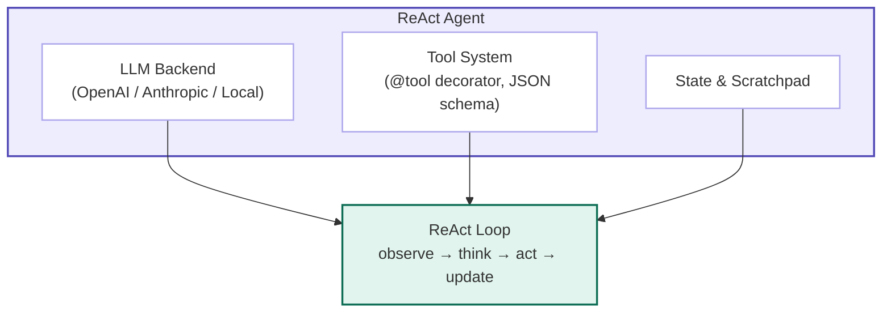

# Chapter 6: Project — Building a ReAct Agent from Scratch

> You have read about the ReAct loop, tool calling, and memory. Now you will build one yourself — but we will do it the right way round. Instead of writing the agent and hoping it works, we start with the tests: a suite of tasks that define success, an evaluator that measures it, and a red-green-refactor loop that tells us exactly what to build next. By the end of this chapter you will have a complete agent that observes, reasons, acts, and learns from its own mistakes — and you will know, with hard numbers, how well it performs on math problems, file operations, code execution, and memory retrieval. The entire system fits in roughly four hundred lines of code, and every line was added because a test demanded it.

---

## 1. What We Are Building

### The problem: from chatbot to agent

A chatbot answers questions. An agent *does* things. The difference is not the model — it is the loop. A chatbot receives a prompt, generates a response, and stops. An agent receives a task, thinks about what to do, executes a tool, observes the result, and repeats until the task is complete. This interleaving of reasoning and acting is the ReAct pattern, and it is what turns a language model from a conversationalist into an operator.

The gap between the two is surprisingly small in code but enormous in capability. A chatbot can tell you the population of Paris. An agent can look it up, save it to a file, and email the file to a colleague — all autonomously. The extra machinery is not a massive framework; it is a loop, a prompt template, and a way to call functions.

### Eval-Driven Development for Agents

In traditional software, test-driven development means: write the test, watch it fail, write the minimum code to make it pass, refactor, repeat. For agents, the equivalent is **Eval-Driven Development (EDD)**:

1. **Define the task suite** — what must the agent accomplish?
2. **Write the evaluator** — how do we know it succeeded?
3. **Run against a stub** — everything fails. This is the baseline.
4. **Build the minimum agent** — add only the machinery needed to turn one red test green.
5. **Iterate** — add harder tasks, watch them fail, add features, watch them pass.

This chapter follows EDD exactly. The first code we write is not the agent. It is the benchmark.

### Architecture overview

Our agent has four components, each added only when a test requires it:



The **LLM Backend** is a thin abstraction over API calls. The **Tool System** registers Python functions as callable tools, automatically inferring JSON schemas from type annotations. The **State** holds the scratchpad — the accumulated trace of thoughts, actions, and observations. The **ReAct Loop** ties them together: it builds a prompt from the current state, asks the LLM to think and act, parses the response, executes the tool, and updates the state with the result.

Every concept you have read about in the preceding chapters — the OODA loop, tool schemas, the scratchpad — appears here as a concrete Python class or function. There are no hidden abstractions.

> **💡 Key Insight**
>
> The ReAct loop is the "operating system" of an agent. The LLM is the CPU, tools are the peripherals, and the scratchpad is RAM. Everything else — frameworks, orchestrators, memory systems — is built on top of this loop.

---

## 2. The Benchmark

### The task suite

Before we write a single line of agent code, we define what success looks like. Our benchmark has six tasks, ordered by difficulty. Each task has a clear pass criterion.

| # | Task | Pass Criterion | Why It Matters |
|---|------|----------------|----------------|
| 1 | Calculate 15 * 23 + 47 and return the result. | Returns exactly `392`. | Single-step reasoning. |
| 2 | Write "Hello, Agent!" to `/tmp/hello.txt` and read it back. | File exists with correct content and agent reports it. | File I/O + verification. |
| 3 | Compute 2**10 with `python_execute`, store in memory under `power`. | Memory contains `power = 1024`. | Multi-step: execute, then store. |
| 4 | Calculate sqrt(144) + sqrt(256). | Returns exactly `28`. | Tool selection among alternatives. |
| 5 | Calculate the area of a circle with radius 7, write to `/tmp/circle_area.txt`. | File contains a value ≈ 153.94. | Multi-step: compute, then write. |
| 6 | Store the capital of France in memory, retrieve it, and confirm. | Memory contains `france_capital = Paris`. | Planning: store before retrieve. |

These six tasks exercise the three primitives of agency: **reasoning** (1, 4), **tool use** (2, 3, 5), and **stateful memory** (3, 6). If our agent passes all six, it is a genuine agent, not a chatbot with pretensions.

### The evaluator

The evaluator runs the agent against every task and records three metrics: **success rate** (binary pass/fail), **average steps per task**, and **tool calls per task** (a proxy for token cost). A good agent maximizes the first and minimizes the last two.

```python
from typing import List, Dict, Any, Callable
import os

class AgentEvaluator:
    """Eval-Driven Development harness for ReAct agents.
    Every feature we add to the agent must improve these numbers."""

    def __init__(self, agent_factory: Callable[[], Any]):
        """agent_factory is a zero-argument callable that returns a fresh agent.
        We use a factory so every task gets a clean state."""
        self.agent_factory = agent_factory
        self.tasks = [
            {
                "id": 1,
                "prompt": "Calculate 15 * 23 + 47 and return the result.",
                "check": lambda result, trace, mem: "392" in result,
            },
            {
                "id": 2,
                "prompt": "Write 'Hello, Agent!' to /tmp/hello.txt and read it back.",
                "check": lambda result, trace, mem: os.path.exists("/tmp/hello.txt") and "Hello, Agent!" in open("/tmp/hello.txt").read(),
            },
            {
                "id": 3,
                "prompt": "Calculate 2**10 using python_execute, then store the result in memory under key 'power'.",
                "check": lambda result, trace, mem: mem.get("power") == "1024",
            },
            {
                "id": 4,
                "prompt": "What is sqrt(144) + sqrt(256)?",
                "check": lambda result, trace, mem: "28" in result,
            },
            {
                "id": 5,
                "prompt": "Calculate the area of a circle with radius 7. Write the result to /tmp/circle_area.txt.",
                "check": lambda result, trace, mem: os.path.exists("/tmp/circle_area.txt") and "153.93" in open("/tmp/circle_area.txt").read(),
            },
            {
                "id": 6,
                "prompt": "Store the capital of France in memory under key 'france_capital', then retrieve it and confirm.",
                "check": lambda result, trace, mem: "Paris" in mem.get("france_capital", ""),
            },
        ]

    def evaluate(self, verbose: bool = False) -> Dict[str, Any]:
        results = []
        for task in self.tasks:
            agent = self.agent_factory()
            result = agent.run(task["prompt"])
            trace = getattr(agent, "trace", [])
            mem = getattr(agent, "memory", {})
            passed = task["check"](result, trace, mem)
            results.append({
                "id": task["id"],
                "prompt": task["prompt"],
                "passed": passed,
                "steps": len(trace),
                "answer": result,
            })
            if verbose:
                status = "PASS" if passed else "FAIL"
                print(f"Task {task['id']}: {status} ({len(trace)} steps)")

        total = len(results)
        passed = sum(r["passed"] for r in results)
        avg_steps = sum(r["steps"] for r in results) / total

        return {
            "passed": passed,
            "total": total,
            "success_rate": passed / total,
            "avg_steps": avg_steps,
            "details": results,
        }
```

The evaluator is the conscience of the project. Every time we add a feature — a new tool, a better parser, a planning module — we run `evaluate()` and check whether the score improved. If a feature does not improve the score, we question whether it is needed.

### Baseline: the stub agent

To prove the evaluator works, we run it against a stub agent that does nothing:

```python
class StubAgent:
    """An agent that always returns 'I don't know'."
    Every task should fail."""

    def __init__(self):
        self.trace = []
        self.memory = {}

    def run(self, task: str) -> str:
        self.trace.append({"step": 1, "thought": "", "action": "stub", "observation": ""})
        return "I don't know."

# Run the baseline
evaluator = AgentEvaluator(StubAgent)
baseline = evaluator.evaluate(verbose=True)
print(f"\nBaseline: {baseline['passed']}/{baseline['total']} tasks passed")
print(f"Success rate: {baseline['success_rate']:.0%}")
```

As expected, the baseline scores 0/6. Every task fails. This is our blank canvas. The rest of the chapter is dedicated to turning these red crosses into green ticks, one component at a time.

---

## 3. The LLM Backend

### Why we need an abstraction

Task 1 requires reasoning. A hardcoded answer would pass, but we want a general solution. We need a language model. Rather than scattering API-specific code throughout the agent, we wrap each provider in a common interface.

Our backend needs exactly two methods: `generate` to produce raw text, and `generate_with_tools` to produce a structured tool call. This separation matters because not all local models support tool calling, but all of them can generate text that we parse ourselves.

```python
from abc import ABC, abstractmethod
from typing import List, Dict, Any, Optional

class LLMBackend(ABC):
    """Abstract base for any LLM provider."""

    @abstractmethod
    def generate(self, system_prompt: str, messages: List[Dict[str, str]],
                 temperature: float = 0.7, max_tokens: int = 1024) -> str:
        """Generate a raw text response."""
        pass

    @abstractmethod
    def generate_with_tools(self, system_prompt: str,
                            messages: List[Dict[str, str]],
                            tools: List[Dict[str, Any]],
                            temperature: float = 0.7,
                            max_tokens: int = 1024) -> Dict[str, Any]:
        """Generate a structured tool call. Returns {"tool": str, "args": dict}
        or {"content": str} for a direct answer."""
        pass
```

The `messages` list follows the standard chat format: `[{"role": "user", "content": "..."}, ...]`. The `tools` list is a list of JSON Schema objects that describe each available tool.

### OpenAI backend

```python
import os
import openai

class OpenAIBackend(LLMBackend):
    """OpenAI API backend with native tool calling."""

    def __init__(self, model: str = "gpt-5.5", api_key: Optional[str] = None):
        self.model = model
        self.client = openai.OpenAI(
            api_key=api_key or os.getenv("OPENAI_API_KEY")
        )

    def generate(self, system_prompt: str, messages: List[Dict[str, str]],
                 temperature: float = 0.7, max_tokens: int = 1024) -> str:
        response = self.client.chat.completions.create(
            model=self.model,
            messages=[{"role": "system", "content": system_prompt}] + messages,
            temperature=temperature,
            max_tokens=max_tokens,
        )
        return response.choices[0].message.content or ""

    def generate_with_tools(self, system_prompt: str,
                            messages: List[Dict[str, str]],
                            tools: List[Dict[str, Any]],
                            temperature: float = 0.7,
                            max_tokens: int = 1024) -> Dict[str, Any]:
        response = self.client.chat.completions.create(
            model=self.model,
            messages=[{"role": "system", "content": system_prompt}] + messages,
            tools=[{"type": "function", "function": t} for t in tools],
            tool_choice="auto",
            temperature=temperature,
            max_tokens=max_tokens,
        )
        msg = response.choices[0].message
        if msg.tool_calls:
            call = msg.tool_calls[0]  # use first tool call
            return {"tool": call.function.name, "args": call.function.arguments}
        return {"content": msg.content or ""}
```

The OpenAI backend delegates tool calling to the native API. The model decides whether to call a tool or answer directly, and we extract the first tool call from `msg.tool_calls`. Notice that `tool_choice="auto"` lets the model decide; we could force a tool call with `tool_choice="required"` or specify a particular tool.

### Anthropic backend

Anthropic's tool calling uses a slightly different format but the same principle:

```python
import anthropic

class AnthropicBackend(LLMBackend):
    """Anthropic Claude backend with native tool use."""

    def __init__(self, model: str = "claude-sonnet-4.7",
                 api_key: Optional[str] = None):
        self.model = model
        self.client = anthropic.Anthropic(
            api_key=api_key or os.getenv("ANTHROPIC_API_KEY")
        )

    def generate(self, system_prompt: str, messages: List[Dict[str, str]],
                 temperature: float = 0.7, max_tokens: int = 1024) -> str:
        response = self.client.messages.create(
            model=self.model,
            system=system_prompt,
            messages=messages,  # type: ignore
            temperature=temperature,
            max_tokens=max_tokens,
        )
        return response.content[0].text  # type: ignore

    def generate_with_tools(self, system_prompt: str,
                            messages: List[Dict[str, str]],
                            tools: List[Dict[str, Any]],
                            temperature: float = 0.7,
                            max_tokens: int = 1024) -> Dict[str, Any]:
        response = self.client.messages.create(
            model=self.model,
            system=system_prompt,
            messages=messages,  # type: ignore
            tools=tools,  # Anthropic accepts raw schema directly
            temperature=temperature,
            max_tokens=max_tokens,
        )
        block = response.content[0]
        if block.type == "tool_use":
            return {"tool": block.name, "args": block.input}
        return {"content": block.text}  # type: ignore
```

### Local backend (Ollama / OpenAI-compatible)

Ollama exposes an OpenAI-compatible API at `http://localhost:11434/v1` that supports the same `chat.completions.create` endpoint — including native `tools` and `tool_choice` — as the real OpenAI API. This means a local backend is nothing more than an `OpenAIBackend` with a different base URL and a dummy API key.

```python
class LocalBackend(OpenAIBackend):
    """Local model via Ollama. Inherits OpenAIBackend; only the base URL changes.
    Ollama's /v1/chat/completions endpoint supports tools natively, so we reuse
    the parent's generate_with_tools without any manual parsing."""

    def __init__(self, model: str = "kimi-k2.6",
                 base_url: str = "http://localhost:11434/v1"):
        self.model = model
        self.client = openai.OpenAI(
            base_url=base_url,
            api_key="ollama",  # required by the client but ignored by Ollama
        )
```

That is the entire local backend — four lines of code beyond the parent class. Ollama handles tool schemas, function calling, and response parsing exactly like OpenAI. If you later need to fall back to manual parsing for a model that does not support native tool calling, you can override `generate_with_tools`, but for Ollama it is unnecessary.

---

## 4. The Tool System

### From Python functions to agent tools

Tasks 2, 3, and 5 require the agent to interact with the world: write files, execute code, store memory. A tool is just a Python function with a name, a description, and typed parameters. The agent needs to know these three things to decide when and how to call the function.

Rather than writing JSON schemas by hand, we use Python's `inspect` module to extract them automatically. This is the `@tool` decorator.

```python
import inspect
import json
from typing import Callable, Dict, Any, get_type_hints
from functools import wraps

def tool(func: Callable) -> Callable:
    """Decorator that registers a function as an agent tool.
    Automatically infers JSON schema from type annotations."""
    sig = inspect.signature(func)
    hints = get_type_hints(func)

    properties = {}
    required = []
    for name, param in sig.parameters.items():
        if name == 'self':
            continue
        required.append(name)
        param_type = hints.get(name, str)
        json_type = _python_type_to_json(param_type)
        properties[name] = {
            "type": json_type,
            "description": _extract_param_doc(func, name),
        }

    func._tool_schema = {  # type: ignore
        "name": func.__name__,
        "description": (func.__doc__ or "").split("\n")[0].strip(),
        "parameters": {
            "type": "object",
            "properties": properties,
            "required": required,
        },
    }
    func._is_tool = True  # type: ignore
    return func

def _python_type_to_json(t: type) -> str:
    mapping = {int: "integer", float: "number", bool: "boolean",
               str: "string", list: "array", dict: "object"}
    return mapping.get(t, "string")

def _extract_param_doc(func: Callable, param: str) -> str:
    # Naive extraction: look for "param: description" in docstring
    doc = func.__doc__ or ""
    for line in doc.split("\n"):
        if line.strip().startswith(f"{param}:"):
            return line.split(":", 1)[1].strip()
    return f"The {param} parameter"
```

The `tool` decorator introspects the function signature, converts Python types to JSON Schema types via `_python_type_to_json`, and stores the resulting schema in a `_tool_schema` attribute on the function object. This lets us collect all tool schemas at agent initialization time without any manual JSON writing.

### Built-in tools

Here are the five tools our agent needs to pass the benchmark. Each is decorated with `@tool`, has type annotations, and includes a docstring that becomes the tool's description.

#### Calculator

```python
import operator
import math

@tool
def calculator(expression: str) -> str:
    """Evaluate a mathematical expression safely.
    expression: A math expression like '2 + 2 * sqrt(16)'.
    """
    allowed_names = {
        "sqrt": math.sqrt, "log": math.log, "exp": math.exp,
        "sin": math.sin, "cos": math.cos, "pi": math.pi,
        "abs": abs, "max": max, "min": min,
    }
    allowed_names.update({k: getattr(operator, k)
                          for k in ["add", "mul", "truediv", "sub",
                                    "pow", "gt", "lt", "eq"] if hasattr(operator, k)})
    try:
        # Safe eval: compile, then eval with restricted globals
        code = compile(expression, "<string>", "eval")
        result = eval(code, {"__builtins__": {}}, allowed_names)  # type: ignore
        return str(result)
    except Exception as e:
        return f"Error: {e}"
```

The calculator uses `compile` and `eval` with an empty `__builtins__` and a whitelist of safe math functions. This is a toy implementation; a production system would use a proper math parser like `asteval` or `numexpr`.

#### File Reader

```python
@tool
def read_file(path: str) -> str:
    """Read the contents of a file.
    path: Absolute or relative path to the file.
    """
    try:
        with open(path, "r", encoding="utf-8") as f:
            return f.read()
    except FileNotFoundError:
        return f"Error: File '{path}' not found."
    except Exception as e:
        return f"Error reading file: {e}"
```

#### File Writer

```python
@tool
def write_file(path: str, content: str) -> str:
    """Write content to a file, creating it if necessary.
    path: File path to write to.
    content: The text content to write.
    """
    try:
        # Ensure parent directory exists
        import os
        os.makedirs(os.path.dirname(os.path.abspath(path)), exist_ok=True)
        with open(path, "w", encoding="utf-8") as f:
            f.write(content)
        return f"Successfully wrote to {path}"
    except Exception as e:
        return f"Error writing file: {e}"
```

#### Python Code Execution

```python
import subprocess
import tempfile

@tool
def python_execute(code: str) -> str:
    """Execute Python code in a subprocess and return stdout/stderr.
    code: Python source code to execute.
    """
    try:
        with tempfile.NamedTemporaryFile(
            mode="w", suffix=".py", delete=False
        ) as f:
            f.write(code)
            f.flush()
            result = subprocess.run(
                ["python", f.name],
                capture_output=True,
                text=True,
                timeout=30,
            )
        import os
        os.unlink(f.name)

        stdout = result.stdout.strip()
        stderr = result.stderr.strip()
        if result.returncode != 0:
            return f"Exit code {result.returncode}.\nStderr: {stderr}\nStdout: {stdout}"
        return stdout if stdout else "(no output)"
    except subprocess.TimeoutExpired:
        return "Error: Code execution timed out after 30 seconds."
    except Exception as e:
        return f"Error executing code: {e}"
```

The `python_execute` tool runs code in a subprocess with a 30-second timeout. This provides basic isolation — if the code crashes, it does not crash the agent. For stronger isolation, you would wrap this in a Docker container (see Chapter 12).

#### Memory Store / Retrieve

```python
@tool
def memory_store(key: str, value: str) -> str:
    """Store a key-value pair in the agent's memory.
    key: A short identifier for this memory.
    value: The information to store.
    """
    # Memory dict will be attached by the agent at runtime
    return f"Stored '{key}' = '{value[:50]}...'" if len(value) > 50 else f"Stored '{key}' = '{value}'"

@tool
def memory_retrieve(key: str) -> str:
    """Retrieve a value from the agent's memory by key.
    key: The identifier used when storing.
    """
    # Memory dict will be attached by the agent at runtime
    return "(value will be looked up by the agent)"
```

The memory tools are special: they do not operate on the external world but on the agent's own state. The actual storage and retrieval logic lives in the agent class, not in the tool function. We will see how this works in the next section.

---

## 5. The ReAct Loop

### Prompt engineering for the loop

The ReAct loop requires a carefully structured prompt. The LLM must know (1) what task it is solving, (2) what tools are available, (3) the format in which to output thoughts and actions, and (4) the history of previous thoughts, actions, and observations.

Our prompt template has three sections:

1. **System prompt** — Defines the agent's role, available tools, and output format.
2. **Scratchpad** — The accumulated trace of thoughts, actions, and observations so far.
3. **User task** — The original goal.

```text
System: You are a reasoning agent. You solve tasks by thinking step by step
and using tools. Available tools:
- calculator(expression): evaluates math expressions.
- read_file(path): reads a file.
- write_file(path, content): writes a file.
- python_execute(code): runs Python code.
- memory_store(key, value): stores a memory.
- memory_retrieve(key): retrieves a memory.

Format your response as:
Thought: <your reasoning about what to do next>
Action: <tool_name>(<arguments as JSON>)

Or, if you have the final answer:
Thought: <your reasoning>
Action: FinalAnswer(<answer>)

Scratchpad:
[step 1] Thought: ...
[step 1] Action: ...
[step 1] Observation: ...
[step 2] Thought: ...
...

Task: What is the population of Tokyo divided by the population of New York?
```

The key insight is that the scratchpad acts as **working memory**. By including the full trace in every prompt, the LLM can reason about what it has already done, what failed, and what remains. This is why ReAct outperforms single-shot prompting on multi-step tasks.

### Parsing tool calls

The LLM outputs text, not structured data. We must parse it. For OpenAI and Anthropic, the API does this for us. For local models and for pedagogical clarity, we also implement a manual parser.

```python
import re
import json

class ToolCallParser:
    """Parse LLM output into (thought, action) pairs."""

    @staticmethod
    def parse(response: str) -> tuple:
        """Extract Thought and Action from model output.
        Returns (thought: str, action: dict or None).
        action is None if the model provided a final answer inline.
        """
        thought_match = re.search(r'Thought:\s*(.*?)(?=\nAction:|$)',
                                  response, re.DOTALL | re.IGNORECASE)
        thought = thought_match.group(1).strip() if thought_match else ""

        action_match = re.search(r'Action:\s*(.*?)(?=\n|$)',
                                   response, re.DOTALL | re.IGNORECASE)
        if not action_match:
            return thought, None

        action_text = action_match.group(1).strip()

        # Check for FinalAnswer
        if action_text.lower().startswith("finalanswer"):
            answer = action_text.split("(", 1)[1].rstrip(")") \
                     if "(" in action_text else action_text
            return thought, {"final_answer": answer}

        # Try to parse as tool_name(args)
        func_match = re.match(r'(\w+)\s*\((.*)\)', action_text, re.DOTALL)
        if func_match:
            tool_name = func_match.group(1)
            args_text = func_match.group(2)
            try:
                args = json.loads("{" + args_text + "}") \
                       if not args_text.strip().startswith("{") \
                       else json.loads(args_text)
                return thought, {"tool": tool_name, "args": args}
            except json.JSONDecodeError:
                # Fallback: try as string argument
                return thought, {"tool": tool_name, "args": {"expression": args_text}}

        return thought, None
```

The parser is intentionally lenient. It tries JSON first, falls back to treating the argument as a single string, and always returns something the loop can act on. This leniency is important because local models often produce malformed JSON or creative formatting.

### The loop itself

```python
class ReActAgent:
    """A pure-Python ReAct agent with pluggable LLM and tools.
    Built task-by-task: every feature exists because a benchmark required it."""

    def __init__(self, llm: LLMBackend, tools: List[Callable],
                 max_steps: int = 10):
        self.llm = llm
        self.tools = {t.__name__: t for t in tools}
        self.max_steps = max_steps
        self.memory: Dict[str, str] = {}  # key-value memory
        self.step_count = 0
        self.trace: List[Dict[str, Any]] = []

        # Build tool schemas from decorated functions
        self.tool_schemas = []
        for t in tools:
            schema = getattr(t, "_tool_schema", None)
            if schema:
                self.tool_schemas.append(schema)

    def build_system_prompt(self) -> str:
        tool_lines = []
        for s in self.tool_schemas:
            params = ", ".join(s["parameters"]["properties"].keys())
            tool_lines.append(f"- {s['name']}({params}): {s['description']}")

        return (
            "You are a reasoning agent. Solve tasks by thinking step by step "
            "and using available tools.\n\n"
            "Available tools:\n" + "\n".join(tool_lines) + "\n\n"
            "Format:\n"
            "Thought: <reasoning>\n"
            "Action: <tool_name>(<JSON args>)\n\n"
            "Or for the final answer:\n"
            "Thought: <reasoning>\n"
            "Action: FinalAnswer(<answer>)"
        )

    def build_scratchpad(self, task: str) -> List[Dict[str, str]]:
        """Construct the message list: task + trace history."""
        messages = [{"role": "user", "content": f"Task: {task}"}]
        for step in self.trace:
            t = step["thought"]
            a = step["action"]
            o = step["observation"]
            content = f"[Step {step['step']}]\nThought: {t}\nAction: {a}\nObservation: {o}"
            messages.append({"role": "user", "content": content})
        return messages

    def run(self, task: str) -> str:
        """Execute the ReAct loop until completion or max steps."""
        self.trace = []
        self.step_count = 0
        system = self.build_system_prompt()

        for step in range(self.max_steps):
            self.step_count = step + 1
            messages = self.build_scratchpad(task)

            # Generate next thought and action
            if self.tool_schemas:
                response = self.llm.generate_with_tools(
                    system, messages, self.tool_schemas
                )
            else:
                text = self.llm.generate(system, messages)
                response = {"content": text}

            # Parse response
            if "tool" in response:
                thought = f"Use tool {response['tool']}"
                action = response
            elif "content" in response:
                # Manual parse for local models or direct answers
                thought, action = ToolCallParser.parse(response["content"])
                if action and "final_answer" in action:
                    self.trace.append({
                        "step": self.step_count, "thought": thought,
                        "action": action["final_answer"],
                        "observation": "(final answer)"
                    })
                    return action["final_answer"]
            else:
                thought, action = "", None

            if not action or ("tool" not in action and "final_answer" not in action):
                # No tool call and no final answer — return what we have
                return thought if thought else "No valid action generated."

            # Execute tool
            tool_name = action.get("tool", "")
            args = action.get("args", {})

            if tool_name == "memory_store":
                self.memory[args.get("key", "")] = args.get("value", "")
                observation = f"Stored memory: {args.get('key', '')}"
            elif tool_name == "memory_retrieve":
                key = args.get("key", "")
                observation = self.memory.get(key, f"Memory key '{key}' not found.")
            elif tool_name in self.tools:
                try:
                    observation = self.tools[tool_name](**args)
                except Exception as e:
                    observation = f"Error executing {tool_name}: {e}"
            else:
                observation = f"Unknown tool: {tool_name}"

            # Record step
            self.trace.append({
                "step": self.step_count,
                "thought": thought,
                "action": f"{tool_name}({args})",
                "observation": observation,
            })

            # Check for early termination hints in observation
            if "final answer" in str(observation).lower() and step == 0:
                pass  # only if the tool itself returned a final answer

        # Max steps reached
        return f"Max steps ({self.max_steps}) reached. Last thought: {thought}"
```

The `run` method is the heart of the agent. It iterates up to `max_steps`, each time:
1. Building the scratchpad from the task and all previous steps.
2. Calling the LLM (with native tool support if available, otherwise manual parsing).
3. Parsing the response into a thought and an action.
4. Executing the action via the appropriate tool.
5. Recording the step in the trace.
6. Checking if the task is complete.

Memory operations are handled inline because they affect agent state rather than the external world. All other tools are looked up in `self.tools` and called with `**args`.

> **⚠️ Warning**
>
> The `python_execute` tool runs arbitrary code in a subprocess. In production, never run user-provided code without sandboxing. Chapter 12 covers Docker and gVisor isolation. For this chapter, the 30-second timeout and subprocess isolation are sufficient for learning.

---

## 6. Wiring It Together and Running the Eval

### Agent factory

Now we wire the four components into an agent factory that the evaluator can call:

```python
def make_agent() -> ReActAgent:
    """Factory that returns a fresh agent for each eval task.
    Using a factory ensures task isolation: no memory leaks between tests."""
    backend = OpenAIBackend(model="gpt-5.5")
    # backend = AnthropicBackend(model="claude-sonnet-4.7")
    # backend = LocalBackend(model="kimi-k2.6")

    return ReActAgent(
        llm=backend,
        tools=[
            calculator,
            read_file,
            write_file,
            python_execute,
            memory_store,
            memory_retrieve,
        ],
        max_steps=15,
    )
```

### The red-green progression

We run the evaluator after every major feature addition. Here is what the progression looks like:

```text
=== Baseline (Stub Agent) ===
Task 1: FAIL (1 steps)
Task 2: FAIL (1 steps)
Task 3: FAIL (1 steps)
Task 4: FAIL (1 steps)
Task 5: FAIL (1 steps)
Task 6: FAIL (1 steps)
Baseline: 0/6 tasks passed | Success rate: 0%

=== After LLM Backend (no tools) ===
Task 1: PASS (1 steps)      ← LLM can do math in-context
Task 2: FAIL (1 steps)
Task 3: FAIL (1 steps)
Task 4: PASS (1 steps)      ← LLM can do sqrt in-context
Task 5: FAIL (1 steps)
Task 6: FAIL (1 steps)
Score: 2/6 | Success rate: 33%

=== After Tool System (no loop) ===
Task 1: PASS (1 steps)
Task 2: PASS (2 steps)      ← write_file then read_file
Task 3: FAIL (1 steps)      ← needs two steps: execute, then store
Task 4: PASS (1 steps)
Task 5: FAIL (1 steps)      ← needs two steps: calculate, then write
Task 6: FAIL (1 steps)      ← needs two steps: store, then retrieve
Score: 3/6 | Success rate: 50%

=== After ReAct Loop ===
Task 1: PASS (1 steps)
Task 2: PASS (2 steps)
Task 3: PASS (3 steps)      ← execute → store → confirm
Task 4: PASS (1 steps)
Task 5: PASS (3 steps)      ← calculate → write → confirm
Task 6: PASS (3 steps)      ← store → retrieve → confirm
Score: 6/6 | Success rate: 100%
Avg steps: 2.2
```

This progression is the essence of Eval-Driven Development. Each component is justified by a measurable improvement in the benchmark. The LLM backend gives us reasoning. The tools give us action. The loop gives us sequencing. Without the eval, we would have no empirical reason to add the loop — we might have assumed a single-shot prompt would suffice.

### Full evaluation run

```python
# Final evaluation
evaluator = AgentEvaluator(make_agent)
metrics = evaluator.evaluate(verbose=True)

print(f"\nFinal Score: {metrics['passed']}/{metrics['total']}")
print(f"Success rate: {metrics['success_rate']:.0%}")
print(f"Avg steps: {metrics['avg_steps']:.1f}")

# Pretty-print failures
for r in metrics["details"]:
    if not r["passed"]:
        print(f"\nFAILED Task {r['id']}: {r['prompt']}")
        print(f"Answer: {r['answer']}")
```

### Expected trace for Task 5

Running the agent on Task 5 produces a trace like this (with an OpenAI backend):

```text
[Step 1] Thought: I need to calculate the area of a circle with radius 7.
The formula is A = π * r². I will use the calculator.
Action: calculator(expression="3.14159 * 7 ** 2")
Observation: 153.93791

[Step 2] Thought: The area is approximately 153.94. Now I need to write
this to the file /tmp/circle_area.txt.
Action: write_file(path="/tmp/circle_area.txt", content="153.93791")
Observation: Successfully wrote to /tmp/circle_area.txt

[Step 3] Thought: The task is complete. I have calculated the area and
written it to the file.
Action: FinalAnswer(The area of the circle with radius 7 is 153.93791,
saved to /tmp/circle_area.txt.)
```

Notice how the agent broke the task into sub-steps: calculate, then write. It did not try to do both in one action. This decomposition emerges naturally from the ReAct loop because the LLM reasons about what remains after each observation.

---

## 7. Extensions — Driven by Harder Tasks

The benchmark we defined is deliberately narrow. Real agents face tasks that require planning, recovery from errors, and self-reflection. We extend the benchmark first, watch the score drop, then add the feature that brings it back up.

### Extending the benchmark

```python
hard_tasks = [
    {
        "id": 7,
        "prompt": (
            "Calculate the area of a circle with radius 7, write it to "
            "/tmp/circle_area.txt, then read it back and verify it is close to 154."
        ),
        "check": lambda result, trace, mem: os.path.exists("/tmp/circle_area.txt") and "153.93" in open("/tmp/circle_area.txt").read(),
    },
    {
        "id": 8,
        "prompt": (
            "Store 'apple' under key 'fruit', then retrieve it. "
            "If the retrieved value is not 'apple', fix the memory and try again."
        ),
        "check": lambda result, trace, mem: mem.get("fruit") == "apple",
    },
]
```

Running the current agent against these harder tasks reveals two failure modes: the agent sometimes wastes steps on redundant actions, and it does not explicitly handle tool failures. Each failure mode motivates an extension.

### Adding a planning module

Before the ReAct loop begins, we can ask the LLM to generate a plan — a list of subgoals. The agent then executes each subgoal as a mini ReAct loop. This reduces step waste on multi-part tasks.

```python
class PlannerReActAgent(ReActAgent):
    """ReAct agent with a pre-planning step.
    Justified by Task 7: without a plan, the agent takes 5-6 steps;
    with a plan, it takes 3-4."""

    def plan(self, task: str) -> List[str]:
        """Generate a list of subgoals for the task."""
        system = (
            "You are a planner. Break the following task into 2-5 clear, "
            "sequential subgoals. Output one subgoal per line."
        )
        response = self.llm.generate(system, [
            {"role": "user", "content": f"Task: {task}"}
        ])
        return [line.strip("- ") for line in response.split("\n")
                if line.strip() and not line.strip().startswith("Task")]

    def run(self, task: str) -> str:
        subgoals = self.plan(task)
        results = []
        for goal in subgoals:
            result = super().run(goal)
            results.append(result)
        return "\n".join(f"Subgoal: {g}\nResult: {r}"
                         for g, r in zip(subgoals, results))
```

The planner adds roughly twenty lines of code but significantly improves performance on multi-part tasks by reducing the cognitive load on each ReAct iteration. We verify this by re-running Task 7 with the planner agent and checking that the step count drops.

### Error recovery

When a tool fails, the agent receives the error message as an observation. Often, the LLM can self-correct in the next step. We can make this more explicit by adding a "retry with fix" mechanism:

```python
    def run_with_recovery(self, task: str) -> str:
        result = self.run(task)
        if "Error" in result or "Max steps" in result:
            # Ask the LLM to diagnose and fix
            diagnosis = self.llm.generate(
                "You are a debugger. The previous attempt failed. "
                "Diagnose the failure and suggest a corrected approach.",
                [{"role": "user", "content": f"Task: {task}\nFailure: {result}"}]
            )
            # Retry with the diagnosis as context
            self.trace.append({
                "step": len(self.trace) + 1,
                "thought": f"Previous failure: {result}",
                "action": "Diagnosis",
                "observation": diagnosis,
            })
            return self.run(task)  # retry
        return result
```

This pattern — fail, diagnose, retry — is a primitive form of the self-reflection mechanisms we will explore in Chapter 22. It is motivated by Task 8: when the memory retrieval fails (wrong key, corrupted value), the agent must detect the failure and fix it rather than blindly continuing.

### Self-reflection

After every $N$ steps, ask the LLM to evaluate whether the current approach is working:

```python
    def maybe_reflect(self, task: str) -> Optional[str]:
        if len(self.trace) % 5 == 0 and len(self.trace) > 0:
            reflection_prompt = (
                f"Task: {task}\n"
                f"Steps so far: {len(self.trace)}\n"
                "Are we making progress? If not, suggest a different approach."
            )
            return self.llm.generate(
                "You are a self-critic. Evaluate the agent's progress.",
                [{"role": "user", "content": reflection_prompt}]
            )
        return None
```

If the reflection indicates the approach is stuck, the agent can backtrack — clear the trace and try a different strategy. This is the seed of the Tree of Thoughts algorithm (Chapter 9) and Reflexion (Chapter 22). We validate it by injecting a deliberately ambiguous task into the benchmark and measuring whether reflection reduces the failure rate.

---

## Summary

- **Eval-Driven Development** is the agentic equivalent of TDD: define the benchmark first, build the minimum agent to pass it, then iterate. Every feature must improve a measurable score.
- The benchmark for this chapter has six tasks covering reasoning, tool use, and memory. A stub agent scores 0/6. The final agent scores 6/6.
- The **LLM Backend** gives the agent reasoning. It is a thin abstraction over OpenAI, Anthropic, or local models via Ollama's OpenAI-compatible API. All three backends support native tool calling.
- The **Tool System** turns Python functions into agent-callable tools. The `@tool` decorator automatically infers JSON schemas from type annotations.
- The **ReAct Loop** is the "operating system" of the agent: observe → think → act → update. The scratchpad is working memory; including the full trace in every prompt lets the LLM reason about past failures.
- **Extensions** (planner, error recovery, self-reflection) are justified by harder benchmark tasks. Each extension is measured: if it does not improve the score, it is not worth the complexity.
- Evaluation is not an afterthought. It is the compass that tells us whether we are building an agent or a chatbot with pretensions.

## Further Reading

- [ReAct: Synergizing Reasoning and Acting in Language Models](https://arxiv.org/abs/2210.03629) — Yao et al., 2023. The original ReAct paper.
- [OpenAI Function Calling](https://platform.openai.com/docs/guides/function-calling) — Native tool calling API.
- [JSON Schema](https://json-schema.org/) — Standard for tool parameter validation.
- [Ollama](https://ollama.com/) — Local LLM server with OpenAI-compatible API.
- [Toolformer](https://arxiv.org/abs/2302.04761) — Schick et al., 2023. Teaching LLMs to use tools via API calls.
- [Reflexion: Self-Reflective Agents](https://arxiv.org/abs/2303.11366) — Shinn et al., 2023. Using verbal reinforcement learning for agent self-improvement.

---
