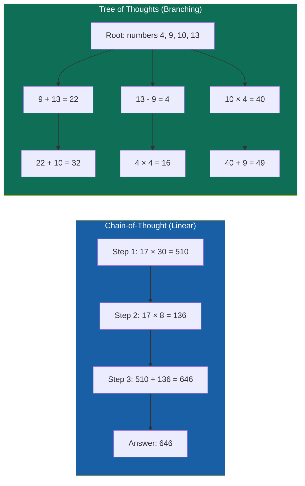
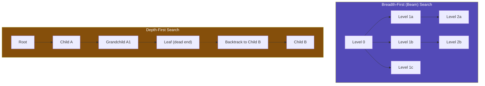
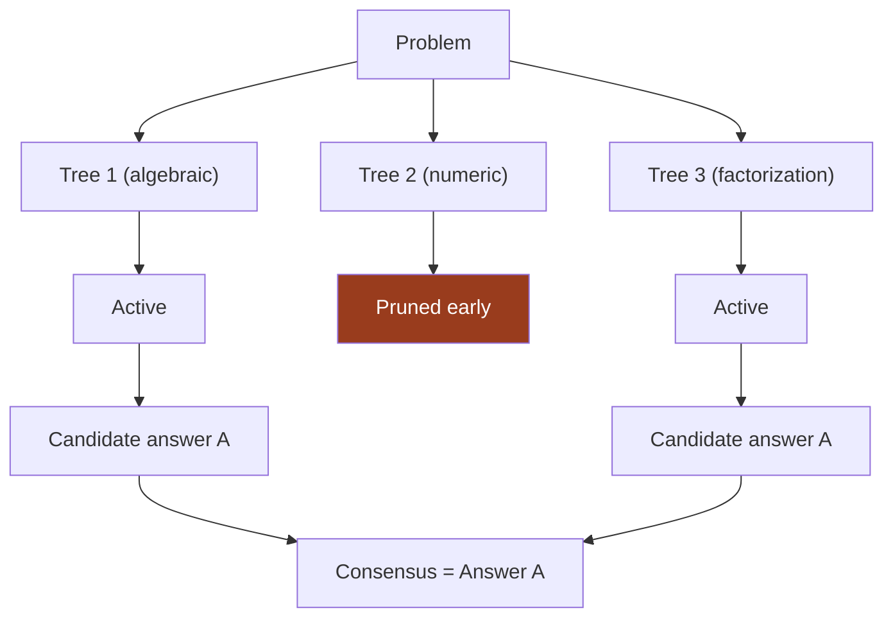
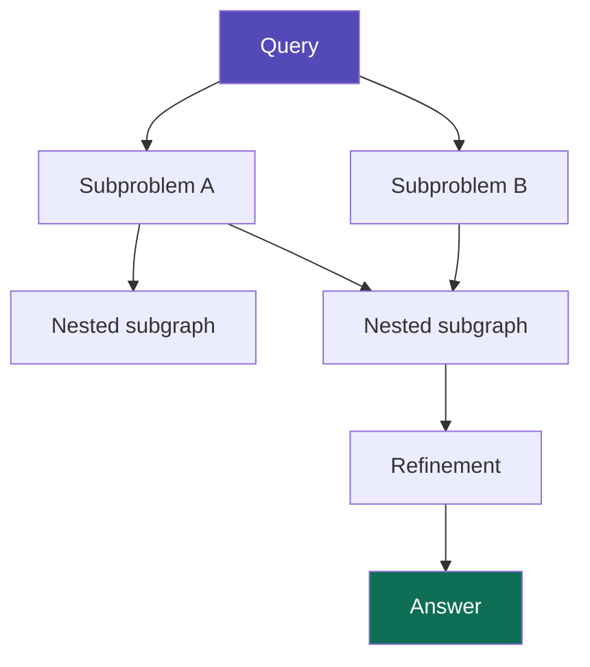
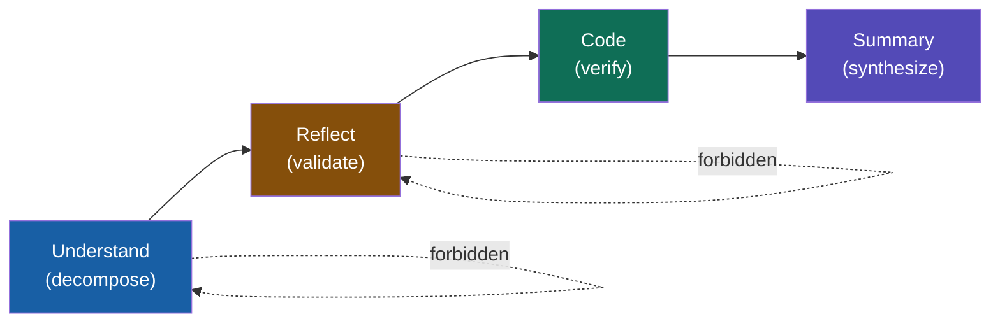
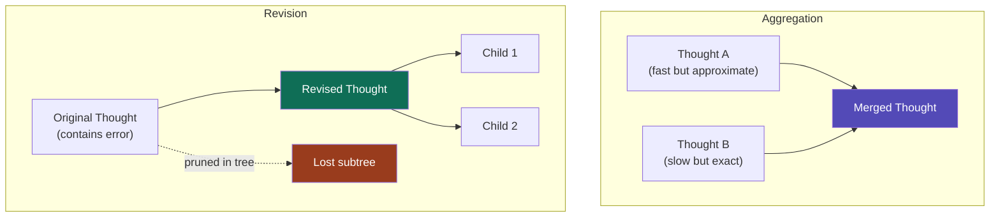

# Chapter 9: Tree and Graph of Thoughts

> Imagine you are playing chess. You do not glance at the board, play the first legal move that comes to mind, and follow it blindly to checkmate. You consider several openings, explore the consequences of each, abandon lines that look losing, and sometimes merge ideas from two different analyses into a novel plan. Chapter 8 gave an LLM a single linear scratchpad — one line of play. But many problems, from mathematical puzzles to software debugging, require branching exploration: backtracking from dead ends, comparing partial solutions, and synthesizing insights from parallel reasoning tracks. This chapter extends the linear reasoning chain into a tree, and then into a graph. By the end, you will build a complete Tree-of-Thoughts solver in pure Python that treats an LLM as both a move generator and a position evaluator, applying classical search algorithms to the space of reasoning itself.

---

## 1. Tree of Thoughts (ToT)

### 1.1 From linear chains to branching reasoning trees

Chain-of-Thought prompting, as we saw in Chapter 8, gives a language model a scratchpad: a single linear sequence of intermediate steps that terminates in an answer. The model generates step 1, then step 2, then step 3, with no opportunity to reconsider step 1 if step 3 turns out to be a dead end. For simple arithmetic or straightforward explanations, this is sufficient. For problems where early mistakes compound — long-horizon planning, combinatorial puzzles, or multi-step proofs — a single chain is brittle. One hallucinated intermediate result poisons everything downstream.

**Tree of Thoughts (ToT)**, introduced by Yao et al. (2023), generalizes CoT by treating reasoning as a search problem over a tree. Each node in the tree is a *thought*: a coherent language sequence that serves as an intermediate step toward solving the problem. The root is the initial problem statement. Edges connect a parent thought to its children, which are candidate continuations. Instead of committing to a single next token, the LLM generates a set of candidate thoughts at each step, and a search algorithm decides which branches to explore, which to prune, and which to pursue to completion.

The conceptual shift is subtle but profound. In CoT, the LLM is a reasoner. In ToT, the LLM is a **state generator**: its job is to propose possible next states in a search space. A separate component — the **evaluator** — judges the promise of each state. The search algorithm (BFS, DFS, or beam search) orchestrates the two. This decoupling mirrors how classical AI planners work: a generator proposes actions, a heuristic evaluates states, and A* or MCTS navigates the space.




*Figure 9.1 — CoT commits to a single linear scratchpad. ToT generates a branching tree of candidate intermediate steps and searches over them.*


### 1.2 BFS and DFS over thought space

ToT is not a single algorithm; it is a family of algorithms parameterized by a search strategy. Yao et al. explored two extremes: **Breadth-First Search (BFS)** and **Depth-First Search (DFS)**.

In **BFS–ToT**, the agent expands every node at the current depth before moving deeper. It maintains a *frontier* of active nodes, generates $k$ children for each, scores all children with the evaluator, and keeps only the top-$b$ highest-scoring nodes for the next level (this is effectively **beam search** with width $b$). BFS is conservative: it compares many partial solutions side-by-side before committing to any single path. It excels when the evaluator is reliable and the solution depth is shallow, because it maximizes the chance that a good partial solution survives to the next round.

In **DFS–ToT**, the agent picks the most promising child of the current node, dives deep, and either reaches a solution or hits a dead end. When it hits a dead end, it backtracks to the most recent unexplored sibling and tries again. DFS is aggressive: it produces complete candidate solutions quickly, which is useful when the problem requires a full sequence to be evaluated (e.g., a proof or a plan). Its weakness is myopia — if the evaluator overestimates an early node, the agent can waste significant compute exploring a doomed subtree.

In practice, most modern implementations use a hybrid: beam search for the first few levels to keep diversity, then DFS-style depth bias for promising subtrees. The choice between BFS and DFS is a trade-off between parallelism (BFS generates many candidates at once, which can be batched) and depth (DFS minimizes context-window usage by focusing on one thread at a time).




*Figure 9.2 — BFS explores all candidates at a given depth before deepening. DFS commits to one line of reasoning and backtracks only when it fails.*


### 1.3 State evaluation: scoring intermediate thoughts for promise

The evaluator is the critical — and expensive — component of ToT. Without it, the framework degenerates to random search with extra API calls. The evaluator answers a simple question: *how promising is this partial thought?* The answer can be a scalar score, a categorical label, or a ranking.

Yao et al. used an LLM-as-judge for Game of 24, asking the model to classify each intermediate expression as **sure**, **maybe**, or **impossible** to reach 24. This ternary classification is surprisingly effective because it forces the evaluator to make a discrete judgment rather than regress a noisy continuous score. Other options include:

1. **LLM-as-judge with rubrics**: A separate prompt instructs the model to score the thought on a 1–10 scale against explicit criteria (correctness so far, logical consistency, progress toward goal).
2. **Trained Process Reward Model (PRM)**: A small classifier trained to predict whether a reasoning step is correct, as discussed in Chapter 15. PRMs are fast and consistent but require training data.
3. **External verifier**: A unit test, theorem prover, or simulator that checks the partial state for validity. In Blocksworld, the simulator can reject a plan step that violates physical constraints (e.g., moving a block that has another block on top of it).

The quality of the evaluator determines the ceiling of ToT performance. A perfect evaluator would make ToT equivalent to oracle-guided search. A poor evaluator prunes correct branches and promotes wrong ones, making ToT worse than simple CoT because it wastes compute on fruitless exploration.

> **💡 Key Insight**
>
> ToT is, in essence, Monte Carlo Tree Search where the LLM plays two roles: the move generator (proposing children) and the rollout policy (completing a candidate sequence). The evaluator functions as the value network that guides selection. Without a strong value function, the search collapses.

### 1.4 Pruning: discarding low-scoring branches to manage search budget

The cost of naïve ToT grows exponentially. With branching factor $b$, depth $d$, and one evaluator call per generated node, the total number of LLM calls is roughly proportional to $b \times d \times e$, where $e$ is the evaluator calls per expansion (scalar multiplication, shapes are scalars). For $b=5$, $d=5$, and $e=1$, that is thousands of API calls per problem — prohibitively expensive.

Pruning is therefore not optional; it is the mechanism that makes ToT practical. Three pruning strategies dominate:

- **Value threshold**: Discard any child whose evaluator score falls below a fixed threshold. This is simple but brittle: the threshold must be tuned per task.
- **Top-$k$ per level (beam width)**: Keep only the $k$ highest-scoring children across the entire frontier. This guarantees a fixed-width tree and predictable cost. Beam width $k=3$ to $5$ is a common default for hard reasoning tasks.
- **Early termination**: If the evaluator returns **sure** for a node, stop expanding that branch and return it as the answer. If the evaluator returns **impossible**, prune the entire subtree immediately.

Modern systems also use **semantic similarity pruning**: if two candidate thoughts are nearly identical in embedding space, one is discarded before evaluation. Kim et al. (October 2025) showed that this reduces node count by up to 90% with less than 5% accuracy loss. The core principle is that diversity in the frontier matters more than raw breadth — five genuinely different ideas are more valuable than twenty paraphrases of the same idea.

---

## 2. Modern ToT Variants (2024–2025)

### 2.1 Forest-of-Thought (FoT)

**Forest-of-Thought (FoT)**, proposed by Bi et al. (ICML 2025), asks: why run one tree when you can run many? FoT maintains a *forest* of parallel reasoning trees, each seeded with a different decomposition of the problem or a different reasoning style. A **sparse activation** mechanism monitors the confidence of each tree in real time. If a tree’s intermediate nodes repeatedly fail validation or score below a threshold, the tree is deactivated early, freeing compute for its neighbors.

The final answer is produced by a **Consensus-Guided Expert Decision (CGED)** module. If the active trees agree, their majority answer is returned. If they disagree, an "expert" LLM (often a stronger model, or the same model prompted to compare reasoning traces) arbitrates. FoT also augments inputs by retrieving related solved problems from a knowledge base, mimicking the human strategy of drawing on prior experience.

FoT’s results are striking. On Game of 24, FoT with eight activated subtrees achieves **96.84%** success, crushing standard ToT (74.00%) and even MCTS-based variants. On GSM8K with QwQ-32B, FoT(n=4) reaches **97.33%** accuracy. The scaling law is consistent: more active trees, higher accuracy, with sparse activation preventing the cost from exploding linearly.




*Figure 9.3 — Forest-of-Thought runs parallel reasoning trees, deactivating low-confidence ones early and resolving the remainder via consensus.*


### 2.2 Adaptive Graph of Thoughts (AGoT)

**Adaptive Graph of Thoughts (AGoT)**, from Pandey et al. (February 2025), pushes the structure further: instead of a fixed tree or forest, it builds a **dynamic Directed Acyclic Graph (DAG)** of reasoning steps. When AGoT encounters a complex subproblem, it spawns a *nested subgraph* dedicated to that subproblem. When the subproblem is solved, the subgraph collapses into a single node in the parent graph. This recursive decomposition unifies CoT, ToT, and GoT in a single framework.

The adaptivity comes from a complexity gate. At each step, AGoT asks: *is the current thought sufficient, or does it need deeper analysis?* If the self-assessment score is high, the node is marked complete. If low, the node is expanded into a subgraph. This means easy subproblems get a single CoT step, hard subproblems get a full ToT search, and related subproblems get merged via GoT-style aggregation. The result is **+46.2% on GPQA** without any training or fine-tuning — gains typically reserved for expensive RL distillation approaches like DeepSeek-R1.




*Figure 9.4 — AGoT dynamically decomposes a query into nested subgraphs. Subproblems that need deeper analysis spawn their own local reasoning DAGs.*


### 2.3 Constrained MCTS (CMCTS)

Standard MCTS applied to LLM reasoning suffers from two pathologies. First, the LLM tends to generate homogeneous states — it keeps proposing the same kind of step (e.g., more algebra) rather than diverse reasoning modes (reflection, code verification, summary). Second, using the LLM itself as a reward model is unreliable: it often overrates its own intermediate work.

**Constrained MCTS (CMCTS)**, by Lin et al. (February 2025), fixes both problems by *constraining* the action space. Instead of letting the LLM generate any next thought freely, CMCTS forces it to sample from one of four predefined disjoint action sets:

- **$A_{\text{understand}}$**: Decompose the problem into smaller pieces.
- **$A_{\text{reflect}}$**: Validate, check for errors, or critique previous steps.
- **$A_{\text{code}}$**: Write and execute code to verify a sub-calculation.
- **$A_{\text{summary}}$**: Synthesize intermediate results into a final answer.

**Partial order rules** enforce logical structure: no two consecutive actions of the same type; at least one reflection per trajectory; code actions are restricted to certain depths where computation is needed. A pretrained **Process Reward Model (PRM)** scores candidate actions via positive/negative logits, steering the search toward high-quality reasoning chains.

The results are remarkable: a **7B-parameter model** with CMCTS achieves **83.4%** average accuracy across math benchmarks, surpassing a **72B-parameter CoT baseline by 4.8%** in zero-shot settings. The ablation studies confirm that diversity without guidance is insufficient — removing the PRM drops performance by up to 8.1%.




*Figure 9.5 — CMCTS constrains the MCTS action space to four disjoint reasoning modes, with partial-order rules preventing redundant sequences.*


### 2.4 Dynamic Parallel Tree Search (DPTS)

The computational bottleneck of ToT is not the search algorithm; it is the **LLM inference**. Every node expansion requires a forward pass, and standard tree search generates nodes serially, leaving GPU batch capacity unfilled. **Dynamic Parallel Tree Search (DPTS)**, by Ding et al. (ACL 2025), attacks this inefficiency directly.

DPTS consists of two components. The **Parallelism Streamline** batches node expansions along arbitrary reasoning paths using fine-grained KV-cache management and alignment. Nodes at different depths with different histories are packed into a single forward pass, eliminating the synchronization cost that normally prevents parallel tree generation. The **Search and Transition Mechanism** dynamically balances exploration and exploitation via **Early Stop** (halting expansion on low-confidence paths) and **Deep Seek** (promoting promising nodes to deeper exploration).

On GSM8K with Qwen-2.5-7B, DPTS reduces search time from **79.7 seconds** (standard MCTS) to **20.0 seconds** — a **3.9× speedup** — while matching or exceeding accuracy. The implication is profound: tree-based reasoning is no longer just a research curiosity. With DPTS, it becomes fast enough for production agents where latency matters.

---

## 3. Graph of Thoughts (GoT)

### 3.1 Thoughts as nodes in a graph

**Graph of Thoughts (GoT)**, introduced by Besta et al. (2024), generalizes ToT from a tree to an arbitrary **directed graph**. In a tree, every node has exactly one parent; a thought can only be reached via one path. In a graph, a thought can have multiple parents (it synthesizes ideas from several branches) and multiple children (it is refined in different directions). Edges represent not just temporal succession but *dependency*, *refinement*, and *aggregation*.

The shift from tree to graph is motivated by how humans actually reason. When solving a hard problem, we often:
- Explore two different approaches in parallel,
- Realize that approach A handles case X and approach B handles case Y,
- Merge the two into a hybrid solution,
- Later spot a flaw in the hybrid and edit it without discarding the entire analysis.

A tree cannot represent the third or fourth step: trees do not allow branches to merge, and trees do not allow in-place editing of a node without severing its descendants. A graph does both.

### 3.2 Aggregation operations: merging multiple thought branches

Aggregation is the signature operation of GoT. Given two or more thought nodes, the agent generates a new thought that combines their insights. Formally, if $t_1$ and $t_2$ are thoughts, an aggregation operator $\mathcal{A}$ produces $t_{\text{new}} = \mathcal{A}(t_1, t_2)$. In practice, this is implemented as a prompt to the LLM: *"Approach A says X, Approach B says Y. Synthesize a new approach that preserves the strengths of both and resolves their conflict."*

Aggregation is powerful for problems with modular structure. A coding task, for instance, might have one branch that correctly implements the database layer and another that correctly implements the API layer. Aggregating them yields a complete solution. In a pure ToT framework, the only way to achieve this is to hope that a single branch stumbles upon both insights simultaneously — a much lower-probability event.

### 3.3 Revision operations: editing previous thoughts rather than discarding paths

Revision is the second GoT primitive. In a tree, if a thought is flawed, the only recourse is to prune the entire subtree rooted at that thought. All of its descendants — some of which might contain valuable partial insights — are lost. GoT introduces **refinement edges**: the agent can edit a thought in place, producing a revised version, while keeping its downstream connections intact.

This is especially useful in domains where feedback arrives asynchronously. A coding agent might generate a plan, begin implementation, and then discover that step 3 of the plan is infeasible because a library API changed. Rather than restarting from scratch, the agent revises step 3 and propagates the change to its children. The graph structure makes this local update possible; a tree would require discarding all code written after step 3.




*Figure 9.6 — GoT aggregation merges insights from parallel branches. GoT revision edits a node in place, preserving its descendants rather than pruning the entire subtree.*


### 3.4 When to use ToT vs GoT vs simple CoT: a decision framework

No single structure is best for every problem. The choice depends on task properties, budget, and latency constraints.

| Criterion | CoT | ToT | GoT |
|---|---|---|---|
| **Task structure** | Single path, sequential | Branching, evaluable intermediates | Modular, requires synthesis |
| **Evaluator quality** | Not needed | Must be reliable | Must be reliable |
| **Compute budget** | 1 LLM call | $b \times d$ calls (scalar multiplication) | Highest: graph operations add overhead |
| **Latency** | Fastest | Moderate | Slowest |
| **Best for** | Simple math, explanations | Game of 24, Blocksworld, proofs | Coding, design, multi-source research |

The rule of thumb is: start with CoT. If the task is hard enough that a single chain fails consistently, and you can evaluate intermediate states cheaply, upgrade to ToT. If the task requires merging insights from multiple approaches or iteratively refining a shared artifact, use GoT. Many production agents use a **cascade**: CoT for 80% of simple queries, ToT for the 15% that need search, and GoT for the 5% that are genuinely hard and multi-faceted.

> **⚠️ Warning**
>
> Without a good evaluator, ToT and GoT degenerate into expensive random search. A production agent that burns through thousands of tokens on a fruitless tree expansion is worse than a fast CoT baseline that fails cheaply. Invest in the evaluator first — whether it is a PRM, an external test suite, or a carefully engineered LLM-as-judge prompt — before widening the search frontier.

---

## 4. Building a ToT Agent from Scratch

### 4.1 Implementing tree search with an LLM as the thought generator

The core abstraction is a tree of **ThoughtNode** objects. Each node stores a problem state, the natural-language thought that produced it, a link to its parent, a list of children, and a scalar value assigned by the evaluator. The `path()` method reconstructs the full reasoning chain from root to node by walking backward through parent pointers.

We implement the tree in pure Python with no external dependencies beyond the standard library. The LLM backend is abstracted behind a `generate_candidates` function so the same tree search can be used with OpenAI, Anthropic, local models, or a deterministic simulator.

```python
from typing import List, Optional, Callable

class ThoughtNode:
    """A single node in the reasoning tree."""
    def __init__(self, state, thought: str, parent: Optional["ThoughtNode"] = None):
        self.state = state          # domain-specific state (e.g., remaining numbers)
        self.thought = thought      # natural-language description of this step
        self.parent = parent        # previous node in the tree
        self.children: List[ThoughtNode] = []
        self.value: Optional[float] = None   # evaluator score

    def path(self) -> List["ThoughtNode"]:
        """Reconstruct the root-to-leaf path."""
        node, seq = self, []
        while node:
            seq.append(node)
            node = node.parent
        return list(reversed(seq))

    def __repr__(self):
        return f"ThoughtNode(thought='{self.thought}', value={self.value})"
```

### 4.2 Evaluator module: scoring thoughts with a separate prompt or model

The evaluator takes a `ThoughtNode` and returns a float. In a real agent, this is often an LLM call with a rubric. For Game of 24, we can use a simple rule-based heuristic that rewards states closer to the goal, which makes the example self-contained and reproducible without an API key.

```python
def evaluate_game_of_24(node: ThoughtNode) -> float:
    """
    Score a Game of 24 state.
    Higher is better. Goal state (one number == 24) gets infinity.
    """
    state = node.state
    numbers = state.numbers if hasattr(state, "numbers") else state

    if len(numbers) == 1:
        if abs(numbers[0] - 24) < 1e-6:
            return float("inf")
        return -abs(numbers[0] - 24)

    # Favor states that keep useful divisors of 24 (2, 3, 4, 6, 8, 12)
    useful = {2, 3, 4, 6, 8, 12}
    count = sum(1 for n in numbers if abs(round(n) - n) < 1e-6 and int(round(n)) in useful)
    return count
```

The interface is intentionally generic. Swapping in an LLM evaluator requires only replacing the body of this function with a prompt to a language model.

### 4.3 Search budget management: max depth, branching factor, pruning threshold

Budget management is the difference between a working demo and a runaway API bill. We expose three hyperparameters:

- `beam_width` ($k$): how many nodes survive per level.
- `max_depth` ($d$): how many reasoning steps before forced termination.
- `generate_candidates`: a callable that proposes children for a node.

The search loop expands the frontier, scores all children, sorts by value, and truncates to the beam width. It stops early if any node reaches a goal state.

```python
def beam_search_tot(
    root_state,
    generate_candidates: Callable[[ThoughtNode, int], List[ThoughtNode]],
    evaluate: Callable[[ThoughtNode], float],
    is_goal: Callable[[ThoughtNode], bool],
    beam_width: int = 3,
    max_depth: int = 5,
) -> Optional[ThoughtNode]:
    """
    Breadth-first beam search over a Tree of Thoughts.
    Returns the best goal node found, or None.
    """
    root = ThoughtNode(root_state, "Start")
    frontier: List[ThoughtNode] = [root]

    for depth in range(max_depth):
        candidates: List[ThoughtNode] = []
        for node in frontier:
            children = generate_candidates(node, beam_width)
            for child in children:
                child.value = evaluate(child)
                node.children.append(child)
                candidates.append(child)

        if not candidates:
            break

        candidates.sort(key=lambda n: n.value if n.value is not None else -1e9, reverse=True)
        frontier = candidates[:beam_width]

        for node in frontier:
            if is_goal(node):
                return node

    return frontier[0] if frontier else None
```

The complexity of this loop is $O(d \times k \times g)$ where $d$ is depth, $k$ is beam width, and $g$ is the cost of generating and evaluating one child (scalar multiplication, all terms are scalar counts).

### 4.4 Project: solving Game of 24 and Blocksworld with ToT

We now instantiate the generic framework for **Game of 24**. The state is a list of remaining numbers. A thought is an arithmetic operation on two numbers. The generator produces all valid pairwise operations, and the search prunes aggressively with a small beam width.

```python
import operator
from itertools import combinations

class GameOf24State:
    """Immutable state: sorted list of remaining numbers."""
    def __init__(self, numbers: List[float]):
        self.numbers = sorted(numbers)

    def apply(self, a: float, b: float, op_sym: str) -> Optional["GameOf24State"]:
        ops = {
            "+": operator.add,
            "-": operator.sub,
            "*": operator.mul,
            "/": operator.truediv,
        }
        if op_sym not in ops:
            return None
        try:
            result = ops[op_sym](a, b)
        except ZeroDivisionError:
            return None
        if result < 0:
            return None  # heuristic: disallow negative intermediates for simplicity
        new_numbers = [n for n in self.numbers if n not in (a, b)]
        # Remove exactly one instance of a and one of b
        # (naive list.remove works because numbers are simple floats)
        new_numbers = list(self.numbers)
        new_numbers.remove(a)
        new_numbers.remove(b)
        new_numbers.append(result)
        return GameOf24State(new_numbers)

    def is_goal(self) -> bool:
        return len(self.numbers) == 1 and abs(self.numbers[0] - 24) < 1e-6

    def __repr__(self):
        return f"Go24({self.numbers})"


def generate_game_of_24_children(node: ThoughtNode, beam_width: int) -> List[ThoughtNode]:
    """Propose all valid arithmetic operations on pairs of numbers."""
    state = node.state
    children = []
    seen_thoughts = set()
    for a, b in combinations(state.numbers, 2):
        for sym in ["+", "-", "*", "/"]:
            # Try both orderings for non-commutative ops
            for pair in [(a, b), (b, a)] if sym in ("-", "/") else [(a, b)]:
                x, y = pair
                new_state = state.apply(x, y, sym)
                if new_state is None:
                    continue
                thought = f"{x} {sym} {y} = {ops[sym](x, y):.3f}"
                if thought in seen_thoughts:
                    continue
                seen_thoughts.add(thought)
                children.append(ThoughtNode(new_state, thought, parent=node))
    # Optional: semantic diversity pruning could happen here
    return children


ops = {"+": operator.add, "-": operator.sub, "*": operator.mul, "/": operator.truediv}


def is_goal_node(node: ThoughtNode) -> bool:
    return hasattr(node.state, "is_goal") and node.state.is_goal()


# --- Run the solver -------------------------------------------------
if __name__ == "__main__":
    initial = GameOf24State([4, 9, 10, 13])
    best = beam_search_tot(
        root_state=initial,
        generate_candidates=generate_game_of_24_children,
        evaluate=evaluate_game_of_24,
        is_goal=is_goal_node,
        beam_width=3,
        max_depth=5,
    )

    if best and is_goal_node(best):
        print("Solution found!")
        for n in best.path():
            print(" ", n.thought, "->", n.state)
    else:
        print("No solution found within budget.")
```

Running this solver on the classic instance `[4, 9, 10, 13]` discovers that `13 - 9 = 4`, `10 - 4 = 6`, `6 * 4 = 24` — a three-step derivation that standard CoT often misses because it commits to the wrong first operation. The beam search explores `9 + 13 = 22`, `13 - 9 = 4`, and `10 * 4 = 40` in parallel, scores them, and keeps the branch that eventually yields 24.

**Extending to Blocksworld.** The same `beam_search_tot` function works for Blocksworld with only domain-specific swaps:
- **State**: a tuple representing the locations of each block (e.g., `(on_table_A, on_B_C, ...)`).
- **Generator**: all legal moves according to the simulator (pick up a clear block, stack it on another clear block).
- **Evaluator**: a heuristic such as the number of blocks correctly positioned relative to the goal state.
- **Goal test**: exact match with the target configuration.

Because the tree search is decoupled from the domain, you can reuse the exact same Python module for Game of 24, Blocksworld, or even a custom coding task where "thoughts" are edit operations and the evaluator is a unit-test pass rate. The pattern — state, generator, evaluator, search — is the universal skeleton of any ToT agent.

---

## 5. 2026 Frontiers: System-Aware Test-Time Scaling

### 5.1 Adaptive Parallel MCTS with negative early exit

By early 2026, the research community had shifted from algorithmic novelty to production deployment. The central question was no longer *can* tree search improve reasoning, but *can it run fast enough to serve real users?*

Standard MCTS has a severe latency problem: a small fraction of search requests consume disproportionate compute because the tree keeps exploring even when further expansion yields no benefit. Kim et al. (April 2026) introduced **negative early exit**, which prunes trajectories that continue consuming computation without improving solution quality. The key insight is symmetric to positive early exit (stopping when confidence is high): stop when confidence is *flat*. If the best leaf score has not improved after a fixed number of expansions, the subtree is marked unproductive and killed.

Complementing this is an **adaptive boosting mechanism** that redistributes the reclaimed compute to concurrent searches with higher potential. Rather than letting each search monopolize its own GPU time slice, the scheduler dynamically reallocates KV-cache slots and batch capacity toward searches that are still making progress. Integrated into vLLM, this system achieves **2.83× lower p99 latency** than serial MCTS and **2.44× higher throughput** without accuracy loss. The implication is that tree-based reasoning is no longer a research luxury — it is becoming a deployable primitive.

### 5.2 Decocted experience: context as a scaling axis

While most test-time scaling work increases *output* budget (more tokens, more rollouts), Shen et al. (April 2026) identified *context* as a complementary scaling axis. Their framework, **decocted experience**, argues that raw interaction traces are too noisy to be useful as context. Instead, an agent should extract the *essence* from its experience — lessons distilled into compact, retrievable structures — and inject that distilled context at test time.

The results are striking: on web-browsing and software-engineering agents, providing decoction-based context outperforms both raw trace context and zero-context baselines, and the scaling curve is better behaved. Raw experience eventually hurts performance because the context window fills with irrelevant detail; decoction compresses the signal and sustains gains. This dovetails with GoT: a graph of distilled experiences becomes a reusable reasoning scaffold that the agent consults before expanding a new tree.

### 5.3 Atom of Thoughts: Markovian reasoning chains

**Atom of Thoughts (AoT)**, presented at NeurIPS 2025 and gaining traction through early 2026, reframes reasoning as a **Markov process**. The key observation is that current tree-search methods retain the full reasoning history at every node, but the LLM only needs the *current state* to generate the next step. AoT decomposes a problem into atomic questions where each state depends only on its immediate predecessor, eliminating redundant historical context.

This Markovian structure has two practical benefits. First, it reduces the context-window pressure that makes deep ToT expensive. Second, it enables seamless integration with MCTS and beam search because each atomic transition is a self-contained local decision. On math and code benchmarks, AoT consistently outperforms standard CoT at the same compute budget by eliminating wasted tokens on historical narration. The broader lesson is that *how* you represent a reasoning step matters as much as *how many* steps you generate.

> **Key Insight**
>
> The 2026 frontier is not about inventing new search algorithms. It is about *system-aware* scaling: pruning unproductive searches, reallocating compute dynamically, distilling experience into context, and compressing reasoning history into Markovian atoms. These are engineering advances, but they determine whether tree-based reasoning leaves the lab.

---

## Summary

- **Tree of Thoughts** turns a linear reasoning chain into a branching search tree. The LLM generates candidate thoughts; an evaluator scores them; a search algorithm (BFS, DFS, or beam search) navigates the space.
- **The evaluator is the bottleneck.** Without a reliable value function — whether an LLM-as-judge, a trained PRM, or an external verifier — ToT degenerates into expensive random search.
- **Modern variants (2024–2025)** have made tree reasoning faster and more accurate. FoT scales via parallel trees and sparse activation; AGoT unifies CoT, ToT, and GoT in a dynamic DAG; CMCTS forces reasoning diversity through constrained action sets; DPTS achieves 2–4× speedup via parallel batched inference.
- **Graph of Thoughts** generalizes the tree into a directed graph, enabling two primitives that trees cannot support: **aggregation** (merging insights from parallel branches) and **revision** (editing a thought in place without discarding its descendants).
- **The choice of structure is task-dependent.** Use CoT for simple sequential problems, ToT for problems with evaluable intermediate states, and GoT for tasks requiring synthesis or iterative refinement. A production agent often cascades from the cheapest to the most expensive structure.
- **A pure-Python ToT solver** separates the search algorithm from the domain. With a `ThoughtNode`, a beam-search loop, and pluggable generator and evaluator functions, the same code solves Game of 24, Blocksworld, or any other stateful reasoning task.
- **2026 frontiers** focus on deployability. Adaptive Parallel MCTS cuts p99 latency via negative early exit and dynamic resource boosting. Decocted experience turns raw traces into distilled context. Atom of Thoughts compresses reasoning into Markovian transitions that slash context-window pressure.

## Agentic Code Project: LLM-Powered Tree-of-Thought Solver

The previous examples used hand-coded generators and rule-based evaluators. A production agent delegates both to an LLM. This project wires the `beam_search_tot` framework from Section 4 to a live language model, letting the LLM propose arithmetic operations *and* judge their promise. The result is a complete agent that reasons via tree search with no domain-specific heuristics.

```python
import os
import openai
import random
from itertools import combinations
from typing import List, Optional

class LLMClient:
    """OpenAI-compatible LLM backend with optional Ollama fallback."""
    def __init__(self, model="gpt-5.5", use_ollama=False):
        self.model = model
        if use_ollama:
            self.client = openai.OpenAI(
                base_url="http://localhost:11434/v1",
                api_key="ollama"
            )
        else:
            self.client = openai.OpenAI(api_key=os.getenv("OPENAI_API_KEY"))

    def complete(self, messages, temperature=0.7):
        response = self.client.chat.completions.create(
            model=self.model, messages=messages, temperature=temperature
        )
        return response.choices[0].message.content


class ThoughtNode:
    """A single node in the reasoning tree."""
    def __init__(self, state: List[float], thought: str, parent: Optional["ThoughtNode"] = None):
        self.state = state          # remaining numbers
        self.thought = thought      # natural-language step
        self.parent = parent
        self.children: List[ThoughtNode] = []
        self.value: Optional[float] = None

    def path(self) -> List["ThoughtNode"]:
        node, seq = self, []
        while node:
            seq.append(node)
            node = node.parent
        return list(reversed(seq))


class ToTAgent:
    """Tree-of-Thought agent that uses an LLM to generate and evaluate thoughts."""
    def __init__(self, llm_client: LLMClient, beam_width: int = 3, max_depth: int = 4):
        self.llm = llm_client
        self.beam_width = beam_width
        self.max_depth = max_depth

    # ------------------------------------------------------------------
    # LLM-based generator
    # ------------------------------------------------------------------
    def _generate_candidates(self, node: ThoughtNode, k: int) -> List[ThoughtNode]:
        prompt = (
            "You are solving the Game of 24. "
            f"Current numbers: {node.state}.\n"
            "Propose exactly one valid arithmetic step using two of the numbers. "
            "Return ONLY a single line in this exact format:\n"
            "  OP: a + b = c\n"
            "Use +, -, *, or /. Do not explain."
        )
        messages = [
            {"role": "system", "content": "You generate single arithmetic steps for Game of 24."},
            {"role": "user", "content": prompt}
        ]
        children = []
        seen = set()
        # Sample k diverse candidates via temperature
        for _ in range(k * 2):  # oversample then deduplicate
            raw = self.llm.complete(messages, temperature=0.9)
            parsed = self._parse_op(raw, node.state)
            if parsed is None:
                continue
            new_state, thought = parsed
            key = tuple(sorted(round(x, 6) for x in new_state))
            if key in seen:
                continue
            seen.add(key)
            children.append(ThoughtNode(new_state, thought, parent=node))
            if len(children) >= k:
                break
        return children

    @staticmethod
    def _parse_op(text: str, current: List[float]):
        """Parse 'OP: a + b = c' and produce the next state."""
        import operator, re
        ops = {"+": operator.add, "-": operator.sub, "*": operator.mul, "/": operator.truediv}
        m = re.search(r"OP:\s*([\d\.]+)\s*([+\-*/])\s*([\d\.]+)\s*=\s*([\d\.]+)", text)
        if not m:
            return None
        a_str, sym, b_str, c_str = m.groups()
        a, b, c = float(a_str), float(b_str), float(c_str)
        if sym not in ops or abs(ops[sym](a, b) - c) > 1e-3:
            return None
        if a not in current or b not in current:
            return None
        new_state = [x for x in current if x != a]  # remove one occurrence of a
        new_state.remove(b)                         # remove one occurrence of b
        new_state.append(c)
        return new_state, f"{a} {sym} {b} = {c}"

    # ------------------------------------------------------------------
    # LLM-based evaluator
    # ------------------------------------------------------------------
    def _evaluate(self, node: ThoughtNode) -> float:
        if len(node.state) == 1:
            return float("inf") if abs(node.state[0] - 24) < 1e-3 else -abs(node.state[0] - 24)
        prompt = (
            f"Current numbers: {node.state}.\n"
            "Rate how promising this state is for reaching 24. "
            "Reply with ONLY an integer from 1 (hopeless) to 10 (almost there)."
        )
        messages = [
            {"role": "system", "content": "You evaluate Game of 24 states."},
            {"role": "user", "content": prompt}
        ]
        raw = self.llm.complete(messages, temperature=0.1)
        try:
            score = int(raw.strip().split()[0])
        except (ValueError, IndexError):
            score = 5
        return float(score)

    # ------------------------------------------------------------------
    # Beam search loop
    # ------------------------------------------------------------------
    def solve(self, numbers: List[float]) -> Optional[ThoughtNode]:
        root = ThoughtNode(numbers, "Start")
        frontier: List[ThoughtNode] = [root]

        for depth in range(self.max_depth):
            candidates: List[ThoughtNode] = []
            for node in frontier:
                children = self._generate_candidates(node, self.beam_width)
                for child in children:
                    child.value = self._evaluate(child)
                    node.children.append(child)
                    candidates.append(child)

            if not candidates:
                break

            candidates.sort(key=lambda n: n.value if n.value is not None else -1e9, reverse=True)
            frontier = candidates[:self.beam_width]

            for node in frontier:
                if len(node.state) == 1 and abs(node.state[0] - 24) < 1e-3:
                    return node

        return frontier[0] if frontier else None


def main():
    client = LLMClient(model="gpt-5.5", use_ollama=False)
    agent = ToTAgent(client, beam_width=3, max_depth=4)

    problem = [4, 9, 10, 13]
    print(f"Solving Game of 24 for {problem}...")
    best = agent.solve(problem)

    if best and len(best.state) == 1 and abs(best.state[0] - 24) < 1e-3:
        print("Solution found!")
        for n in best.path():
            print(f"  {n.thought} -> {n.state}")
    else:
        print("No solution found within budget.")
        if best:
            print(f"Best attempt ended at: {best.state}")


if __name__ == "__main__":
    main()
```

The agent above replaces the hand-coded `generate_game_of_24_children` and `evaluate_game_of_24` with LLM calls. In practice, the LLM generator is slower and more expensive than a deterministic rule, but it is *generic*: the same `_generate_candidates` and `_evaluate` methods work for any problem whose state can be described in natural language. The trade-off is flexibility versus cost, and it is why production systems usually cache evaluation scores and use lightweight PRMs whenever possible.

---

## Further Reading

- [Tree of Thoughts: Deliberate Problem Solving with Large Language Models](https://arxiv.org/abs/2305.10601) — Yao et al., NeurIPS 2023. The foundational paper that introduced reasoning as tree search.
- [Graph of Thoughts: Solving Elaborate Problems with Large Language Models](https://arxiv.org/abs/2308.09687) — Besta et al., AAAI 2024. Generalizes trees to graphs with aggregation and revision.
- [Forest-of-Thought: Scaling Test-Time Compute for Enhancing LLM Reasoning](https://arxiv.org/abs/2412.09078) — Bi et al., ICML 2025. Parallel trees with sparse activation and consensus.
- [Adaptive Graph of Thoughts: Test-Time Adaptive Reasoning Unifying Chain, Tree, and Graph Structures](https://arxiv.org/abs/2502.05078) — Pandey et al., 2025. Dynamic DAG decomposition with +46.2% on GPQA.
- [CMCTS: A Constrained Monte Carlo Tree Search Framework for Mathematical Reasoning](https://arxiv.org/abs/2502.11169) — Lin et al., 2025. Constrained action spaces + PRM guidance.
- [Dynamic Parallel Tree Search for Efficient LLM Reasoning](https://arxiv.org/abs/2502.16235) — Ding et al., ACL 2025. 2–4× speedup via parallel batched tree expansion.
- [Adaptive Parallel Monte Carlo Tree Search for Efficient Test-time Compute Scaling](https://arxiv.org/abs/2604.00510) — Kim et al., 2026. Negative early exit + adaptive boosting; 2.83× lower p99 latency in vLLM.
- [Decocted Experience Improves Test-Time Inference in LLM Agents](https://arxiv.org/abs/2604.04373) — Shen et al., 2026. Context as a scaling axis via distilled experience.
- [Atom of Thoughts for Markov LLM Test-Time Scaling](https://arxiv.org/abs/2502.12018) — Luo et al., NeurIPS 2025. Markovian reasoning decomposition for efficient test-time scaling.

---
