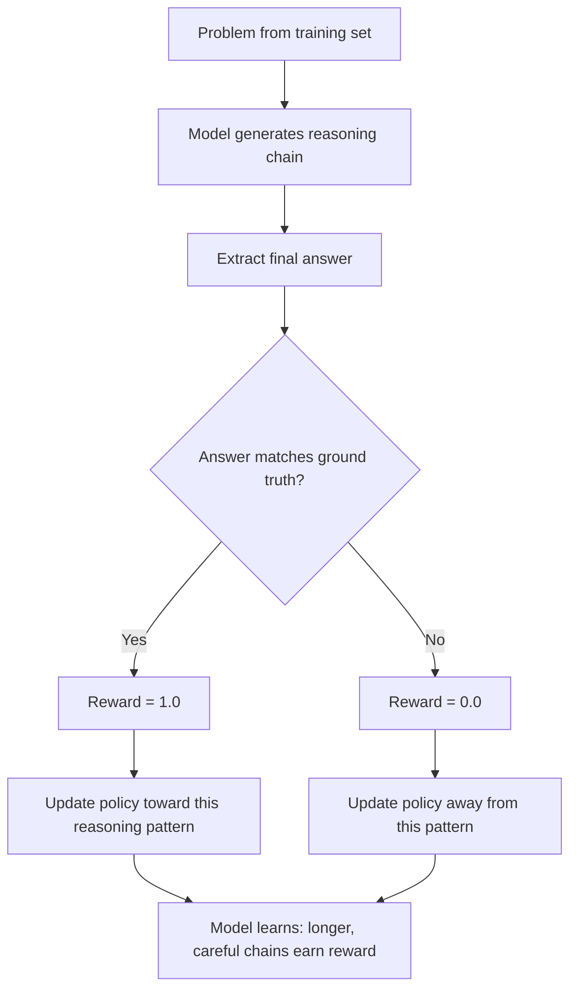
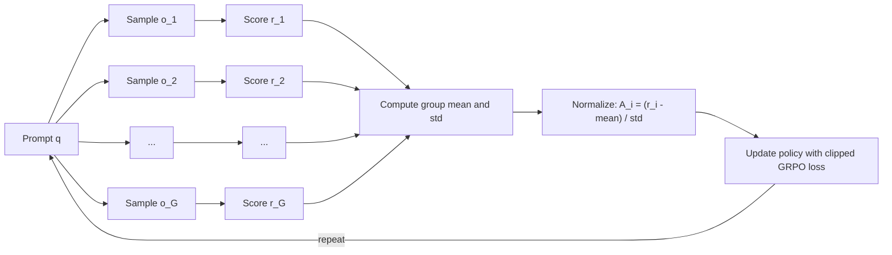
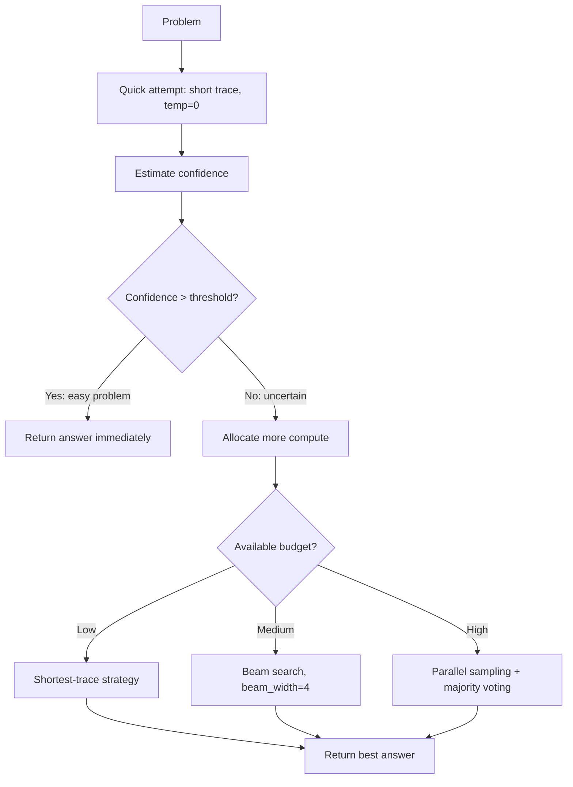
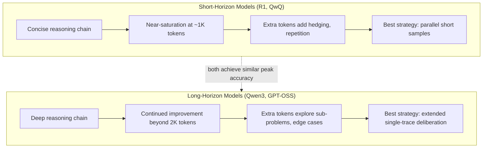

# Chapter 23: Reasoning Models and Test-Time Compute

> **Lead paragraph.** For most of LLM history, making a model reason better meant writing a cleverer prompt. You added "think step by step" and hoped the model cooperated. In 2024, OpenAI flipped the equation: instead of prompting for reasoning, they trained for it. The model learned that long chains of logic earn reward, and it discovered verification, backtracking, and reflection on its own. This chapter traces the reasoning model revolution -- from o1's RL-trained chains through DeepSeek-R1's spontaneous emergence to the APIs that let you dial reasoning effort up or down -- and shows you how to allocate test-time compute the same way you once allocated training compute.

---

## 1. The Reasoning Model Revolution

The year before reasoning models, chain-of-thought was a prompt engineering trick. You wrote "Let's think step by step" and the model produced intermediate reasoning tokens. The technique worked because the model had seen reasoning patterns in its training data, but the reasoning was shallow -- the model followed the template without genuine deliberation. It did not verify its own steps, catch contradictions, or explore alternative paths.

Reasoning models changed this by making reasoning a learned behavior rather than an elicited one.

### 1.1 o1: The First Reasoning Model

In September 2024, OpenAI released o1, a model trained with reinforcement learning to produce long chains of reasoning before answering. The training methodology was simple in concept: give the model problems with verifiable answers (math problems, coding tasks, logic puzzles) and reward it for getting the right answer. The model discovers that longer reasoning chains lead to higher accuracy, so it learns to produce them.

The key insight is that verifiable domains provide an automatic reward signal. Given a math problem, you can check whether the final answer is correct. Given a coding task, you can run unit tests. No human labeling of reasoning quality is required -- the outcome alone is sufficient. This is the core of RL with Verifiable Rewards.

The o1 release showed something surprising: scaling reasoning time at inference produced gains comparable to scaling model size at training. A smaller model thinking longer could match or exceed a larger model thinking once. This insight -- that test-time compute is the new training-time compute -- reshaped the entire field.

<figure>

<svg width="100%" viewBox="0 0 800 250" xmlns="http://www.w3.org/2000/svg">
  <defs>
    <linearGradient id="timelineGrad23" x1="0" y1="0" x2="1" y2="0">
      <stop offset="0%" stop-color="#534AB7"/>
      <stop offset="100%" stop-color="#185FA5"/>
    </linearGradient>
  </defs>
  <!-- Timeline line -->
  <line x1="60" y1="120" x2="760" y2="120" stroke="url(#timelineGrad23)" stroke-width="4"/>
  <!-- Event markers: Sep 2024 -->
  <circle cx="130" cy="120" r="10" fill="#534AB7"/>
  <text x="130" y="95" font-family="system-ui, sans-serif" font-size="13" fill="#534AB7" text-anchor="middle" font-weight="bold">Sep 2024</text>
  <text x="130" y="155" font-family="system-ui, sans-serif" font-size="13" fill="#222" text-anchor="middle">OpenAI o1</text>
  <text x="130" y="172" font-family="system-ui, sans-serif" font-size="11" fill="#666" text-anchor="middle">RL-trained reasoning</text>

  <!-- Jan 2025 -->
  <circle cx="280" cy="120" r="10" fill="#0F6E56"/>
  <text x="280" y="95" font-family="system-ui, sans-serif" font-size="13" fill="#0F6E56" text-anchor="middle" font-weight="bold">Jan 2025</text>
  <text x="280" y="155" font-family="system-ui, sans-serif" font-size="13" fill="#222" text-anchor="middle">DeepSeek-R1</text>
  <text x="280" y="172" font-family="system-ui, sans-serif" font-size="11" fill="#666" text-anchor="middle">Pure RL emergence</text>

  <!-- Mar 2025 -->
  <circle cx="430" cy="120" r="10" fill="#993C1D"/>
  <text x="430" y="95" font-family="system-ui, sans-serif" font-size="13" fill="#993C1D" text-anchor="middle" font-weight="bold">Mar 2025</text>
  <text x="430" y="155" font-family="system-ui, sans-serif" font-size="13" fill="#222" text-anchor="middle">QwQ-32B</text>
  <text x="430" y="172" font-family="system-ui, sans-serif" font-size="11" fill="#666" text-anchor="middle">Compact open reasoning</text>

  <!-- Apr 2025 -->
  <circle cx="590" cy="120" r="10" fill="#534AB7"/>
  <circle cx="640" cy="120" r="10" fill="#185FA5"/>
  <text x="615" y="95" font-family="system-ui, sans-serif" font-size="13" fill="#185FA5" text-anchor="middle" font-weight="bold">Apr 2025</text>
  <text x="615" y="155" font-family="system-ui, sans-serif" font-size="13" fill="#222" text-anchor="middle">o3/o4-mini + Gemini 2.5 FT</text>
  <text x="615" y="172" font-family="system-ui, sans-serif" font-size="11" fill="#666" text-anchor="middle">Tool use + thinking budget</text>
</svg>

<figcaption>Figure 23.1 — Timeline of the reasoning model revolution, September 2024 to April 2025. Each release added a new dimension: o1 brought RL-trained chains, R1 showed pure RL emergence, QwQ proved compact models can reason, and o3/Gemini 2.5 added tool use and controllable budgets.</figcaption>
</figure>

### 1.2 DeepSeek-R1: Pure RL Emergence

In January 2025, DeepSeek released R1, and the result was stunning. Unlike o1, DeepSeek-R1-Zero -- the pure RL variant -- received no supervised fine-tuning on reasoning traces. The training process was just RL on math problems with rule-based rewards (correct final answer format, correct numerical result). The model spontaneously developed behaviors that researchers had spent years engineering into prompts: it learned to double-check its work, to backtrack when it detected a contradiction, and to explore alternative approaches when stuck.

This emergence of **reflection** and **self-verification** through pure reinforcement learning is arguably the most important empirical finding in the reasoning model literature. The model was not told to verify. It was not shown examples of verification. It simply discovered that checking intermediate results improved the probability of receiving reward, and so verification pathways were reinforced. The behavior emerged because it was useful, not because it was programmed.

DeepSeek-R1 also introduced **Group Relative Policy Optimization (GRPO)**, a training algorithm that replaces PPO's critic network with a group-relative baseline. Instead of learning a value function to estimate advantage, GRPO samples multiple outputs per prompt, scores them all, and uses the group mean as the baseline. This eliminates the need for a value model of comparable size to the policy, roughly halving training memory requirements. We examine GRPO mechanics in Section 2.2.

The R1 paper is open-weight, meaning anyone can download the weights and run the model. Combined with the detailed training methodology, this made reasoning model training accessible to labs without billion-dollar budgets.

### 1.3 QwQ-32B: Compact Reasoning

In March 2025, Qwen released QwQ-32B, a 32-billion-parameter reasoning model trained with RL and equipped with native tool-use tokens. QwQ demonstrates that reasoning capability is not reserved for the largest models. A 32B model, properly trained, can reason competitively with models orders of magnitude larger from just a year prior.

QwQ's architecture includes tokens specifically designated for tool interaction within the reasoning chain. The model can think, call a tool mid-reasoning, incorporate the result, and continue its chain. This blurs the line between "reasoning" and "acting" -- the model reasons *through* tool use rather than treating tools as external add-ons.

> **Key Insight**
>
> Compact reasoning models (20-40B parameters) achieve roughly the reasoning quality of 2023's largest dense models on structured tasks. The implication: reasoning capability is more about training methodology than parameter count. The frontier is moving from "how big is your model?" to "how well did you train it to think?"

### 1.4 o3/o4-mini and Gemini 2.5 Flash Thinking

By April 2025, two more capabilities arrived. OpenAI's o3 and o4-mini combined reasoning with full tool use, capable of chaining 600+ consecutive tool calls within a single reasoning trace. The model could search the web, read results, follow links, execute code, inspect the output, and continue reasoning -- all as part of one coherent chain of thought.

Gemini 2.5 Flash Thinking introduced the `thinking_budget` parameter, giving developers explicit control over reasoning compute. Pass `thinking_budget=1024` for quick answers, `thinking_budget=8192` for thorough analysis. This was the first mainstream API to expose reasoning time as a tunable dial, making the "reasoning as compute" abstraction concrete in production code.

The table below summarizes the reasoning model landscape.

| Model | Release | Key Innovation | Open Weights | Tool Use |
|-------|---------|----------------|-------------|----------|
| o1 | Sep 2024 | RL-trained reasoning chains | No | No |
| DeepSeek-R1 | Jan 2025 | Pure RL emergence, GRPO | Yes | No |
| QwQ-32B | Mar 2025 | Compact 32B, native tool tokens | Yes | Yes |
| o3 / o4-mini | Apr 2025 | 600+ tool call chains | No | Yes |
| Gemini 2.5 Flash Thinking | Apr 2025 | Controllable thinking_budget | No | Yes |

---

## 2. Training Reasoning Models

### 2.1 RL with Verifiable Rewards (RLVR)

The core idea behind training reasoning models is deceptively simple: pick a domain where correctness is automatically checkable, generate rollouts, and reward correct outcomes. This is RL with Verifiable Rewards.

Verifiable domains fall into three categories. **Mathematics**: problems with unambiguous numeric or symbolic answers. Automated checkers compare the model's final answer to the ground truth. **Code**: tasks where unit tests define correctness. The model writes a function; the test suite passes or fails. **Logic and reasoning**: puzzles, formal verification, theorem proving -- any domain with a mechanical correctness criterion.

The reward function is binary (correct or not), sparse (only at the final output), and cheap to compute. This is the opposite of RLHF, which requires expensive human preference labels. RLVR scales because the reward signal is free.

The training loop generates multiple reasoning traces per problem. Some traces arrive at the correct answer and receive reward; others fail and receive none. Over thousands of iterations, the model learns which reasoning patterns correlate with success.

<figure>



<figcaption>Figure 23.2 — The RLVR training loop. Reward comes only from the final answer, not from intermediate steps. The model must discover which reasoning strategies produce correct outcomes.</figcaption>
</figure>

### 2.2 GRPO: Group Relative Policy Optimization

GRPO is DeepSeek's answer to the question: how do you compute advantage without a critic? PPO requires a value network roughly the size of the policy to estimate the advantage function. For large language models, this doubles memory requirements during training. GRPO eliminates the critic entirely by using within-group comparisons.

<figure>



<figcaption>Figure 23.3 — GRPO mechanism. For each prompt, G outputs are sampled and scored. The group statistics provide the baseline for advantage computation, eliminating the need for a separate critic network.</figcaption>
</figure>

The algorithm samples $G$ outputs $\{o_1, o_2, \ldots, o_G\}$ for each prompt. Each output receives a scalar reward $r_i$. The advantage for output $i$ is computed as its reward normalized against the group:

$$A_i = \frac{r_i - \text{mean}(\{r_1, \ldots, r_G\})}{\text{std}(\{r_1, \ldots, r_G\})}$$

where $\text{mean}(\cdot)$ and $\text{std}(\cdot)$ are the group mean and standard deviation. The term $r_i - \text{mean}(\cdot)$ (scalar subtraction) measures how much better output $i$ is than the average output for this prompt. Group size $G$ is typically 4 to 64.

The policy update clips the probability ratio just as PPO does, preventing destructive large updates. The clamped objective is:

$$\mathcal{L}_{\text{GRPO}} = \mathbb{E}\left[\min\!\left(\frac{\pi_\theta(o \mid q)}{\pi_{\theta_{\text{old}}}(o \mid q)} A,\; \text{clip}\!\left(\frac{\pi_\theta(o \mid q)}{\pi_{\theta_{\text{old}}}(o \mid q)}, 1-\epsilon, 1+\epsilon\right) A\right)\right]$$

where $\pi_\theta$ is the current policy, $\pi_{\theta_{\text{old}}}$ is the frozen policy from the previous step, $q$ is the prompt, and $\epsilon$ is the clipping threshold (typically 0.2). The ratio $\frac{\pi_\theta(o \mid q)}{\pi_{\theta_{\text{old}}}(o \mid q)}$ (scalar division of token-level probabilities) is then multiplied by the advantage $A$ (scalar multiplication of the ratio and the advantage), measuring how much we want to reinforce or suppress output $o$ relative to the group baseline.

Because the advantage is group-relative, GRPO requires that the reward function reliably distinguishes good outputs from bad ones within a batch. For verifiable domains, this condition is satisfied: correct answers get reward 1.0, incorrect get 0.0, and the group mean sits in between.

> **Implementation Note**
>
> GRPO's memory advantage is significant. A critic network for a 70B model requires roughly 70B additional parameters. By replacing the critic with group-relative normalization, GRPO halves the GPU memory footprint. This is why most open-source reasoning model projects have adopted GRPO over PPO.

### 2.3 Process Reward Models

Outcome-based rewards work, but they provide no signal about *where* a reasoning chain went wrong. A 20-step chain that fails at step 17 gets the same zero reward as a chain that fails at step 2. The model must discover error locations through trial and error, which is sample-inefficient.

A **process reward model** (PRM) scores each step in a reasoning chain, providing dense feedback. Steps that represent genuine progress (correct intermediate calculations, valid logical deductions) receive positive scores. Steps containing errors or dead ends receive negative scores.

Training a PRM requires step-level labels, which are expensive to produce at scale. Chapter 15 covered PRM architectures in detail, including PRIME-style implicit process rewards that derive step-level signals from outcome labels alone. For reasoning model training, PRMs serve as an optional upgrade over pure outcome rewards: they accelerate training but add complexity.

### 2.4 Synthetic Data Generation

Reasoning training data is scarce relative to general text. Math competition problems, formal verification tasks, and hand-curated coding challenges number in the thousands, not billions. To scale RLVR, labs generate synthetic reasoning data.

The dominant approach is rejection sampling from a strong model. You prompt a frontier reasoning model with diverse problems, collect the reasoning traces, and keep only the traces that arrive at correct answers. These become the training prompts for the next generation. The process is iterative: train with synthetic data, produce a marginally stronger model, use it to generate better synthetic data, repeat.

DeepSeek-R1 used a two-stage process. Stage 1: RL on the base model (DeepSeek-R1-Zero), producing checkpoints with emergent reasoning. Stage 2: rejection sampling from these checkpoints to collect high-quality traces, then SFT on the collected data before a final RL stage. This hybrid approach combines the flexibility of RL exploration with the stability of supervised fine-tuning.

---

## 3. Test-Time Compute Scaling

Once a model can reason, the natural next question is: how much reasoning should it do? The answer depends on the problem, the budget, and the strategy.

### 3.1 The Four Pillars

Snell et al. (2024) formalized test-time compute scaling around four complementary strategies. Their key finding: no single strategy dominates across all compute budgets. The optimal choice depends on how much compute you are willing to spend and how strong your verifier is.

<figure>

<svg width="100%" viewBox="0 0 800 420" xmlns="http://www.w3.org/2000/svg">
  <!-- Four quadrant boxes -->
  <!-- Q1: Parallel Sampling -->
  <rect x="20" y="20" width="365" height="175" rx="8" fill="#534AB7" opacity="0.1" stroke="#534AB7" stroke-width="2"/>
  <text x="202" y="50" font-family="system-ui, sans-serif" font-size="16" fill="#534AB7" text-anchor="middle" font-weight="bold">Parallel Sampling</text>
  <text x="40" y="75" font-family="system-ui, sans-serif" font-size="12" fill="#444">Generate N independent reasoning traces</text>
  <text x="40" y="95" font-family="system-ui, sans-serif" font-size="12" fill="#444">Score each trace with a verifier</text>
  <text x="40" y="115" font-family="system-ui, sans-serif" font-size="12" fill="#444">Return best-scoring trace</text>
  <text x="40" y="140" font-family="system-ui, sans-serif" font-size="12" fill="#666">Best when: strong verifier, high budget</text>
  <text x="40" y="160" font-family="system-ui, sans-serif" font-size="12" fill="#666">Examples: Best-of-N, majority voting</text>

  <!-- Q2: Sequential Revision -->
  <rect x="415" y="20" width="365" height="175" rx="8" fill="#0F6E56" opacity="0.1" stroke="#0F6E56" stroke-width="2"/>
  <text x="597" y="50" font-family="system-ui, sans-serif" font-size="16" fill="#0F6E56" text-anchor="middle" font-weight="bold">Sequential Revision</text>
  <text x="435" y="75" font-family="system-ui, sans-serif" font-size="12" fill="#444">Generate one trace, identify errors</text>
  <text x="435" y="95" font-family="system-ui, sans-serif" font-size="12" fill="#444">Revise the trace to fix errors</text>
  <text x="435" y="115" font-family="system-ui, sans-serif" font-size="12" fill="#444">Repeat until verification passes</text>
  <text x="435" y="140" font-family="system-ui, sans-serif" font-size="12" fill="#666">Best when: errors are fixable, medium budget</text>
  <text x="435" y="160" font-family="system-ui, sans-serif" font-size="12" fill="#666">Examples: Reflexion, Self-Refine</text>

  <!-- Q3: Verifiers -->
  <rect x="20" y="225" width="365" height="175" rx="8" fill="#993C1D" opacity="0.1" stroke="#993C1D" stroke-width="2"/>
  <text x="202" y="255" font-family="system-ui, sans-serif" font-size="16" fill="#993C1D" text-anchor="middle" font-weight="bold">Verifiers</text>
  <text x="40" y="280" font-family="system-ui, sans-serif" font-size="12" fill="#444">ORM: score final output correctness</text>
  <text x="40" y="300" font-family="system-ui, sans-serif" font-size="12" fill="#444">PRM: score individual reasoning steps</text>
  <text x="40" y="320" font-family="system-ui, sans-serif" font-size="12" fill="#444">Learned verifiers generalize better than rules</text>
  <text x="40" y="345" font-family="system-ui, sans-serif" font-size="12" fill="#666">Best when: task has clear quality signal</text>
  <text x="40" y="365" font-family="system-ui, sans-serif" font-size="12" fill="#666">Key metric: verifier calibration quality</text>

  <!-- Q4: Diverse Rollouts -->
  <rect x="415" y="225" width="365" height="175" rx="8" fill="#854F0B" opacity="0.1" stroke="#854F0B" stroke-width="2"/>
  <text x="597" y="255" font-family="system-ui, sans-serif" font-size="16" fill="#854F0B" text-anchor="middle" font-weight="bold">Diversifying Rollouts</text>
  <text x="435" y="280" font-family="system-ui, sans-serif" font-size="12" fill="#444">Vary temperature, prompt phrasing, seed</text>
  <text x="435" y="300" font-family="system-ui, sans-serif" font-size="12" fill="#444">Force exploration of different approaches</text>
  <text x="435" y="320" font-family="system-ui, sans-serif" font-size="12" fill="#444">Independent errors improve voting accuracy</text>
  <text x="435" y="345" font-family="system-ui, sans-serif" font-size="12" fill="#666">Best when: combined with parallel sampling</text>
  <text x="435" y="365" font-family="system-ui, sans-serif" font-size="12" fill="#666">Technique: temperature annealing, prompt variation</text>
</svg>

<figcaption>Figure 23.4 — The four pillars of test-time compute scaling. Parallel sampling and sequential revision are the two generation strategies. Verifiers provide the quality signal. Diverse rollouts ensure the sampled traces cover different approaches rather than repeating the same mistake.</figcaption>
</figure>

The interaction between these pillars determines total effectiveness. Parallel sampling with a weak verifier wastes compute on confident wrong answers. Sequential revision without diversity gets stuck in local reasoning ruts. The art of test-time scaling is combining these pillars according to the problem structure and available compute.

A simplified implementation of parallel sampling with a verifier shows the pattern in code.

```python
import torch
import torch.nn.functional as F

def parallel_sample_and_verify(
    model,                # a reasoning model (e.g., loaded from DeepSeek-R1 weights)
    tokenizer,
    prompt: str,
    num_samples: int = 8,
    verifier_threshold: float = 0.9,
    temperature: float = 0.7,
):
    """
    Generate N independent reasoning traces, score with a verifier,
    and return the best-scoring trace.
    """
    inputs = tokenizer(prompt, return_tensors="pt")
    input_ids = inputs.input_ids  # (1, seq_len)

    # Expand to N copies for batched generation
    input_ids = input_ids.expand(num_samples, -1)  # (num_samples, seq_len)

    # Generate N diverse reasoning traces
    with torch.no_grad():
        outputs = model.generate(
            input_ids,
            max_new_tokens=2048,
            temperature=temperature,
            do_sample=True,
            pad_token_id=tokenizer.pad_token_id,
        )  # (num_samples, gen_seq_len)

    # Decode each trace
    traces = [tokenizer.decode(o, skip_special_tokens=True) for o in outputs]

    # Score each trace with a learned verifier (PRM or ORM)
    scores = []
    for trace in traces:
        score = verifier_score(model, tokenizer, prompt, trace)
        scores.append(score)

    # Select the best trace (or use majority voting for categorical answers)
    best_idx = int(torch.argmax(torch.tensor(scores)))
    return traces[best_idx], scores[best_idx]


def verifier_score(model, tokenizer, prompt, trace):
    """Ask the model to self-verify: does this solution make sense?"""
    verification_prompt = (
        f"Problem: {prompt}\n\n"
        f"Solution: {trace}\n\n"
        f"Rate the correctness of this solution on a scale of 0-10. Answer with only the number."
    )
    inputs = tokenizer(verification_prompt, return_tensors="pt")
    with torch.no_grad():
        output = model.generate(
            inputs.input_ids,  # (1, prompt_seq_len)
            max_new_tokens=5,
            do_sample=False,
        )
    score_text = tokenizer.decode(output[0], skip_special_tokens=True)
    try:
        return float(score_text.strip()) / 10.0
    except ValueError:
        return 0.0
```

Each call to `model.generate` runs independently, so this pattern parallelizes naturally across GPUs. The temperature parameter controls diversity: higher values produce more distinct reasoning approaches at the cost of occasional nonsense.

### 3.2 Adaptive Compute Allocation

Not all problems need the same amount of thinking. A simple arithmetic question requires one step; a competition math problem requires deep chains. Allocating a fixed compute budget to every problem wastes resources on easy cases and starves hard ones.

Adaptive compute allocation decides how much thinking to spend per problem based on difficulty estimates. The high-level strategy:

1. Attempt the problem with a minimal reasoning budget (short trace, single sample).
2. Estimate confidence from the output -- using token log-probabilities, self-consistency across a few rapid samples, or a lightweight verifier.
3. If confidence is above a threshold, return the answer. If below, allocate more compute: increase the reasoning budget and retry.

This is the core idea behind **Confidence-Aware Test-Time Scaling (CATTS)**. The model uses vote-derived uncertainty to decide when reasoning is done. Low uncertainty triggers early termination; high uncertainty triggers additional sampling or a call to a stronger verifier. On challenging benchmarks, CATTS achieves comparable accuracy to uniform high-budget allocation while consuming 2.3x fewer tokens.

<figure>



<figcaption>Figure 23.5 — Adaptive compute allocation decision flow. Easy problems exit early. Harder problems receive progressively more expensive reasoning strategies based on available budget.</figcaption>
</figure>

Confidence estimation is the critical component. The simplest approach uses the softmax probability of the highest-scoring token at the answer position. More sophisticated methods run a few independent short rollouts and check whether they agree on the answer. When two out of three quick samples produce the same result, confidence is high. When all three diverge, more reasoning is warranted.

### 3.3 DORA: Direction-Oriented Resource Allocation

While CATTS decides *how much* compute to allocate, **Direction-Oriented Resource Allocation (DORA)** decides *which type* of compute to use. Not all test-time compute is equal. Given a fixed budget, should you generate more parallel samples or make each sample longer?

DORA frames this as a constrained optimization problem. Given a compute budget $B$ (measured in total generated tokens), find the allocation that maximizes expected accuracy. The allocation controls two dimensions: number of parallel samples ($N$) and reasoning length per sample ($L$), with the constraint that $N \times L \leq B$ (scalar multiplication of count and length).

The optimal allocation depends on:

- **Problem difficulty**: Hard problems benefit more from longer individual chains than from more parallel short chains.
- **Model horizon**: Short-horizon models saturate quickly on chain length; long-horizon models keep improving with more tokens per sample.
- **Verifier quality**: Strong verifiers make parallel sampling more attractive because the best-of-N selection reliably picks the best trace.

DORA's empirical finding is that the optimal strategy shifts from "few long traces" at low budgets to "many medium traces" at high budgets. The crossover point depends on the model's reasoning saturation curve -- the relationship between chain length and accuracy.

### 3.4 Constrained Policy Optimization

Test-time compute has a cost. For production systems, you need to maximize accuracy subject to a latency or token budget constraint. A direct approach parameterizes the reasoning policy as a function of the compute budget and optimizes:

$$\max_{\pi} \; \mathbb{E}_{q \sim \mathcal{D}}\!\left[\text{Accuracy}\!\left(\pi(q, B)\right)\right] \quad \text{s.t.} \quad \text{Tokens}\!\left(\pi(q, B)\right) \leq B$$

where the expectation is taken over a distribution of problems $q \sim \mathcal{D}$, and $\pi(q, B)$ denotes the policy generating a reasoning trace under budget $B$. The constraint enforces that the policy does not exceed the per-problem token allowance.

In practice, this is implemented through budget-aware decoding: the model's generation loop tracks remaining token budget and adjusts beam width, sampling temperature, and early-stopping thresholds accordingly. The model learns during RL training to produce reasoning chains that fit within typical budget ranges, so budget-aware decoding mainly handles outlier problems that the model would otherwise over-think.

The following code sketches budget-aware generation with adaptive early stopping.

```python
def budget_aware_generate(model, tokenizer, prompt, token_budget=4096):
    """
    Generate a reasoning trace subject to a token budget.
    Uses temperature annealing: start diverse, narrow toward the end.
    """
    inputs = tokenizer(prompt, return_tensors="pt")
    input_ids = inputs.input_ids  # (1, prompt_len)
    past_tokens = input_ids
    generated_tokens = 0
    max_tokens = min(token_budget, 8192)  # (scalar: cap at model max)

    # Confidence tracking for early stopping
    last_three_confidence = []

    for step in range(max_tokens // 32):  # generate in chunks
        remaining = max_tokens - generated_tokens
        tokens_this_step = min(32, remaining)

        # Temperature annealing: cooler as we near budget limit
        progress = generated_tokens / max_tokens  # (scalar fraction)
        temperature = max(0.2, 0.8 * (1.0 - progress))

        with torch.no_grad():
            outputs = model.generate(
                past_tokens,
                max_new_tokens=tokens_this_step,
                temperature=temperature,
                do_sample=True,
                pad_token_id=tokenizer.pad_token_id,
            )

        new_tokens = outputs[:, past_tokens.shape[1]:]  # (1, new_tokens)
        past_tokens = outputs
        generated_tokens += new_tokens.shape[1]

        # Decode and check for final answer marker
        new_text = tokenizer.decode(new_tokens[0], skip_special_tokens=True)
        if "####" in new_text or "\\boxed{" in new_text:
            break

        if generated_tokens >= max_tokens:
            break

    return tokenizer.decode(past_tokens[0], skip_special_tokens=True)
```

The temperature annealing strategy produces broad exploration early in the reasoning chain and precise, focused generation near the end. The progress variable, computed as the fraction of budget consumed, drives the temperature decay linearly from 0.8 to 0.2.

---

## 4. Model Horizons

### 4.1 Short-Horizon vs. Long-Horizon Models

Not all reasoning models reason the same way. A useful distinction has emerged between short-horizon and long-horizon reasoning models, based on how they respond to extended deliberation budgets.

**Short-horizon models** -- including DeepSeek-R1 and QwQ-32B -- produce concise, efficient reasoning chains. Given 500 tokens to reason, they use roughly 500 tokens. Pushing them to 2,000 tokens yields diminishing returns: the extra tokens add hedging, repetition, and restated assumptions rather than genuinely new reasoning. These models benefit most from short-trace strategies and parallel sampling rather than extended single-trace deliberation.

**Long-horizon models** -- including Qwen3 and GPT-OSS -- sustain meaningful reasoning across thousands of tokens. Given 500 tokens, they think; given 2,000 tokens, they think deeper. The extra tokens are spent on exploring sub-problems, considering edge cases, and cross-checking conclusions from multiple angles. These models benefit from extended deliberation budgets and beam search over long traces rather than parallel short samples.

The horizon distinction is not about model quality. A short-horizon model can outperform a long-horizon model at equivalent compute budgets, particularly when the task rewards concision. The distinction is about *how the model uses additional compute* -- as fuel for broader exploration or for deeper analysis.

<figure>



<figcaption>Figure 23.6 — Short-horizon vs. long-horizon reasoning models. The distinction is not about accuracy ceiling but about how each model type converts additional tokens into reasoning quality. Short-horizon models saturate quickly; long-horizon models sustain meaningful reasoning across extended budgets.</figcaption>
</figure>

### 4.2 Decision Rules by Budget

Given the horizon distinction, the optimal test-time strategy follows a simple decision framework keyed to available compute budget.

| Budget Level | Strategy | Rationale |
|-------------|----------|-----------|
| Low | Shortest trace, single sample | Even a quick reasoning pass beats no reasoning. Use short-horizon models. |
| Medium | Beam search (beam_width=4-8) | Explores alternative reasoning branches with moderate compute. Works for both horizon types. |
| High | Parallel sampling + majority voting (16-64 samples) | Diversity across independent traces catches errors that any single trace misses. Best with long-horizon models. |

For low-budget settings (under 1,024 tokens of reasoning), the shortest-trace strategy with a short-horizon model dominates. The model produces one concise chain and stops. This is the default for latency-sensitive applications.

For medium budgets (1,024-4,096 tokens), beam search over reasoning alternatives outperforms both single-trace and full parallel sampling. The beam maintains multiple partial reasoning paths and prunes the least promising ones at each step. This balances exploration against compute cost.

For high budgets (4,096+ tokens), majority voting over parallel samples provides the best accuracy per token. The key requirement is diversity: if all 64 samples follow the same reasoning approach, voting provides no benefit. Temperature, prompt variation, and model-checkpoint diversity all help ensure independent error patterns.

> **Warning**
>
> Majority voting only improves accuracy when individual sample errors are uncorrelated. If the model consistently makes the same mistake, 64 votes for the wrong answer are no better than 1. Always verify that your sampling strategy produces genuinely diverse reasoning approaches before scaling up the sample count.

### 4.3 The Compute-Reliability Frontier

The practical question for most developers is: given my latency and cost constraints, which reasoning strategy should I use? The answer is a frontier comparison.

The table below characterizes the trade-off space for a typical reasoning workload.

| Strategy | Approx. Tokens | Latency (relative) | Accuracy Gain | Best Horizon |
|----------|---------------|-------------------|---------------|-------------|
| Single pass (no reasoning) | 200-500 | 1x (baseline) | +0% | N/A |
| CoT prompting | 500-1,000 | 1.5x | +10-15% | N/A |
| Short-horizon reasoning model | 500-1,500 | 1.5-2x | +15-25% | Short |
| Beam search (k=8) | 2,000-6,000 | 3-5x | +25-35% | Both |
| Best-of-N (N=16) | 8,000-24,000 | 8-12x | +35-45% | Long |
| Majority voting (N=64) | 32,000-96,000 | 30-50x | +45-55% | Long |

These numbers are approximate and task-dependent, but the pattern is consistent across benchmarks: each doubling of test-time compute buys roughly 5-10% additional accuracy, with diminishing returns after the first few doublings. The practical sweet spot for most applications is in the beam search to best-of-N range, where accuracy gains remain substantial and latency remains tolerable.

---

## Summary

- Reasoning models internalize chain-of-thought through RL on verifiable domains (math, code, logic). The model learns that longer, more careful reasoning earns reward.
- DeepSeek-R1 demonstrated pure RL emergence: with no supervised reasoning data, the model spontaneously learned to verify, backtrack, and reflect.
- GRPO replaces PPO's critic with group-relative advantage normalization, halving training memory requirements and making reasoning model training accessible to smaller labs.
- Test-time compute scaling has four pillars: parallel sampling, sequential revision, verifiers, and diversified rollouts. The optimal combination depends on budget and verifier quality.
- Adaptive compute allocation avoids wasting tokens on easy problems. CATTS uses confidence estimation to decide when to stop versus when to allocate more reasoning.
- Short-horizon models (R1, QwQ) produce efficient chains and benefit from parallel sampling. Long-horizon models (Qwen3, GPT-OSS) sustain deep reasoning and benefit from extended single-trace deliberation.
- The practical decision rule: shortest trace for low budgets, beam search for medium, majority voting for high.

---

## Further Reading

- [Learning to Reason with LLMs](https://openai.com/index/learning-to-reason-with-llms/) -- OpenAI, 2024. The o1 release blog post introducing RL-trained reasoning.
- [DeepSeek-R1: Incentivizing Reasoning Capability in LLMs via Reinforcement Learning](https://arxiv.org/abs/2501.12948) -- DeepSeek-AI, 2025. Pure RL emergence, GRPO algorithm, and open-weight release.
- [QwQ-32B](https://huggingface.co/Qwen/QwQ-32B) -- Qwen, 2025. Compact open-weight reasoning model with native tool-use tokens.
- [Scaling LLM Test-Time Compute Optimally](https://arxiv.org/abs/2408.03314) -- Snell et al., 2024. Formal analysis of the four pillars and optimal strategy selection by budget.
- [Gemini 2.5 Flash Thinking](https://deepmind.google/models/gemini/) -- Google DeepMind, 2025. Controllable thinking_budget parameter for reasoning models.

---
