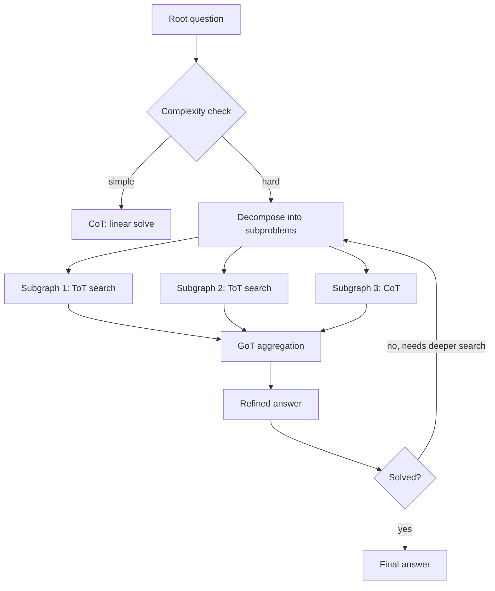
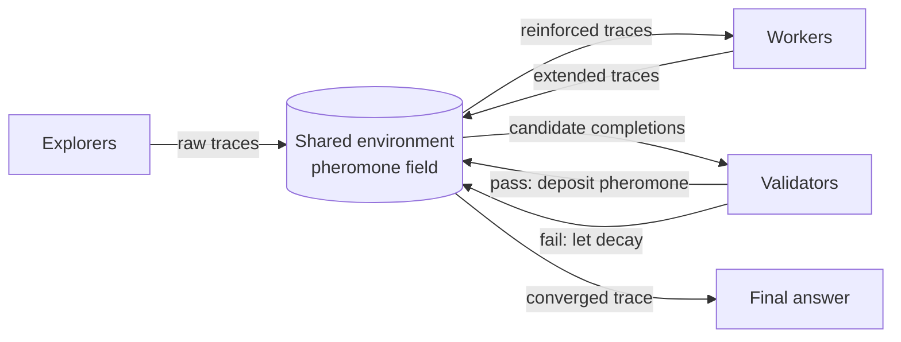
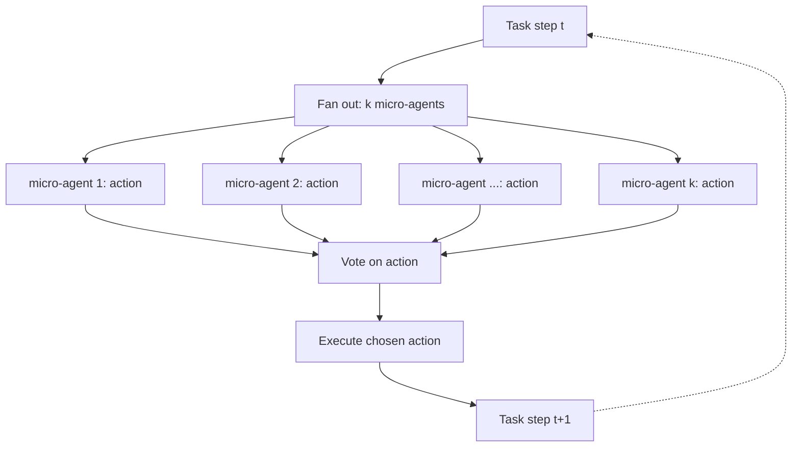

# Chapter 24: Advanced Reasoning — Graph, Swarm, and Consensus

> **Lead paragraph.** A single reasoning trace is a tightrope walk: one wrong step and the whole chain falls. Tree of Thoughts widens the path into a search, but the search still lives inside one model's head. What happens when a hard problem is not a path at all, but a web of interdependent subproblems, each worthy of its own search? And what happens when, instead of one reasoning process, you run a hundred in parallel and let them vote? This chapter crosses three frontiers — graph-structured reasoning, swarm intelligence, and formal consensus — and ends at a striking 2026 claim: the way to make agents reliable across a million steps is not to make one agent a million times better, but to use a million micro-agents that each do one step.

---

## 1. Beyond the Chain: Why Linear Reasoning Caps Out

Chapter 8 introduced chain-of-thought as a prompting trick; Chapter 9 promoted it to a tree; Chapter 23 internalized it inside the model through reinforcement learning. Every one of these advances keeps the same skeleton: one reasoning process, executing sequentially, accumulating state in a single context window.

This skeleton has a ceiling. Two failure modes recur across every benchmark we have examined so far.

**Error compounding.** Each reasoning step has some probability $p_{\text{err}}$ of going wrong. Under a generous independence assumption, the probability that a chain of $n$ steps stays correct all the way through is approximately $(1 - p_{\text{err}})^n$. Even a per-step error rate of 1% — excellent by today's standards — collapses to a 37% correct rate over 100 steps and to under 1% over 500 steps. Long-horizon reliability is not a smooth slope; it is a cliff.

**Structural mismatch.** Many hard problems are not chains. Solving a PhD-level science question (GPQA) often requires decomposing the question into independent sub-hypotheses, pursuing each, and reconciling contradictions. Forcing that structure into a left-to-right chain means the model must hold several half-finished threads in working memory, decide when to switch between them, and remember to reconcile — all without the explicit scaffolding a graph would provide.

The three families in this chapter attack these failures from different angles. **Graph reasoning** changes the data structure of thought from a line to a DAG, so subproblems can be solved in parallel and merged. **Swarm intelligence** changes the unit of reasoning from one model to a colony of role-specialized agents whose interactions are shaped by a shared environment. **Consensus** changes the decision rule from "trust the single output" to "sample many, agree, stop early." Each is a response to the realization that the bottleneck is no longer the model's per-step competence but the *organization* of the reasoning.

---

## 2. Adaptive Graph of Thoughts (AGoT)

### 2.1 From three patterns to one framework

The reference chapter makes a unifying observation worth pinning down precisely. Chain-of-Thought, Tree-of-Thoughts, and Graph-of-Thoughts are not three unrelated ideas. They are three points on one spectrum, distinguished by how much structure the reasoning is allowed to take on:

- **CoT** is a linear sequence of thoughts — a path.
- **ToT** is a branching search over thoughts — a tree.
- **GoT** is a directed graph where thoughts can have multiple parents and be refined in place — a DAG.

**Adaptive Graph of Thoughts (AGoT)** is the framework that contains all three. Its defining move is to *not* pick one of these structures up front. Instead, the reasoner inspects each subproblem as it is generated and decides, per subproblem, how much structure it deserves. Simple subproblems get a CoT line. Hard subproblems spawn a ToT subtree. When several subtrees produce partial answers that need merging, the framework performs a GoT aggregation operation.

<figure markdown="block">



<figcaption>Figure 24.2 — The AGoT router. Simple subproblems take the CoT path; hard subproblems decompose into subgraphs that may themselves recurse. Aggregation merges subgraph outputs back into a single refined answer.</figcaption>
</figure>

The diagram shows the recursive heart of AGoT: the complexity check can fire again on any subproblem, spawning *nested* subgraphs to arbitrary depth. This is what the reference calls dynamic DAG decomposition.

### 2.2 The aggregation operation

Where ToT prunes branches and keeps one, AGoT keeps many and combines them. The aggregation is the load-bearing piece. Concretely, if a subproblem spawned $k$ candidate thoughts $\{h_1, \dots, h_k\}$ each with an evaluator-assigned quality score $s_i$, the aggregated thought is a weighted combination

$$h^{*} = \sum_{i=1}^{k} w_i\, h_i, \qquad w_i = \frac{\exp(s_i / \tau)}{\sum_{j} \exp(s_j / \tau)}$$

where the $w_i\, h_i$ term is a scalar-times-vector product (the scalar weight $w_i$ scales the embedding or token distribution $h_i$) and $\tau$ is a temperature controlling how sharply the aggregation concentrates on the best candidate. A low $\tau$ behaves like hard selection (best-of-$k$); a high $\tau$ behaves like averaging. The score-normalized softmax is the same idea as attention reusing its weights — the aggregator is doing a soft lookup over its own candidate set.

### 2.3 What AGoT buys

The headline result: **+46.2% on GPQA without any training.** That number is worth pausing on. GPQA-Diamond is PhD-level science — questions where frontier models hover around 50–70% with standard prompting. A 46-point gain from a *prompting/search* method, with no weight updates, is large enough to be suspicious of, and the right response is the one this book keeps returning to: verify the evaluation conditions. AGoT's gain is reported on the standard GPQA-Diamond split under self-consistency conditions, but it spends considerably more compute than a single CoT pass. The honest framing is not "AGoT is 46% smarter" but "AGoT trades a large amount of additional test-time compute for a large accuracy gain on problems whose structure rewards decomposition." On questions that are genuinely sequential with no exploitable substructure, AGoT's overhead buys little.

> **Key Insight**
>
> AGoT's contribution is not a new reasoning operator. It is a *router*: pick the cheapest structure that fits each subproblem, and only escalate to a subgraph when the problem resists a chain. The gain comes from not paying tree-search cost on subproblems that a chain would have solved anyway.

### 2.4 AGoT in code

A minimal AGoT router needs three pieces: a complexity classifier, a recursive solver that can escalate, and an aggregator. We sketch the spine here; the full project at the end of the chapter fleshes out the consensus-style voting layer.

This snippet shows the recursive decomposition with per-subproblem escalation:

```python
from dataclasses import dataclass, field

@dataclass
class Thought:
    text: str
    score: float = 0.0
    children: list = field(default_factory=list)  # subgraph for hard subproblems

class AGoTNode:
    """One node in an adaptive reasoning graph."""

    def __init__(self, llm, max_depth=3, branch=3):
        self.llm = llm
        self.max_depth = max_depth
        self.branch = branch  # candidates per decomposition step

    def solve(self, question: str, depth: int = 0) -> Thought:
        if depth >= self.max_depth:
            return Thought(text=self.llm.complete([{"role": "user",
                                                     "content": question}]))
        # complexity check: ask the LLM whether to decompose
        verdict = self._is_complex(question)
        if not verdict:
            return Thought(text=self.llm.complete([{"role": "user",
                                                     "content": question}]))
        # hard case: decompose, recurse, aggregate
        subproblems = self._decompose(question)
        node = Thought(text="(aggregate)", score=0.0)
        for sp in subproblems:
            node.children.append(self.solve(sp, depth + 1))
        node.text = self._aggregate(node.children)
        return node

    def _is_complex(self, q: str) -> bool: ...   # LLM judge: simple vs hard
    def _decompose(self, q: str) -> list: ...     # return subproblems
    def _aggregate(self, children: list) -> str:  # weighted merge
        ...
```

The `children` list is what makes the structure a graph rather than a chain: each `Thought` can carry its own subgraph, and aggregation walks back up the tree.

---

## 3. Swarm Intelligence for Reasoning

### 3.1 From one reasoner to a colony

Graph reasoning still assumes a single central controller that decomposes and aggregates. **Swarm intelligence** drops that assumption. Instead of one reasoner orchestrating subproblems, a *swarm* of agents operates with no central leader, each following simple local rules, and useful global behavior emerges from their interactions.

The biological inspiration is ant colony optimization. Ants find short paths to food not by computing the shortest path but by depositing pheromone as they walk; shorter paths get traversed more often, accumulate more pheromone, and attract more ants, while longer paths lose pheromone to evaporation. The colony converges on good solutions without any ant knowing the global map. SwarmSys (October 2025) transplants this directly onto LLM agents.

### 3.2 SwarmSys: roles and pheromone

SwarmSys fixes three roles and a shared environment:

- **Explorer** — generates candidate reasoning traces, broadly and cheaply, without concern for correctness.
- **Worker** — takes a promising trace flagged by the environment and extends/refines it.
- **Validator** — checks a finished trace against ground truth or self-consistency and, if it passes, deposits pheromone.

The "pheromone" is a scalar field over the space of partial traces. When a Validator approves a trace, the trace and its prefixes receive a pheromone increment; periodically, every trace's pheromone decays multiplicatively. The result is that traces which repeatedly lead to validated completions get reinforced, while dead-end traces fade.

<figure markdown="block">



<figcaption>Figure 24.3 — SwarmSys roles and the shared pheromone environment. Validators deposit pheromone on approved traces; unvalidated traces decay. The environment biases future exploration toward productive neighborhoods.</figcaption>
</figure>

The reinforcement update is the cleanest piece of math in the framework. Let $\phi_t$ be the pheromone on a trace at time $t$, $\Delta \in [0, 1]$ the deposit amount on validation, and $\rho \in (0, 1)$ the decay rate. Then

$$\phi_{t+1} = \rho\, \phi_t + \Delta \cdot \mathbb{1}[\text{validated at } t]$$

where the $\rho\, \phi_t$ term is scalar-times-scalar decay (a constant shrink applied uniformly) and the indicator gates whether a deposit lands this round. Traces that go unvalidated for many rounds decay toward zero; traces that validate frequently saturate at $\Delta / (1 - \rho)$.

### 3.3 The pheromone trick vs. best-of-N

A skeptic should ask: how is this different from best-of-N sampling with a verifier, which Chapter 20 already covered? The difference is *state across rounds*. Best-of-N is memoryless: each round samples fresh and scores fresh. SwarmSys's pheromone field is a memory of which trace *prefixes* have historically paid off, so future exploration is biased toward neighborhoods that worked before. This is a form of adaptive sampling — it concentrates compute where the verifier has been historically happy, which on structured problem families (where good prefixes recur) beats flat best-of-N.

The cost is that the swarm is harder to debug. There is no single trajectory to inspect; behavior lives in the pheromone field, and a wrong validator can poison the colony by reinforcing bad traces. The framework inherits every problem of multi-agent systems (Chapter 27 onward): communication topology, role drift, and emergent misbehavior.

### 3.4 Society of HiveMind (SOHM)

SOHM pushes the analogy further by importing *evolutionary* dynamics. Where SwarmSys reinforces individual traces, SOHM treats agent strategies themselves as the evolving unit: strategies that produce validated answers reproduce and mutate; strategies that fail die out. This is closer to a genetic algorithm over prompts or agent configurations than to a single reasoning run. The pay-off is robustness to a changing task distribution — a colony that has evolved a repertoire of strategies can re-weight which one it uses as the task shifts, rather than needing a re-prompt.

---

## 4. Consensus and Agreement

### 4.1 The problem consensus solves

Both AGoT and SwarmSys still produce, at the end, *one* answer from *one* process (even if that process internally fanned out). A different question: what if you run $N$ independent reasoning processes on the same problem and let them *agree*? This is consensus, and it attacks error compounding head-on.

The argument is statistical. If each of $N$ independent reasoners is correct with probability $p > 0.5$, then under independence the majority vote is correct with probability

$$P_{\text{maj}} = \sum_{k=\lceil N/2 \rceil}^{N} \binom{N}{k} p^k (1-p)^{N-k}$$

which climbs toward 1 as $N$ grows. This is the Condorcet jury theorem, and it is the engine behind self-consistency (Chapter 8). The catch — and it is a big one — is the word *independent*. LLM samples from the same prompt are correlated: they share the same model weights, the same prompt, often the same wrong intuition. Correlated errors do not cancel under majority vote, so naive self-consistency saturates well below the theorem's promise.

**Aegean** (December 2025) is the first attempt to give stochastic LLM agents a *formal* consensus protocol, in the sense that distributed systems use the word: a set of rules under which one can prove the agents converge and bound how long it takes.

### 4.2 Stability Horizon and quorum early termination

Aegean's two mechanisms are designed to make consensus cheap enough to be worth running.

**Stability Horizon** is the answer to "how long do we wait before declaring consensus?" Running every agent to completion and then voting wastes the work of the agents that finished early and already agree. Aegean defines a *horizon*: a window over which the running vote tally is observed for stability. If the tally has not changed for $H$ consecutive samples — the distribution of answers has stabilized — the protocol declares convergence and stops. The horizon trades a small false-stability risk for a large latency saving.

**Quorum early termination** is the sharper tool. Rather than waiting for stability, the protocol stops the moment any answer crosses a quorum threshold $q$ (say, $2/3$ of the agents sampled so far). Once an answer has supermajority support, additional samples cannot overturn it, so they are wasted compute.

Together the protocol reports **1.2× to 20× latency reduction while holding accuracy within 2.5%** of full $N$-sample consensus. The 20× end of that range is the headline; treat it as the best case (easy problems where the first few samples already agree overwhelmingly). The 1.2× end is the realistic floor (hard problems where no answer reaches quorum and the protocol falls back to full sampling).

<figure>
<svg width="100%" viewBox="0 0 820 320" xmlns="http://www.w3.org/2000/svg">
  <rect x="0" y="0" width="820" height="320" fill="#ffffff"/>
  <!-- axes -->
  <line x1="60" y1="270" x2="760" y2="270" stroke="#333333" stroke-width="2"/>
  <line x1="60" y1="40" x2="60" y2="270" stroke="#333333" stroke-width="2"/>
  <text x="410" y="305" font-family="sans-serif" font-size="14" fill="#333333" text-anchor="middle">samples drawn (in chronological order)</text>
  <text x="22" y="155" font-family="sans-serif" font-size="14" fill="#333333" text-anchor="middle" transform="rotate(-90 22 155)">vote share</text>
  <!-- gridlines -->
  <line x1="60" y1="155" x2="760" y2="155" stroke="#dddddd" stroke-width="1" stroke-dasharray="4 4"/>
  <text x="52" y="160" font-family="sans-serif" font-size="12" fill="#666666" text-anchor="end">50%</text>
  <!-- quorum threshold -->
  <line x1="60" y1="90" x2="760" y2="90" stroke="#993C1D" stroke-width="2" stroke-dasharray="6 4"/>
  <text x="755" y="84" font-family="sans-serif" font-size="12" fill="#993C1D" text-anchor="end">quorum q = 2/3</text>
  <!-- answer A curve climbing to quorum -->
  <path d="M60 230 C 180 215, 280 170, 340 110 C 380 80, 420 78, 760 76" fill="none" stroke="#0F6E56" stroke-width="3"/>
  <text x="300" y="150" font-family="sans-serif" font-size="13" fill="#0F6E56">answer A crosses quorum</text>
  <!-- stop marker -->
  <circle cx="360" cy="90" r="6" fill="#534AB7"/>
  <text x="372" y="72" font-family="sans-serif" font-size="12" fill="#534AB7">stop here (early termination)</text>
  <!-- stability horizon band -->
  <rect x="360" y="40" width="120" height="230" fill="#185FA5" fill-opacity="0.08"/>
  <text x="420" y="58" font-family="sans-serif" font-size="12" fill="#185FA5" text-anchor="middle">Stability Horizon H</text>
  <!-- would-have-continued curve (faded) -->
  <path d="M360 90 C 500 90, 640 88, 760 86" fill="none" stroke="#999999" stroke-width="2" stroke-dasharray="3 5"/>
  <text x="660" y="120" font-family="sans-serif" font-size="12" fill="#999999">unused samples (saved compute)</text>
</svg>
<figcaption>Figure 24.1 — Aegean consensus stops sampling once an answer crosses the quorum threshold q. The shaded band is the Stability Horizon over which the tally must also be flat. The faded curve is the sampling the protocol did not have to do.</figcaption>
</figure>

### 4.3 What makes Aegean "formal"

Calling the protocol "formal" is a specific claim, not marketing. It means there is a proof that, under stated assumptions on the agent error model, the protocol terminates in bounded expected time and returns an answer that matches what full $N$-sample majority voting would have returned, with probability bounded below 1. The assumptions are the part to interrogate: the proof relies on the agents being exchangeable and their errors being conditionally independent given the true answer. Real LLM agents violate both — they are not exchangeable across prompt variants, and correlated failures are the rule on hard adversarial items. So read the guarantees as "Aegean is safe under idealized conditions, and empirically stays within 2.5% of full voting on the tested distributions," not as a blanket correctness proof.

---

## 5. Massively Decomposed Agentic Processes (MDAPs)

### 5.1 The million-step reliability claim

The most provocative idea in this chapter is the **Massively Decomposed Agentic Process (MDAP)**, realized as the **MAKER** system (November 2025). The claim is blunt: a single agent doing a thousand sequential steps inevitably derails, but a process decomposed into thousands of micro-agents — each doing roughly one step — combined with voting, can complete million-step tasks with zero errors. MAKER is the first system reported to solve a task with over one million LLM steps and zero errors.

This is a direct application of the error-compounding math from Section 1, read backward. If single-step error compounds multiplicatively and destroys long chains, the response is not to lower $p_{\text{err}}$ (hard, slow gains) but to eliminate the chain: replace one agent doing $N$ steps with $N$ agents doing one step each, then vote. There is no long sequence to compound over.

### 5.2 Micro-agents and voting

An MDAP replaces a sequential trajectory with a fan-out-and-vote at every decision point. The structure:

<figure markdown="block">



<figcaption>Figure 24.4 — An MDAP step. Each task step fans out to k micro-agents that each propose one action; a vote picks the executed action, and the agreed state seeds the next step — breaking cross-step error correlation.</figcaption>
</figure>

Each micro-agent sees the same state and proposes one action. A voting rule (majority, plurality-weighted-by-confidence, or an Aegean-style quorum) picks the action. The next state is the result of executing that action, and the loop repeats.

The reliability gain comes from two places. First, per-step error drops: if the micro-agents are independent and individually correct with probability $p$, the voted action is correct with $P_{\text{maj}}$, which can be far above $p$ for moderate $k$. Second, the *correlation* across steps is broken — a wrong step at $t$ does not poison the agents at $t+1$, because they all start from the agreed (and, with high probability, correct) state produced by the vote.

### 5.3 The honest cost

The "zero errors" headline hides a brutal compute tax. An MDAP over $N$ steps with fan-out $k$ runs $N \times k$ agent invocations where a single agent would run $N$. For a million-step task at $k = 11$, that is eleven million LLM calls. The framework's claim is that this is the *price of reliability* — and that on tasks where a wrong answer is catastrophic (long autonomous research, safety-critical control), the compute is cheaper than the failure. For tasks where a 90% single-agent success rate is acceptable, MDAPs are wild overkill.

There is also a subtlety the framework papers understate: voting requires the actions to be *comparable*. If the action space is discrete and small (pick the next tool, pick the next subgoal), voting is clean. If the action space is continuous or open-ended text (write the next paragraph of code), the micro-agents will propose syntactically different but semantically equivalent actions, and the voting layer needs a clustering or embedding-based agreement rule, which reintroduces a verifier and its own error rate. MDAPs are most convincing on tasks with a natural discrete action space.

> **Key Insight**
>
> The unifying move across AGoT, swarm, consensus, and MDAPs is the same: stop trusting one long reasoning process, and instead decompose into many short ones whose agreement is more reliable than any individual's competence. The differences are in *what* gets decomposed (subproblems, traces, samples, single steps) and *what* aggregates them (graph merge, pheromone, quorum, vote).

---

## 6. Choosing Between the Four

These methods are not interchangeable. They sit at different points on a cost/reliability curve and suit different problem shapes. The table below is the decision aid this chapter recommends.

| Method | What it decomposes | Aggregator | Best when | Watch out for |
|---|---|---|---|---|
| AGoT | subproblems of one task | GoT merge of candidate thoughts | Task has real substructure; subproblems are semi-independent | Overhead on genuinely sequential tasks; aggregator quality |
| SwarmSys | exploration of one trace space | pheromone field over prefixes | Good prefixes recur; validator is cheap and accurate | Poisoned validator; opaque debugging |
| Aegean consensus | independent samples of one item | quorum / stability vote | Item has a single answer; samples are cheap | Correlated errors defeat the independence assumption |
| MDAPs | every step of a long task | per-step vote | Long-horizon, discrete-action, failure-costly | Massive compute; needs comparable actions |

A practical rule: reach for AGoT when the *problem* is complex, for Aegean when the *answer* is uncertain, for SwarmSys when the *search space* has reusable structure, and for MDAPs when the *horizon* is long and the cost of failure is high. Most real systems compose two — AGoT to decompose, Aegean to vote on each subproblem's answer.

---

## Summary

- A single reasoning chain has a hard ceiling set by error compounding: per-step error compounds multiplicatively, so long-horizon reliability collapses even at excellent per-step accuracy.
- AGoT unifies CoT, ToT, and GoT by routing each subproblem to the cheapest structure that fits it, escalating to a subgraph only when a subproblem resists a chain — yielding +46.2% on GPQA without training, at the cost of extra test-time compute.
- SwarmSys borrows ant-colony dynamics: Explorer/Worker/Validator agents deposit pheromone on validated traces, which decay over time, biasing future exploration toward historically productive neighborhoods — a stateful upgrade to memoryless best-of-N.
- Aegean gives stochastic LLM agents a formal consensus protocol: Stability Horizon and quorum-based early termination cut latency 1.2–20× while staying within 2.5% of full-sample voting, with provable termination under idealized independence assumptions.
- MDAPs attack million-step reliability not by making one agent better but by replacing one long trajectory with many one-step micro-agents whose per-step vote breaks error correlation across steps — at a steep compute tax and only when actions are comparable.
- The shared lesson across all four: aggregate many short, independent reasoning processes rather than trust one long one; the choice between them is which axis of the problem you decompose.

---

## Agentic Code Project: Consensus Reasoning with Aegean-Style Early Termination

This project implements the chapter's through-line — a consensus layer that runs $N$ independent reasoners on a question and stops early the moment an answer crosses a quorum threshold, with a Stability Horizon check to avoid premature stops. It uses the book's standard OpenAI-compatible `LLMClient` with a `use_ollama` flag so it runs against a local model.

```python
import os
from collections import Counter
from dataclasses import dataclass, field

import openai


class LLMClient:
    """OpenAI-compatible client; flips to a local Ollama endpoint."""

    def __init__(self, model="gpt-5.5", use_ollama=False):
        self.model = model
        if use_ollama:
            self.client = openai.OpenAI(
                base_url="http://localhost:11434/v1",
                api_key="ollama",
            )
        else:
            self.client = openai.OpenAI(api_key=os.getenv("OPENAI_API_KEY"))

    def complete(self, prompt, temperature=0.8, max_tokens=512):
        resp = self.client.chat.completions.create(
            model=self.model,
            messages=[{"role": "user", "content": prompt}],
            temperature=temperature,
            max_tokens=max_tokens,
        )
        return resp.choices[0].message.content.strip()


@dataclass
class ConsensusState:
    """Running tally of sampled answers for the Aegean protocol."""

    counts: Counter = field(default_factory=Counter)
    samples: int = 0
    stable_for: int = 0  # consecutive samples with no change in leader


def _extract_answer(raw: str) -> str:
    """Pull the final answer token out of a reasoning trace."""
    marker = "ANSWER:"
    if marker in raw:
        return raw.split(marker)[-1].strip().splitlines()[0].strip()
    return raw.strip().splitlines()[-1].strip()


def aegean_consensus(llm, question, max_n=9, quorum=0.67, horizon=3):
    """Run N reasoners, stop early on quorum + stability horizon."""
    state = ConsensusState()
    for _ in range(max_n):
        raw = llm.complete(
            f"{question}\n\nReason step by step, then end with 'ANSWER: <x>'."
        )
        ans = _extract_answer(raw)
        prev_leader = state.counts.most_common(1)[0][0] if state.samples else None
        state.counts[ans] += 1
        state.samples += 1
        leader, votes = state.counts.most_common(1)[0]
        # stability horizon: has the leader held for `horizon` straight samples?
        state.stable_for = state.stable_for + 1 if leader == prev_leader else 0
        if state.samples >= 3:
            share = votes / state.samples
            if share >= quorum and state.stable_for >= horizon:
                return leader, state  # early termination
    # fell back to full plurality vote
    return state.counts.most_common(1)[0][0], state


def main():
    llm = LLMClient(use_ollama=True)  # flip to False for hosted API
    question = (
        "A train leaves the station at 60 mph. Two hours later a second train "
        "leaves the same station at 80 mph going the same direction. How many "
        "hours after the second train leaves does it catch the first?"
    )
    answer, state = aegean_consensus(llm, question, max_n=9, quorum=0.67, horizon=3)
    print(f"Consensus answer: {answer}")
    print(f"Samples drawn: {state.samples} / {9}")
    print(f"Tally: {dict(state.counts)}")


if __name__ == "__main__":
    main()
```

The protocol draws samples until either an answer crosses the 67% quorum *and* has held the lead for three consecutive samples, or the budget of nine is exhausted. On the train problem, a correct run typically stops at four or five samples — well short of the full nine — demonstrating the latency reduction that is the whole point of Aegean-style consensus.

---

## Further Reading

- [Adaptive Graph of Thoughts (AGoT)](https://arxiv.org/abs/2502.05078) — Radha, 2025. Dynamic DAG decomposition unifying CoT, ToT, and GoT; +46.2% on GPQA without training.
- [SwarmSys: Decentralized Swarm-Inspired Agents for Scalable and Adaptive Reasoning](https://arxiv.org/abs/2510.10047) — 2025. Explorer/Worker/Validator roles with pheromone-inspired reinforcement over reasoning traces.
- [Society of HiveMind (SOHM)](https://arxiv.org/abs/2503.05473) — 2025. Multi-agent optimization of foundation-model swarms; evolutionary dynamics for collective intelligence.
- [Reaching Agreement Among Reasoning LLM Agents (Aegean)](https://arxiv.org/abs/2512.20184) — 2025. The first formal consensus protocol for non-deterministic LLM agents; stability horizons and quorum-based finalization; 1.2–20× latency reduction.
- [Solving a Million-Step LLM Task with Zero Errors (MAKER / MDAPs)](https://arxiv.org/abs/2511.09030) — Meyerson, 2025. Massively Decomposed Agentic Processes: extreme decomposition plus per-step multi-agent voting; the first system to solve a million-step task with zero errors.
- [Tree of Thoughts](https://arxiv.org/abs/2305.10601) — Yao et al., 2023. The branching-search precursor that AGoT generalizes.
- [Graph of Thoughts](https://arxiv.org/abs/2308.09687) — Besta et al., 2023. Thoughts as DAG nodes with aggregation and revision operations.

---