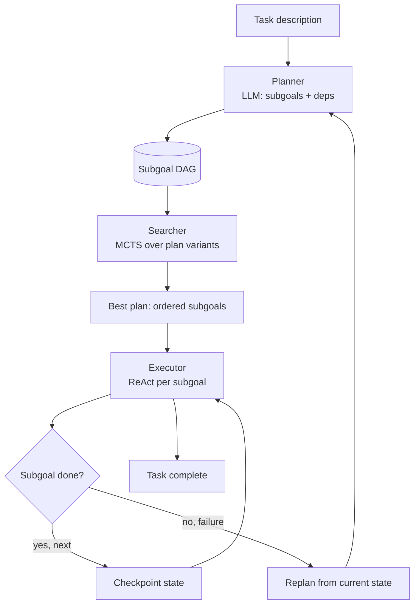
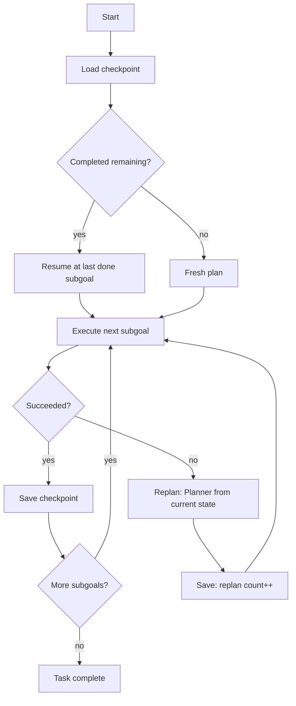
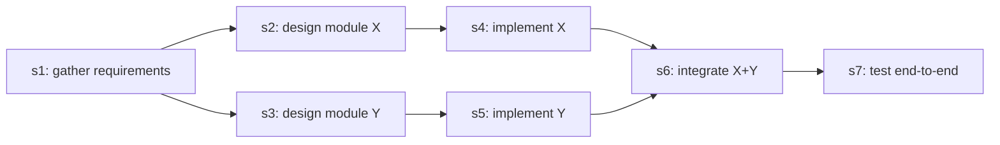

# Chapter 25: Project — Building a Planner-Agent from Scratch

> **Lead paragraph.** Every chapter in Part III isolated one mechanism: decomposition (Ch 17), hierarchical methods (Ch 18), MCTS (Ch 19), search and verification (Ch 20), symbolic planning (Ch 21), self-correction (Ch 22), reasoning models (Ch 23), and collective reasoning (Ch 24). None of them, alone, is an agent. This chapter bolts them together into one running system: a three-layer planner-agent that decomposes a task into a dependency graph of subgoals, searches over plan variants with MCTS, and executes each subgoal with a ReAct loop — checkpointing progress so it survives crashes, and replanning when a subgoal fails. By the end you will have a complete, runnable architecture in pure Python that you can extend with PRM scoring or confidence-aware compute from the surrounding chapters.

---

## 1. The Three-Layer Architecture

The design follows the **RP-ReAct** idea from Chapter 18: separate the *reasoner-planner* that decides what to do from the *executor* that does it. We split it further into three modules with clean contracts, so each can be swapped, tested, or replaced independently.

- **Planner** — an LLM call that turns a natural-language task into a list of subgoals with explicit dependencies. Output is a DAG, not a flat list.
- **Searcher** — an MCTS loop over *plan variants* (different orderings and decompositions of the same subgoals). It uses an evaluator to score how promising each partial plan is, and returns the best plan it found within a compute budget.
- **Executor** — the ReAct agent from Chapter 6, run once per subgoal, with tools and an LLM backend. Each subgoal is an independent episode; a failure triggers replanning, not a crash.

<figure markdown="block">



<figcaption>Figure 25.1 — The planner-agent loop. The Planner emits a subgoal DAG; the Searcher ranks plan variants with MCTS; the Executor runs ReAct per subgoal. Checkpoints persist progress; failures trigger replanning from the current state rather than aborting.</figcaption>
</figure>

The contracts between the layers are deliberately tiny. The Planner returns `List[Subgoal]`; the Searcher takes a `Plan` and an `evaluator` callable and returns a `Plan`; the Executor takes one `Subgoal` and returns a `Result`. Nothing about the layers knows the others' internals, which is what lets us swap the LLM backend, replace MCTS with beam search, or plug in a PRM without touching the rest.

---

## 2. Core Data Structures

Before any logic, we fix the state model. The reference chapter specifies the state shape directly: `State = {completed, current, remaining, trace}`. We encode it as a dataclass.

```python
from dataclasses import dataclass, field

@dataclass
class Subgoal:
    id: str
    description: str
    depends_on: list = field(default_factory=list)   # ids of subgoals that must finish first
    status: str = "pending"                          # pending | running | done | failed

@dataclass
class Plan:
    """An ordered sequence of subgoals produced by the Searcher."""
    subgoals: list  # List[Subgoal] in execution order
    score: float = 0.0

@dataclass
class State:
    """Checkpointable execution state."""
    completed: list = field(default_factory=list)     # done subgoals
    current: object = None                            # subgoal being executed
    remaining: list = field(default_factory=list)     # not yet started
    trace: list = field(default_factory=list)         # ordered (subgoal, result) pairs
    replans: int = 0                                  # how often we revised the plan
```

The `depends_on` field is what makes the plan a DAG rather than a list. Two subgoals with no dependency between them are *parallelizable* — a property the Searcher exploits when ranking plan variants, and one of the extensions called out at the end of the chapter.

---

## 3. The Planner Module

The Planner is a single, carefully-prompted LLM call. The trick is forcing the model to return structured subgoals with explicit dependencies rather than a wall of prose. We ask for a JSON list and parse defensively, falling back to a one-subgoal plan if the model's output is malformed.

```python
import json, re

class Planner:
    def __init__(self, llm):
        self.llm = llm

    def plan(self, task: str) -> list:
        prompt = self._prompt(task)
        raw = self.llm.complete(prompt, temperature=0.3)
        subgoals = self._parse(raw)
        # guarantee at least one subgoal so execution always has work
        return subgoals or [Subgoal(id="s1", description=task)]

    def _prompt(self, task: str) -> str:
        return (
            "Break the following task into ordered subgoals. "
            "Return ONLY a JSON array. Each element: "
            '{"id": "s1", "description": "...", "depends_on": []}. '
            "depends_on lists earlier subgoal ids that must complete first.\n\n"
            f"Task: {task}"
        )

    def _parse(self, raw: str) -> list:
        match = re.search(r"\[.*\]", raw, re.DOTALL)  # tolerate stray prose
        if not match:
            return []
        try:
            items = json.loads(match.group(0))
        except json.JSONDecodeError:
            return []
        return [
            Subgoal(
                id=it["id"],
                description=it["description"],
                depends_on=it.get("depends_on", []),
            )
            for it in items
        ]
```

This is the whole Planner. There is no planning algorithm here — the LLM is the planner; we are its harness. The discipline is in the prompt (force dependencies, force JSON) and the parsing (tolerate the model wrapping JSON in prose).

---

## 4. The Searcher: MCTS Over Plan Variants

The Searcher is where Chapter 19's MCTS lands in real code. The state space is unusual: a *state* is a partial ordering of subgoals, and an *action* is appending the next valid subgoal (one whose dependencies are already in the plan). The Searcher explores different legal orderings and decompositions, scores each complete plan with an evaluator, and returns the best one.

### 4.1 The UCT selection rule

Recall the UCT formula from Chapter 19. At each node we pick the child maximizing

$$\text{UCT}(s, a) = Q(s, a) + c \sqrt{\frac{\ln N(s)}{N(s, a)}}$$

where $Q(s, a)$ is the mean value of taking action $a$ in state $s$ (a scalar, the scalar-times-scalar term $c\sqrt{\cdot}$ scales the exploration bonus), $N(s)$ is the visit count of the parent, $N(s, a)$ is the visit count of the child, and $c$ is the exploration constant balancing exploitation of high-$Q$ actions against exploration of under-visited ones. The $\sqrt{\ln N(s) / N(s, a)}$ term is large for rarely-visited children and shrinks as they are tried, so UCT naturally shifts from exploration to exploitation.

<figure>
<svg width="100%" viewBox="0 0 820 320" xmlns="http://www.w3.org/2000/svg">
  <rect x="0" y="0" width="820" height="320" fill="#ffffff"/>
  <!-- Phase labels -->
  <text x="120" y="24" font-family="sans-serif" font-size="14" fill="#534AB7" text-anchor="middle" font-weight="bold">1. Select</text>
  <text x="320" y="24" font-family="sans-serif" font-size="14" fill="#0F6E56" text-anchor="middle" font-weight="bold">2. Expand</text>
  <text x="540" y="24" font-family="sans-serif" font-size="14" fill="#993C1D" text-anchor="middle" font-weight="bold">3. Simulate</text>
  <text x="720" y="24" font-family="sans-serif" font-size="14" fill="#854F0B" text-anchor="middle" font-weight="bold">4. Backprop</text>
  <!-- Selection path tree -->
  <circle cx="120" cy="80" r="14" fill="#534AB7"/>
  <circle cx="70" cy="150" r="11" fill="#bbbbbb"/>
  <circle cx="120" cy="150" r="11" fill="#534AB7"/>
  <circle cx="170" cy="150" r="11" fill="#bbbbbb"/>
  <circle cx="95" cy="220" r="9" fill="#bbbbbb"/>
  <circle cx="120" cy="220" r="9" fill="#534AB7"/>
  <line x1="120" y1="94" x2="70" y2="139" stroke="#999999"/>
  <line x1="120" y1="94" x2="120" y2="139" stroke="#534AB7" stroke-width="2.5"/>
  <line x1="120" y1="94" x2="170" y2="139" stroke="#999999"/>
  <line x1="120" y1="161" x2="95" y2="211" stroke="#999999"/>
  <line x1="120" y1="161" x2="120" y2="211" stroke="#534AB7" stroke-width="2.5"/>
  <!-- Expansion: new node -->
  <circle cx="320" cy="80" r="14" fill="#534AB7"/>
  <circle cx="320" cy="150" r="11" fill="#0F6E56"/>
  <circle cx="270" cy="220" r="9" fill="#dddddd"/>
  <circle cx="320" cy="220" r="9" fill="#ffffff" stroke="#0F6E56" stroke-width="2.5"/>
  <line x1="320" y1="94" x2="320" y2="139" stroke="#999999"/>
  <line x1="320" y1="161" x2="270" y2="211" stroke="#dddddd"/>
  <line x1="320" y1="161" x2="320" y2="211" stroke="#0F6E56" stroke-width="2.5" stroke-dasharray="4 3"/>
  <text x="345" y="224" font-family="sans-serif" font-size="11" fill="#0F6E56">new child</text>
  <!-- Simulation: dashed rollout -->
  <circle cx="540" cy="80" r="14" fill="#534AB7"/>
  <circle cx="540" cy="150" r="11" fill="#0F6E56"/>
  <circle cx="540" cy="220" r="9" fill="#ffffff" stroke="#0F6E56" stroke-width="2.5"/>
  <path d="M540 229 L500 260 L540 280 L580 260 Z" fill="none" stroke="#993C1D" stroke-width="2" stroke-dasharray="4 3"/>
  <text x="540" y="300" font-family="sans-serif" font-size="11" fill="#993C1D" text-anchor="middle">rollout -> score</text>
  <line x1="540" y1="94" x2="540" y2="139" stroke="#999999"/>
  <line x1="540" y1="161" x2="540" y2="211" stroke="#0F6E56" stroke-width="2.5"/>
  <!-- Backprop: upward arrows -->
  <circle cx="720" cy="80" r="14" fill="#854F0B"/>
  <circle cx="720" cy="150" r="11" fill="#854F0B"/>
  <circle cx="720" cy="220" r="9" fill="#854F0B"/>
  <line x1="720" y1="94" x2="720" y2="139" stroke="#854F0B" stroke-width="2.5"/>
  <line x1="720" y1="161" x2="720" y2="211" stroke="#854F0B" stroke-width="2.5"/>
  <path d="M720 200 L715 210 L725 210 Z" fill="#854F0B"/>
  <path d="M720 130 L715 140 L725 140 Z" fill="#854F0B"/>
  <text x="745" y="155" font-family="sans-serif" font-size="11" fill="#854F0B">score up</text>
</svg>
<figcaption>Figure 25.4 — The four MCTS phases as applied to plan search. Select walks down via UCT; Expand adds one legal child; Simulate completes the plan greedily and scores it; Backprop walks the score up to the root, updating visit counts and values.</figcaption>
</figure>

### 4.2 A minimal MCTS node

We keep the node structure minimal: children are generated lazily by listing the *legal* next subgoals (those whose dependencies are satisfied by the partial plan so far).

```python
import math

class MCTSNode:
    def __init__(self, plan, parent=None):
        self.plan = plan                 # partial Plan built so far
        self.parent = parent
        self.children = []
        self.visits = 0
        self.value = 0.0                 # sum of backpropagated scores

    @property
    def q(self):
        return self.value / self.visits if self.visits else 0.0

    def uct(self, c=1.4):
        if self.visits == 0:
            return float("inf")          # always visit unexplored nodes first
        explore = c * math.sqrt(math.log(self.parent.visits) / self.visits)
        return self.q + explore

    def best_child(self, c=1.4):
        return max(self.children, key=lambda ch: ch.uct(c))
```

The `uct` returning `inf` for unvisited nodes is the standard trick that guarantees every child is expanded at least once before any is revisited.

### 4.3 The four phases

Selection walks down the tree by repeatedly taking the best UCT child until it reaches a node that is not fully expanded. Expansion adds one new child for a legal next subgoal. Simulation (rollout) completes the plan greedily with random legal choices and scores it with the evaluator. Backpropagation walks the score up to the root.

```python
import random

class Searcher:
    def __init__(self, llm, evaluator, iterations=30):
        self.llm = llm
        self.evaluator = evaluator
        self.iterations = iterations

    def search(self, subgoals: list) -> Plan:
        root = MCTSNode(Plan(subgoals=[]))
        for _ in range(self.iterations):
            node = self._select(root)
            expanded = self._expand(node, subgoals)
            score = self._rollout(expanded, subgoals)
            self._backprop(expanded, score)
        best = max(root.children, key=lambda ch: ch.visits) if root.children else root
        return best.plan

    def _select(self, node):
        while node.children and all(c.visits > 0 for c in node.children):
            node = node.best_child()
        return node

    def _expand(self, node, subgoals):
        plan_ids = {s.id for s in node.plan.subgoals}
        legal = [s for s in subgoals if s.id not in plan_ids
                 and all(d in plan_ids for d in s.depends_on)]
        if not legal:
            return node
        chosen = legal[0]
        child = MCTSNode(Plan(subgoals=node.plan.subgoals + [chosen]), parent=node)
        node.children.append(child)
        return child

    def _rollout(self, node, subgoals):
        plan = list(node.plan.subgoals)
        plan_ids = {s.id for s in plan}
        legal = [s for s in subgoals if s.id not in plan_ids]
        # greedy-random completion honoring dependencies
        while legal:
            pick = random.choice(legal)
            plan.append(pick)
            plan_ids.add(pick.id)
            legal = [s for s in subgoals if s.id not in plan_ids]
        return self.evaluator(plan)

    def _backprop(self, node, score):
        while node is not None:
            node.visits += 1
            node.value += score
            node = node.parent
```

The evaluator is the load-bearing external dependency. In the base project it is a simple heuristic — does the plan respect dependencies, is it short, does it read sensibly to the LLM. The extensions at the end of the chapter replace it with a PRM-style step scorer.

### 4.4 A simple plan evaluator

The evaluator combines a validity check (dependencies respected), a parsimony bonus (fewer subgoals is better), and an LLM plausibility score. Keeping it as a callable means the Searcher never knows what the evaluator does.

```python
class PlanEvaluator:
    def __init__(self, llm):
        self.llm = llm

    def __call__(self, plan: list) -> float:
        # 1. validity: every subgoal's deps precede it
        seen = set()
        for s in plan:
            if not all(d in seen for d in s.depends_on):
                return 0.0
            seen.add(s.id)
        # 2. parsimony: prefer shorter plans (bounded)
        parsimony = 1.0 / (1.0 + len(plan))
        # 3. plausibility: ask the LLM to score 0..1
        desc = " -> ".join(s.description for s in plan)
        score_text = self.llm.complete(
            f"Rate this plan's plausibility for solving the task, 0 to 1. "
            f"Reply with just the number.\nPlan: {desc}"
        )
        try:
            plausibility = float(re.search(r"[01](?:\.\d+)?", score_text).group(0))
        except (AttributeError, ValueError):
            plausibility = 0.5
        return 0.3 * parsimony + 0.7 * plausibility
```

The two weighted terms ($0.3 \cdot \text{parsimony}$ and $0.7 \cdot \text{plausibility}$, both scalar-times-scalar products) encode a prior: prefer plausible plans, but break ties toward shorter ones. Tune the weights to your domain; a task where steps are cheap should up-weight parsimony, a task where a wrong step is expensive should up-weight plausibility.

---

## 5. The Executor: ReAct Per Subgoal

The Executor is the Chapter 6 ReAct agent, applied once per subgoal. We reproduce the minimal shape here so the project is self-contained, then show how the orchestrator wires it to the Planner and Searcher.

```python
class ReActExecutor:
    def __init__(self, llm, tools):
        self.llm = llm
        self.tools = {t["name"]: t for t in tools}

    def execute(self, subgoal: Subgoal, max_steps: int = 6) -> dict:
        messages = [{"role": "user",
                     "content": f"Subgoal: {subgoal.description}"}]
        for step in range(max_steps):
            thought = self.llm.complete(
                self._react_prompt(messages), temperature=0.2
            )
            action = self._parse_action(thought)
            if action is None:                       # model declared it done
                return {"subgoal": subgoal.id, "ok": True, "trace": thought}
            tool = self.tools.get(action["name"])
            if tool is None:
                messages.append({"role": "assistant", "content": thought + " [bad tool]"})
                continue
            observation = tool["fn"](**action["args"])
            messages.append({"role": "assistant", "content": thought})
            messages.append({"role": "user", "content": f"Observation: {observation}"})
        return {"subgoal": subgoal.id, "ok": False, "trace": "max steps reached"}

    def _react_prompt(self, messages):
        history = "\n".join(f"{m['role']}: {m['content']}" for m in messages)
        return (f"{history}\n\n"
                "Reply 'THOUGHT: <reasoning> ACTION: <tool>(<args>)' "
                "or 'DONE' if the subgoal is complete.")

    def _parse_action(self, text: str):
        if "DONE" in text:
            return None
        m = re.search(r"ACTION:\s*(\w+)\((.*)\)", text)
        if not m:
            return None
        name, args_raw = m.groups()
        args = {}
        if args_raw.strip():
            for pair in args_raw.split(","):
                k, v = pair.split("=", 1)
                args[k.strip()] = v.strip().strip("'\"")
        return {"name": name, "args": args}
```

The action parser is intentionally simple — it handles `name(arg='value')`. A production version would use constrained decoding (Chapter 4) to guarantee valid tool calls instead of regex parsing, which is the single most fragile part of this code.

---

## 6. Checkpointing and Replanning

Two production concerns separate a demo from a system: surviving crashes and recovering from failure.

**Checkpointing** persists `State` after every completed subgoal. If the process dies mid-task, we reload the checkpoint and resume from the last completed subgoal rather than redoing the whole plan. For a five-subgoal task this is a convenience; for a hundred-subgoal research task it is the difference between usable and unusable.

```python
import json, os

class Checkpointer:
    def __init__(self, path="plan_state.json"):
        self.path = path

    def save(self, state: State):
        payload = {
            "completed": [s.__dict__ for s in state.completed],
            "remaining": [s.__dict__ for s in state.remaining],
            "replans": state.replans,
        }
        with open(self.path, "w") as f:
            json.dump(payload, f, indent=2)

    def load(self) -> State:
        if not os.path.exists(self.path):
            return State()
        with open(self.path) as f:
            payload = json.load(f)
        completed = [Subgoal(**s) for s in payload["completed"]]
        remaining = [Subgoal(**s) for s in payload["remaining"]]
        return State(completed=completed, remaining=remaining,
                     replans=payload.get("replans", 0))
```

<figure markdown="block">



<figcaption>Figure 25.2 — Checkpoint and replan flow. On start, load any saved checkpoint and resume. A subgoal failure does not abort the task; it hands the current state back to the Planner, which regenerates remaining subgoals.</figcaption>
</figure>

**Replanning** is the response to a failed subgoal. Rather than retry the same failing action, we hand the Planner the current state (what is done, what failed) and ask for a fresh set of remaining subgoals. This is the difference between a brittle script and an agent: a failed subgoal is information, not a crash. We bound the replanning count to avoid infinite revision loops.

---

## 7. The Dependency DAG and Parallel Execution

The `depends_on` field gives us a DAG for free. Subgoals whose dependencies are all satisfied can execute in parallel — a real speedup on tasks with independent branches (for example, "research topic A and research topic B, then synthesize" has two independent research subgoals).

<figure markdown="block">



<figcaption>Figure 25.3 — A subgoal dependency DAG. s2 and s3 are independent (both depend only on s1) and can execute in parallel; s6 must wait for both s4 and s5; s7 waits for s6. The Searcher's legal-move check enforces this ordering.</figcaption>
</figure>

The base project executes subgoals sequentially for simplicity; parallel execution is the first extension below. The DAG is enforced by the Searcher's `_expand` and `_rollout` methods, which only consider subgoals whose `depends_on` are already in the partial plan.

---

## 8. Putting It Together: The Orchestrator

The orchestrator owns the loop: plan, search, execute each subgoal, checkpoint, replan on failure. It is short because each layer does one thing.

```python
class PlannerAgent:
    def __init__(self, llm, tools, max_replans=2):
        self.llm = llm
        self.planner = Planner(llm)
        self.searcher = Searcher(llm, PlanEvaluator(llm), iterations=20)
        self.executor = ReActExecutor(llm, tools)
        self.checkpointer = Checkpointer()
        self.max_replans = max_replans

    def run(self, task: str):
        state = self.checkpointer.load()
        if not state.completed and not state.remaining:
            subgoals = self.planner.plan(task)
            plan = self.searcher.search(subgoals)
            state.remaining = plan.subgoals
        while state.remaining:
            subgoal = state.remaining.pop(0)
            state.current = subgoal
            result = self.executor.execute(subgoal)
            if result["ok"]:
                state.completed.append(subgoal)
                state.trace.append((subgoal.id, result))
                self.checkpointer.save(state)
            else:
                if state.replans >= self.max_replans:
                    return {"ok": False, "reason": "replan limit",
                            "state": state}
                state.replans += 1
                remaining = self.planner.plan(
                    f"Continue. Done: {[s.id for s in state.completed]}. "
                    f"Failed: {subgoal.description}. Remaining task: {task}"
                )
                state.remaining = remaining
                self.checkpointer.save(state)
        return {"ok": True, "state": state, "replans": state.replans}
```

A subgoal failure with `replans < max_replans` triggers a fresh plan scoped to what remains; once the limit is hit the agent returns failure with its state, so a caller (or a human) can inspect where it got stuck. The `max_replans` bound is what keeps the agent from spinning on an impossible subgoal.

---

## 9. Agentic Code Project: The Complete Planner-Agent

This is the runnable capstone — the standard `LLMClient` with a `use_ollama` flag, a tiny tool set, and the full plan-search-execute-checkpoint loop wired together. It is self-contained: paste it into a file, point it at a local Ollama model or a hosted API, and run.

```python
import os, re, json, math, random
from dataclasses import dataclass, field

import openai


class LLMClient:
    """OpenAI-compatible client; flips to a local Ollama endpoint."""

    def __init__(self, model="gpt-5.5", use_ollama=False):
        self.model = model
        if use_ollama:
            self.client = openai.OpenAI(
                base_url="http://localhost:11434/v1", api_key="ollama")
        else:
            self.client = openai.OpenAI(api_key=os.getenv("OPENAI_API_KEY"))

    def complete(self, prompt, temperature=0.4, max_tokens=512):
        resp = self.client.chat.completions.create(
            model=self.model,
            messages=[{"role": "user", "content": prompt}],
            temperature=temperature, max_tokens=max_tokens,
        )
        return resp.choices[0].message.content.strip()


@dataclass
class Subgoal:
    id: str
    description: str
    depends_on: list = field(default_factory=list)
    status: str = "pending"


@dataclass
class Plan:
    subgoals: list = field(default_factory=list)
    score: float = 0.0


@dataclass
class State:
    completed: list = field(default_factory=list)
    remaining: list = field(default_factory=list)
    trace: list = field(default_factory=list)
    replans: int = 0


class Planner:
    def __init__(self, llm):
        self.llm = llm

    def plan(self, task):
        prompt = ("Break this task into ordered subgoals as a JSON array. "
                  'Each: {"id":"s1","description":"...","depends_on":[]}\n'
                  f"Task: {task}")
        raw = self.llm.complete(prompt, temperature=0.2)
        m = re.search(r"\[.*\]", raw, re.DOTALL)
        if not m:
            return [Subgoal(id="s1", description=task)]
        try:
            items = json.loads(m.group(0))
        except json.JSONDecodeError:
            return [Subgoal(id="s1", description=task)]
        return [Subgoal(it["id"], it["description"], it.get("depends_on", []))
                for it in items]


class MCTSNode:
    def __init__(self, plan, parent=None):
        self.plan, self.parent, self.children = plan, parent, []
        self.visits, self.value = 0, 0.0

    def uct(self, c=1.4):
        if self.visits == 0:
            return float("inf")
        return self.value / self.visits + c * math.sqrt(
            math.log(self.parent.visits) / self.visits)


class Searcher:
    def __init__(self, llm, evaluator, iterations=15):
        self.llm, self.evaluator, self.iterations = llm, evaluator, iterations

    def search(self, subgoals):
        root = MCTSNode(Plan())
        for _ in range(self.iterations):
            node = self._select(root)
            node = self._expand(node, subgoals)
            score = self._rollout(node, subgoals)
            self._backprop(node, score)
        return max(root.children, key=lambda c: c.visits).plan if root.children else root.plan

    def _legal(self, plan, subgoals):
        ids = {s.id for s in plan}
        return [s for s in subgoals
                if s.id not in ids and all(d in ids for d in s.depends_on)]

    def _select(self, node):
        while node.children and all(c.visits for c in node.children):
            node = max(node.children, key=lambda c: c.uct())
        return node

    def _expand(self, node, subgoals):
        legal = self._legal(node.plan.subgoals, subgoals)
        if not legal:
            return node
        child = MCTSNode(Plan(node.plan.subgoals + [legal[0]]), node)
        node.children.append(child)
        return child

    def _rollout(self, node, subgoals):
        plan = list(node.plan.subgoals)
        ids = {s.id for s in plan}
        legal = [s for s in subgoals if s.id not in ids]
        while legal:
            pick = random.choice(legal)
            plan.append(pick)
            ids.add(pick.id)
            legal = [s for s in subgoals if s.id not in ids]
        return self.evaluator(plan)

    def _backprop(self, node, score):
        while node:
            node.visits += 1
            node.value += score
            node = node.parent


class Checkpointer:
    def __init__(self, path="plan_state.json"):
        self.path = path

    def save(self, state):
        with open(self.path, "w") as f:
            json.dump({
                "completed": [s.__dict__ for s in state.completed],
                "remaining": [s.__dict__ for s in state.remaining],
                "replans": state.replans,
            }, f, indent=2)

    def load(self):
        if not os.path.exists(self.path):
            return State()
        with open(self.path) as f:
            d = json.load(f)
        return State([Subgoal(**s) for s in d["completed"]],
                      [Subgoal(**s) for s in d["remaining"]],
                      replans=d.get("replans", 0))


class PlannerAgent:
    def __init__(self, llm, tools, max_replans=2):
        self.llm = llm
        self.planner = Planner(llm)
        self.searcher = Searcher(llm, lambda p: 1.0 / (1 + len(p)), 15)
        self.executor = ReActExecutor(llm, tools)
        self.ckpt = Checkpointer()
        self.max_replans = max_replans

    def run(self, task):
        state = self.ckpt.load()
        if not state.completed and not state.remaining:
            plan = self.searcher.search(self.planner.plan(task))
            state.remaining = plan.subgoals
        while state.remaining:
            sg = state.remaining.pop(0)
            result = self.executor.execute(sg)
            if result["ok"]:
                state.completed.append(sg)
                state.trace.append((sg.id, result["trace"]))
                self.ckpt.save(state)
            elif state.replans < self.max_replans:
                state.replans += 1
                state.remaining = self.planner.plan(
                    f"Continue after failure. Done: "
                    f"{[s.id for s in state.completed]}. Task: {task}")
                self.ckpt.save(state)
            else:
                return {"ok": False, "reason": "replan limit", "state": state}
        return {"ok": True, "replans": state.replans,
                "steps": len(state.trace)}


class ReActExecutor:
    def __init__(self, llm, tools):
        self.llm = llm
        self.tools = {t["name"]: t for t in tools}

    def execute(self, subgoal, max_steps=5):
        msgs = [f"Subgoal: {subgoal.description}"]
        for _ in range(max_steps):
            out = self.llm.complete(
                "\n".join(msgs) + "\nReply 'THOUGHT: .. ACTION: name(arg=v)' or 'DONE'.")
            if "DONE" in out:
                return {"ok": True, "trace": out}
            m = re.search(r"ACTION:\s*(\w+)\((.*?)\)", out)
            if not m:
                msgs.append(out); continue
            name, args = m.groups()
            tool = self.tools.get(name)
            if not tool:
                msgs.append(out + " [no such tool]"); continue
            kwargs = dict(re.findall(r"(\w+)=['\"]?(.*?)['\"]?(?:,|$)", args))
            msgs.append(out)
            msgs.append(f"Observation: {tool['fn'](**kwargs)}")
        return {"ok": False, "trace": "max steps"}


def main():
    llm = LLMClient(use_ollama=True)  # flip to False for hosted API
    tools = [
        {"name": "read_file", "fn": lambda path: open(path).read()[:200]},
        {"name": "list_dir", "fn": lambda path="": str(__import__("os").listdir(path) or path)[:200]},
    ]
    agent = PlannerAgent(llm, tools)
    result = agent.run("Summarize the Python files in the current directory.")
    print(result)


if __name__ == "__main__":
    main()
```

Run it and watch three things: the number of subgoals the Planner produced, the plan the Searcher settled on, and the `replans` count on exit. A healthy run on a simple task finishes with `replans: 0` and a handful of executed steps; a task with an ambiguous subgoal may show `replans: 1` as the agent revises mid-flight.

---

## 10. Extensions

Three extensions turn this skeleton into something closer to a research-grade system; each maps to a chapter you have already read.

**PRM-based plan evaluation.** Replace the heuristic `PlanEvaluator` with a Process Reward Model (Chapter 15) that scores each subgoal's placement. The PRM turns the evaluator from "does this read well" into "is each step on the path to reward," which is a much stronger signal on tasks with verifiable outcomes. The interface does not change — the Searcher still calls `evaluator(plan)` — so this is a drop-in upgrade.

**Confidence-aware compute allocation.** The Searcher currently runs a fixed number of MCTS iterations. A confidence estimate over the best plan (Chapter 20's CATTS idea, applied at the plan level) lets us spend more iterations on plans whose top candidates are close in score and stop early when one plan dominates. This is plan-level test-time compute scaling.

**Parallel subgoal execution.** The DAG already tells us which subgoals are independent. A thread pool that runs independent subgoals concurrently — joining at dependency barriers — can cut wall-clock time substantially on fan-out tasks. The checkpoint format needs a per-subgoal status field rather than a flat `completed` list to stay correct under concurrency.

A fourth, implicit extension: replace the regex action parser with constrained decoding (Chapter 4). The current parser is the project's weakest point, and any deployment that needs reliability should fix it before anything else.

---

## Summary

- The planner-agent composes three layers with tiny contracts: a Planner that emits a subgoal DAG, a Searcher that ranks plan variants with MCTS, and a ReAct Executor that runs each subgoal — each independently swappable.
- The Planner is a structured-output LLM call; the discipline is in the prompt (force dependencies, force JSON) and defensive parsing, not in a planning algorithm.
- The Searcher treats partial plan orderings as states and legal next subgoals as actions, using the UCT formula to balance exploitation and exploration over a bounded iteration budget.
- Checkpointing persists `State` after every completed subgoal so the agent survives crashes; replanning hands a failed subgoal back to the Planner rather than aborting, with a bound to prevent revision loops.
- The DAG of subgoal dependencies is the basis for parallel execution and is enforced by the Searcher's legal-move check — independent subgoals can execute concurrently.
- Extensions map directly onto earlier chapters: PRM evaluators (Ch 15), confidence-aware compute (Ch 20), constrained decoding for tool calls (Ch 4), and parallel execution exploiting the DAG.

---

## Further Reading

- [Tree of Thoughts](https://arxiv.org/abs/2305.10601) — Yao et al., 2023. Branching search over thoughts; the search abstraction the Searcher generalizes to plan variants.
- [Reasoning with Language Model is Planning with World Model (RAP)](https://arxiv.org/abs/2305.14992) — Hao et al., 2023. Casts LLM reasoning as MCTS with the model as a world model.
- [Reason-Plan-ReAct (RP-ReAct): A Reasoner-Planner Supervising a ReAct Executor](https://arxiv.org/abs/2512.03560) — 2025. The decoupled reasoner-planner / executor architecture this project adopts.
- [Efficient Selectivity and Backup Operators in Monte-Carlo Tree Search](https://hal.science/hal-00131404) — Coulom, 2006. The original MCTS and UCT work.
- [A Survey of Monte Carlo Tree Search Methods](https://ieeexplore.ieee.org/document/6145622) — Browne et al., 2012. The standard reference for MCTS selection, expansion, simulation, backpropagation.

---