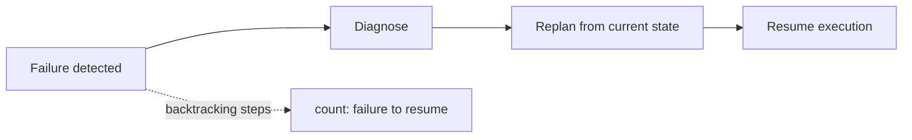
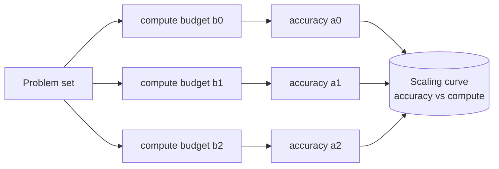

# Chapter 26: Evaluating Planning and Reasoning

> **Lead paragraph.** A planner that solves one task is a demo; a planner you can trust is a measured thing. The previous chapter built a planner-agent; this chapter asks whether it is any good, and the answer is never a single number. Plan quality splits into validity (does it reach the goal?) and optimality (is it cheap?), reasoning quality lives on benchmarks like MATH and GPQA where you must control for contamination, and test-time scaling quality is a *curve*, not a score — accuracy plotted against compute, whose shape tells you whether to spend more or stop. By the end of this chapter you will have an evaluation harness that records accuracy, steps, tokens, and time, draws the scaling curve, and audits the verifier whose quality ultimately bounds everything else.

---

## 1. Why Planning and Reasoning Need Their Own Evaluation

Chapter 16 covered single-agent evaluation in general terms — success rate, step efficiency, cost. Those metrics still apply, but planning and reasoning expose failures that a generic harness misses. A plan can *reach the goal* while being twice as long as necessary, hiding a cost problem behind a success. A reasoning trace can *arrive at the right answer* through a subtly wrong argument, hiding a reasoning problem behind a correct number. And a test-time scaling method can *beat the baseline* only because it spent ten times the compute, hiding an efficiency problem behind an accuracy win.

Three distinctions organize this chapter. **Validity versus optimality**: a plan can be correct without being good. **Static accuracy versus scaling curves**: a single accuracy number is uninformative without the compute it cost. **Agent quality versus verifier quality**: every search or voting method is capped by its verifier, so verifier calibration is a first-class metric, not an afterthought.

---

## 2. Plan-Specific Metrics

### 2.1 Validity and optimality are distinct

A plan is **valid** if executing it reaches the goal state. A plan is **optimal** if no cheaper valid plan exists. These are not the same property, and conflating them is the most common evaluation error in planning.

Consider a Blocksworld task: stack three blocks into a target tower. A plan that builds the tower in 8 moves is valid. The optimal plan needs 5 moves. Reporting "success rate = 100%" hides the 3 wasted moves. On a single task this is a rounding error; across a benchmark, systematic over-long plans signal a planner that cannot prune — exactly the failure mode the MCTS Searcher from Chapter 25 is meant to fix.

| Metric | Question answered | When it matters |
|---|---|---|
| Plan validity | Does the plan reach the goal? | Always — the floor |
| Plan optimality | Is the plan cost-minimal? | When steps are expensive or time-bounded |
| Plan length ratio | $\text{actual} / \text{optimal}$ length | Aggregate suboptimality across a benchmark |
| Cost | Tokens, dollars, wall-clock | Production systems |

The **plan length ratio** $\text{actual} / \text{optimal}$ is the clean aggregate: 1.0 means optimal, 1.5 means 50% longer than necessary. It normalizes across tasks of different sizes, which raw step counts cannot.

### 2.2 Replanning and backtracking measure adaptability

Two metrics capture how a planner *responds* to difficulty rather than how it performs when all goes well.

**Replanning frequency** is the fraction of subgoals that triggered a replan. Some replanning is healthy — it means the agent notices failure and recovers. Too much replanning means the initial plans were brittle, which is a planning problem, not an execution problem. The Chapter 25 agent's `replans` counter is exactly this metric. A useful rule of thumb: under 10% is healthy, over 30% suggests the Planner prompt or decomposition is weak.

**Backtracking efficiency** measures recovery speed: the number of steps from a detected failure to resumed forward progress. A planner that detects a dead end immediately but then spends 20 steps re-deriving what it already knew has good failure detection but poor recovery. Track the two separately.



<figcaption>Figure 26.1 — Backtracking efficiency is the distance from failure detection to resumed forward progress. A short bar means fast recovery; a long bar means the agent re-derives known state, wasting compute.</figcaption>

---

## 3. Reasoning Benchmarks

Planning and reasoning share a benchmark ecosystem because both are ultimately about producing correct multi-step outputs. The benchmarks differ in what "correct" means and how hard it is to verify.

### 3.1 The mathematics ladder

| Benchmark | Difficulty | Verification |
|---|---|---|
| MATH / MATH-500 | Competition algebra, geometry, number theory | Exact numerical match |
| AIME | American Invitational Mathematics Examination | Integer answer 0–999 |
| GPQA-Diamond | PhD-level science (biology, chem, physics) | Multiple choice |
| FrontierMath | Research-level mathematics, novel problems | Exact, requires specialist check |

The ladder climbs in two dimensions. Difficulty rises from high-school competition math (MATH) through olympiad (AIME) to research frontier (FrontierMath). Verification hardness rises with it: MATH answers are machine-checkable integers; FrontierMath answers require a domain specialist to confirm the problem is even novel and the answer correct, which is why FrontierMath scores are reported with caveats.

**Contamination is the persistent threat.** These problems are public. A model trained on the internet has likely seen many of them. A 90% score on MATH-500 is meaningless if the model memorized the set — and we have strong evidence frontier models have, since scores on held-out variants drop. The defensive practices are: report on the hardest subset (GPQA-Diamond, AIME 2024+), use paraphrased or reworded variants, and watch for suspiciously uniform step counts that suggest retrieval rather than reasoning.

### 3.2 Planning benchmarks

Classical planning has its own benchmarks, anchored in PDDL and the International Planning Competition.

- **PlanBench** — evaluates LLMs on classical planning tasks expressed in natural language and PDDL; tracks both plan correctness and cost.
- **Blocksworld** — stack/unstack manipulation tasks; small state space, so optimality is checkable by exhaustive search.
- **PDDL benchmarks** — the IPC suite; domain models with formally defined actions, preconditions, and effects.

PlanBench matters because it tests whether an LLM can *plan* in the symbolic sense, not just produce plausible-sounding steps. A model that talks a good plan but violates a precondition is caught here, where a free-form reasoning benchmark would miss the violation.

---

## 4. Test-Time Scaling Curves

### 4.1 A single accuracy number is uninformative

Chapter 23 introduced test-time compute scaling. Evaluating it correctly means never reporting a bare accuracy. The right report is a **scaling curve**: accuracy on the y-axis, compute on the x-axis. The shape of that curve is the whole story.



<figcaption>Figure 26.2 — A scaling curve is built by running the same benchmark at several compute budgets and recording accuracy at each. The curve, not any single point, is the evaluation.</figcaption>

Three curve shapes carry distinct strategic lessons.

**Linear** — accuracy keeps climbing with compute. Spend more; you get more. This is the regime where test-time scaling pays off and where methods like MDAPs (Chapter 24) earn their cost.

**Diminishing returns** — accuracy climbs then flattens. There is a knee beyond which more compute is wasted. The evaluation question is where the knee is, so you can stop there.

**Threshold** — accuracy is flat then jumps. This indicates a capability cliff: below some compute budget the method cannot solve the problem at all, above it can. Threshold curves are the most strategically important to detect, because they tell you a method is *not* a smooth trade-off but a binary capability.

### 4.2 Cost-normalized accuracy

Because scaling curves compare methods at different compute levels, you need a way to compare methods fairly. **Cost-normalized accuracy** normalizes the comparison:

$$\text{Cost-normalized accuracy} = \frac{\text{Accuracy}}{\text{Cost}} \times 100$$

where the division is scalar-over-scalar (accuracy, a fraction, divided by cost in dollars or tokens, then scaled by 100 for readability). A method with 80% accuracy at $0.50/task scores 160; a method with 85% accuracy at $2.00/task scores 42.5. The cheaper method wins on this metric even at lower accuracy, which is the right framing when cost is a binding constraint. Always report cost-normalized accuracy *alongside* raw accuracy — reporting only one invites the error of declaring a winner without stating the trade-off.

<figure>
<svg width="100%" viewBox="0 0 820 340" xmlns="http://www.w3.org/2000/svg">
  <rect x="0" y="0" width="820" height="340" fill="#ffffff"/>
  <!-- axes -->
  <line x1="70" y1="290" x2="770" y2="290" stroke="#333333" stroke-width="2"/>
  <line x1="70" y1="30" x2="70" y2="290" stroke="#333333" stroke-width="2"/>
  <text x="420" y="325" font-family="sans-serif" font-size="14" fill="#333333" text-anchor="middle">test-time compute (tokens)</text>
  <text x="28" y="160" font-family="sans-serif" font-size="14" fill="#333333" text-anchor="middle" transform="rotate(-90 28 160)">accuracy (%)</text>
  <!-- y ticks -->
  <text x="62" y="294" font-family="sans-serif" font-size="11" fill="#666666" text-anchor="end">0</text>
  <text x="62" y="44" font-family="sans-serif" font-size="11" fill="#666666" text-anchor="end">100</text>
  <!-- Linear curve (purple) -->
  <path d="M70 250 C 200 220, 320 160, 470 110 C 580 75, 680 55, 770 48" fill="none" stroke="#534AB7" stroke-width="3"/>
  <!-- Diminishing (teal) -->
  <path d="M70 260 C 180 190, 260 150, 330 140 C 450 128, 620 122, 770 120" fill="none" stroke="#0F6E56" stroke-width="3"/>
  <!-- Threshold (coral) -->
  <path d="M70 270 L 320 268 L 330 266 C 360 200, 380 90, 420 70 L 770 66" fill="none" stroke="#993C1D" stroke-width="3"/>
  <!-- knee marker on diminishing -->
  <circle cx="330" cy="140" r="5" fill="#0F6E56"/>
  <text x="340" y="135" font-family="sans-serif" font-size="11" fill="#0F6E56">knee (stop here)</text>
  <!-- threshold jump marker -->
  <circle cx="355" cy="110" r="5" fill="#993C1D"/>
  <text x="365" y="105" font-family="sans-serif" font-size="11" fill="#993C1D">capability cliff</text>
  <!-- legend -->
  <line x1="500" y1="250" x2="540" y2="250" stroke="#534AB7" stroke-width="3"/>
  <text x="548" y="254" font-family="sans-serif" font-size="12" fill="#534AB7">linear</text>
  <line x1="500" y1="270" x2="540" y2="270" stroke="#0F6E56" stroke-width="3"/>
  <text x="548" y="274" font-family="sans-serif" font-size="12" fill="#0F6E56">diminishing returns</text>
  <line x1="640" y1="250" x2="680" y2="250" stroke="#993C1D" stroke-width="3"/>
  <text x="688" y="254" font-family="sans-serif" font-size="12" fill="#993C1D">threshold</text>
</svg>
<figcaption>Figure 26.3 — Three scaling-curve shapes. Linear (purple) rewards more compute; diminishing returns (teal) has a knee beyond which compute is wasted; threshold (coral) shows a capability cliff where the method simply cannot solve the problem below a budget. The curve shape dictates strategy.</figcaption>
</figure>

### 4.3 Dynamic allocation evaluation

Chapter 20 introduced CATTS and DORA — methods that allocate compute adaptively rather than uniformly. Evaluating them correctly means comparing against a *uniform* baseline at the *same total compute*. The frequent error is to compare adaptive accuracy against a fixed-budget baseline and declare victory, when the win is just "we spent more." The honest comparison holds total compute constant and asks: does allocating it adaptively beat allocating it uniformly? The reference reports adaptive methods usually win by 20–50% under this fair comparison — but only under it.

---

## 5. Verifier Quality: The Hidden Ceiling

### 5.1 Every search method is verifier-bounded

Best-of-N, MCTS, beam search, Aegean consensus, MDAP voting — every method in Part III that selects among candidates depends on something that scores the candidates. That something is the **verifier**, and its quality is a hard ceiling on the whole system. A perfect search with a 70%-accurate verifier cannot exceed 70% accuracy. Verifier evaluation is therefore not optional; it is the evaluation that bounds all the others.

### 5.2 Precision, recall, calibration

A verifier is a binary classifier (correct / incorrect trace) and is evaluated as one, on a held-out set of traces with ground-truth labels.

- **Precision** — of traces the verifier accepted, how many were truly correct. Low precision means the verifier passes bad traces (false confidence).
- **Recall** — of truly correct traces, how many the verifier accepted. Low recall means the verifier rejects good traces (wasted compute).
- **Calibration** — does a verifier confidence of 0.9 mean 90% of such traces are correct? A verifier can be accurate yet miscalibrated, which breaks any threshold-based early-termination (Aegean's quorum, CATTS's stop rule).

<figure>
<svg width="100%" viewBox="0 0 820 320" xmlns="http://www.w3.org/2000/svg">
  <rect x="0" y="0" width="820" height="320" fill="#ffffff"/>
  <!-- axes -->
  <line x1="70" y1="280" x2="760" y2="280" stroke="#333333" stroke-width="2"/>
  <line x1="70" y1="30" x2="70" y2="280" stroke="#333333" stroke-width="2"/>
  <text x="415" y="305" font-family="sans-serif" font-size="14" fill="#333333" text-anchor="middle">predicted confidence</text>
  <text x="26" y="155" font-family="sans-serif" font-size="14" fill="#333333" text-anchor="middle" transform="rotate(-90 26 155)">empirical accuracy</text>
  <!-- diagonal perfect calibration -->
  <line x1="70" y1="280" x2="760" y2="40" stroke="#999999" stroke-width="2" stroke-dasharray="6 5"/>
  <text x="720" y="58" font-family="sans-serif" font-size="12" fill="#999999" text-anchor="end">perfect calibration</text>
  <!-- well-calibrated verifier (teal, on diagonal) -->
  <path d="M70 280 C 250 230, 450 150, 620 80 L 760 44" fill="none" stroke="#0F6E56" stroke-width="3"/>
  <!-- overconfident verifier (coral, below diagonal) -->
  <path d="M70 280 C 180 250, 300 210, 760 90" fill="none" stroke="#993C1D" stroke-width="3"/>
  <text x="600" y="200" font-family="sans-serif" font-size="12" fill="#993C1D">overconfident: says 0.9, really 0.6</text>
  <!-- underconfident verifier (purple, above diagonal) -->
  <path d="M70 280 C 250 240, 420 120, 760 30" fill="none" stroke="#534AB7" stroke-width="3"/>
  <text x="260" y="120" font-family="sans-serif" font-size="12" fill="#534AB7">underconfident: wastes compute</text>
</svg>
<figcaption>Figure 26.4 — A reliability diagram for a verifier. The dashed diagonal is perfect calibration. The teal verifier tracks it. The coral verifier is overconfident — it accepts traces it should not, breaking threshold-based stopping. The purple verifier is underconfident — it rejects good traces, wasting search budget.</figcaption>
</figure>

The overconfident verifier (coral) is the dangerous one: it passes bad traces with high confidence, so any method that stops early on verifier confidence (Aegean quorum, CATTS) will stop on wrong answers. Miscalibration, not raw accuracy, is what breaks adaptive compute methods.

### 5.3 ORM vs PRM verifier quality

Chapter 15 distinguished Outcome Reward Models (score the final answer) from Process Reward Models (score each step). For verifier evaluation this distinction matters: an ORM can only catch a trace that ends wrong, while a PRM can localize *where* it went wrong. On long traces the PRM's error localization translates directly into better search, because MCTS can prune a bad branch at the step it fails rather than carrying it to completion. When you report verifier quality, report it per-step (PRM) and per-trace (ORM) separately — they answer different questions.

---

## 6. The Evaluation Harness

The harness ties these metrics together. It runs an agent on a benchmark, records the four core signals — accuracy, steps, tokens, time — at several compute budgets, and emits both a results table and a scaling curve.

```python
import time
from dataclasses import dataclass, field

@dataclass
class Trial:
    task: str
    correct: bool
    steps: int
    tokens: int
    seconds: float
    budget: int

def run_trial(agent, task, gold_answer, budget):
    """Run one task at one compute budget; record cost signals."""
    t0 = time.time()
    result = agent.run(task, compute_budget=budget)  # agent-specific
    elapsed = time.time() - t0
    steps = result.get("steps", 0)
    tokens = result.get("tokens", 0)
    correct = _grade(result.get("answer", ""), gold_answer)
    return Trial(task, correct, steps, tokens, elapsed, budget)

def _grade(predicted, gold):
    """Exact-match grading for integer/string answers."""
    return str(predicted).strip() == str(gold).strip()
```

The grading function is the silent load-bearer. Exact-match works for MATH/AIME (integer answers); GPQA needs multiple-choice comparison; FrontierMath needs a specialist checker. Getting grading right is unglamorous and decisive — a buggy grader produces an entire bogus benchmark.

The harness then aggregates into a scaling curve by grouping trials by budget:

```python
def scaling_curve(trials):
    """Aggregate trials into (budget, accuracy, avg_cost) points."""
    from collections import defaultdict
    by_budget = defaultdict(list)
    for t in trials:
        by_budget[t.budget].append(t)
    curve = []
    for budget, group in sorted(by_budget.items()):
        n = len(group)
        acc = sum(t.correct for t in group) / n
        avg_tokens = sum(t.tokens for t in group) / n
        avg_time = sum(t.seconds for t in group) / n
        # cost-normalized accuracy (per 1000 tokens)
        cna = (acc / avg_tokens * 1000) if avg_tokens else 0.0
        curve.append((budget, acc, avg_tokens, avg_time, cna))
    return curve
```

The cost-normalized accuracy term $(\text{acc} / \text{avg\_tokens}) \times 1000$ is scalar-over-scalar-then-scaled (a fraction divided by a token count, multiplied by 1000 for readability) — the same normalization as Section 4.2, expressed per-thousand-tokens so curves across budgets are comparable.

---

## 7. Agentic Code Project: A Planning-and-Reasoning Evaluation Harness

This project is a complete, runnable harness built on the standard `LLMClient` with a `use_ollama` flag. It runs a reasoning agent over a small problem set at several compute budgets (controlled by sampling temperature and sample count), grades answers, and prints the scaling curve with cost-normalized accuracy. It is the evaluation layer you would bolt onto the Chapter 25 planner-agent.

```python
import os, time, re
from collections import defaultdict
from dataclasses import dataclass, field

import openai


class LLMClient:
    """OpenAI-compatible client; flips to a local Ollama endpoint."""

    def __init__(self, model="gpt-5.5", use_ollama=False):
        self.model = model
        if use_ollama:
            self.client = openai.OpenAI(
                base_url="http://localhost:11434/v1", api_key="ollama")
        else:
            self.client = openai.OpenAI(api_key=os.getenv("OPENAI_API_KEY"))

    def complete(self, prompt, temperature=0.7, max_tokens=512):
        resp = self.client.chat.completions.create(
            model=self.model,
            messages=[{"role": "user", "content": prompt}],
            temperature=temperature, max_tokens=max_tokens)
        msg = resp.choices[0].message.content
        return msg, resp.usage.total_tokens


@dataclass
class Trial:
    task_id: str
    correct: bool
    tokens: int
    seconds: float
    budget: int


class ReasoningAgent:
    """Self-consistency agent: N samples, majority vote on final answer."""

    def __init__(self, llm):
        self.llm = llm

    def run(self, question, n_samples=1):
        votes, total_tokens = [], 0
        for _ in range(n_samples):
            ans, toks = self._solve_once(question)
            votes.append(ans)
            total_tokens += toks
        winner = max(set(votes), key=votes.count)
        return {"answer": winner, "tokens": total_tokens}

    def _solve_once(self, question):
        prompt = (f"{question}\n\nReason step by step, "
                  "then end with 'ANSWER: <integer>'.")
        text, toks = self.llm.complete(prompt, temperature=0.8)
        m = re.search(r"ANSWER:\s*([0-9-]+)", text)
        return (m.group(1) if m else "?"), toks


def grade(predicted, gold):
    return str(predicted).strip() == str(gold).strip()


def run_benchmark(agent, problems, budgets):
    """Run each problem at each compute budget; return list[Trial]."""
    trials = []
    for budget in budgets:
        for pid, (q, gold) in problems.items():
            t0 = time.time()
            result = agent.run(q, n_samples=budget)
            trials.append(Trial(pid, grade(result["answer"], gold),
                                result["tokens"], time.time() - t0, budget))
    return trials


def scaling_curve(trials):
    by_budget = defaultdict(list)
    for t in trials:
        by_budget[t.budget].append(t)
    rows = []
    for budget, group in sorted(by_budget.items()):
        n = len(group)
        acc = sum(t.correct for t in group) / n
        avg_tokens = sum(t.tokens for t in group) / n
        cna = (acc / avg_tokens * 1000) if avg_tokens else 0.0
        rows.append((budget, acc, avg_tokens, cna))
    return rows


def main():
    llm = LLMClient(use_ollama=True)  # flip to False for hosted API
    agent = ReasoningAgent(llm)
    problems = {
        "p1": ("What is 17 * 23?", "391"),
        "p2": ("Sum of first 10 positive integers?", "55"),
        "p3": ("If 3x + 6 = 21, what is x?", "5"),
    }
    budgets = [1, 3, 5]            # compute budget = number of samples
    trials = run_benchmark(agent, problems, budgets)
    print(f"{'budget':>7} {'acc':>6} {'avg_tokens':>11} {'cna':>6}")
    for budget, acc, toks, cna in scaling_curve(trials):
        print(f"{budget:>7} {acc:>6.2f} {toks:>11.0f} {cna:>6.3f}")


if __name__ == "__main__":
    main()
```

Run it and read the output as a scaling curve. A healthy reasoning agent shows accuracy climbing (or holding) as the budget rises, with cost-normalized accuracy telling you whether the extra samples were worth their tokens. If accuracy is flat across budgets, the problem set is too easy or the model has already saturated it; if accuracy jumps at a budget threshold, you have found a capability cliff worth investigating.

---

## Summary

- Plan quality splits into validity (reaches the goal) and optimality (is it cheap); reporting only success rate hides systematic over-long plans. The plan length ratio $\text{actual}/\text{optimal}$ aggregates suboptimality across tasks.
- Replanning frequency measures adaptability — some is healthy, too much signals brittle initial plans. Backtracking efficiency measures recovery speed, tracked separately from failure detection.
- Reasoning benchmarks form a difficulty ladder (MATH → AIME → GPQA-Diamond → FrontierMath) with rising verification hardness; contamination is the persistent threat, defended by hardest subsets, paraphrased variants, and step-count uniformity checks.
- A single accuracy number is uninformative; test-time scaling is a curve of accuracy versus compute. Three shapes — linear, diminishing returns, threshold — dictate strategy: spend more, find the knee, or recognize a capability cliff.
- Cost-normalized accuracy $(\text{accuracy}/\text{cost}) \times 100$ compares methods fairly across compute levels; adaptive allocation (CATTS/DORA) must be compared against a uniform baseline at equal total compute.
- Every search method is verifier-bounded; verifier quality is measured by precision, recall, and calibration on a held-out set, with PRM (per-step) and ORM (per-trace) scores reported separately. Miscalibration, not raw accuracy, breaks threshold-based stopping.

---

## Further Reading

- [Scaling LLM Test-Time Compute Optimally](https://arxiv.org/abs/2408.03314) — Snell et al., 2024. The formal analysis of test-time compute scaling strategies and the case for reporting scaling curves.
- [PlanBench: An Evaluation of Planning with Large Language Models](https://arxiv.org/abs/2206.10498) — Valmeekam et al., 2022. Classical planning evaluation for LLMs.
- [GPQA: A Graduate-Level Google-Proof Q&A Benchmark](https://arxiv.org/abs/2311.12022) — Rein et al., 2023. PhD-level science questions resistant to web search.
- [Measuring Mathematical Problem Solving with the MATH Dataset](https://arxiv.org/abs/2103.03874) — Hendrycks et al., 2021. Competition mathematics benchmark.
- [FrontierMath: A Benchmark for Evaluating Advanced Mathematical Reasoning in AI](https://arxiv.org/abs/2411.04872) — Glazer et al., 2024. Research-level mathematics with specialist verification.

---