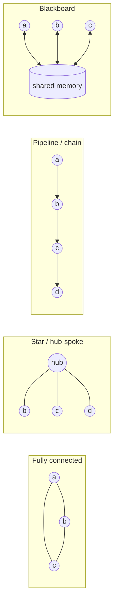
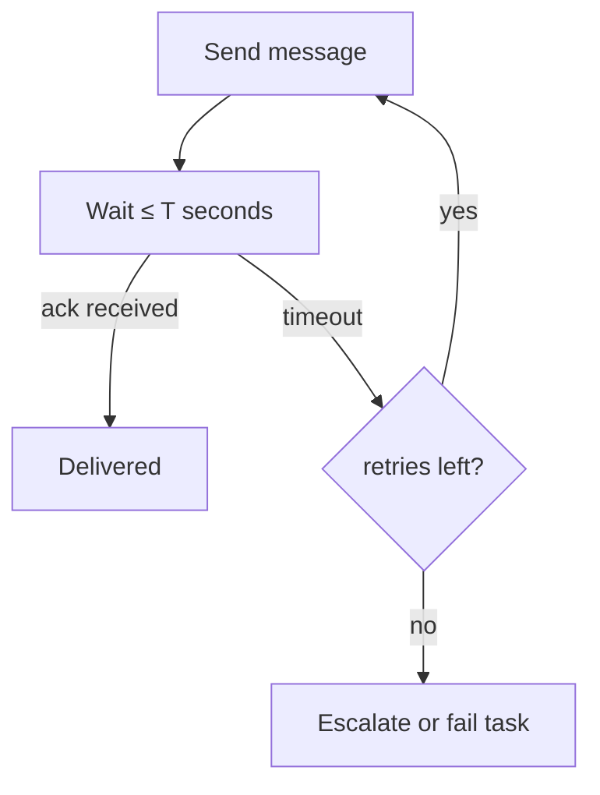
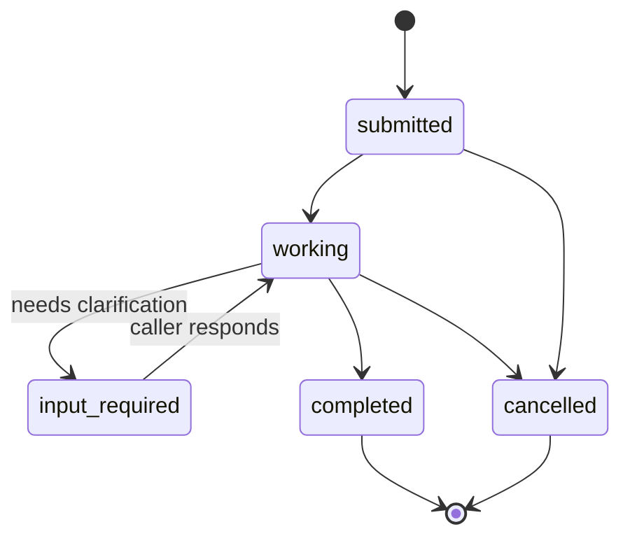
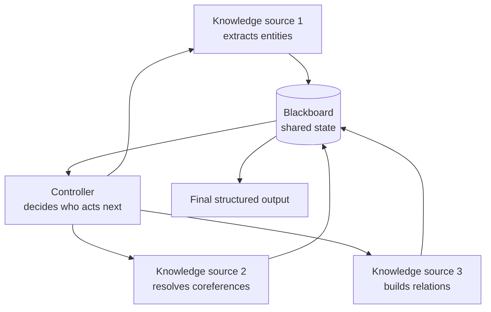

# Chapter 27: Multi-Agent Communication Patterns

> **Lead paragraph.** Two agents that cannot talk to each other are, for all practical purposes, one agent with twice the failure modes. The jump from single-agent to multi-agent systems is not a jump in capability — it is a jump in *coordination*, and coordination lives in the communication layer. This chapter is about that layer: the topologies agents use to reach each other, the message formats that make those exchanges unambiguous, the protocols that standardize them, and the hard choice between synchronous and asynchronous coordination. By the end you will understand why fully-connected topologies collapse at scale, how the Agent-to-Agent (A2A) protocol gives agents a discoverable identity, and why the blackboard pattern still wins for messy collaborative work.

---

## 1. From One Agent to Many: What Changes

A single agent has one context window, one trace, one source of error. Adding a second agent sounds like a simple multiplier — two contexts, twice the work — but it introduces a problem the single agent never faces: *agreement*. Two agents that each form a correct private answer must now reconcile into one shared outcome, and that reconciliation is the entire difficulty of multi-agent systems.

Three new concerns appear the moment a second agent exists. **Discovery** — how does one agent find another, and how does it know what the other can do? **Delivery** — once a message is sent, what guarantees that it arrives, in order, exactly once? **Timing** — does the sender wait for a reply, or fire and continue? Every pattern and protocol in this chapter is an answer to one of these three questions. Keep them in mind as the organizing frame; the proliferation of named topologies is less important than which of the three each one solves well.

---

## 2. Communication Topologies

A **topology** is the graph of who-may-talk-to-whom. It is the first design decision, because everything downstream — message volume, failure modes, debuggability — follows from it.

### 2.1 The four families



<figcaption>Figure 27.1 — The four topology families. Fully connected (left) maximizes bandwidth at O(n²) message cost; star centralizes through a hub; pipeline chains agents sequentially; blackboard decouples agents through shared memory.</figcaption>

**Fully connected.** Every agent can message every other agent directly. Maximum bandwidth, minimum latency, no single point of failure — and a message count that grows as $O(n^2)$, where the $n(n-1)/2$ term is the number of distinct agent pairs (a combinatorial count of unordered pairs, not a product). At 10 agents that is 45 channels; at 100 it is 4,950. Fully connected is right for small teams that need rich interaction and wrong for everything else.

**Star / hub-and-spoke.** A central coordinator routes all messages. Agents never talk peer-to-peer; they talk to the hub, which forwards. This scales linearly — $O(n)$ channels — and centralizes control, which makes policy enforcement and observability easy. The cost is the hub itself: it is a bottleneck on throughput and a single point of failure. Most production multi-agent systems are stars because the operational benefits outweigh the bottleneck cost, and the hub can be replicated for availability.

**Pipeline / chain.** Agents pass outputs sequentially: agent A's output is agent B's input. This is the natural topology for workflows with distinct stages — software engineering (PM → architect → coder → reviewer → tester), document processing (extract → summarize → translate). The pipeline has no coordination overhead, but it is brittle: a failure or slowness at stage $k$ blocks everything downstream. Pipelines are the topology where asynchronous execution pays off most, because stages can buffer.

**Blackboard.** Agents do not message each other at all. They read from and write to a shared memory — the blackboard — and react to what they find there. This is the most decoupled topology: agents need not even know each other exist, only the structure of the blackboard. It excels at collaborative problem-solving where no fixed sequence exists (sensor fusion, exploratory research). Its weakness is that the blackboard itself becomes the coordination problem — when does an agent write, when does it overwrite, how does it know a result is stale?

### 2.2 Choosing a topology

The choice is driven by two questions. *Does the work have a natural sequence?* If yes, a pipeline captures it. *Do agents need to react to each other's partial results?* If yes, a blackboard or star supports it; a pipeline does not. Fully connected is almost never the right production answer — it is the topology you reach for in a prototype and regret in production. A practical heuristic: start with a star, move to a blackboard when coordination gets messy, use a pipeline only when the stages are genuinely sequential and independent.

---

## 3. Message Passing

Topology decides *who* can talk. Message passing decides *how* they talk — the format, the delivery guarantees, and the failure handling.

### 3.1 A minimal message format

Every message-passing system converges on roughly the same fields. The reference chapter specifies the canonical shape:

```python
from dataclasses import dataclass
from datetime import datetime

@dataclass
class Message:
    sender: str        # agent id of the originator
    recipient: str      # agent id, "broadcast", or a topic name
    type: str           # e.g. "task", "result", "query", "error"
    payload: dict       # the actual content, structured
    timestamp: str      # ISO 8601, for ordering and debugging
    id: str             # unique message id, for dedup and replies
```

The `id` field is load-bearing and easy to underweight. It is what makes *at-least-once* delivery safe: a recipient that has already processed a message with that id discards the duplicate. Without ids, a retried delivery becomes a double-executed action — a refund issued twice, a file written twice with different content. Every production message has an id; every prototype omits it and pays for it.

### 3.2 Delivery guarantees

Three guarantees sit on a cost spectrum.

- **At-most-once** — send and forget. Messages may be lost. Cheap, appropriate for telemetry and logs where loss is tolerable.
- **At-least-once** — retries until acknowledged. Messages may be delivered multiple times; the recipient must be **idempotent** (processing the same message twice has the same effect as once). Redis Streams and SQS default here.
- **Exactly-once** — no loss, no duplication. The hardest guarantee; in practice it means at-least-once delivery plus idempotent consumers plus deduplication via message id. Kafka with idempotent producers and transactional consumers approximates it.

The trap is reaching for exactly-once by default. It is expensive and, for most agent workloads, unnecessary — the same result is achieved with at-least-once plus idempotent tool calls, which you want anyway for safety (Chapter 47). Design for idempotency; let the delivery layer be at-least-once.

### 3.3 Timeout and failure handling

A sent message that never returns is the most common multi-agent failure. The discipline is to never block forever: every message has a timeout, and a timeout triggers a defined recovery — retry, escalate, or fail the task. The Chapter 25 agent's `max_replans` bound is the same idea applied to planning: bound the wait, define the fallback.



<figcaption>Figure 27.2 — Timeout handling. Every message has a bounded wait; a timeout either retries or escalates. Unbounded waits are the most common source of hung multi-agent systems.</figcaption>

---

## 4. The Agent-to-Agent (A2A) Protocol

For most of the agent era, every multi-agent system invented its own message format. That works inside one codebase and breaks the moment agents from different vendors need to talk. The **Agent-to-Agent (A2A) protocol** is the industry attempt at a shared standard.

### 4.1 What A2A standardizes

A2A — originally contributed by Google, now hosted by the **Linux Foundation** — reached **v1.0** in its first year, with the one-year anniversary marked in April 2026. By mid-2026 it has surpassed 150 participating organizations and landed in major cloud platforms with enterprise production use. Three things it standardizes:

- **Agent Cards** — a discoverable description of what an agent can do, served at the well-known endpoint `.well-known/agent-card.json` (mirroring how web servers expose `robots.txt`). An agent finds another by fetching its card.
- **Task lifecycle** — a fixed state machine for a unit of work: `submitted → working → (input-required) → completed` or `cancelled`. The `input-required` state is the interesting one: it lets an agent pause a task to ask the caller a clarifying question, then resume.
- **Security** — OAuth2 for authorization, mutual TLS (mTLS) for transport identity, and **Signed Agent Cards** (added at v1.0) so a card's claim about an agent's capabilities is cryptographically verifiable rather than trusted on fetch.



<figcaption>Figure 27.3 — The A2A task lifecycle. The input-required state lets an agent pause a task to ask the caller a question, then resume — the protocol's answer to multi-turn clarification across agent boundaries.</figcaption>

### 4.2 A2A versus MCP — different layers

A2A is easily confused with the Model Context Protocol (MCP), covered in depth in Chapter 46. They are not competitors; they operate at different layers.

- **MCP** standardizes agent ↔ tool communication. It lets an agent call a tool (database, file system, API) through a uniform interface.
- **A2A** standardizes agent ↔ agent communication. It lets one agent delegate a task to another agent.

A single agent typically speaks both: MCP to its tools, A2A to its peers. The Chapter 46 deep dive covers the three-layer model (AG-UI for agent↔user, MCP for agent↔tool, A2A for agent↔agent); here we only need the distinction so we do not misattribute a capability to the wrong protocol.

---

## 5. Synchronous vs Asynchronous Coordination

The timing question — does a sender wait for a reply? — is the one with the sharpest trade-offs.

**Synchronous** coordination has the sender block until the recipient responds. It is predictable: the call stack mirrors the dependency graph, debugging is straightforward (you can trace a request through every agent), and correctness is easy to reason about. The cost is latency and throughput: every agent in a chain waits for the previous one, and a slow agent stalls everyone. Synchronous is right for short, critical-path interactions where correctness dominates.

**Asynchronous** coordination has the sender continue immediately, with the reply arriving later via a callback or event. It is fast and resilient — a slow agent does not block its peers, and the system degrades gracefully under load. The cost is complexity: there is no single call stack to trace, failures arrive out of order, and you must reason about partial state. Asynchronous is right for long-running or fan-out work where throughput dominates.

**Hybrid** approaches combine the two: synchronized phases with asynchronous execution *within* a phase. A multi-agent coding session might synchronize at the "review" gate (every coder waits for the reviewer) while running asynchronously within the "implement" phase (coders work in parallel). This captures most of the correctness benefit of synchronous and most of the throughput benefit of asynchronous, at the cost of a more complex coordination layer.

| Mode | Latency | Throughput | Debuggability | Best for |
|---|---|---|---|---|
| Synchronous | High (blocking) | Low | Easy (call stack) | Critical-path, short interactions |
| Asynchronous | Low | High | Hard (event tracing) | Fan-out, long-running work |
| Hybrid | Medium | Medium-high | Medium | Phased workflows with parallel stages |

---

## 6. The Blackboard Pattern in Depth

The blackboard deserves more attention than its one-line summary suggests, because it solves a class of problems the message-passing topologies handle badly: problems where the right sequence of operations is not known in advance and emerges from partial results.

In a blackboard system, agents (**knowledge sources**) watch a shared memory (the **blackboard**) for conditions they can act on. When an agent sees a state it can improve, it writes its contribution; other agents react to that, and the solution is built incrementally. A controller decides who acts when, to prevent write conflicts.



<figcaption>Figure 27.4 — The blackboard pattern. Knowledge sources write to and read from shared memory; a controller arbitrates to prevent conflicts. Agents need not know each other exist — only the structure of the blackboard.</figcaption>

The blackboard's strength is **decoupling**: agents are independent, addable, and removable without rewriting the others. Add a new knowledge source and it simply contributes when its trigger condition fires. The weakness is the controller — arbitrating concurrent writes is a hard problem, and a bad controller produces races (two agents overwriting the same slot) or livelock (agents perpetually reacting to each other). In modern systems the blackboard is often implemented on a log or stream (Kafka, Redis Streams), which gives ordering and durability for free and turns the "controller" into simple stream processing.

---

## 7. A Minimal Multi-Agent Message Bus

The Agentic Code Project implements the smallest system that exercises the real concerns: a message bus with at-least-once delivery via idempotent message ids, a star topology with a hub, synchronous request-reply and asynchronous fire-and-forget, and a timeout-driven retry. It uses the standard `LLMClient` so agents are real LLM-backed, and shows two agents coordinating through the bus.

```python
import os, time, uuid
from collections import defaultdict
from dataclasses import dataclass, field

import openai


class LLMClient:
    """OpenAI-compatible client; flips to a local Ollama endpoint."""

    def __init__(self, model="gpt-5.5", use_ollama=False):
        self.model = model
        if use_ollama:
            self.client = openai.OpenAI(
                base_url="http://localhost:11434/v1", api_key="ollama")
        else:
            self.client = openai.OpenAI(api_key=os.getenv("OPENAI_API_KEY"))

    def complete(self, prompt, temperature=0.5, max_tokens=512):
        resp = self.client.chat.completions.create(
            model=self.model,
            messages=[{"role": "user", "content": prompt}],
            temperature=temperature, max_tokens=max_tokens)
        return resp.choices[0].message.content.strip()


@dataclass
class Message:
    sender: str
    recipient: str
    type: str
    payload: dict
    id: str = field(default_factory=lambda: uuid.uuid4().hex[:12])
    timestamp: float = field(default_factory=time.time)


class MessageBus:
    """Star-topology hub with at-least-once delivery and idempotent receipt."""

    def __init__(self, timeout=5.0, retries=2):
        self.agents = {}                 # id -> Agent
        self.seen_ids = set()            # idempotency: dedup delivered messages
        self.timeout = timeout
        self.retries = retries

    def register(self, agent):
        self.agents[agent.id] = agent
        agent.bus = self

    def send(self, msg: Message, sync=True):
        """Deliver a message; if sync, block for a reply up to timeout."""
        if msg.id in self.seen_ids:        # duplicate -> at-least-once safe
            return None
        self.seen_ids.add(msg.id)
        recipient = self.agents.get(msg.recipient)
        if recipient is None:
            return None
        for attempt in range(self.retries + 1):
            try:
                reply = recipient.handle(msg, sync=sync)
                if reply is not None or not sync:
                    return reply
            except Exception:
                if attempt == self.retries:
                    return None
            time.sleep(0.1 * (attempt + 1))
        return None


class Agent:
    """A minimal agent: receives a message, may reply or fire-and-forget."""

    def __init__(self, agent_id, llm):
        self.id = agent_id
        self.llm = llm
        self.bus = None

    def handle(self, msg: Message, sync=True):
        if not sync:
            return None                  # async: act, return immediately
        answer = self.llm.complete(
            f"You are agent '{self.id}'. Answer concisely: {msg.payload.get('q')}")
        return Message(sender=self.id, recipient=msg.sender,
                       type="result", payload={"a": answer})

    def ask(self, recipient_id, question):
        """Synchronous request-reply."""
        msg = Message(sender=self.id, recipient=recipient_id,
                      type="query", payload={"q": question})
        reply = self.bus.send(msg, sync=True)
        return reply.payload["a"] if reply else None

    def tell(self, recipient_id, fact):
        """Asynchronous fire-and-forget."""
        msg = Message(sender=self.id, recipient=recipient_id,
                      type="notify", payload={"fact": fact})
        self.bus.send(msg, sync=False)


def main():
    llm = LLMClient(use_ollama=True)  # flip to False for hosted API
    bus = MessageBus(timeout=8.0, retries=2)
    asker = Agent("asker", llm)
    expert = Agent("expert", llm)
    bus.register(asker)
    bus.register(expert)

    answer = asker.ask("expert", "What is the capital of Australia?")
    print(f"expert replied: {answer}")
    asker.tell("expert", "Thanks, logging this for later.")


if __name__ == "__main__":
    main()
```

Read this project as the skeleton of every topology in the chapter. The `MessageBus` is the star hub; `send(sync=True)` is synchronous request-reply, `send(sync=False)` is asynchronous fire-and-forget; the `seen_ids` set is what makes the at-least-once delivery idempotent; the timeout loop in `send` is the bounded-wait discipline. Swap the hub's `send` for a stream append and you have a blackboard; chain agents so each only knows the next and you have a pipeline. The topologies are variations on this one loop.

---

## Summary

- The move from single- to multi-agent introduces three new problems — discovery, delivery, and timing — and every pattern and protocol is an answer to one of them.
- Four topology families trade off message cost and coordination: fully connected ($O(n^2)$, rarely right in production), star (centralized, scales linearly, hub is the bottleneck), pipeline (sequential, brittle but natural for staged workflows), and blackboard (decoupled shared memory, best for emergent sequences).
- Message passing needs an id field for idempotency; at-least-once delivery plus idempotent consumers is the practical substitute for exactly-once, which is rarely worth its cost.
- A2A (Linux Foundation, v1.0, 150+ orgs by 2026) standardizes agent↔agent communication with discoverable Agent Cards, a fixed task lifecycle including an input-required clarification state, and Signed Agent Cards for cryptographic identity — while MCP standardizes agent↔tool communication; they are different layers, not competitors.
- Synchronous coordination is debuggable but slow; asynchronous is fast but hard to trace; hybrid phased systems capture most of the benefit of each. Every message must have a bounded timeout with a defined fallback.
- The blackboard pattern decouples agents through shared memory and a controller; modern implementations use a log or stream (Kafka, Redis Streams) to get ordering and durability for free.

---

## Further Reading

- [Agent2Agent (A2A) Protocol](https://github.com/a2aproject/A2A) — Linux Foundation, 2026. Open protocol for inter-agent communication; Agent Cards, task lifecycle, Signed Agent Cards.
- [A2A Protocol Surpasses 150 Organizations](https://www.linuxfoundation.org/press/a2a-protocol-surpasses-150-organizations-lands-in-major-cloud-platforms-and-sees-enterprise-production-use-in-first-year) — Linux Foundation, 2026. First-year production adoption and cloud-platform landings.
- [Model Context Protocol](https://modelcontextprotocol.io/) — Anthropic, 2024–2025. The agent↔tool protocol; covered in depth in Chapter 46.
- [An Introduction to MultiAgent Systems](https://www.wiley.com/en-us/An+Introduction+to+MultiAgent+Systems%2C+2nd+Edition-p-9780470519462) — Wooldridge, 2009. The canonical multi-agent systems textbook; topology and coordination fundamentals.
- [Blackboard Systems](https://aaai.org/ojs/AAAI/aij/AAAI25-0099/) — Corkill, 1991. The original treatment of the blackboard architecture and its control problem.

---