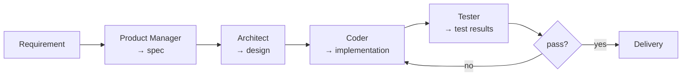
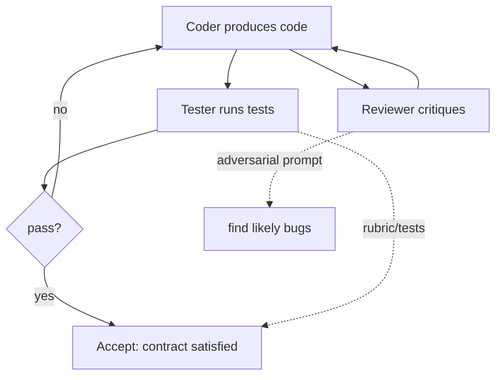
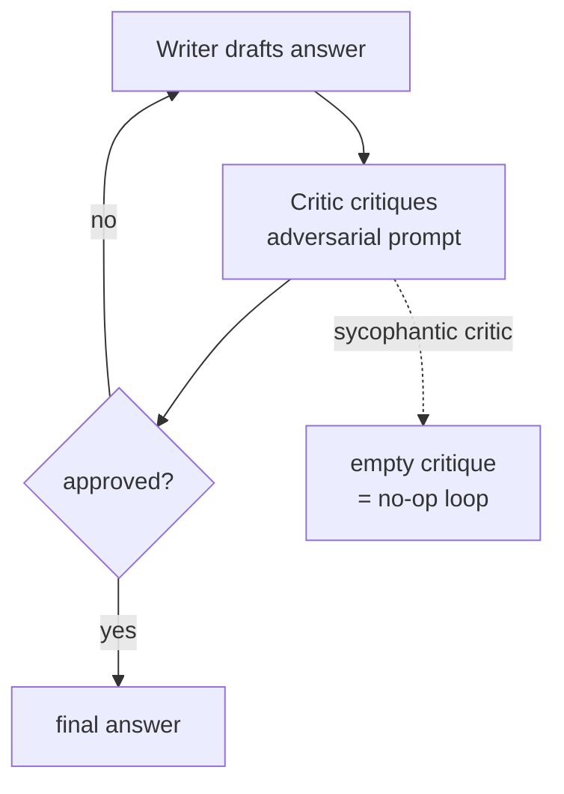

# Chapter 28: Cooperative Multi-Agent Systems

> **Lead paragraph.** Two heads are better than one only if they do different things. A team of identical agents all reasoning the same way is one agent at N times the cost. What makes a multi-agent team actually outperform a single agent is **division of labor** — distinct roles, distinct perspectives, and a mechanism that lets their partial work combine into something none could produce alone. This chapter is about cooperation: how a team of agents splits a job, specializes, and reconciles. It runs from the SOP-driven "virtual software company" of MetaGPT through role-based crews at enterprise scale (CrewAI), and lands on the simplest pattern that captures the gain — a Writer and a Critic locked in an iterative loop, which we build at the end.

---

## 1. Why Cooperate at All?

A single strong agent is a hard baseline to beat. Before accepting the overhead of a team, you should be able to name what cooperation buys. Three gains are real, and they are the only legitimate reasons to add a second agent.

**Perspective diversity.** A single agent, sampled twice, draws from the same weights and tends to make the same mistakes. Two agents prompted with different framings (one as a skeptic, one as an advocate) produce *correlated-but-different* outputs, and reconciling them cancels errors the way majority voting does (Chapter 24) — but only when the perspectives genuinely differ. Two agents with identical prompts cooperate in name only.

**Specialization.** Some subtasks are better served by a specialist. A Coder agent with a code-focused system prompt and a Reviewer agent with a security-focused prompt each do their narrow job better than one general agent doing both. The cost is coordination overhead, which is worth paying only when the specialist's edge exceeds the coordination tax.

**Capacity.** A single context window cannot hold an entire large task. Splitting the task across agents lets each hold a slice, and the team's aggregate working memory exceeds any single window. This is the argument behind the planner-agent of Chapter 25, generalized to multiple agents.

If your use case is none of these, cooperation is overhead. The discipline is to verify the gain: a two-agent system that does not measurably beat a single agent on the same task is a single agent you are paying twice for.

---

## 2. Division of Labor and Role Design

Cooperation starts with role assignment. The central question is whether roles are **fixed** (assigned at design time) or **emergent** (developed at runtime).

### 2.1 Fixed roles: the SOP approach

**MetaGPT** structures multi-agent work around Standard Operating Procedures borrowed from human software companies. A task enters as a requirement; a Product Manager agent turns it into a spec; an Architect agent designs the system; a Coder agent implements; a Tester agent verifies. Each role is a fixed prompt with a fixed responsibility, and the handoff between roles is a structured artifact (spec → design → code → tests) rather than free chat.

The strength of the SOP approach is predictability. Because roles and handoffs are fixed, you know what each agent will produce and in what order — which makes the system debuggable and auditable. The weakness is rigidity: an SOP that does not match the task forces work into the wrong shape. SOPs work best for *recurring* workflows (software development, document review) where the structure is stable and only the content varies.



<figcaption>Figure 28.1 — MetaGPT's SOP-driven workflow. Roles are fixed, handoffs are structured artifacts (spec, design, code, tests), and a failing test loops back to the Coder — the review loop is encoded directly in the topology.</figcaption>

### 2.2 Emergent specialization

The more remarkable phenomenon is **emergent specialization**: agents that begin identical and, through interaction, develop distinct roles without anyone assigning them. The CAMEL framework demonstrated this with two agents given a single shared task and a communication channel: over many turns, one agent tended to take the lead and the other to follow, even though both ran the same prompt.

Emergence is appealing because it removes the need to design roles in advance, but it is also the harder mode to control. An emergent team that specializes badly (both agents converge on the same sub-task, leaving the rest undone) fails silently. Fixed roles fail loudly (a missing artifact breaks the handoff); emergent roles fail quietly. For production, prefer fixed roles and reserve emergence for exploration where you can afford to discard a bad run.

---

## 3. Frameworks: From Research to Enterprise

The cooperative pattern moved from research demos to enterprise production between 2023 and 2026. Three frameworks mark the trajectory.

<figure>
<svg width="100%" viewBox="0 0 820 220" xmlns="http://www.w3.org/2000/svg">
  <rect x="0" y="0" width="820" height="220" fill="#ffffff"/>
  <line x1="60" y1="120" x2="760" y2="120" stroke="#333333" stroke-width="2"/>
  <text x="60" y="150" font-family="sans-serif" font-size="12" fill="#666666" text-anchor="middle">2023</text>
  <text x="290" y="150" font-family="sans-serif" font-size="12" fill="#666666" text-anchor="middle">2024</text>
  <text x="520" y="150" font-family="sans-serif" font-size="12" fill="#666666" text-anchor="middle">2025</text>
  <text x="750" y="150" font-family="sans-serif" font-size="12" fill="#666666" text-anchor="middle">2026</text>
  <line x1="60" y1="115" x2="60" y2="125" stroke="#333333" stroke-width="2"/>
  <line x1="290" y1="115" x2="290" y2="125" stroke="#333333" stroke-width="2"/>
  <line x1="520" y1="115" x2="520" y2="125" stroke="#333333" stroke-width="2"/>
  <line x1="750" y1="115" x2="750" y2="125" stroke="#333333" stroke-width="2"/>
  <circle cx="90" cy="120" r="6" fill="#534AB7"/>
  <text x="90" y="95" font-family="sans-serif" font-size="11" fill="#534AB7" text-anchor="middle">MetaGPT</text>
  <text x="90" y="108" font-family="sans-serif" font-size="10" fill="#534AB7" text-anchor="middle">SOP crews</text>
  <circle cx="140" cy="120" r="6" fill="#534AB7"/>
  <text x="140" y="75" font-family="sans-serif" font-size="11" fill="#534AB7" text-anchor="middle">ChatDev</text>
  <text x="140" y="88" font-family="sans-serif" font-size="10" fill="#534AB7" text-anchor="middle">communicative</text>
  <circle cx="190" cy="120" r="6" fill="#534AB7"/>
  <text x="190" y="95" font-family="sans-serif" font-size="11" fill="#534AB7" text-anchor="middle">AutoGen</text>
  <text x="190" y="108" font-family="sans-serif" font-size="10" fill="#534AB7" text-anchor="middle">conversation</text>
  <circle cx="540" cy="120" r="6" fill="#0F6E56"/>
  <text x="540" y="180" font-family="sans-serif" font-size="11" fill="#0F6E56" text-anchor="middle">CrewAI v1.0 GA</text>
  <text x="540" y="193" font-family="sans-serif" font-size="10" fill="#0F6E56" text-anchor="middle">1.4B automations</text>
  <circle cx="600" cy="120" r="6" fill="#0F6E56"/>
  <text x="600" y="165" font-family="sans-serif" font-size="11" fill="#0F6E56" text-anchor="middle">AG2 Beta</text>
  <text x="600" y="178" font-family="sans-serif" font-size="10" fill="#0F6E56" text-anchor="middle">MemoryStream</text>
  <circle cx="740" cy="120" r="6" fill="#993C1D"/>
  <text x="740" y="180" font-family="sans-serif" font-size="11" fill="#993C1D" text-anchor="middle">ChatDev 2.0</text>
  <text x="740" y="193" font-family="sans-serif" font-size="10" fill="#993C1D" text-anchor="middle">zero-code</text>
  <circle cx="370" cy="40" r="5" fill="#534AB7"/>
  <text x="382" y="44" font-family="sans-serif" font-size="11" fill="#534AB7">research origins</text>
  <circle cx="510" cy="40" r="5" fill="#0F6E56"/>
  <text x="522" y="44" font-family="sans-serif" font-size="11" fill="#0F6E56">enterprise production</text>
</svg>
<figcaption>Figure 28.4 — The cooperative-framework trajectory, 2023–2026. Research origins (purple) established role-based and conversational patterns; enterprise production (teal/coral) hardened them for scale — CrewAI v1.0 GA and 1.4B automations, AG2 Beta, and ChatDev 2.0's zero-code platform.</figcaption>
</figure>

### 3.1 MetaGPT and ChatDev — the research origins

**MetaGPT** (2023) introduced the SOP-driven virtual software company. **ChatDev** (2023) took a lighter approach: a communicative agents framework where a "virtual company" of agents collaborates through structured chat to build software. Both demonstrated that role-based multi-agent teams could produce working software end-to-end, which was striking in 2023.

**ChatDev 2.0** ("DevAll"), released by OpenBMB on January 7, 2026, marked a shift in *how* teams are built. It turned ChatDev from a rigid virtual-company simulation into a **zero-code multi-agent orchestration platform**: teams are composed on a visual canvas without writing code, making multi-agent system construction accessible to non-programmers. By 2026 ChatDev had crossed 30k GitHub stars, reflecting the demand for lower-friction multi-agent authoring.

### 3.2 CrewAI — role-based crews at enterprise scale

**CrewAI** takes the role-based idea and hardens it for production. A **crew** is a team of agents, each with a defined role, goal, and backstory, plus the tools that role is allowed to use. CrewAI OSS reached **v1.0 GA in 2025**, and the company reports that open-source core powering **1.4 billion agentic automations** across large enterprises — by far the strongest evidence that role-based multi-agent systems crossed into production use. (The CrewAI changelog shows v1.2.1 on October 27, 2025, confirming active iteration through the year.)

CrewAI's contribution is operational rather than algorithmic: it made role-based crews easy to define, deploy, and govern, which is what translated the research pattern into the 1.4B-automation footprint. Role-based access control, enterprise observability, and tool scoping per role are the features that made cooperation safe enough to run in production.

### 3.3 AutoGen → AG2 — the conversational lineage

**AutoGen** (2023) framed multi-agent cooperation as multi-agent conversation: agents exchange messages, and the conversation itself is the coordination mechanism. Its successor **AG2** (Beta) carries this forward with a **MemoryStream** pub/sub model and event-driven agent groups, addressing AutoGen's original weaknesses around state management and real-time interaction. AutoGen itself moved to maintenance mode in early 2026, with AG2 and the Microsoft Agent Framework (Chapter 31) as the recommended successors.

---

## 4. Multi-Agent Software Engineering

The most developed application of cooperative agents is software engineering, because it has a natural role structure (PM, architect, coder, reviewer, tester) and a natural verification signal (tests pass or they do not). Two ideas from this domain generalize to all cooperative work.

### 4.1 Code review as inter-agent feedback

A **Reviewer** agent that critiques a **Coder** agent's output is the simplest and most effective inter-agent feedback loop. The Coder produces an artifact; the Reviewer produces critique; the Coder revises. This is the Writer-Critic pattern (built at the end of this chapter) applied to code. Its power is that the Critic's perspective is structurally different from the Writer's — the Writer is optimizing for "does it work," the Critic for "is it good" — so the loop converges on artifacts that satisfy both.

The failure mode is a **sycophantic Critic**: a Reviewer that rubber-stamps the Coder's output because both share the same model weights and the same biases. The defense is to give the Critic a genuinely adversarial system prompt ("find the three most likely bugs") and to verify the loop actually changes outputs — if the Coder's first and second drafts are identical, the Critic added nothing.

### 4.2 Tests as contracts between agents

In test-driven multi-agent development, the **Tester** agent's tests serve as a contract between agents. The Coder's work is not accepted on the Coder's say-so; it is accepted only when the Tester's tests pass. This converts trust between agents into a verifiable signal — the same move as using a verifier in test-time scaling (Chapter 20), but here the verifier is another agent.

The discipline matters when agents produce artifacts that are hard to inspect directly (large code, long documents). A test or a rubric converts "is this good" into "does this pass the check," which is machine-verifiable and removes the need for one agent to trust another's self-assessment.



<figcaption>Figure 28.2 — Two inter-agent feedback loops in multi-agent software engineering. The Reviewer loop refines quality; the Tester loop is the acceptance contract. Note the adversarial prompt on the Reviewer — without it the Critic rubber-stamps.</figcaption>

---

## 5. Reconciling Agents: From Outputs to a Shared Answer

Division of labor produces *many* partial outputs. The reconciliation step — turning many partials into one shared answer — is where most cooperative systems are weakest. Three reconciliation strategies, in order of cost.

**Sequential handoff.** Each agent's output is the next agent's input (the pipeline topology from Chapter 27). Reconciliation is implicit: the last agent's output *is* the answer. Cheap, but errors propagate forward — a bad spec becomes a bad design becomes bad code.

**Aggregation.** Multiple agents produce candidate answers; an aggregator combines them. This is the consensus machinery of Chapter 24 (Aegean quorum, majority vote, weighted merge) applied to agents instead of samples. Expensive, but cancels correlated errors when agents are genuinely diverse.

**Debate.** Agents argue their positions and revise in light of others' arguments, converging (ideally) on a shared answer. Debate is the most powerful reconciliation — it exposes the reasoning behind disagreement, not just the disagreement itself — but it is the most expensive and the hardest to terminate (Chapter 29 covers debate formally).



<figcaption>Figure 28.3 — The Writer-Critic cooperation loop. The Critic's adversarial prompt is what makes the loop do work; a sycophantic Critic that returns empty critique reduces the team to a single Writer at twice the cost. Detect this failure when the first draft equals the final.</figcaption>
|---|---|---|---|
| Sequential handoff | Low | Errors propagate | Linear, well-structured workflows |
| Aggregation | Medium | Correlated errors cancel | Independent parallel attempts |
| Debate | High | Exposes reasoning behind disagreement | High-stakes, ambiguous problems |

The aggregation strategy, where $N$ agents each produce a candidate answer and a weighted combination picks the winner, is short enough to show directly:

```python
def aggregate(candidates, scores):
    """Pick the highest-scoring candidate from N agents."""
    ranked = sorted(zip(candidates, scores), key=lambda pair: pair[1], reverse=True)
    return ranked[0][0]  # best candidate wins; ties broken by order

# three Reviewer agents scored one design proposal differently
designs = ["design_A", "design_B", "design_C"]
scores  = [0.61, 0.83, 0.79]   # from per-agent evaluators
chosen = aggregate(designs, scores)  # -> "design_B"
```

The $0.83$ winning score is a scalar the aggregator compares (the `pair[1]` lookup pulls each candidate's scalar score for the sort); the same structure with a softmax over scores gives a soft weighted merge instead of hard selection, which is the AGoT-style aggregation from Chapter 24.

---

## 6. Agentic Code Project: A Writer-Critic Cooperative Loop

This project implements the simplest cooperation that beats a single agent: a **Writer** that drafts an answer and a **Critic** that adversarially critiques it, looping until the Critic approves or a bound is hit. The two agents share a model backend (the standard `LLMClient` with `use_ollama`), but their system prompts differ — the Critic is explicitly adversarial, which is what makes the loop do work. The project measures whether the two-agent loop produces a better-verified answer than the Writer alone.

```python
import os
from dataclasses import dataclass

import openai


class LLMClient:
    """OpenAI-compatible client; flips to a local Ollama endpoint."""

    def __init__(self, model="gpt-5.5", use_ollama=False):
        self.model = model
        if use_ollama:
            self.client = openai.OpenAI(
                base_url="http://localhost:11434/v1", api_key="ollama")
        else:
            self.client = openai.OpenAI(api_key=os.getenv("OPENAI_API_KEY"))

    def chat(self, system, user, temperature=0.6, max_tokens=512):
        resp = self.client.chat.completions.create(
            model=self.model,
            messages=[{"role": "system", "content": system},
                      {"role": "user", "content": user}],
            temperature=temperature, max_tokens=max_tokens)
        return resp.choices[0].message.content.strip()


@dataclass
class Critique:
    approved: bool
    feedback: str


class Writer:
    """Drafts an answer; revises given critique."""

    def __init__(self, llm):
        self.llm = llm
        self.system = ("You are a careful writer. Produce a precise, "
                       "concise answer to the question. If given prior "
                       "critique, revise to address every point raised.")

    def draft(self, question, prior_critique=""):
        user = f"Question: {question}\n"
        if prior_critique:
            user += f"Prior critique to address:\n{prior_critique}\n"
        user += "Write your best answer."
        return self.llm.chat(self.system, user, temperature=0.7)


class Critic:
    """Adversarially critiques the writer's draft."""

    def __init__(self, llm):
        self.llm = llm
        self.system = ("You are a strict critic. Find the THREE most likely "
                       "flaws in the answer (factual errors, missing cases, "
                       "weak reasoning). If there are no real flaws, reply "
                       "exactly 'APPROVED'. Otherwise list the flaws.")

    def critique(self, question, draft):
        user = f"Question: {question}\nAnswer to critique:\n{draft}"
        text = self.llm.chat(self.system, user, temperature=0.3)
        if text.strip().upper().startswith("APPROVED"):
            return Critique(True, "")
        return Critique(False, text)


class WriterCriticTeam:
    """Cooperative loop: write, critique, revise, until approved or bound."""

    def __init__(self, llm, max_rounds=3):
        self.writer = Writer(llm)
        self.critic = Critic(llm)
        self.max_rounds = max_rounds

    def run(self, question):
        draft = self.writer.draft(question)
        history = [(draft, None)]
        for _ in range(self.max_rounds):
            crit = self.critic.critique(question, draft)
            history[-1] = (draft, crit.feedback)
            if crit.approved:
                return {"answer": draft, "rounds": len(history),
                        "approved": True, "history": history}
            draft = self.writer.draft(question, prior_critique=crit.feedback)
            history.append((draft, None))
        # bound reached: return best draft with last critique
        crit = self.critic.critique(question, draft)
        history[-1] = (draft, crit.feedback)
        return {"answer": draft, "rounds": self.max_rounds,
                "approved": crit.approved, "history": history}


def main():
    llm = LLMClient(use_ollama=True)  # flip to False for hosted API
    team = WriterCriticTeam(llm, max_rounds=3)
    question = ("Explain in 3 sentences why a transformer model can handle "
                "variable-length input sequences.")
    result = team.run(question)
    print(f"Approved: {result['approved']} after {result['rounds']} round(s)")
    print(f"Final answer:\n{result['answer']}")
    for i, (draft, fb) in enumerate(result["history"], 1):
        print(f"\n--- round {i} draft ---\n{draft[:200]}...")
        if fb:
            print(f"--- critique ---\n{fb[:200]}...")


if __name__ == "__main__":
    main()
```

The evaluation question this project answers — does the team beat a single Writer? — is checkable: run the same question with the Writer alone and with the team, and have a third LLM (or a human) grade both answers. The team wins when the Critic catches a real flaw the Writer would have shipped. The team wastes money when the Critic is sycophantic — detectable because the first draft equals the final draft and `approved` flips on round one with empty feedback.

---

## Summary

- Cooperate only when cooperation buys perspective diversity, specialization, or capacity; a two-agent system that does not beat a single agent is a single agent at twice the cost. Verify the gain, do not assume it.
- Fixed roles (MetaGPT's SOPs) are predictable and debuggable but rigid; emergent specialization (CAMEL) removes design burden but fails silently. Production prefers fixed roles; exploration can afford emergence.
- The framework trajectory ran from research (MetaGPT, ChatDev, AutoGen — 2023) to enterprise (CrewAI OSS v1.0 GA in 2025 powering 1.4B automations; ChatDev 2.0 "DevAll" zero-code platform Jan 2026; AutoGen → AG2 with MemoryStream pub/sub) — the pattern crossed into production as tooling made crews safe to govern.
- Two inter-agent feedback loops dominate software engineering: adversarial code review (Reviewer critiques Coder) and tests-as-contracts (Tester's passing tests accept the Coder's work). Both convert inter-agent trust into verifiable signals.
- Reconciliation strategies trade cost for power: sequential handoff (cheap, errors propagate), aggregation (medium, cancels correlated errors), debate (expensive, exposes reasoning behind disagreement). Pick by problem structure, not by fashion.

---

## Further Reading

- [MetaGPT: Meta Programming for a Multi-Agent Collaborative Framework](https://arxiv.org/abs/2308.00352) — Hong et al., 2023. SOP-driven virtual software company; structured handoffs as artifacts.
- [ChatDev: Communicative Agents for Software Development](https://arxiv.org/abs/2307.07924) — Qian et al., 2023. The communicative-agents virtual company; basis for ChatDev 2.0.
- [ChatDev 2.0 (DevAll)](https://github.com/OpenBMB/ChatDev) — OpenBMB, Jan 2026. Zero-code visual multi-agent orchestration platform.
- [CrewAI OSS 1.0 — We Are Going GA](https://blog.crewai.com/crewai-oss-1-0-we-are-going-ga/) — CrewAI, 2025. Role-based crews powering 1.4 billion agentic automations at enterprise scale.
- [CAMEL: Communicative Agents for "Mind" Exploration of Large Language Model Society](https://arxiv.org/abs/2303.17760) — Li et al., 2023. Emergent role specialization through agent interaction.
- [AutoGen: Enabling Next-Gen LLM Applications via Multi-Agent Conversation](https://arxiv.org/abs/2308.08155) — Wu et al., 2023. The conversational multi-agent lineage succeeded by AG2.

---