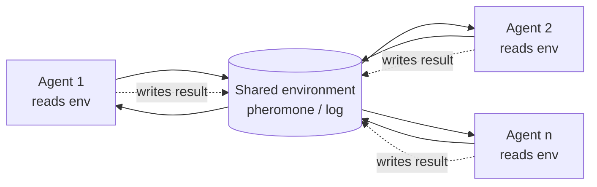
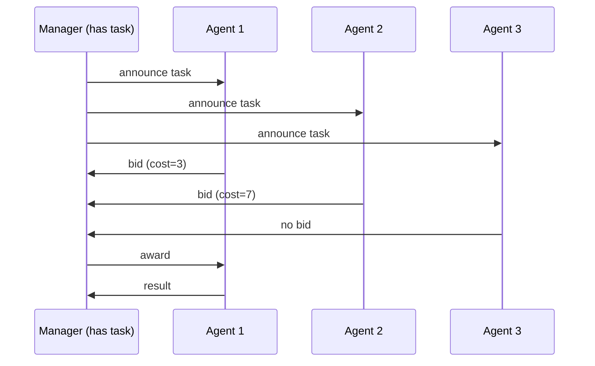
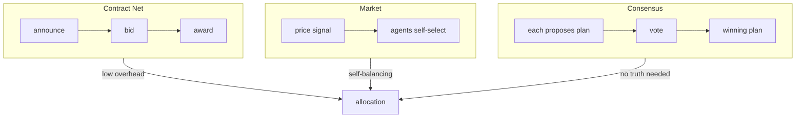

# Chapter 30: Agent Swarms and Decentralized Systems

> **Lead paragraph.** A star topology dies when the hub dies. A swarm has no hub to kill. Decentralized multi-agent systems — swarms — coordinate through local rules and a shared environment, with no central leader, and the collective behavior emerges from interactions no single agent is aware of. This chapter is about that style of coordination: stigmergy (agents communicating by modifying their environment), swarm architectures for LLMs, and the market and auction mechanisms that let a leaderless population allocate work. By the end you will see why robustness is a swarm's defining property, why stigmergy is the trick that makes large swarms cheap to run, and why market-based allocation sounds efficient but hides a truthfulness problem.

---

## 1. What Makes a System a Swarm

A **swarm** is a multi-agent system with three properties that distinguish it from the cooperative teams of Chapter 28. **Decentralized control** — there is no leader; no agent issues commands to others. **Local interaction** — each agent communicates only with neighbors or with a shared environment, never with the whole population. **Emergence** — the collective behavior is not present in any single agent's rules; it arises from their interaction.

The payoff for accepting these constraints is **robustness**. A cooperative team with a central coordinator (Chapter 28's star topology) fails when the coordinator fails. A swarm has no coordinator; if one agent crashes, the others continue, because no agent's behavior depended on that specific peer. The system degrades gracefully rather than catastrophically. This is why swarms dominate in environments where individual agents are unreliable — large deployments, hostile networks, long-running autonomous tasks where agent mortality is a given, not an exception.

The cost is **opacity**. Because collective behavior is emergent, a swarm is hard to debug and hard to steer. There is no single place to insert a fix; changing the outcome means changing the local rules and re-running. Swarms trade controllability for robustness, and the design question is always whether your problem can tolerate that trade.

---

## 2. Stigmergy: Coordination Through the Environment

### 2.1 The ant-colony mechanism

The biological inspiration is precise. Ants find short paths to food not by computing the shortest path but by **stigmergy** — indirect coordination through environmental modification. Each ant deposits a pheromone as it walks; other ants preferentially follow stronger pheromone trails; shorter paths get traversed more often, accumulate more pheromone, and attract more ants; longer paths lose pheromone to evaporation. The colony converges on good paths without any ant knowing the global map or even that a path is being optimized.

The mechanism is attractive for artificial swarms because it is **local and asynchronous**. No ant needs to know about other ants directly; each reads only the pheromone field, a shared environmental signal. This scales: the per-agent cost is constant in the population size, because an agent interacts with the *environment*, not with $n-1$ peers. The $O(n^2)$ message cost of fully-connected communication (Chapter 27) becomes $O(n)$ environmental reads and writes.

### 2.2 Digital stigmergy

The same idea transplants to LLM agents by replacing the pheromone field with a shared memory — a key-value store, a log, a stream. Agents write partial results and read what others have written, reacting to the current state of the shared memory rather than to messages addressed to them. The Chapter 24 SwarmSys system is the explicit implementation: validated traces receive a pheromone increment, unvalidated traces decay, and future exploration is biased toward neighborhoods that have historically paid off.



<figcaption>Figure 30.1 — Digital stigmergy. Agents never address each other; they read and write a shared environment. Each agent's cost is constant in population size (it talks to the environment, not to n peers), which is what makes large swarms cheap.</figcaption>

The pheromone update from Chapter 24 carries the whole mechanism:

$$\phi_{t+1} = \rho\, \phi_t + \Delta \cdot \mathbb{1}[\text{validated at } t]$$

where the $\rho\, \phi_t$ term is scalar-times-scalar decay (a constant multiplicative shrink applied each round) and the indicator gates whether a deposit lands. The decay rate $\rho$ is the knob: high $\rho$ (slow decay) gives the swarm a long memory and slow adaptation; low $\rho$ (fast decay) makes it responsive but forgetful. Tuning $\rho$ to the problem's timescale is the single most important design decision in a stigmergic system.

The one-line update makes the decay/deposit trade-off concrete:

```python
import numpy as np

def pheromone_step(field, rho, deposits, validated_mask):
    # field: pheromone vector over candidates (one entry per candidate)
    # rho * field_t: scalar-times-scalar decay (the rho phi_t term)
    # deposits * mask: only validated candidates get the increment this round
    return rho * field + deposits * validated_mask.astype(float)
```

### 2.3 The risk: poisoned environment

Stigmergy's strength — that agents trust the environment — is also its weakness. A poisoned pheromone field misleads every agent that reads it. If a Validator is wrong (Chapter 24's concern) or an attacker writes a strong false trail, the swarm converges on the wrong answer, and because the behavior is emergent, the wrong answer is hard to trace to a single cause. The defense is environmental integrity: versioning, signatures on writes, and decay rates fast enough that a single bad deposit cannot dominate. This is the same memory-integrity problem Chapter 65 treats at length.

---

## 3. Swarm Architectures for LLMs

### 3.1 Role-based swarms

SwarmSys (October 2025, covered in Chapter 24) fixes three roles — Explorer, Worker, Validator — and a pheromone field. The role structure is what makes the swarm *useful* rather than chaotic: Explorers generate breadth cheaply, Workers refine promising traces, Validators gate quality. Without role differentiation, a swarm of identical agents reading the same environment tends to converge on the first plausible answer (a stigmergic version of sycophantic convergence from Chapter 29) and stops exploring.

### 3.2 Particle Swarm Optimization for LLMs

**Particle Swarm Optimization (PSO)** is the other classic swarm algorithm, transplanting to multi-LLM systems. In PSO each **particle** (agent) has a position in a solution space and a velocity; at each step it updates its position by combining three pulls: its current velocity, its personal best-so-far, and the swarm's global best-so-far.

$$v_{i,t+1} = \omega\, v_{i,t} + c_1 r_1 (p_i - x_{i,t}) + c_2 r_2 (g - x_{i,t})$$

where the $\omega\, v_{i,t}$ term is scalar-times-vector (inertia, the previous velocity scaled by an inertia weight), the $c_1 r_1 (p_i - x_{i,t})$ term pulls the particle toward its personal best $p_i$ (the difference is a vector, scaled by a cognitive weight $c_1$ and a random $r_1$), and the $c_2 r_2 (g - x_{i,t})$ term pulls toward the global best $g$ (scaled by a social weight $c_2$). The random terms $r_1, r_2$ are what keep the swarm exploring rather than collapsing immediately onto the first best found.

For LLMs, "position" becomes a candidate solution (a prompt, a draft, a plan); "personal best" and "global best" are the highest-scored candidates an agent and the swarm have seen. PSO over LLMs treats the model's outputs as positions in a solution space and lets the swarm collectively hill-climb toward good outputs, with the social pull ($c_2$) propagating discoveries across the population. The trade-off versus stigmergy: PSO requires each particle to know the global best, which is a weak centralization (a shared read), whereas stigmergy needs only local reads.

---

## 4. Decentralized Task Allocation

A leaderless population still has to decide *who does what*. Three mechanisms solve this without a central scheduler.

### 4.1 Contract Net Protocol

The **Contract Net Protocol** (Smith, 1980) is the classic auction: an agent with a task **announces** it; interested agents **bid** with their estimated cost or capability; the announcer **awards** the task to the best bid. No central scheduler decides; the allocation emerges from the bids.



<figcaption>Figure 30.2 — The Contract Net Protocol. The manager announces, agents bid, the lowest-cost bid wins. No central scheduler assigns work; allocation emerges from the bids themselves.</figcaption>

Contract Net is simple and effective, but it assumes **truthful bidding** — agents report their real cost. An agent that underbids to win work it cannot do well breaks the allocation. In open swarms where agents may have different owners, truthfulness cannot be assumed, which is why real systems add reputation, deposits, or post-hoc verification.

### 4.2 Market-based allocation

Market mechanisms generalize Contract Net to continuous allocation: agents **bid** on tasks (or resources) with a notional currency, and a market-clearing price matches supply to demand. Tasks go to the agents that value them most (or can do them cheapest), and the price mechanism balances load automatically — a busy agent's bids rise, steering work to idle agents.

The appeal is **self-organization under load**: no one assigns work, yet the system balances itself. The difficulty is the same truthfulness problem, plus a new one — currency design. What do agents bid *with*? If it is a real resource (compute, money), agents that start rich dominate; if it is an artificial token, its value must be managed to prevent inflation or hoarding. Market mechanisms are powerful but require a careful economic design that the auction does not.

### 4.3 Consensus-based allocation

Consensus allocation has agents **agree** on the allocation rather than bidding for it. Each agent proposes a complete assignment; the swarm votes (Chapter 24's consensus machinery) on which proposal to use. This avoids the truthfulness problem — no agent reports a private cost — but at the cost of voting overhead and the assumption that agents can evaluate each other's proposals, which is itself a verifier problem.

| Mechanism | Truthful needed? | Overhead | Load balancing | Best for |
|---|---|---|---|---|
| Contract Net | Yes (bids) | Low | Per-task | Predictable, well-specified tasks |
| Market | Yes (prices) | Medium | Automatic, continuous | Continuous, dynamic load |
| Consensus | No | High (voting) | By agreed proposal | Heterogeneous, hard-to-cost tasks |



<figcaption>Figure 30.4 — The three allocation mechanisms at a glance. Contract Net is a discrete announce-bid-award auction; the market clears continuously via price; consensus sidesteps truthfulness by having agents evaluate each other's proposals rather than report private costs.</figcaption>

---

## 5. Robustness and Failure Modes

### 5.1 Graceful degradation

The swarm's defining advantage is that individual failures do not stop the system. If an agent crashes mid-task in a cooperative team with a central coordinator, the coordinator must detect the failure and reassign — a special case that has to be handled. In a swarm, the failed agent simply stops writing to the environment; the decay term in the pheromone update ($\rho\, \phi_t$) erases its influence over time, and other agents pick up the work. No special-case handling is required, because the failure looks identical to an agent that simply stopped finding anything useful.

This is why swarms suit long-running, unreliable deployments. The expected number of agent failures over a million-step task (Chapter 24's MDAP scale) is high; a topology that requires every agent to survive is infeasible, while a swarm that degrades gracefully is not.

### 5.2 Emergent misbehavior

The flip side of emergence is **emergent misbehavior** — collective patterns that no agent intended and no agent can see. A swarm can converge on a local optimum (every agent confident in an answer that is wrong), oscillate (two clusters of agents reinforcing conflicting trails), or stall (the pheromone field flattens and exploration stops). These are not bugs in any agent; they are properties of the interaction. Chapter 35 covers detecting them; the prevention strategy is to monitor the *population-level* signals (diversity of traces, pheromone distribution, agreement over time) rather than any single agent's output.

<figure>
<svg width="100%" viewBox="0 0 820 260" xmlns="http://www.w3.org/2000/svg">
  <rect x="0" y="0" width="820" height="260" fill="#ffffff"/>
  <!-- centralized: hub failure kills all -->
  <text x="180" y="30" font-family="sans-serif" font-size="13" fill="#534AB7" text-anchor="middle" font-weight="bold">Centralized (star)</text>
  <circle cx="180" cy="120" r="16" fill="#993C1D"/>
  <text x="180" y="124" font-family="sans-serif" font-size="11" fill="#ffffff" text-anchor="middle">hub</text>
  <line x1="180" y1="104" x2="120" y2="60" stroke="#993C1D" stroke-width="2"/>
  <line x1="180" y1="104" x2="240" y2="60" stroke="#993C1D" stroke-width="2"/>
  <line x1="180" y1="136" x2="120" y2="180" stroke="#993C1D" stroke-width="2"/>
  <line x1="180" y1="136" x2="240" y2="180" stroke="#993C1D" stroke-width="2"/>
  <circle cx="120" cy="55" r="8" fill="#999999"/>
  <circle cx="240" cy="55" r="8" fill="#999999"/>
  <circle cx="120" cy="185" r="8" fill="#999999"/>
  <circle cx="240" cy="185" r="8" fill="#999999"/>
  <text x="180" y="225" font-family="sans-serif" font-size="11" fill="#993C1D" text-anchor="middle">hub fails → all stop</text>
  <!-- decentralized: one fails, rest continue -->
  <text x="600" y="30" font-family="sans-serif" font-size="13" fill="#0F6E56" text-anchor="middle" font-weight="bold">Decentralized (swarm)</text>
  <circle cx="600" cy="60" r="9" fill="#0F6E56"/>
  <circle cx="540" cy="100" r="9" fill="#0F6E56"/>
  <circle cx="660" cy="100" r="9" fill="#0F6E56"/>
  <circle cx="520" cy="160" r="9" fill="#0F6E56"/>
  <circle cx="600" cy="180" r="9" fill="#999999"/>
  <circle cx="680" cy="160" r="9" fill="#0F6E56"/>
  <line x1="600" y1="60" x2="540" y2="100" stroke="#0F6E56" stroke-width="1.5"/>
  <line x1="600" y1="60" x2="660" y2="100" stroke="#0F6E56" stroke-width="1.5"/>
  <line x1="540" y1="100" x2="520" y2="160" stroke="#0F6E56" stroke-width="1.5"/>
  <line x1="660" y1="100" x2="680" y2="160" stroke="#0F6E56" stroke-width="1.5"/>
  <line x1="520" y1="160" x2="600" y2="180" stroke="#0F6E56" stroke-width="1.5"/>
  <line x1="680" y1="160" x2="600" y2="180" stroke="#0F6E56" stroke-width="1.5"/>
  <circle cx="600" cy="180" r="14" fill="none" stroke="#993C1D" stroke-width="2" stroke-dasharray="3 3"/>
  <text x="600" y="225" font-family="sans-serif" font-size="11" fill="#0F6E56" text-anchor="middle">one fails → rest continue</text>
</svg>
<figcaption>Figure 30.3 — Centralized versus decentralized failure modes. A star topology has a single point of failure: the hub dies, everything stops. A swarm has no hub; a failed agent simply stops contributing, and the pheromone decay erases its influence over time while the rest continue.</figcaption>
</figure>

---

## 6. Agentic Code Project: A Stigmergic Swarm with Contract Net Allocation

This project combines the chapter's two mechanisms — stigmergy and decentralized allocation — into a small runnable swarm. A shared environment holds tasks and a pheromone field; agents use the Contract Net Protocol to claim tasks (the lowest-bid agent wins) and deposit pheromone on successful completions, which decays each round. It uses the standard `LLMClient` so agents genuinely solve subtasks, and shows the swarm degrading gracefully when one agent is removed.

```python
import os, math
from dataclasses import dataclass, field

import openai


class LLMClient:
    """OpenAI-compatible client; flips to a local Ollama endpoint."""

    def __init__(self, model="gpt-5.5", use_ollama=False):
        self.model = model
        if use_ollama:
            self.client = openai.OpenAI(
                base_url="http://localhost:11434/v1", api_key="ollama")
        else:
            self.client = openai.OpenAI(api_key=os.getenv("OPENAI_API_KEY"))

    def complete(self, prompt, temperature=0.5, max_tokens=256):
        resp = self.client.chat.completions.create(
            model=self.model,
            messages=[{"role": "user", "content": prompt}],
            temperature=temperature, max_tokens=max_tokens)
        return resp.choices[0].message.content.strip()


@dataclass
class Task:
    id: str
    description: str
    done: bool = False
    pheromone: float = 1.0   # stigmergic signal: how rewarding this area is


class Environment:
    """Shared blackboard: tasks + pheromone field, with decay."""

    def __init__(self, decay=0.8):
        self.tasks = {}
        self.decay = decay   # rho in the pheromone update

    def announce(self, task):
        self.tasks[task.id] = task

    def decay(self):
        for t in self.tasks.values():
            t.pheromone *= self.decay   # scalar-times-scalar shrink each round

    def deposit(self, task_id, amount):
        if task_id in self.tasks:
            self.tasks[task_id].pheromone += amount


class SwarmAgent:
    """Bids on tasks (Contract Net) and deposits pheromone on success."""

    def __init__(self, agent_id, llm, load=0):
        self.id = agent_id
        self.llm = llm
        self.load = load   # current workload -> higher bid

    def bid(self, task):
        """Bid = load + inverse pheromone (avoid crowded/low-reward tasks)."""
        return self.load + 1.0 / (1.0 + task.pheromone)

    def execute(self, task):
        prompt = f"Answer concisely: {task.description}"
        result = self.llm.complete(prompt, temperature=0.4)
        return len(result) > 5   # crude success: non-trivial output


class Swarm:
    """Leaderless: agents bid, lowest bid wins, pheromone updates."""

    def __init__(self, agents, env):
        self.agents = agents
        self.env = env

    def allocate_and_run(self):
        for task in list(self.env.tasks.values()):
            if task.done:
                continue
            # Contract Net: every agent bids; lowest bid wins
            bids = [(a.bid(task), a) for a in self.agents]
            winner = min(bids, key=lambda b: b[0])[1]
            ok = winner.execute(task)
            if ok:
                task.done = True
                self.env.deposit(task.id, 1.0)   # pheromone increment
            winner.load += 1
        self.env.decay()


def main():
    llm = LLMClient(use_ollama=True)  # flip to False for hosted API
    env = Environment(decay=0.8)
    for i, desc in enumerate(["sum 2+2", "capital of France", "sqrt of 16"]):
        env.announce(Task(f"t{i}", desc))
    swarm = Swarm([SwarmAgent(f"a{i}", llm, load=i) for i in range(3)], env)

    # round 1: full swarm
    swarm.allocate_and_run()
    done1 = sum(t.done for t in env.tasks.values())
    # round 2: simulate an agent crash (drop one) — swarm continues
    swarm.agents = swarm.agents[:2]
    swarm.allocate_and_run()
    done2 = sum(t.done for t in env.tasks.values())
    print(f"tasks done after full swarm: {done1}/3")
    print(f"tasks done after 1 agent removed: {done2}/3")


if __name__ == "__main__":
    main()
```

The two things to watch in the output: the bid function steers work to idle agents (low `load`) and away from crowded low-reward tasks (low `pheromone`), which is the market mechanism self-balancing; and removing an agent between rounds does not halt completion — the remaining agents pick up unfinished tasks, demonstrating graceful degradation. The pheromone decay keeps the field from saturating, so stale tasks become attractive again if they remain undone.

---

## Summary

- A swarm is decentralized (no leader), local (agents talk only to neighbors or the environment), and emergent (collective behavior is not in any single agent). The defining payoff is robustness: no hub to fail, graceful degradation under agent mortality.
- Stigmergy — coordination through environmental modification — is the trick that makes large swarms cheap: each agent reads and writes a shared environment, so per-agent cost is $O(1)$ in population size, not $O(n)$. The pheromone update $\phi_{t+1} = \rho\, \phi_t + \Delta \cdot \mathbb{1}$ with a tuned decay $\rho$ carries the whole mechanism; its risk is a poisoned environment.
- Role-based swarms (SwarmSys's Explorer/Worker/Validator) avoid the convergence-on-the-first-plausible-answer failure that undifferentiated swarms suffer; PSO over LLMs treats outputs as positions and propagates discoveries via a social pull, at the cost of a shared global-best read.
- Decentralized task allocation uses three mechanisms: Contract Net (announce-bid-award), markets (continuous price-based), and consensus (vote on proposals). All except consensus assume truthful reporting, which is the open problem in multi-owner swarms.
- Emergent misbehavior — local optima, oscillation, stall — is a population-level property, not an agent bug; prevention means monitoring diversity, pheromone distribution, and agreement-over-time, not any single agent's output.

---

## Further Reading

- [SwarmSys: Decentralized Swarm-Inspired Agents for Scalable and Adaptive Reasoning](https://arxiv.org/abs/2510.10047) — 2025. Explorer/Worker/Validator roles with pheromone-inspired reinforcement; the explicit LLM stigmergy implementation.
- [Swarm Intelligence: From Natural to Artificial Systems](https://global.oup.com/academic/product/swarm-intelligence-9780195131591) — Bonabeau, Dorigo, & Théraulaz, 1999. The canonical swarm-intelligence text; stigmergy and emergence from biological systems.
- [Ant Colony Optimization](https://mitpress.mit.edu/9780262042192/ant-colony-optimization/) — Dorigo & Stützle, 2004. The pheromone-trail optimization algorithm and its analysis.
- [Particle Swarm Optimization](https://ieeexplore.ieee.org/document/488968) — Kennedy & Eberhart, 1995. The original PSO paper; inertia, personal best, and global best.
- [The Contract Net Protocol: High-Level Communication and Control in a Distributed Problem Solver](https://www.sciencedirect.com/science/article/abs/pii/S0004370280800131) — Smith, 1980. The announce-bid-award auction for decentralized task allocation.

---