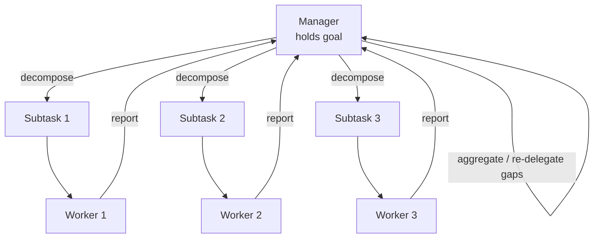
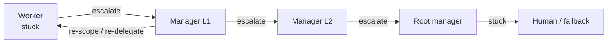

# Chapter 31: Hierarchical Multi-Agent Organizations

> **Lead paragraph.** A swarm has no leader, which is its strength and its limit — it cannot be steered, only seeded. A hierarchy restores steering: a manager decomposes the problem, delegates subtasks to workers, and aggregates results back up the reporting chain. This chapter is about multi-agent systems structured as organizations — manager-worker topologies, spans of control, escalation chains, and the trade between flat and deep hierarchies. By the end you will see why a hierarchy is a coordination mechanism (not just an org chart), where its latency comes from, and why dynamic hierarchy — restructuring as tasks evolve — is strictly harder than static but pays off when the work itself changes shape.

---

## 1. Why Hierarchy at All

Chapter 30's swarms buy robustness by giving up a leader. But many problems need a leader: a single goal that must be decomposed coherently, subtasks that depend on each other, a quality bar enforced from the top. A **hierarchical** multi-agent system restores a chain of command. A **manager** agent holds the goal and decomposes it into subtasks; **worker** agents execute subtasks and report results; results flow back up, where the manager aggregates, detects gaps, and re-delegates.

The case for hierarchy over a flat swarm is **coordination under dependency**. If subtask B needs the output of subtask A, a swarm's stigmergic field can signal "A is done" but cannot *order* the dependency. A manager can: it holds the dependency graph and dispatches B only after A's result lands. The cost is the **single point of coordination** the manager represents — not a single point of *failure* (the manager can be replicated or re-elected) but a single point of *throughput*. Every subtask transits the manager, which makes the manager a bottleneck and the hierarchy's depth the dominant latency term.

This is the central trade-off: hierarchies coordinate; swarms survive. Real systems blend the two — a manager-worker tree at the top for coherent decomposition, with stigmergic or peer coordination among the leaves for robustness.

---

## 2. Manager-Worker Topology

### 2.1 The decomposition-aggregation loop

A manager-agent runs a fixed loop: **decompose** the goal into subtasks, **delegate** each to a worker, **await** results, **aggregate**, and either **finish** or **re-delegate** the gaps. This is exactly the pattern Microsoft's Agent Framework made first-class in its Magentic orchestration — a generalist multi-agent system where an orchestrator breaks down complex problems, delegates subtasks, and iteratively refines solutions through agent collaboration.



<figcaption>Figure 31.1 — Manager-worker topology. The manager decomposes the goal, delegates subtasks, and aggregates results flowing back up. The manager is the coordination point — and the throughput bottleneck: every subtask transits it.</figcaption>

The loop is not just "fan out, fan in." The manager is an agent, so it *reasons* about the reports: detecting that a worker failed, that two reports contradict, that a subtask was mis-scoped. This reasoning is what makes a hierarchical system more than a job queue — and what makes the manager's prompt the highest-leverage design surface in the whole system.

### 2.2 Authority and delegation

**Delegation** in a hierarchy is not just assignment; it transfers authority to make local decisions. A worker that receives "summarize this document" is told *what* to do; a worker that receives "make this section clearer" is told a *goal* and chooses how. The depth of delegation — how much discretion the worker has — is a design choice: shallow delegation (precise instructions) gives the manager tight control but workers that cannot adapt; deep delegation (goals only) gives adaptable workers but a manager that cannot predict their behavior. The right depth depends on how well the subtask can be specified up front, which is exactly what the manager's decomposition step is trying to determine.

Delegation depth as a single scalar makes the trade-off tunable:

```python
def delegation_prompt(subtask, depth):
    # depth 0.0 = precise instruction (shallow), 1.0 = goal only (deep)
    if depth < 0.33:
        return f"Do exactly this: {subtask}"
    if depth < 0.66:
        return f"Goal: {subtask}. Choose your approach."
    return f"Make this happen however you see fit: {subtask}"
```

---

## 3. Span of Control: Flat Versus Deep

The **span of control** is how many workers a manager directly supervises. It is the single parameter that controls whether a hierarchy is **flat** (few levels, many workers per manager) or **deep** (many levels, few workers per manager).

A **flat** hierarchy has one manager coordinating many workers. Communication overhead is low — there are few levels to traverse — and the manager sees the whole picture, which makes aggregation cheap. But the manager's attention is split across many workers, so per-worker oversight is weak; and a single manager coordinating many concurrent subtasks is a throughput bottleneck. A **deep** hierarchy has managers managing managers, down to a few workers each. Coordination is strong — each manager focuses on a small span — and oversight per worker is tight. But each level adds latency (a result must climb $k$ levels to reach the top) and each intermediate manager is a potential distortion (the childhood game of telephone: each relay rephrases, and signal degrades).

<figure>
<svg width="100%" viewBox="0 0 820 280" xmlns="http://www.w3.org/2000/svg">
  <rect x="0" y="0" width="820" height="280" fill="#ffffff"/>
  <!-- Flat hierarchy -->
  <text x="205" y="28" font-family="sans-serif" font-size="13" fill="#534AB7" text-anchor="middle" font-weight="bold">Flat (wide span)</text>
  <circle cx="205" cy="70" r="14" fill="#534AB7"/>
  <text x="205" y="74" font-family="sans-serif" font-size="10" fill="#ffffff" text-anchor="middle">M</text>
  <line x1="205" y1="84" x2="75" y2="140" stroke="#534AB7" stroke-width="1.5"/>
  <line x1="205" y1="84" x2="145" y2="140" stroke="#534AB7" stroke-width="1.5"/>
  <line x1="205" y1="84" x2="215" y2="140" stroke="#534AB7" stroke-width="1.5"/>
  <line x1="205" y1="84" x2="285" y2="140" stroke="#534AB7" stroke-width="1.5"/>
  <line x1="205" y1="84" x2="345" y2="140" stroke="#534AB7" stroke-width="1.5"/>
  <circle cx="75" cy="150" r="10" fill="#0F6E56"/>
  <circle cx="145" cy="150" r="10" fill="#0F6E56"/>
  <circle cx="215" cy="150" r="10" fill="#0F6E56"/>
  <circle cx="285" cy="150" r="10" fill="#0F6E56"/>
  <circle cx="345" cy="150" r="10" fill="#0F6E56"/>
  <text x="205" y="200" font-family="sans-serif" font-size="11" fill="#0F6E56" text-anchor="middle">1 level, 5 workers</text>
  <text x="205" y="216" font-family="sans-serif" font-size="10" fill="#999999" text-anchor="middle">low latency, weak oversight</text>
  <text x="205" y="248" font-family="sans-serif" font-size="11" fill="#993C1D" text-anchor="middle">manager bottleneck</text>
  <!-- Deep hierarchy -->
  <text x="615" y="28" font-family="sans-serif" font-size="13" fill="#534AB7" text-anchor="middle" font-weight="bold">Deep (narrow span)</text>
  <circle cx="615" cy="70" r="14" fill="#534AB7"/>
  <text x="615" y="74" font-family="sans-serif" font-size="10" fill="#ffffff" text-anchor="middle">M</text>
  <line x1="615" y1="84" x2="555" y2="120" stroke="#534AB7" stroke-width="1.5"/>
  <line x1="615" y1="84" x2="675" y2="120" stroke="#534AB7" stroke-width="1.5"/>
  <circle cx="555" cy="130" r="11" fill="#7a72d4"/>
  <circle cx="675" cy="130" r="11" fill="#7a72d4"/>
  <line x1="555" y1="141" x2="520" y2="175" stroke="#7a72d4" stroke-width="1.5"/>
  <line x1="555" y1="141" x2="590" y2="175" stroke="#7a72d4" stroke-width="1.5"/>
  <line x1="675" y1="141" x2="640" y2="175" stroke="#7a72d4" stroke-width="1.5"/>
  <line x1="675" y1="141" x2="710" y2="175" stroke="#7a72d4" stroke-width="1.5"/>
  <circle cx="520" cy="185" r="9" fill="#0F6E56"/>
  <circle cx="590" cy="185" r="9" fill="#0F6E56"/>
  <circle cx="640" cy="185" r="9" fill="#0F6E56"/>
  <circle cx="710" cy="185" r="9" fill="#0F6E56"/>
  <text x="615" y="220" font-family="sans-serif" font-size="11" fill="#0F6E56" text-anchor="middle">3 levels, 4 leaves</text>
  <text x="615" y="236" font-family="sans-serif" font-size="10" fill="#999999" text-anchor="middle">strong oversight, high latency</text>
  <text x="615" y="248" font-family="sans-serif" font-size="11" fill="#993C1D" text-anchor="middle">signal degrades per relay</text>
</svg>
<figcaption>Figure 31.2 — Flat versus deep hierarchies. A flat tree (wide span) has one level and low latency but a bottlenecked manager and weak per-worker oversight. A deep tree (narrow span) has strong oversight but multiplies latency by depth and degrades signal at each relay — the multi-agent version of the telephone game.</figcaption>
</figure>

The rule of thumb, inherited from organizational theory (Mintzberg, 1979): span of control should reflect how much coordination each worker needs. Workers on well-specified, independent subtasks tolerate a wide span (flat); workers on ambiguous, interdependent subtasks need a narrow span (deep). The hierarchy's shape is not an aesthetic choice — it is a function of the work.

---

## 4. Escalation and Reporting Chains

A worker that cannot solve its subtask does not simply fail; it **escalates** to its manager. The manager either helps (re-scopes the subtask), re-delegates to a different worker, or escalates further up the chain. Escalation is the hierarchy's error-recovery mechanism, and its existence is why hierarchies tolerate ambiguity better than swarms: a swarm has no "ask for help," only environmental signals; a hierarchy has an explicit upward channel.

The risk is **escalation storms**: a problem that no level can solve climbs to the root, where the top manager faces a subtask outside any worker's competence. At that point the system must either fail gracefully or fall back to a human — the same human-in-the-loop pattern Chapter 22 treats. Designing the escalation ceiling (what the root manager does when stuck) is as important as designing the decomposition.



<figcaption>Figure 31.3 — Escalation chain. A stuck worker escalates to its manager, which may help, re-delegate, or escalate further. The chain ends at the root manager; what the root does when stuck (fail vs. fall back to a human) is the escalation ceiling and must be designed explicitly.</figcaption>

---

## 5. Modern Frameworks

### 5.1 Microsoft Agent Framework and Magentic

Microsoft's Agent Framework reached **1.0 general availability on April 2, 2026**, formally converging AutoGen and Semantic Kernel into a single supported platform. Its **Magentic** orchestration implements the manager-delegated-subtask pattern as a first-class workflow: an orchestrator agent decomposes a complex problem, delegates subtasks to specialized worker agents, and iteratively refines the solution by reading their reports and re-delegating gaps. This is the canonical hierarchical topology — and its appearance as a named, supported orchestration (rather than something users build by hand) signals that the manager-worker pattern has graduated from research demo to production primitive.

### 5.2 AG2 and event-driven groups

**AG2** (the open-source continuation of AutoGen) takes a different cut at hierarchy. Its **AG2 Beta** track introduces **MemoryStream**, a pub/sub event bus that isolates state per conversation and lets agents subscribe to topics rather than be addressed directly. The result is an event-driven hierarchy: a manager publishes "subtask ready" events, workers subscribe and pick up matching work, and results publish back as events. This blurs the line with Chapter 30's stigmergy — the event bus is a shared environment — but keeps the manager as the decomposer and aggregator, so the hierarchical authority structure is preserved even though the transport is publish/subscribe.

### 5.3 CrewAI Flows

CrewAI's **Flows** layer sits below its higher-level Crew abstraction and offers low-level orchestration primitives — explicit step wiring, state management, conditional routing — for problems whose structure exceeds what a single Crew can express. In hierarchical terms, Flows lets you hand-build a manager-worker topology with custom routing when the framework's default orchestration does not fit, which is the escape hatch when a named pattern (Magentic, Crew) is too rigid.

```mermaid
gantt
    title Framework timeline
    dateFormat YYYY-MM
    axisFormat %Y
    section MS
    AutoGen + Semantic Kernel (separate)    :done, a1, 2023-01, 2026-03
    Microsoft Agent Framework 1.0 GA        :milestone, a2, 2026-04
    section AutoGen lineage
    AutoGen (research)                      :done, b1, 2023-08, 2024-12
    AG2 (fork/continuation)                 :active, b2, 2025-01, 2026-06
    AG2 Beta (MemoryStream)                :b3, 2025-10, 2026-06
    section CrewAI
    CrewAI Crews                            :done, c1, 2024-01, 2026-06
    CrewAI Flows (low-level)                :active, c2, 2025-06, 2026-06
```

<figcaption>Figure 31.4 — Modern hierarchical-framework timeline. Microsoft Agent Framework reached 1.0 GA in April 2026 (converging AutoGen and Semantic Kernel); AG2 continues the AutoGen lineage with a Beta track adding MemoryStream pub/sub; CrewAI's Flows layer provides low-level orchestration below its Crew abstraction. All three converge on making manager-worker topology a supported primitive.</figcaption>

---

## 6. Dynamic Hierarchy

A **static** hierarchy is fixed at design time: the manager-worker tree is wired once and runs. A **dynamic** hierarchy restructures as the task evolves — agents elect leaders based on expertise or current load, spans of control widen and narrow, and reporting lines shift as subproblems appear and resolve.

Dynamic hierarchy is strictly harder: the restructuring itself is a coordination problem (who is allowed to restructure? when?), and a reorganizing system is harder to reason about than a fixed one. But it pays off when the work changes shape — a task that starts as a single decomposition and later needs a specialist sub-team, or a load spike that should widen a span temporarily. The pattern is to treat the hierarchy as a *data structure* that an explicit governance agent can edit, rather than as a fixed graph baked into the code.

The simplest dynamic mechanism is **leader election by expertise**: when a subtask arrives, the agent with the highest self-reported confidence in that subtask's domain becomes the local manager for it, coordinates the relevant workers, and stands down when the subtask resolves. This avoids the static manager's brittleness (a manager assigned the wrong specialty) at the cost of an election step on every subtask.

---

## 7. Agentic Code Project: A Manager-Worker Hierarchy with Escalation

This project implements the full hierarchical loop — decompose, delegate, aggregate, escalate — with a manager that re-delegates gaps and a worker that escalates when it cannot solve a subtask. It uses the standard `LLMClient` so the manager genuinely reasons about decomposition and the workers genuinely execute. The span of control and escalation ceiling are explicit parameters.

```python
import os, json
from dataclasses import dataclass, field
from typing import Callable

import openai


class LLMClient:
    """OpenAI-compatible client; flips to a local Ollama endpoint."""

    def __init__(self, model="gpt-5.5", use_ollama=False):
        self.model = model
        if use_ollama:
            self.client = openai.OpenAI(
                base_url="http://localhost:11434/v1", api_key="ollama")
        else:
            self.client = openai.OpenAI(api_key=os.getenv("OPENAI_API_KEY"))

    def complete(self, prompt, temperature=0.4, max_tokens=512):
        resp = self.client.chat.completions.create(
            model=self.model,
            messages=[{"role": "user", "content": prompt}],
            temperature=temperature, max_tokens=max_tokens)
        return resp.choices[0].message.content.strip()


@dataclass
class Subtask:
    id: str
    goal: str
    result: str = ""
    status: str = "pending"   # pending | done | failed


class Worker:
    """Executes a subtask; escalates (returns None) if it cannot."""

    def __init__(self, worker_id, llm, can_handle: Callable[[str], bool]):
        self.id = worker_id
        self.llm = llm
        self.can_handle = can_handle

    def execute(self, subtask):
        if not self.can_handle(subtask.goal):
            return None   # escalate: worker declares incompetence
        prompt = f"Solve concisely: {subtask.goal}"
        subtask.result = self.llm.complete(prompt, temperature=0.3)
        subtask.status = "done" if len(subtask.result) > 5 else "failed"
        return subtask.result


class Manager:
    """Decomposes goal, delegates, aggregates, re-delegates gaps."""

    def __init__(self, llm, workers, max_rounds=3):
        self.llm = llm
        self.workers = workers
        self.max_rounds = max_rounds

    def decompose(self, goal):
        prompt = (f"Split this task into 2-3 independent subtasks as a JSON "
                  f"list of strings only: {goal}")
        raw = self.llm.complete(prompt, temperature=0.2)
        try:
            goals = json.loads(raw)
        except json.JSONDecodeError:
            goals = [goal]   # fallback: treat as one subtask
        return [Subtask(f"s{i}", g) for i, g in enumerate(goals)]

    def delegate(self, subtask):
        for w in self.workers:
            res = w.execute(subtask)
            if res is not None:
                return   # worker accepted it (done or failed-after-attempt)
        # no worker could handle it -> escalation
        subtask.status = "failed"
        print(f"  [escalate] no worker handled {subtask.id}: {subtask.goal}")

    def aggregate(self, goal, subtasks):
        done = [s for s in subtasks if s.status == "done"]
        if not done:
            return None   # escalation ceiling: nothing to aggregate
        parts = "\n".join(f"- {s.id}: {s.result}" for s in done)
        prompt = f"Synthesize a final answer from these parts:\n{parts}"
        return self.llm.complete(prompt, temperature=0.3)

    def run(self, goal):
        subtasks = self.decompose(goal)
        for rnd in range(self.max_rounds):
            for s in subtasks:
                if s.status != "done":
                    self.delegate(s)
            if all(s.status == "done" for s in subtasks):
                break
        return self.aggregate(goal, subtasks)


def main():
    llm = LLMClient(use_ollama=True)  # flip to False for hosted API
    # workers with simple competence filters (span of control = 3)
    workers = [
        Worker("math", llm, lambda g: any(k in g.lower() for k in
                                          ["sum", "sqrt", "square"])),
        Worker("geo", llm, lambda g: any(k in g.lower() for k in
                                         ["capital", "country", "city"])),
        Worker("general", llm, lambda g: True),
    ]
    manager = Manager(llm, workers, max_rounds=3)
    answer = manager.run("Find the capital of France and the square root of 144")
    print("FINAL:", answer)


if __name__ == "__main__":
    main()
```

Two behaviors to watch. First, the manager's `decompose` returns a JSON list, so the workers each receive a real subgoal rather than the whole task — the decomposition is genuine, not a label. Second, if a subtask's goal matches no worker's competence filter, `delegate` exhausts the workers and sets `failed`, triggering the printed escalation; `aggregate` then synthesizes from only the `done` subtasks, demonstrating graceful degradation within the hierarchy rather than a hard crash.

---

## Summary

- A hierarchical multi-agent system restores a chain of command that swarms deliberately give up: a manager decomposes, delegates, aggregates, and re-delegates. The case for hierarchy over a flat swarm is coordination under subtask dependency — only a holder of the dependency graph can order B-after-A reliably.
- Span of control is the one parameter that sets the hierarchy's shape. Flat (wide span): low latency, cheap aggregation, weak per-worker oversight, manager bottleneck. Deep (narrow span): strong oversight, tight coordination, latency multiplied by depth, signal degraded at each relay. The right shape is a function of the work's ambiguity and interdependence, not an aesthetic choice.
- Escalation is the hierarchy's error-recovery mechanism: a stuck worker escalates upward; the manager re-scopes, re-delegates, or escalates further. The escalation ceiling — what the root does when stuck — must be designed explicitly, or the system hangs.
- Modern frameworks have made manager-worker a supported primitive: Microsoft Agent Framework (1.0 GA April 2026, converging AutoGen and Semantic Kernel) ships Magentic orchestration; AG2's Beta track adds MemoryStream pub/sub event buses; CrewAI's Flows layer gives low-level orchestration for shapes the named patterns cannot express.
- Dynamic hierarchy — restructuring as the task evolves, electing leaders by expertise — is strictly harder than static but pays off when the work changes shape. Treat the hierarchy as an editable data structure governed by an explicit agent, not a graph baked into code.

---

## Further Reading

- [The Structuring of Organizations](https://www.pearson.com/en-us/subject-catalog/p/structuring-of-organizations-theory/P200000003447) — Mintzberg, 1979. Classic organizational theory; span of control and the relationship between structure and the nature of the work.
- [An Introduction to MultiAgent Systems](https://www.wiley.com/en-us/An+Introduction+to+MultiAgent+Systems%2C+2nd+Edition-p-9780470519462.html) — Wooldridge, 2009. The standard MAS text; organizational structures as agent topologies.
- [Microsoft Agent Framework at BUILD 2026](https://devblogs.microsoft.com/agent-framework/microsoft-agent-framework-at-build-2026-announce/) — 2026. Announces 1.0 GA (April 2, 2026) and the convergence of AutoGen and Semantic Kernel into a single supported platform.
- [Magentic Agent Orchestration](https://learn.microsoft.com/en-us/semantic-kernel/frameworks/agent/agent-orchestration/magentic) — Microsoft Learn. The manager-delegated-subtask orchestration pattern as a first-class workflow.
- [AG2 Beta](https://docs.ag2.ai/latest/docs/beta/motivation/) — AG2 documentation. The Beta development track introducing MemoryStream pub/sub event-driven agent groups.

---