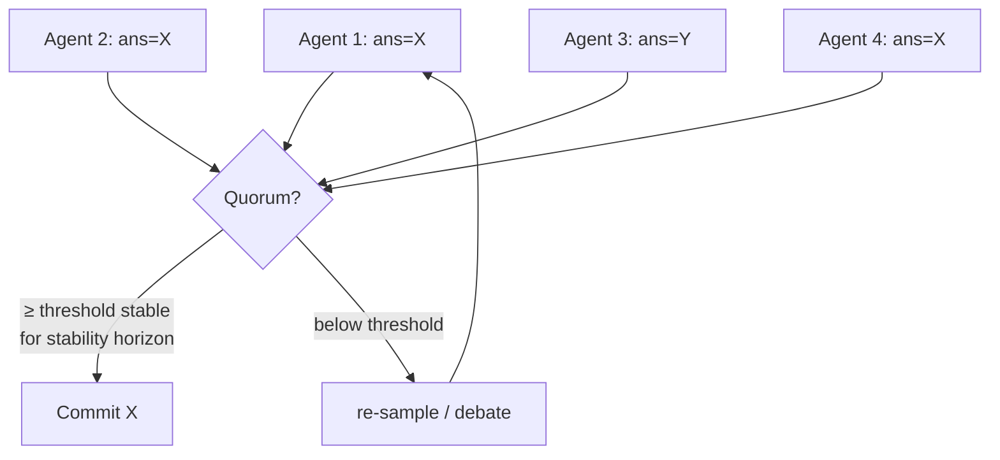
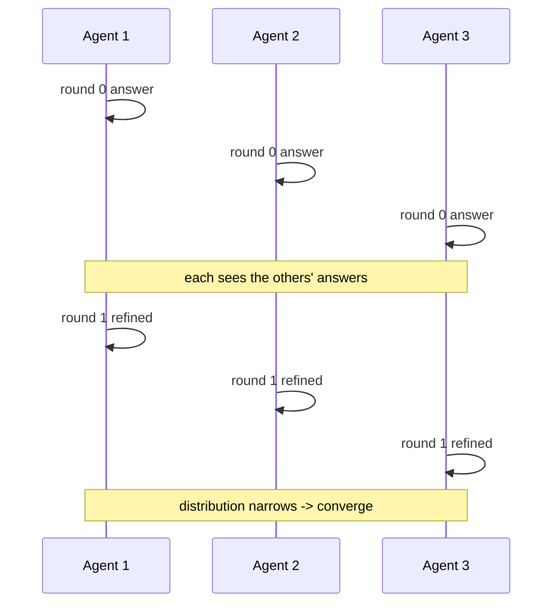
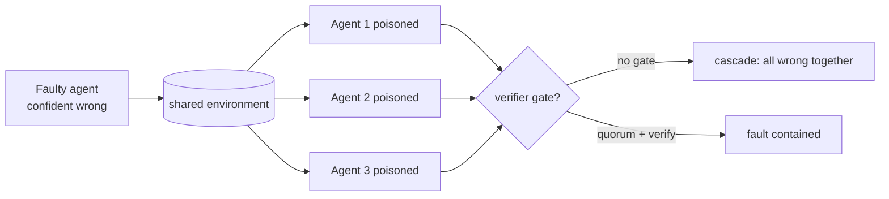

# Chapter 32: Consensus and Conflict Resolution

> **Lead paragraph.** Put several agents on one problem and they disagree — not because one is broken, but because stochastic samplers land on different answers and complementary knowledge sees different facets. Disagreement is the norm in multi-agent systems; the question is what to do about it. This chapter covers the two answers: formal consensus protocols that force agreement under a fault model (Byzantine tolerance, and the LLM-specific Aegean protocol), and softer conflict-resolution mechanisms (voting, debate, arbitration, negotiation) that trade guarantees for cost. By the end you will know when a disagreement needs a protocol versus a vote, why quorum thresholds and a stability horizon are the knobs that make LLM consensus tractable, and how a single faulty agent can cascade through a system if isolation boundaries are absent.

---

## 1. Why Agents Disagree

A lone agent samples one answer from its output distribution. Two agents on the same prompt sample two points from overlapping but not identical distributions, and unless the answer is overdetermined, the samples differ. This is **stochastic disagreement** — not error, just variance. A second source is **complementary knowledge**: agents trained or prompted differently see different facets of a problem and land on legitimately different defensible answers. A third is **fault**: an agent is compromised, misaligned, or broken, and emits answers no honest agent would.

These three sources demand different responses. Stochastic disagreement is resolved by repeated sampling and aggregation (Chapter 26's self-consistency). Complementary disagreement is resolved by debate — let each agent see the others' reasoning and update. Fault is the hard case: a faulty agent cannot be argued out of its answer, so the system must reach consensus *despite* it, which is what Byzantine fault tolerance provides. The discipline of this chapter is matching the resolution mechanism to the disagreement's source rather than reaching for the heaviest tool by default.

---

## 2. Formal Consensus Protocols

### 2.1 Byzantine fault tolerance

The **Byzantine Generals Problem** (Lamport, Shostak, & Pease, 1982) is the canonical fault model: a set of generals must agree on a battle plan by exchanging messages, but some generals are traitors who may send conflicting messages to different recipients. The question is how many traitors $f$ a protocol can tolerate among $n$ generals while still reaching agreement. The classic bound is $n \geq 3f + 1$: to tolerate $f$ faulty (Byzantine) agents, the system needs at least $3f+1$ agents, so the honest majority can outvote the faulty minority even when the faulty agents collude and lie inconsistently.

**Practical Byzantine Fault Tolerance** (Castro & Liskov, 1999) made this usable — a protocol that reaches consensus in $O(n^2)$ messages with a primary-backup structure, tolerating $f$ Byzantine faults in $3f+1$ replicas. PBFT is the foundation of permissioned blockchain consensus and any system where a subset of nodes may be actively malicious rather than merely crashed. For LLM agents, the relevance is the fault model: if one agent in your multi-agent system could be compromised (prompt injection, Chapter 29's red-team concerns) or simply wrong in a way it will defend, you need consensus that survives that, not majority voting that the faulty agent can swing.

### 2.2 Aegean: consensus for stochastic agents

Classical consensus protocols assume deterministic nodes that either answer correctly or fail. LLM agents are neither — they are stochastic, so an honest agent may give different answers across rounds, and a "wrong" answer may be transient rather than malicious. **Aegean** (December 2025) is the first formal consensus protocol designed specifically for stochastic LLM agents, and it reduces latency by 1.2–20× over naive repeated-sampling consensus.

Two knobs make stochastic consensus tractable. The **stability horizon** is how long an agent's answer must remain unchanged across rounds before it is treated as committed — long enough to filter transient variance, short enough to avoid waiting forever. The **quorum threshold** is how many agents must agree before the system commits — high enough to outvote faulty agents (the $3f+1$ logic), low enough that consensus is reachable when honest agents disagree.



<figcaption>Figure 32.1 — Aegean consensus. Agents propose answers; the protocol commits only when a quorum threshold of agents agree on the same answer and that agreement holds across the stability horizon. Below threshold, the system re-samples or debates rather than committing to a premature answer.</figcaption>

The 1.2–20× latency reduction comes from not re-sampling to convergence naively: the stability horizon lets the protocol commit as soon as the honest agents settle, rather than waiting for every agent (including the slow or faulty ones) to agree. This is the same insight as Chapter 24's MDAP scale argument — at large agent counts, you cannot wait for everyone, so the protocol must be quorum-driven.

---

## 3. Voting and Aggregation

When the disagreement is stochastic or complementary rather than faulty, a full consensus protocol is overkill. **Voting** is the cheaper resolution: each agent casts a vote, and an aggregation rule picks the answer.

Three rules, three trade-offs:

- **Majority voting** — more than half must agree. Strong (resists a faulty minority) but often unattainable when answers are diverse; on open-ended tasks, getting >50% of agents to emit the same string is rare.
- **Plurality voting** — the most-voted answer wins, even if below half. Always produces a winner, but a winner that most agents disagreed with is weakly supported.
- **Weighted voting** — votes are weighted by confidence or expertise. Lets a confident expert outvote several uncertain non-experts, which is right when expertise is real and dangerous when it is not (an over-confident faulty agent gets disproportionate weight).

```python
from collections import Counter

def vote(answers, weights=None, rule="plurality", threshold=0.5):
    # answers: list of agent outputs; weights: per-agent confidence
    w = weights or [1.0] * len(answers)
    tallies = Counter()
    for ans, wt in zip(answers, w):
        tallies[ans] += wt
    total = sum(w)
    top_ans, top_w = tallies.most_common(1)[0]
    share = top_w / total
    if rule == "majority" and share > threshold:
        return top_ans
    if rule == "plurality":
        return top_ans   # most votes wins regardless of share
    return None   # no quorum: escalate
```

The choice between majority and plurality is a choice about what "no clear answer" means. Majority voting treats a sub-50% plurality as "the swarm is uncertain" and escalates (or re-samples); plurality voting treats it as "this is the best we have" and commits. Which is right depends on the cost of a wrong commit versus the cost of waiting — the same commit-versus-verify trade-off that recurs throughout Part III.

---

## 4. Multi-Agent Debate

When agents disagree because they hold **complementary knowledge**, voting wastes that knowledge — it picks one answer and discards the others' reasoning. **Debate** instead lets agents see each other's answers and update. Du et al. (2023) showed that multi-agent debate improves factuality: each round, agents are shown the others' responses and asked to refine their own, converging toward answers that integrate the complementary perspectives.

The mechanism's value is conditional. Debate helps when agents have complementary knowledge — different facets that, combined, exceed any one agent's view. Debate is redundant when agents all know the same things; then they merely reinforce each other, and the debate collapses to the first plausible answer (the sycophactic-convergence failure from Chapter 29). The diagnostic: does the answer distribution *narrow* (debate helping, agents converging on a better answer) or merely *shift* (debate not helping, agents drifting to a new wrong answer together)? Chapter 35 covers measuring this; the design lesson is to deploy debate only when complementary knowledge is expected.



<figcaption>Figure 32.2 — Multi-agent debate. Each round, agents see the others' responses and refine. The signal that debate is helping is a narrowing answer distribution — agents converging on a better answer rather than drifting together to a worse one.</figcaption>

---

## 5. Arbitration and Negotiation

When voting cannot resolve a conflict (no quorum) and debate has converged but not settled, two further mechanisms apply.

### 5.1 Arbitration

**Arbitration** introduces a third agent — an arbiter — to break ties. The arbiter is distinct from the voters: it does not propose answers, it picks among the proposals. This is cheap (one extra agent) but shifts the question to "who arbitrates the arbiter?" — if the arbiter is itself faulty, it can pick the wrong answer. The pattern is to use arbitration for genuine ties (two answers with equal support) and reserve full consensus protocols for fault-tolerance requirements.

### 5.2 Negotiation

**Negotiation** protocols model the conflict as a bargaining problem: agents with different preferences make and accept offers until they reach agreement or walk away. The classic model is **Rubinstein bargaining** — alternating offers between two agents, where each round of delay imposes a cost (a discount factor $\delta$, so a payoff received next round is worth $\delta$ times the same payoff today). The discount is what drives agreement: because waiting is costly, both agents prefer settling now to haggling forever, and the unique subgame-perfect equilibrium splits the surplus according to their patience.

For LLM agents, negotiation is the right model when the conflict is over *preferences* (resource allocation, task assignment) rather than *facts* — agents with different goals bargaining to a joint plan. Fact conflicts should go to debate or voting; preference conflicts to negotiation. Mixing them up — treating a factual disagreement as a negotiation — produces agents that "bargain" toward a factually wrong compromise.

<figure>
<svg width="100%" viewBox="0 0 820 300" xmlns="http://www.w3.org/2000/svg">
  <rect x="0" y="0" width="820" height="300" fill="#ffffff"/>
  <text x="410" y="28" font-family="sans-serif" font-size="14" fill="#222222" text-anchor="middle" font-weight="bold">Choosing a resolution mechanism</text>
  <!-- decision tree -->
  <rect x="320" y="55" width="180" height="34" rx="6" fill="#534AB7"/>
  <text x="410" y="76" font-family="sans-serif" font-size="12" fill="#ffffff" text-anchor="middle">Disagreement source?</text>
  <line x1="410" y1="89" x2="180" y2="125" stroke="#999999" stroke-width="1.5"/>
  <line x1="410" y1="89" x2="410" y2="125" stroke="#999999" stroke-width="1.5"/>
  <line x1="410" y1="89" x2="640" y2="125" stroke="#999999" stroke-width="1.5"/>
  <text x="180" y="118" font-family="sans-serif" font-size="11" fill="#534AB7" text-anchor="middle">fault</text>
  <text x="410" y="118" font-family="sans-serif" font-size="11" fill="#534AB7" text-anchor="middle">stochastic / complementary</text>
  <text x="640" y="118" font-family="sans-serif" font-size="11" fill="#534AB7" text-anchor="middle">preference conflict</text>
  <rect x="100" y="135" width="160" height="34" rx="6" fill="#0F6E56"/>
  <text x="180" y="156" font-family="sans-serif" font-size="12" fill="#ffffff" text-anchor="middle">BFT / Aegean</text>
  <rect x="330" y="135" width="160" height="34" rx="6" fill="#0F6E56"/>
  <text x="410" y="156" font-family="sans-serif" font-size="12" fill="#ffffff" text-anchor="middle">vote / debate</text>
  <rect x="560" y="135" width="160" height="34" rx="6" fill="#0F6E56"/>
  <text x="640" y="156" font-family="sans-serif" font-size="12" fill="#ffffff" text-anchor="middle">negotiate</text>
  <line x1="180" y1="169" x2="180" y2="200" stroke="#999999" stroke-width="1.5"/>
  <line x1="410" y1="169" x2="410" y2="200" stroke="#999999" stroke-width="1.5"/>
  <line x1="640" y1="169" x2="640" y2="200" stroke="#999999" stroke-width="1.5"/>
  <text x="180" y="220" font-family="sans-serif" font-size="10" fill="#999999" text-anchor="middle">tolerate f in 3f+1</text>
  <text x="180" y="236" font-family="sans-serif" font-size="10" fill="#999999" text-anchor="middle">quorum + stability horizon</text>
  <text x="410" y="220" font-family="sans-serif" font-size="10" fill="#999999" text-anchor="middle">complementary? debate</text>
  <text x="410" y="236" font-family="sans-serif" font-size="10" fill="#999999" text-anchor="middle">redundant? vote</text>
  <text x="640" y="220" font-family="sans-serif" font-size="10" fill="#999999" text-anchor="middle">Rubinstein bargaining</text>
  <text x="640" y="236" font-family="sans-serif" font-size="10" fill="#999999" text-anchor="middle">arbiter on ties</text>
  <text x="410" y="275" font-family="sans-serif" font-size="11" fill="#993C1D" text-anchor="middle">Wrong tool for the source = wasted compute or wrong answer</text>
</svg>
<figcaption>Figure 32.3 — Matching the resolution mechanism to the disagreement's source. Fault needs Byzantine-tolerant consensus (BFT or Aegean); stochastic or complementary disagreement needs voting or debate (debate only when knowledge is complementary, else it collapses); preference conflicts need negotiation or arbitration. Using the wrong tool — negotiating a fact, or voting on a fault — gives either wasted compute or a wrong answer.</figcaption>
</figure>

---

## 6. Cascading Failures and Isolation

A disagreement that is not contained can **cascade** — one agent's error propagates through the system, contaminating others. A faulty agent that emits a confident wrong answer can swing a vote, poison a debate (other agents update toward the wrong answer), or corrupt a consensus round. The defense is **isolation boundaries**: structure the system so a faulty agent's influence is bounded — quorum thresholds that require more than one agent's assent, verifiers (Chapter 24's Validator role) that gate outputs before they propagate, and architectural separation so that a compromised agent cannot write directly to the shared memory others read.

The cascade risk is highest in stigmergic systems (Chapter 30), where every agent reads the shared environment — a poisoned pheromone field misleads everyone at once. It is lowest in structured hierarchies (Chapter 31), where the manager aggregates and can detect a single outlier report before it propagates. This is an underappreciated argument for hierarchy in safety-critical settings: the manager is an isolation boundary, a checkpoint that a faulty worker's output must pass before it reaches the rest of the system.



<figcaption>Figure 32.4 — Cascade containment. Without isolation boundaries, a faulty agent's confident wrong answer poisons the shared environment and every reader cascades to the same wrong answer. A verifier gate plus quorum requirement contains the fault: the outlier is detected before it propagates, which is why structured hierarchies cascade least.</figcaption>

---

## 7. Agentic Code Project: Consensus with Quorum, Debate, and Arbitration

This project implements the three soft-resolution mechanisms — weighted plurality voting, multi-round debate, and arbitration — behind a single `resolve` interface, with a quorum check that escalates to debate when no plurality clears the threshold and to an arbiter when debate ties. It uses the standard `LLMClient` so agents genuinely reason and refine.

```python
import os
from collections import Counter
from dataclasses import dataclass

import openai


class LLMClient:
    """OpenAI-compatible client; flips to a local Ollama endpoint."""

    def __init__(self, model="gpt-5.5", use_ollama=False):
        self.model = model
        if use_ollama:
            self.client = openai.OpenAI(
                base_url="http://localhost:11434/v1", api_key="ollama")
        else:
            self.client = openai.OpenAI(api_key=os.getenv("OPENAI_API_KEY"))

    def complete(self, prompt, temperature=0.4, max_tokens=256):
        resp = self.client.chat.completions.create(
            model=self.model,
            messages=[{"role": "user", "content": prompt}],
            temperature=temperature, max_tokens=max_tokens)
        return resp.choices[0].message.content.strip()


@dataclass
class Agent:
    id: str
    llm: LLMClient
    weight: float = 1.0

    def answer(self, question):
        return self.llm.complete(question, temperature=0.5)

    def refine(self, question, others):
        seen = "\n".join(f"- {a}: {o}" for a, o in others.items())
        prompt = (f"Question: {question}\nOther agents answered:\n{seen}\n"
                  f"Refine your own answer concisely.")
        return self.llm.complete(prompt, temperature=0.3)


def plurality(answers, weights, threshold=0.5):
    tallies = Counter()
    for ans, w in zip(answers, weights):
        tallies[ans] += w
    total = sum(weights)
    top, top_w = tallies.most_common(1)[0]
    return top if top_w / total >= threshold else None


def debate(agents, question, rounds=2):
    positions = {a.id: a.answer(question) for a in agents}
    for _ in range(rounds):
        positions = {a.id: a.refine(question, positions) for a in agents}
    return list(positions.values())


def arbitrate(arbiter, candidates):
    opts = "\n".join(f"({i}) {c}" for i, c in enumerate(candidates))
    prompt = f"Pick the best answer by its number only:\n{opts}"
    pick = arbiter.complete(prompt, temperature=0.0)
    idx = int("".join(ch for ch in pick if ch.isdigit()) or 0)
    return candidates[min(idx, len(candidates) - 1)]


def resolve(agents, question, arbiter, quorum=0.5):
    answers = [a.answer(question) for a in agents]
    weights = [a.weight for a in agents]
    winner = plurality(answers, weights, threshold=quorum)
    if winner:
        return winner, "quorum"
    refined = debate(agents, question, rounds=2)
    winner = plurality(refined, weights, threshold=quorum)
    if winner:
        return winner, "debate"
    return arbitrate(arbiter, refined), "arbitration"


def main():
    llm = LLMClient(use_ollama=True)  # flip to False for hosted API
    agents = [Agent("a1", llm, 1.0), Agent("a2", llm, 1.0), Agent("a3", llm, 1.0)]
    arbiter = LLMClient(use_ollama=True)
    answer, how = resolve(agents, "What is the capital of Australia?", arbiter)
    print(f"resolved via {how}: {answer}")


if __name__ == "__main__":
    main()
```

The resolution path is the chapter's decision tree in code: a clear plurality commits immediately (`quorum`); a split triggers debate, and if debate produces a quorum it commits (`debate`); a persistent tie falls to the arbiter (`arbitration`). Watch the `how` field in the output — it tells you which mechanism fired, which is the diagnostic for whether your agents are agreeing cleanly (mostly `quorum`) or genuinely disagreeing (frequent `debate` or `arbitration`).

---

## Summary

- Agents disagree for three reasons: stochastic variance (different samples), complementary knowledge (different facets), and fault (compromised or broken). Matching the resolution mechanism to the source is the discipline — voting for variance, debate for complementary knowledge, Byzantine-tolerant consensus for fault.
- Byzantine fault tolerance handles malicious agents: the $n \geq 3f+1$ bound means tolerating $f$ faulty agents needs $3f+1$ total. PBFT (Castro & Liskov, 1999) made it practical. Aegean (December 2025) adapts it to stochastic LLM agents with a stability horizon and quorum threshold, cutting latency 1.2–20× over naive repeated-sampling consensus.
- Voting trades guarantees for cost: majority (resists faulty minority, often unattainable on open-ended tasks), plurality (always produces a winner, weakly supported below 50%), weighted (lets expertise outvote uncertainty, dangerous when confidence is miscalibrated).
- Multi-agent debate improves factuality when knowledge is complementary and is redundant when agents know the same things — the diagnostic is whether the answer distribution narrows (helping) or merely shifts (drifting to a wrong answer together). Arbitration breaks ties with a third agent; Rubinstein-style negotiation resolves preference conflicts (not fact conflicts) via a discount factor that makes delay costly.
- Cascading failures — a faulty agent's error propagating through the system — are contained by isolation boundaries: quorum thresholds, verifiers that gate propagation, and architectural checkpoints. Stigmergic systems cascade most (everyone reads the poisoned environment); hierarchies cascade least (the manager is a checkpoint a faulty worker's output must pass).

---

## Further Reading

- [The Byzantine Generals Problem](https://dl.acm.org/doi/10.1145/357172.357176) — Lamport, Shostak, & Pease, 1982. The canonical fault model and the $3f+1$ bound on tolerating Byzantine faults.
- [Practical Byzantine Fault Tolerance](https://www.usenix.org/legacy/events/osdi99/full_papers/castro/castro_html/castro.html) — Castro & Liskov, 1999. The practical BFT protocol with $O(n^2)$ messages, foundational to permissioned consensus.
- [Aegean: Formal Consensus for Stochastic LLM Agents](https://arxiv.org/abs/2512.20184) — December 2025. The first consensus protocol designed for stochastic agents; stability horizon and quorum thresholds, 1.2–20× latency reduction.
- [Improving Factuality through Multiagent Debate](https://arxiv.org/abs/2305.14325) — Du et al., 2023. Multi-round debate where agents refine given the others' responses; factuality gains when knowledge is complementary.

---