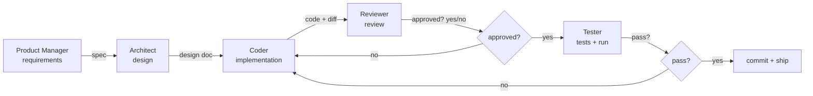
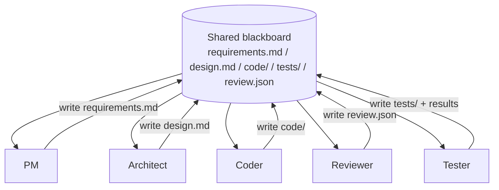
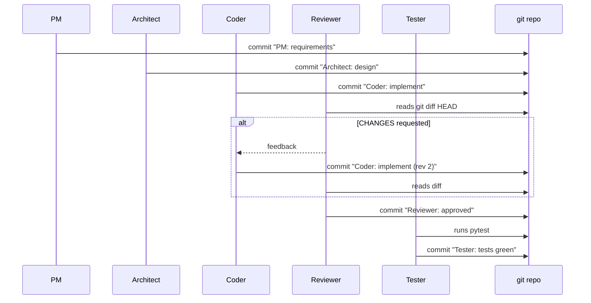

# Chapter 33: Project — Building a Multi-Agent Coding Team

> **Lead paragraph.** Part IV built the theory: how agents communicate (Chapter 27), cooperate (28), compete (29), swarm (30), organize (31), and resolve conflict (32). This chapter assembles those parts into the capstone — a team of specialized agents (Product Manager, Architect, Coder, Reviewer, Tester) that collaboratively builds software through a shared blackboard and a turn-taking protocol. The team is a small, opinionated MetaGPT: roles with distinct prompts and tools, structured messages instead of raw text, and git commits at every phase so the work is auditable. By the end you will have a running multi-agent coding team and, more importantly, a way to measure whether the team beats a single agent on the same task — because if it does not, the coordination overhead is not paying for itself.

---

## 1. From Theory to a Coding Team

The single-agent coding agent (Chapter 53 treats it in depth) is one LLM with tools — read files, write files, run tests, loop. It works, and on SWE-bench Verified the best single-agent loops now reach around 74–75% (as of mid-2026, with frontier models). So why build a *team*? Because the single agent must play every role at once — it holds requirements, design, implementation, and review in one context, and the role boundaries that a human team enforces socially are enforced only by the agent's own discipline. A multi-agent team externalizes those boundaries: each agent owns one role, one prompt, one tool set, one evaluation criterion. The Coder never sees the requirements verbatim; it sees the Architect's design. The Reviewer never wrote the code; it reads it cold. This separation is the team's value — it makes role boundaries structural rather than aspirational.

The cost is coordination overhead: messages between agents, tokens spent on handoffs, latency from sequential phases. The team pays for itself only if the separation produces better code than a single agent would — more correct, better-structured, or fewer iterations to green. Measuring that is the project's evaluation, covered in Section 6.



<figcaption>Figure 33.1 — The five-agent turn-taking protocol. PM produces a spec, Architect a design, Coder an implementation, Reviewer a gate, Tester a verification gate. Review and test failures loop back to the Coder — the team does not ship until both gates pass. Each handoff is a structured message, not raw text.</figcaption>

---

## 2. Roles and Specialization

Each agent is defined by four things: a **system prompt** (what role it plays, what it optimizes), a **tool set** (what it can do), an **input contract** (what it reads from the shared blackboard), and an **output contract** (what it writes back). The contracts are what make the team composable — an agent does not free-form chat with the next agent, it produces a structured artifact the next agent is built to consume.

- **Product Manager** — reads a raw task description, produces `requirements.md`: acceptance criteria, constraints, out-of-scope items. Optimizes for completeness and unambiguity. Tools: none beyond the LLM.
- **Architect** — reads `requirements.md`, produces `design.md`: module list, interfaces, data flow, the test plan's shape. Optimizes for implementability and separability. Tools: none.
- **Coder** — reads `design.md`, produces code under `code/`. Optimizes for matching the design and passing tests. Tools: file read/write, run shell commands.
- **Reviewer** — reads the diff against `design.md`, produces a review: approve, or request changes with reasons. Optimizes for catching mismatches between design and code. Tools: read only.
- **Tester** — reads `requirements.md` (the acceptance criteria) and the code, writes `tests/`, runs them, reports pass/fail. Optimizes for adversarial coverage. Tools: file write, run pytest.

The specialization is the whole point. The Reviewer's prompt does not mention design *choices* (that is the Architect's job) — it asks only "does the code match the design, and is it sound?" The Tester's prompt does not mention style — it asks only "do the acceptance criteria hold?" Narrow prompts make each agent's failure modes legible: a bad review is a Reviewer-prompt problem, a buggy implementation is a Coder-prompt problem, and they do not contaminate each other.

The output contract is what makes a handoff parseable — the next agent branches on a prefix, not on prose:

```python
ROLES = {
    "pm":        {"reads": ["task"],       "writes": "requirements.md"},
    "architect": {"reads": ["requirements.md"], "writes": "design.md"},
    "coder":     {"reads": ["design.md"],  "writes": "code/main.py"},
    "reviewer":  {"reads": ["git diff"],   "writes": "review.json"},
    "tester":    {"reads": ["requirements.md", "code/"], "writes": "tests/"},
}
```



<figcaption>Figure 33.2 — The shared blackboard. Every agent reads from and writes to a common state directory; no agent talks directly to another. The blackboard is the team's memory and its audit trail — every artifact is a file you can inspect after the run.</figcaption>

---

## 3. The Shared Blackboard and Turn-Taking

The team does not use peer-to-peer messaging. Instead, every agent reads from and writes to a **shared blackboard** — a directory holding `requirements.md`, `design.md`, `code/`, `tests/`, and `review.json`. The blackboard is the team's memory and its audit trail: after a run, you can inspect exactly what each agent produced and when. This is the same pattern as Chapter 30's stigmergy, applied to artifacts rather than pheromones — agents communicate through the environment, not through each other.

**Turn-taking** is sequential: PM, then Architect, then Coder, then Reviewer, then Tester, with loops back to Coder on review or test failure. Sequential execution avoids the consensus problem entirely (Chapter 32) at the cost of latency — there is no voting because there is no disagreement by construction: each agent sees the previous agent's committed artifact and builds on it. The Reviewer does not *debate* the Coder; it gates the Coder's output. This is a deliberate simplification: a coding team that must agree on a design can use Chapter 32's debate, but a coding team executing a decided design needs gates, not votes.

---

## 4. Git Integration

After each major phase, the team commits its artifacts to a real git repository with a descriptive message: `PM: requirements`, `Architect: design`, `Coder: implement`, `Reviewer: approved`, `Tester: tests green`. This is not cosmetic. Git gives the team **auditability** (you can `git log` the team's reasoning), **rollback** (a bad phase can be reverted without re-running earlier phases), and **diffability** (the Reviewer's input is literally `git diff`). Treating each agent's output as a commit also enforces the output contracts: an agent cannot hand off half-finished work, because a commit is a complete, parseable artifact.

The Coder is the only agent that touches the working tree's tracked files; the others write their artifacts and commit them. The Reviewer operates on `git diff` against the last Architect commit, so its view is exactly the delta the Coder introduced — no stale context, no distraction.



<figcaption>Figure 33.4 — Git as the team's audit trail. Each phase is a commit; the Reviewer reads `git diff` so it sees only the Coder's delta; the Tester's pytest run is the final gate before the "tests green" commit. A failed review loops back to the Coder and produces a revised commit — the history shows every iteration.</figcaption>

---

## 5. Agentic Code Project: A Five-Agent Coding Team

This project implements the full team: five role-specialized agents, a shared blackboard directory, a turn-taking orchestrator with review and test loops, and git commits at each phase. It uses the standard `LLMClient` so each agent genuinely reasons in its role. The orchestration is deliberately readable — a loop, not a framework — so the protocol is visible.

```python
import os, json, subprocess, textwrap
from dataclasses import dataclass
from pathlib import Path

import openai


class LLMClient:
    """OpenAI-compatible client; flips to a local Ollama endpoint."""

    def __init__(self, model="gpt-5.5", use_ollama=False):
        self.model = model
        if use_ollama:
            self.client = openai.OpenAI(
                base_url="http://localhost:11434/v1", api_key="ollama")
        else:
            self.client = openai.OpenAI(api_key=os.getenv("OPENAI_API_KEY"))

    def complete(self, system, prompt, temperature=0.3, max_tokens=900):
        resp = self.client.chat.completions.create(
            model=self.model,
            messages=[{"role": "system", "content": system},
                      {"role": "user", "content": prompt}],
            temperature=temperature, max_tokens=max_tokens)
        return resp.choices[0].message.content.strip()


@dataclass
class Blackboard:
    root: Path

    def write(self, name, content):
        (self.root / name).write_text(content)

    def read(self, name):
        p = self.root / name
        return p.read_text() if p.exists() else ""

    def git(self, msg):
        subprocess.run(["git", "-C", str(self.root), "add", "-A"], check=True)
        subprocess.run(["git", "-C", str(self.root), "commit", "-m", msg],
                       check=True, capture_output=True)

    def diff(self):
        r = subprocess.run(["git", "-C", str(self.root), "diff", "HEAD"],
                           capture_output=True, text=True)
        return r.stdout


def pm(llm, bb, task):
    sys = "You are a Product Manager. Produce requirements.md: " \
          "acceptance criteria (bulleted), constraints, out-of-scope."
    spec = llm.complete(sys, f"Task: {task}")
    bb.write("requirements.md", spec)
    bb.git("PM: requirements")


def architect(llm, bb):
    sys = "You are a Software Architect. Read requirements, produce " \
          "design.md: modules, interfaces, test plan. Be concrete."
    design = llm.complete(sys, bb.read("requirements.md"))
    bb.write("design.md", design)
    bb.git("Architect: design")


def coder(llm, bb, fix=None):
    sys = "You are a Coder. Implement the design in code/. " \
          "Output ONLY a single Python file's content, nothing else."
    prompt = bb.read("design.md") + (f"\nPrevious review: {fix}" if fix else "")
    code = llm.complete(sys, prompt)
    bb.root.joinpath("code").mkdir(exist_ok=True)
    bb.write("code/main.py", code)
    bb.git("Coder: implement")


def reviewer(llm, bb):
    sys = "You are a Code Reviewer. Read the diff. Reply APPROVED or " \
          "CHANGES: <reasons>."
    return llm.complete(sys, bb.diff())


def tester(bb):
    bb.root.joinpath("tests").mkdir(exist_ok=True)
    bb.write("tests/test_main.py", textwrap.dedent("""
        import sys, pathlib
        sys.path.insert(0, str(pathlib.Path(__file__).parent.parent / 'code'))
        from main import *  # noqa
    """))
    r = subprocess.run(
        ["pytest", str(bb.root / "tests"), "-q", "--tb=short"],
        capture_output=True, text=True)
    return r.returncode == 0, r.stdout + r.stderr


def run_team(task, workdir, use_ollama=True):
    bb = Blackboard(Path(workdir))
    llm = LLMClient(use_ollama=use_ollama)
    pm(llm, bb, task)
    architect(llm, bb)
    for attempt in range(3):           # review/test loop, max 3
        coder(llm, bb, fix=None if attempt == 0 else last_review)
        last_review = reviewer(llm, bb)
        if last_review.startswith("APPROVED"):
            break
    ok, log = tester(bb)
    print(f"tests {'PASS' if ok else 'FAIL'}\n{log[-800:]}")
    return ok


if __name__ == "__main__":
    run_team("A function that checks whether a string is a palindrome, "
             "ignoring case and non-alphanumeric characters.",
             workdir="./team_workspace", use_ollama=True)
```

A few design notes worth surfacing. The `coder` agent emits a single file's content and nothing else — constraining the output format is what makes the handoff parseable without a fragile extraction step. The `reviewer` must begin its reply with `APPROVED` or `CHANGES:` so the orchestrator can branch on a prefix match, not on the LLM's prose. The `tester` writes a scaffold test file and runs pytest; in a fuller system the Tester agent would itself write meaningful tests from the acceptance criteria (its prompt would be an agent call, not a static string), but the gate logic — `pytest` exit code is the truth — stays identical. The three-attempt loop bound is the team's escalation ceiling (Chapter 31): if review and test cannot agree in three rounds, the team stops rather than looping forever.

---

## 6. Evaluation: Team Versus Single Agent

The project is not done until you can answer: *does the team beat a single agent?* Three metrics, measured on the same task set for both:

- **Task completion** — does the produced code satisfy the acceptance criteria? (The Tester's verdict, or a held-out judge.)
- **Code quality** — test pass rate, linter compliance, and on a benchmark like SWE-bench, the resolve rate.
- **Overhead** — total tokens consumed and wall-clock time, since the team spends tokens on handoffs a single agent does not.

The comparison is the whole point of role specialization. A typical finding: the team wins on harder, more decomposable tasks (where the Architect's design prevents the Coder from heading down a wrong path that the Reviewer and Tester would otherwise catch late) and loses on simple tasks (where the handoff overhead exceeds the value of separation). The boundary between "team wins" and "single agent wins" is task-dependent — which is why you measure rather than assume.

<figure>
<svg width="100%" viewBox="0 0 820 300" xmlns="http://www.w3.org/2000/svg">
  <rect x="0" y="0" width="820" height="300" fill="#ffffff"/>
  <text x="410" y="28" font-family="sans-serif" font-size="14" fill="#222222" text-anchor="middle" font-weight="bold">Team vs single agent: where each wins</text>
  <!-- axes -->
  <line x1="80" y1="250" x2="760" y2="250" stroke="#333333" stroke-width="1.5"/>
  <line x1="80" y1="60" x2="80" y2="250" stroke="#333333" stroke-width="1.5"/>
  <text x="420" y="278" font-family="sans-serif" font-size="11" fill="#333333" text-anchor="middle">task complexity / decomposability →</text>
  <text x="40" y="155" font-family="sans-serif" font-size="11" fill="#333333" text-anchor="middle" transform="rotate(-90 40 155)">value delivered</text>
  <!-- single agent curve -->
  <path d="M 100 235 Q 200 200 300 175 Q 420 150 540 140 Q 640 135 740 133" fill="none" stroke="#0F6E56" stroke-width="2.5"/>
  <text x="700" y="125" font-family="sans-serif" font-size="11" fill="#0F6E56" text-anchor="middle">single agent</text>
  <!-- team curve -->
  <path d="M 100 245 Q 220 235 320 200 Q 420 150 540 105 Q 640 85 740 78" fill="none" stroke="#534AB7" stroke-width="2.5"/>
  <text x="700" y="70" font-family="sans-serif" font-size="11" fill="#534AB7" text-anchor="middle">5-agent team</text>
  <!-- crossover -->
  <circle cx="430" cy="150" r="5" fill="#993C1D"/>
  <text x="430" y="172" font-family="sans-serif" font-size="10" fill="#993C1D" text-anchor="middle">crossover</text>
  <!-- regions -->
  <text x="200" y="100" font-family="sans-serif" font-size="10" fill="#999999" text-anchor="middle">simple tasks:</text>
  <text x="200" y="114" font-family="sans-serif" font-size="10" fill="#999999" text-anchor="middle">overhead &gt; value</text>
  <text x="640" y="180" font-family="sans-serif" font-size="10" fill="#999999" text-anchor="middle">hard, decomposable tasks:</text>
  <text x="640" y="194" font-family="sans-serif" font-size="10" fill="#999999" text-anchor="middle">separation pays off</text>
</svg>
<figcaption>Figure 33.3 — Team versus single agent value as task complexity grows. On simple tasks the team's handoff overhead exceeds the value of role separation (single agent wins). Past the crossover, decomposability lets the team's specialized agents prevent errors a single agent would catch late, and the team pulls ahead. The crossover's location is task-dependent — measure it, do not assume the team always wins.</figcaption>
</figure>

---

## 7. Communication Overhead and When to Stop Adding Agents

A natural impulse is to add more agents — a DevOps agent, a Security agent, a Doc agent. Resist it until the data demands it. Every additional agent adds handoff tokens, latency, and another place for the protocol to break (a misformatted output, a contract drift). The five-agent team covers the core software loop; further agents are justified only when a measured failure mode (repeatedly shipping insecure code, repeatedly missing docs) shows the current roles cannot catch it. This is the YAGNI principle from Chapter 2's engineering standards applied to agent topology: build the team the task needs, not the team you can imagine.

The blackboard pattern scales this discipline. Because agents communicate only through artifacts, adding an agent does not require rewiring peer connections — it adds one reader and one writer to the blackboard. That makes the *cost* of adding an agent low in code and high in tokens, which is the right trade: you can experiment cheaply but pay in inference for every role you add.

---

## Summary

- A multi-agent coding team externalizes role boundaries a single agent can only hold in context: PM (requirements), Architect (design), Coder (implementation), Reviewer (gate), Tester (verification). Each agent owns one prompt, one tool set, one evaluation criterion — so failure modes stay legible and isolated.
- The team communicates through a shared blackboard (a directory of artifacts: `requirements.md`, `design.md`, `code/`, `tests/`, `review.json`), not peer-to-peer. Turn-taking is sequential with loops back to the Coder on review or test failure — gates, not votes, because a team executing a decided design needs gates, not consensus.
- Git integration after each phase gives auditability, rollback, and a diff the Reviewer reads directly. Each agent's output is a commit — a complete, parseable artifact, which enforces the output contracts.
- The project measures whether the team beats a single agent on task completion, code quality, and overhead. The team wins on hard, decomposable tasks (where design prevents late-caught errors) and loses on simple ones (where handoff overhead exceeds separation's value). The crossover is task-dependent — measure it.
- Stop adding agents when the data demands it, not when you can imagine them. The blackboard keeps the code cost of adding a role low but the token cost real, which makes experimentation cheap and over-engineering expensive — the right trade for agent topology.

---

## Further Reading

- [MetaGPT: Meta Programming for Multi-Agent Collaborative Framework](https://arxiv.org/abs/2308.00352) — Hong et al., 2023. The role-specialized multi-agent software framework this project mirrors: PM, Architect, Coder, Tester, Reviewer with structured Standardized Operating Procedures.
- [Communicative Agents for Software Development (ChatDev)](https://arxiv.org/abs/2307.07924) — Qian et al., 2023. The waterfall-style multi-agent coding team; ChatDev 2.0 shipped January 7, 2026.
- [SWE-bench Verified Leaderboard](https://www.swebench.com/verified.html) — the benchmark for coding agents; top single-agent loops reach ~74–75% as of mid-2026, the baseline a multi-agent team must beat to justify its overhead.
- [pytest documentation](https://docs.pytest.org/) — the test runner the Tester agent invokes as its ground-truth gate.

---