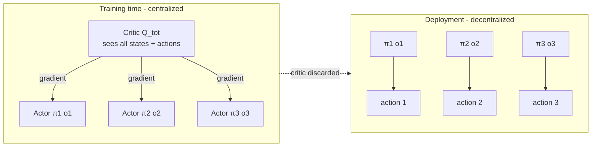
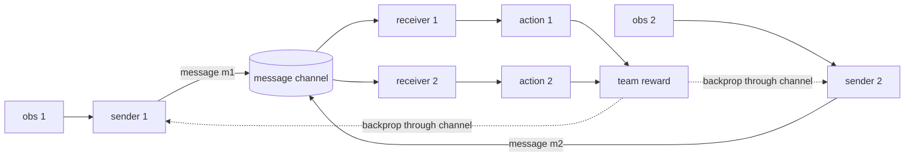
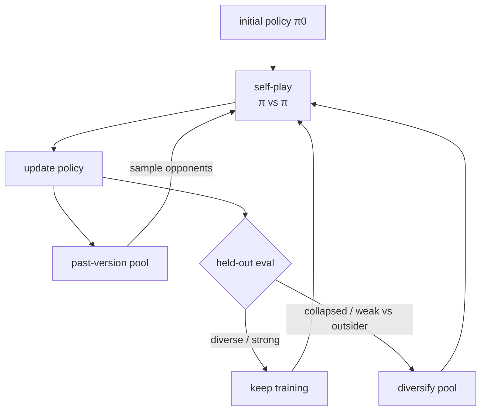

# Chapter 34: Training Multi-Agent Systems

> **Lead paragraph.** Train one agent and the environment is (mostly) fixed; train several at once and the environment becomes other agents who are themselves learning, so from any one agent's perspective the world keeps shifting under its feet. That non-stationarity is the defining difficulty of multi-agent reinforcement learning, and the dominant answer to it is CTDE — Centralized Training, Decentralized Execution: learn with a critic that sees everything, deploy actors that see only their local observations. This chapter covers CTDE and its value-decomposition children (VDN, QMIX), the credit-assignment problem they solve, communication learning and emergent language, and self-play as an automatic curriculum. By the end you will see why a centralized critic is legal during training but illegal at deployment, and why decomposing a joint value into per-agent pieces is the trick that makes credit assignment tractable.

---

## 1. The Non-Stationarity Problem

In single-agent RL the environment is stationary: the transition $P(s' \mid s, a)$ does not change as the agent learns. In multi-agent RL (MARL) with $n$ agents acting simultaneously, each agent's environment *includes* the other $n-1$ agents, whose policies $\pi_{-i}$ are changing as they learn. From agent $i$'s perspective the transition it experiences is $P(s' \mid s, a_i, \pi_{-i})$, and because $\pi_{-i}$ shifts every update, the Bellman target $r + \gamma \max Q$ chases a moving goal. Naive independent Q-learning (each agent ignores the others) can still work in practice but has no convergence guarantee and tends to thrash.

Three responses to non-stationarity dominate. The first is **CTDE**: use a centralized critic that conditions on all agents' states and actions during training, so each agent's learning target is well-defined regardless of what the others do, then drop the critic at deployment and run decentralized actors. The second is **value decomposition** (VDN, QMIX): factor a single joint value into per-agent values under structural constraints, sidestepping credit assignment. The third is **self-play**: train against copies of yourself, so the non-stationarity is at least symmetric and produces a curriculum of gradually stronger opponents.

The moving target is concrete in two lines — agent $i$'s Bellman target depends on a policy $\pi_{-i}$ that updates out from under it:

```python
def independent_target(q_i, next_obs, reward, gamma, pi_neg_i):
    # next state value depends on OTHER agents' policies, which keep changing
    next_a_neg = pi_neg_i(next_obs)          # drawn from a shifting policy
    next_val = q_i(next_obs, next_a_neg)     # target built on a moving goal
    return reward + gamma * next_val
```

---

## 2. Centralized Training, Decentralized Execution

CTDE's core move is to split the *critic* (used only to compute training gradients) from the *actor* or *Q-function* (used to act). The centralized critic $Q_i^{\text{tot}}(s_1, \ldots, s_n, a_1, \ldots, a_n)$ sees every agent's state and action — information that is legal during training (you control the simulator) but illegal at deployment (agent $i$ cannot observe agent $j$'s private state). The decentralized policy $\pi_i(a_i \mid o_i)$ conditions only on $i$'s local observation $o_i$.



<figcaption>Figure 34.1 — Centralized Training, Decentralized Execution. During training a shared critic sees all agents' states and actions and sends gradients to each actor. At deployment the critic is discarded and each actor runs on its local observation alone. The critic is legal in simulation but not in the field, where agents cannot read each other's private state.</figcaption>

MADDPG (Lowe et al., 2017) is the canonical CTDE method for continuous-action mixed cooperative-competitive settings: each agent $i$ has a decentralized deterministic actor $\mu_i(o_i)$ and a centralized critic $Q_i(\mathbf{o}, \mathbf{a})$ over the joint observation and action. The actor's gradient comes from the critic, so each agent learns a best response that accounts for the others' *current* behavior — and because all agents update together from a shared critic, the moving-target problem is far milder than in independent learning.

---

## 3. Credit Assignment and Value Decomposition

In a fully cooperative team the agents share a single team reward $r^{\text{tot}}$, and the question becomes: *which agent caused the success or failure?* This is **credit assignment**. A team reward of $+1$ for capturing a flag tells no individual agent whether its contribution mattered. Value-decomposition methods answer by assuming the joint value factorizes into per-agent values and learning the factorization.

### 3.1 VDN: additive decomposition

**Value-Decomposition Networks** (Sunehag et al., 2018) assume the joint value is a sum of individual values:

$$Q_{\text{tot}}(s, \mathbf{a}) = \sum_{i=1}^{n} Q_i(o_i, a_i)$$

The team's Q is just the sum of each agent's Q, learned end-to-end on the team reward. Credit assignment is trivial by construction: each agent's $Q_i$ is its marginal contribution. The cost is that the additive assumption is strong — it rules out any interaction between agents where the whole is not the sum of parts.

### 3.2 QMIX: monotonic decomposition

**QMIX** (Rashid et al., 2018) relaxes additivity to monotonicity: the joint value is a monotonic function of each individual value,

$$\frac{\partial Q_{\text{tot}}}{\partial Q_i} \geq 0, \quad \forall i$$

implemented by a mixing network with non-negative weights. This guarantees that argmax over the joint action decomposes into per-agent argmaxes (so decentralized execution is exact), while allowing the joint value to be more than a flat sum — interactions are allowed as long as they never make one agent's larger $Q_i$ reduce the team value. QMIX dominated cooperative MARL benchmarks (StarCraft Multi-Agent Challenge) for years precisely because it hits the sweet spot: tractable credit assignment without the rigidity of pure addition.

<figure>
<svg width="100%" viewBox="0 0 820 300" xmlns="http://www.w3.org/2000/svg">
  <rect x="0" y="0" width="820" height="300" fill="#ffffff"/>
  <text x="410" y="28" font-family="sans-serif" font-size="14" fill="#222222" text-anchor="middle" font-weight="bold">Value decomposition: how the joint value relates to parts</text>
  <!-- VDN -->
  <text x="160" y="70" font-family="sans-serif" font-size="13" fill="#534AB7" text-anchor="middle" font-weight="bold">VDN (additive)</text>
  <rect x="80" y="90" width="60" height="50" fill="#0F6E56" rx="4"/>
  <text x="110" y="120" font-family="sans-serif" font-size="12" fill="#ffffff" text-anchor="middle">Q1</text>
  <rect x="145" y="100" width="60" height="40" fill="#0F6E56" rx="4"/>
  <text x="175" y="125" font-family="sans-serif" font-size="12" fill="#ffffff" text-anchor="middle">Q2</text>
  <rect x="210" y="95" width="60" height="45" fill="#0F6E56" rx="4"/>
  <text x="240" y="122" font-family="sans-serif" font-size="12" fill="#ffffff" text-anchor="middle">Q3</text>
  <text x="160" y="165" font-family="sans-serif" font-size="20" fill="#993C1D" text-anchor="middle">+</text>
  <rect x="110" y="180" width="100" height="34" fill="#534AB7" rx="4"/>
  <text x="160" y="202" font-family="sans-serif" font-size="12" fill="#ffffff" text-anchor="middle">Q_tot = Σ Qi</text>
  <text x="160" y="240" font-family="sans-serif" font-size="10" fill="#999999" text-anchor="middle">rigid: no interaction</text>
  <!-- QMIX -->
  <text x="640" y="70" font-family="sans-serif" font-size="13" fill="#534AB7" text-anchor="middle" font-weight="bold">QMIX (monotonic)</text>
  <rect x="540" y="90" width="60" height="50" fill="#0F6E56" rx="4"/>
  <text x="570" y="120" font-family="sans-serif" font-size="12" fill="#ffffff" text-anchor="middle">Q1</text>
  <rect x="605" y="100" width="60" height="40" fill="#0F6E56" rx="4"/>
  <text x="635" y="125" font-family="sans-serif" font-size="12" fill="#ffffff" text-anchor="middle">Q2</text>
  <rect x="670" y="95" width="60" height="45" fill="#0F6E56" rx="4"/>
  <text x="700" y="122" font-family="sans-serif" font-size="12" fill="#ffffff" text-anchor="middle">Q3</text>
  <polygon points="570,155 630,180 700,150 760,185 700,175 630,200" fill="none" stroke="#993C1D" stroke-width="2"/>
  <text x="665" y="178" font-family="sans-serif" font-size="12" fill="#993C1D" text-anchor="middle">mix (≥0 weights)</text>
  <rect x="590" y="200" width="100" height="34" fill="#534AB7" rx="4"/>
  <text x="640" y="222" font-family="sans-serif" font-size="12" fill="#ffffff" text-anchor="middle">Q_tot</text>
  <text x="640" y="258" font-family="sans-serif" font-size="10" fill="#999999" text-anchor="middle">flexible: monotone interaction</text>
</svg>
<figcaption>Figure 34.2 — VDN versus QMIX decomposition. VDN (left) forces the joint value to be a flat sum of per-agent values — credit assignment is trivial but no agent interaction is representable. QMIX (right) passes per-agent values through a mixer network with non-negative weights, so the joint value can reflect interaction as long as each agent's larger value never reduces the team value — preserving exact decentralized argmax while admitting richer structure.</figcaption>
</figure>

---

## 4. Communication Learning and Emergent Language

Decentralized actors with no communication can only coordinate implicitly, through environment dynamics. **Communication learning** lets agents emit messages that other agents condition on — and the content of those messages is itself learned, not designed.

Foerster et al. (2016) showed agents could learn to communicate via differentiable messages: each agent emits a continuous vector $m_i$, other agents condition their policy on $(o_i, m_{-i})$, and the message channel is trained end-to-end by backpropagation through the communication. The agents discover a communication protocol that minimizes team loss — but the protocol is opaque, a learned code no human designed.

**Emergent language** (Lazaridou et al., 2017) asks the harder question: do these learned protocols resemble natural language? Strikingly, when the communication is grounded in a shared visual referent and agents are pressured to be both informative and efficient, the emergent protocols develop properties reminiscent of natural language — compositionality, a bias toward concise messages for frequent referents. This is not because the agents know language; it is because the *pressures* (be understood, be efficient) are the same pressures that shaped natural language, and similar pressures produce similar structure. Bansal et al. (2018) showed the complementary dynamic: multi-agent competition itself drives emergent complexity, with agents developing behaviors (tool use, sheltering) not present in single-agent training.



<figcaption>Figure 34.4 — Differentiable communication. Senders emit messages into a shared channel; receivers condition their actions on the messages; the team reward backpropagates through the channel to train both the message content and the policies that read it. The protocol is discovered, not designed.</figcaption>

---

## 5. Self-Play as Curriculum

**Self-play** trains an agent against copies of itself. The non-stationarity is unavoidable (the opponent keeps changing as it learns), but it is *symmetric*: every opponent is drawn from the same improving population, so the agent always faces a roughly matched challenge. AlphaZero (Silver et al., 2017) is the headline result — mastering Go, chess, and shogi from self-play alone, no human data — but the mechanism is general: self-play automatically generates a curriculum of gradually stronger opponents, with no need to hand-design a difficulty ladder.

The failure mode of self-play is **collapse**: agents discover a local Nash equilibrium that is stable against themselves but weak against outsiders (a strategy that beats your clone but loses to anything different). Mitigations include opponent sampling from a pool of past versions (fictitious self-play) rather than only the current policy, and periodic evaluation against held-out strategies to detect collapse. The lesson is that self-play's curriculum is automatic but not automatically *diverse* — you must guard against the agents over-fitting to their own idiosyncrasies.



<figcaption>Figure 34.3 — Self-play loop with collapse guards. The policy trains against itself, but opponents are sampled from a pool of past versions (fictitious self-play) rather than only the current policy, and held-out evaluation against outsiders detects collapse — a stable-against-self but weak-against-other local equilibrium — so the curriculum stays diverse.</figcaption>

---

## 6. Agentic Code Project: A CTDE Mixer with an LLM Reward Shaper

This project implements the two halves of the chapter's training story in miniature: a QMIX-style value-decomposition network (per-agent Q-networks feeding a non-negative-weight mixer) in pure PyTorch, and an LLM-based reward shaper that turns a sparse team reward into denser per-agent shaping signals. The LLM client is the standard `use_ollama`-flagged one; the mixer enforces QMIX's monotonicity constraint by clamping its weights non-negative.

```python
import os
import torch
import torch.nn as nn
import openai


class LLMClient:
    """OpenAI-compatible client; flips to a local Ollama endpoint."""

    def __init__(self, model="gpt-5.5", use_ollama=False):
        self.model = model
        if use_ollama:
            self.client = openai.OpenAI(
                base_url="http://localhost:11434/v1", api_key="ollama")
        else:
            self.client = openai.OpenAI(api_key=os.getenv("OPENAI_API_KEY"))

    def complete(self, prompt, temperature=0.2, max_tokens=200):
        resp = self.client.chat.completions.create(
            model=self.model,
            messages=[{"role": "user", "content": prompt}],
            temperature=temperature, max_tokens=max_tokens)
        return resp.choices[0].message.content.strip()


class AgentQNet(nn.Module):
    """Per-agent local Q-network. obs_dim -> n_actions."""

    def __init__(self, obs_dim, n_actions, hidden=32):
        super().__init__()
        self.net = nn.Sequential(
            nn.Linear(obs_dim, hidden), nn.ReLU(),
            nn.Linear(hidden, n_actions))

    def forward(self, obs):              # obs: (batch, obs_dim)
        return self.net(obs)             # -> (batch, n_actions)


class QMixer(nn.Module):
    """Non-negative-weight mixer enforces monotonicity ∂Q_tot/∂Q_i >= 0."""

    def __init__(self, n_agents, state_dim, embed=16):
        super().__init__()
        # hypernetworks: state -> weights/biases of the mixer
        self.hyper_w = nn.Sequential(
            nn.Linear(state_dim, embed), nn.ReLU(),
            nn.Linear(embed, n_agents * embed))
        self.hyper_b1 = nn.Linear(state_dim, embed)
        self.hyper_b2 = nn.Sequential(
            nn.Linear(state_dim, embed), nn.ReLU(),
            nn.Linear(embed, 1))

    def forward(self, agent_qs, state):
        # agent_qs: (batch, n_agents); state: (batch, state_dim)
        b, n = agent_qs.shape
        w = self.hyper_w(state).view(b, n, -1)     # (b, n, embed)
        w = torch.abs(w)                            # enforce non-negative
        h = torch.relu(torch.bmm(agent_qs.unsqueeze(1), w).squeeze(1))
        b1 = self.hyper_b1(state)
        out = self.hyper_b2(torch.relu(h + b1))
        return out                                   # -> (batch, 1) Q_tot


def llm_shaped_rewards(team_reward, agent_actions, state_desc, llm):
    """LLM turns sparse team reward into per-agent shaping signals."""
    prompt = (f"Team got reward {team_reward} in state: {state_desc}. "
              f"Per-agent actions: {agent_actions}. "
              f"Return a JSON list of {len(agent_actions)} per-agent "
              f"shaping rewards in [-1, 1] only.")
    import json
    raw = llm.complete(prompt)
    try:
        return torch.tensor(json.loads(raw), dtype=torch.float32)
    except json.JSONDecodeError:
        return torch.zeros(len(agent_actions))


def train_step(qnets, mixer, opt, batch, llm=None):
    obs, state, actions, team_r = batch
    agent_qs = torch.stack([q(obs[:, i])[range(obs.size(0)), actions[:, i]]
                            for i, q in enumerate(qnets)], dim=1)
    q_tot = mixer(agent_qs, state).squeeze(-1)
    if llm is not None:
        shaping = torch.stack([llm_shaped_rewards(r.item(),
                          actions[i].tolist(), "s", llm)
                          for i, r in enumerate(team_r)])
        target = team_r + 0.1 * shaping.mean(dim=1)
    else:
        target = team_r
    loss = ((q_tot - target) ** 2).mean()
    opt.zero_grad(); loss.backward(); opt.step()
    return loss.item()
```

Two things to verify against the design. First, the mixer's `torch.abs(w)` is the monotonicity constraint made literal — QMIX's guarantee that a larger per-agent $Q_i$ never reduces $Q_{\text{tot}}$ holds because the mixing weights are non-negative. Second, the LLM shaper is *additive* shaping (a small correction to the team reward), not a replacement for it — the team reward remains the true signal; the LLM only densifies it. This respects the anti-sycophancy rule that an LLM's judgment is a hint, not ground truth: if the LLM's JSON fails to parse, the code falls back to zero shaping and the team reward carries the gradient alone.

---

## Summary

- The defining difficulty of MARL is non-stationarity: each agent's environment includes other learning agents, so the transition it experiences keeps shifting. CTDE answers this by learning with a centralized critic that sees all states and actions (legal in simulation) and deploying decentralized actors that see only local observations (legal in the field).
- MADDPG (Lowe et al., 2017) is the canonical CTDE method for continuous mixed cooperative-competitive settings: decentralized actors, a centralized critic per agent that conditions on the joint state-action. Credit assignment in fully cooperative teams is solved by value decomposition.
- VDN (additive: $Q_{\text{tot}} = \sum_i Q_i$) makes credit assignment trivial but forbids agent interaction. QMIX (monotonic: $\partial Q_{\text{tot}}/\partial Q_i \geq 0$, via non-negative mixer weights) allows interaction while preserving exact decentralized argmax — the sweet spot that dominated cooperative benchmarks.
- Communication learning trains the message channel end-to-end by backprop; emergent-language work (Lazaridou et al., 2017) shows that under informative-and-efficient pressures, learned protocols develop natural-language-like structure — not because agents know language, but because the pressures match. Multi-agent competition itself drives emergent complexity (Bansal et al., 2018).
- Self-play (AlphaZero, Silver et al., 2017) automatically generates a curriculum of matched opponents, but risks collapse to a stable-against-self / weak-against-outsider equilibrium. Pool-based opponent sampling and held-out evaluation against outsiders keep the curriculum diverse.

---

## Further Reading

- [Multi-Agent Actor-Critic for Mixed Cooperative-Competitive Environments (MADDPG)](https://arxiv.org/abs/1706.02275) — Lowe et al., 2017. The canonical CTDE method: centralized critics, decentralized actors.
- [QMIX: Monotonic Value Function Factorisation](https://arxiv.org/abs/1803.11485) — Rashid et al., 2018. Non-negative mixer enforcing monotonicity; the cooperative-MARL workhorse.
- [Value-Decomposition Networks for Cooperative Multi-Agent Learning (VDN)](https://arxiv.org/abs/1706.05296) — Sunehag et al., 2018. Additive decomposition; the simplest credit-assignment baseline.
- [Learning to Communicate with Deep Multi-Agent Reinforcement Learning](https://arxiv.org/abs/1605.06676) — Foerster et al., 2016. Differentiable, end-to-end-learned agent-to-agent messages.
- [Multi-Agent Cooperation and the Emergence of (Natural) Language](https://arxiv.org/abs/1612.07182) — Lazaridou et al., 2017. Grounded emergent protocols showing natural-language-like structure under referential pressure.
- [Emergent Complexity via Multi-Agent Competition](https://arxiv.org/abs/1710.03748) — Bansal et al., 2018. Competition driving emergent complex behavior.

---