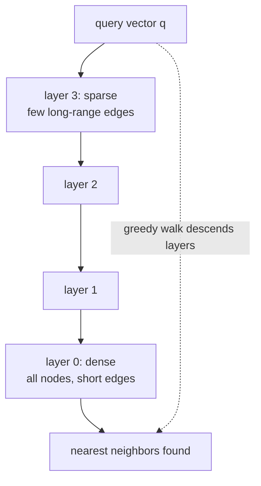
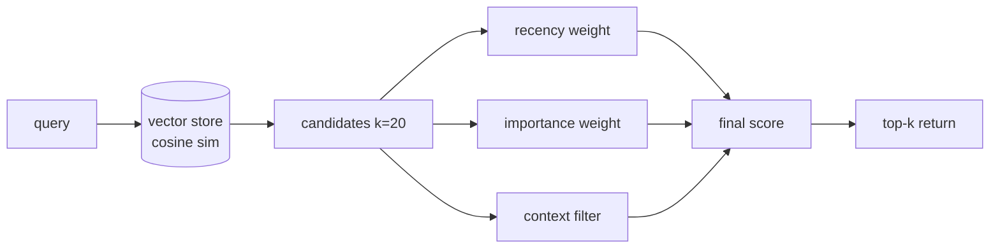

# Chapter 36: Vector Memory and Semantic Retrieval

> **Lead paragraph.** An agent that cannot remember is doomed to re-derive everything from scratch each turn — and worse, cannot learn from its own past. The simplest workable agent memory is dense retrieval: map each piece of text to a vector, store the vectors, and at recall time find the nearest neighbors to the query. This chapter covers the full pipeline — embedding models, the indexing structures that make billion-vector search feasible (FAISS, HNSW), the chunking and hybrid-search choices that matter more than the embedding model itself, and the retrieval policies (recency, importance, context) that turn a vector store into something that behaves like memory. By the end you will know why chunking beats model choice, why hybrid search rescues the exact-match cases pure semantic retrieval fails, and why a forgetting curve is not a bug but a feature.

---

## 1. From Text to Vectors

An **embedding model** maps a piece of text to a fixed-dimensional vector $\mathbf{e} \in \mathbb{R}^d$ such that semantically similar texts land near each other in vector space. Retrieval then reduces to nearest-neighbor search: given a query embedding $\mathbf{q}$, find the stored $\mathbf{e}_i$ maximizing similarity, typically cosine similarity

$$\text{sim}(\mathbf{q}, \mathbf{e}_i) = \frac{\mathbf{q}^\top \mathbf{e}_i}{\lVert \mathbf{q} \rVert \, \lVert \mathbf{e}_i \rVert}$$

where $\mathbf{q}^\top \mathbf{e}_i$ is the dot product of the query and document vectors (the first multiplication in this chapter — a dot product written with the $^\top$ convention, never as $\mathbf{q} \cdot \mathbf{e}_i$). The embedding model is the quality ceiling: a bad embedding maps unrelated texts together and no amount of indexing rescues it.

The model landscape as of mid-2026 is wide. The **MTEB** (Massive Text Embedding Benchmark) leaderboard tracks overall quality across retrieval, clustering, and classification tasks; the current top of the leaderboard is dominated by **Qwen3-Embedding-8B** (Alibaba), the first open-source model to surpass all proprietary embeddings with an overall score of 70.6 — a meaningful shift, because open weights let you run the model locally and fine-tune it on your domain. The longer-standing families — BGE (BAAI), E5 (Microsoft), GTE (Alibaba), Nomic Embed, and OpenAI's `text-embedding-3` — remain strong, practical choices, with `text-embedding-3` the default for hosted-API users and BGE/E5 the defaults for self-hosted. The model choice matters less than people think, and the next section explains why.

---

## 2. Chunking Strategy Beats Model Choice

A common mistake is to spend days picking the embedding model and minutes on chunking. The reverse is closer to correct: **chunking strategy matters more than embedding model choice.** A perfectly embedded but badly chunked document retrieves the wrong passage — the right sentence is buried inside a 2000-token chunk whose embedding averages over unrelated content and matches nothing precisely.

**Fixed-size chunking** (split every $N$ tokens, with overlap) is the simplest and often the baseline. **Semantic chunking** — splitting at sentence or paragraph boundaries so each chunk is a coherent unit — outperforms fixed-size because a chunk's embedding represents one idea, not a token-window's worth of mixed content. The trade-off is that semantic chunks have variable length, which complicates batching but is worth it for retrieval quality. The rule of thumb: chunk at the granularity you want to retrieve. If you want to retrieve a paragraph of context, chunk at paragraph boundaries; if you want a sentence, chunk at sentences (and accept noisier, shorter embeddings).

```python
import re

def semantic_chunks(text, max_tokens=200, overlap_sentences=1):
    # split into sentences first, then greedily pack into chunks
    # without exceeding max_tokens (approximated by word count here)
    max_words = max_tokens  # rough word ~= token for English prose
    sentences = re.split(r'(?<=[.!?])\s+', text.strip())
    chunks, cur, cur_len = [], [], 0
    for s in sentences:
        w = len(s.split())
        if cur_len + w > max_words and cur:
            chunks.append(" ".join(cur))
            # keep overlap for continuity across chunk boundaries
            cur = cur[-overlap_sentences:] if overlap_sentences else []
            cur_len = sum(len(x.split()) for x in cur)
        cur.append(s)
        cur_len += w
    if cur:
        chunks.append(" ".join(cur))
    return chunks
```

The overlap (`overlap_sentences`) is the small detail that prevents a retrieval miss at every chunk boundary: a fact split across two chunks is still partly present in both. Without overlap, every boundary is a potential retrieval gap.

---

## 3. Indexing: FAISS and HNSW

Storing a million vectors and computing the dot product of the query against every one is $O(n)$ per query — fine at thousands, painful at millions, impossible at billions. Indexing structures make search sub-linear at the cost of approximation.

**FAISS** (Johnson, Douze, & Jégou) is the workhorse for local development and GPU-accelerated search, offering three index families with different speed/accuracy trade-offs:

- **IndexFlatIP** — exact inner-product search. Perfect recall, $O(n)$ per query. Use for small stores or as a ground-truth baseline.
- **IndexIVFFlat** — inverted-file approximate search. Partition vectors into Voronoi cells, probe only the nearest cells. $O(\sqrt{n})$-ish, tunable recall.
- **IndexHNSW** — graph-based search using Hierarchical Navigable Small World graphs (Malkov & Yashunin, 2018). HNSW builds a multi-layer proximity graph where search walks from sparse top layers down to dense bottom layers, giving near-logarithmic search with high recall. HNSW is the default choice for production vector stores because its recall-speed trade-off is the best of the three at scale.



<figcaption>Figure 36.1 — HNSW layered graph search. Search starts at the sparse top layer (few nodes, long-range edges) and greedily walks toward the query, descending to denser layers until it reaches layer 0 (all nodes, short edges) where the final nearest neighbors are refined. The layering gives near-logarithmic search while preserving high recall.</figcaption>

The recall knob on HNSW is `efSearch` (the search-time beam width): higher `efSearch` explores more graph neighbors, improving recall at the cost of latency. Tuning `efSearch` to the application's recall requirement is the single most important index parameter — the difference between 90% and 99% recall on a billion-vector index.

---

## 4. Vector Databases

For a prototype, FAISS in a process is enough. For production — persistence, filtering, sharding, multi-tenant isolation — you want a **vector database**. The landscape: **Chroma** (developer-friendly, embeds in-process or client-server), **Qdrant** (Rust-based, strong filtering), **Weaviate** (GraphQL API, hybrid search built-in), **Pinecone** (fully managed, serverless), and **Milvus** (scale, distributed). They all expose the same core operation — insert vectors with metadata, query by vector similarity filtered by metadata — and differ in operational model and the richness of their filtering and hybrid-search support.

The choice that actually matters is **metadata filtering**: you almost never want pure vector search; you want "nearest neighbors among documents tagged `project=alpha` and `date > 2026-01`." A vector database whose metadata filtering is fast and composable with the vector search (pre-filter then ANN, or hybrid) saves you from the failure mode of retrieving semantically-similar-but-wrong-tenant documents.

---

## 5. Hybrid Search

Pure semantic retrieval has a blind spot: **exact matches**. A user querying for error code `ERR_4729` or a function name `parse_header` gets semantic neighbors — texts about errors and headers — but not necessarily the exact string. Semantic similarity does not preserve lexical identity. **Hybrid search** combines vector similarity with keyword matching (BM25 or a sparse encoder) and merges the results, rescuing the exact-match cases pure semantic retrieval fails.

The merge is typically a weighted sum of normalized scores:

$$\text{score}(\mathbf{q}, \mathbf{e}_i) = \alpha \cdot \text{sim}_{\text{dense}}(\mathbf{q}, \mathbf{e}_i) + (1 - \alpha) \cdot \text{sim}_{\text{sparse}}(\mathbf{q}, \mathbf{e}_i)$$

where $\alpha \cdot \text{sim}_{\text{dense}}$ is a scalar weighting the dense (semantic) similarity (the $\alpha$ a scalar multiplier, not a dot product). The $\alpha$ knob is task-dependent: code and identifiers want low $\alpha$ (favor sparse/exact), prose wants high $\alpha$ (favor semantic). Hybrid search is not an optimization — it is a correctness fix for a known failure mode, and any production retrieval system over mixed content should have it on by default.

---

## 6. Retrieval Policies and Forgetting

A vector store returns nearest neighbors; **memory** requires policies over *which* neighbors matter. Three policies, combinable:

- **Recency-weighted** — recent memories matter more. Multiply the similarity score by a recency factor so a slightly-less-similar but recent memory can outrank a more-similar but stale one.
- **Importance-weighted** — significant events prioritized. Each memory carries an importance score (set by the agent or a judge), and retrieval weights by it.
- **Context-aware** — relevant to the current task. Filter or re-rank by the current task's tags before vector search.



<figcaption>Figure 36.2 — Retrieval policies layered on vector search. The vector store returns nearest neighbors; recency, importance, and context policies re-rank or filter them into the final top-k. A pure vector store is not memory — the policies that weight what to retrieve are what make it behave like memory.</figcaption>

**Forgetting curves** are the deliberately counterintuitive policy: old, unimportant memories should fade. A memory store that retains everything eventually drowns relevant recall in a sea of stale, low-importance entries, and retrieval quality degrades as the store grows. Forgetting — decaying the retrieval weight of old, unaccessed, low-importance memories — is not data loss to fix; it is a feature that keeps recall sharp. This connects to Chapter 39's continual learning: a system that never forgets cannot cleanly update, because the old and new both surface and conflict.

<figure>
<svg width="100%" viewBox="0 0 820 280" xmlns="http://www.w3.org/2000/svg">
  <rect x="0" y="0" width="820" height="280" fill="#ffffff"/>
  <text x="410" y="28" font-family="sans-serif" font-size="14" fill="#222222" text-anchor="middle" font-weight="bold">Retrieval quality vs. store size, with and without forgetting</text>
  <line x1="80" y1="240" x2="760" y2="240" stroke="#333333" stroke-width="1.5"/>
  <text x="420" y="265" font-family="sans-serif" font-size="11" fill="#333333" text-anchor="middle">memory store size (n) →</text>
  <line x1="80" y1="240" x2="80" y2="60" stroke="#333333" stroke-width="1.5"/>
  <text x="50" y="150" font-family="sans-serif" font-size="11" fill="#333333" text-anchor="middle" transform="rotate(-90 50 150)">recall quality →</text>
  <!-- no forgetting: rises then declines -->
  <path d="M 100 220 Q 200 120 350 95 Q 480 95 600 140 Q 700 180 740 210" fill="none" stroke="#993C1D" stroke-width="2.5"/>
  <text x="660" y="200" font-family="sans-serif" font-size="11" fill="#993C1D" text-anchor="middle">no forgetting: decays</text>
  <!-- with forgetting: rises then plateaus high -->
  <path d="M 100 220 Q 200 130 350 95 Q 480 90 600 88 Q 700 87 740 87" fill="none" stroke="#0F6E56" stroke-width="2.5"/>
  <text x="660" y="78" font-family="sans-serif" font-size="11" fill="#0F6E56" text-anchor="middle">with forgetting: holds</text>
  <circle cx="470" cy="92" r="5" fill="#993C1D"/>
  <text x="470" y="78" font-family="sans-serif" font-size="10" fill="#993C1D" text-anchor="middle">divergence</text>
</svg>
<figcaption>Figure 36.3 — Forgetting as a feature. Without forgetting, recall quality rises then declines as the store grows — stale, low-importance entries drown relevant matches. With forgetting (decaying old, unaccessed, low-importance memories), recall quality rises and holds high. Forgetting is not data loss to fix; it is what keeps a memory store useful at scale.</figcaption>
</figure>

---

## 7. Agentic Code Project: A Vector Memory with Hybrid Search and Forgetting

This project assembles the chapter's pieces into a working agent memory: semantic chunking, an embedding-backed FAISS index, hybrid search (dense + sparse BM25-like), and a forgetting policy that decays old, low-importance, unaccessed entries. It uses the standard `LLMClient` for the importance-judge step that scores memories on ingest. The store is small and in-process — the point is the pipeline shape, not the scale.

```python
import os, time, math, re
from collections import Counter
from dataclasses import dataclass, field

import numpy as np
import openai


class LLMClient:
    """OpenAI-compatible client; flips to a local Ollama endpoint."""

    def __init__(self, model="gpt-5.5", use_ollama=False):
        self.model = model
        if use_ollama:
            self.client = openai.OpenAI(
                base_url="http://localhost:11434/v1", api_key="ollama")
        else:
            self.client = openai.OpenAI(api_key=os.getenv("OPENAI_API_KEY"))

    def complete(self, prompt, temperature=0.2, max_tokens=20):
        resp = self.client.chat.completions.create(
            model=self.model,
            messages=[{"role": "user", "content": prompt}],
            temperature=temperature, max_tokens=max_tokens)
        return resp.choices[0].message.content.strip()

    def embed(self, texts):
        if self.model.startswith(("gpt", "text-embedding")):
            r = self.client.embeddings.create(
                model="text-embedding-3-small", input=texts)
            return np.array([d.embedding for d in r.data], dtype=np.float32)
        # ollama: use a local embedder via the same client
        vecs = []
        for t in texts:
            r = self.client.embeddings.create(model="nomic-embed-text", input=t)
            vecs.append(r.data[0].embedding)
        return np.array(vecs, dtype=np.float32)


@dataclass
class Memory:
    text: str
    importance: float
    timestamp: float
    last_accessed: float


def importance_score(text, llm):
    raw = llm.complete(
        f"Rate the long-term importance of this memory as a single "
        f"float in [0,1] (0=trivial, 1=critical). Reply with the number "
        f"only.\n{text}")
    try:
        return max(0.0, min(1.0, float(raw)))
    except ValueError:
        return 0.5


def bm25_scores(query, docs):
    # minimal BM25-ish sparse score over token overlap
    q_tokens = set(re.findall(r"\w+", query.lower()))
    scores = []
    for d in docs:
        dt = Counter(re.findall(r"\w+", d.lower()))
        overlap = sum(dt[t] for t in q_tokens)
        scores.append(overlap / (1 + 0.5 * len(dt)))
    m = max(scores) if scores else 1
    return [s / (m + 1e-9) for s in scores]


class VectorMemory:
    def __init__(self, llm, alpha=0.6, forget_half_life=7 * 24 * 3600):
        self.llm = llm
        self.alpha = alpha                 # dense vs sparse blend
        self.forget_half_life = forget_half_life
        self.memories = []                 # list[Memory]
        self.vectors = None                # np.ndarray (n, d)

    def add(self, text):
        imp = importance_score(text, self.llm)
        now = time.time()
        self.memories.append(
            Memory(text, imp, now, now))
        self.vectors = (self.llm.embed([m.text for m in self.memories])
                        if self.memories else None)

    def _forget_weight(self, mem, now):
        age = now - mem.last_accessed
        recency = 0.5 ** (age / self.forget_half_life)
        return recency * mem.importance   # scalar times scalar

    def query(self, query, k=3):
        if not self.memories:
            return []
        qv = self.llm.embed([query])[0]
        dense = (self.vectors @ qv) / (
            np.linalg.norm(self.vectors, axis=1) * np.linalg.norm(qv) + 1e-9)
        sparse = np.array(bm25_scores(query, [m.text for m in self.memories]))
        blended = self.alpha * dense + (1 - self.alpha) * sparse
        now = time.time()
        for i, m in enumerate(self.memories):
            blended[i] *= self._forget_weight(m, now)   # apply forgetting
        idx = np.argsort(-blended)[:k]
        for i in idx:
            self.memories[i].last_accessed = now       # access refreshes
        return [self.memories[i].text for i in idx]


def main():
    llm = LLMClient(use_ollama=True)
    mem = VectorMemory(llm)
    for t in ["User prefers terse answers.",
              "The deploy failed on Tuesday due to a bad config.",
              "Parse error ERR_4729 means the header is malformed."]:
        mem.add(t)
    print(mem.query("what went wrong on tuesday?"))
    print(mem.query("ERR_4729"))


if __name__ == "__main__":
    main()
```

Three behaviors to verify against the design. First, the `query` blends dense and sparse scores — `ERR_4729` will surface via the sparse (BM25) term where pure semantic search might rank it below prose about errors, which is the hybrid-search correctness fix. Second, the forgetting weight is multiplicative on the blended score, so an old, low-importance, unaccessed memory decays even if it is semantically similar — recall quality holds as the store grows. Third, the `last_accessed` refresh on retrieval means a memory that is repeatedly useful never fades — forgetting targets disuse, not importance. The importance judge is the only LLM call on the ingest path, and a parse failure falls back to a neutral 0.5 rather than crashing the ingest — the anti-sycophancy point that an LLM's judgment is a hint, not ground truth, applied to memory scoring.

---

## Summary

- Dense retrieval maps text to vectors and recalls by nearest-neighbor search (cosine similarity $\mathbf{q}^\top \mathbf{e}_i / (\lVert\mathbf{q}\rVert \lVert\mathbf{e}_i\rVert)$). As of mid-2026 the MTEB leaderboard is topped by Qwen3-Embedding-8B (70.6, first open-source model to lead), with BGE, E5, GTE, Nomic, and text-embedding-3 as strong practical defaults.
- Chunking strategy beats embedding-model choice. Semantic chunking (split at sentence/paragraph boundaries) outperforms fixed-size because each chunk represents one idea; overlap across chunk boundaries prevents retrieval gaps. Chunk at the granularity you want to retrieve.
- Indexing makes search sub-linear: FAISS IndexFlatIP (exact, $O(n)$), IndexIVFFlat (approximate, Voronoi cells), IndexHNSW (graph-based, near-logarithmic, the production default). HNSW's `efSearch` is the recall knob. Vector databases (Chroma, Qdrant, Weaviate, Pinecone, Milvus) add persistence, filtering, sharding — fast metadata filtering is the feature that actually matters.
- Hybrid search (dense + sparse/BM25, blended by $\alpha$) is a correctness fix for pure semantic retrieval's blind spot on exact matches (codes, identifiers, names). It should be on by default for mixed content.
- Retrieval policies — recency, importance, context — turn a vector store into memory; pure nearest-neighbor is not memory. Forgetting (decaying old, unaccessed, low-importance entries) is a feature, not a bug: without it, recall quality declines as the store grows, drowned by stale entries.

---

## Further Reading

- [Billion-Scale Similarity Search with GPUs (FAISS)](https://arxiv.org/abs/1702.08734) — Johnson, Douze, & Jégou. The FAISS library; GPU-accelerated similarity search at scale.
- [Efficient and Robust Approximate Nearest Neighbor Search using HNSW Graphs](https://arxiv.org/abs/1603.09320) — Malkov & Yashunin, 2018. The hierarchical navigable small-world graph index underlying most production vector search.
- [MTEB Leaderboard](https://huggingface.co/spaces/mteb/leaderboard) — the standard embedding benchmark; Qwen3-Embedding-8B leads as of 2026.
- [FlagEmbedding (BGE)](https://github.com/FlagOpen/FlagEmbedding) — BAAI General Embedding; strong open-source embedding family.
- [OpenAI Embeddings Guide](https://platform.openai.com/docs/guides/embeddings) — `text-embedding-3` reference for hosted-API users.

---