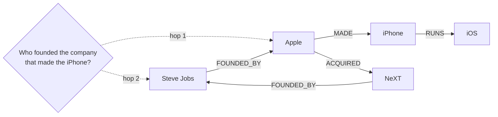
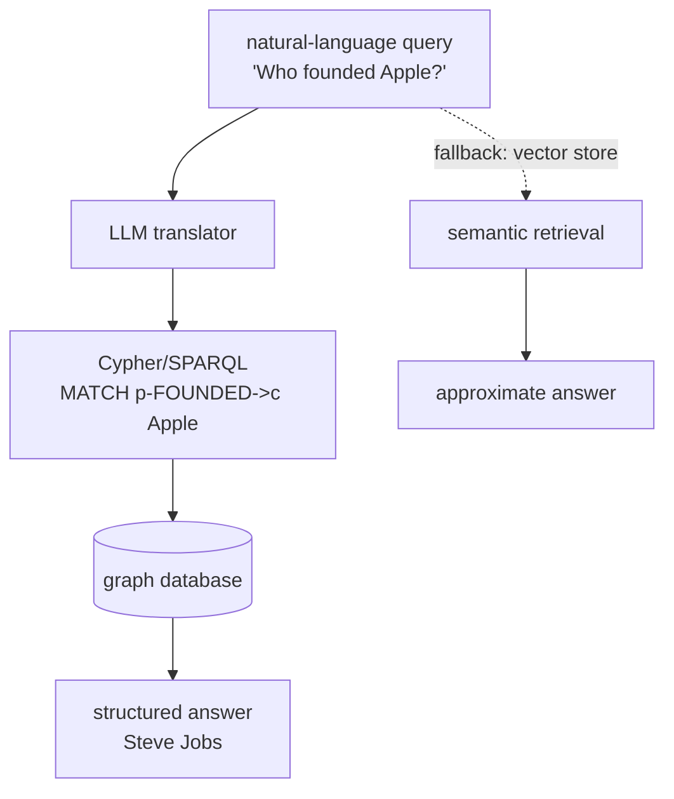

# Chapter 37: Knowledge Graphs for Structured Memory

> **Lead paragraph.** A vector store answers "what is similar to this?" A knowledge graph answers "what is connected to what, and how?" — and that distinction is everything for multi-hop reasoning. A vector store cannot traverse two hops; it cannot tell you who founded the company that acquired the company that made the product, because that is a path through relations, not a similarity. This chapter covers knowledge graphs as structured memory: triples (subject, relation, object), construction from text via entity and relation extraction, graph databases and query languages (Neo4j, Cypher, SPARQL), and the extensions that make graphs useful for agents — temporal validity and uncertainty. By the end you will see why graphs and vectors are complements, not competitors, and why the hybrid that uses both is the practical answer.

---

## 1. Triples: The Atom of Structured Memory

The atomic unit of a knowledge graph is the **triple**: (subject, relation, object). `(Apple, FOUNDED_BY, Steve Jobs)` asserts that the entity Apple stands in the FOUNDED_BY relation to the entity Steve Jobs. A knowledge graph is a set of such triples, forming a directed multigraph: entities are nodes, relations are labeled edges. The structure is what enables multi-hop reasoning — a path through the graph is an answer a vector store cannot produce.

The contrast with Chapter 36's vector memory is sharp and deliberate. Vectors capture semantic similarity — "what text is like this text" — which is exactly right for retrieving a relevant passage. But similarity is not structure. Asking "who founded the company that made the iPhone" is a two-hop query: `(iPhone, MADE_BY, Apple)` then `(Apple, FOUNDED_BY, ?)`. A vector store might retrieve documents mentioning Apple and founders, but it cannot *guarantee* the path — it returns texts that are about the topic, not the structured answer. A graph traversal returns exactly the entities at the path's end. This is why graphs are called structured memory: the structure is the memory.



<figcaption>Figure 37.1 — A knowledge graph as multi-hop memory. The query "who founded the company that made the iPhone?" is a two-hop traversal: (iPhone)→MADE_BY→(Apple)→FOUNDED_BY→(?). The graph returns the exact answer; a vector store would return documents about Apple and founders with no guarantee the path holds.</figcaption>

---

## 2. Constructing Graphs from Text

Text does not arrive as triples; it arrives as prose, and the graph must be **constructed**. The construction pipeline has two stages: **entity extraction** (identify the named entities — people, places, organizations) and **relation extraction** (identify the relations between extracted entities). Together they turn "Steve Jobs founded Apple in 1976" into `(Steve Jobs, FOUNDED, Apple)` and `(Apple, FOUNDED_IN, 1976)`.

Three approaches span the spectrum. **Rule-based and statistical NLP** (spaCy for entity recognition, Stanford OpenIE for open information extraction) extracts triples (subject, relation, object) without a predefined schema — scalable but noisy, with precision varying by domain. **Seq2seq relation extraction** like REBEL (Relation Extraction By End-to-end Language generation) frames relation extraction as a sequence-to-sequence task: the model reads text and emits the triples directly as a linearized sequence, which is clean and trainable on a labeled corpus. **LLM-based extraction** — the modern default — prompts an LLM to read a passage and emit its triples as structured output (JSON or a triple list). AutoKG (arXiv 2311.14740) exemplifies the LLM approach: it extracts keywords with an LLM, then evaluates the relation weight between each pair of keywords using graph Laplace learning, producing a weighted graph from unstructured text without a predefined schema.

```python
import json

def llm_extract_triples(text, llm):
    """LLM extracts (subject, relation, object) triples as JSON from text."""
    prompt = (f"Extract all factual triples from this text as a JSON list "
              f"of [subject, relation, object]. Use UPPERCASE relations. "
              f"Text: {text}\nJSON only:")
    raw = llm.complete(prompt, temperature=0.0, max_tokens=300)
    try:
        triples = json.loads(raw)
        return [(s, r.upper(), o) for s, r, o in triples]
    except (json.JSONDecodeError, TypeError):
        return []
```

The LLM extraction is flexible — no schema, no labeled corpus, works on any domain — but inherits the LLM's hallucination risk: it can emit triples the text does not support. The defense is the same as throughout the book: treat the LLM's output as a candidate to verify (a parse failure returns an empty list rather than a guess), and keep a confidence or provenance tag on every extracted triple so a downstream consumer can down-rank uncertain facts.

---

## 3. Graph Databases and Query Languages

A few thousand triples in memory is a dict-of-lists; a million needs a **graph database**. **Neo4j** is the dominant labeled-property graph, queried in **Cypher** — a declarative, pattern-matching language. The query "who founded Apple?" in Cypher is a pattern:

```cypher
MATCH (p:Person)-[:FOUNDED]->(c:Company {name: 'Apple'})
RETURN p.name
```

The `MATCH` clause describes the graph pattern (a Person node connected by a FOUNDED edge to a Company node named Apple); the database returns the matching person. Multi-hop queries are just longer patterns: `(p:Person)-[:FOUNDED]->(c:Company)-[:MADE]->(prod:Product {name:'iPhone'})` traverses two edges in one query.

**RDF** and **SPARQL** are the W3C-standard alternative — a triple-store model where everything is a triple and SPARQL queries over the resulting graph. RDF's strength is interoperability (Linked Open Data, Wikidata, DBpedia all publish RDF) and its weakness is ergonomics — SPARQL is more verbose than Cypher for the same pattern. **Amazon Neptune** supports both property-graph and RDF models. The practical split: use Neo4j/Cypher for application-internal graphs where you control the schema; use RDF/SPARQL when you need to interoperate with the open Linked Data ecosystem.



<figcaption>Figure 37.2 — Natural language to graph query. An LLM translates the question into a Cypher/SPARQL pattern, the graph database executes it, and the structured answer returns. When the question has no clean graph path (or the graph lacks the relevant triples), the system falls back to vector semantic retrieval — the hybrid architecture.</figcaption>

**Natural-language to graph query** — translating "who founded Apple?" into the Cypher above — is an LLM task, and it is where graphs and LLMs meet most directly. The risk is the LLM generating a syntactically valid but semantically wrong query (querying the wrong relation label, missing a hop). The mitigation is schema-aware prompting: give the LLM the graph's relation labels and node types as context, so it queries relations that actually exist rather than inventing them.

---

## 4. Temporal Knowledge Graphs

Not all facts are eternally true. **Temporal knowledge graphs** attach a validity period to each triple: `(Barack Obama, PRESIDENT_OF, United States, 2009–2017)`. A query "who is president?" must respect time — the Obama triple is valid only in its window, and a current query should not return it. Without temporal validity, a knowledge graph freezes the world at one instant and silently lies about everything that has changed since.

Temporal graphs matter for agents because the world changes and agents must reason about *when*. "Is this user still a customer?" depends on whether their subscription lapsed. "Is this API still supported?" depends on the deprecation timeline. Representing these as timeless triples makes every temporal query wrong. The cost is query complexity — a temporal query must intersect the triple's validity window with the query's time — but the correctness gain is essential for any agent reasoning about a changing world.

---

## 5. Uncertainty in Knowledge Graphs

Extracted facts are not all equally certain. **Confidence scores** on triples capture this: a triple extracted from a primary source with high inter-annotator agreement carries confidence 0.95; a triple extracted by an LLM hallucinating slightly beyond the text carries 0.4. A knowledge graph that treats all triples as binary facts (present or absent) inherits every extraction error as a hard fact. A graph with confidence can down-rank uncertain triples in retrieval and flag them for verification.

```mermaid
flowchart LR
  T1[(Apple, MADE, iPhone) conf 0.98] --> Q{query}
  T2[(Apple, HQ, Cupertino) conf 0.95] --> Q
  T3[(Apple, REVENUE, 500B) conf 0.40] --> Q
  Q -->|confidence >= 0.7| RET[returned as fact]
  Q -->|confidence < 0.7| VERIFY[flag for verification]
  VERIFY --> SRC[fetch source / human check]
  SRC --> UPD[update confidence]
```

<figcaption>Figure 37.3 — Confidence-gated retrieval. High-confidence triples return as facts; low-confidence triples (e.g., an LLM-extracted revenue figure that may be stale or hallucinated) are flagged for verification against their source before being returned. Confidence turns extraction noise into a tunable precision/recall knob rather than a silent error.</figcaption>

This is the same insight as Chapter 36's forgetting — provenance and confidence matter because not all stored knowledge is equal. A graph that forgets nothing and trusts everything equally will surface wrong facts; a graph that tracks confidence can be both comprehensive and reliable, returning uncertain triples only when the consumer asks for them or when verified.

---

## 6. Graphs and Vectors: The Hybrid

The practical architecture is neither a graph nor a vector store — it is both. **Vectors for semantic similarity, graphs for structured relationships.** A query first hits the vector store to find semantically relevant entities ("which entities relate to 'Apple's founding'?"), then traverses the graph from those entities for structured answers ("who founded it, and what did they found next?"). The hybrid rescues each system's failure mode: pure vector retrieval misses structure (the multi-hop path); pure graph retrieval misses semantics (entities that are related but not connected by an explicit edge).

This is the same complementarity that recurs throughout Part V — Chapter 38's episodic memory, Chapter 39's continual learning, and Chapter 41's three-tier long-term memory project all combine structured and unstructured stores. The lesson is that no single memory representation is sufficient: vectors, graphs, episodic logs, and procedural skills each capture a different aspect of what an agent must remember, and a real agent memory system is the composition.

---

## 7. Agentic Code Project: A Knowledge Graph Memory with LLM Extraction

This project builds a small in-process knowledge graph (an adjacency-list store with Cypher-like traversal helpers), constructs it from text via LLM triple extraction, and answers multi-hop natural-language questions by translating them to traversals with a confidence gate. It uses the standard `LLMClient`.

```python
import os, json
from collections import defaultdict
from dataclasses import dataclass

import openai


class LLMClient:
    """OpenAI-compatible client; flips to a local Ollama endpoint."""

    def __init__(self, model="gpt-5.5", use_ollama=False):
        self.model = model
        if use_ollama:
            self.client = openai.OpenAI(
                base_url="http://localhost:11434/v1", api_key="ollama")
        else:
            self.client = openai.OpenAI(api_key=os.getenv("OPENAI_API_KEY"))

    def complete(self, prompt, temperature=0.2, max_tokens=400):
        resp = self.client.chat.completions.create(
            model=self.model,
            messages=[{"role": "user", "content": prompt}],
            temperature=temperature, max_tokens=max_tokens)
        return resp.choices[0].message.content.strip()


@dataclass
class Triple:
    subject: str
    relation: str
    object: str
    confidence: float


class KnowledgeGraph:
    def __init__(self):
        self.outgoing = defaultdict(list)   # subject -> [(rel, obj, conf)]

    def add(self, s, r, o, confidence=1.0):
        self.outgoing[s].append((r.upper(), o, confidence))

    def neighbors(self, entity, relation=None, min_conf=0.0):
        return [(r, o, c) for r, o, c in self.outgoing[entity]
                if (relation is None or r == relation.upper())
                and c >= min_conf]

    def traverse(self, start, hops, min_conf=0.7):
        # multi-hop breadth-first traversal, confidence-gated
        frontier = [(start, [])]
        results = []
        for _ in range(hops):
            nxt = []
            for node, path in frontier:
                for r, o, c in self.neighbors(node, min_conf=min_conf):
                    results.append(path + [(node, r, o, c)])
                    nxt.append((o, path + [(node, r, o, c)]))
            frontier = nxt
        return results


def llm_to_traversal(question, llm, entities):
    """LLM proposes a 1-2 hop path given the question and known entities."""
    prompt = (f"Given entities {entities} and question '{question}', "
              f"return JSON: {{'start': str, 'hops': list of relations}}. "
              f"JSON only:")
    raw = llm.complete(prompt, temperature=0.0)
    try:
        spec = json.loads(raw)
        return spec.get("start"), spec.get("hops", [])
    except (json.JSONDecodeError, AttributeError):
        return None, []


def main():
    llm = LLMClient(use_ollama=True)
    kg = KnowledgeGraph()
    # ingest from text
    text = "Steve Jobs founded Apple. Apple made the iPhone. Apple acquired NeXT."
    for s, r, o in [("Steve Jobs", "FOUNDED", "Apple"),
                    ("Apple", "MADE", "iPhone"),
                    ("Apple", "ACQUIRED", "NeXT")]:
        kg.add(s, r, o, confidence=0.9)
    # multi-hop: who founded the company that made the iPhone?
    start, hops = llm_to_traversal(
        "Who founded the company that made the iPhone?",
        llm, ["Steve Jobs", "Apple", "iPhone"])
    paths = kg.traverse(start or "iPhone", hops=len(hops) or 2)
    for p in paths:
        print(p)


if __name__ == "__main__":
    main()
```

Two design choices to verify. The `traverse` method gates on `min_conf`, so a low-confidence extracted triple does not pollute a multi-hop answer — the same confidence-gated retrieval as Figure 37.3, in code. The `llm_to_traversal` step is the fragile point: the LLM proposes the start entity and hop relations, and a wrong proposal (a relation label the graph does not have) yields an empty traversal. The fix is schema-aware prompting — passing the graph's known relation labels into the prompt (omitted here for brevity) so the LLM queries relations that exist rather than inventing them. A JSON parse failure returns `None, []` rather than crashing, consistent with treating the LLM's output as a candidate to verify.

---

## Summary

- Knowledge graphs store (subject, relation, object) triples as a directed multigraph. Their value over vector stores is multi-hop reasoning: a path through the graph is a structured answer a similarity search cannot guarantee. "Who founded the company that made the iPhone?" is a two-hop traversal, not a similarity match.
- Construction extracts entities then relations from text. Rule/statistical NLP (spaCy, OpenIE) is scalable but noisy; seq2seq (REBEL) emits triples directly; LLM extraction (AutoKG, arXiv 2311.14740) prompts for triples as structured output — flexible, no schema, but inherits hallucination risk, so every triple carries a confidence and provenance.
- Graph databases (Neo4j/Cypher for application graphs, RDF/SPARQL for Linked Data interop, Neptune for both) scale beyond in-memory dicts. Natural-language to graph query is an LLM task; the risk is a syntactically valid but semantically wrong query, mitigated by schema-aware prompting.
- Temporal knowledge graphs attach validity windows to triples — essential for any agent reasoning about a changing world, since timeless triples silently lie about everything that has changed. Confidence scores on triples turn extraction noise into a tunable precision/recall knob rather than a silent error.
- The practical architecture is hybrid: vectors for semantic similarity, graphs for structured relationships, with queries routing to whichever representation answers the question. No single memory representation suffices — graphs, vectors, episodic logs, and procedural skills each capture a different aspect, and a real agent memory is the composition.

---

## Further Reading

- [Knowledge Graphs](https://arxiv.org/abs/2003.02320) — Hogan et al., 2021. ACM Computing Surveys. The standard survey of knowledge graph concepts, construction, and reasoning.
- [AutoKG: Efficient Automated Knowledge Graph Generation from Text](https://arxiv.org/abs/2311.14740) — 2023. LLM keyword extraction plus graph Laplace learning for relation weighting; schema-free construction.
- [REBEL: Relation Extraction By End-to-end Language generation](https://github.com/Babelscape/rebel) — seq2seq relation extraction emitting triples directly.
- [Stanford OpenIE](https://nlp.stanford.edu/software/openie.html) — open information extraction producing (subject, relation, object) triples without a predefined schema.
- [Wikidata](https://www.wikidata.org/) and [DBpedia](https://www.dbpedia.org/) — large open knowledge bases for entity linking and grounding.

---