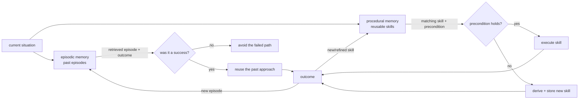
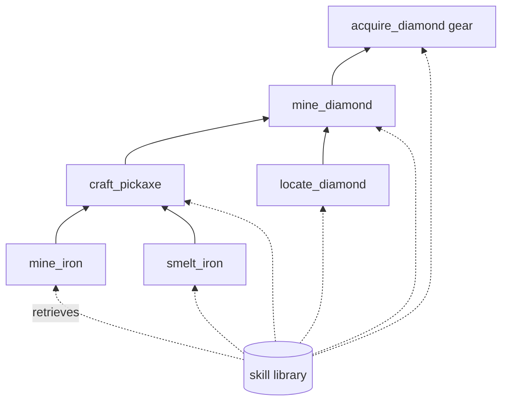
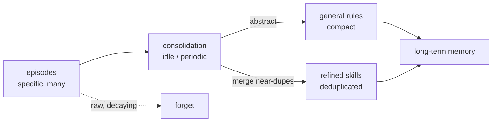

# Chapter 38: Episodic and Procedural Memory

> **Lead paragraph.** Vector memory (Chapter 36) answers "what text is similar?" and knowledge graphs (Chapter 37) answer "what is connected to what?" — but neither captures the two things an agent most needs to learn from: its own past *experiences* and its own reusable *skills*. Episodic memory stores past interactions as retrievable episodes (I tried this, it worked); procedural memory stores reusable how-to knowledge (this is how you do that). Together they are what turns a stateless prompt into an agent that genuinely improves with use. This chapter covers episodic storage and retrieval, Voyager's skill library as the canonical procedural memory, skill composition, and memory consolidation — the process of turning specific episodes into general rules, the computational analog of sleep.

---

## 1. Two Memories for Two Questions

A stateless agent answers every query as if for the first time, re-deriving solutions it has already found. Two memories fix this, and they answer different questions. **Episodic memory** answers "have I faced something like this before, and what happened?" — it stores past interactions as episodes and retrieves by similarity to the current situation. **Procedural memory** answers "how do I do this?" — it stores reusable skills, executable procedures that solved a class of problem, so the agent does not re-solve what it already knows how to do.

The distinction matters because they fail differently. Episodic memory fails by retrieving an irrelevant or misleading past episode (a similar-looking but actually different situation). Procedural memory fails by applying a skill outside its valid scope (a skill learned in one context misfiring in another). The defenses are different too: episodic retrieval needs outcome-checking (did the recalled episode actually succeed?), and procedural skills need scope guards (does the precondition still hold?).



<figcaption>Figure 38.1 — Episodic and procedural memory in the agent loop. The current situation queries both memories: episodic retrieves a past episode (reused if it succeeded, avoided if it failed); procedural retrieves a matching skill (executed if its precondition holds, else a new skill is derived). Every outcome writes a new episode and may refine a skill — the loop is how a stateless agent becomes one that improves.</figcaption>

---

## 2. Episodic Memory: Storing and Retrieving Experience

An **episode** is a record of one past interaction, minimally `(timestamp, query, response, outcome, embedding)`. The outcome — success or failure, measured by some signal — is the crucial field, because an episode without an outcome is not usable memory: it tells you what you did, not whether it worked. Retrieval is similarity-based (the episode whose embedding is nearest the current query) combined with recency weighting (recent episodes matter more, both because they are more likely relevant and because the world may have changed).

This is experience replay in the RL sense (Lin, 1992), generalized. Schaul et al.'s **Prioritized Experience Replay** (2016) sharpens it: not all episodes are equally worth replaying, so prioritize by the magnitude of the learning signal — episodes where the agent was surprised (the outcome differed from its expectation) carry more gradient. The analog for LLM agents is to weight retrieval by outcome *unexpectedness*: an episode where the agent's plan failed against its expectation is more instructive than one where it succeeded predictably. MemoryBank (arXiv 2305.10250) operationalizes this for LLM agents, storing episodes with evolving importance and a forgetting curve — the same recency-and-importance policy from Chapter 36, applied to episodes rather than documents.

```python
import time, math
from dataclasses import dataclass

@dataclass
class Episode:
    query: str
    response: str
    outcome: float          # 1.0 success, 0.0 failure, 0.5 neutral
    surprise: float         # |outcome - expected| -> prioritization
    timestamp: float
    embedding: list

def recency_weighted_score(ep, query_vec, now, half_life=7*24*3600):
    # cosine similarity * recency * (surprise + 1)
    sim = sum(a*b for a, b in zip(query_vec, ep.embedding))   # dot product
    age = now - ep.timestamp
    recency = 0.5 ** (age / half_life)
    return sim * recency * (1.0 + ep.surprise)

def retrieve_episodes(query_vec, episodes, k=3):
    now = time.time()
    ranked = sorted(episodes,
                    key=lambda e: recency_weighted_score(e, query_vec, now),
                    reverse=True)
    return ranked[:k]
```

The surprise term `(1.0 + ep.surprise)` is the prioritized-replay insight in miniature: a surprising episode (the outcome deviated from expectation) gets a multiplier that lifts it above equally-similar but unsurprising ones. The dot product `sum(a*b ...)` is the first multiplication in this chapter — a dot product computed directly as a sum of element-wise products, which would be written $\mathbf{q}^\top \mathbf{e}$ in math notation.

---

## 3. Procedural Memory: Skill Libraries

**Procedural memory** stores reusable how-to knowledge as skills. In an LLM agent, a skill is an executable procedure — a function, a tool-call sequence, a verified plan — that solved a class of problem and can be re-applied. The canonical example is **Voyager** (Wang et al., 2023), an open-ended embodied agent in Minecraft that writes skills as Python functions, stores them in a library, and retrieves and reuses them. When Voyager learns to `mine_iron`, it stores the function; the next time it needs iron, it retrieves and calls the function rather than re-deriving the mining procedure from scratch.

The skill library is what makes Voyager open-ended rather than repetitive. Without it, the agent re-solves every problem afresh — capable but non-learning. With it, each solved problem deposits a reusable asset, and the agent's capability grows monotonically. This is procedural memory's defining property: it converts one-off solutions into permanent capability.

**Skill composition** multiplies this. Skills combine into more complex behaviors: `mine_iron` + `craft_pickaxe` + `mine_diamond` composes into a diamond-acquisition procedure. The composition is itself a skill (stored, retrievable), so the library grows not just by adding atomic skills but by adding composites — a capability hierarchy where high-level skills are built from lower-level ones. This is the computational analog of how humans build expertise: we do not learn each task independently, we compose primitives into routines and routines into strategies.



<figcaption>Figure 38.2 — Skill composition hierarchy. Atomic skills (mine_iron, smelt_iron, locate_diamond) compose into routines (craft_pickaxe, mine_diamond), which compose into strategies (acquire_diamond_gear). Each composite is itself a stored, retrievable skill — the library grows by adding composites, not just atoms, building a capability hierarchy.</figcaption>

---

## 4. Memory Consolidation

Episodes accumulate; skills accumulate; without consolidation, the agent drowns in specifics. **Memory consolidation** is the process of moving short-term memories to long-term by *abstracting* — generalizing specific episodes into general rules, and refining skills by merging near-duplicates. An episode "I tried plan A on task X and it failed because Y" consolidates into the rule "plan A fails when Y" — a compact, general statement that subsumes the specific episode.

This is the computational analog of **sleep**, where the brain consolidates the day's experiences into long-term memory. Few production agents implement true idle-time consolidation, but the concept is important: without it, episodic memory grows unboundedly (the Chapter 36 forgetting problem returns) and procedural memory fragments into many near-duplicate skills (the same procedure stored under slightly different conditions). Consolidation — periodically abstracting episodes into rules and merging skills — is what keeps both memories compact and useful as the agent runs long.



<figcaption>Figure 38.3 — Memory consolidation. Episodic memories are abstracted into general rules and near-duplicate skills are merged into refined ones; the results move to long-term memory while the raw episodes fade. Without consolidation, episodes grow unboundedly and skills fragment; with it, both stay compact and useful — the computational analog of sleep.</figcaption>

---

## 5. MemGPT: Memory as a Managed Hierarchy

**MemGPT** (arXiv 2310.08560) treats LLM memory as an operating system manages memory hierarchies — a main context (RAM), an archival store (disk), and an agent that pages between them. The analogy is precise: an LLM's context window is RAM (fast, limited), the archival store is disk (vast, slow to access), and the MemGPT agent's job is to manage the paging — bringing relevant episodes and skills into context when needed and evicting them when context fills. This is episodic and procedural memory with an explicit memory manager, and it is the pattern that makes long-horizon agents tractable within a fixed context window.

The lesson from MemGPT is that memory is not just storage but *management*. A vast store you cannot navigate is useless; a small context you manage well (paging in the right episodes and skills at the right time) outperforms a huge passive store. The memory manager — deciding what to retrieve, when to evict, what to consolidate — is as important as the memory itself.

---

## 6. Agentic Code Project: Episodic and Procedural Memory with Consolidation

This project implements both memories and the consolidation loop: an episodic store that retrieves by similarity + recency + surprise, a procedural skill library that stores and composes executable skills with preconditions, and a consolidation step that abstracts successful episodes into new skills. It uses the standard `LLMClient` for the abstraction step.

```python
import os, time, json
from dataclasses import dataclass, field

import openai


class LLMClient:
    """OpenAI-compatible client; flips to a local Ollama endpoint."""

    def __init__(self, model="gpt-5.5", use_ollama=False):
        self.model = model
        if use_ollama:
            self.client = openai.OpenAI(
                base_url="http://localhost:11434/v1", api_key="ollama")
        else:
            self.client = openai.OpenAI(api_key=os.getenv("OPENAI_API_KEY"))

    def complete(self, prompt, temperature=0.3, max_tokens=300):
        resp = self.client.chat.completions.create(
            model=self.model,
            messages=[{"role": "user", "content": prompt}],
            temperature=temperature, max_tokens=max_tokens)
        return resp.choices[0].message.content.strip()

    def embed(self, text):
        r = self.client.embeddings.create(
            model="text-embedding-3-small" if not self.model.startswith(("gpt","text")) else "text-embedding-3-small",
            input=text)
        return r.data[0].embedding


@dataclass
class Episode:
    query: str
    response: str
    outcome: float
    surprise: float
    timestamp: float = field(default_factory=time.time)
    embedding: list = field(default_factory=list)


@dataclass
class Skill:
    name: str
    precondition: str
    procedure: str            # executable description / code
    success_count: int = 0


class EpisodicMemory:
    def __init__(self):
        self.episodes = []

    def add(self, query, response, outcome, surprise, llm):
        emb = llm.embed(query)
        self.episodes.append(
            Episode(query, response, outcome, surprise, embedding=emb))

    def retrieve(self, query_vec, k=3, half_life=7*24*3600):
        now = time.time()
        def score(e):
            sim = sum(a*b for a, b in zip(query_vec, e.embedding))   # dot
            recency = 0.5 ** ((now - e.timestamp) / half_life)
            return sim * recency * (1.0 + e.surprise) * (1.0 if e.outcome > 0.5 else 0.1)
        ranked = sorted(self.episodes, key=score, reverse=True)
        return ranked[:k]


class ProceduralMemory:
    def __init__(self):
        self.skills = {}

    def add(self, skill):
        self.skills[skill.name] = skill

    def find(self, query_vec, k=1):
        # in a full system: embed skill descriptions; here return by name match
        return list(self.skills.values())[:k]


def consolidate(episodic, procedural, llm):
    """Turn successful episodes into reusable skills."""
    successes = [e for e in episodic.episodes if e.outcome > 0.8]
    for ep in successes:
        prompt = (f"Abstract this successful interaction into a reusable "
                  f"skill as JSON: {{'name': str, 'precondition': str, "
                  f"'procedure': str}}.\nQuery: {ep.query}\n"
                  f"Response: {ep.response}")
        raw = llm.complete(prompt, temperature=0.2)
        try:
            spec = json.loads(raw)
            skill = Skill(spec["name"], spec.get("precondition",""),
                         spec.get("procedure",""))
            procedural.add(skill)
        except (json.JSONDecodeError, KeyError):
            continue   # skip unparseable, do not crash consolidation


def main():
    llm = LLMClient(use_ollama=True)
    em = EpisodicMemory()
    pm = ProceduralMemory()
    em.add("restart the api server", "ran systemctl restart", 0.95, 0.3, llm)
    em.add("deploy the app", "git push && build", 0.9, 0.2, llm)
    consolidate(em, pm, llm)
    print([s.name for s in pm.skills.values()])


if __name__ == "__main__":
    main()
```

Two behaviors to verify. The episodic retrieval's `(1.0 if e.outcome > 0.5 else 0.1)` factor is outcome-gating — a failed episode is retrieved at one-tenth weight, so the agent can recall what *not* to do without it dominating. The consolidation step's `except` swallows only parse failures and `continue`s — a single unparseable LLM output does not abort consolidation of the other episodes, which respects that the LLM's abstraction is a best-effort candidate, not a guaranteed structured output.

---

## Summary

- Episodic memory stores past interactions as episodes `(timestamp, query, response, outcome, embedding)`; the outcome field is essential — an episode without an outcome tells you what you did, not whether it worked. Retrieval combines similarity, recency, and surprise (Prioritized Experience Replay's insight: surprising episodes carry more learning signal).
- Procedural memory stores reusable how-to knowledge as skills. Voyager's Minecraft skill library is the canonical example: skills written as code, stored, retrieved, and re-applied, so capability grows monotonically rather than each problem being solved afresh. Skills compose into higher-level skills, building a capability hierarchy.
- Memory consolidation abstracts specific episodes into general rules and merges near-duplicate skills — the computational analog of sleep. Without it, episodic memory grows unboundedly and procedural memory fragments; with it, both stay compact and useful over long runs.
- MemGPT treats memory as a managed hierarchy (context as RAM, archival store as disk, an agent that pages between them). The lesson is that memory is not just storage but management — a small context managed well outperforms a vast passive store.
- Episodic and procedural memory fail differently (irrelevant episode retrieved vs. skill applied out of scope), so their defenses differ: outcome-checking for episodic retrieval, precondition guards for procedural skills. Every outcome writes a new episode and may refine a skill — the loop that turns a stateless prompt into an improving agent.

---

## Further Reading

- [Prioritized Experience Replay](https://arxiv.org/abs/1511.05952) — Schaul et al., 2016. Prioritizing replay by the magnitude of the learning signal; the surprise-weighting insight behind episodic prioritization.
- [Voyager: An Open-Ended Embodied Agent with Large Language Models](https://arxiv.org/abs/2305.16291) — Wang et al., 2023. The canonical skill library: Minecraft skills as executable code, composed into a growing capability hierarchy.
- [MemoryBank: Enhancing Large Language Models with Long-Term Memory](https://arxiv.org/abs/2305.10250) — 2023. Episodic storage with evolving importance and a forgetting curve for LLM agents.
- [MemGPT: Towards LLMs as Operating Systems](https://arxiv.org/abs/2310.08560) — 2023. Memory as a managed hierarchy with a paging agent between context (RAM) and archival store (disk).

---