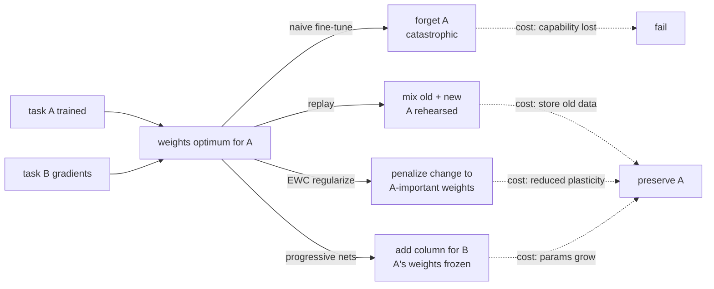
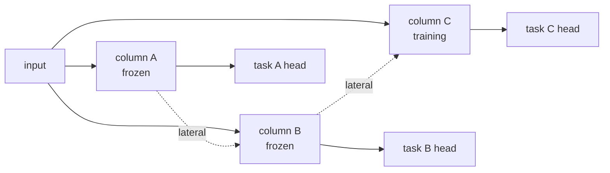

# Chapter 39: Continual Learning and Catastrophic Forgetting

> **Lead paragraph.** Train a network on task A, then on task B, and it will often forget A — not gradually, but catastrophically, the old capability collapsing as the new one is learned. This is the fundamental obstacle to an agent that keeps learning over a lifetime: every new skill threatens the old ones. This chapter covers catastrophic forgetting and the three main strategies against it — replay (rehearse old data), regularization (protect important weights, as in EWC), and architectural growth (add capacity per task, as in progressive networks) — and the metrics that tell you whether you are merely avoiding forgetting or achieving positive backward transfer, where learning B actually improves A. By the end you will see why each strategy trades a different cost (data, plasticity, parameters) and why there is no free lunch in lifelong learning.

---

## 1. Catastrophic Forgetting

**Catastrophic forgetting** (McCloskey & Cohen, 1989) is the observation that when a neural network trained on task A is then trained on task B, performance on A degrades sharply — often to near-random. The mechanism is that the weights that encoded A's solution are overwritten by B's gradients. Since a network's knowledge lives in its weights, and a sequential training regime repurposes the same weights for the new task, the old task's representation is destroyed. This is not a minor degradation; it is catastrophic, and it is the reason a naive fine-tuning loop cannot produce a continually-learning agent.

The problem is structural, not a bug to fix. A network has finite capacity, and learning is destructive: to encode new information, weights must move, and moving them away from an old task's optimum degrades that task. Any continual-learning strategy is a choice about which cost to pay to preserve the old optimum. The three strategies — replay, regularization, architectural growth — each pay a different cost, and none is free.



<figcaption>Figure 39.1 — Catastrophic forgetting and its three mitigations. Naive fine-tuning on task B overwrites A's weights and forgets A catastrophically. Replay rehearse old data; EWC regularizes change to A-important weights; progressive nets add a new column for B and freeze A's. Each preserves A but pays a different cost — stored data, reduced plasticity, or growing parameters.</figcaption>

---

## 2. Replay: Rehearse the Old

The simplest defense is **replay**: when training on B, mix in samples from A so the old task's gradients are present alongside the new. The network never fully leaves A's optimum because it is periodically pulled back. Chapter 38's experience replay is exactly this, applied to continual learning — the episodic memory buffer is the source of rehearsed samples.

Replay is simple and effective, and it is the strategy that translates most directly to LLM agents (which can store episodes and re-train or in-context-rehearse them). Its cost is **data**: you must store the old data (or a representative subset), which raises privacy and storage concerns at scale. The variant **generative replay** sidesteps storage by training a generative model to produce pseudo-samples of old tasks, rehearsing on generated rather than stored data — trading storage for the fidelity risk that the generated samples drift from the real distribution.

---

## 3. EWC: Protect Important Weights

**Elastic Weight Consolidation** (EWC, Kirkpatrick et al., 2017) takes a different cut: instead of rehearsing old data, protect the *weights that matter* for the old task. The key insight is that not all weights are equally important to A — some sit on a flat part of A's loss surface (moving them barely affects A), others on a sharp part (moving them destroys A). EWC estimates each weight's importance to A (via the Fisher information, the curvature of the loss with respect to that weight) and adds a penalty proportional to importance when training on B:

$$\mathcal{L}_{\text{total}} = \mathcal{L}_B(\theta) + \sum_i \frac{\lambda}{2} F_i (\theta_i - \theta_{A,i}^*)^2$$

where $\frac{\lambda}{2} F_i (\theta_i - \theta_{A,i}^*)^2$ is a per-weight quadratic penalty (the $F_i$ a scalar importance, $\theta_{A,i}^*$ the old-task optimum). The penalty acts like a spring anchored at $\theta_{A,i}^*$ — stiff for important weights (high $F_i$, strongly resisting change), weak for unimportant ones (low $F_i$, free to move). The network learns B by repurposing the unimportant weights while the important ones stay near their A-optimal values.

EWC's cost is **plasticity**: as tasks accumulate and more weights become "important" to some prior task, the network has less and less free capacity to learn new things, eventually becoming rigid. The spring analogy is exact and also its limit — a network with springs on every weight cannot move at all.

```python
import torch

def ewc_loss(new_loss, params, old_params, fisher, lam=400.0):
    # new_loss: task B loss; fisher: per-param importance from task A
    # old_params: theta_A* (the A-optimum to anchor near)
    penalty = 0.0
    for n, p in params.items():
        # scalar fisher[n] * (p - old)^2  summed over params
        penalty += (fisher[n] * (p - old_params[n]) ** 2).sum()
    return new_loss + (lam / 2.0) * penalty

def estimate_fisher(model, data_loader, n_samples=1000):
    # Fisher ~= mean of squared gradients of log-likelihood wrt params
    fisher = {n: torch.zeros_like(p) for n, p in model.named_parameters()}
    model.eval()
    for i, (x, y) in enumerate(data_loader):
        if i >= n_samples:
            break
        model.zero_grad()
        out = model(x)
        loss = torch.nn.functional.nll_loss(out, y)
        loss.backward()
        for n, p in model.named_parameters():
            fisher[n] += p.grad.data ** 2
    return {n: f / n_samples for n, f in fisher.items()}
```

The Fisher estimate (mean of squared gradients) is the curvature proxy — a weight whose loss is sensitive (large gradient) is important and gets a stiff spring; a weight the loss ignores (small gradient) is free. The $\lambda$ knob is the global spring stiffness: too low and B overwrites A, too high and the network cannot learn B at all.

---

## 4. Progressive Networks: Grow, Don't Overwrite

**Progressive networks** (Rusu et al., 2016) refuse the trade entirely: instead of reusing weights, add a new **column** (a fresh set of layers) for each new task, freezing the old columns. Task A's column is frozen at its optimum and never overwritten, so forgetting is impossible by construction. The new column for B can read from A's frozen features via lateral connections, enabling transfer, but A's own weights never move.

The cost is **parameter growth**: each task adds a column, so parameters grow linearly with the number of tasks. For a few tasks this is fine; for a lifelong learner accumulating hundreds, it is prohibitive. Progressive networks are the strategy of choice when forgetting is unacceptable (safety-critical, regulated) and the task count is bounded; replay or EWC are the choices when growth must be contained.



<figcaption>Figure 39.3 — Progressive networks. Each task gets a frozen column; a new task adds a fresh column that can read earlier columns' features via lateral connections but never modifies them. Forgetting is impossible by construction; the cost is parameters growing linearly with task count.</figcaption>

**Learning without Forgetting** (LwF, Li & Hoiem, 2017) is a hybrid: it uses the old model's outputs on the *new* task's data as a distillation target, so the new model is regularized to preserve the old model's behavior without needing the old data. It is replay without the replay buffer — the new data stands in for the old, via distillation.

---

## 5. Backward Transfer: The Real Goal

Avoiding forgetting is the floor; the goal is **backward transfer** — learning B *improves* A. The metrics that capture this distinguish three regimes:

- **Forgetting** — performance on A drops after learning B (negative backward transfer). The failure case.
- **Retention** — A is preserved (near-zero backward transfer). The floor.
- **Positive backward transfer** — A improves after learning B. The gold standard.

Positive backward transfer happens when B is related to A in a way that refines shared representations — learning a harder version of a task can sharpen performance on the easier one. Most continual-learning methods achieve retention at best; achieving reliable positive transfer is an open research problem, and the honest framing is that retention is the realistic target, positive transfer the aspiration.

<figure>
<svg width="100%" viewBox="0 0 820 300" xmlns="http://www.w3.org/2000/svg">
  <rect x="0" y="0" width="820" height="300" fill="#ffffff"/>
  <text x="410" y="28" font-family="sans-serif" font-size="14" fill="#222222" text-anchor="middle" font-weight="bold">Task A performance across the A→B learning sequence</text>
  <line x1="80" y1="250" x2="760" y2="250" stroke="#333333" stroke-width="1.5"/>
  <text x="420" y="278" font-family="sans-serif" font-size="11" fill="#333333" text-anchor="middle">training step →</text>
  <line x1="80" y1="250" x2="80" y2="60" stroke="#333333" stroke-width="1.5"/>
  <text x="50" y="155" font-family="sans-serif" font-size="11" fill="#333333" text-anchor="middle" transform="rotate(-90 50 155)">task A accuracy →</text>
  <!-- phase divider -->
  <line x1="340" y1="60" x2="340" y2="250" stroke="#cccccc" stroke-width="1" stroke-dasharray="4 4"/>
  <text x="210" y="78" font-family="sans-serif" font-size="11" fill="#999999" text-anchor="middle">train A</text>
  <text x="550" y="78" font-family="sans-serif" font-size="11" fill="#999999" text-anchor="middle">train B (after A)</text>
  <!-- forgetting curve -->
  <path d="M 100 230 Q 220 120 340 95 Q 460 200 740 230" fill="none" stroke="#993C1D" stroke-width="2.5"/>
  <text x="640" y="222" font-family="sans-serif" font-size="11" fill="#993C1D" text-anchor="middle">forgetting</text>
  <!-- retention curve -->
  <path d="M 100 230 Q 220 120 340 95 Q 460 95 740 94" fill="none" stroke="#534AB7" stroke-width="2.5"/>
  <text x="640" y="88" font-family="sans-serif" font-size="11" fill="#534AB7" text-anchor="middle">retention</text>
  <!-- positive backward transfer -->
  <path d="M 100 230 Q 220 120 340 95 Q 460 80 740 66" fill="none" stroke="#0F6E56" stroke-width="2.5"/>
  <text x="640" y="60" font-family="sans-serif" font-size="11" fill="#0F6E56" text-anchor="middle">positive backward transfer</text>
  <circle cx="340" cy="95" r="5" fill="#222222"/>
  <text x="340" y="112" font-family="sans-serif" font-size="10" fill="#222222" text-anchor="middle">A learned</text>
</svg>
<figcaption>Figure 39.2 — Backward transfer regimes. After learning B, task A performance either drops (forgetting), holds (retention), or improves (positive backward transfer). Forgetting is the failure; retention is the realistic target; positive backward transfer — B refining A's shared representations — is the gold standard and an open research problem.</figcaption>
</figure>

---

## 6. Continual Learning for Agents

For LLM agents, the continual-learning problem takes a specific shape. The agent acquires new **tools** over time (a new API, a new capability) and adapts to new **domains** (a new vertical, a new user base). The forgetting risk is that learning the new tool or domain degrades performance on the old ones. The strategies map directly:

- **Replay** — re-train or in-context-rehearse on old-task episodes (Chapter 38's episodic memory is the buffer). The most agent-natural strategy, since agents already store episodes.
- **Regularization** — applies when fine-tuning the model weights; less relevant for pure-prompt agents but central for any agent that fine-tunes.
- **Architectural growth** — add new adapters or LoRA modules per task/domain, freezing the base — the progressive-networks idea scaled to LLMs via parameter-efficient fine-tuning.

**Curriculum learning** — sequencing tasks easy-to-hard — is the complementary input-side strategy: the order in which tasks are learned affects both final performance and forgetting, and a well-designed curriculum can reduce forgetting by ensuring foundational tasks are learned robustly before dependent ones.

---

## 7. Agentic Code Project: Continual Learning with Replay and EWC

This project implements a continual-learning loop over two tasks: it trains a small network on task A, estimates the Fisher importance, then trains on task B with EWC regularization and replay, and reports the backward-transfer metric for A. It is pure PyTorch. The agent-natural variant (replay from an episodic buffer) is shown alongside the weight-space EWC.

```python
import torch
import torch.nn as nn
import copy
from dataclasses import dataclass, field


class TinyNet(nn.Module):
    def __init__(self, in_dim, n_classes):
        super().__init__()
        self.fc = nn.Sequential(
            nn.Linear(in_dim, 32), nn.ReLU(), nn.Linear(32, n_classes))

    def forward(self, x):
        return self.fc(x)


def make_task(n, in_dim, n_classes, seed):
    g = torch.Generator().manual_seed(seed)
    X = torch.randn(n, in_dim, generator=g)
    W = torch.randn(in_dim, n_classes, generator=g)
    y = (X @ W).argmax(dim=1)
    return X, y


def fisher_diag(model, X, y):
    fisher = {n: torch.zeros_like(p) for n, p in model.named_parameters()}
    model.zero_grad()
    out = model(X)
    loss = nn.functional.cross_entropy(out, y)
    loss.backward()
    for n, p in model.named_parameters():
        fisher[n] += p.grad.detach() ** 2
    return {n: f / X.size(0) for n, f in fisher.items()}


def ewc_train(model, Xb, yb, old_params, fisher, replay, lam=400.0,
             steps=200, lr=1e-2):
    opt = torch.optim.SGD(model.parameters(), lr=lr)
    Xr, yr = replay
    for _ in range(steps):
        opt.zero_grad()
        loss_b = nn.functional.cross_entropy(model(Xb), yb)
        penalty = sum((fisher[n] * (p - old_params[n]) ** 2).sum()
                      for n, p in model.named_parameters())
        replay_loss = nn.functional.cross_entropy(model(Xr), yr) if replay else 0.0
        (loss_b + (lam / 2.0) * penalty + replay_loss).backward()
        opt.step()


@dataclass
class ContinualResult:
    acc_a_before: float
    acc_a_after: float
    backward_transfer: float     # after - before


def accuracy(model, X, y):
    with torch.no_grad():
        return (model(X).argmax(dim=1) == y).float().mean().item()


def run(use_replay=True, use_ewc=True):
    in_dim, n_classes = 20, 4
    model = TinyNet(in_dim, n_classes)
    Xa, ya = make_task(200, in_dim, n_classes, seed=1)
    Xb, yb = make_task(200, in_dim, n_classes, seed=2)
    # train A
    ewc_train(model, Xa, ya, old_params={n: p.clone() for n, p in
              model.named_parameters()}, fisher={n: torch.zeros_like(p)
              for n, p in model.named_parameters()}, replay=None, lam=0)
    acc_before = accuracy(model, Xa, ya)
    old_params = {n: p.detach().clone() for n, p in model.named_parameters()}
    fisher = fisher_diag(model, Xa, ya)
    replay = (Xa, ya) if use_replay else None
    lam = 400.0 if use_ewc else 0.0
    ewc_train(model, Xb, yb, old_params, fisher, replay, lam=lam)
    acc_after = accuracy(model, Xa, ya)
    return ContinualResult(acc_before, acc_after, acc_after - acc_before)


if __name__ == "__main__":
    r = run(use_replay=True, use_ewc=True)
    print(f"A before: {r.acc_before:.3f}  A after: {r.acc_a_after:.3f}  "
          f"backward transfer: {r.backward_transfer:+.3f}")
```

Run it with both `use_replay` and `use_ewc` toggled to see the regimes of Figure 39.2 empirically: both off is forgetting (large negative backward transfer); replay or EWC alone gives partial retention; both on gives retention approaching the floor. The `backward_transfer` field is the metric — its sign and magnitude tell you which regime you are in, and whether your mitigation is actually working.

A second, smaller snippet makes the replay-as-rehearsal idea concrete for the agent setting, where the "old data" is an episodic buffer sampled by the Chapter 38 surprise-weighting:

```python
import random

def sample_replay(buffer, batch_size, surprise_weight=True):
    # buffer: list of episodes with .surprise; sample old experience for rehearsal
    if not buffer:
        return []
    weights = [e.surprise + 1.0 if surprise_weight else 1.0 for e in buffer]
    return random.choices(buffer, weights=weights, k=batch_size)
```

---

## Summary

- Catastrophic forgetting is structural, not a bug: a network's knowledge lives in its weights, and sequential training repurposes the same weights for the new task, destroying the old optimum. Any continual-learning strategy is a choice of which cost to pay to preserve old tasks — stored data, reduced plasticity, or growing parameters.
- Replay rehearse old data alongside new (simple, effective, agent-natural since episodes are already stored); generative replay trades storage for fidelity risk. EWC protects important weights via a Fisher-information-weighted quadratic penalty — a spring anchored at the old optimum, stiff for important weights, weak for unimportant — at the cost of plasticity as tasks accumulate.
- Progressive networks add a frozen column per task (forgetting impossible by construction, parameters grow linearly); LwF distills the old model's behavior on new data, replay without the buffer. Each pays a different cost; none is free.
- Backward transfer is the real metric: forgetting (A drops), retention (A holds, the realistic target), positive backward transfer (A improves, the gold standard and open problem). Measure it; do not assume retention from a method that merely hopes for it.
- For LLM agents, replay is the most natural strategy (episodic memory is the buffer), EWC/regularization applies when fine-tuning weights, and architectural growth maps to per-task LoRA/adapters. Curriculum learning — easy-to-hard task ordering — reduces forgetting on the input side by ensuring foundational tasks are learned robustly first.

---

## Further Reading

- [Overcoming Catastrophic Forgetting in Neural Networks (EWC)](https://arxiv.org/abs/1612.00796) — Kirkpatrick et al., 2017. Fisher-information-weighted quadratic penalty protecting important weights.
- [Progressive Neural Networks](https://arxiv.org/abs/1606.04671) — Rusu et al., 2016. Per-task frozen columns with lateral connections; forgetting impossible, parameters grow linearly.
- [Learning without Forgetting (LwF)](https://arxiv.org/abs/1606.09282) — Li & Hoiem, 2017. Distillation-based replay using the old model's outputs on new data.
- [Catastrophic Interference in Connectionist Networks](https://psycnet.apa.org/record/1990-00176-001) — McCloskey & Cohen, 1989. The original characterization of catastrophic forgetting.

---