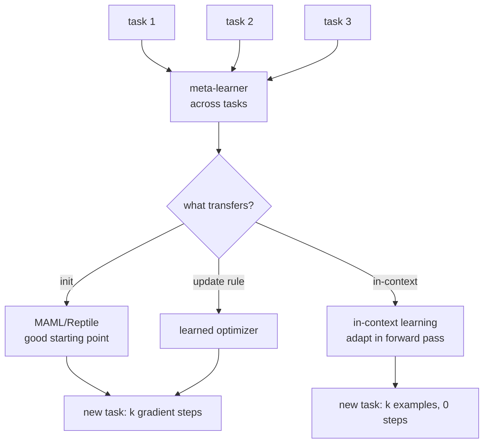
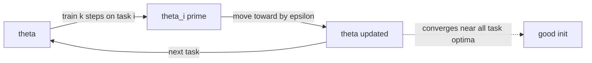

# Chapter 40: Meta-Learning and Few-Shot Adaptation

> **Lead paragraph.** Continual learning (Chapter 39) asks how to learn task B without forgetting A; meta-learning asks a deeper question — how to *learn to learn*, so that a new task is mastered in a few examples rather than thousands. The classic methods (MAML, Reptile) find initialization points from which one gradient step adapts well; the modern LLM analog is in-context learning, where describing a new tool in natural language lets the agent use it immediately, no gradients at all. This chapter covers both, plus case-based planning and hindsight experience replay, and ends with the practical lesson: for today's LLM agents, in-context adaptation has largely displaced gradient-based meta-learning, but the meta-learning framing still tells you what "good adaptation" means. By the end you will understand MAML's inner loop, why Reptile is simpler and nearly as good, and when few-shot in-context is the right tool.

---

## 1. Learning to Learn

A standard learner optimizes parameters for one task. A **meta-learner** optimizes parameters (or a procedure) across many tasks, so that adaptation to a *new* task is fast. The motivation is few-shot: a human shown two examples of a new concept generalizes; a network trained from scratch needs thousands. Meta-learning closes that gap by finding a starting point — or a learning procedure — from which few-shot adaptation works.

The framing matters because it sharpens the goal. "Adapt fast" is vague; "after $k$ gradient steps on $n$ examples, reach performance $\geq \tau$" is a metric. Meta-learning methods are distinguished by *what* they meta-learn: MAML meta-learns an initialization, Reptile the same (differently), learned-optimizer methods meta-learn the update rule itself, and in-context learning meta-learns (during pre-training) the ability to adapt inside the forward pass with no weight updates at all. Each is an answer to "what should transfer across tasks so the next task is easy?"



<figcaption>Figure 40.1 — What meta-learning transfers. Across many tasks, the meta-learner extracts what should transfer: an initialization (MAML/Reptile), an update rule (learned optimizers), or the ability to adapt inside the forward pass (in-context learning). The new task is then mastered by gradient steps (init/update-rule methods) or by examples alone (in-context, no weight updates).</figcaption>

---

## 2. MAML: A Good Initialization

**Model-Agnostic Meta-Learning** (MAML, Finn et al., 2017) finds parameters $\theta$ such that one (or a few) gradient steps on a new task yield good performance. The idea: instead of training $\theta$ to be good on any one task, train it to be *adaptable* — to sit at a point from which a small move reaches a good solution for whichever task you face.

MAML has a two-loop structure. The **inner loop** adapts to a task: take the meta-parameters $\theta$, take $k$ gradient steps on that task's support set to get task-specific $\theta_i'$. The **outer loop** updates $\theta$ so that the *post-inner-loop* performance is good — it evaluates $\theta_i'$ on the query set and backpropagates through the inner gradient steps to update $\theta$. This requires second-order gradients (differentiating through the gradient update), which is what makes MAML expensive; first-order MAML (FOMAML) drops the second-order term and still works, at a cost in theory but little in practice.

$$\theta_i' = \theta - \alpha \nabla_\theta \mathcal{L}_{\text{support}}(\theta)$$

where $\alpha \nabla_\theta \mathcal{L}_{\text{support}}(\theta)$ is the inner-loop gradient step (the $\alpha$ a scalar learning rate, the first multiplication in this chapter — a scalar times a gradient vector). The meta-objective is then $\min_\theta \sum_i \mathcal{L}_{\text{query}}(\theta_i')$, minimized over the post-adaptation loss.

```python
import torch

def maml_inner_step(model, loss_fn, x_s, y_s, alpha=0.01):
    # one gradient step on the support set -> adapted params theta_i'
    grads = torch.autograd.grad(loss_fn(model, x_s, y_s),
                                model.parameters(), create_graph=True)
    adapted = {n: p - alpha * g
               for (n, p), g in zip(model.named_parameters(), grads)}
    return adapted

def maml_meta_loss(model, loss_fn, support, query, alpha=0.01):
    x_s, y_s = support
    x_q, y_q = query
    adapted = maml_inner_step(model, loss_fn, x_s, y_s, alpha)
    # evaluate adapted params on query: meta-loss is post-adaptation loss
    out = model.forward_with(x_q, adapted)
    return loss_fn(out, x_q, y_q)
```

The `create_graph=True` is the second-order bit — it keeps the graph so the outer-loop update can backpropagate through the inner step. Dropping it gives FOMAML. The meta-loss being the *post-adaptation* loss is the whole point: MAML does not care how good $\theta$ is before adaptation, only how good $\theta_i'$ is after.

---

## 3. Reptile: Simpler, Nearly as Good

**Reptile** (Nichol et al., 2018) reaches a similar good-initialization without second-order gradients or even a support/query split. The procedure is strikingly simple: sample a task, train on it for a few steps to get $\theta_i'$, then move the meta-parameters *toward* $\theta_i'$:

$$\theta \leftarrow \theta + \epsilon (\theta_i' - \theta)$$

where $\epsilon (\theta_i' - \theta)$ is a move of the meta-parameters toward the task-adapted parameters (the $\epsilon$ a scalar step size). Repeat across many tasks. Reptile converges to an initialization near all tasks' optima — the same goal as MAML, achieved by averaging task-adaptation directions rather than by differentiating through them.

Reptile is simpler (first-order only, no support/query split, no Hessian), cheaper, and empirically nearly as good as MAML. For most practical purposes it is the gradient-based meta-learning method to reach for first; MAML is the theoretically cleaner reference. Antoniou et al.'s "How to Train Your MAML" (2019) catalogues the engineering tricks — inner-loop learning rates, per-step loss weighting, first-order versus second-order — that make MAML training stable, which matters because a naive MAML implementation is notoriously finicky to train.



<figcaption>Figure 40.2 — Reptile. Sample a task, train a few steps to get task-adapted parameters, move the meta-parameters toward them, repeat. No second-order gradients, no support/query split — it averages task-adaptation directions to find an initialization near all tasks' optima, achieving MAML's goal far more simply.</figcaption>

---

## 4. In-Context Learning: Adaptation Without Gradients

For LLM agents, the dominant form of few-shot adaptation is **in-context learning** — no gradient steps at all. Describe a new tool or show a few examples in the prompt, and the model adapts inside the forward pass. This is meta-learning in the sense that pre-training taught the model *how to adapt from context*, but the adaptation itself is weight-free and instant.

This is the practical lesson of the chapter for agent builders: gradient-based meta-learning (MAML, Reptile) is the classical theory and still relevant for fine-tuning small models on many tasks, but for frontier LLM agents, in-context tool acquisition has largely displaced it. You do not MAML a frontier model to use a new API; you describe the API in the prompt and the model uses it. The cases where gradient-based meta-learning still pays are when you fine-tune your own smaller models for a fleet of related tasks — there, a MAML/Reptile initialization can make each task's few-shot fine-tune converge faster.

<figure>
<svg width="100%" viewBox="0 0 820 280" xmlns="http://www.w3.org/2000/svg">
  <rect x="0" y="0" width="820" height="280" fill="#ffffff"/>
  <text x="410" y="28" font-family="sans-serif" font-size="14" fill="#222222" text-anchor="middle" font-weight="bold">Adaptation speed: gradient meta-learning vs in-context</text>
  <line x1="80" y1="230" x2="760" y2="230" stroke="#333333" stroke-width="1.5"/>
  <text x="420" y="258" font-family="sans-serif" font-size="11" fill="#333333" text-anchor="middle">wall-clock time to usable on new task →</text>
  <line x1="80" y1="230" x2="80" y2="60" stroke="#333333" stroke-width="1.5"/>
  <text x="50" y="145" font-family="sans-serif" font-size="11" fill="#333333" text-anchor="middle" transform="rotate(-90 50 145)">task performance →</text>
  <!-- MAML/Reptile: slow ramp to higher asymptote -->
  <path d="M 100 225 Q 200 180 300 150 Q 420 120 540 95 Q 640 80 740 72" fill="none" stroke="#534AB7" stroke-width="2.5"/>
  <text x="660" y="62" font-family="sans-serif" font-size="11" fill="#534AB7" text-anchor="middle">MAML/Reptile (gradient)</text>
  <!-- in-context: instant to lower asymptote -->
  <path d="M 100 225 L 130 120 Q 200 112 300 108 Q 500 105 740 104" fill="none" stroke="#0F6E56" stroke-width="2.5"/>
  <text x="660" y="135" font-family="sans-serif" font-size="11" fill="#0F6E56" text-anchor="middle">in-context (0 gradient)</text>
  <circle cx="120" cy="120" r="5" fill="#0F6E56"/>
  <text x="160" y="118" font-family="sans-serif" font-size="10" fill="#0F6E56" text-anchor="middle">instant, lower ceiling</text>
  <text x="410" y="210" font-family="sans-serif" font-size="11" fill="#993C1D" text-anchor="middle">Gradient methods reach higher ceilings but need minutes-hours; in-context is instant but lower-ceiling.</text>
</svg>
<figcaption>Figure 40.3 — Adaptation speed trade-off. In-context learning is instant (one forward pass) but reaches a lower performance ceiling — it cannot exceed what the pre-trained weights know. Gradient-based meta-learning (MAML/Reptile) is slower (minutes to hours of fine-tuning) but reaches a higher ceiling by actually moving weights. For frontier LLM agents, in-context's instant adaptation usually wins; for fine-tuning small models across many tasks, gradient methods reach further.</figcaption>
</figure>

---

## 5. Case-Based Planning and Hindsight Replay

Two adaptation strategies that fit the agent setting specifically:

**Case-based planning** retrieves a similar past plan and adapts it to the current situation rather than planning from scratch. This is procedural memory (Chapter 38) applied to plans: the skill library stores successful plans, and a new problem retrieves the nearest plan and modifies it. Faster than from-scratch planning, and it inherits the verified structure of the retrieved plan — but it inherits the retrieved plan's *assumptions* too, which may not hold for the new situation.

**Hindsight Experience Replay** (HER, Andrychowicz et al., 2017) is a clever trick for goal-conditioned learning: when an episode fails to achieve its intended goal, re-label the episode *as if* its achieved final state had been the goal. The agent failed to reach goal $g$, but it did reach state $s_T$, so treat $(s_T)$ as a goal it achieved. This turns every failed episode into a successful one for *some* goal, densifying sparse-reward environments. The lesson generalizes: an attempt that failed for its intended purpose still taught the agent how to reach *something*, and re-labeling salvages that learning rather than discarding it.

---

## 6. Agentic Code Project: In-Context Tool Acquisition with Adaptation

This project implements the agent-practical form of meta-learning: in-context tool acquisition. The agent is given a natural-language description of a new tool and a few usage examples, then must use the tool on a new query — adapting inside the forward pass, no gradient steps. It also includes a case-based-planning fallback: if no in-context tool fits, retrieve a similar past plan and adapt it. It uses the standard `LLMClient`.

```python
import os, json
from dataclasses import dataclass

import openai


class LLMClient:
    """OpenAI-compatible client; flips to a local Ollama endpoint."""

    def __init__(self, model="gpt-5.5", use_ollama=False):
        self.model = model
        if use_ollama:
            self.client = openai.OpenAI(
                base_url="http://localhost:11434/v1", api_key="ollama")
        else:
            self.client = openai.OpenAI(api_key=os.getenv("OPENAI_API_KEY"))

    def complete(self, prompt, temperature=0.2, max_tokens=400):
        resp = self.client.chat.completions.create(
            model=self.model,
            messages=[{"role": "user", "content": prompt}],
            temperature=temperature, max_tokens=max_tokens)
        return resp.choices[0].message.content.strip()


@dataclass
class Tool:
    name: str
    description: str
    examples: list          # list of (input, output) few-shot examples


def use_tool_in_context(tool, query, llm):
    """Few-shot in-context: describe tool + examples, then new query."""
    shots = "\n".join(f"Input: {i}\nOutput: {o}" for i, o in tool.examples)
    prompt = (f"Tool: {tool.name}\nDescription: {tool.description}\n"
              f"Examples:\n{shots}\n\nNow apply this tool.\nInput: {query}\n"
              f"Output:")
    return llm.complete(prompt, temperature=0.1)


def case_based_plan(past_plans, query, llm):
    """Retrieve a similar past plan and adapt it (case-based planning)."""
    plans = "\n".join(f"- {p}" for p in past_plans)
    prompt = (f"Past successful plans:\n{plans}\n\n"
              f"Adapt the closest plan to this new query. "
              f"Return the adapted plan as a numbered list.\nQuery: {query}")
    return llm.complete(prompt, temperature=0.3).split("\n")


def adapt(tool, query, past_plans, llm):
    # try in-context tool use; fall back to case-based planning
    result = use_tool_in_context(tool, query, llm)
    if len(result) < 5:
        return ("case-based", case_based_plan(past_plans, query, llm))
    return ("in-context", result)


def main():
    llm = LLMClient(use_ollama=True)
    currency_tool = Tool(
        name="currency_convert",
        description="Convert an amount from one currency to another "
                    "using the rate amount * rate.",
        examples=[("100 USD to EUR at 0.92", "92.00 EUR"),
                  ("50 EUR to USD at 1.09", "54.50 USD")])
    past_plans = ["1. parse amount 2. look up rate 3. multiply 4. format"]
    mode, out = adapt(currency_tool, "200 USD to EUR at 0.92",
                      past_plans, llm)
    print(f"via {mode}: {out}")


if __name__ == "__main__":
    main()
```

The design reflects the chapter's practical lesson: in-context adaptation is tried first (instant, weight-free), with case-based planning as the fallback when no described tool fits. The `few-shot examples` in the `Tool` are the meta-learning signal — they teach the model the tool's input-output mapping inside the forward pass, exactly as in-context learning does. No gradient steps, no fine-tuning; the adaptation is the prompt.

---

## Summary

- Meta-learning optimizes across many tasks so a new task is mastered in a few examples. The key question is *what transfers*: an initialization (MAML/Reptile), an update rule (learned optimizers), or in-context adaptation ability (ICL, learned during pre-training).
- MAML finds parameters from which one or few gradient steps adapt well to a new task, via a two-loop structure (inner: adapt on support; outer: optimize post-adaptation query loss, requiring second-order gradients). FOMAML drops the second-order term and still works.
- Reptile reaches a similar good initialization far more simply: sample a task, train a few steps, move meta-parameters toward the task-adapted parameters, repeat. First-order, no support/query split, nearly as good as MAML — reach for it first.
- For LLM agents, in-context tool acquisition has largely displaced gradient-based meta-learning: describe a new tool with few-shot examples in the prompt, and the model adapts in the forward pass, no weight updates. Gradient methods still pay when fine-tuning smaller models across many related tasks. The trade: in-context is instant but lower-ceiling; gradient methods are slower but reach higher.
- Case-based planning retrieves and adapts a similar past plan (procedural memory applied to plans); Hindsight Experience Replay re-labels failed episodes as successes for their achieved state, densifying sparse rewards by salvaging learning from every attempt.

---

## Further Reading

- [Model-Agnostic Meta-Learning for Fast Adaptation of Deep Networks (MAML)](https://arxiv.org/abs/1703.03400) — Finn et al., 2017. The two-loop initialization-based meta-learner.
- [On First-Order Meta-Learning Algorithms (Reptile)](https://arxiv.org/abs/1803.02999) — Nichol, Achiam, & Schulman, 2018. The simpler move-toward-adapted-params variant.
- [How to Train Your MAML](https://arxiv.org/abs/1810.09502) — Antoniou et al., 2019. Engineering tricks for stable MAML training.
- [Hindsight Experience Replay](https://arxiv.org/abs/1707.01495) — Andrychowicz et al., 2017. Re-labeling failed episodes as successes for their achieved state.

---