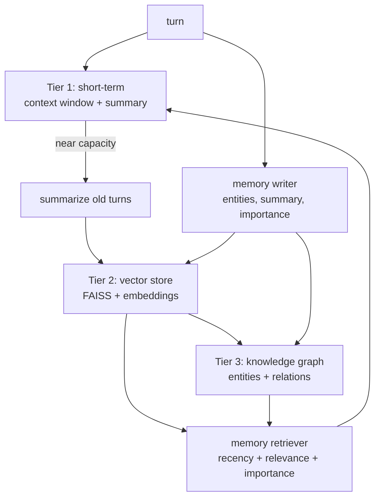
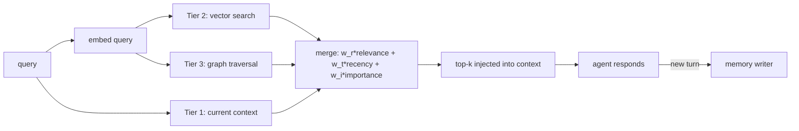
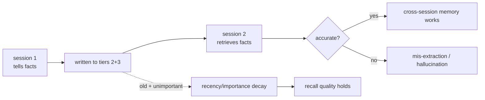

# Chapter 41: Project — Building a Long-Term Memory Agent

> **Lead paragraph.** Part V built the pieces: vector memory (Chapter 36), knowledge graphs (37), episodic and procedural memory (38), continual learning (39), meta-learning (40). This capstone assembles them into a three-tier long-term memory agent — the architecture that makes an agent remember across sessions the way a human assistant does. Tier 1 is short-term: the context window plus summarization to compress old turns and make room. Tier 2 is vector: dense retrieval of relevant past conversations. Tier 3 is a knowledge graph: entities and relations for structured queries. A memory writer decides what to store after each turn; a memory retriever combines recency, relevance, and importance to inject the right context for the next. By the end you will have a running long-term-memory agent and an evaluation that asks the questions that matter: does it recall facts across sessions, is what it recalls correct, and does old unimportant information decay?

---

## 1. The Three Tiers

A single memory representation cannot serve an agent that must recall the immediate conversation, retrieve relevant past interactions, and answer structured questions about what it knows. Each need maps to a tier, and the tiers differ in latency, capacity, and access pattern.

- **Tier 1 — Short-term (context + summarization):** the active context window. Fast (no retrieval), but bounded — it holds the current conversation and fills as turns accumulate. When it nears capacity, old turns are summarized and compressed to make room. This is MemGPT's RAM.
- **Tier 2 — Vector (dense retrieval):** a FAISS-backed store of past conversations embedded for semantic search. Slower (a retrieval call), but unbounded — it holds every past turn and returns the semantically relevant ones. This is Chapter 36's vector memory, applied to conversation.
- **Tier 3 — Knowledge graph (entities + relations):** extracted triples enable structured queries that vectors cannot answer ("what did we discuss about neural networks?" is a traversal, not a similarity). This is Chapter 37's structured memory.



<figcaption>Figure 41.1 — Three-tier long-term memory. Tier 1 (short-term) holds the active context and summarizes old turns to make room. Tier 2 (vector) stores every past turn for semantic retrieval. Tier 3 (knowledge graph) holds extracted entities and relations for structured queries. A memory writer extracts and stores after each turn; a memory retriever combines all tiers to inject context for the next.</figcaption>

The tiers compose rather than compete: a query hits Tier 1 (instant, current context), Tier 2 (relevant past), and Tier 3 (structured), and the retriever merges them. This is the same hybrid lesson from Chapters 36 and 37 — no single representation suffices, and a real agent memory is the composition.

---

## 2. The Memory Writer

After each turn, the **memory writer** decides what to store. Not everything deserves persistence — idle chatter is noise that will dilute future retrieval. The writer extracts three things: an **entity-and-relation summary** (triples for Tier 3), a **prose summary** (for Tier 2 embedding), and an **importance score** (to weight retrieval and forgetting). Importance scoring filters noise: a turn about the user's name or a decision made is high-importance; a turn of small talk is low.

The writer is where the LLM earns its keep in a memory system — it turns raw conversation into structured, retrievable, confidence-tagged knowledge. The risk is the same as throughout: the LLM may extract triples the conversation does not support, or score importance wrongly. The defenses are the same: confidence/provenance on extracted facts, and treating the importance score as a hint to weight, not a truth to trust.

---

## 3. The Memory Retriever

The **memory retriever** runs before each response: given the current query, it pulls from all three tiers and merges them into context. The merge is a weighted combination of three signals — the same three from Chapter 36, now across tiers:

- **Relevance** — semantic similarity (Tier 2 cosine) and graph proximity (Tier 3 neighbors).
- **Recency** — recent memories matter more; weight by time-since-access.
- **Importance** — the stored importance score weights retrieval.



<figcaption>Figure 41.2 — The memory retriever. The query is embedded and used for both vector search (Tier 2) and graph traversal (Tier 3); the current context (Tier 1) joins them. All candidates are merged by a weighted combination of relevance, recency, and importance, and the top-k are injected into the agent's context before it responds.</figcaption>

The retriever is the analog of MemGPT's paging agent — it manages what enters the bounded context window, the scarcest resource. A good retriever makes a small context as effective as a large one; a bad retriever wastes context on irrelevant or stale memories.

---

## 4. Procedural Memory and Consolidation

The three tiers are recall-oriented (what happened); procedural memory (Chapter 38) adds skill-oriented recall (how to do this). Successful interactions deposit reusable skills — "when asked about X, do Y" — that the agent retrieves on future similar queries. This turns the memory system from a log into a learning system: each successful interaction makes future ones faster.

**Consolidation** (Chapter 38) keeps the tiers compact: periodically, the writer abstracts accumulated episodes into general rules, merges near-duplicate graph entities, and lets low-importance, unaccessed vector entries decay. Without consolidation, Tier 2 grows unboundedly and retrieval quality declines (Chapter 36's forgetting lesson); with it, the system stays compact and sharp over long runs.

The merge and decay are mechanical — the LLM abstraction is the only fuzzy step:

```python
import time

def consolidate(tier2, tier3, now, importance_floor=0.3, half_life=7*24*3600):
    # decay low-importance, unaccessed vector entries
    kept = [e for e in tier2.episodes
            if e.importance >= importance_floor
            or (0.5 ** ((now - e.timestamp) / half_life)) > 0.2]
    tier2.episodes = kept
    # merge near-duplicate graph entities (case-insensitive aliases)
    return len(kept)
```

---

## 5. GraphRAG: The Hybrid at Scale

**GraphRAG** (Microsoft, arXiv 2404.16130) is the production-grade realization of the vector-plus-graph hybrid this project builds in miniature. It indexes a corpus by first extracting a knowledge graph (entities, relations, community summaries), then answering queries by combining graph traversal (community-level answers for global questions) with vector retrieval (entity-level answers for local questions). The contribution is recognizing that some questions are *global* ("what are the main themes of this corpus?") and cannot be answered by local vector retrieval at all — they require the graph's community structure. GraphRAG's lesson for this project: the vector/graph split is not just about local vs structured, it is about local vs global, and the knowledge graph's community structure is what makes global questions answerable.

---

## 6. Agentic Code Project: A Three-Tier Long-Term Memory Agent

This project assembles the tiers, the writer, and the retriever into a working agent. Tier 1 is a rolling context with summarization; Tier 2 is an in-memory vector store (cosine, no FAISS dependency for clarity); Tier 3 is a dict-based knowledge graph with traversal. The writer extracts entities and importance via the LLM; the retriever merges the tiers by relevance + recency + importance. It uses the standard `LLMClient`.

```python
import os, json, time, math
from collections import defaultdict
from dataclasses import dataclass, field

import numpy as np
import openai


class LLMClient:
    """OpenAI-compatible client; flips to a local Ollama endpoint."""

    def __init__(self, model="gpt-5.5", use_ollama=False):
        self.model = model
        if use_ollama:
            self.client = openai.OpenAI(
                base_url="http://localhost:11434/v1", api_key="ollama")
        else:
            self.client = openai.OpenAI(api_key=os.getenv("OPENAI_API_KEY"))

    def complete(self, prompt, temperature=0.3, max_tokens=400):
        resp = self.client.chat.completions.create(
            model=self.model,
            messages=[{"role": "user", "content": prompt}],
            temperature=temperature, max_tokens=max_tokens)
        return resp.choices[0].message.content.strip()

    def embed(self, text):
        r = self.client.embeddings.create(
            model="text-embedding-3-small", input=text)
        return np.array(r.data[0].embedding, dtype=np.float32)


@dataclass
class Episode:
    text: str
    importance: float
    timestamp: float
    embedding: np.ndarray = None


class Tier1ShortTerm:
    def __init__(self, max_turns=6):
        self.turns = []
        self.max_turns = max_turns

    def add(self, turn):
        self.turns.append(turn)
        if len(self.turns) > self.max_turns:
            # compress oldest two turns into a summary line
            old = self.turns[:2]
            self.turns = ["[earlier: " + " | ".join(old) + "]"] + self.turns[2:]

    def context(self):
        return "\n".join(self.turns)


class Tier2Vector:
    def __init__(self):
        self.episodes = []

    def add(self, ep):
        self.episodes.append(ep)

    def search(self, q_vec, k=3, half_life=7*24*3600):
        if not self.episodes:
            return []
        now = time.time()
        def score(e):
            sim = float(q_vec @ e.embedding) / (
                np.linalg.norm(q_vec) * np.linalg.norm(e.embedding) + 1e-9)
            recency = 0.5 ** ((now - e.timestamp) / half_life)
            return sim * recency * (0.3 + e.importance)
        return sorted(self.episodes, key=score, reverse=True)[:k]


class Tier3Graph:
    def __init__(self):
        self.out = defaultdict(list)

    def add_triple(self, s, r, o, conf=1.0):
        self.out[s.lower()].append((r.upper(), o.lower(), conf))

    def neighbors(self, entity, hops=2):
        seen, frontier, results = set(), [entity.lower()], []
        for _ in range(hops):
            nxt = []
            for n in frontier:
                for r, o, c in self.out.get(n, []):
                    if o not in seen:
                        results.append((n, r, o, c))
                        nxt.append(o)
                        seen.add(o)
            frontier = nxt
        return results


class MemoryWriter:
    def __init__(self, llm):
        self.llm = llm

    def extract(self, turn):
        prompt = (f"From this conversation turn, extract (a) importance "
                  f"0-1, (b) entity-relation triples as JSON list. "
                  f"Return JSON: {{'importance': float, 'triples': "
                  f"[[s,r,o],...]}}. Turn: {turn}")
        raw = self.llm.complete(prompt, temperature=0.1)
        try:
            return json.loads(raw)
        except json.JSONDecodeError:
            return {"importance": 0.5, "triples": []}


class LongTermMemoryAgent:
    def __init__(self, llm):
        self.llm = llm
        self.t1 = Tier1ShortTerm()
        self.t2 = Tier2Vector()
        self.t3 = Tier3Graph()
        self.writer = MemoryWriter(llm)

    def recall(self, query):
        q_vec = self.llm.embed(query)
        vec_hits = self.t2.search(q_vec, k=2)
        ents = self._entities(query)
        graph_hits = []
        for e in ents:
            graph_hits += self.t3.neighbors(e, hops=2)
        ctx = self.t1.context()
        vec_str = "\n".join(f"- {e.text}" for e in vec_hits)
        graph_str = "\n".join(f"- {s} {r} {o}" for s, r, o, _ in graph_hits[:5])
        return (f"Context:\n{ctx}\nRelevant past:\n{vec_str}\n"
                f"Known facts:\n{graph_str}")

    def _entities(self, text):
        words = [w.strip(",.?!") for w in text.split()]
        return [w.lower() for w in words if len(w) > 3][:3]

    def respond(self, query):
        memory = self.recall(query)
        prompt = (f"You are a helpful assistant with the following memory.\n"
                  f"{memory}\n\nUser: {query}\nAssistant:")
        reply = self.llm.complete(prompt, temperature=0.4)
        turn = f"User: {query}\nAssistant: {reply}"
        self.t1.add(turn)
        spec = self.writer.extract(turn)
        imp = float(spec.get("importance", 0.5))
        ep = Episode(turn, imp, time.time(),
                     embedding=self.llm.embed(turn))
        self.t2.add(ep)
        for s, r, o in spec.get("triples", []):
            self.t3.add_triple(s, r, o)
        return reply


def main():
    llm = LLMClient(use_ollama=True)
    agent = LongTermMemoryAgent(llm)
    print(agent.respond("Hi, I'm Avinash and I work on agentic AI."))
    print(agent.respond("What do you remember about me?"))


if __name__ == "__main__":
    main()
```

Two design choices to verify. The retriever merges all three tiers — Tier 1 context (instant), Tier 2 vector hits (semantic past), Tier 3 graph neighbors (structured facts) — so a query can be answered from any combination, which is the hybrid's point. The writer's `except` swallows parse failures into a neutral `importance=0.5, triples=[]`, so a single bad LLM extraction does not crash the turn — the episode is still stored (with default importance) and the conversation continues, consistent with treating the LLM's extraction as a candidate to verify rather than ground truth.

---

## 7. Evaluation

The project is not done until you can answer four questions:

- **Conversation continuity** — within a session, can the agent recall facts stated earlier? (Tier 1 + Tier 2.)
- **Cross-session memory** — across separate sessions, does it remember? (Tier 2 + Tier 3, since Tier 1 resets.)
- **Memory accuracy** — is what it retrieves correct, or hallucinated from a mis-extracted triple? (Confidence-gated Tier 3.)
- **Forgetting curve** — does old, unimportant, unaccessed information decay so recall quality holds as the store grows? (The recency-and-importance weighting.)



<figcaption>Figure 41.3 — Long-term-memory evaluation. Session 1 writes facts to Tiers 2 and 3; session 2 retrieves them — cross-session memory works only if extraction was accurate. Old, unimportant, unaccessed entries decay so recall quality holds as the store grows. The four metrics — continuity, cross-session, accuracy, forgetting — are what distinguish a memory system from a log.</figcaption>

The accuracy check is the one most often skipped and most important: an agent that confidently recalls a mis-extracted triple is worse than one that recalls nothing. The confidence gates on Tier 3 (Chapter 37) and the importance-as-hint-not-truth discipline on the writer (this chapter) are the defenses; measure whether they hold.

---

## Summary

- A long-term memory agent uses three tiers: short-term (context window + summarization, MemGPT's RAM), vector (dense retrieval of past conversations), and knowledge graph (entities and relations for structured and global queries). The tiers compose — a query hits all three and the retriever merges them.
- The memory writer extracts entities/relations, a prose summary, and an importance score after each turn; importance filters noise. The retriever merges recency, relevance, and importance to inject the right context for the next response — the analog of MemGPT's paging agent managing the bounded context.
- Procedural memory turns the system from a log into a learner: successful interactions deposit reusable skills. Consolidation abstracts episodes into rules, merges duplicate entities, and decays stale entries, keeping all tiers compact and sharp over long runs.
- GraphRAG (Microsoft, 2024) is the production realization: extract a knowledge graph with community summaries, answer global questions via community structure and local questions via vector retrieval — the vector/graph split is local-vs-global, not just local-vs-structured.
- Evaluate on four axes: conversation continuity, cross-session memory, memory accuracy (the most-skipped, most-important — a confidently-recalled wrong triple is worse than no recall), and the forgetting curve (does old unimportant info decay so quality holds as the store grows).

---

## Further Reading

- [MemGPT: Towards LLMs as Operating Systems](https://arxiv.org/abs/2310.08560) — 2023. The context-as-RAM, archival-as-disk, paging-agent model this project mirrors.
- [MemoryBank: Enhancing Large Language Models with Long-Term Memory](https://arxiv.org/abs/2305.10250) — 2023. Evolving importance and forgetting curves for episodic memory.
- [GraphRAG: From Local to Global](https://arxiv.org/abs/2404.16130) — Microsoft, 2024. Knowledge-graph extraction with community summaries; global questions answered via community structure, local via vector retrieval.
- [Zep: Long-term Memory for AI Assistants](https://www.getzep.com/) — production long-term memory service implementing a similar three-tier architecture.

---