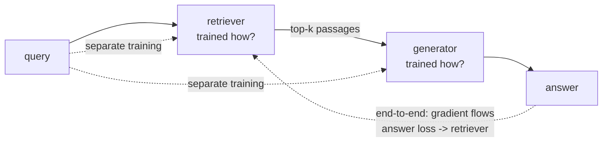
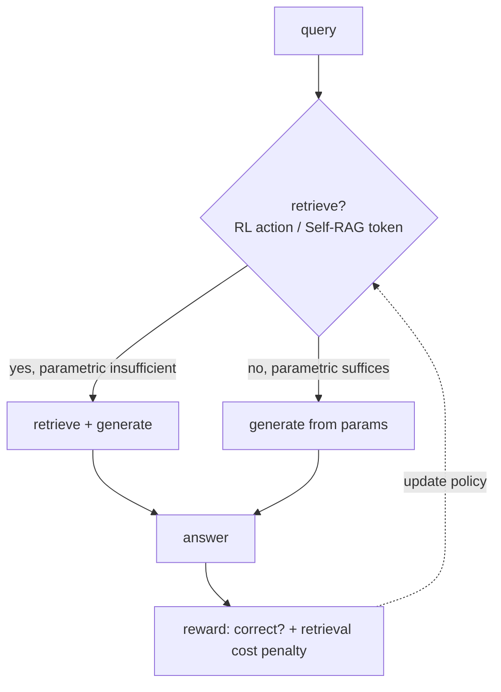

# Chapter 42: Training Memory-Augmented Agents

> **Lead paragraph.** Chapter 41 built a memory system; this chapter trains it. A RAG pipeline has two learned components — the retriever and the generator — and the central question is whether to train them separately or jointly end-to-end, and how to teach the agent *when* to retrieve at all. This chapter covers dense passage retrieval and its contrastive training (with the hard-negative trick that makes it work), end-to-end RAG training and why it outperforms but is harder to optimize, and the adaptive-retrieval idea (Self-RAG) where the model learns to retrieve on demand rather than always. By the end you will know why a retriever trained without hard negatives fails silently, why joint training is the right answer in principle and a pain in practice, and how to frame "should I retrieve?" as a reinforcement-learning action.

---

## 1. Two Learned Components, One Pipeline

A retrieval-augmented agent has two learned parts: the **retriever** (maps queries and documents to a shared embedding space) and the **generator** (produces the answer conditioned on retrieved context). The naive deployment trains them separately — a retriever on a retrieval objective, a generator on a generation objective — and bolts them together. This works but leaves performance on the table, because the retriever was optimized for retrieval quality in the abstract, not for *helping this generator answer this question*. A retriever that ranks the "right" passage first by some retrieval metric may still pass the generator a passage it cannot use, or fail to pass one it needs.

The question this chapter answers: train them separately (simple, suboptimal) or jointly end-to-end (optimal, hard)? The answer is nuanced, and the path to it runs through how the retriever is trained, then how the two are coupled.



<figcaption>Figure 42.1 — Separate versus end-to-end RAG training. Separate training optimizes the retriever on a retrieval objective and the generator on a generation objective independently. End-to-end training lets the answer loss flow back through the generator into the retriever, so the retriever is optimized for what helps this generator answer this question — optimal in principle, harder to optimize in practice.</figcaption>

---

## 2. Dense Passage Retrieval and Contrastive Training

**Dense Passage Retrieval** (DPR, Karpukhin et al., 2020) trains the retriever by **contrastive learning**: push the query and its relevant passage close together in embedding space, push the query and irrelevant passages far apart. The loss is in-batch negative contrastive — for a batch of queries, each query's positive passage is the negative for every other query in the batch:

$$\mathcal{L} = -\log \frac{\exp(\mathbf{q}^\top \mathbf{p^+} / \tau)}{\exp(\mathbf{q}^\top \mathbf{p^+} / \tau) + \sum_j \exp(\mathbf{q}^\top \mathbf{p^-_j} / \tau)}$$

where $\mathbf{q}^\top \mathbf{p^+}$ is the dot product of the query and positive-passage embeddings (the first multiplication in this chapter — a dot product, never $\mathbf{q} \cdot \mathbf{p}$), and the $\exp(\cdot)/\tau$ terms form the softmax over the positive and negatives scaled by temperature $\tau$.

The make-or-break detail is **hard negatives**. In-batch negatives are easy — passages about unrelated topics that the model already distinguishes. A retriever trained only on easy negatives learns to separate the obvious and fails on the subtle: passages that are *almost* relevant, that a BM25 retriever scores highly but that are not the true answer. The fix is to mine hard negatives with a BM25 retriever — passages that BM25 ranks near the top for the query but are not the gold passage. Training on these forces the dense retriever to learn the fine distinction that matters, rather than the coarse one it already has. A retriever trained without hard negatives can hit strong retrieval metrics and still pass the generator useless near-misses, which is the silent-failure mode this avoids.

```python
import torch
import torch.nn as nn
import torch.nn.functional as F

class DualEncoder(nn.Module):
    """Query encoder + passage encoder, shared or separate."""

    def __init__(self, dim=64):
        super().__init__()
        self.q_enc = nn.Linear(dim, dim)
        self.p_enc = nn.Linear(dim, dim)

    def encode_query(self, q):
        return F.normalize(self.q_enc(q), dim=-1)

    def encode_passage(self, p):
        return F.normalize(self.p_enc(p), dim=-1)

def contrastive_loss(q, p_pos, p_neg, tau=0.05):
    # q, p_pos: (b, d); p_neg: (b, n_neg, d)
    pos = (q * p_pos).sum(dim=-1, keepdim=True) / tau      # q^T p+
    neg = torch.bmm(p_neg, q.unsqueeze(-1)).squeeze(-1) / tau  # q^T p-_j
    logits = torch.cat([pos, neg], dim=1)                  # (b, 1+n_neg)
    target = torch.zeros(q.size(0), dtype=torch.long)     # index 0 = positive
    return F.cross_entropy(logits, target)
```

The `pos = (q * p_pos).sum(...)` is the dot product computed as element-wise multiply then sum — mathematically $\mathbf{q}^\top \mathbf{p^+}$. The target `zeros` marks index 0 (the positive) as correct, so the loss pushes the positive's logit above the negatives'. The `p_neg` here should be hard negatives (BM25-mined) in a real pipeline; random negatives make this exercise pass but train a weak retriever.

---

## 3. End-to-End RAG Training

**End-to-end training** couples the retriever and generator so the answer loss flows back into the retriever. The retriever's embeddings become differentiable inputs to the generator, and the generator's answer loss propagates through to update them — so the retriever is optimized for *downstream answer correctness*, not abstract retrieval quality. Lewis et al.'s original RAG (2020) and Izacard et al.'s few-shot retrieval-augmented models (2022) establish this paradigm.

The obstacle is that retrieval is discrete: the retriever picks *which* passages, and "picking" is a non-differentiable argmax over the document store. You cannot backpropagate through a hard top-k selection. Two workarounds dominate. The first keeps a **fixed retriever** and trains only the generator — simple, but the retriever never adapts to the generator. The second makes the selection **differentiable**: treat the retrieved passages' contributions as a weighted sum over the store (a soft retrieval), so gradients flow through the weights. This is the FiD (Fusion-in-Decoder) approach — the generator reads multiple passages in parallel and the answer loss can soften the retriever's scoring. End-to-end training with soft retrieval outperforms separate training but is markedly harder to optimize: the retriever and generator co-adapt, and a bad initialization can send both into a degenerate local optimum where the retriever passes nothing useful and the generator learns to ignore it.

The practical consensus: train the retriever first with contrastive + hard negatives (Section 2), then fine-tune end-to-end with soft retrieval as a refinement. Joint from-scratch training is principled but unstable; the staged approach gets most of the gain reliably.

---

## 4. Adaptive Retrieval: When to Retrieve at All

A RAG agent that *always* retrieves wastes calls on questions its parametric knowledge already answers, and risks contaminating a correct parametric answer with a misleading retrieved passage. **Adaptive retrieval** trains the agent to decide when retrieval helps. **Self-RAG** (Asai et al., ICLR 2024) does this by training the model to emit **reflection tokens** — `Retrieve` (should I retrieve?), `IsRel` (is the passage relevant?), `IsSup` (is the answer supported?) — so the model adaptively retrieves on demand, can retrieve multiple times mid-generation, or skip retrieval entirely when its parametric knowledge suffices.

The framing of "when to retrieve" as a decision connects to reinforcement learning: treat retrieval as an **action** in the RL framework. The agent chooses to retrieve (with a query) or not (rely on parametric knowledge), and receives reward for correct answers and penalty for wasted retrieval calls. This makes the retrieval decision learnable from outcome signal rather than hand-tuned.



<figcaption>Figure 42.4 — Adaptive retrieval as a decision. The agent decides whether to retrieve (parametric knowledge insufficient) or answer from parameters (sufficient), framed as an RL action or Self-RAG reflection token. Reward is answer correctness minus a retrieval-cost penalty, so the agent learns to retrieve only when it pays.</figcaption>

The reward design is the hard part. A pure correctness reward incentivizes retrieving on everything (retrieval rarely hurts and sometimes helps). A retrieval-cost penalty incentivizes never retrieving. The right trade-off depends on the cost of a retrieval call (latency, money) versus the cost of a wrong answer — and this is application-specific, which is why adaptive retrieval must be trained on the application's own reward profile rather than assumed from a benchmark.

---

## 5. RL for Memory Access

Generalizing the adaptive-retrieval action, the agent can choose among memory-access actions: retrieve from the vector store (Tier 2), traverse the knowledge graph (Tier 3), summarize and compress (Tier 1 maintenance), or answer directly. Each action has a cost and a benefit, and RL trains a policy over them from outcome signal.

The risk is **retrieval overconfidence**: an agent rewarded for retrieving when it helps may learn to retrieve even when it doesn't, because retrieval rarely produces overtly wrong signal and the agent cannot easily distinguish "retrieved and helped" from "retrieved and was ignored." The defense is a tight reward that penalizes retrieval when the parametric answer would have been correct — measuring the counterfactual. This is expensive (you must know what the no-retrieval answer would have been) but is the only way to teach the agent that retrieval is not free.

<figure>
<svg width="100%" viewBox="0 0 820 290" xmlns="http://www.w3.org/2000/svg">
  <rect x="0" y="0" width="820" height="290" fill="#ffffff"/>
  <text x="410" y="28" font-family="sans-serif" font-size="14" fill="#222222" text-anchor="middle" font-weight="bold">Reward design for adaptive retrieval</text>
  <!-- axes -->
  <line x1="100" y1="240" x2="740" y2="240" stroke="#333333" stroke-width="1.5"/>
  <text x="420" y="265" font-family="sans-serif" font-size="11" fill="#333333" text-anchor="middle">retrieval-cost penalty →</text>
  <line x1="100" y1="240" x2="100" y2="60" stroke="#333333" stroke-width="1.5"/>
  <text x="60" y="150" font-family="sans-serif" font-size="11" fill="#333333" text-anchor="middle" transform="rotate(-90 60 150)">learned retrieval rate →</text>
  <!-- curve: high penalty -> never retrieve; low -> always retrieve -->
  <path d="M 120 70 Q 300 75 450 130 Q 600 210 720 235" fill="none" stroke="#534AB7" stroke-width="2.5"/>
  <circle cx="180" cy="72" r="5" fill="#993C1D"/>
  <text x="180" y="58" font-family="sans-serif" font-size="10" fill="#993C1D" text-anchor="middle">always retrieve</text>
  <circle cx="680" cy="232" r="5" fill="#993C1D"/>
  <text x="660" y="222" font-family="sans-serif" font-size="10" fill="#993C1D" text-anchor="middle">never retrieve</text>
  <circle cx="440" cy="135" r="6" fill="#0F6E56"/>
  <text x="440" y="120" font-family="sans-serif" font-size="10" fill="#0F6E56" text-anchor="middle">balanced: retrieve only when it pays</text>
</svg>
<figcaption>Figure 42.3 — Retrieval-rate versus cost-penalty trade-off. With no retrieval-cost penalty, the agent learns to always retrieve (retrieval rarely hurts overtly). With a high penalty, it never retrieves. The balanced point — retrieve only when retrieval improves the answer enough to justify its cost — is application-specific and must be tuned to the real cost of a retrieval call versus a wrong answer.</figcaption>
</figure>

---

## 6. Agentic Code Project: Training an Adaptive Retriever with an RL Retrieve-Or-Not Policy

This project implements the adaptive-retrieval decision as a small RL policy: a binary classifier (retrieve or not) trained with a reward that is answer correctness minus a retrieval-cost penalty. The retriever is a dual encoder (Section 2); the policy decides whether to use it. It uses the standard `LLMClient` as the generator whose answer correctness supplies reward.

```python
import os, random
from dataclasses import dataclass

import torch
import torch.nn as nn
import openai


class LLMClient:
    """OpenAI-compatible client; flips to a local Ollama endpoint."""

    def __init__(self, model="gpt-5.5", use_ollama=False):
        self.model = model
        if use_ollama:
            self.client = openai.OpenAI(
                base_url="http://localhost:11434/v1", api_key="ollama")
        else:
            self.client = openai.OpenAI(api_key=os.getenv("OPENAI_API_KEY"))

    def complete(self, prompt, temperature=0.3, max_tokens=200):
        resp = self.client.chat.completions.create(
            model=self.model,
            messages=[{"role": "user", "content": prompt}],
            temperature=temperature, max_tokens=max_tokens)
        return resp.choices[0].message.content.strip()


class RetrievePolicy(nn.Module):
    """Binary head: should the agent retrieve before answering?"""

    def __init__(self, dim=32):
        super().__init__()
        self.head = nn.Sequential(nn.Linear(dim, 16), nn.ReLU(),
                                  nn.Linear(16, 2))

    def forward(self, state):
        return self.head(state)          # logits over [skip, retrieve]


def correct(answer, gold):
    # crude correctness: gold string present in answer
    return 1.0 if gold.lower() in answer.lower() else 0.0


def rollout(query, gold, policy, encoder, retriever, generator, state_vec,
            retrieve_cost=0.1):
    logits = policy(state_vec)
    action = logits.argmax().item()      # 0=skip, 1=retrieve
    if action == 1:
        passages = retriever(query)
        ctx = "\n".join(passages)
        answer = generator(f"Context:\n{ctx}\nQuestion: {query}")
    else:
        answer = generator(f"Question: {query} (answer from your knowledge)")
    reward = correct(answer, gold) - (retrieve_cost if action == 1 else 0.0)
    return action, logits, reward


def train_step(policy, opt, batch):
    # REINFORCE-style: maximize expected reward
    total_loss = 0.0
    for state_vec, action, logits, reward in batch:
        logp = torch.log_softmax(logits, dim=-1)[action]
        total_loss += -logp * reward     # negative log-likelihood * reward
    total_loss = total_loss / len(batch)
    opt.zero_grad(); total_loss.backward(); opt.step()
    return total_loss.item()


def make_retriever(passages):
    def retrieve(query):
        return [p for p in passages if any(w.lower() in p.lower()
                                            for w in query.split()[:3])][:3]
    return retrieve


def main():
    llm = LLMClient(use_ollama=True)
    def gen(prompt):
        return llm.complete(prompt, temperature=0.2)
    passages = ["Paris is the capital of France.",
                "Water boils at 100C at sea level."]
    retriever = make_retriever(passages)
    policy = RetrievePolicy()
    opt = torch.optim.Adam(policy.parameters(), lr=1e-3)
    state = torch.randn(32)
    action, logits, r = rollout("What is the capital of France?", "Paris",
                                policy, None, retriever, gen, state)
    print(f"action={action} reward={r:.2f}")


if __name__ == "__main__":
    main()
```

The reward `correct(answer, gold) - retrieve_cost` is the chapter's trade-off in one line: retrieval that produces a correct answer is rewarded net of its cost; retrieval that produces a wrong answer is doubly penalized (zero correctness minus cost). The REINFORCE update maximizes expected reward, so over many rollouts the policy learns to retrieve when the parametric answer is likely wrong and skip when it is likely right — exactly the adaptive decision. The `retrieve_cost` knob is the application-specific dial of Figure 42.3; tuning it to the real cost of a retrieval call (latency, tokens, money) is what makes the policy match the deployment.

---

## Summary

- A RAG pipeline has two learned components, retriever and generator. Separate training (each on its own objective) is simple but suboptimal — the retriever optimizes abstract retrieval quality, not what helps this generator answer this question. End-to-end training lets the answer loss flow into the retriever, optimal in principle but harder to optimize.
- Dense Passage Retrieval trains the retriever by contrastive learning (push query+positive close, query+negatives apart). Hard negatives — BM25-mined near-misses — are make-or-break: without them the retriever learns the coarse distinction it already has and fails on the subtle near-misses that matter. A retriever without hard negatives hits strong metrics and still passes the generator useless passages.
- End-to-end training requires making the discrete retrieval selection differentiable (soft retrieval / FiD). The practical consensus: train retriever first (contrastive + hard negatives), then fine-tune end-to-end as a refinement — joint from-scratch training is unstable.
- Adaptive retrieval (Self-RAG, ICLR 2024) trains the model to retrieve on demand via reflection tokens (Retrieve / IsRel / IsSup), or skips retrieval when parametric knowledge suffices. Framing "when to retrieve" as an RL action makes it learnable from outcome signal.
- RL for memory access generalizes this to a policy over actions (retrieve / traverse graph / summarize / answer). The risk is retrieval overconfidence — an agent that retrieves even when it shouldn't because retrieval rarely produces overtly wrong signal. The defense is a reward that penalizes retrieval when the parametric answer would have been correct, tuned to the real cost of a retrieval call versus a wrong answer.

---

## Further Reading

- [Retrieval-Augmented Generation for Knowledge-Intensive NLP Tasks (RAG)](https://arxiv.org/abs/2005.11401) — Lewis et al., 2020. The original RAG; end-to-end retriever+generator.
- [Few-Shot Learning with Retrieval Augmented Language Models (FiD)](https://arxiv.org/abs/2208.03299) — Izacard et al., 2022. Fusion-in-Decoder; reading multiple passages in parallel for differentiable retrieval.
- [Dense Passage Retrieval for Open-Domain QA](https://arxiv.org/abs/2004.04906) — Karpukhin et al., 2020. Contrastive dual-encoder training with hard negatives.
- [Self-RAG: Learning to Retrieve, Generate, and Critique through Self-Reflection](https://arxiv.org/abs/2310.11511) — Asai et al., ICLR 2024. Adaptive on-demand retrieval via reflection tokens.

---