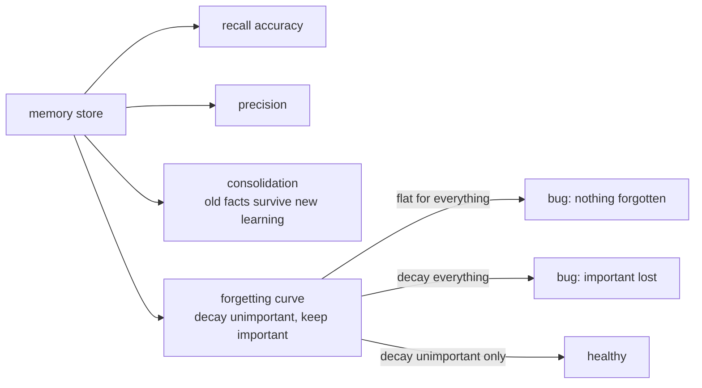
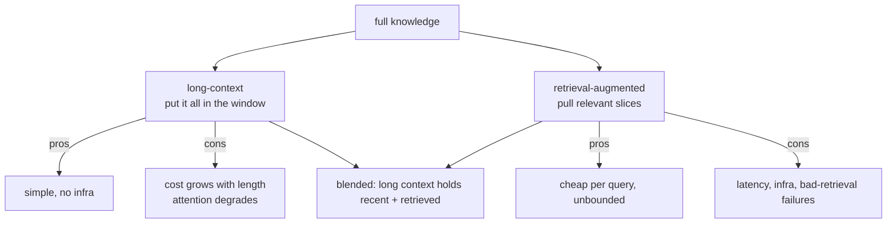
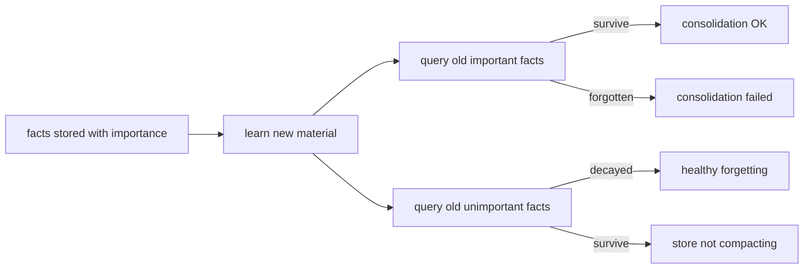

# Chapter 43: Evaluating Memory and Learning

> **Lead paragraph.** A memory system that retrieves fast but returns wrong facts is worse than one that retrieves slowly and returns right ones — and one that returns nothing at all may be better than both if the wrong fact is confidently presented. This chapter covers how to measure memory: recall accuracy (the right memory at the right time), precision (retrieved memories are relevant), consolidation (important info survives new learning), and forgetting curves (unimportant info decays, important info stays flat). It also covers the central architectural trade-off — long-context versus retrieval-augmented — and the benchmarks (Needle in a Haystack, RULER) that probe attention quality over long spans. By the end you will know why a forgetting curve that stays flat for everything is a bug, and why "the model has a long context window" does not mean "the model uses it well."

---

## 1. Four Things to Measure

A memory system is not just a store; it is a store plus the policies that decide what to retrieve, what to consolidate, and what to forget. Four metrics capture whether those policies work:

- **Recall accuracy** — does the system retrieve the right memory at the right time? The hit rate on "I should have remembered this."
- **Precision** — are retrieved memories relevant? A system that retrieves the right thing plus ten irrelevant things has high recall and low precision; the irrelevant entries dilute the context and mislead the generator.
- **Consolidation** — does important information survive new learning? Query old facts after the system has learned new ones; if old important facts are forgotten, consolidation failed.
- **Forgetting curve** — recall accuracy versus time since storage. This should *decay* for unimportant, unaccessed items (freeing the store) and stay *flat* for important ones (preserving what matters). A curve that stays flat for everything means nothing is forgotten and the store will drown in stale entries; a curve that decays for everything means important facts are lost too.



<figcaption>Figure 43.1 — Four memory metrics. Recall (right memory, right time), precision (retrieved are relevant), consolidation (important info survives new learning), and the forgetting curve (decay unimportant, keep important). A forgetting curve flat for everything is a bug — the store never compacts; one that decays everything is a bug — important facts are lost.</figcaption>

---

## 2. The Long-Context Versus Retrieval Trade-off

The central architectural choice for agent memory is **long-context versus retrieval-augmented**. Long-context puts everything in the model's context window — simpler (no retrieval infrastructure, no embedding pipeline) but more expensive (attention cost grows with context length) and, as the next section shows, increasingly unreliable as context grows. Retrieval-augmented keeps a small context and pulls relevant slices on demand — cheaper per query and unbounded in capacity, but adds retrieval latency and infrastructure and the failure modes of bad retrieval.

The trade-off is not either/or in modern systems; it is a blend. A long context holds the recent conversation and retrieved slices; the retrieval system feeds it. But the question "how much can the model actually use in its context?" is empirical, and the answer is less than the advertised window length — which is what the long-context benchmarks measure.



<figcaption>Figure 43.2 — Long-context versus retrieval-augmented. Long-context is simple but expensive and degrades as context grows; retrieval is cheap and unbounded but adds latency and retrieval failure modes. Modern systems blend both — a long context holds the recent conversation plus retrieved slices.</figcaption>

---

## 3. Long-Context Benchmarks: Needle in a Haystack and RULER

**Needle in a Haystack (NIAH)** is the classic long-context test: place a specific fact (the "needle") at some depth in a long document (the "haystack"), then ask the model to retrieve it. Repeat across depths (needle at 0%, 25%, 50%, 75%, 100% of the document) and context lengths. The result is a heatmap — retrieval accuracy versus depth and length — that reveals where the model's attention actually works. The recurring finding: models retrieve needles at the start and end of the context well (the "lost in the middle" phenomenon) and degrade in the middle, and accuracy drops as context length grows even well within the advertised window. "The model has a 128k context window" does not mean "the model attends correctly across 128k tokens" — NIAH is what separates the two claims.

**RULER** (arXiv 2404.06654, 2024) generalizes NIAH beyond single-fact retrieval. NIAH tests only "can you find one fact"; RULER adds multi-key retrieval, aggregation (counting, summarizing across the context), and variable tracking — task types that stress different attention mechanisms. A model that aces NIAH can still fail RULER's aggregation tasks, because finding a fact and reasoning over many facts use different capabilities. RULER's contribution is the recognition that "long-context quality" is not one number — it is a profile across retrieval, aggregation, and reasoning task types, and a benchmark that tests only one is misleading.

<figure>
<svg width="100%" viewBox="0 0 820 300" xmlns="http://www.w3.org/2000/svg">
  <rect x="0" y="0" width="820" height="300" fill="#ffffff"/>
  <text x="410" y="28" font-family="sans-serif" font-size="14" fill="#222222" text-anchor="middle" font-weight="bold">Needle-in-a-Haystack: accuracy vs depth and length</text>
  <!-- heatmap grid: rows=depth, cols=length -->
  <g text-anchor="middle">
    <!-- header: context lengths -->
    <text x="180" y="60" font-family="sans-serif" font-size="10" fill="#333333">4k</text>
    <text x="300" y="60" font-family="sans-serif" font-size="10" fill="#333333">16k</text>
    <text x="420" y="60" font-family="sans-serif" font-size="10" fill="#333333">64k</text>
    <text x="540" y="60" font-family="sans-serif" font-size="10" fill="#333333">128k</text>
    <!-- depth labels -->
    <text x="120" y="95" font-family="sans-serif" font-size="10" fill="#333333" text-anchor="end">0% (start)</text>
    <text x="120" y="135" font-family="sans-serif" font-size="10" fill="#333333" text-anchor="end">25%</text>
    <text x="120" y="175" font-family="sans-serif" font-size="10" fill="#333333" text-anchor="end">50% (mid)</text>
    <text x="120" y="215" font-family="sans-serif" font-size="10" fill="#333333" text-anchor="end">75%</text>
    <text x="120" y="255" font-family="sans-serif" font-size="10" fill="#333333" text-anchor="end">100% (end)</text>
  </g>
  <!-- cells: green=good, yellow=mid, red=bad -->
  <g>
    <rect x="140" y="78" width="80" height="28" fill="#0F6E56"/><text x="180" y="97" font-family="sans-serif" font-size="10" fill="#ffffff" text-anchor="middle">0.98</text>
    <rect x="260" y="78" width="80" height="28" fill="#0F6E56"/><text x="300" y="97" font-family="sans-serif" font-size="10" fill="#ffffff" text-anchor="middle">0.95</text>
    <rect x="380" y="78" width="80" height="28" fill="#5cb85c"/><text x="420" y="97" font-family="sans-serif" font-size="10" fill="#ffffff" text-anchor="middle">0.88</text>
    <rect x="500" y="78" width="80" height="28" fill="#e0a800"/><text x="540" y="97" font-family="sans-serif" font-size="10" fill="#ffffff" text-anchor="middle">0.72</text>
    <rect x="140" y="118" width="80" height="28" fill="#5cb85c"/><text x="180" y="137" font-family="sans-serif" font-size="10" fill="#ffffff" text-anchor="middle">0.90</text>
    <rect x="260" y="118" width="80" height="28" fill="#e0a800"/><text x="300" y="137" font-family="sans-serif" font-size="10" fill="#ffffff" text-anchor="middle">0.74</text>
    <rect x="380" y="118" width="80" height="28" fill="#d9534f"/><text x="420" y="137" font-family="sans-serif" font-size="10" fill="#ffffff" text-anchor="middle">0.45</text>
    <rect x="500" y="118" width="80" height="28" fill="#d9534f"/><text x="540" y="137" font-family="sans-serif" font-size="10" fill="#ffffff" text-anchor="middle">0.30</text>
    <rect x="140" y="158" width="80" height="28" fill="#e0a800"/><text x="180" y="177" font-family="sans-serif" font-size="10" fill="#ffffff" text-anchor="middle">0.70</text>
    <rect x="260" y="158" width="80" height="28" fill="#d9534f"/><text x="300" y="177" font-family="sans-serif" font-size="10" fill="#ffffff" text-anchor="middle">0.40</text>
    <rect x="380" y="158" width="80" height="28" fill="#d9534f"/><text x="420" y="177" font-family="sans-serif" font-size="10" fill="#ffffff" text-anchor="middle">0.25</text>
    <rect x="500" y="158" width="80" height="28" fill="#d9534f"/><text x="540" y="177" font-family="sans-serif" font-size="10" fill="#ffffff" text-anchor="middle">0.15</text>
    <rect x="140" y="198" width="80" height="28" fill="#5cb85c"/><text x="180" y="217" font-family="sans-serif" font-size="10" fill="#ffffff" text-anchor="middle">0.88</text>
    <rect x="260" y="198" width="80" height="28" fill="#e0a800"/><text x="300" y="217" font-family="sans-serif" font-size="10" fill="#ffffff" text-anchor="middle">0.72</text>
    <rect x="380" y="198" width="80" height="28" fill="#d9534f"/><text x="420" y="217" font-family="sans-serif" font-size="10" fill="#ffffff" text-anchor="middle">0.42</text>
    <rect x="500" y="198" width="80" height="28" fill="#d9534f"/><text x="540" y="217" font-family="sans-serif" font-size="10" fill="#ffffff" text-anchor="middle">0.28</text>
    <rect x="140" y="238" width="80" height="28" fill="#0F6E56"/><text x="180" y="257" font-family="sans-serif" font-size="10" fill="#ffffff" text-anchor="middle">0.97</text>
    <rect x="260" y="238" width="80" height="28" fill="#0F6E56"/><text x="300" y="257" font-family="sans-serif" font-size="10" fill="#ffffff" text-anchor="middle">0.94</text>
    <rect x="380" y="238" width="80" height="28" fill="#5cb85c"/><text x="420" y="257" font-family="sans-serif" font-size="10" fill="#ffffff" text-anchor="middle">0.86</text>
    <rect x="500" y="238" width="80" height="28" fill="#e0a800"/><text x="540" y="257" font-family="sans-serif" font-size="10" fill="#ffffff" text-anchor="middle">0.70</text>
  </g>
  <text x="410" y="285" font-family="sans-serif" font-size="11" fill="#993C1D" text-anchor="middle">"Lost in the middle": start/end retrieved well, middle degrades; accuracy drops with length even inside the window.</text>
</svg>
<figcaption>Figure 43.3 — A Needle-in-a-Haystack heatmap (illustrative). Accuracy is high at the start and end of the context and degrades in the middle — the "lost in the middle" phenomenon — and drops as context length grows, even well within the advertised window. "Has a 128k window" does not mean "attends correctly across 128k tokens."</figcaption>
</figure>

---

## 4. Continual Learning and Streaming Evaluation

Memory evaluation extends to the continual-learning setting (Chapter 39). The benchmarks are sequential: **Permuted MNIST** and **Split CIFAR** present a sequence of tasks and measure performance on earlier tasks after later ones are learned — directly probing catastrophic forgetting. **StreamingQA** tests question answering with evolving knowledge, where the world changes and the agent must update without forgetting stable facts.

The metric that matters here is **backward transfer** (Chapter 39): does learning task B improve, preserve, or degrade task A? A continual-learning memory system is evaluated not just on current-task performance but on the backward-transfer profile across the task sequence — a system that excels at the current task while degrading all prior ones is forgetting catastrophically, regardless of its current score.

```python
def backward_transfer(perf_before, perf_after):
    # perf_before/after: dict task -> accuracy, measured across a sequence
    # positive = B improved A (gold); ~0 = retention; negative = forgetting
    transfers = {t: perf_after[t] - perf_before[t]
                 for t in perf_before if t in perf_after}
    avg = sum(transfers.values()) / max(len(transfers), 1)
    return {"per_task": transfers, "avg": avg,
            "regime": ("positive" if avg > 0.01
                       else "retention" if avg > -0.01 else "forgetting")}
```

The bands (`positive` / `retention` / `forgetting`) make the regime explicit — a single average hides whether a small negative is uniform mild forgetting or one task catastrophically forgotten while others improved.

---

## 5. Memory Consolidation and Forgetting-Curve Evaluation

**Consolidation evaluation** asks whether important information survives new learning. The test: store a set of facts with known importance, learn new material, then query the old facts. Important facts should survive; unimportant ones may decay. A system that forgets important facts after any new learning has failed consolidation, even if its current-task performance is high.

**Forgetting-curve evaluation** plots recall accuracy versus time since storage, split by importance. The healthy shape: important items stay flat (no decay), unimportant items decay (freeing the store). Two failure shapes: flat-for-everything (nothing forgotten — the store will drown, Chapter 36's lesson) and decays-for-everything (important facts lost). Measuring the curve split by importance is the only way to distinguish "good forgetting" from "bad forgetting" — an aggregate forgetting curve hides which is happening.



<figcaption>Figure 43.4 — Consolidation and forgetting-curve evaluation. After learning new material, query old facts split by importance: important facts should survive (consolidation OK), unimportant ones should decay (healthy forgetting). Splitting by importance is the only way to distinguish good forgetting (unimportant decays) from bad (important lost) — an aggregate curve hides which is happening.</figcaption>

---

## 6. Agentic Code Project: A Memory Evaluation Harness

This project implements the metrics as a harness: recall accuracy, precision, consolidation survival, and a forgetting curve split by importance. It uses the standard `LLMClient` only to judge relevance (precision), keeping the core metrics deterministic.

```python
import os, time, math
from dataclasses import dataclass, field

import openai


class LLMClient:
    """OpenAI-compatible client; flips to a local Ollama endpoint."""

    def __init__(self, model="gpt-5.5", use_ollama=False):
        self.model = model
        if use_ollama:
            self.client = openai.OpenAI(
                base_url="http://localhost:11434/v1", api_key="ollama")
        else:
            self.client = openai.OpenAI(api_key=os.getenv("OPENAI_API_KEY"))

    def complete(self, prompt, temperature=0.0, max_tokens=10):
        resp = self.client.chat.completions.create(
            model=self.model,
            messages=[{"role": "user", "content": prompt}],
            temperature=temperature, max_tokens=max_tokens)
        return resp.choices[0].message.content.strip()


@dataclass
class StoredFact:
    text: str
    importance: float
    timestamp: float
    accessed: bool = False


def recall_accuracy(retrieved_ids, relevant_ids):
    hits = len(set(retrieved_ids) & set(relevant_ids))
    return hits / max(len(relevant_ids), 1)


def precision(retrieved, relevant_set, llm=None):
    if not retrieved:
        return 1.0
    relevant = sum(1 for r in retrieved if r in relevant_set)
    return relevant / len(retrieved)


def consolidation_survival(facts_before, facts_after, importance_floor=0.7):
    important = {f.text for f in facts_before if f.importance >= importance_floor}
    survived = {f.text for f in facts_after}
    return len(important & survived) / max(len(important), 1)


def forgetting_curve(facts, now, half_life=7*24*3600, bins=5):
    # recall (accessed) vs age, split by importance
    important, unimportant = [], []
    for f in facts:
        age = (now - f.timestamp) / 3600   # hours
        bucket = min(int(age / (24 * 7 / bins)), bins - 1)  # weekly buckets
        row = (bucket, 1.0 if f.accessed else 0.0)
        (important if f.importance >= 0.7 else unimportant).append(row)
    return {"important": important, "unimportant": unimportant}


def evaluate(retrieved, relevant, facts_before, facts_after, now):
    rec = recall_accuracy([r.id for r in retrieved], relevant)
    prec = precision([r.text for r in retrieved], relevant)
    cons = consolidation_survival(facts_before, facts_after)
    curve = forgetting_curve(facts_after, now)
    return {"recall": rec, "precision": prec,
            "consolidation": cons, "forgetting_curve": curve}


if __name__ == "__main__":
    now = time.time()
    before = [StoredFact("user is Avinash", 0.9, now - 100),
              StoredFact("idle chatter", 0.2, now - 100)]
    after = [StoredFact("user is Avinash", 0.9, now - 100, accessed=True),
             StoredFact("idle chatter", 0.2, now - 100, accessed=False)]
    print(evaluate(retrieved=[], relevant=[], facts_before=before,
                  facts_after=after, now=now))
```

The harness keeps the metrics deterministic (recall, precision, consolidation, the curve are all computed, not LLM-judged) — only an optional relevance judge would use the LLM, and even there the default `precision` falls back to set membership. This respects that the LLM's judgment is a fallible add-on, not the source of truth for evaluation: the numbers that decide whether memory works are computed, not generated.

---

## Summary

- Four metrics capture memory quality: recall accuracy (right memory, right time), precision (retrieved are relevant), consolidation (important info survives new learning), and the forgetting curve (decay unimportant, keep important). A forgetting curve flat for everything is a bug (store never compacts); one decaying everything is a bug (important facts lost).
- The central architectural trade-off is long-context versus retrieval-augmented. Long-context is simple but expensive and degrades with length; retrieval is cheap and unbounded but adds latency and retrieval failure modes. Modern systems blend both.
- Needle in a Haystack places a fact at varying depths and lengths, revealing "lost in the middle" (start/end retrieved well, middle degrades) and length-induced drop even inside the advertised window. RULER (2024) generalizes beyond single-fact retrieval to aggregation and variable tracking — "long-context quality" is a profile across task types, not one number.
- Continual-learning benchmarks (Permuted MNIST, Split CIFAR, StreamingQA) probe forgetting across a task sequence; the metric is backward transfer (positive = B improved A, retention = preserved, negative = forgetting). Evaluate the backward-transfer profile, not just current-task score.
- Consolidation and forgetting-curve evaluation must split by importance: after new learning, important facts should survive (consolidation OK) and unimportant ones should decay (healthy forgetting). An aggregate curve hides whether good or bad forgetting is happening.

---

## Further Reading

- [RULER: What Real Long-Context Workflows?](https://arxiv.org/abs/2404.06654) — 2024. Comprehensive long-context benchmark beyond single-fact retrieval: multi-key, aggregation, variable tracking.
- [Needle In A Haystack](https://github.com/gkamradt/needle-in-a-haystack) — the classic long-context attention test; accuracy versus depth and length.
- [ALFWorld](https://alfworld.github.io/) — embodied tasks with partial observability, requiring memory of earlier states.
- [StreamingQA: Benchmarking Answering on Evolving Knowledge](https://arxiv.org/abs/2401.03160) — question answering where the world changes; updating without forgetting stable facts.

---