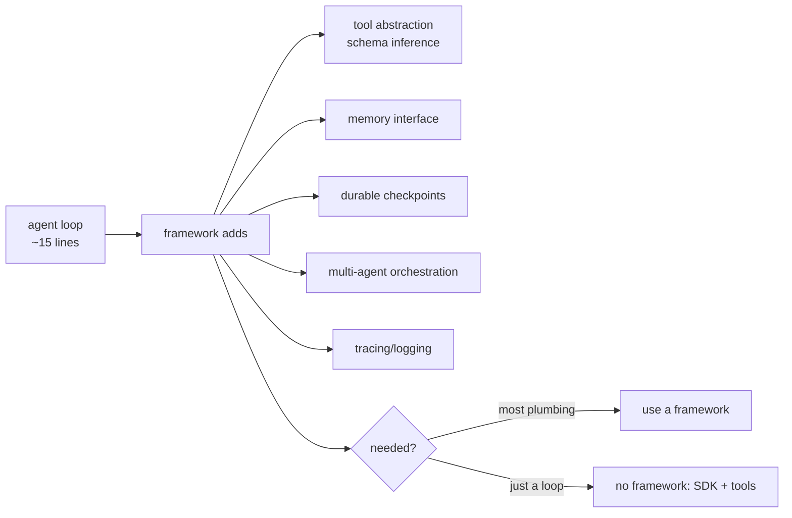
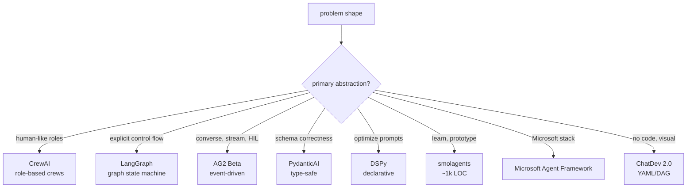
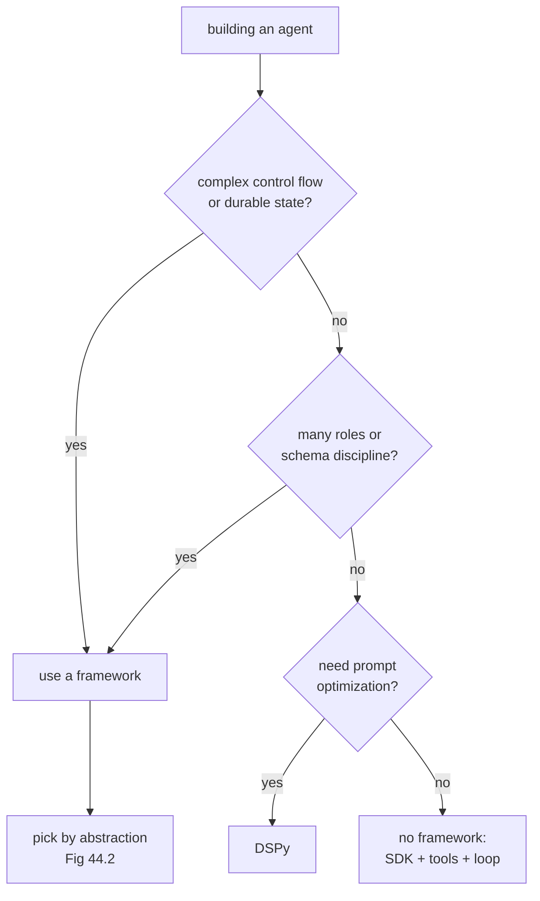

# Chapter 44: Agent Frameworks Landscape

> **Lead paragraph.** An agent framework is the scaffolding around the agent loop — the abstractions for tools, memory, state, and orchestration that save you from rewriting the loop by hand. By 2026 the landscape has bifurcated: a handful of opinionated frameworks for cases that need them, and a growing "no framework" movement that argues modern provider SDKs plus a vector-database client cover 80% of use cases with fifteen lines of code. This chapter maps the matrix — role-based (CrewAI), graph-based (LangGraph), conversational/event-driven (AG2), type-safe functional (PydanticAI), declarative optimization (DSPy), lightweight (smolagents), Microsoft's consolidated Agent Framework, and the visual zero-code option (ChatDev) — and covers what is deprecated (AutoGen, OpenAI Swarm) and why "use a framework" is no longer the default answer. By the end you will know which framework fits which job, and when to use none at all.

---

## 1. What a Framework Provides

Before mapping the field, it helps to state what an agent framework actually gives you beyond the loop. The agent loop itself (perceive → reason → act → observe, Chapter 2) is a dozen lines; what frameworks sell is the *plumbing* around it:

- **Tool abstraction** — register functions, get JSON-schema inference, handle serialization of arguments and return values.
- **Memory abstraction** — pluggable interfaces for short-term context and long-term retrieval (Part V).
- **State management** — durable checkpoints so a long-running agent can resume after a crash (Chapter 51).
- **Orchestration** — multi-agent patterns (manager-worker, debate, Chapter 31) without hand-wiring the message passing.
- **Observability** — tracing and logging hooks so you can see what the agent did and why (Chapter 49).

The framework decision is really "do I need the plumbing, and which plumbing matches my problem?" A team that needs durable stateful workflows reaches for a different framework than one that wants type-safe tool schemas, and both differ from a team that just needs a loop plus three tools.



<figcaption>Figure 44.1 — What a framework provides. The loop itself is ~15 lines; frameworks sell the plumbing — tool abstraction with schema inference, pluggable memory, durable checkpoints, multi-agent orchestration, and tracing. The framework decision is "do I need the plumbing?" — and for many cases the answer is no.</figcaption>

---

## 2. The Decision Matrix (2026)

The active frameworks sort cleanly by the primary abstraction they optimize. The matrix is not "which is best" but "which abstraction matches your problem."

- **Role-based orchestration — CrewAI v1.0** (GA October 2025). You define agents by role (researcher, writer, reviewer) and tasks; the framework wires them into a crew. Fits when your problem decomposes into human-like roles. CrewAI reports 1.4 billion-plus automations run on the platform — evidence it scales for enterprise role-based teams, though the metric is platform runs, not a benchmark.
- **Graph-based state machines — LangGraph**. You draw your agent as a directed graph of nodes (states) and edges (transitions), with explicit state passed between them. Fits complex, stateful production agents where control flow must be inspectable and resumable. LangGraph is the part of the LangChain ecosystem that is *gaining* traction even as classic LangChain declines — its explicit graph is debuggable where LangChain's chains were not.
- **Conversational / event-driven — AG2 Beta** (January 2026). The fork maintained by AutoGen's original creators after Microsoft moved AutoGen to maintenance mode. AG2 optimizes for streaming, real-time, and human-in-the-loop patterns — agents that converse rather than execute a fixed plan.
- **Type-safe functional — PydanticAI v1.94**. FastAPI-style: Python type hints become enforced tool schemas at the type-checker level, so a malformed tool call is a compile-time error, not a runtime surprise. Fits applications where correctness and schema discipline matter (the same niche FastAPI fills for web servers). Reports 50,000-plus workflows.
- **Declarative optimization — DSPy v3.2**. You declare the *pipeline* (what steps, what signatures) and DSPy optimizes the *prompts* automatically — separating "what" from "how." Fits research and experimentation where you want to systematically search prompt space rather than hand-tune.
- **Lightweight prototyping — smolagents**. HuggingFace's ~1,000-line-of-code philosophy: minimal, readable, swappable. Fits learning, prototyping, and cases where you want to understand every line.
- **Microsoft ecosystem — Microsoft Agent Framework (MAF)**. The enterprise-ready successor consolidating AutoGen and Semantic Kernel. Fits teams already in the Microsoft stack who want one supported framework rather than the AutoGen/SK split.
- **Zero-code visual — ChatDev 2.0** (January 2026). YAML/DAG workflows, no code. Fits non-developer orchestration and rapid visual prototyping.



<figcaption>Figure 44.2 — The 2026 framework decision matrix. The choice is driven by the primary abstraction that matches the problem: roles (CrewAI), explicit control flow (LangGraph), conversational/event-driven (AG2), type-safe schemas (PydanticAI), prompt optimization (DSPy), lightweight prototyping (smolagents), Microsoft-stack consolidation (MAF), or zero-code visual (ChatDev). No framework is "best" — each optimizes a different axis.</figcaption>

---

## 3. What Is Deprecated

Three frameworks that were common choices are no longer recommended for new work, for distinct reasons:

- **AutoGen (original)** — maintenance mode since February 2026. Microsoft consolidates its agent offering into the Microsoft Agent Framework; AutoGen's original creators forked the project as AG2, which is where active conversational/event-driven development continues. Staying on AutoGen past 2026 means inheriting a frozen stack with bug-fix-only support.
- **OpenAI Swarm** — officially deprecated early 2025, replaced by the OpenAI Agents SDK. Swarm was always an experimental, educational framework; the Agents SDK is the production line.
- **LangChain (classic) for new projects** — actively declining. Teams report ripping it out because the chain abstraction is hard to debug and overly complex. Note the nuance: LangGraph (built atop LangChain but conceptually separate) is *gaining* traction for production because its explicit graph fixes the debuggability problem that sank classic chains. "LangChain is declining" and "LangGraph is healthy" are both true and not contradictory — they refer to different layers.

The pattern across all three: frameworks die when their abstraction stops matching how people build agents, or when a vendor consolidates offerings. Choosing a framework now means checking it is on an active, supported line, not a maintenance branch.

<figure>
<svg width="100%" viewBox="0 0 820 280" xmlns="http://www.w3.org/2000/svg">
  <rect x="0" y="0" width="820" height="280" fill="#ffffff"/>
  <text x="410" y="28" font-family="sans-serif" font-size="14" fill="#222222" text-anchor="middle" font-weight="bold">Framework lifecycle: deprecated → successor</text>
  <!-- three lanes -->
  <g>
    <rect x="60" y="60" width="200" height="40" rx="6" fill="#d9534f"/>
    <text x="160" y="85" font-family="sans-serif" font-size="11" fill="#ffffff" text-anchor="middle">AutoGen (maintenance Feb 2026)</text>
    <path d="M 260 80 L 330 80" stroke="#333333" stroke-width="1.5" marker-end="url(#a1)"/>
    <rect x="330" y="60" width="200" height="40" rx="6" fill="#0F6E56"/>
    <text x="430" y="78" font-family="sans-serif" font-size="11" fill="#ffffff" text-anchor="middle">Microsoft Agent Framework</text>
    <text x="430" y="93" font-family="sans-serif" font-size="11" fill="#ffffff" text-anchor="middle">+ AG2 (creator fork)</text>

    <rect x="60" y="120" width="200" height="40" rx="6" fill="#d9534f"/>
    <text x="160" y="145" font-family="sans-serif" font-size="11" fill="#ffffff" text-anchor="middle">OpenAI Swarm (dep. 2025)</text>
    <path d="M 260 140 L 330 140" stroke="#333333" stroke-width="1.5" marker-end="url(#a1)"/>
    <rect x="330" y="120" width="200" height="40" rx="6" fill="#0F6E56"/>
    <text x="430" y="145" font-family="sans-serif" font-size="11" fill="#ffffff" text-anchor="middle">OpenAI Agents SDK</text>

    <rect x="60" y="180" width="200" height="40" rx="6" fill="#e0a800"/>
    <text x="160" y="205" font-family="sans-serif" font-size="11" fill="#ffffff" text-anchor="middle">LangChain classic (decline)</text>
    <path d="M 260 200 L 330 200" stroke="#333333" stroke-width="1.5" marker-end="url(#a1)"/>
    <rect x="330" y="180" width="200" height="40" rx="6" fill="#0F6E56"/>
    <text x="430" y="205" font-family="sans-serif" font-size="11" fill="#ffffff" text-anchor="middle">LangGraph (healthy)</text>
  </g>
  <defs>
    <marker id="a1" markerWidth="8" markerHeight="8" refX="7" refY="4" orient="auto">
      <path d="M0,0 L8,4 L0,8 z" fill="#333333"/>
    </marker>
  </defs>
  <text x="560" y="90" font-family="sans-serif" font-size="10" fill="#993C1D">vendor consolidates</text>
  <text x="560" y="150" font-family="sans-serif" font-size="10" fill="#993C1D">experimental → production</text>
  <text x="560" y="210" font-family="sans-serif" font-size="10" fill="#993C1D">abstraction stops matching</text>
</svg>
<figcaption>Figure 44.3 — Deprecated frameworks and their successors. AutoGen → Microsoft Agent Framework + AG2 (vendor consolidation + creator fork). OpenAI Swarm → OpenAI Agents SDK (experimental → production). LangChain classic → LangGraph (the abstraction stopped matching how people build; LangGraph's explicit graph fixes the debuggability problem that sank chains).</figcaption>
</figure>

---

## 4. The "No Framework" Movement

Running against all of the above is the argument that you often do not need a framework at all. Modern provider SDKs (OpenAI, Anthropic, Google GenAI) expose tool calling, structured outputs, and streaming directly; a vector-database client handles retrieval (Part V). For an agent that calls a handful of tools over a loop, the "fifteen-line agent" — SDK plus three tools plus a while loop — is sufficient and far more debuggable than a framework whose abstractions you must learn.

The case for going framework-free is strongest when:

- The control flow is a simple loop, not a graph.
- Tool schemas are few and stable.
- You value debuggability over features.
- You want no dependency risk (frameworks in maintenance mode strand you).

The case for a framework remains when you need its specific plumbing: durable checkpoints (LangGraph), role decomposition (CrewAI), type-enforced schemas (PydanticAI), or systematic prompt optimization (DSPy). The honest summary: for 80% of agents, no framework; for the 20% with real orchestration, state, or optimization needs, pick by abstraction.



<figcaption>Figure 44.4 — When to use a framework versus none. Reach for a framework when you need complex control flow / durable state, multi-role orchestration, type-enforced schemas, or prompt optimization. Otherwise the no-framework path — provider SDK plus tools plus a loop — is simpler, more debuggable, and dependency-free. The default for most agents is now no framework.</figcaption>

---

## 5. Agentic Code Project: The Fifteen-Line Agent (No Framework)

This project is the no-framework case made concrete: an agent that runs the loop, calls tools, and handles tool arguments, in well under the framework's worth of code. It uses the standard `LLMClient` with the OpenAI-compatible tool-calling interface. The point is not that frameworks are useless — it is that for a simple agent, the SDK is enough, and seeing the loop bare makes the framework abstractions (when you do reach for them) legible rather than magical.

```python
import os, json
import openai


class LLMClient:
    """OpenAI-compatible client; flips to a local Ollama endpoint."""

    def __init__(self, model="gpt-5.5", use_ollama=False):
        self.model = model
        if use_ollama:
            self.client = openai.OpenAI(
                base_url="http://localhost:11434/v1", api_key="ollama")
        else:
            self.client = openai.OpenAI(api_key=os.getenv("OPENAI_API_KEY"))


def get_weather(city: str) -> str:
    """Stub weather tool — schema is the function signature."""
    return f"{city}: 22C, sunny"


def calculate(expression: str) -> str:
    """Evaluate a math expression (sandboxed eval for the demo)."""
    try:
        return str(eval(expression, {"__builtins__": {}}, {}))
    except Exception as e:
        return f"error: {e}"


TOOLS = [
    {"type": "function", "function": {
        "name": "get_weather", "description": "Get weather for a city",
        "parameters": {"type": "object",
                       "properties": {"city": {"type": "string"}},
                       "required": ["city"]}}},
    {"type": "function", "function": {
        "name": "calculate", "description": "Evaluate a math expression",
        "parameters": {"type": "object",
                       "properties": {"expression": {"type": "string"}},
                       "required": ["expression"]}}},
]
DISPATCH = {"get_weather": get_weather, "calculate": calculate}


def run_agent(query, llm, max_steps=6):
    messages = [{"role": "system",
                 "content": "You are a helpful agent. Use tools as needed."},
                {"role": "user", "content": query}]
    for _ in range(max_steps):
        resp = llm.client.chat.completions.create(
            model=llm.model, messages=messages, tools=TOOLS)
        msg = resp.choices[0].message
        messages.append(msg)
        if not msg.tool_calls:
            return msg.content
        for call in msg.tool_calls:
            args = json.loads(call.function.arguments)
            result = DISPATCH[call.function.name](**args)
            messages.append({"role": "tool", "tool_call_id": call.id,
                             "content": result})
    return "max steps reached"


if __name__ == "__main__":
    llm = LLMClient(use_ollama=True)
    print(run_agent("What's the weather in Paris and 23 * 17?", llm))
```

That is the loop, the tools, the dispatch, and the tool-call protocol — the substance a framework wraps — in roughly fifty lines. The `tools=TOOLS` and `tool_calls` handling is the SDK's tool-calling contract; `DISPATCH` is the manual equivalent of a framework's tool registry. When this suffices, a framework is overhead; when it does not (you need checkpoints, multi-agent orchestration, schema inference from signatures), that is the signal to reach for the matrix in Figure 44.2.

```python
import time, inspect, json

def infer_schema(func):
    """Minimal tool-schema inference: the feature a framework gives you
    for free. Maps Python annotations to JSON-Schema properties."""
    sig = inspect.signature(func)
    props, required = {}, []
    for name, p in sig.parameters.items():
        ann = p.annotation if p.annotation is not inspect._empty else str
        jtype = {"str": "string", "int": "integer",
                 "float": "number", "bool": "boolean"}.get(ann.__name__, "string")
        props[name] = {"type": jtype}
        if p.default is inspect._empty:
            required.append(name)
    return {"type": "function", "function": {
        "name": func.__name__, "description": func.__doc__ or "",
        "parameters": {"type": "object", "properties": props,
                       "required": required}}}

# infer_schema(get_weather) yields the TOOLS[0] dict written by hand above —
# the one automation a no-framework agent most often re-implements.
```

The snippet above is the one piece of framework plumbing a no-framework agent most often ends up reimplementing — turning a function's signature into a tool schema. A framework hands you this for free; the question is whether that automation plus the rest of the plumbing (checkpoints, orchestration, tracing) is worth the dependency. For a handful of stable tools, `infer_schema` plus the loop above is enough; for dozens of tools or multi-agent orchestration, the framework earns its keep.

---

## Summary

- An agent framework provides plumbing around the ~15-line loop: tool abstraction with schema inference, pluggable memory, durable checkpoints, multi-agent orchestration, and tracing. The framework decision is "do I need the plumbing, and which matches my problem?"
- The 2026 matrix sorts by primary abstraction: role-based (CrewAI v1.0), graph-based state machines (LangGraph), conversational/event-driven (AG2 Beta), type-safe functional (PydanticAI), declarative optimization (DSPy), lightweight prototyping (smolagents), Microsoft consolidation (Microsoft Agent Framework), and zero-code visual (ChatDev 2.0). No framework is "best" — each optimizes a different axis.
- Deprecated: AutoGen (maintenance Feb 2026 → Microsoft Agent Framework + AG2 fork), OpenAI Swarm (deprecated early 2025 → OpenAI Agents SDK), LangChain classic for new projects (declining → LangGraph is healthy, not contradictory: different layers). Frameworks die when their abstraction stops matching or a vendor consolidates.
- The no-framework movement argues modern provider SDKs plus a vector-DB client cover 80% of cases with a ~15-line agent. Reach for a framework only when you need complex control flow, durable state, role orchestration, type-enforced schemas, or prompt optimization. The default for most agents is now no framework.

---

## Further Reading

- [CrewAI](https://www.crewai.com/) — role-based orchestration; v1.0 GA October 2025.
- [LangGraph](https://langchain-ai.github.io/langgraph/) — graph-based state machines for stateful production agents.
- [AG2](https://ag2.ai/) — conversational/event-driven framework; AutoGen creator fork, Beta January 2026.
- [PydanticAI](https://ai.pydantic.dev/) — type-safe functional agent framework, FastAPI-style.
- [DSPy](https://dspy.ai/) — declarative pipeline + automatic prompt optimization.
- [smolagents](https://github.com/huggingface/smolagents) — HuggingFace's lightweight ~1,000-LOC framework.
- [Microsoft Agent Framework](https://github.com/microsoft/agent-framework) — enterprise successor consolidating AutoGen + Semantic Kernel.
- [AutoGen → Microsoft Agent Framework migration guide](https://learn.microsoft.com/en-us/agent-framework/migration-guide/from-autogen/) — official path off the deprecated AutoGen stack.

---