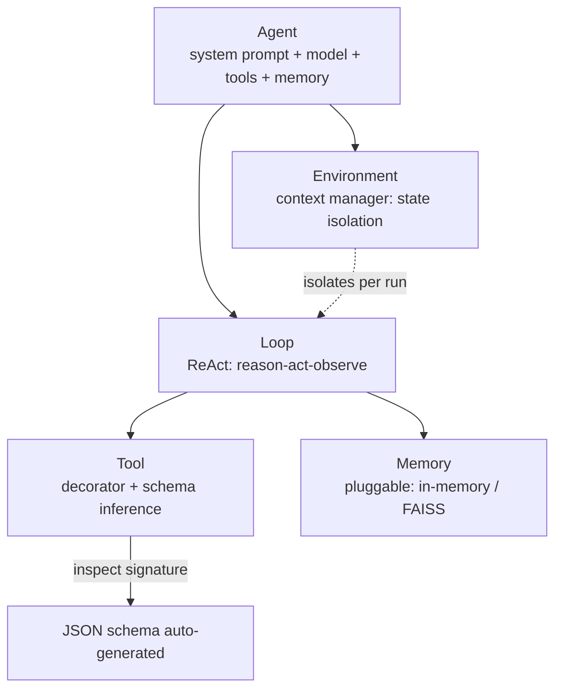
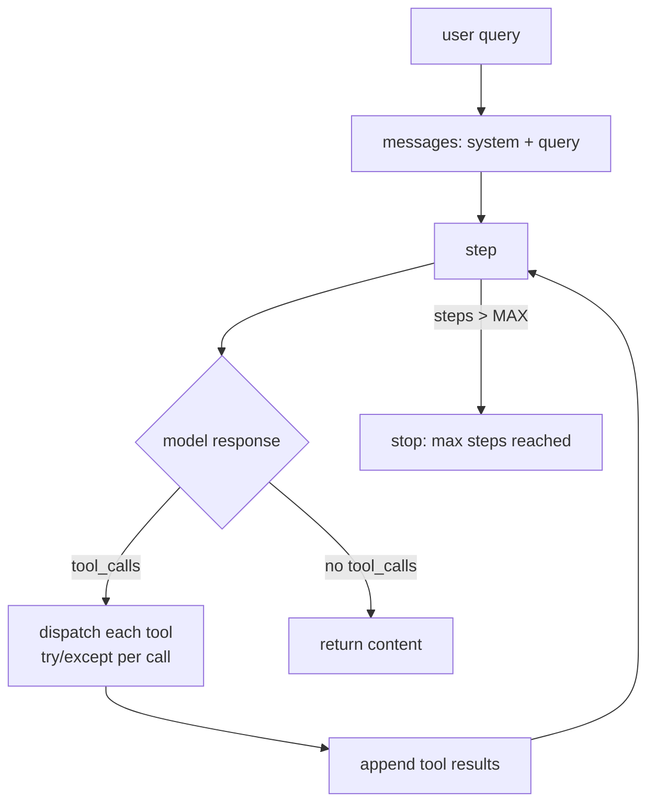
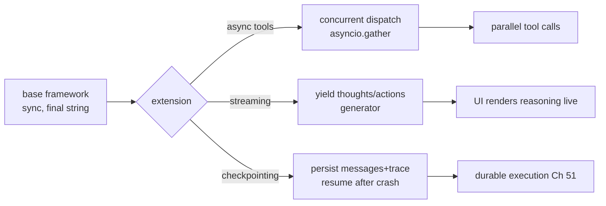

# Chapter 45: Project — Building an Agent Framework from Scratch

> **Lead paragraph.** Chapter 44 mapped the framework landscape and argued that for most agents you do not need one. This chapter builds one anyway — not for productivity, but for understanding. By implementing the five core abstractions a framework hides (Agent, Tool, Memory, Environment, Loop) in pure Python, you make the framework's magic legible: you see what schema inference actually does, what a checkpoint actually saves, what an environment context manager actually isolates. The goal is the same as smolagents' ~1,000-line philosophy — small enough to read end to end, complete enough to run a real ReAct agent (Chapter 6). By the end you will have a framework you can extend with protocols (Chapter 46) and productionize with checkpoints (Chapter 51), and every commercial framework will look like a wrapped version of what you built.

---

## 1. The Five Abstractions

A framework is five abstractions and the wiring between them. Stating them up front makes the implementation that follows a filling-in of slots rather than a mystery:

- **Tool** — a callable plus its JSON schema, registered with a decorator. The framework generates the schema from the function signature (Chapter 44's `infer_schema`), so adding a tool is writing a function, not hand-authoring a schema.
- **Memory** — a pluggable interface with at least an in-memory implementation and a retrieval implementation (FAISS, Part V). The interface decouples the agent from the storage.
- **Environment** — a context manager that isolates state per run, so two concurrent runs do not clobber each other. This is the often-invisible abstraction that makes an agent reentrant.
- **Agent** — holds the system prompt, the model backend, the tools, and the memory. It is the configuration object; the loop is a method on it.
- **Loop** — the ReAct cycle (reason → act → observe) with error handling and a max-steps bound. This is the only piece that is genuinely an algorithm rather than a container.



<figcaption>Figure 45.1 — The five abstractions. Tool (decorator + schema inference), Memory (pluggable interface), Environment (context manager isolating per-run state), Agent (configuration: prompt + model + tools + memory), and Loop (the ReAct algorithm with error handling and max steps). A framework is these five plus the wiring; everything else is a wrapped version of them.</figcaption>

---

## 2. Tool: Decorator and Schema Inference

The `@tool` decorator is the single biggest convenience a framework offers. You write a function with type annotations and a docstring; the decorator inspects the signature and emits the JSON schema the model's tool-calling API expects. This is Chapter 44's `infer_schema` turned into a registration mechanism — the function is both the implementation and the schema source, so they cannot drift apart.

The implementation uses `inspect.signature` to walk parameters and map Python types to JSON-Schema types, and `func.__doc__` as the tool description. The result is a `Tool` object holding the callable, the name, and the schema — everything the loop needs to advertise the tool to the model and dispatch its calls.

```python
import inspect, json

def infer_schema(func):
    sig = inspect.signature(func)
    props, required = {}, []
    type_map = {"str": "string", "int": "integer",
                "float": "number", "bool": "boolean"}
    for name, p in sig.parameters.items():
        ann = p.annotation if p.annotation is not inspect._empty else str
        jtype = type_map.get(getattr(ann, "__name__", "str"), "string")
        props[name] = {"type": jtype,
                       "description": f"{name} argument"}
        if p.default is inspect._empty:
            required.append(name)
    return {"type": "object", "properties": props, "required": required}

class Tool:
    def __init__(self, func):
        self.func = func
        self.name = func.__name__
        self.schema = {
            "type": "function",
            "function": {"name": func.__name__,
                         "description": (func.__doc__ or "").strip(),
                         "parameters": infer_schema(func)}}

    def __call__(self, **kwargs):
        return self.func(**kwargs)

def tool(func):
    """Register a function as a tool — schema inferred from signature."""
    return Tool(func)

@tool
def calculate(expression: str) -> str:
    """Evaluate a math expression and return the result."""
    try:
        return str(eval(expression, {"__builtins__": {}}, {}))
    except Exception as e:
        return f"error: {e}"

# calculate.schema is a valid OpenAI tool-calling schema, generated from
# the signature (expression: str) and the docstring — no hand-written JSON.
```

The `eval` sandbox (`{"__builtins__": {}}`) blocks builtins so a crafted expression cannot call `open` or `import` — a minimal defense, not a real sandbox (Chapter 47 covers proper sandboxing). The point here is the schema inference: `calculate.schema` is a valid tool-calling schema generated entirely from the signature and docstring.

---

## 3. Memory: The Pluggable Interface

The memory interface is the seam that lets the same agent run with a trivial in-memory store or a FAISS-backed retriever without changing the agent code. The interface is tiny — `add(turn)`, `retrieve(query, k)` — and the implementations differ in capacity and latency. This is Part V's lesson made concrete: the agent depends on an interface, not a store, so the store is swappable.

```python
from abc import ABC, abstractmethod

class Memory(ABC):
    @abstractmethod
    def add(self, text: str) -> None: ...
    @abstractmethod
    def retrieve(self, query: str, k: int = 3) -> list: ...

class InMemory(Memory):
    """Trivial store — every turn, linear scan. For tests and demos."""
    def __init__(self):
        self.turns = []

    def add(self, text):
        self.turns.append(text)

    def retrieve(self, query, k=3):
        # naive: most-recent first (no semantic search)
        return self.turns[-k:]
```

The `InMemory` implementation is intentionally naive — recent turns first, no semantic search — because its job is to make the interface runnable without a vector dependency. A `FAISSMemory` (Chapter 36) implements the same two methods with embeddings and ANN search; the agent does not know which it has. This is the dependency-inversion principle (Chapter 36's architecture lesson) applied to memory: depend on the abstraction, not the concrete store.

---

## 4. Environment: Per-Run State Isolation

The **Environment** is the abstraction most frameworks hide so well you forget it exists: a context manager that gives each `agent.run()` its own state, so two concurrent runs do not share scratch space. Without it, a long-running agent's intermediate observations leak into the next run, producing baffling cross-contamination bugs. With it, each run is a clean room.

```python
import contextlib

class Environment:
    """Per-run state isolation. Entering saves a clean trace; exiting
    could checkpoint it (Chapter 51)."""

    def __init__(self):
        self.trace = []
        self._saved = None

    @contextlib.contextmanager
    def run(self):
        prev = self.trace
        self.trace = []
        try:
            yield self
        finally:
            self._saved = self.trace
            self.trace = prev   # restore, so concurrent runs don't clobber

    def log(self, step):
        self.trace.append(step)
```

The `try/finally` with `prev`/`self.trace = prev` is the isolation: each `with env.run()` gets a fresh list, and restoring the previous list on exit means nested or concurrent runs see only their own steps. The `_saved` field is the hook for checkpointing (Chapter 51) — the environment already captures the trace, so persisting it is a one-liner extension.

---

## 5. Agent and Loop: ReAct with Error Handling

The `Agent` holds configuration; the `Loop` is the ReAct algorithm. The loop's responsibilities beyond the bare reason-act-observe cycle are the production concerns a toy lacks: catch tool errors (a malformed call should not crash the run), enforce a max-steps bound (an agent stuck in a tool-call loop must terminate), and route tool results back to the model.



<figcaption>Figure 45.2 — The ReAct loop with production concerns. Each step calls the model; if it returns tool_calls, dispatch each (wrapped in try/except so one bad call does not crash the run), append results, and loop. If it returns plain content, return it. A max-steps bound stops agents stuck cycling through tools — the failure mode a toy loop hangs on forever.</figcaption>

The agent ties it together with the standard `LLMClient`:

```python
import os, json
import openai


class LLMClient:
    """OpenAI-compatible client; flips to a local Ollama endpoint."""

    def __init__(self, model="gpt-5.5", use_ollama=False):
        self.model = model
        if use_ollama:
            self.client = openai.OpenAI(
                base_url="http://localhost:11434/v1", api_key="ollama")
        else:
            self.client = openai.OpenAI(api_key=os.getenv("OPENAI_API_KEY"))


class Agent:
    def __init__(self, llm, tools, memory=None, system_prompt="",
                 max_steps=8):
        self.llm = llm
        self.tools = {t.name: t for t in tools}
        self.memory = memory or InMemory()
        self.system_prompt = system_prompt
        self.max_steps = max_steps
        self.env = Environment()

    def _schemas(self):
        return [t.schema for t in self.tools.values()]

    def run(self, query):
        messages = [{"role": "system", "content": self.system_prompt},
                    {"role": "user", "content": query}]
        with self.env.run():
            for step in range(self.max_steps):
                self.env.log(f"step {step}")
                resp = self.llm.client.chat.completions.create(
                    model=self.llm.model, messages=messages,
                    tools=self._schemas())
                msg = resp.choices[0].message
                messages.append(msg)
                if not msg.tool_calls:
                    self.memory.add(f"Q: {query}\nA: {msg.content}")
                    return msg.content
                for call in msg.tool_calls:
                    result = self._dispatch(call)
                    messages.append({"role": "tool", "tool_call_id": call.id,
                                     "content": result})
            return "max steps reached"

    def _dispatch(self, call):
        # error handling: one bad tool call does not crash the run
        try:
            args = json.loads(call.function.arguments)
            fn = self.tools[call.function.name]
            return str(fn(**args))
        except Exception as e:
            return f"tool error: {e}"


if __name__ == "__main__":
    @tool
    def calculate(expression: str) -> str:
        """Evaluate a math expression."""
        return str(eval(expression, {"__builtins__": {}}, {}))

    @tool
    def echo(text: str) -> str:
        """Echo back the given text."""
        return text

    llm = LLMClient(use_ollama=True)
    agent = Agent(llm, [calculate, echo],
                  system_prompt="Use tools to answer precisely.",
                  max_steps=6)
    print(agent.run("What is 17 * 23, then echo the word 'done'."))
```

Two production details to verify. First, `_dispatch` wraps each tool call in `try/except` and returns the error string as the tool result — so the model sees `"tool error: ..."` in its context and can recover (retry, call a different tool), rather than the run crashing. Second, the max-steps bound returns a sentinel string instead of looping forever — the failure mode when an agent oscillates between two tools without converging. Both are the difference between a demo loop and one you could leave running.

---

## 6. Extensions: Async, Streaming, Checkpointing

The base framework is synchronous and returns a final string. Three extensions make it production-shaped, each a small addition rather than a rewrite:

- **Async tools** — mark tools `async def` and dispatch with `asyncio.gather` so independent tool calls run concurrently (parallel API calls). The loop's dispatch becomes concurrent where the dependency graph allows.
- **Streaming** — `yield` intermediate thoughts and actions instead of returning a final string, so a UI can render the agent's reasoning as it happens. This changes `run` from returning to being a generator.
- **Checkpointing** — persist `messages` and the environment's trace to disk at each step, so a crashed long-running agent resumes from the last checkpoint rather than restarting. The environment already captures the trace (Section 4); persistence is the extension.



<figcaption>Figure 45.3 — Three extensions to the base framework. Async tools enable concurrent dispatch (parallel API calls where the dependency graph allows). Streaming turns the run into a generator yielding intermediate thoughts and actions for live UI rendering. Checkpointing persists messages and the trace so a crashed agent resumes from the last step — the bridge to durable execution (Chapter 51).</figcaption>

Each extension is orthogonal — you can add streaming without async, checkpointing without either. This orthogonality is the payoff of having built the five abstractions cleanly: the seams are where extension happens, and the seams exist because the abstractions were separated.

---

## 7. Evaluation: Overhead and Correctness

A framework you built is not done until you can answer two questions:

- **Correctness** — does it run the ReAct agent from Chapter 6 and produce the right tool sequence? The test is the Chapter 6 project ported onto this framework; if it behaves identically, the abstractions are faithful.
- **Overhead** — how much latency does the framework add over direct API calls? Measure wall-clock for the same query with the raw SDK versus through `Agent.run`. The framework's cost is the schema inference, the message marshalling, and the dispatch indirection — for a handful of tools this is negligible; for hundreds it matters.

<figure>
<svg width="100%" viewBox="0 0 820 280" xmlns="http://www.w3.org/2000/svg">
  <rect x="0" y="0" width="820" height="280" fill="#ffffff"/>
  <text x="410" y="28" font-family="sans-serif" font-size="14" fill="#222222" text-anchor="middle" font-weight="bold">Framework overhead vs direct API calls</text>
  <line x1="80" y1="230" x2="760" y2="230" stroke="#333333" stroke-width="1.5"/>
  <text x="420" y="258" font-family="sans-serif" font-size="11" fill="#333333" text-anchor="middle">number of tools →</text>
  <line x1="80" y1="230" x2="80" y2="60" stroke="#333333" stroke-width="1.5"/>
  <text x="50" y="145" font-family="sans-serif" font-size="11" fill="#333333" text-anchor="middle" transform="rotate(-90 50 145)">added latency per step →</text>
  <!-- direct: flat near zero -->
  <path d="M 100 222 L 740 220" fill="none" stroke="#0F6E56" stroke-width="2.5"/>
  <text x="660" y="208" font-family="sans-serif" font-size="11" fill="#0F6E56" text-anchor="middle">direct SDK (no framework)</text>
  <!-- framework: rises with tool count -->
  <path d="M 100 218 Q 300 200 500 150 Q 620 110 740 80" fill="none" stroke="#534AB7" stroke-width="2.5"/>
  <text x="640" y="72" font-family="sans-serif" font-size="11" fill="#534AB7" text-anchor="middle">through framework</text>
  <circle cx="260" cy="212" r="5" fill="#993C1D"/>
  <text x="260" y="200" font-family="sans-serif" font-size="10" fill="#993C1D" text-anchor="middle">few tools: negligible</text>
  <circle cx="640" cy="100" r="5" fill="#993C1D"/>
  <text x="640" y="90" font-family="sans-serif" font-size="10" fill="#993C1D" text-anchor="middle">many tools: schema cost</text>
</svg>
<figcaption>Figure 45.4 — Framework overhead versus direct API calls. Direct SDK latency is flat regardless of tool count (no schema marshalling). Framework overhead rises with tool count — schema inference and dispatch indirection are negligible for a handful of tools but matter at scale. Measure the crossover: below it, the framework's convenience is free; above it, the abstraction costs real latency.</figcaption>
</figure>

The crossover point — where framework overhead stops being negligible — is the empirical answer to "when does the no-framework path (Chapter 44) win on performance?" Measure it for your tool count; the curve in Figure 45.4 is the shape, the crossover is your number.

---

## Summary

- A framework is five abstractions plus wiring: Tool (decorator + schema inference from signatures), Memory (pluggable interface, in-memory or FAISS), Environment (context manager isolating per-run state), Agent (configuration: prompt + model + tools + memory), and Loop (ReAct with error handling and max steps). Everything a commercial framework offers is a wrapped version of these.
- The `@tool` decorator is the biggest convenience: write a function with type annotations and a docstring, get a valid tool-calling schema from `inspect.signature` — implementation and schema cannot drift.
- The Memory interface (`add`/`retrieve`) decouples the agent from storage, so the same agent runs with trivial in-memory or FAISS retrieval. This is dependency inversion applied to memory: depend on the abstraction, not the concrete store.
- The Environment context manager gives each `agent.run()` clean state via try/finally restoration — the invisible abstraction that makes an agent reentrant, and the hook for checkpointing.
- The Loop's production concerns are try/except per tool call (one bad call returns an error string the model can recover from, not a crash) and a max-steps bound (an agent cycling tools forever must terminate). Extensions — async, streaming, checkpointing — are orthogonal and attach at the seams the abstractions created.

---

## Further Reading

- [smolagents](https://github.com/huggingface/smolagents) — HuggingFace's ~1,000-LOC framework; the philosophical reference for this project.
- [PydanticAI](https://ai.pydantic.dev/) — type-safe design with signature-driven schema inference, a production realization of the `@tool` pattern.
- [OpenAI Agents SDK](https://github.com/openai/openai-agents-python) — the production successor to Swarm; compare its abstractions against the five built here.

---