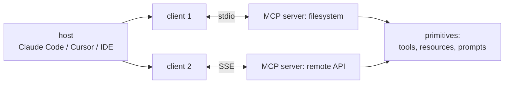
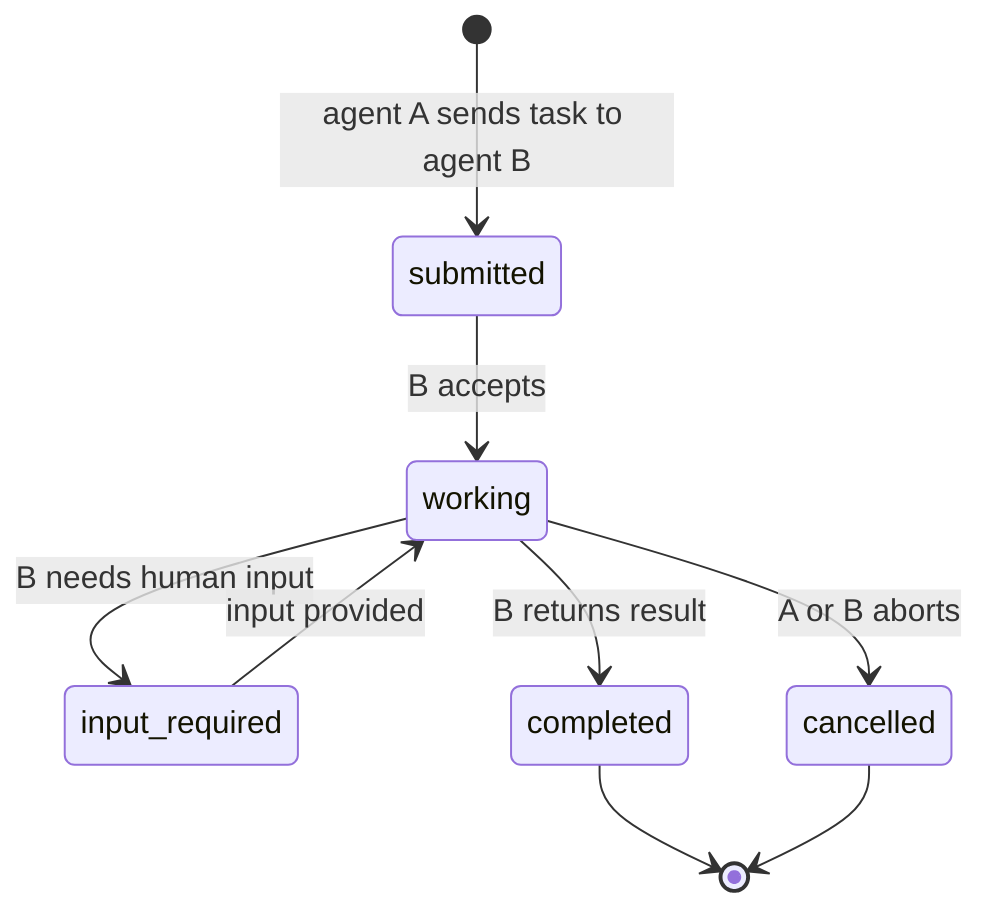
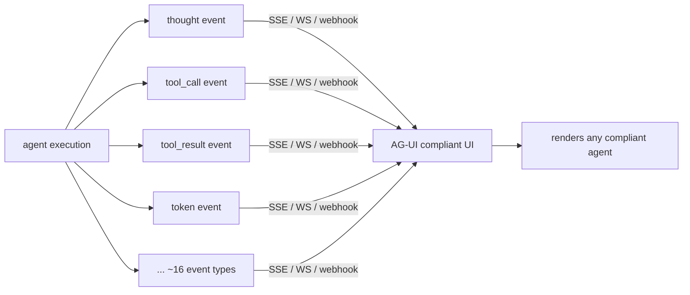

# Chapter 46: Tool Definition, Discovery, and Protocols

> **Lead paragraph.** A tool that only works with one agent is a toy; a tool that works with any agent is infrastructure. By 2026 three protocols have split the agent interop problem into three clean layers: AG-UI (agent ↔ user), MCP (agent ↔ tools), and A2A (agent ↔ agent). Each decouples one seam — presentation, tool access, agent coordination — so that components built by different vendors compose. MCP, the middle layer, is the "USB-C moment for AI tools": any MCP-compatible tool works with any MCP-compatible agent, and the protocol reports 97 million monthly SDK downloads as of March 2026. This chapter covers all three — MCP's host/client/server architecture and primitives, A2A's Agent Cards and task lifecycle, AG-UI's event types — and the three-layer model that together forms a complete interoperability stack. By the end you will understand why decoupling tool definitions from agents was the unlock, and how an agent discovers another agent the way it discovers a tool.

---

## 1. The Three-Layer Model

Before the protocols, every agent reinvented three seams: how it talked to its user, how it called tools, and how it talked to other agents. The result was silos — a CrewAI tool did not work with a LangGraph agent, a Cohere agent could not hand off to an OpenAI one. The 2026 stack separates these into three protocols, each owning one seam:

- **AG-UI (Agent-User Interaction Protocol)** — agent ↔ user. The presentation layer: how the agent streams thoughts, tool calls, and results to a UI. ~16 event types, transport-agnostic (SSE, WebSockets, webhooks).
- **MCP (Model Context Protocol)** — agent ↔ tools. Tool access: how an agent discovers and calls a tool's capabilities. Host/client/server architecture, Tools/Resources/Prompts primitives.
- **A2A (Agent-to-Agent Protocol)** — agent ↔ agent. Agent coordination: how one agent discovers another, negotiates a task, and tracks it to completion. Agent Cards, task lifecycle, OAuth2/mTLS security.

```mermaid
flowchart TB
  USER[user] <-- AG-UI <--> A1[agent A]
  A1 <-- MCP <--> T1[tool 1]
  A1 <-- MCP <--> T2[tool 2]
  A1 <-- A2A <--> A2[agent B]
  A2 <-- MCP <--> T3[tool 3]
  AGUI_L[AG-UI: presentation<br/>~16 event types] -.-> A1
  MCP_L[MCP: tool access<br/>tools/resources/prompts] -.-> T1
  A2A_L[A2A: agent coordination<br/>agent cards + task lifecycle] -.-> A2
```

<figcaption>Figure 46.1 — The three-layer protocol model. AG-UI (agent ↔ user, presentation, ~16 event types) sits at the top. MCP (agent ↔ tools, tool access, tools/resources/prompts) sits in the middle — the "USB-C moment" connecting any tool to any agent. A2A (agent ↔ agent, coordination, Agent Cards + task lifecycle) connects agents to each other. Each protocol owns one seam; together they form a complete interoperability stack.</figcaption>

The payoff is composability: a tool written once as an MCP server works with every MCP-compatible agent; an agent exposing an A2A endpoint can be discovered and delegated to by any other. The seams are where vendor lock-in used to live, and the protocols replace lock-in with a standard.

---

## 2. MCP: Decoupling Tools from Agents

**Model Context Protocol** (MCP) is the standard that decouples tool definitions from agents. Before MCP, every framework had its own tool format (Chapter 44's `@tool` decorator is one); after MCP, a tool is an MCP server, and any MCP-compatible agent can call it. This is the USB-C moment — one connector, many devices.

MCP's architecture has four roles:

- **Host** — the application the user runs (Claude Code, Cursor, an IDE). It owns the session and the user's permissions.
- **Client** — inside the host, one client per connected server. It speaks the MCP protocol on the host's behalf.
- **Server** — a program exposing tools, resources, and prompts. Stateless and transport-agnostic: it can run locally (stdio) or remotely (SSE).
- **Transport** — the wire: stdio for local servers, SSE/HTTP for remote ones.

MCP exposes three primitives:

- **Tools** — callable functions with schemas (the model invokes these, Chapter 4).
- **Resources** — readable data the agent can pull (files, database rows) without a function call.
- **Prompts** — reusable prompt templates the server contributes.



<figcaption>Figure 46.2 — MCP architecture. The host (the user's application) runs one client per connected server. Servers are stateless and transport-agnostic — local servers over stdio, remote over SSE. Each server exposes tools (callable functions), resources (readable data), and prompts (templates). Any MCP-compatible agent can call any MCP server, which is why MCP is the USB-C moment for AI tools.</figcaption>

The official **MCP Registry** with namespace authentication is the discovery layer on top: a catalog of servers so an agent can find the one it needs rather than being pre-wired. Vendor adoption is broad — Claude Code, Cursor, Windsurf, VS Code, Zed, Cloudflare all speak MCP — and the 97-million-monthly-download figure (March 2026) is the adoption signal that this is a settled standard, not an experiment.

```python
# The shape of an MCP tool schema — what a server advertises per tool.
# Any MCP-compatible agent reads this and can invoke the tool.
mcp_tool_schema = {
    "type": "function",
    "function": {
        "name": "lookup_stock",
        "description": "Look up a stock price by symbol.",
        "parameters": {
            "type": "object",
            "properties": {"symbol": {"type": "string"}},
            "required": ["symbol"]}}}
# A resource (readable data, no function call) and a prompt (template)
# are the other two MCP primitives a server advertises alongside tools.
```

The schema above is what an MCP server advertises per tool — identical in shape to the tool-calling schema of Chapter 4, because MCP standardizes that shape across servers. The two other primitives, resources (readable data, pulled without a call) and prompts (reusable templates), ride alongside tools in the same advertisement.

---

## 3. A2A: Agent-to-Agent Coordination

**A2A (Agent2Agent)** is the first true agent-to-agent standard, v1.0 under the Linux Foundation (March 2026). Before A2A, agents communicated via ad-hoc APIs or shared memory — every pair a custom integration. A2A formalizes discovery, negotiation, and task handoff, so a Cohere agent can delegate to a Google agent without bespoke wiring. The protocol reports 150-plus production organizations and substantial GitHub traction in its first year.

A2A's two key ideas:

- **Agent Cards** — discovery via a `.well-known/agent-card.json` endpoint, like an OpenAPI spec for agents. The card advertises the agent's capabilities, endpoints, and authentication requirements. An agent discovers another by fetching its card, the way it discovers a tool by reading its schema.
- **Task lifecycle** — a state machine: `submitted → working → (input-required) → completed | cancelled`. The lifecycle formalizes that agent-to-agent work is asynchronous and may need human input mid-task (the `input-required` state).

Security is built in: OAuth2 for authorization, mTLS for transport, JWS-signed Agent Cards so a fetched card is verifiably authentic and not spoofed.



<figcaption>Figure 46.3 — The A2A task lifecycle. Agent A submits a task to agent B (discovered via B's Agent Card at .well-known/agent-card.json). B accepts (working), may pause for human input (input-required), then completes or is cancelled. OAuth2 authorizes, mTLS secures transport, JWS signs the Agent Card so it is verifiably authentic — agent-to-agent work is asynchronous and may need a human mid-task.</figcaption>

---

## 4. AG-UI: The Presentation Layer

**AG-UI (Agent-User Interaction Protocol)** is the de facto standard for how an agent streams its work to a UI. An agent's execution is a sequence of events — a thought, a tool call, a tool result, a partial token of output — and AG-UI defines ~16 event types covering them. It is transport-agnostic (SSE, WebSockets, webhooks), so the same agent streams to a browser, a CLI, or a webhook consumer.

AG-UI's adoption is across the framework ecosystem — LangGraph, CrewAI, Pydantic AI, Google ADK, Microsoft Agent Framework all partner on it. This is the presentation seam standardized: a UI built to AG-UI renders any compliant agent's events, and an agent emitting AG-UI events renders in any compliant UI. Without AG-UI, every framework had its own event format and every UI was framework-specific; with it, the UI and the agent decouple.



<figcaption>Figure 46.4 — AG-UI, the presentation layer. An agent's execution emits ~16 event types (thought, tool_call, tool_result, token, ...); AG-UI standardizes them and transports over SSE, WebSockets, or webhooks. A UI built to AG-UI renders any compliant agent; an agent emitting AG-UI renders in any compliant UI — the presentation seam decoupled, replacing per-framework event formats.</figcaption>

---

## 5. Agentic Code Project: An MCP-Style Tool Server and A2A-Style Agent Card

This project implements the two protocols in miniature: a tool server that exposes a callable over a schema (the MCP pattern — tools with schemas, stateless) and an Agent Card endpoint (the A2A pattern — capability advertisement and a task lifecycle). It uses the standard `LLMClient` to consume the exposed tool. The point is to show that the protocols formalize patterns you can build in tens of lines — and that once built this way, any compliant client (agent or UI) can use them.

```python
import os, json, inspect
from dataclasses import dataclass, field
import openai


class LLMClient:
    """OpenAI-compatible client; flips to a local Ollama endpoint."""

    def __init__(self, model="gpt-5.5", use_ollama=False):
        self.model = model
        if use_ollama:
            self.client = openai.OpenAI(
                base_url="http://localhost:11434/v1", api_key="ollama")
        else:
            self.client = openai.OpenAI(api_key=os.getenv("OPENAI_API_KEY"))


# --- MCP-style tool server: expose a callable + schema, stateless ---

def infer_schema(func):
    sig = inspect.signature(func)
    props, required = {}, []
    tmap = {"str": "string", "int": "integer", "float": "number", "bool": "boolean"}
    for name, p in sig.parameters.items():
        ann = p.annotation if p.annotation is not inspect._empty else str
        props[name] = {"type": tmap.get(getattr(ann, "__name__", "str"), "string")}
        if p.default is inspect._empty:
            required.append(name)
    return {"type": "object", "properties": props, "required": required}


class ToolServer:
    """Minimal MCP server: register tools, expose schemas, dispatch calls."""

    def __init__(self):
        self.tools = {}

    def register(self, func):
        self.tools[func.__name__] = {
            "callable": func,
            "schema": {"type": "function", "function": {
                "name": func.__name__,
                "description": (func.__doc__ or "").strip(),
                "parameters": infer_schema(func)}}}
        return func

    def list_tools(self):
        return [t["schema"] for t in self.tools.values()]

    def call(self, name, args):
        return str(self.tools[name]["callable"](**args))


# --- A2A-style agent card: capability advertisement + task lifecycle ---

@dataclass
class AgentCard:
    name: str
    endpoint: str
    capabilities: list
    auth: str = "oauth2"
    card_signed: bool = True   # JWS-signed in real A2A

    def to_json(self):
        # served at .well-known/agent-card.json
        return json.dumps(self.__dict__)


def run_task(card, task_text, server, llm):
    """A2A task lifecycle: submitted -> working -> completed."""
    state = "submitted"
    print(f"[{card.name}] {state}: {task_text}")
    state = "working"
    messages = [{"role": "system", "content": f"You are {card.name}. "
                f"Tools: {list(server.tools)}."},
               {"role": "user", "content": task_text}]
    for _ in range(6):
        resp = llm.client.chat.completions.create(
            model=llm.model, messages=messages, tools=server.list_tools())
        msg = resp.choices[0].message
        messages.append(msg)
        if not msg.tool_calls:
            state = "completed"
            return {"state": state, "result": msg.content}
        for call in msg.tool_calls:
            args = json.loads(call.function.arguments)
            result = server.call(call.function.name, args)
            messages.append({"role": "tool", "tool_call_id": call.id,
                             "content": result})
    return {"state": "cancelled", "result": "max steps"}


if __name__ == "__main__":
    server = ToolServer()

    @server.register
    def lookup(symbol: str) -> str:
        """Look up a stock price by symbol."""
        return f"{symbol.upper()}: $184.20"

    card = AgentCard(name="finance-agent", endpoint="https://x/agent",
                     capabilities=["stock_lookup"])
    print("agent card:", card.to_json())   # discovery
    llm = LLMClient(use_ollama=True)
    print(run_task(card, "What is the price of AAPL?", server, llm))
```

The `ToolServer` is the MCP pattern in essence: tools registered with auto-inferred schemas (`list_tools` returns MCP-style schemas), dispatched statelessly (`call` takes name + args). The `AgentCard` is the A2A pattern: a JSON-advertised capability set served at a discovery endpoint, with `auth` and a `card_signed` flag standing in for the OAuth2/mTLS/JWS the real protocol uses. The `run_task` lifecycle (`submitted → working → completed/cancelled`) is A2A's state machine. What is missing from this miniature versus the real protocols is the wire (stdio/SSE), the security (real OAuth2/mTLS/JWS), and the registry — but the *shape* of both protocols is here, which is what makes the full standards legible.

---

## Summary

- The 2026 interop stack is three protocols, each owning one seam: AG-UI (agent ↔ user, presentation, ~16 event types, transport-agnostic), MCP (agent ↔ tools, tool access, tools/resources/prompts), and A2A (agent ↔ agent, coordination, Agent Cards + task lifecycle). Each decouples a seam where vendor lock-in used to live.
- MCP is the USB-C moment for AI tools: a host/client/server architecture (host runs the session, one client per server, servers stateless over stdio or SSE) exposing tools, resources, and prompts. Any MCP-compatible tool works with any MCP-compatible agent. The official MCP Registry adds discovery; 97M monthly SDK downloads (March 2026) signal a settled standard.
- A2A (v1.0, Linux Foundation, March 2026) is the first true agent-to-agent standard. Agent Cards (`.well-known/agent-card.json`, like OpenAPI for agents) enable discovery; a task lifecycle (submitted → working → input-required → completed/cancelled) formalizes asynchronous, human-in-the-loop agent work. Security via OAuth2, mTLS, JWS-signed cards.
- AG-UI standardizes the presentation layer: ~16 event types (thought, tool_call, tool_result, token, ...) over SSE/WebSockets/webhooks. Adopted across LangGraph, CrewAI, Pydantic AI, Google ADK, Microsoft Agent Framework — a UI built to AG-UI renders any compliant agent, decoupling UI from framework.

---

## Further Reading

- [Model Context Protocol](https://modelcontextprotocol.io/) — the MCP standard; architecture, primitives, registry.
- [Agent2Agent (A2A) Protocol](https://github.com/a2aproject/A2A) — v1.0, Linux Foundation; Agent Cards and task lifecycle.
- [A2A surpasses 150 organizations](https://www.linuxfoundation.org/press/a2a-protocol-surpasses-150-organizations-lands-in-major-cloud-platforms-and-sees-enterprise-production-use-in-first-year) — Linux Foundation press on first-year adoption.
- [AG-UI Protocol](https://github.com/ag-ui/protocol) — the de facto agent-user interaction protocol; event types and transports.

---