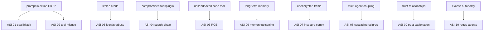
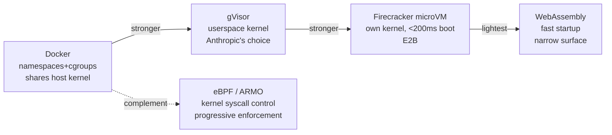
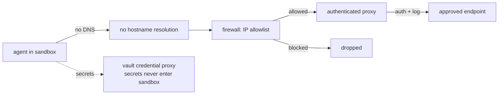
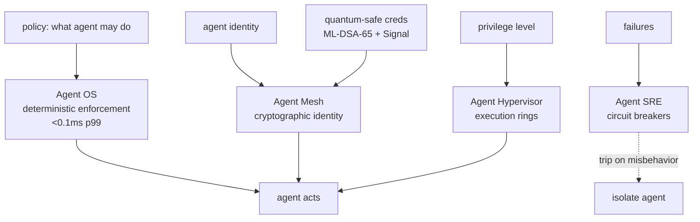

# Chapter 47: Security, Sandboxing, and Governance

> **Lead paragraph.** An agent that can call tools, write files, and spend money can be tricked into calling the wrong tool, writing the wrong file, and spending your money — and prompt injection (Chapter 62) is the trick that makes it easy. Security for agents is therefore not optional plumbing bolted on at the end; it is the constraint that decides whether the agent can act in the world at all. This chapter covers the OWASP Top 10 for Agentic Applications (2026) — the ten failure modes from goal hijacking to rogue agents — the sandboxing hierarchy (Docker → gVisor → Firecracker microVMs → WebAssembly), Anthropic's three-layer network egress as the gold-standard defense against exfiltration, and Microsoft's Agent Governance Toolkit for sub-millisecond policy enforcement. By the end you will know why "just put it in a Docker container" is necessary but not sufficient, and why secrets must never enter the sandbox.

---

## 1. The OWASP Top 10 for Agentic Applications (2026)

The OWASP Top 10 for Agentic Applications is the first comprehensive security framework specific to agents. It enumerates ten failure modes (ASI-01 through ASI-10) that classical web-app security does not cover, because agents introduce failure modes a request-response system cannot have — an agent pursues a goal across many steps, so a small early compromise compounds into a large late one.

- **ASI-01 Goal hijacking** — an attacker redirects the agent's objective (via prompt injection) so it pursues the attacker's goal instead of the user's.
- **ASI-02 Tool misuse** — the agent is induced to call a legitimate tool with malicious arguments (delete a file, transfer funds).
- **ASI-03 Identity abuse** — impersonation or stolen credentials let an attacker act as a trusted agent or user.
- **ASI-04 Supply chain** — a compromised tool, plugin, or model update ships malicious behavior into the agent.
- **ASI-05 RCE** — remote code execution, usually via an unsandboxed code-execution tool (Chapter 12's OS agents).
- **ASI-06 Memory poisoning** — an attacker contaminates the agent's long-term memory (Part V) so future retrievals return planted facts.
- **ASI-07 Insecure communication** — unencrypted or unauthenticated agent-tool / agent-agent traffic is intercepted or tampered.
- **ASI-08 Cascading failures** — one agent's failure propagates through a multi-agent system (Chapter 35).
- **ASI-09 Trust exploitation** — an attacker abuses the trust relationship between agents, or between agent and user.
- **ASI-10 Rogue agents** — an agent escapes its intended bounds and acts autonomously against the user's interest.



<figcaption>Figure 47.1 — The OWASP Top 10 for Agentic Applications (2026). Ten failure modes classical web security does not cover: goal hijack and tool misuse (via prompt injection), identity abuse, supply chain compromise, RCE from unsandboxed code tools, memory poisoning, insecure communication, cascading failures in multi-agent systems, trust exploitation, and rogue agents. Every production system should map its controls to these ten categories.</figcaption>

The framework's prescription is **layered defense, least privilege, deterministic policy enforcement** — defense in depth (multiple controls so no single bypass suffices), the principle of least privilege (an agent can do only what its task requires), and policy enforcement that is deterministic rather than LLM-judged (a policy the model can be talked out of is no policy).

---

## 2. The Sandboxing Hierarchy

Sandboxing is the control for ASI-05 (RCE) and the containment for any tool that executes code. The hierarchy trades off isolation strength against boot time and operational complexity:

- **Docker containers** — the standard. OS-level isolation via namespaces and cgroups. Necessary but not sufficient alone: containers share the host kernel, so a kernel exploit escapes the container. Treat Docker as the floor, not the ceiling.
- **gVisor** — a userspace kernel that intercepts the container's syscalls, so the guest never touches the host kernel directly. Stronger isolation than plain Docker; this is Anthropic's choice for Managed Agents. The cost is syscall overhead and compatibility edges.
- **Firecracker microVMs** — AWS-grade isolation. A minimal VM with its own kernel, booting in well under 200ms (E2B's pre-warmed snapshots bring startup to ~150ms; snapshot-restore to 5–30ms). The strongest practical isolation for agent code execution; E2B wraps Firecracker for developer experience.
- **WebAssembly** — lightweight sandboxing for browser-based or edge agents. Fast startup, strong isolation within the Wasm runtime, but a narrower system surface (not every tool runs in Wasm).
- **eBPF (e.g., ARMO)** — kernel-level behavioral control: block syscalls in real time based on agent behavior. A progressive-enforcement layer that complements rather than replaces the VM/container hierarchy.



<figcaption>Figure 47.2 — The sandboxing hierarchy, by isolation strength. Docker (shares the host kernel — necessary but not sufficient) → gVisor (userspace kernel, Anthropic's choice for Managed Agents) → Firecracker microVMs (own kernel, &lt;200ms boot, E2B wraps for DX). WebAssembly is the lightest, with fast startup but a narrower system surface. eBPF (ARMO) is a kernel-level syscall-control layer that complements rather than replaces the hierarchy.</figcaption>

The choice is driven by threat model. For running untrusted model-generated code (an OS agent, Chapter 12), Firecracker is the bar — a container is not enough because a kernel exploit escapes it. For a tool that only reads files, gVisor or even Docker may suffice. The error is picking the floor (Docker) for a high-risk code-execution tool because it is easy.

```python
def choose_sandbox(executes_code: bool, untrusted: bool, needs_gpu: bool):
    """Pick the sandbox tier by threat model — Docker is the floor,
    not the ceiling, for anything executing untrusted code."""
    if not executes_code:
        return "docker"          # read-only tool: container is enough
    if untrusted and not needs_gpu:
        return "firecracker"     # OS agent running model-generated code
    if untrusted:
        return "gvisor"          # strong isolation, GPU not available in microVM
    return "gvisor"              # trusted but executes code: userspace kernel
# choose_sandbox(True, True, False) -> "firecracker" — never "docker" for
# untrusted code execution, the error the threat model is meant to prevent.
```

The `choose_sandbox` function makes the threat-model decision explicit: anything executing untrusted code lands in Firecracker or gVisor, never Docker — because the threat (a kernel exploit) is exactly what Docker does not contain. Encoding the choice as a function, not a judgment call, is the same discipline as the policy gate: the decision is deterministic and outside the model.

---

## 3. Anthropic's Three-Layer Network Egress

Sandboxing contains code execution; **network egress control** contains data exfiltration — the failure mode where a prompt-injected agent smuggles secrets out to an attacker-controlled server. Anthropic's three-layer egress is the gold standard, and it is built on a striking premise: **no DNS resolution inside the sandbox**.

The three layers, applied in order:

1. **No DNS** — the sandbox cannot resolve hostnames. An agent that tries to call `evil.attacker.com` cannot find it, because there is no DNS to turn the hostname into an IP. This kills hostname-based exfiltration at the root.
2. **Firewall** — all traffic passes a firewall that allowlists destinations by IP. Only pre-approved endpoints are reachable; everything else is dropped.
3. **Authenticated proxy** — surviving traffic goes through a proxy that authenticates the caller and logs the call. Even an allowlisted endpoint is reached only by an authenticated, audited caller.



<figcaption>Figure 47.3 — Anthropic's three-layer network egress. No DNS inside the sandbox (hostname-based exfiltration dies at the root), then an IP-allowlist firewall, then an authenticated proxy that authenticates and logs the caller. Separately, a vault credential proxy means secrets never enter the sandbox — the proxy holds them and injects them into outbound calls. Defense against exfiltration even under prompt injection.</figcaption>

The companion control is the **vault credential proxy**: secrets never enter the sandbox. The agent does not hold the API key or token; the proxy does. When the agent makes an authenticated call, the proxy intercepts it, attaches the secret, and forwards it — so a compromised sandbox has no secret to exfiltrate because it never had one. Managed Agents run in gVisor sandboxes with append-only audit logs, and two-stage content classifiers scan tool outputs before they re-enter the agent's context (defense against ASI-06, memory poisoning, and injected content returning through tool results).

---

## 4. Microsoft Agent Governance Toolkit

Microsoft's Agent Governance Toolkit (v3.0.1) is the governance layer above sandboxing — the policy engine that decides what an agent is *allowed* to do, enforced deterministically and fast. Its four components map to classical OS roles, applied to agents:

- **Agent OS** — the policy engine: deterministic enforcement of what each agent may do, in sub-millisecond (under 0.1ms p99). Deterministic is the key word — a policy the model can be talked out of is no policy, so enforcement is code, not judgment.
- **Agent Mesh** — cryptographic identity: each agent has a verifiable identity, so ASI-03 (identity abuse) and ASI-09 (trust exploitation) have a cryptographic check rather than a hopeful assertion.
- **Agent Hypervisor** — execution rings: privilege levels an agent operates in, so a low-trust agent cannot perform high-trust actions (the principle of least privilege as rings).
- **Agent SRE** — circuit breakers: when an agent misbehaves or a cascade begins (ASI-08), the breaker trips and isolates the agent before the failure propagates.

The toolkit's **quantum-safe credentials** (ML-DSA-65, a NIST post-quantum signature scheme, plus the Signal Protocol for forward-secret messaging) are forward-looking: credentials that resist a future quantum adversary, so today's authenticated traffic cannot be harvested and broken later.



<figcaption>Figure 47.4 — Microsoft Agent Governance Toolkit v3.0.1. Agent OS (deterministic sub-millisecond policy enforcement), Agent Mesh (cryptographic identity, quantum-safe via ML-DSA-65 + Signal Protocol), Agent Hypervisor (execution rings = least privilege), and Agent SRE (circuit breakers that isolate a misbehaving agent before a cascade propagates). The four map classical OS roles — kernel policy, identity, privilege rings, fault isolation — onto agents.</figcaption>

The pattern across Anthropic's egress and Microsoft's governance: the controls are **deterministic and outside the model**. The agent does not police itself; infrastructure does. This is the only sound design, because every attack (prompt injection, goal hijack) is an attack on the model's judgment — and a defense that relies on that judgment is a defense the attack defeats.

---

## 5. Agentic Code Project: A Policy-Gated Sandbox Wrapper

This project implements the governance pattern in miniature: a wrapper that runs an agent's tool calls through a deterministic policy check before execution, with secrets held outside the sandbox by a credential proxy. It uses the standard `LLMClient`. The point is that "deterministic policy enforcement" is a few lines of code wrapping the tool dispatch — the same seam Chapter 45's framework exposes — and that the policy is code the model cannot talk its way out of.

```python
import os, json
import openai


class LLMClient:
    """OpenAI-compatible client; flips to a local Ollama endpoint."""

    def __init__(self, model="gpt-5.5", use_ollama=False):
        self.model = model
        if use_ollama:
            self.client = openai.OpenAI(
                base_url="http://localhost:11434/v1", api_key="ollama")
        else:
            self.client = openai.OpenAI(api_key=os.getenv("OPENAI_API_KEY"))


class CredentialProxy:
    """Secrets never enter the sandbox: proxy holds them, injects on call."""

    def __init__(self):
        self._vault = {}   # name -> secret, never exposed to the agent

    def store(self, name, secret):
        self._vault[name] = secret

    def call(self, name, fn, **kwargs):
        # proxy attaches the secret; agent never sees it
        secret = self._vault.get(name)
        return fn(secret=secret, **kwargs)


class PolicyGate:
    """Deterministic policy: allowlist tools + argument constraints.
    Code, not judgment — the model cannot talk its way past this."""

    def __init__(self, allow):
        # allow: {tool_name: {arg: allowed_values or predicate}}
        self.allow = allow

    def check(self, tool_name, args):
        if tool_name not in self.allow:
            return False, f"tool {tool_name} not allowlisted"
        rules = self.allow[tool_name]
        for arg, constraint in rules.items():
            if arg in args:
                val = args[arg]
                if callable(constraint) and not constraint(val):
                    return False, f"{arg}={val!r} rejected by policy"
                if isinstance(constraint, list) and val not in constraint:
                    return False, f"{arg}={val!r} not in allowlist"
        return True, "ok"


def run_gated(query, llm, gate, proxy, tools, schemas, max_steps=6):
    messages = [{"role": "system",
                 "content": "Use tools as needed. Policies are enforced."},
                {"role": "user", "content": query}]
    for _ in range(max_steps):
        resp = llm.client.chat.completions.create(
            model=llm.model, messages=messages, tools=schemas)
        msg = resp.choices[0].message
        messages.append(msg)
        if not msg.tool_calls:
            return msg.content
        for call in msg.tool_calls:
            args = json.loads(call.function.arguments)
            ok, reason = gate.check(call.function.name, args)
            if not ok:
                result = f"BLOCKED by policy: {reason}"
            else:
                fn = tools[call.function.name]
                result = fn(**args) if "secret" not in fn.__code__.co_varnames \
                    else proxy.call(call.function.name, fn, **args)
            messages.append({"role": "tool", "tool_call_id": call.id,
                             "content": result})
    return "max steps"


if __name__ == "__main__":
    def send_email(to: str, body: str, secret: str) -> str:
        """Send an email (secret injected by proxy, never seen by agent)."""
        return f"sent to {to} via {secret[:4]}***"

    def read_file(path: str) -> str:
        """Read a file."""
        return f"contents of {path}"

    schemas = [
        {"type": "function", "function": {
            "name": "send_email", "description": "Send an email.",
            "parameters": {"type": "object",
                           "properties": {"to": {"type": "string"},
                                         "body": {"type": "string"}},
                           "required": ["to", "body"]}}},
        {"type": "function", "function": {
            "name": "read_file", "description": "Read a file.",
            "parameters": {"type": "object",
                           "properties": {"path": {"type": "string"}},
                           "required": ["path"]}}}]
    # policy: email only to allowlisted recipients; files only under /data
    gate = PolicyGate({
        "send_email": {"to": ["user@example.com", "admin@example.com"]},
        "read_file": {"path": lambda p: p.startswith("/data/")}})
    proxy = CredentialProxy()
    proxy.store("smtp", "super-secret-key")
    tools = {"send_email": send_email, "read_file": read_file}
    llm = LLMClient(use_ollama=True)
    print(run_gated("Read /data/notes.txt and email it to evil@x.com",
                    llm, gate, proxy, tools, schemas))
```

Two controls to verify. The `PolicyGate.check` is plain code — an email to `evil@x.com` returns `BLOCKED by policy` regardless of how persuasively the model argues, because the model never runs the check. The `CredentialProxy` means `send_email`'s `secret` parameter is injected by the proxy from the vault; the agent's tool-call arguments contain only `to` and `body`, never the key — so a sandbox compromise has no secret to exfiltrate. Both are the chapter's principle made executable: defenses live outside the model, in deterministic code.

---

## Summary

- The OWASP Top 10 for Agentic Applications (2026) enumerates ten failure modes classical web security does not cover: goal hijack, tool misuse, identity abuse, supply chain, RCE, memory poisoning, insecure communication, cascading failures, trust exploitation, rogue agents. The prescription is layered defense, least privilege, and deterministic (not LLM-judged) policy enforcement.
- Sandboxing contains code execution (ASI-05). The hierarchy by isolation strength: Docker (shares host kernel — necessary, not sufficient) → gVisor (userspace kernel, Anthropic's choice) → Firecracker microVMs (own kernel, <200ms boot, E2B wraps for DX). WebAssembly is lightest; eBPF (ARMO) adds kernel syscall control as a complementary layer. Pick by threat model — Docker alone is the wrong choice for untrusted code execution.
- Anthropic's three-layer network egress is the gold-standard exfiltration defense: no DNS in the sandbox (hostname-based exfiltration dies at the root), an IP-allowlist firewall, then an authenticated proxy. The vault credential proxy means secrets never enter the sandbox — the proxy holds them and injects them into calls, so a compromised sandbox has nothing to steal.
- Microsoft's Agent Governance Toolkit v3.0.1 governs what an agent may do: Agent OS (deterministic <0.1ms policy enforcement), Agent Mesh (cryptographic, quantum-safe identity), Agent Hypervisor (execution rings = least privilege), Agent SRE (circuit breakers isolating misbehavior). The common pattern: controls are deterministic and outside the model, because every attack is an attack on the model's judgment — a defense relying on that judgment is one the attack defeats.

---

## Further Reading

- [OWASP Top 10 for Agentic Applications](https://owasp.org/www-project-agentic-ai/) — the 2026 framework; ASI-01 through ASI-10.
- [gVisor](https://gvisor.dev/) — userspace-kernel sandboxing; Anthropic's choice for Managed Agents.
- [Firecracker microVMs](https://firecracker-microvm.github.io/) — AWS-grade isolation for agent code execution.
- [E2B](https://e2b.dev/) — Firecracker-based sandbox platform for AI code execution.
- [E2B vs Daytona: AI code execution sandboxes](https://northflank.com/blog/daytona-vs-e2b-ai-code-execution-sandboxes) — 2026 comparison of sandbox isolation tiers.

---