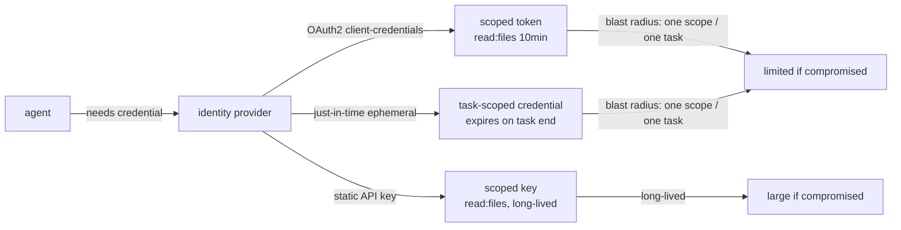
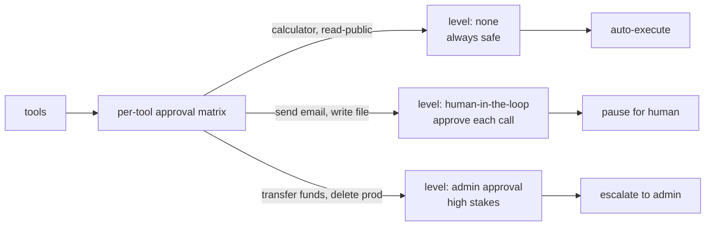
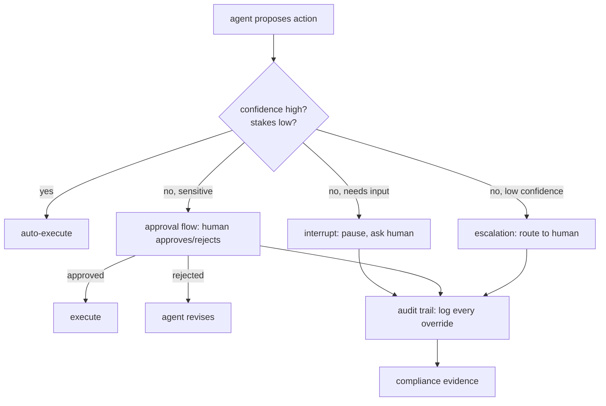
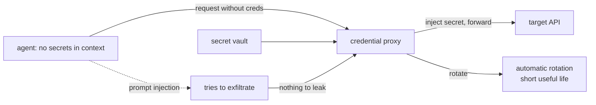

# Chapter 48: Authentication, Authorization, and Human-in-the-Loop

> **Lead paragraph.** Chapter 47 sandboxed the agent and controlled its network egress; this chapter answers two questions that sandboxing alone cannot: who is the agent, and when should a human say no? Authentication establishes the agent's identity (OAuth 2.0, scoped tokens, just-in-time ephemeral credentials); authorization decides what that identity may do (the principle of least agency, capability tokens, per-tool approval matrices). Human-in-the-loop is the backstop — the interrupts, approval flows, and escalation paths that catch what policy cannot, because some actions are too consequential to delegate even to a trusted agent. By the end you will know why a calculator tool does not need write access, why credentials should be short-lived and purpose-scoped, and why every human override must be logged.

---

## 1. Authenticating the Agent

An agent that acts in the world needs an identity — not the user's identity borrowed wholesale, but its own, scoped to what it needs. Three patterns cover the space:

- **OAuth 2.0 / OIDC** — the agent authenticates via the same flows a user would (authorization code, client credentials), so it integrates with existing identity providers rather than rolling its own auth. OIDC adds the identity layer (who is this agent) on top of OAuth's authorization (what can it do).
- **API keys and scoped tokens** — a static key with a scope (read:files, not write:files). Simpler than OAuth but weaker unless scopes are enforced server-side; a leaked scoped token leaks only its scope.
- **Just-in-time ephemeral identities** — short-lived, purpose-scoped credentials minted for one task and discarded. The agent does not hold a long-lived secret; it requests a credential valid for minutes, scoped to exactly the task, and the credential expires. If compromised, the blast radius is one task, not the whole account. Oasis's Agentic Access Management provides intent-aware identity infrastructure along these lines — credentials minted against the *intent* of the action, not just the caller.



<figcaption>Figure 48.1 — Three agent-authentication patterns. OAuth 2.0 / OIDC integrates with existing identity providers; scoped API keys are simpler but weaker unless scopes are enforced; just-in-time ephemeral credentials are short-lived and purpose-scoped, so compromise yields a blast radius of one task. The principle: an agent should not hold a long-lived secret when a short-lived scoped one suffices.</figcaption>

The governing principle: an agent should not hold a long-lived secret when a short-lived scoped one will do. A credential valid for ten minutes and scoped to `read:files` cannot be exfiltrated into a persistent backdoor the way a long-lived admin key can.

---

## 2. Authorization: The Principle of Least Agency

Authentication says *who*; authorization says *what they may do*. For agents the principle is **least agency** — the analog of least privilege, sharpened: an agent should not have more autonomy than the task requires. A calculator tool does not need write access. An agent that summarizes documents does not need to send emails. Every capability granted beyond the task's need is an attack surface (Chapter 47's ASI-02, tool misuse).

The operational form is a **per-tool permission policy** — a matrix mapping each tool to a required approval level:

- **None** — always safe, no approval (calculator, read public data).
- **Human-in-the-loop** — requires a human to approve each call (send email, write file).
- **Admin approval** — requires an admin, for high-stakes actions (transfer funds, delete production data).



<figcaption>Figure 48.2 — Per-tool permission matrix. Each tool maps to an approval level: none (calculator, read public — always safe, auto-execute), human-in-the-loop (send email, write file — pause for human approval each call), or admin approval (transfer funds, delete production — escalate to an admin). The principle of least agency: an agent has no more autonomy than the task requires.</figcaption>

**Capability tokens** implement this concretely: scoped, time-bounded permissions a tool checks before acting. A capability to `write:/data/` valid for five minutes is not a blanket write permission — it is the narrowest grant that lets the task proceed, and it expires. The combination of least agency + capability tokens means a compromised agent can do only what its current task requires, only where its capability allows, only until the capability expires.

---

## 3. Human-in-the-Loop Patterns

Policy gates catch what is deterministic; **human-in-the-loop** catches what is not — the judgment calls a policy cannot encode. Four patterns:

- **Interrupts** — pause agent execution for human input mid-task. The agent does not guess; it stops and asks. Used when the agent lacks information only a human has.
- **Approval flows** — require explicit human approval for sensitive actions (the HIL level of the matrix). The agent proposes; a human approves or rejects; the agent proceeds or revises.
- **Escalation** — route to a human when confidence is low or stakes are high. Not every action can be pre-classified as "needs approval"; escalation handles the case where the agent itself signals uncertainty.
- **Audit trails** — record every human override, every approval, every rejection, every policy exception. Non-negotiable for compliance: if you cannot show what was approved and by whom, you cannot prove the system was governed.



<figcaption>Figure 48.3 — Human-in-the-loop patterns. High confidence and low stakes auto-execute; the rest branch: interrupts (pause to ask for input), approval flows (human approves/rejects sensitive actions), escalation (route to human when the agent itself is uncertain). Every override, approval, and exception is logged to an audit trail — non-negotiable for compliance, since governance must be provable after the fact.</figcaption>

The discipline that makes HIL more than theater: the approval must be *meaningful*. If the human rubber-stamps every request, the HIL is a checkbox, not a control. The defense is making the approval *cost* something — a delay, a confirmation step that surfaces what exactly the agent will do — so the human actually reads it. A one-click "approve all" defeats the purpose.

---

## 4. Secrets: The Proxy Pattern

The control that ties this chapter to Chapter 47: **secrets must never enter the agent's sandbox**. The proxy pattern (Chapter 47's vault credential proxy) is the mechanism — the agent sends requests without credentials; a proxy intercepts and injects them. The agent's tool-call arguments contain no secrets, so a compromised or prompt-injected agent has nothing to exfiltrate.

Two complements make this robust over time:

- **Secret rotation** — automatic credential refresh, so a leaked secret has a short useful life. Rotation must be transparent to the agent (the proxy swaps the secret) so the agent never holds a secret long enough to matter.
- **Exfiltration prevention** — even under prompt injection (Chapter 62), credentials stay protected because they are not in the agent's context to leak. The proxy is the boundary; the agent never crosses it with a secret.



<figcaption>Figure 48.4 — The proxy pattern for secrets. The agent holds no secrets — it sends requests without credentials; the proxy injects them from the vault and forwards. Automatic rotation keeps any leaked secret short-lived. Under prompt injection the agent tries to exfiltrate but has nothing to leak, because secrets never entered its context — the proxy is the boundary the agent cannot cross with a secret.</figcaption>

The pattern is the same as Chapter 47's: defenses live outside the model. The agent does not hold the secret and choose not to leak it; it never holds it. A defense that depends on the model's restraint is a defense prompt injection defeats; a defense that removes the secret from the model's reach is not.

---

## 5. Agentic Code Project: A Permission-Gated Agent with Approval Flows

This project implements the authorization layer: a per-tool approval matrix, capability tokens (scoped and time-bounded), an interrupt/approval HIL flow, and the proxy pattern for secrets. It uses the standard `LLMClient`. The point is that the controls from Sections 2–4 are a thin layer over Chapter 45's tool dispatch — the same seam — and that they are deterministic code the model cannot talk past.

```python
import os, json, time
from dataclasses import dataclass, field
import openai


class LLMClient:
    """OpenAI-compatible client; flips to a local Ollama endpoint."""

    def __init__(self, model="gpt-5.5", use_ollama=False):
        self.model = model
        if use_ollama:
            self.client = openai.OpenAI(
                base_url="http://localhost:11434/v1", api_key="ollama")
        else:
            self.client = openai.OpenAI(api_key=os.getenv("OPENAI_API_KEY"))


@dataclass
class Capability:
    scope: str          # e.g. "write:/data/"
    expires_at: float   # time-bounded

    def valid(self, now):
        return now < self.expires_at


class CredentialProxy:
    """Secrets never enter the agent: proxy holds them, injects on call."""

    def __init__(self):
        self._vault = {}

    def store(self, name, secret):
        self._vault[name] = secret

    def call(self, name, fn, **kwargs):
        return fn(secret=self._vault[name], **kwargs)


def human_approve(action):
    """Approval flow: in real use this interrupts a UI; here it auto-approves
    for the demo but logs the override."""
    print(f"[HIL] approve? {action}  -> yes (auto, demo)")
    return True


class PermissionGate:
    """Per-tool approval matrix + capability checks. Deterministic."""

    NONE, HIL, ADMIN = "none", "hil", "admin"

    def __init__(self, matrix):
        # {tool: level}; capabilities granted per run
        self.matrix = matrix
        self.caps = {}

    def grant(self, tool, scope, ttl=300):
        self.caps[tool] = Capability(scope, time.time() + ttl)

    def check(self, tool, args, now):
        level = self.matrix.get(tool, self.HIL)
        if level == self.NONE:
            return True, "auto"
        if level == self.HIL:
            ok = human_approve(f"{tool}({args})")
            return ok, "approved" if ok else "rejected"
        return False, "admin approval required"


def run_gated(query, llm, gate, proxy, tools, schemas, max_steps=6):
    messages = [{"role": "system",
                 "content": "Use tools as needed. Sensitive tools need approval."},
                {"role": "user", "content": query}]
    audit = []
    for _ in range(max_steps):
        resp = llm.client.chat.completions.create(
            model=llm.model, messages=messages, tools=schemas)
        msg = resp.choices[0].message
        messages.append(msg)
        if not msg.tool_calls:
            return msg.content, audit
        for call in msg.tool_calls:
            args = json.loads(call.function.arguments)
            ok, reason = gate.check(call.function.name, args, time.time())
            audit.append({"tool": call.function.name, "args": args,
                          "ok": ok, "reason": reason})
            if not ok:
                result = f"BLOCKED: {reason}"
            else:
                fn = tools[call.function.name]
                result = (proxy.call(call.function.name, fn, **args)
                          if "secret" in fn.__code__.co_varnames
                          else fn(**args))
            messages.append({"role": "tool", "tool_call_id": call.id,
                             "content": result})
    return "max steps", audit


if __name__ == "__main__":
    def calculate(expression: str) -> str:
        """Evaluate a math expression."""
        return str(eval(expression, {"__builtins__": {}}, {}))

    def send_email(to: str, body: str, secret: str) -> str:
        """Send an email (secret injected by proxy)."""
        return f"sent to {to} via {secret[:4]}***"

    schemas = [
        {"type": "function", "function": {
            "name": "calculate", "description": "Evaluate a math expression.",
            "parameters": {"type": "object",
                           "properties": {"expression": {"type": "string"}},
                           "required": ["expression"]}}},
        {"type": "function", "function": {
            "name": "send_email", "description": "Send an email.",
            "parameters": {"type": "object",
                           "properties": {"to": {"type": "string"},
                                         "body": {"type": "string"}},
                           "required": ["to", "body"]}}}]
    gate = PermissionGate({"calculate": PermissionGate.NONE,
                          "send_email": PermissionGate.HIL})
    proxy = CredentialProxy()
    proxy.store("smtp", "super-secret-key")
    tools = {"calculate": calculate, "send_email": send_email}
    llm = LLMClient(use_ollama=True)
    result, audit = run_gated("Compute 2+2 then email the result to a@b.com",
                              llm, gate, proxy, tools, schemas)
    print(result)
    print("audit:", json.dumps(audit, indent=2))
```

Three controls to verify. The `PermissionGate` matrix maps `calculate` to `NONE` (auto-execute, a calculator needs no approval) and `send_email` to `HIL` (each call pauses for human approval) — least agency applied per tool. The `Capability` token is scoped and time-bounded (`expires_at`), so a granted capability is narrow and temporary. The `CredentialProxy` injects `send_email`'s secret, so the agent's tool-call arguments carry only `to` and `body`, never the key — the proxy pattern, secrets outside the model. The `audit` list records every tool call, its approval outcome, and the reason — the audit trail compliance requires.

```python
def classify_tool_risk(tool_doc, writes, network, destructive):
    """Auto-classify a tool into the approval matrix from its properties.
    Maps a tool's footprint to none / hil / admin without hand-tuning."""
    if destructive:
        return "admin"          # delete production, transfer funds
    if writes or network:
        return "hil"            # send email, write file
    return "none"               # read public, calculate
```

The `classify_tool_risk` helper shows how the matrix is populated systematically: a tool that is destructive lands at admin, one that writes or touches the network at HIL, the rest at none. Encoding the classification as a function (rather than per-tool hand-judgment) keeps the matrix consistent as tools are added — the same "deterministic and outside the model" discipline as the policy gate.

---

## Summary

- Authenticate the agent with its own scoped identity, not the user's borrowed wholesale. OAuth 2.0/OIDC integrates with existing identity providers; scoped API keys are simpler but weaker; just-in-time ephemeral credentials are short-lived and purpose-scoped, so compromise yields a blast radius of one task. An agent should not hold a long-lived secret when a short-lived scoped one will do.
- Authorization follows the principle of least agency — no more autonomy than the task requires (a calculator needs no write access). The operational form is a per-tool approval matrix (none / human-in-the-loop / admin) backed by capability tokens that are scoped and time-bounded. Least agency means a compromised agent can do only what its current task requires, only where its capability allows, only until it expires.
- Human-in-the-loop catches what policy cannot: interrupts (pause to ask for input), approval flows (human approves/rejects sensitive actions), escalation (route to humans when the agent is uncertain), and audit trails (log every override — non-negotiable for compliance). The approval must be meaningful, not a rubber stamp, or the HIL is theater.
- Secrets never enter the agent's sandbox — the proxy pattern: the agent sends requests without credentials, the proxy injects them. Automatic rotation keeps any leak short-lived; under prompt injection the agent has nothing to exfiltrate because secrets never entered its context. As in Chapter 47, defenses live outside the model — a defense depending on the model's restraint is one prompt injection defeats.

---

## Further Reading

- [OAuth 2.0](https://oauth.net/2/) — the standard agent-authentication flow; OIDC adds the identity layer.
- [Principle of least privilege](https://en.wikipedia.org/wiki/Principle_of_least_privilege) — the classical foundation least agency extends.
- [OWASP Top 10 for Agentic Applications](https://owasp.org/www-project-agentic-ai/) — identity abuse (ASI-03) and trust exploitation (ASI-09), the threats IAM counters.
- [Anthropic: Building secure agents](https://www.anthropic.com/) — the vault credential proxy and three-layer egress (Chapter 47) this chapter's proxy pattern implements.

---