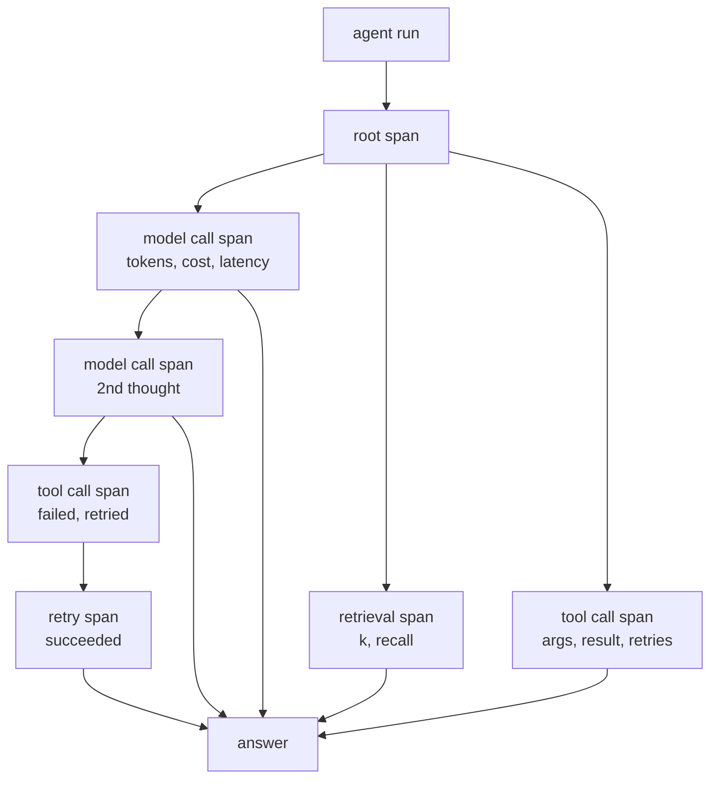
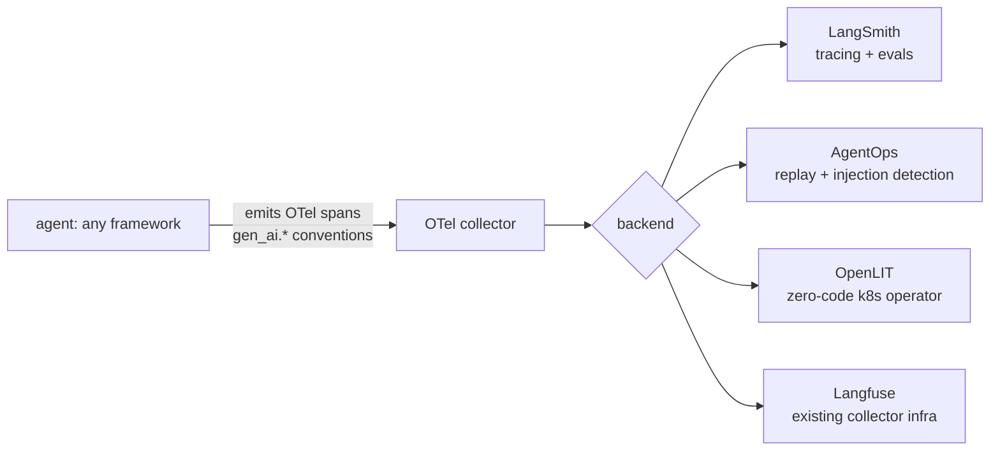
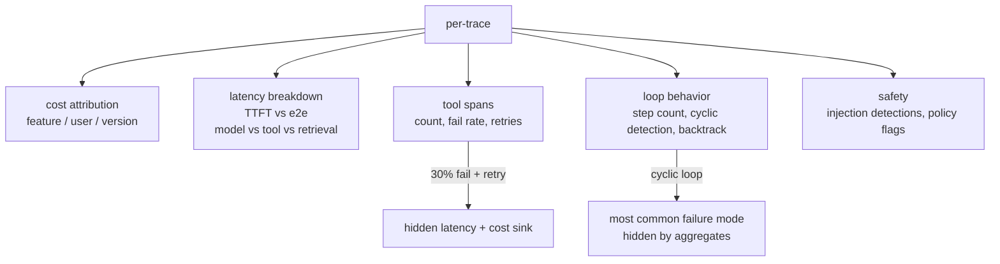
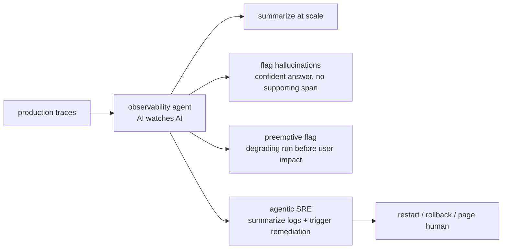

# Chapter 49: Observability and Tracing

> **Lead paragraph.** An agent run is not a single API call — it is a branching sequence of thoughts, tool calls, retrievals, and retries, and the bug you are chasing almost always lives in one of those steps you cannot see. Observability for agents is therefore trace-first: a span tree that captures every step, its inputs and outputs, its cost and latency, so a failing run can be replayed and dissected. The 2025 standardization on OpenTelemetry's GenAI semantic conventions means this no longer locks you to a vendor — LangSmith, AgentOps, OpenLIT, and Langfuse all speak OTel. This chapter covers what to trace (per-step spans, cost attribution, latency breakdown, loop behavior, safety flags), the platform landscape, and the frontier: cognitive observability, where an AI watches the agents to flag hallucinations and failures before users feel them. By the end you will know why an agent in production without trace-level observability is undebuggable, and why cyclic-loop detection is the metric that catches the most common failure mode.

---

## 1. Why Agents Need Trace-First Observability

A classic service returns one response per request; its observability is log-and-metric. An agent returns one answer per request, but that answer is the product of a *trace* — a tree of spans (a model call, a tool call, a retrieval, each possibly retried) whose shape varies per run. A metric like "average latency" hides whether the latency is in the model, a slow tool, or a retrieval; only the span tree shows it. Trace-first observability is therefore not a luxury for agents but the unit of debugging: when a run is wrong, you replay the trace and find the span that went sideways.



<figcaption>Figure 49.1 — A trace is a span tree. An agent run decomposes into spans — model calls (with token counts and cost), retrievals (k and recall), and tool calls (arguments, results, retries). The shape varies per run, so aggregate metrics hide where latency and errors live; only the span tree shows which span went wrong. This is why agent observability is trace-first.</figcaption>

The consequence: an agent in production without trace-level observability is undebuggable. You will see that answers are sometimes wrong or slow, but you will not see *which step* caused it, and without that you cannot fix it.

---

## 2. OpenTelemetry and the GenAI Semantic Conventions

The standardization that ended vendor lock-in for agent tracing is **OpenTelemetry's GenAI semantic conventions** (2025). These define a common vocabulary for span attributes — `gen_ai.system` (which provider), `gen_ai.usage.prompt_tokens` / `gen_ai.usage.completion_tokens` (token counts), `gen_ai.request.model` — so a span emitted by a LangGraph agent means the same thing to any OTel-compatible backend as one emitted by a CrewAI agent. The win is vendor-neutral instrumentation: you instrument once, and any OTel backend (Langfuse, a generic collector) ingests it.

The platform layer has converged on OTel:

- **LangSmith** — framework-agnostic tracing, evals, and Fleet no-code agents. The tracing layer of the LangChain ecosystem, but usable beyond it.
- **AgentOps** — visual tracking with replay, prompt-injection detection, and cost tracking across 400-plus LLMs.
- **OpenLIT** — zero-code instrumentation via a Kubernetes Operator and polyglot sidecars; you do not change your code, the platform injects the spans.
- **Langfuse** — OTel ingestion for teams that already run a collector; drops into existing OTel infrastructure rather than replacing it.



<figcaption>Figure 49.2 — OTel convergence. Any framework emits OpenTelemetry spans with GenAI semantic conventions (gen_ai.system, gen_ai.usage.*_tokens). A collector routes them to any compatible backend — LangSmith (tracing + evals), AgentOps (replay + prompt-injection detection), OpenLIT (zero-code k8s operator), or Langfuse (drops into existing collector infrastructure). Instrument once, ingest anywhere.</figcaption>

The zero-code instrumentation story (OpenLIT's Kubernetes operator, sidecars) matters for adoption: instrumenting every agent by hand is a tax teams skip, and skip means no observability. Platform-layer injection — the operator wraps the agent and emits spans without code changes — is what makes trace-first observability the default rather than an aspiration.

---

## 3. The Metrics That Matter

Within a trace, five metric families carry the signal that debugging and FinOps need:

- **Per-trace cost attribution** — which feature ID, user segment, and agent version spent the tokens. Without this, you cannot tell which feature is expensive (Chapter 50's FinOps foundation).
- **Latency breakdown** — time-to-first-token (TTFT) versus end-to-end, and within end-to-end, model versus tool versus retrieval. The breakdown tells you whether to blame the provider, a slow tool, or the vector store.
- **Tool spans** — invocation counts, failure rates, retry counts. A tool that fails 30% of the time and is always retried is a hidden latency and cost sink.
- **Agent loop behavior** — step count, cyclic-loop detection (the agent repeating the same thought/action sequence), backtracking. Cyclic loops are the most common agent failure mode and the one aggregate metrics hide entirely.
- **Safety** — prompt-injection detections, content-policy flags. Observability is also a security control (Chapter 47's ASI-01/02 surface here).



<figcaption>Figure 49.3 — The five metric families per trace. Cost attribution (feature/user/version), latency breakdown (TTFT vs end-to-end, model vs tool vs retrieval), tool spans (count, failure rate, retries), agent loop behavior (step count, cyclic-loop detection, backtracking), and safety (injection detections, policy flags). Cyclic-loop detection matters most — it is the commonest failure mode and the one aggregate metrics hide entirely.</figcaption>

Cyclic-loop detection deserves emphasis: an agent stuck calling tool A, then B, then A, then B, looks fine on average latency (each call is fast) and fine on step count (it terminates at max steps), but it is failing — it never converged. Only loop-structure monitoring catches it. This is the canonical case where trace structure, not metrics, carries the signal.

---

## 4. Cognitive and Predictive Observability

The frontier is **cognitive observability**: using an AI to monitor the agents. A trace's spans are machine-readable but not human-legible at scale — thousands of traces a day, each a span tree, no human reads them all. An observability agent does: it summarizes traces, flags the ones where behavior looks like hallucination (a confident answer unsupported by the retrieved spans), and surfaces anomalies a human would miss.

Two capabilities define this frontier:

- **Preemptive failure flagging** — detect a degrading run *before* it returns a bad answer to the user, by recognizing mid-trace patterns that precede failure (a retrieval that returned low-relevance results, a tool that retried twice). The flag lets you intervene or fail fast rather than ship a wrong answer.
- **Agentic SRE** — observability agents that not only summarize logs but trigger remediation: restart a wedged agent, roll back a bad deployment, page a human. This is the agent-as-operator pattern — the same agent loop, applied to operating agents.



<figcaption>Figure 49.4 — Cognitive observability: an AI watches the agents. An observability agent summarizes traces at scale, flags hallucinations (a confident answer with no supporting retrieved span), preemptively flags degrading runs before user impact, and — as agentic SRE — triggers remediation (restart a wedged agent, roll back a bad deployment, page a human). The agent loop applied to operating agents.</figcaption>

The risk is the same as any AI-in-the-loop: the observability agent can itself be wrong, flagging false positives (a run flagged as hallucination that was correct) or missing real failures. The defense is that cognitive observability *augments* human SREs, not replaces them — it triages the volume so humans handle the flagged few, rather than asking humans to read the volume raw.

---

## 5. Agentic Code Project: A Trace Collector with Cost Attribution and Loop Detection

This project implements the core of a trace-first observability system: span collection with GenAI-style attributes, per-trace cost attribution, latency breakdown, and cyclic-loop detection. It uses the standard `LLMClient` only to label a trace (the cognitive-observability use), keeping the metrics computed and deterministic.

```python
import os, time, json
from dataclasses import dataclass, field
from collections import defaultdict
import openai


class LLMClient:
    """OpenAI-compatible client; flips to a local Ollama endpoint."""

    def __init__(self, model="gpt-5.5", use_ollama=False):
        self.model = model
        if use_ollama:
            self.client = openai.OpenAI(
                base_url="http://localhost:11434/v1", api_key="ollama")
        else:
            self.client = openai.OpenAI(api_key=os.getenv("OPENAI_API_KEY"))


@dataclass
class Span:
    name: str
    kind: str                 # model | tool | retrieval
    start: float
    end: float = 0.0
    tokens_in: int = 0
    tokens_out: int = 0
    cost: float = 0.0
    args: dict = field(default_factory=dict)
    result: str = ""

    def latency(self):
        return self.end - self.start


class Trace:
    """A span tree for one agent run, with cost + loop analysis."""

    def __init__(self, feature_id, agent_version):
        self.feature_id = feature_id
        self.agent_version = agent_version
        self.spans = []

    def span(self, name, kind, **kw):
        s = Span(name, kind, time.time(), **kw)
        self.spans.append(s)
        return s

    def total_cost(self):
        return sum(s.cost for s in self.spans)

    def latency_breakdown(self):
        by = defaultdict(float)
        for s in self.spans:
            by[s.kind] += s.latency()
        return dict(by)

    def detect_cyclic_loop(self, window=4):
        # look for a repeating tool/thought subsequence of length window/2
        seq = [s.name for s in self.spans if s.kind in ("tool", "model")]
        for i in range(len(seq) - window):
            if seq[i:i + window // 2] == seq[i + window // 2:i + window]:
                return True, seq[i:i + window]
        return False, None


def summarize_trace(trace, llm):
    """Cognitive observability: an AI labels the trace for an SRE."""
    spans = [{"name": s.name, "kind": s.kind, "cost": s.cost,
              "latency": round(s.latency(), 3)} for s in trace.spans]
    cyclic, seq = trace.detect_cyclic_loop()
    prompt = (f"Summarize this agent trace for an SRE in one line. "
              f"Flag hallucination risk if a model span produced a "
              f"confident answer with no supporting tool span. "
              f"Trace: {json.dumps(spans)}. Cyclic loop: {cyclic} {seq}.")
    return llm.complete(prompt, temperature=0.1, max_tokens=80)


if __name__ == "__main__":
    trace = Trace(feature_id="summarizer-v2", agent_version="1.3.0")
    s = trace.span("llm-call", "model", tokens_in=120, tokens_out=40,
                   cost=0.002); s.end = s.start + 0.8
    s = trace.span("retrieve", "retrieval"); s.end = s.start + 0.3
    s = trace.span("search", "tool", args={"q": "x"}); s.end = s.start + 0.2
    s = trace.span("search", "tool", args={"q": "x"}); s.end = s.start + 0.2  # repeat
    print("cost:", trace.total_cost())
    print("latency:", trace.latency_breakdown())
    print("cyclic:", trace.detect_cyclic_loop())
    llm = LLMClient(use_ollama=True)
    print("summary:", summarize_trace(trace, llm))
```

Three capabilities to verify. `total_cost` and `latency_breakdown` give the FinOps and debugging signals — per-trace cost and where time goes (model vs tool vs retrieval). `detect_cyclic_loop` finds the repeating subsequence that aggregate metrics hide — the canonical agent failure mode. `summarize_trace` is the cognitive-observability layer: an AI labels the trace for an SRE, with an explicit instruction to flag hallucination risk (confident answer with no supporting tool span). The metrics stay computed and deterministic; only the human-facing summary uses the LLM, because that is the one step where scale defeats a human reader.

```python
def attribute_cost(trace, segments):
    """Per-trace cost attribution: split cost by feature/user-segment.
    The FinOps foundation (Ch 50) — you must know which features cost most."""
    total = trace.total_cost()
    return {seg: total * frac for seg, frac in segments.items()}
# segments = {"free": 0.2, "pro": 0.5, "enterprise": 0.3}
# attribute_cost(trace, segments) -> cost split by user segment
```

The `attribute_cost` helper is the bridge to Chapter 50's cost management: per-trace cost is only useful when attributed — split by feature, user segment, and agent version — so FinOps can answer "which feature is expensive?" rather than "what is the total bill?".

---

## Summary

- Agents need trace-first observability because a run is a branching span tree (model calls, tool calls, retrievals, retries), not one response. Aggregate metrics hide where latency and errors live; only the span tree shows which step went wrong. An agent in production without trace-level observability is undebuggable.
- OpenTelemetry's GenAI semantic conventions (2025) standardized span attributes (gen_ai.system, gen_ai.usage.*_tokens), enabling vendor-neutral instrumentation. LangSmith, AgentOps, OpenLIT, and Langfuse all speak OTel; zero-code injection via Kubernetes operators makes trace-first the default rather than a manual tax.
- Five metric families per trace: cost attribution (feature/user/version), latency breakdown (TTFT vs end-to-end, model vs tool vs retrieval), tool spans (count, failure rate, retries), agent loop behavior (step count, cyclic-loop detection, backtracking), and safety (injection detections, policy flags). Cyclic-loop detection matters most — the commonest failure mode, and the one aggregate metrics hide entirely.
- Cognitive observability is the frontier: an AI watches the agents — summarizes traces at scale, flags hallucinations (confident answer with no supporting span), preemptively flags degrading runs before user impact, and as agentic SRE triggers remediation. It augments human SREs (triaging volume) rather than replacing them, because the observability agent can itself be wrong.

---

## Further Reading

- [OpenTelemetry GenAI semantic conventions](https://opentelemetry.io/docs/specs/semconv/gen-ai/) — the standardized span attributes enabling vendor-neutral agent tracing.
- [LangSmith](https://www.langchain.com/langsmith) — framework-agnostic tracing, evals, and Fleet no-code agents.
- [AgentOps](https://www.agentops.ai/) — visual tracking, replay, prompt-injection detection, 400+ LLM cost tracking.
- [OpenLIT](https://github.com/openlit/openlit) — zero-code OTel instrumentation via Kubernetes operator and polyglot sidecars.
- [Langfuse](https://langfuse.com/) — OTel ingestion for existing collector infrastructure.

---