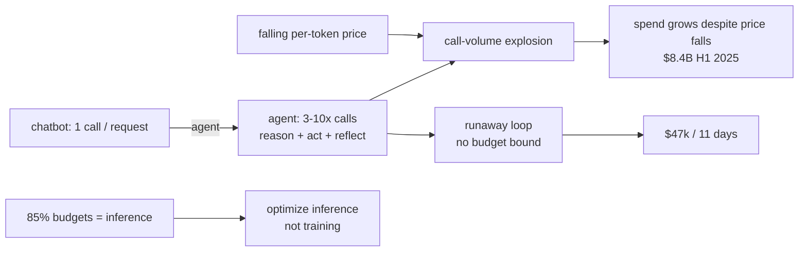
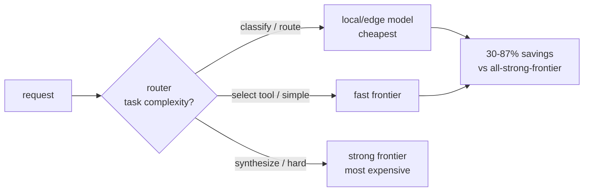
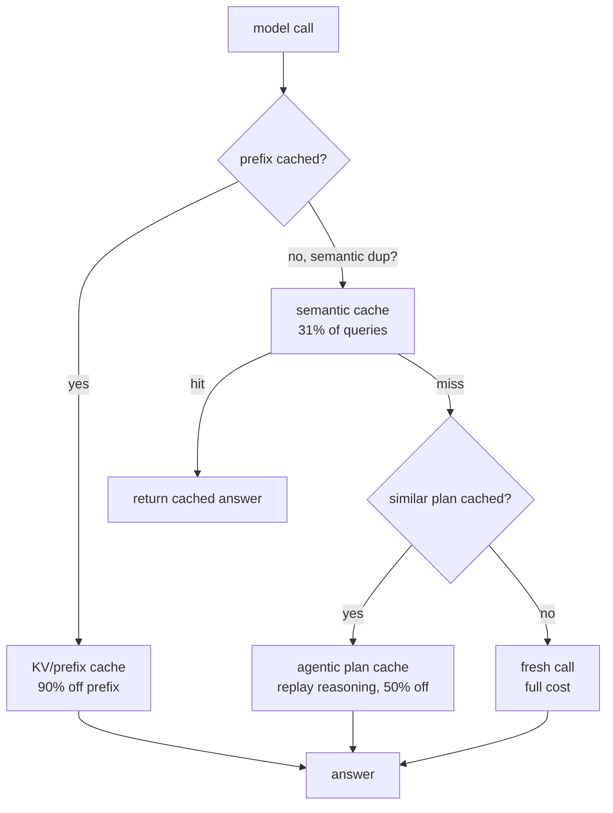
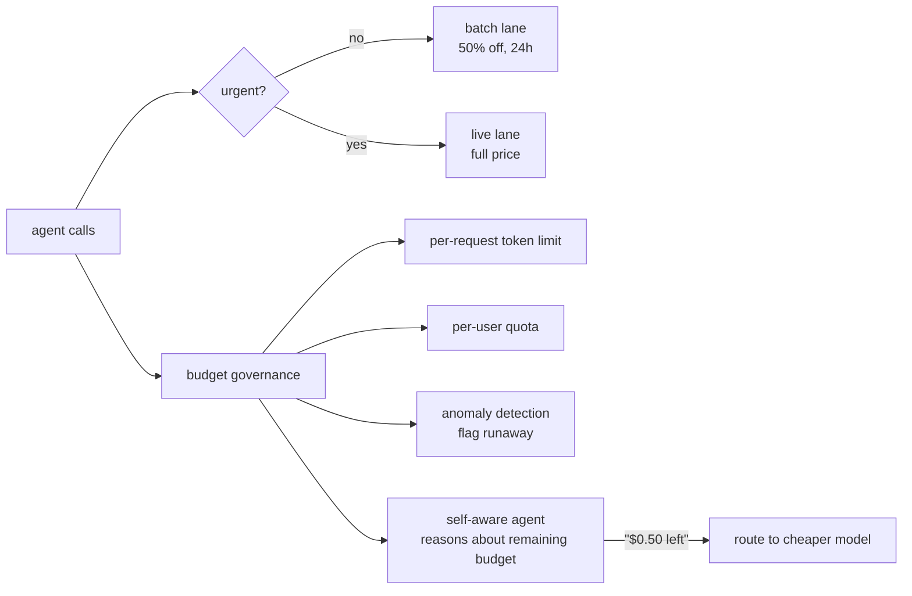

# Chapter 50: Cost Management and Efficiency

> **Lead paragraph.** Enterprise LLM spending hit $8.4 billion by mid-2025, more than doubling in six months even as per-token prices fell — because the savings per token were swamped by the explosion in call volume, and agents make 3–10× more calls than chatbots. The "inference flip" is now complete: 85% of enterprise AI budgets go to inference, not training, so cost optimization is about inference efficiency. This chapter covers the four levers that move that efficiency: intelligent model routing (match task complexity to the cheapest capable model — 30–87% savings), caching (prefix/KV, semantic, agentic plan — up to 90%), batch inference (50% discounts for 24-hour turnaround), and budget governance (per-trace attribution, quotas, self-aware agents). By the end you will know why a runaway agent can ring up $47,000 in 11 days, and why the highest-impact optimization is routing, not prompt-tuning.

---

## 1. The Cost Explosion

The cost story of agents is not that tokens are expensive — they are cheaper every quarter. It is that agents make *many more calls* than chatbots: 3–10× more, because each step of the reasoning-acting loop is a model call, plus tool-selection calls, plus reflection calls. Per-token savings are dwarfed by call-volume growth. Enterprise LLM spending reached $8.4B by mid-2025 (more than doubling in six months), and the inference flip — 85% of enterprise AI budgets now inference rather than training — means the optimization target has moved: it is no longer training efficiency but inference efficiency that determines cost.

The cautionary tale is the documented runaway agent that rang up a $47,000 bill over 11 days — an agent caught in a loop, each iteration a paid call, with no budget bound. This is the failure mode budget governance exists to prevent: an agent without a cost ceiling will, eventually, find the loop that spends unbounded.



<figcaption>Figure 50.1 — The cost explosion. Agents make 3–10× more calls than chatbots (each reasoning/acting/reflecting step is a paid call), so call volume swamps falling per-token prices — enterprise spend hit $8.4B by mid-2025. The inference flip (85% of budgets now inference) means optimization targets inference efficiency. Without a budget bound, a runaway loop can ring up $47,000 in 11 days — the failure mode budget governance prevents.</figcaption>

The four levers in this chapter — routing, caching, batch, governance — attack this from different angles. Routing reduces cost per call (cheaper model where possible); caching avoids calls entirely; batch shifts calls to a cheaper lane; governance bounds the total.

---

## 2. Intelligent Model Routing

The highest-impact optimization is **model routing**: match the task's complexity to the cheapest capable model, rather than sending every call to the strongest (and most expensive) frontier model. A classification step does not need a frontier model; a final synthesis might. Routing tiers by task:

- **Local/edge** for classification and routing decisions.
- **Fast frontier** for tool selection and simple reasoning.
- **Strong frontier** for synthesis and hard reasoning.

The achievable reduction is large — 30–87% — because most calls in an agent run are the cheap steps (classify, select tool) that were nonetheless going to the expensive model. Tools (LiteLLM, Portkey, OpenRouter, RouteLLM) implement this as a router in front of the providers: the router inspects the request and dispatches to the cheapest model that can handle it.



<figcaption>Figure 50.2 — Intelligent model routing. A router inspects each request and dispatches to the cheapest model that can handle it: local/edge for classification, fast frontier for tool selection, strong frontier for synthesis. Most calls in an agent run are the cheap steps that were going to the expensive model — routing them away yields 30–87% savings.</figcaption>

The key is that routing is the highest-impact lever because it applies to *every* call, whereas caching applies only to repeated calls and batch only to non-urgent ones. A 50% routing saving on every call beats a 90% caching saving on the 31% that repeat. Start with routing.

---

## 3. Caching Strategies

Caching avoids calls entirely. Three layers, each catching a different kind of repetition:

- **Prefix / KV caching** — cache the prompt's prefix (system prompt, few-shot examples) so repeated prefixes cost only the new tokens. Anthropic's cached tokens cut prefix cost up to 90%. This is the most reliable cache: same prefix, near-free.
- **Semantic caching** — cache by meaning, not exact string. A query that is a near-duplicate of a previous one (rephrased) returns the cached answer. GPTCache and Redis vector search implement this; ~31% of production queries are near-duplicates, so the hit rate is real. The risk is false positives — a query that is *almost* the same but needs a different answer — so semantic caches need a similarity threshold tight enough to avoid stale answers.
- **Agentic plan caching** (2026) — cache the *reasoning steps*, not just the final answer. When a similar task arrives, replay the cached plan with minor adjustments rather than re-reasoning from scratch. Up to 50% cost reduction. This is the agent-specific cache: it recognizes that an agent's plan for "summarize this quarterly report" is largely reusable for the next quarterly report.



<figcaption>Figure 50.3 — Three caching layers. Prefix/KV caching (90% off repeated prefixes — the most reliable), semantic caching (near-duplicate queries, ~31% of production — risk of false positives), and agentic plan caching (2026 — cache reasoning steps, replay with adjustments, 50% off). Each layer catches a different kind of repetition; they stack.</figcaption>

The Cloudflare Code Mode example shows the extreme: collapsing 2,500-plus endpoints into 2 tools reduced a 1.17-million-token context to ~1,000 — not caching per se, but the same principle (don't send what you can avoid sending). Caching's enemy is staleness; a cached answer that should have changed is a silent correctness bug, so caches need invalidation tied to the underlying data's freshness.

---

## 4. Batch Inference and Budget Governance

**Batch inference** shifts non-urgent calls to a cheaper lane: OpenAI's Batch API and Anthropic's Message Batches offer ~50% discounts for 24-hour turnaround. Any call that does not need to be synchronous (background summarization, offline evaluation, bulk processing) belongs in batch. The trade is latency for cost — if the user is waiting, you pay full price; if they are not, you halve it.

**Budget governance** is the control that prevents the runaway agent. Four mechanisms:

- **Per-request token limits** — cap tokens per call so a single call cannot run away.
- **Per-user quotas** — cap spend per user, so one user's heavy usage cannot sink the budget.
- **Anomaly detection** — flag unusual spending patterns (the $47k loop would have tripped this).
- **Self-aware agents** — the agent reasons about its remaining budget: "I have $0.50 left; use the cheaper model for this subtask." This makes the budget a first-class input to the agent's own decisions.



<figcaption>Figure 50.4 — Batch inference and budget governance. Non-urgent calls go to the batch lane (50% off for 24h turnaround); urgent ones stay live. Governance bounds the total: per-request token limits, per-user quotas, anomaly detection (the runaway loop trips this), and self-aware agents that treat remaining budget as an input — routing to a cheaper model when budget is low.</figcaption>

**LLM FinOps** ties it together with the accounting discipline: per-trace cost attribution (Chapter 49's foundation — which feature/user/version spent), provider arbitrage (route to the cheapest capable provider), and the human-equivalent hourly rate (compare agent cost to human cost for the same task, the metric that tells you whether the agent is even worth running). Per-trace attribution is what makes the rest actionable — you cannot optimize a bill you cannot decompose.

---

## 5. Agentic Code Project: A Model Router with Caching and Budget Governance

This project implements the four levers in miniature: a router that dispatches to the cheapest capable model, a prefix cache, a budget guard that blocks calls over a per-request token limit and a remaining-budget ceiling, and a self-aware routing decision that downgrades the model when budget is low. It uses the standard `LLMClient`.

```python
import os, time, json
from dataclasses import dataclass
import openai


class LLMClient:
    """OpenAI-compatible client; flips to a local Ollama endpoint."""

    def __init__(self, model="gpt-5.5", use_ollama=False):
        self.model = model
        if use_ollama:
            self.client = openai.OpenAI(
                base_url="http://localhost:11434/v1", api_key="ollama")
        else:
            self.client = openai.OpenAI(api_key=os.getenv("OPENAI_API_KEY"))


MODEL_TIERS = {  # name -> (cost per 1k tokens, capability tag)
    "edge": (0.0001, "classify"),
    "fast": (0.003, "tool_select"),
    "strong": (0.015, "synthesize"),
}


class PrefixCache:
    """KV/prefix cache: same prefix, near-free."""

    def __init__(self):
        self._store = {}

    def get(self, prompt):
        return self._store.get(prompt)

    def put(self, prompt, answer, cost):
        self._store[prompt] = (answer, cost)


class Router:
    """Route to the cheapest capable model; downgrade when budget low."""

    def __init__(self, llm_by_tier):
        self.llm_by_tier = llm_by_tier
        self.cache = PrefixCache()

    def pick_tier(self, task_kind, budget_left):
        if budget_left < 0.05:          # self-aware: low budget -> downgrade
            return "fast" if task_kind != "classify" else "edge"
        return {"classify": "edge",
                "tool_select": "fast",
                "synthesize": "strong"}.get(task_kind, "fast")

    def call(self, prompt, task_kind, budget):
        cached = self.cache.get(prompt)
        if cached:
            return cached[0], cached[1]    # near-free prefix/semantic hit
        tier = self.pick_tier(task_kind, budget.remaining())
        llm = self.llm_by_tier[tier]
        resp = llm.client.chat.completions.create(
            model=llm.model,
            messages=[{"role": "user", "content": prompt}])
        answer = resp.choices[0].message.content
        cost = len(prompt) // 4 * MODEL_TIERS[tier][0]   # rough token cost
        self.cache.put(prompt, answer, cost)
        return answer, cost


class Budget:
    """Per-request token limit + remaining-budget ceiling."""

    def __init__(self, total, max_per_call=0.20):
        self.total = total
        self.spent = 0.0
        self.max_per_call = max_per_call

    def remaining(self):
        return self.total - self.spent

    def guard(self, estimated_cost):
        if estimated_cost > self.max_per_call:
            raise ValueError(f"call exceeds per-request limit: {estimated_cost}")
        if estimated_cost > self.remaining():
            raise ValueError("budget exhausted")
        self.spent += estimated_cost


def main():
    edge = LLMClient(model="gpt-5.5", use_ollama=True)
    fast = LLMClient(model="claude-sonnet-4.7", use_ollama=True)
    strong = LLMClient(model="kimi-k2.6", use_ollama=True)
    router = Router({"edge": edge, "fast": fast, "strong": strong})
    budget = Budget(total=1.00)
    # classify -> edge, synthesize -> strong, low-budget -> downgrade
    ans, cost = router.call("Is this a refund request? 'I want my money back'",
                            "classify", budget)
    budget.guard(cost)
    print("classify:", ans[:40], f"cost=${cost:.4f} tier=edge")
    ans2, cost2 = router.call("Summarize the quarterly report.", "synthesize",
                              budget)
    budget.guard(cost2)
    print("synthesize:", ans2[:40], f"cost=${cost2:.4f}")


if __name__ == "__main__":
    main()
```

Three controls to verify. The `Router.pick_tier` downgrades the model when `budget_left < 0.05` — the self-aware agent treating remaining budget as a routing input (a synthesis task goes to `fast` instead of `strong` when budget is low). The `PrefixCache` returns cached answers near-free on a hit (the second identical call costs nothing). The `Budget.guard` raises on two conditions — a per-request limit (one call cannot run away) and remaining-budget exhaustion (the total cannot be exceeded) — the mechanism that prevents the $47k loop: a runaway agent would exhaust the budget and trip the guard, not spend unbounded.

```python
def human_equivalent_rate(agent_cost, task_seconds, human_hourly=40.0):
    """Compare agent cost to human cost for the same task — the FinOps
    metric that tells you whether the agent is worth running at all."""
    human_cost = human_hourly * (task_seconds / 3600.0)
    return {"agent": agent_cost, "human": human_cost,
            "agent_cheaper": agent_cost < human_cost}
# If a $0.20 agent call replaces a $2 human minute, the agent is worth running.
```

The `human_equivalent_rate` helper is the FinOps sanity check the chapter keeps returning to: cost optimization is not an end in itself. An agent that costs $0.20 to do what a human would do for $2 is worth running; one that costs $3 to replace $2 of human work is not, however well-routed. The human-equivalent rate is the metric that grounds the whole exercise — cheaper is only better if it is also cheaper than the alternative.

---

## Summary

- The cost explosion is call-volume-driven, not price-driven: agents make 3–10× more calls than chatbots (each reasoning/acting/reflecting step is paid), so falling per-token prices are swamped by volume — enterprise spend hit $8.4B by mid-2025. The inference flip (85% of budgets now inference) means optimization targets inference efficiency. A runaway agent without a budget bound rang up $47,000 in 11 days — the failure mode governance prevents.
- Intelligent model routing is the highest-impact lever (30–87% savings): match task complexity to the cheapest capable model — local/edge for classification, fast frontier for tool selection, strong frontier for synthesis. It beats caching and batch because it applies to every call, not just repeated or non-urgent ones. Start with routing. Tools: LiteLLM, Portkey, OpenRouter, RouteLLM.
- Caching avoids calls: prefix/KV (90% off repeated prefixes — most reliable), semantic (near-duplicate queries, ~31% of production — risk of false positives), and agentic plan caching (2026 — cache reasoning steps, replay with adjustments, 50% off). They stack. The enemy is staleness — a cached answer that should have changed is a silent correctness bug.
- Batch inference shifts non-urgent calls to a 50%-off lane (24h turnaround). Budget governance bounds the total: per-request token limits, per-user quotas, anomaly detection, and self-aware agents that route to cheaper models when budget is low. LLM FinOps ties it together via per-trace cost attribution, provider arbitrage, and the human-equivalent hourly rate — the metric that says whether the agent is worth running at all.

---

## Further Reading

- [LiteLLM](https://github.com/BerriAI/litellm) — model routing across providers.
- [RouteLLM](https://github.com/lm-sys/RouteLLM) — open model-routing research and reference.
- [OpenAI Batch API](https://platform.openai.com/docs/guides/batch) — 50% discounts for 24-hour turnaround.
- [Anthropic Prompt Caching](https://www.anthropic.com/) — prefix/KV caching for up to 90% prefix-cost reduction.
- [Menlo Ventures: State of Generative AI in the Enterprise 2025](https://menlovc.com/perspective/2025-the-state-of-generative-ai-in-the-enterprise/) — the $8.4B enterprise-spend and inference-flip data.

---