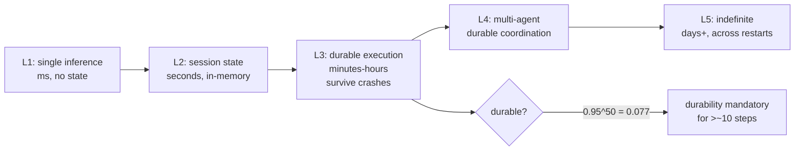
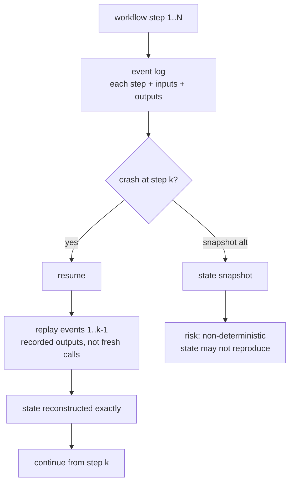
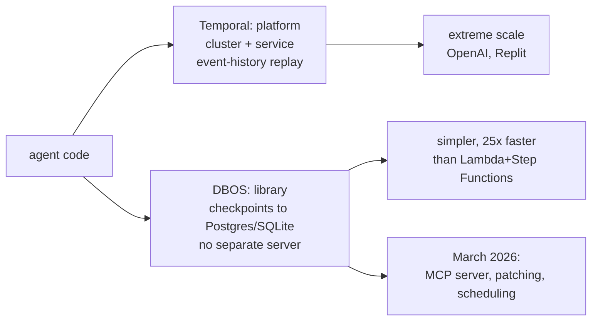
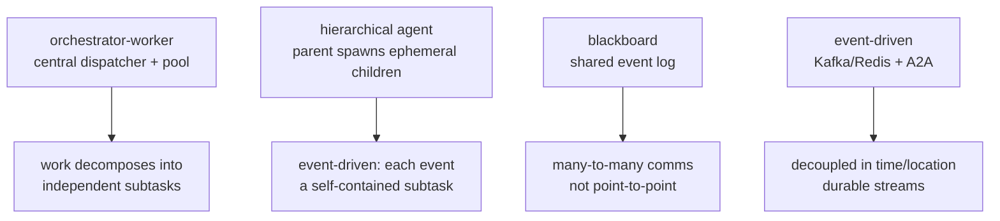
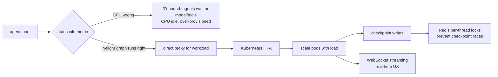

# Chapter 51: Distributed and Durable Execution

> **Lead paragraph.** An agent that is 95% reliable per step is only 8% reliable across a 50-step workflow — because $0.95^{50} \approx 0.077$, and a single failed step sinks the whole run. This is the durability imperative: any agent that runs more than a handful of steps needs to survive crashes, resume from the exact point of failure, and run across multiple machines. This chapter covers the complexity levels of agent execution (L1 single inference through L5 indefinite multi-agent), Temporal's event-history replay as the production answer (the OpenAI Agents SDK + Temporal integration went GA March 2026), DBOS as the simpler library-based alternative, the async production patterns (orchestrator-worker, hierarchical, blackboard, event-driven), and how to scale agents on Kubernetes. By the end you will know why checkpointing state is weaker than replaying an event log, and why CPU is the wrong autoscaling metric for LLM agents.

---

## 1. The Durability Imperative

The math is unforgiving: per-step reliability compounds multiplicatively across a workflow. At 95% per step, a 50-step workflow succeeds only $0.95^{50} \approx 0.077$ of the time — under 8%. You cannot ship an agent that fails 92% of the time, so for any workflow longer than a handful of steps, durability is not optional. "Durable" means the run survives process crashes, machine failures, and network partitions, resuming from the exact step where it stopped rather than restarting from scratch.

Agent execution sorts into complexity levels by how long a run lasts and what state it must hold:

- **L1 — single inference (milliseconds):** one model call, no state to persist. A chatbot turn.
- **L2 — session state (seconds):** a short conversation, state in memory. A multi-turn chat.
- **L3 — durable execution (minutes–hours):** a workflow that must survive crashes and resume. This is where durability becomes mandatory.
- **L4 — multi-agent (minutes–hours):** multiple agents coordinating, each durable. Chapter 31's hierarchies at production scale.
- **L5 — indefinite (days+):** long-running agents that persist across restarts and sessions. Chapter 41's long-term memory agents.



<figcaption>Figure 51.1 — Execution complexity levels. L1 (single inference, ms) through L5 (indefinite, days+). Durability becomes mandatory at L3: at 95% per-step reliability, a 50-step workflow succeeds only 0.95^50 ≈ 7.7% of the time, so any workflow longer than ~10 steps must survive crashes and resume. L4 (multi-agent) and L5 (indefinite) build durable coordination and cross-restart persistence on top.</figcaption>

The threshold is roughly ten steps: below it, in-memory state may suffice; above it, the compounding-failure math makes durability mandatory. Most useful agents are above it.

---

## 2. Temporal: Event-History Replay

**Temporal** is the production-grade durable execution platform — a $5B valuation and 380% year-over-year revenue growth reflect that the agent boom made durability a mass need. Its key innovation is **event-history replay**: instead of checkpointing a snapshot of state (which can be inconsistent or stale), Temporal records the *event log* — every step, its inputs, its deterministic outputs — and replays it to reconstruct state. After a crash, the workflow resumes from the exact step that failed, replaying the log to rebuild context, then continuing.

The advantage of replay over snapshotting is correctness. A snapshot captures state at one instant, but if that state depended on a non-deterministic call (a model's output, a timestamp), the snapshot may be irreproducible and the resumed run may diverge. Replay avoids this by treating non-deterministic steps as events with recorded outputs — the replay replays the *recorded* output, not a fresh call, so the reconstructed state is exactly the pre-crash state.



<figcaption>Figure 51.2 — Temporal's event-history replay. Each workflow step appends an event (step, inputs, outputs) to an event log. On crash, resume replays events 1..k-1 using their recorded outputs — not fresh calls — so state is reconstructed exactly, then continues from step k. Replay beats snapshotting because a snapshot of non-deterministic state (a model output, a timestamp) may not reproduce; replay of recorded outputs always does.</figcaption>

The **OpenAI Agents SDK + Temporal integration** went generally available March 23, 2026 — agents built on the OpenAI SDK run as durable Temporal workflows, gaining crash recovery, state management, and the ability to fork a running workflow. Temporal's production users for this pattern include OpenAI (Codex), Replit, Lovable, Abridge, and Hebbia — agent-heavy products where a crashed run is a crashed user experience.

---

## 3. DBOS: The Simpler Alternative

**DBOS (Database Operating System)** is the lighter alternative: an open-source library that checkpoints workflow state directly to Postgres or SQLite, with no separate server to run. Where Temporal is a platform (a cluster, a service), DBOS is a library you import — checkpointing becomes a function decorator, and the database is the durability substrate.

DBOS reports 25× faster workflow execution than AWS Lambda + Step Functions, because it avoids the per-step Lambda cold-start and service-hop latency. Its March 2026 additions — an MCP server (Chapter 46), workflow patching (in-place fixes to running workflows), and dynamic scheduling — extend it toward the same agent-infrastructure niche Temporal occupies, at the cost of less battle-testing at extreme scale.



<figcaption>Figure 51.3 — Temporal versus DBOS. Temporal is a platform (cluster + service, event-history replay, battle-tested at extreme scale by OpenAI and Replit). DBOS is a library (checkpoints to Postgres/SQLite, no separate server, 25× faster than Lambda+Step Functions, simpler). Pick Temporal for scale and the replay model; DBOS for simplicity when a database you already run can be the durability substrate.</figcaption>

The choice is scale versus simplicity. Temporal for the team running thousands of concurrent durable workflows who need the replay model and a battle-tested cluster; DBOS for the team that has Postgres already and wants durability without standing up a new service.

---

## 4. Async Production Patterns

Durable execution makes individual agents crash-proof; async patterns make *systems* of agents coordinate. Four patterns dominate production:

- **Orchestrator-Worker** — a central dispatcher assigns tasks to a worker pool. The orchestrator is the control point (and the durability boundary); workers are ephemeral and replaceable. Fits when work decomposes into independent subtasks.
- **Hierarchical Agent** — a parent spawns ephemeral children per event (Chapter 31's manager-worker at runtime). Children handle one event and exit; the parent persists. Fits event-driven work where each event is a self-contained subtask.
- **Blackboard** — a shared event log as collaborative memory. Agents read and write to a common log rather than messaging each other directly; any agent can consume any other's output. Fits when the communication pattern is not point-to-point but many-to-many.
- **Event-driven** — Kafka or Redis Streams carry inter-agent messages, with A2A (Chapter 46) as the protocol. Fits when agents are decoupled in time and location, communicating via durable streams.



<figcaption>Figure 51.4 — Four async production patterns. Orchestrator-worker (central dispatcher + worker pool — independent subtasks), hierarchical agent (parent spawns ephemeral children per event — self-contained subtasks), blackboard (shared event log — many-to-many communication), and event-driven (Kafka/Redis Streams + A2A — agents decoupled in time and location). Each fits a different coordination shape.</figcaption>

The patterns compose: an event-driven system may use a blackboard for shared state with hierarchical agents consuming events from Kafka. The choice is driven by the communication shape — point-to-point delegation (orchestrator-worker), event-driven spawning (hierarchical), shared memory (blackboard), or decoupled streams (event-driven).

---

## 5. Scaling Agents

Scaling agents is not scaling a web service. The autoscaling metric that works for request-response (CPU) is wrong for agents, because LLM agents are I/O-bound — they spend their time *waiting* for model and tool calls, not burning CPU. Scaling on CPU leaves you over-provisioned when agents are waiting and under-provisioned when many are in flight. The right metric is **in-flight graph runs** — a direct proxy for agent workload. Kubernetes HPA (Horizontal Pod Autoscaler) configured on in-flight runs scales with actual agent load, not CPU utilization.

Two operational details matter at scale:

- **Redis per-thread locks** for checkpoint race conditions. When multiple workers can checkpoint the same agent's state, a race condition corrupts the checkpoint. Per-thread locks serialize checkpoint writes per agent, preventing the corruption.
- **WebSocket streaming** for real-time UX. A durable agent that takes minutes must stream its thoughts and actions to the user as they happen, not deliver a result at the end. WebSocket streaming (Chapter 49's AG-UI events) is what makes a long-running agent feel responsive.



<figcaption>Figure 51.5 — Scaling agents. Autoscale on in-flight graph runs (a direct workload proxy), not CPU — agents are I/O-bound (waiting on model/tools), so CPU leaves you over-provisioned when idle and under-provisioned when busy. Redis per-thread locks prevent checkpoint race conditions when multiple workers checkpoint the same agent. WebSocket streaming makes a minutes-long durable agent feel responsive.</figcaption>

Tiered LLM routing (Chapter 50) closes the loop: as you scale, route to cheaper models where possible so the scaled-out fleet is also cost-efficient. Scaling and cost management are not separate concerns — the fleet you scale is the fleet you pay for.

---

## 6. Agentic Code Project: A Durable Workflow with Checkpoint/Resume

This project implements durability in miniature: a workflow that checkpoints each step's result and can resume from the last checkpoint after a simulated crash. It models Temporal's replay idea in a library-sized form — the checkpoint is the event (step + inputs + recorded output), and resume replays recorded outputs rather than re-running them. It uses the standard `LLMClient` for the steps.

```python
import os, json, time
from dataclasses import dataclass, field, asdict
import openai


class LLMClient:
    """OpenAI-compatible client; flips to a local Ollama endpoint."""

    def __init__(self, model="gpt-5.5", use_ollama=False):
        self.model = model
        if use_ollama:
            self.client = openai.OpenAI(
                base_url="http://localhost:11434/v1", api_key="ollama")
        else:
            self.client = openai.OpenAI(api_key=os.getenv("OPENAI_API_KEY"))

    def complete(self, prompt, temperature=0.3, max_tokens=200):
        resp = self.client.chat.completions.create(
            model=self.model,
            messages=[{"role": "user", "content": prompt}],
            temperature=temperature, max_tokens=max_tokens)
        return resp.choices[0].message.content.strip()


@dataclass
class Event:
    """One step of the event log — Temporal-style: input + recorded output."""
    step: int
    name: str
    input: str
    output: str            # recorded, not recomputed on replay


class DurableWorkflow:
    """Checkpoint each step; resume replays recorded outputs."""

    def __init__(self, llm, log_path="workflow_log.json"):
        self.llm = llm
        self.log_path = log_path
        self.events = self._load()

    def _load(self):
        try:
            with open(self.log_path) as f:
                return [Event(**e) for e in json.load(f)]
        except FileNotFoundError:
            return []

    def _persist(self):
        with open(self.log_path, "w") as f:
            json.dump([asdict(e) for e in self.events], f, indent=2)

    def run(self, steps):
        """Run steps in order; skip already-completed ones on resume."""
        results = {e.step: e.output for e in self.events}   # replay recorded
        for i, (name, prompt) in enumerate(steps):
            if i in results:            # already done — replay, don't re-call
                continue
            output = self.llm.complete(prompt)   # fresh call only if needed
            self.events.append(Event(i, name, prompt, output))
            self._persist()
            results[i] = output
            if output == "CRASH":      # simulate a crash mid-run
                raise RuntimeError(f"crashed at step {i}")
        return results


def main():
    llm = LLMClient(use_ollama=True)
    wf = DurableWorkflow(llm)
    steps = [
        ("extract", "Extract the key claim from: 'Sales grew 20%.'"),
        ("classify", "Is this financial? Answer yes or no."),
        ("summarize", "Summarize in one sentence."),
    ]
    try:
        results = wf.run(steps)
        print("done:", {k: v[:40] for k, v in results.items()})
    except RuntimeError as e:
        print(e, "- re-run to resume from checkpoint")


if __name__ == "__main__":
    main()
```

Two properties to verify. On resume, `run` loads the event log and skips steps whose outputs are already recorded — `results = {e.step: e.output for e in self.events}` is the replay, using recorded outputs rather than re-calling the model, exactly Temporal's model. A crash mid-run (the `CRASH` sentinel) leaves a partial log; re-running resumes from the last persisted step, not the start. The `_persist` after each step makes the checkpoint granular at step boundaries — the unit of durability is the step, matching the reliability math that motivated it.

```python
import math
def workflow_success(per_step, n_steps):
    """The durability math: compounding per-step reliability.
    Shows why durability is mandatory past ~10 steps."""
    return per_step ** n_steps
# workflow_success(0.95, 50) -> 0.0769  — 50 steps at 95% succeeds <8%
# workflow_success(0.999, 50) -> 0.951   — durable (99.9%/step) succeeds 95%
```

The `workflow_success` helper is the chapter's opening math made executable: 50 steps at 95% succeeds under 8%; at 99.9% (what durability buys — a crashed step resumes rather than fails) it succeeds 95%. The whole point of durable execution is converting per-step crash failures into resumable interruptions, raising the effective per-step reliability and rescuing the compounding product.

---

## Summary

- The durability imperative is compounding-failure math: at 95% per-step reliability, a 50-step workflow succeeds only 0.95^50 ≈ 7.7% of the time. Durability — surviving crashes and resuming from the exact point of failure — becomes mandatory past ~10 steps. Complexity levels run L1 (single inference, ms) through L5 (indefinite, days+).
- Temporal's event-history replay is the production answer: record each step as an event (inputs + outputs), and on crash replay the recorded outputs to reconstruct state exactly, then continue. Replay beats snapshotting because a snapshot of non-deterministic state (model output, timestamp) may not reproduce; replay of recorded outputs always does. The OpenAI Agents SDK + Temporal integration went GA March 23, 2026; used by OpenAI (Codex), Replit, Lovable.
- DBOS is the simpler alternative: an open-source library checkpointing to Postgres/SQLite with no separate server, 25× faster than Lambda + Step Functions. Pick Temporal for scale and the replay model; DBOS for simplicity when a database you run can be the durability substrate.
- Async production patterns: orchestrator-worker (central dispatcher + pool — independent subtasks), hierarchical agent (parent spawns ephemeral children — self-contained subtasks), blackboard (shared event log — many-to-many), event-driven (Kafka/Redis + A2A — decoupled in time/location). Scale on in-flight graph runs, not CPU (agents are I/O-bound); Redis per-thread locks prevent checkpoint races; WebSocket streaming makes long runs feel responsive.

---

## Further Reading

- [Temporal](https://temporal.io/) — durable execution via event-history replay.
- [OpenAI Agents SDK + Temporal (GA March 2026)](https://temporal.io/blog/announcing-openai-agents-sdk-integration) — durable agents as Temporal workflows.
- [DBOS](https://dbos.dev/) — library-based durable execution checkpointing to Postgres/SQLite.
- [Temporal AI Cookbook: Durable Agent with Tools](https://docs.temporal.io/ai-cookbook/openai-agents-sdk-python) — reference patterns for durable tool-using agents.

---