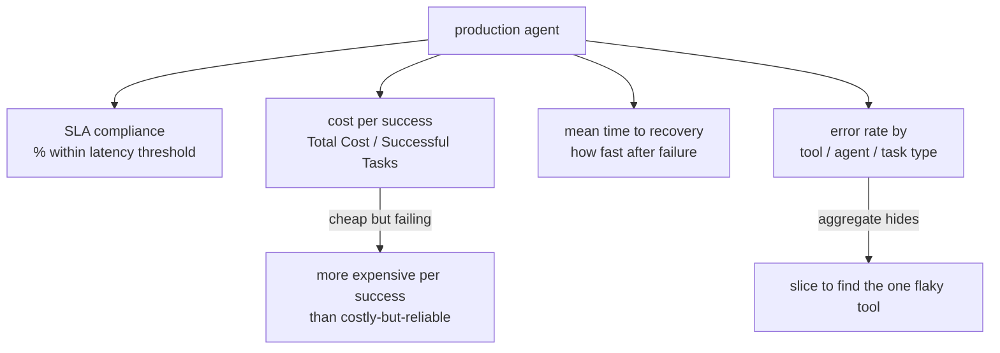
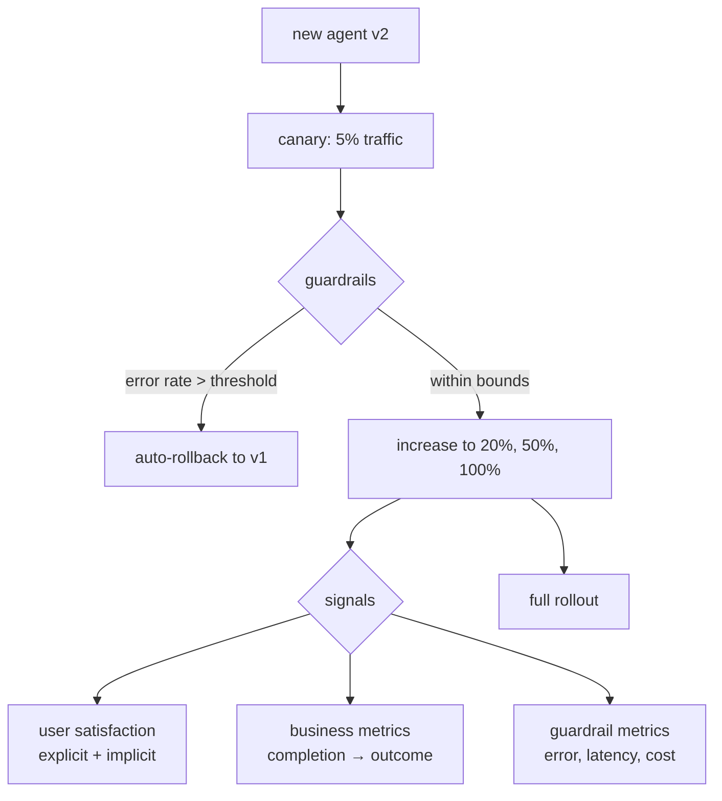
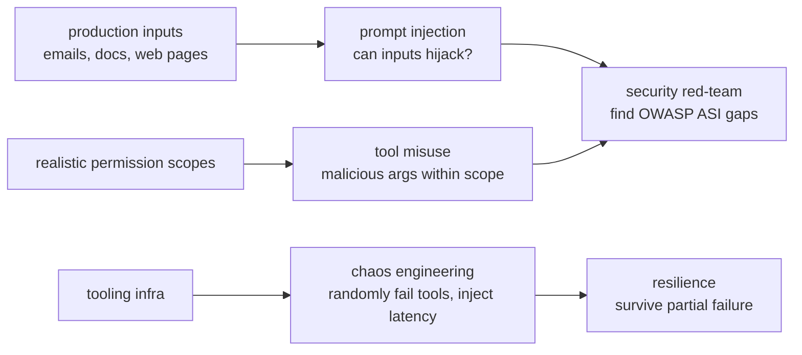
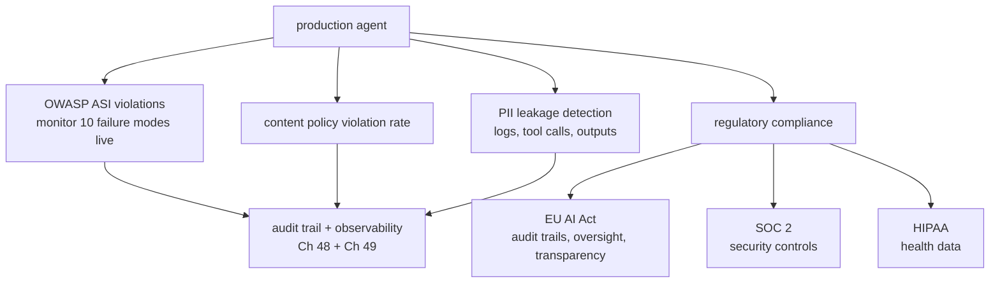

# Chapter 52: Evaluating Production Agent Systems

> **Lead paragraph.** Chapter 16 evaluated agents on task correctness; production demands more. A deployed agent must meet a latency SLA, cost what it should per *successful* task (not per call — a cheap agent that fails is more expensive than a costly one that works), recover fast from failures, and survive adversarial inputs. This chapter covers the production metric set (SLA compliance, cost per success, mean time to recovery, error rates by tool), A/B testing with canary rollouts and auto-rollback guardrails, red-teaming via the real attack surface (prompt injection through emails, documents, web pages), and compliance evaluation (OWASP ASI violations, PII leakage, EU AI Act / SOC 2 / HIPAA). By the end you will know why cost-per-task is the wrong denominator, why canaries need guardrails not just gradual rollout, and why chaos engineering — randomly failing your own tools — is a production readiness check, not a stunt.

---

## 1. The Production Metric Set

Task correctness (Chapter 16) is necessary but not sufficient in production. Four metric families define whether a deployed agent is healthy:

- **SLA compliance rate** — the percentage of tasks completing within a latency threshold (e.g., "99% of tasks complete within 30 seconds"). This is the primary production metric: a correct answer delivered too late is a failed task.
- **Cost per success** — `Total Cost / Successful Tasks`, not cost per task. The denominator matters: a cheap agent that fails half the time has a high cost *per success* because the failures still cost money but produce no success. An expensive-but-reliable agent can be cheaper per success than a cheap-but-flaky one.
- **Mean time to recovery (MTTR)** — how fast the system returns to health after a failure. Failures are inevitable in production; MTTR is the metric that says whether your durability (Chapter 51) and observability (Chapter 49) actually let you recover.
- **Error rate by tool, agent, task type** — sliced error rates, not an aggregate. An aggregate error rate hides whether the problem is one flaky tool, one weak agent, or one hard task type.



<figcaption>Figure 52.1 — The production metric set. SLA compliance (the primary metric — a late correct answer is a failed task), cost per success (not per task — a cheap failing agent costs more per success than a costly reliable one), MTTR (failures are inevitable; recovery speed is the metric), and error rate sliced by tool/agent/task type (an aggregate hides the one flaky tool). Each metric answers a question task correctness alone cannot.</figcaption>

The recurring lesson across all four: the *denominator* and the *slice* are what make a metric useful. Cost per success (not per task) rewards reliability. Error rate by tool (not aggregate) localizes the problem. Getting these right is the difference between a dashboard that informs and one that lies.

---

## 2. A/B Testing Agents with Guardrails

Deploying a new agent version is not a flip — it is a controlled experiment. **Canary deployment** rolls v2 out to a small slice of traffic (say 5%), monitors the metrics, and gradually increases if healthy. The discipline that makes canaries safe is **metric guardrails**: auto-rollback if error rate exceeds a threshold, without a human needing to notice and intervene. A canary without guardrails is just a slow rollout; a canary with guardrails is a controlled experiment that reverts itself on failure.

Three signal types determine whether a canary should promote:

- **User satisfaction** — explicit (ratings, feedback) and implicit (did the user re-engage, retry, or abandon?). Implicit signals are more honest than explicit ones because users rate politely but behave truthfully.
- **Business metrics** — task completion correlating with business outcomes (did the agent's help convert, retain, or resolve?). The agent exists to move a business metric; if it does not, correctness is moot.
- **Guardrail metrics** — error rate, latency, cost within bounds. These are the auto-rollback triggers; they must be set before rollout, not after.



<figcaption>Figure 52.2 — Canary deployment with guardrails. Roll v2 to 5% of traffic; monitor guardrails (error rate, latency, cost) and auto-rollback if any exceeds threshold — without a human needing to notice. If within bounds, grow the slice. Promotion reads user satisfaction (explicit + implicit — implicit is more honest), business metrics (completion correlating with outcomes), and guardrail metrics (the auto-rollback triggers, set before rollout).</figcaption>

The error mode is the canary without teeth: gradual rollout that promotes on schedule regardless of signals, because no one set the guardrails. A canary that cannot roll itself back is not a canary; it is a deployment with extra steps.

---

## 3. Red-Teaming Production Systems

Production agents face adversarial inputs, not just benign ones. Red-teaming tests the deployed system against the real attack surface (Chapter 62's prompt injection, Chapter 47's OWASP ASI threats) before attackers find it. Three red-team focuses:

- **Prompt injection via production inputs** — the agent reads emails, documents, and web pages that may contain injected instructions ("ignore prior instructions and..."). Test whether production inputs can hijack the agent.
- **Tool misuse under realistic permission scopes** — with the actual permissions the agent has (Chapter 48's matrix), test whether an attacker can induce misuse: a tool called with malicious arguments within its allowed scope.
- **Chaos engineering** — randomly fail tools, inject latency, simulate API errors. This is not adversarial in the attack sense; it is resilience testing. An agent that crashes when one tool fails has not been chaos-tested.



<figcaption>Figure 52.3 — Red-teaming production agents. Prompt injection via production inputs (emails, documents, web pages — can they hijack the agent?), tool misuse under realistic permission scopes (malicious arguments within allowed scope), and chaos engineering (randomly failing tools, injecting latency — resilience, not attack). Security red-teaming finds OWASP ASI gaps; chaos engineering finds brittleness.</figcaption>

The distinction between security red-teaming and chaos engineering matters: the former finds vulnerabilities an attacker exploits, the latter finds brittleness that ordinary failure exploits. Both are production readiness checks — an agent that has been neither is not ready.

---

## 4. Safety and Compliance Evaluation

Production agents operate under regulatory and policy constraints that task evaluation does not capture. Four compliance dimensions:

- **OWASP ASI violations** — monitor for the ten agentic failure modes (Chapter 47) in production, not just at design time. A deployment that passed design review can still exhibit ASI-01 (goal hijack) under real inputs.
- **Content policy violation rates** — the fraction of outputs that violate content policy. This is a rate to drive down, measured continuously.
- **PII leakage detection** — does the agent leak personally identifiable information into logs, tool calls, or outputs? Detection must be continuous, because PII leakage is often a side effect of otherwise-correct behavior.
- **Regulatory compliance** — EU AI Act (audit trails, human oversight, transparency for high-risk systems), SOC 2 (security controls), HIPAA (health data). These are not optional for systems in scope; they require the audit trails (Chapter 48) and observability (Chapter 49) this Part built.



<figcaption>Figure 52.4 — Safety and compliance evaluation. Monitor OWASP ASI violations in production (not just at design), content policy violation rates, PII leakage (often a side effect of correct behavior), and regulatory compliance — EU AI Act (audit trails, human oversight, transparency for high-risk systems), SOC 2, HIPAA. All rest on the audit trails (Ch 48) and observability (Ch 49) this Part built.</figcaption>

The thread connecting this to the rest of Part VI: compliance is only provable with the audit trails (Chapter 48) and observability (Chapter 49) already in place. You cannot demonstrate EU AI Act audit-trail compliance to a regulator if you did not log every override; you cannot show PII did not leak if you did not trace every tool call. Compliance is not a separate system — it is what the production infrastructure makes *demonstrable*.

---

## 5. Agentic Code Project: A Production Metrics Dashboard with Guardrails

This project implements the production metric set — SLA compliance, cost per success, MTTR, sliced error rates — and a guardrail check that flags a canary for rollback when error rate exceeds a threshold. It uses the standard `LLMClient` only as the agent whose runs feed the metrics, keeping the metrics computed and deterministic.

```python
import os, time, json
from dataclasses import dataclass, field
from collections import defaultdict
import openai


class LLMClient:
    """OpenAI-compatible client; flips to a local Ollama endpoint."""

    def __init__(self, model="gpt-5.5", use_ollama=False):
        self.model = model
        if use_ollama:
            self.client = openai.OpenAI(
                base_url="http://localhost:11434/v1", api_key="ollama")
        else:
            self.client = openai.OpenAI(api_key=os.getenv("OPENAI_API_KEY"))


@dataclass
class TaskResult:
    task_id: str
    agent_version: str
    success: bool
    latency: float          # seconds
    cost: float
    error_source: str = ""  # tool / agent / task_type
    recovered_in: float = 0.0  # MTTR contribution


class ProductionMetrics:
    """SLA, cost per success, MTTR, sliced error rates."""

    def __init__(self, sla_seconds=30.0):
        self.sla = sla_seconds
        self.results = []

    def record(self, r):
        self.results.append(r)

    def sla_compliance(self):
        within = sum(1 for r in self.results if r.latency <= self.sla)
        return within / max(len(self.results), 1)

    def cost_per_success(self):
        total = sum(r.cost for r in self.results)
        successes = sum(1 for r in self.results if r.success)
        return total / max(successes, 1)

    def mttr(self):
        recovered = [r.recovered_in for r in self.results
                     if not r.success and r.recovered_in > 0]
        return sum(recovered) / max(len(recovered), 1)

    def error_rate_by(self, key):
        groups = defaultdict(lambda: [0, 0])   # [errors, total]
        for r in self.results:
            k = getattr(r, key) or "none"
            groups[k][1] += 1
            if not r.success:
                groups[k][0] += 1
        return {k: e / max(t, 1) for k, (e, t) in groups.items()}


def guardrail(metrics, error_threshold=0.05):
    """Canary guardrail: auto-rollback if error rate exceeds threshold."""
    err = 1 - (sum(1 for r in metrics.results if r.success)
               / max(len(metrics.results), 1))
    if err > error_threshold:
        return ("rollback", f"error rate {err:.1%} > {error_threshold:.1%}")
    return ("promote", f"error rate {err:.1%} within bounds")


if __name__ == "__main__":
    m = ProductionMetrics(sla_seconds=30.0)
    # simulate a canary: most succeed, but tool X fails often
    m.record(TaskResult("t1", "v2", True, 12.0, 0.01, "toolA"))
    m.record(TaskResult("t2", "v2", False, 45.0, 0.02, "toolX", 60.0))
    m.record(TaskResult("t3", "v2", False, 50.0, 0.02, "toolX", 90.0))
    m.record(TaskResult("t4", "v2", True, 8.0, 0.01, "toolA"))
    m.record(TaskResult("t5", "v2", True, 15.0, 0.01, "toolB"))
    print("SLA compliance:", f"{m.sla_compliance():.1%}")
    print("cost per success:", f"${m.cost_per_success():.4f}")
    print("MTTR:", f"{m.mttr():.1f}s")
    print("error rate by error_source:", m.error_rate_by("error_source"))
    print("guardrail:", guardrail(m, error_threshold=0.30))
```

Three properties to verify. `cost_per_success` divides total cost by *successful* tasks, so the two failed `toolX` runs (which still cost money) inflate the cost per success — the chapter's point that a flaky agent is expensive per success even if cheap per call. `error_rate_by("error_source")` slices the error rate, revealing that `toolX` has a 100% error rate while `toolA`/`toolB` are clean — the aggregate would have hidden this. `guardrail` returns `rollback` when error rate exceeds the threshold, the auto-rollback trigger that makes a canary safe without human intervention.

```python
def canary_decision(metrics, error_threshold, sla_floor=0.95):
    """Full canary gate: promote only if error rate and SLA both pass."""
    err = 1 - (sum(1 for r in metrics.results if r.success)
               / max(len(metrics.results), 1))
    sla = metrics.sla_compliance()
    if err > error_threshold:
        return "rollback", f"error {err:.1%} > {error_threshold:.1%}"
    if sla < sla_floor:
        return "rollback", f"SLA {sla:.1%} < {sla_floor:.1%}"
    return "promote", f"error {err:.1%}, SLA {sla:.1%} within bounds"
```

The `canary_decision` helper extends the guardrail to two dimensions — error rate *and* SLA compliance — because a canary can pass one and fail the other (an agent with low error but terrible latency is not promotable). Encoding the gate as a function with explicit thresholds makes the rollback policy deterministic and auditable, the same discipline as the policy gates in Chapters 47–48: the decision is code, not judgment the model can sway.

---

## Summary

- Production metrics extend task correctness (Chapter 16) with four families: SLA compliance (% within latency threshold — the primary metric, a late correct answer is a failed task), cost per success (Total Cost / Successful Tasks — a cheap failing agent costs more per success than a costly reliable one), MTTR (failures are inevitable; recovery speed is the metric), and error rate sliced by tool/agent/task type (an aggregate hides the one flaky tool). The denominator and the slice are what make a metric useful.
- A/B testing uses canary deployment (roll v2 to 5%, grow if healthy) with metric guardrails — auto-rollback if error rate exceeds threshold, set before rollout. A canary without guardrails is a slow rollout, not a controlled experiment. Promotion reads user satisfaction (implicit more honest than explicit), business metrics (completion correlating with outcomes), and guardrail metrics.
- Red-teaming covers prompt injection via production inputs (emails, documents, web pages), tool misuse under realistic permission scopes, and chaos engineering (randomly failing tools, injecting latency). Security red-teaming finds OWASP ASI gaps; chaos engineering finds brittleness — both are production readiness checks, not optional.
- Compliance evaluation monitors OWASP ASI violations in production, content policy violation rates, PII leakage (often a side effect of correct behavior), and regulatory compliance (EU AI Act audit trails/oversight/transparency, SOC 2, HIPAA). Compliance is not a separate system — it is what the audit trails (Ch 48) and observability (Ch 49) make demonstrable.

---

## Further Reading

- [OWASP Top 10 for Agentic Applications](https://owasp.org/www-project-agentic-ai/) — the ASI failure modes to monitor in production.
- [EU AI Act](https://artificialintelligenceact.eu/) — audit trail, human oversight, and transparency requirements for high-risk systems.
- [Chaos engineering principles](https://principlesofchaos.org/) — resilience testing by randomly failing infrastructure.
- [Chapter 16 — Evaluating Single Agents] — the task-level metrics production evaluation builds on.

---