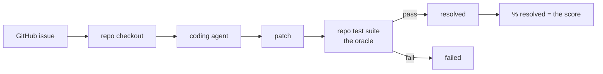
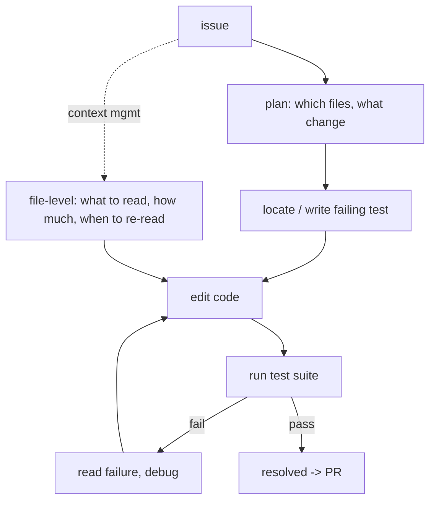
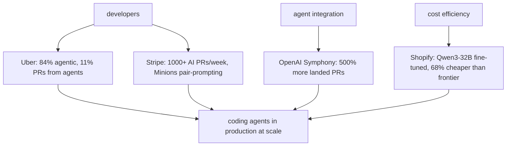

# Chapter 53: Software Engineering Agents

> **Lead paragraph.** Software engineering is the domain where agents first crossed from demo to production, because the feedback loop is free and unambiguous: code either passes its tests or it does not. The defining benchmark is SWE-bench — real GitHub issues that a model must resolve by editing a real repository — and as of mid-2026 the frontier (Claude Fable 5) resolves ~95% of SWE-bench Verified tasks, with Claude Opus 4.8 at 88.6% and Opus 4.7's 87.6% from April 2026 already surpassed. This chapter covers the benchmark and what the scores mean, the agent architecture that works (Plan → Edit → Test → Debug), production deployments at scale (Uber, Stripe, Shopify, OpenAI Symphony), and the project: an end-to-end SWE agent from GitHub issue to pull request. By the end you will understand why test-driven agents win, why file-level context management is the hard part, and why "resolved %" on SWE-bench is a floor on real-world performance, not a ceiling.

---

## 1. SWE-bench: The Defining Benchmark

**SWE-bench** (Jimenez et al., 2024, arXiv 2310.06770) is the benchmark that made coding-agent evaluation honest. Instead of synthetic coding puzzles, it uses real GitHub issues: given an issue and a repository checkout, the agent must produce a patch that resolves the issue, verified by the repo's own test suite. The test suite is the oracle — no human judgment of "is this a good fix," just pass or fail.

The benchmark has split into tiers by difficulty and freshness:

- **SWE-bench Verified** — 500 human-verified tasks (the headline number everyone reports).
- **SWE-bench Pro** — 731 harder tasks (Sonnet 4.5 resolved 45.8% — far below Verified, showing Pro exposes what Verified hides).
- **SWE-bench Live** — monthly fresh issues from real GitHub repos, defeating contamination (agents cannot have memorized the fix).

As of mid-2026, the Verified leaderboard is led by Claude Fable 5 at ~95.0%, with Claude Opus 4.8 at 88.6%; Opus 4.7 reached 87.6% in April 2026. The trajectory — from ~2% at the benchmark's launch to ~95% in under three years — is the steepest capability curve in agents.



<figcaption>Figure 53.1 — SWE-bench. A real GitHub issue plus a repo checkout; the agent produces a patch verified by the repo's own test suite — the oracle, no human judgment. Verified (500 tasks) is the headline; Pro (731 harder) and Live (monthly fresh, defeating contamination) expose what Verified hides. Mid-2026 frontier (Fable 5) resolves ~95% of Verified.</figcaption>

The caveat on the headline number: SWE-bench Verified is a *floor* on real-world performance, not a ceiling. The tasks are human-verified as solvable and have existing tests; real production issues are often ill-specified, lack tests, and span repos. An agent at 95% on Verified is not at 95% on your bug tracker — but it is the best available proxy, and the test-suite oracle is why.

---

## 2. The Coding Agent Architecture

The architecture that works for coding agents is the **Plan → Edit → Test → Debug** loop — the ReAct loop (Chapter 6) specialized to code. The agent plans the fix (which files, what change), edits, runs the tests, and if they fail, reads the failure and debugs. Two disciplines distinguish production coding agents from demos:

- **Test-driven agent development** — the agent writes or locates the failing test *first*, then edits until it passes. This converts "did I fix the issue?" (ambiguous) into "does the test pass?" (binary), giving the agent the same unambiguous feedback SWE-bench's oracle provides.
- **File-level context management** — the hard part. A repository is larger than any context window, so the agent must decide which files to read, how much of each, and when to re-read after edits. Poor context management means the agent edits blind; good management means it sees exactly the relevant code.



<figcaption>Figure 53.2 — The coding agent loop. Plan → (locate/write failing test) → Edit → Run tests → Debug on failure → repeat. Test-driven agent development makes "did I fix it?" binary via the test. File-level context management is the hard part — a repo exceeds any context window, so the agent must choose which files to read, how much, and when to re-read after edits.</figcaption>

CI/CD integration is the production extension: agents open pull requests and *monitor* them through CI, reading failures and pushing fixes without human round-trips. The agent is no longer a coding assistant; it is a contributor with repository access, which is why Chapter 47's sandboxing and Chapter 48's approval gates are non-negotiable for it.

---

## 3. Production Deployments at Scale

By 2025–2026, coding agents are in production at scale across the industry. The adoption numbers are the signal that this domain has crossed from demo to deployment:

- **Uber** — 84% of developers use agentic tools; 11% of pull requests originate from agents.
- **Stripe** — 1,000+ AI-generated PRs per week, with "Minions" pair-prompting at scale.
- **OpenAI Symphony** — a 500% increase in landed PRs after agent integration.
- **Shopify** — fine-tuned Qwen3-32B for coding, 68% cheaper than a frontier closed model, a cost-efficiency win (Chapter 50) that made agent use economical at scale.



<figcaption>Figure 53.3 — Production coding-agent adoption (2025–2026). Uber (84% of developers agentic, 11% of PRs from agents), Stripe (1,000+ AI PRs/week, Minions pair-prompting), OpenAI Symphony (500% more landed PRs), and Shopify (Qwen3-32B fine-tuned, 68% cheaper than frontier). The scale and cost-efficiency wins signal a domain that has crossed from demo to deployment.</figcaption>

The OpenHands project (formerly OpenDevin) is the open-source reference architecture for production coding agents — the implementation others study and fork. Devin 2.0 (Cognition Labs) and the OpenAI Codex CLI are the commercial lines. The convergence across them is the architecture of Section 2 — the loop is settled; the differentiation is context management, tooling, and the model.

---

## 4. Agentic Code Project: A SWE Agent from Issue to PR

This project implements the end-to-end SWE agent in miniature: given a GitHub issue, clone the repo, plan a fix, edit, run the tests, and open a pull request. It uses the Plan → Edit → Test → Debug loop with the standard `LLMClient`, Git and pytest as the tools, and file-level context management that reads only the file the plan targets.

```python
import os, subprocess, json
import openai


class LLMClient:
    """OpenAI-compatible client; flips to a local Ollama endpoint."""

    def __init__(self, model="gpt-5.5", use_ollama=False):
        self.model = model
        if use_ollama:
            self.client = openai.OpenAI(
                base_url="http://localhost:11434/v1", api_key="ollama")
        else:
            self.client = openai.OpenAI(api_key=os.getenv("OPENAI_API_KEY"))

    def complete(self, prompt, temperature=0.2, max_tokens=800):
        resp = self.client.chat.completions.create(
            model=self.model,
            messages=[{"role": "user", "content": prompt}],
            temperature=temperature, max_tokens=max_tokens)
        return resp.choices[0].message.content.strip()


def git(repo, *args):
    return subprocess.run(["git", "-C", repo, *args],
                           capture_output=True, text=True)


def run_tests(repo):
    """The oracle: pytest pass/fail is the agent's binary feedback."""
    r = subprocess.run(["pytest", repo, "-q"],
                       capture_output=True, text=True, timeout=120)
    return r.returncode == 0, r.stdout + r.stderr


def plan_fix(issue, file_contents, llm):
    """Plan: which change to make. Test-driven — propose the failing-test
    expectation alongside the edit."""
    prompt = (f"GitHub issue:\n{issue}\n\nCurrent file:\n{file_contents}\n\n"
              f"Return JSON: {{'edit': <new file contents>, "
              f"'test_expectation': <what the test should assert>}}.")
    raw = llm.complete(prompt, temperature=0.1)
    try:
        return json.loads(raw)
    except json.JSONDecodeError:
        return {"edit": file_contents, "test_expectation": ""}


def swe_agent(issue, repo, target_file, llm, max_steps=4):
    """Plan -> Edit -> Test -> Debug loop, end-to-end."""
    branch = f"agent-fix-{abs(hash(issue)) % 10000}"
    git(repo, "checkout", "-b", branch)
    for step in range(max_steps):
        with open(os.path.join(repo, target_file)) as f:
            contents = f.read()
        plan = plan_fix(issue, contents, llm)
        with open(os.path.join(repo, target_file), "w") as f:
            f.write(plan["edit"])          # edit
        passed, output = run_tests(repo)   # test (the oracle)
        if passed:
            git(repo, "add", "-A")
            git(repo, "commit", "-m", f"fix: {issue[:60]}")
            return {"resolved": True, "branch": branch, "step": step}
        # debug: feed the test failure back into the next plan
        issue = f"{issue}\n\n[Test failure — revise the fix]\n{output[:1500]}"
    return {"resolved": False, "branch": branch, "step": max_steps}


if __name__ == "__main__":
    llm = LLMClient(use_ollama=True)
    # demo on a local repo with a failing test; replace issue/repo/file as needed
    result = swe_agent(
        issue="calculate() returns wrong sign for negative inputs.",
        repo="./demo_repo", target_file="calc.py", llm=llm)
    print(result)
    if result["resolved"]:
        print("open PR:", git("./demo_repo", "push", "origin",
              result["branch"]).stdout or "(push skipped in demo)")
```

Two disciplines to verify. The loop is test-driven: `run_tests` is the binary oracle (pytest pass/fail), and the `debug` branch feeds the test failure back into the next plan's `issue` string — so the agent's revision is guided by the actual failure, not a guess. File-level context management is the `with open(target_file)` read — the agent sees only the targeted file, not the whole repo, matching how production agents bound context to what the plan touches. The `git checkout -b` per fix isolates the agent's work to a branch, the prerequisite for the PR the project opens on success.

```python
def context_window_for_repo(repo, budget_tokens=8000):
    """File-level context management: pick files to read within a token budget.
    The hard part of coding agents — a repo exceeds any window."""
    import os
    files, total = [], 0
    for root, _, names in os.walk(repo):
        for n in sorted(names):
            if not n.endswith(".py"):
                continue
            path = os.path.join(root, n)
            size = os.path.getsize(path) // 4   # rough tokens
            if total + size > budget_tokens:
                continue
            files.append(path); total += size
    return files
# Returns the set of files that fit the budget — the agent reads these,
# not the whole repo. Production agents rank by relevance, not just size.
```

The `context_window_for_repo` helper is the file-level context-management problem in essence: a repository exceeds any context window, so the agent must select files to read within a budget. This demo selects by size; production agents rank by relevance to the issue (embeddings, import-graph proximity), but the constraint is the same — read the relevant few, edit blind to the rest.

---

## Summary

- SWE-bench (arXiv 2310.06770) is the defining coding-agent benchmark: real GitHub issues resolved by a patch verified against the repo's own test suite — the oracle, no human judgment. Verified (500 tasks) is the headline; Pro (731 harder — Sonnet 4.5 at 45.8% shows it exposes what Verified hides) and Live (monthly fresh, defeating contamination) are the harder tiers. Mid-2026 frontier (Fable 5) resolves ~95% of Verified, Opus 4.8 at 88.6%.
- The coding agent architecture is Plan → Edit → Test → Debug (ReAct specialized to code). Two disciplines distinguish production from demo: test-driven agent development (write/locate the failing test first, so "did I fix it?" is binary) and file-level context management (a repo exceeds any context window, so the agent must choose what to read, how much, and when to re-read). CI/CD integration extends the agent to a contributor that opens and monitors PRs.
- Production adoption (2025–2026) signals a crossed threshold: Uber (84% of developers agentic, 11% of PRs from agents), Stripe (1,000+ AI PRs/week, Minions pair-prompting), OpenAI Symphony (500% more landed PRs), Shopify (Qwen3-32B fine-tuned, 68% cheaper than frontier — the cost win that made scale economical). OpenHands is the open-source reference architecture.
- SWE-bench Verified is a floor on real-world performance, not a ceiling: tasks are human-verified solvable with existing tests, unlike real issues (ill-specified, test-less, multi-repo). An agent at 95% on Verified is not at 95% on your bug tracker — but the test-suite oracle makes it the best available proxy.

---

## Further Reading

- [SWE-bench: Can Language Models Resolve Real-World GitHub Issues?](https://arxiv.org/abs/2310.06770) — Jimenez et al., 2024. The defining benchmark.
- [SWE-bench Leaderboards](https://www.swebench.com/) — Verified, Pro, and Live standings.
- [OpenHands](https://github.com/All-Hands-AI/OpenHands) — open-source production coding-agent reference architecture (formerly OpenDevin).
- [Vals.ai SWE-bench Verified](https://vals.ai/benchmarks/swebench) — independent mid-2026 leaderboard (Fable 5 ~95%, Opus 4.8 88.6%).

---