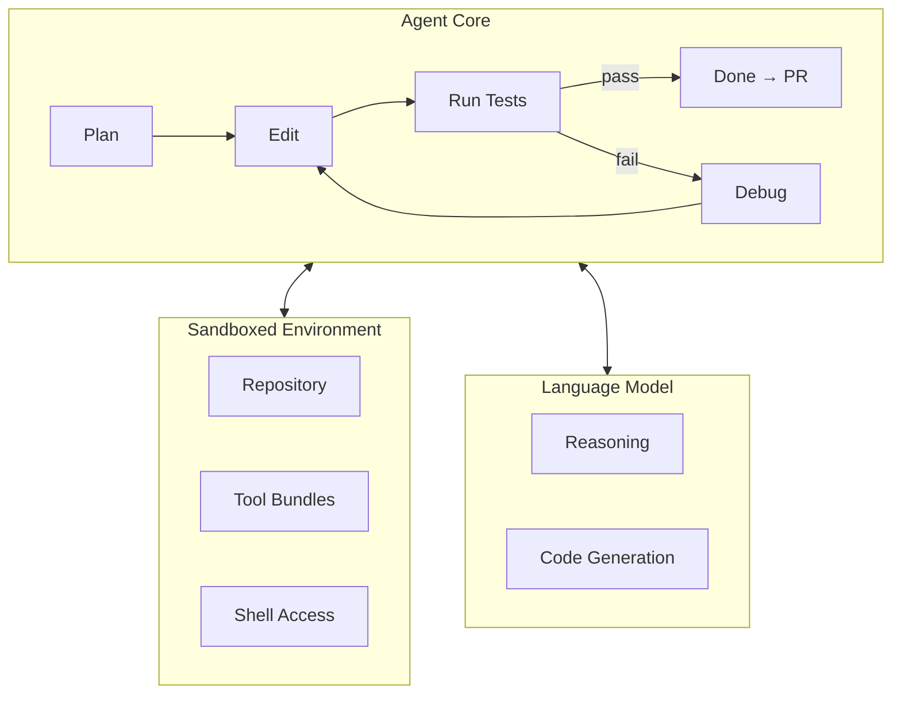

# Chapter 53b: Project — Building a SWE Agent End-to-End

> **Lead paragraph.** In Chapter 53 we saw how SWE-bench turned software engineering into a measurable agent capability — real GitHub issues, real test suites, real patches. The scores tell you *what* is possible; this chapter shows you *how*. We will build a complete SWE agent from scratch: one that clones a repository, reads an issue, plans a fix, edits code, runs tests, debugs failures, and opens a pull request. Every component is pure Python with zero frameworks. By the end you will have a working agent that solves real GitHub issues and a deep understanding of the three hard problems — context management, test-driven debugging, and sandboxed execution — that separate demos from production.

---

## 1. The Three Hard Problems

Before we write code, we need to understand what makes a SWE agent *hard*. Three problems dominate.

### 1.1 Context Management

A repository is larger than any context window. The agent cannot read everything. It must decide which files to read, how much of each file, and when to re-read after making edits. This is the file-level context management problem from Chapter 53 — and it is the single biggest differentiator between agents that work and agents that flail.

Production agents solve this with a retrieval pipeline: embed the issue, retrieve relevant files by similarity, read them within a token budget, and re-read only the files touched by edits. The key insight is that a typical fix touches 1-3 files, not the whole repo. If the agent can identify those files early, everything else is noise.

### 1.2 Test-Driven Debugging

The agent needs binary feedback: did my fix work or not? The test suite provides this. But the agent must do more than run tests — it must read the failure output, understand what went wrong, and revise its fix. This is the debug loop, and it requires the agent to parse stack traces, identify the failing assertion, and reason about why its edit did not satisfy the test.

The test-driven discipline is: write or locate the failing test first, then edit until it passes. This converts the ambiguous question "did I fix the issue?" into the binary question "does the test pass?"

### 1.3 Sandboxed Execution

The agent runs arbitrary code — its edits and the repository's tests. This must happen in an isolated environment. Production agents use Docker containers or cloud sandboxes (Modal, AWS Fargate). The sandbox provides a clean repository state, installed dependencies, and network isolation. The agent never runs on the host machine.

---

## 2. Architecture: The SWE-Agent Pattern

The canonical SWE agent architecture (SWE-agent v1.0+, OpenHands v1, Devin) has converged on a simple pattern with three components.



<figcaption>Figure 53b.1 — The SWE agent architecture. Three components: the agent core (plan → edit → test → debug loop), the sandboxed environment (repository, tool bundles, shell access), and the language model (reasoning and code generation). The agent core orchestrates; the sandbox provides isolation; the model provides intelligence.</figcaption>

### 2.1 The Agent Core

The agent core is a state machine with four states: plan, edit, test, debug. It maintains a trajectory — a list of (thought, action, observation) tuples — that accumulates context across iterations. The trajectory is the agent's memory; without it, the agent would forget what it tried in previous steps.

```python
class AgentCore:
    def __init__(self, llm, sandbox, max_steps=10):
        self.llm = llm
        self.sandbox = sandbox
        self.trajectory = []  # (thought, action, observation)
        self.max_steps = max_steps

    def run(self, issue):
        for step in range(self.max_steps):
            # 1. PLAN: decide what to do
            thought = self.plan(issue)
            
            # 2. EDIT: modify the code
            action = self.edit(thought)
            
            # 3. TEST: run the test suite
            passed, observation = self.test()
            
            # 4. DEBUG: if tests failed, reason about the failure
            self.trajectory.append((thought, action, observation))
            
            if passed:
                return {"resolved": True, "step": step}
            
            # Feed failure back into the next iteration
            issue = self.revise_issue(issue, observation)
        
        return {"resolved": False, "step": self.max_steps}
```

### 2.2 The Sandbox

The sandbox isolates the agent's execution. It provides:
- A clean clone of the repository at a specific commit
- Installed dependencies (from `requirements.txt`, `setup.py`, etc.)
- Shell access for running commands (tests, linters, git operations)
- A token budget for file reads

SWE-agent uses SWE-ReX, which supports Docker (local), Modal (cloud), and AWS Fargate. OpenHands uses a similar pattern with its own sandboxing layer.

### 2.3 Tool Bundles

Tool bundles are YAML-defined sets of bash/Python scripts that get uploaded into the sandbox. They provide the agent with capabilities like file editing, search, and test execution. The tool bundle pattern is powerful because it separates the agent's reasoning from the execution mechanism — the agent decides *what* to do, and the tool bundle provides *how*.

---

## 3. Implementation: File-Level Context Management

Let us implement the context management system — the hardest component. The problem: a repository has thousands of files, the context window fits a few thousand tokens, and the agent must read the right files.

### 3.1 The Token Budget

We define a token budget and select files that fit within it. The naive approach is to sort by file size and greedily fill the budget. Production agents rank by relevance (embeddings, import-graph proximity), but the constraint is the same — read the relevant few, edit blind to the rest.

```python
import os
from typing import List, Tuple


def select_files(repo_path: str, token_budget: int = 8000,
                 extensions: Tuple[str, ...] = (".py",)) -> List[str]:
    """Select files to read within a token budget.
    
    Strategy: sort by modification time (most recent first),
    then greedily fill the budget. Production agents use
    embeddings for relevance ranking.
    """
    files = []
    for root, _, names in os.walk(repo_path):
        for name in names:
            if not any(name.endswith(ext) for ext in extensions):
                continue
            path = os.path.join(root, name)
            # Skip hidden dirs, __pycache__, venv, node_modules
            if any(skip in path for skip in 
                   ["/.", "/__pycache__/", "/venv/", "/node_modules/"]):
                continue
            files.append(path)
    
    # Sort by modification time (most recent first)
    files.sort(key=lambda p: os.path.getmtime(p), reverse=True)
    
    # Greedily select files within budget
    selected = []
    total_tokens = 0
    for path in files:
        size_tokens = os.path.getsize(path) // 4  # rough estimate
        if total_tokens + size_tokens > token_budget:
            continue
        selected.append(path)
        total_tokens += size_tokens
    
    return selected
```

### 3.2 The File Reader

Once we have selected files, we need to read them and format them for the LLM. The reader adds line numbers and truncates files that exceed a per-file token limit.

```python
def read_file(path: str, max_tokens: int = 2000) -> str:
    """Read a file and return it with line numbers, truncated to max_tokens."""
    with open(path, "r") as f:
        lines = f.readlines()
    
    # Truncate if too long
    max_lines = max_tokens * 4 // 3  # rough: 1 token ≈ 1.3 chars
    if len(lines) > max_lines:
        lines = lines[:max_lines] + [f"\n... [{len(lines) - max_lines} lines truncated]"]
    
    # Add line numbers
    numbered = []
    for i, line in enumerate(lines, 1):
        numbered.append(f"{i:4d} | {line.rstrip()}")
    
    return "\n".join(numbered)
```

### 3.3 The Context Builder

The context builder combines issue + selected files into a prompt that fits the context window. This is the critical piece — it determines what the agent sees.

```python
def build_context(issue: str, repo_path: str, 
                  token_budget: int = 8000) -> str:
    """Build the context for the agent: issue + relevant files."""
    # 1. Select files
    files = select_files(repo_path, token_budget)
    
    # 2. Reserve tokens for the issue and instructions
    issue_tokens = len(issue) // 4
    instructions_tokens = 500  # fixed overhead
    file_budget = token_budget - issue_tokens - instructions_tokens
    
    # 3. Read files within the remaining budget
    file_contents = []
    used_tokens = 0
    for path in files:
        file_tokens = os.path.getsize(path) // 4
        if used_tokens + file_tokens > file_budget:
            continue
        content = read_file(path, max_tokens=file_budget - used_tokens)
        file_contents.append(f"## {path}\n{content}")
        used_tokens += file_tokens
    
    # 4. Assemble the context
    context = f"""## Issue

{issue}

## Repository Files

{chr(10).join(file_contents)}

## Task

Based on the issue and the code above, produce a fix.
Return the edited file contents."""
    
    return context
```

---

## 4. Implementation: The Agent Loop

Now we assemble the full agent. The loop is: plan → edit → test → debug. Each iteration feeds the test failure back into the next plan.

```python
import os
import subprocess
import json
import openai


class LLMClient:
    """OpenAI-compatible client with Ollama support."""
    
    def __init__(self, model="gpt-5.5", use_ollama=False):
        self.model = model
        if use_ollama:
            self.client = openai.OpenAI(
                base_url="http://localhost:11434/v1", api_key="ollama")
        else:
            self.client = openai.OpenAI(api_key=os.getenv("OPENAI_API_KEY"))
    
    def complete(self, messages, temperature=0.2, max_tokens=2000):
        resp = self.client.chat.completions.create(
            model=self.model, messages=messages,
            temperature=temperature, max_tokens=max_tokens)
        return resp.choices[0].message.content


class SWESandbox:
    """Sandboxed environment for a single repository."""
    
    def __init__(self, repo_url: str, work_dir: str = "./workspace"):
        self.work_dir = work_dir
        self.repo_dir = os.path.join(work_dir, "repo")
        self.clone(repo_url)
    
    def clone(self, url: str):
        """Clone the repository."""
        os.makedirs(self.work_dir, exist_ok=True)
        subprocess.run(["git", "clone", url, self.repo_dir],
                       capture_output=True, check=True)
    
    def run_tests(self) -> tuple:
        """Run pytest and return (passed, output)."""
        r = subprocess.run(
            ["pytest", self.repo_dir, "-x", "-q"],
            capture_output=True, text=True, timeout=120,
            cwd=self.repo_dir)
        return r.returncode == 0, r.stdout + r.stderr
    
    def apply_edit(self, file_path: str, new_contents: str):
        """Write new contents to a file."""
        full_path = os.path.join(self.repo_dir, file_path)
        with open(full_path, "w") as f:
            f.write(new_contents)
    
    def read_file(self, file_path: str) -> str:
        """Read a file from the repository."""
        full_path = os.path.join(self.repo_dir, file_path)
        with open(full_path) as f:
            return f.read()
    
    def create_branch(self, branch_name: str):
        """Create and checkout a new branch."""
        subprocess.run(
            ["git", "-C", self.repo_dir, "checkout", "-b", branch_name],
            capture_output=True, check=True)
    
    def commit(self, message: str):
        """Stage all changes and commit."""
        subprocess.run(["git", "-C", self.repo_dir, "add", "-A"],
                       capture_output=True)
        subprocess.run(
            ["git", "-C", self.repo_dir, "commit", "-m", message],
            capture_output=True)


class SWESolver:
    """The complete SWE agent: plan → edit → test → debug."""
    
    def __init__(self, llm: LLMClient, sandbox: SWESandbox, 
                 max_steps: int = 5):
        self.llm = llm
        self.sandbox = sandbox
        self.max_steps = max_steps
        self.trajectory = []
    
    def plan(self, issue: str) -> dict:
        """Plan the fix: which file to edit, what change to make."""
        # Build context with selected files
        context = build_context(issue, self.sandbox.repo_dir)
        
        messages = [
            {"role": "system", "content": (
                "You are a software engineering agent. Given a GitHub issue "
                "and relevant code, produce a fix. Return JSON with: "
                "'file' (path to edit), 'explanation' (what you're changing), "
                "'contents' (the new file contents).")},
            {"role": "user", "content": context}
        ]
        
        response = self.llm.complete(messages, temperature=0.1)
        
        # Parse the response
        try:
            # Extract JSON from the response
            start = response.find("{")
            end = response.rfind("}") + 1
            return json.loads(response[start:end])
        except (json.JSONDecodeError, ValueError):
            return {"file": "", "explanation": "", "contents": ""}
    
    def debug(self, issue: str, test_output: str) -> str:
        """Revise the issue based on test failure."""
        return (
            f"{issue}\n\n"
            f"## Previous attempt failed. Test output:\n"
            f"```\n{test_output[:2000]}\n```\n\n"
            f"Revise your approach based on this failure."
        )
    
    def solve(self, issue: str) -> dict:
        """Run the full SWE loop."""
        branch = f"swe-agent-fix"
        self.sandbox.create_branch(branch)
        
        current_issue = issue
        for step in range(self.max_steps):
            # PLAN
            plan = self.plan(current_issue)
            
            if not plan.get("file") or not plan.get("contents"):
                current_issue = self.debug(current_issue, "Invalid plan output")
                continue
            
            # EDIT
            self.sandbox.apply_edit(plan["file"], plan["contents"])
            
            # TEST
            passed, output = self.sandbox.run_tests()
            
            # Record trajectory
            self.trajectory.append({
                "step": step,
                "thought": plan.get("explanation", ""),
                "action": f"edit {plan['file']}",
                "observation": "PASS" if passed else output[:500],
            })
            
            if passed:
                # COMMIT
                self.sandbox.commit(f"fix: {issue[:60]}")
                return {
                    "resolved": True,
                    "steps": step + 1,
                    "branch": branch,
                    "trajectory": self.trajectory,
                }
            
            # DEBUG
            current_issue = self.debug(current_issue, output)
        
        return {
            "resolved": False,
            "steps": self.max_steps,
            "branch": branch,
            "trajectory": self.trajectory,
        }
```

---

## 5. Running the Agent

Let us test the agent on a simple repository. We will create a demo repo with a bug, then let the agent find and fix it.

```python
def setup_demo_repo():
    """Create a demo repository with a known bug."""
    os.makedirs("demo_repo", exist_ok=True)
    
    # Create a Python module with a bug
    with open("demo_repo/calculator.py", "w") as f:
        f.write("""def add(a, b):
    return a + b

def subtract(a, b):
    return a - b

def multiply(a, b):
    return a + b  # BUG: should be a * b

def divide(a, b):
    return a / b
""")
    
    # Create a test file
    with open("demo_repo/test_calculator.py", "w") as f:
        f.write("""from calculator import add, subtract, multiply, divide

def test_add():
    assert add(2, 3) == 5

def test_subtract():
    assert subtract(5, 3) == 2

def test_multiply():
    assert multiply(4, 3) == 12  # This will fail with the bug

def test_divide():
    assert divide(10, 2) == 5.0
""")
    
    # Initialize git
    subprocess.run(["git", "init"], cwd="demo_repo", capture_output=True)
    subprocess.run(["git", "add", "-A"], cwd="demo_repo", capture_output=True)
    subprocess.run(["git", "commit", "-m", "initial"],
                   cwd="demo_repo", capture_output=True)


if __name__ == "__main__":
    # Setup
    setup_demo_repo()
    
    # Initialize components
    llm = LLMClient(use_ollama=True)
    sandbox = SWESandbox(repo_url="./demo_repo")
    solver = SWESolver(llm, sandbox, max_steps=3)
    
    # Solve
    issue = "multiply() returns wrong result. multiply(4, 3) returns 7 instead of 12."
    result = solver.solve(issue)
    
    # Report
    print(f"Resolved: {result['resolved']}")
    print(f"Steps: {result['steps']}")
    print(f"Branch: {result['branch']}")
    for entry in result["trajectory"]:
        print(f"  Step {entry['step']}: {entry['action']} → {entry['observation'][:100]}")
```

---

## 6. Production Patterns

The demo above captures the essence. Production SWE agents add several layers.

### 6.1 Trajectory Management

Production agents log every (thought, action, observation) to a `.traj` file — a JSON format that enables replay, analysis, and fine-tuning. SWE-agent's trajectory inspector visualizes these for debugging. The trajectory is the agent's training data for self-improvement.

### 6.2 Parallel Execution

Production deployments run many agents in parallel — one per issue. SWE-agent's SWE-ReX runtime supports this natively with Docker or Modal backends. Each agent gets its own sandbox. The challenge is coordinating results and avoiding duplicate work on the same repository.

### 6.3 CI/CD Integration

The agent does not stop at "tests pass." It opens a pull request, monitors the CI pipeline, reads failures, and pushes fixes. This transforms the agent from a coding assistant into a contributor — which is why sandboxing (Chapter 47) and approval gates (Chapter 48) are non-negotiable.

### 6.4 Cost Management

At scale, the cost of LLM calls dominates. Production agents use:
- Smaller models for planning, larger models for debugging
- Caching of file reads and test outputs
- Batch processing to amortize sandbox startup costs
- The budget from Chapter 50 applies directly here

---

## 7. The SWE-bench Ecosystem

Understanding the benchmark ecosystem helps you evaluate and improve your agent.

| Benchmark | Tasks | What It Tests | Key Insight |
|-----------|-------|---------------|-------------|
| SWE-bench Verified | 500 | Human-verified fixes | The headline number |
| SWE-bench Pro | 731 | Harder, more diverse | Exposes what Verified hides |
| SWE-bench Live | Monthly | Fresh issues | Defeats contamination |
| SWE-bench Multilingual | Various | Non-Python repos | Generalization |
| SWE-bench Multimodal | Various | UI/visual issues | Beyond text |

As of mid-2026, the frontier on Verified is Claude Fable 5 at 95.0%, with Opus 4.8 at 88.6%. On Pro, the scores drop significantly — GPT-5.4 (xHigh) leads standardized at 59.1%, with vendor-reported Opus 4.8 at 69.2%. The gap between Verified and Pro shows that the harder tasks remain genuinely hard.

---

## Summary

- The three hard problems of SWE agents are **context management** (a repo exceeds any context window), **test-driven debugging** (binary feedback from the test suite), and **sandboxed execution** (isolated environment for arbitrary code).
- The canonical architecture is the **Plan → Edit → Test → Debug** loop with three components: the agent core (state machine with trajectory), the sandbox (Docker/Modal/Fargate), and tool bundles (YAML-defined scripts).
- File-level context management is the biggest differentiator: select 1-3 relevant files within a token budget, read them, edit, and re-read only touched files. Production agents use embeddings for relevance ranking.
- Production patterns include trajectory logging for replay and fine-tuning, parallel execution (one agent per issue), CI/CD integration (monitor PRs, fix failures), and cost management (model selection, caching, batching).
- The SWE-bench ecosystem (Verified 500, Pro 731, Live monthly) provides honest evaluation. The gap between Verified (~95% frontier) and Pro (~60-70%) shows that harder tasks remain genuinely hard.

---

## Agentic Code Project: A Complete SWE Agent

The code in Sections 3-5 above *is* the complete project. To run it:

1. Install dependencies: `pip install openai pytest`
2. Set your API key: `export OPENAI_API_KEY=your-key`
3. Or use Ollama: start Ollama with `ollama serve` and the script uses `use_ollama=True` by default
4. Run the script — it creates a demo repo with a bug, and the agent fixes it

The agent demonstrates the full loop: it reads the issue, selects files, plans a fix, edits the code, runs tests, and if they fail, feeds the failure back into the next iteration. The trajectory records every step for analysis.

---

## Further Reading

- [SWE-agent](https://github.com/SWE-agent/SWE-agent) — The original SWE agent, v1.0+ with SWE-ReX sandboxed execution.
- [OpenHands](https://github.com/All-Hands-AI/OpenHands) — Open-source production coding-agent reference architecture (formerly OpenDevin).
- [SWE-bench](https://www.swebench.com/) — Official leaderboards for Verified, Pro, Live, Multilingual, and Multimodal.
- [SWE-ReX](https://github.com/SWE-agent/SWE-ReX) — Sandboxed code execution for AI agents, locally or on the cloud.
- [SWE-bench Pro Leaderboard](https://labs.scale.com/leaderboard/swe_bench_pro_public) — Scale AI's standardized benchmark with contamination detection.
- [Open SWE](https://blog.langchain.com/open-swe-an-open-source-framework-for-internal-coding-agents/) — LangChain's open-source framework for internal coding agents.
