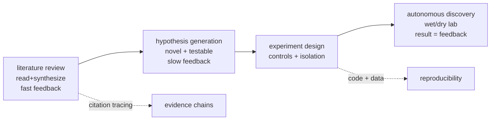
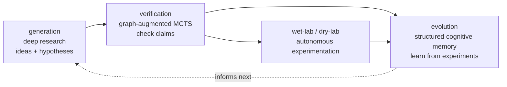
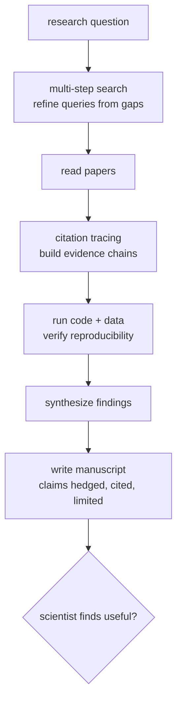
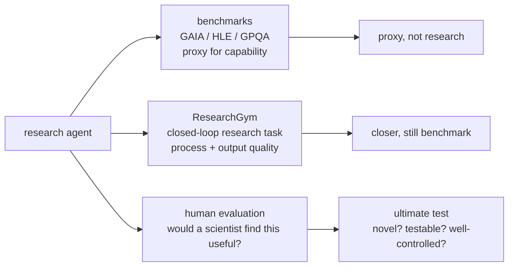

# Chapter 54: Scientific Research Agents

> **Lead paragraph.** Software engineering (Chapter 53) was the first domain agents mastered because the feedback loop is free; science is harder because the feedback loop is slow, expensive, and sometimes wrong. Scientific research agents span literature review (read, summarize, synthesize across thousands of papers), hypothesis generation (propose novel hypotheses from the literature), experiment design (suggest experiments with appropriate controls), and autonomous discovery (run wet-lab and dry-lab experiments). The state of the art, InternAgent-1.5 (Shanghai AI Lab, 2026), unifies generation, verification, and evolution into a closed-loop system for end-to-end scientific discovery. This chapter covers the agent architectures (multi-step literature search, citation tracing, reproducible code-and-data analysis, manuscript writing), the benchmarks (GAIA, HLE, GPQA, ResearchGym, FrontierScience), and the project: a literature-review agent that reads, synthesizes, and traces citations. By the end you will understand why "would a scientist find this useful?" is the evaluation question that matters, and why AlphaEvolve's algorithm discovery is the proof that agents can produce novel science, not just summarize it.

---

## 1. What Scientific Research Agents Do

Scientific research decomposes into four agent tasks, each with a distinct feedback shape:

- **Literature review** — read, summarize, and synthesize across thousands of papers. The feedback is fast (the papers exist) but the synthesis is hard (the agent must integrate across sources, not concatenate). This is RAG (Chapter 13) at scientific scale.
- **Hypothesis generation** — propose novel hypotheses from the literature. The feedback is slow — a hypothesis is only validated by experiment, which may take months. The agent must generate hypotheses that are *novel* (not already in the literature) and *testable* (falsifiable by a real experiment), not just plausible-sounding.
- **Experiment design** — suggest experiments with appropriate controls. The discipline is controls: an experiment that does not isolate the variable is not an experiment, so the agent must propose controlled designs, not just procedures.
- **Autonomous discovery** — run wet-lab (bench chemistry, biology) and dry-lab (computational) experiments. The agent is not proposing; it is doing — and the feedback is the experiment's result, which is why autonomy here is the highest-stakes agent deployment.



<figcaption>Figure 54.1 — Four research-agent tasks. Literature review (fast feedback, hard synthesis), hypothesis generation (slow feedback — validated only by experiment; must be novel and testable), experiment design (controls and isolation), and autonomous discovery (wet/dry lab, the experiment's result is the feedback). Citation tracing builds evidence chains from literature; code-and-data analysis ensures reproducibility.</figcaption>

The unifying challenge across all four: science's feedback loop is slow and sometimes wrong. A coding agent knows immediately if its code passes tests; a research agent may wait months to know if its hypothesis holds, and a peer-reviewed "wrong" result can mislead it. This is why verification (not just generation) is central to research agents.

---

## 2. InternAgent-1.5 and the Closed-Loop Architecture

**InternAgent-1.5** (Shanghai AI Lab, 2026, arXiv 2602.08990) is the state-of-the-art unified framework for end-to-end scientific discovery, and its architecture captures what makes research agents work. It unifies three capabilities:

- **Generation (deep research)** — the agent produces research ideas, plans, and hypotheses, drawing on literature and prior knowledge. This is the productive side.
- **Verification (graph-augmented MCTS)** — the agent *checks* what it generated, using a graph-augmented Monte-Carlo tree search to explore and verify claims. Verification is the discipline that prevents the agent from confidently asserting unchecked hypotheses — it treats its own outputs as claims to test, not truths.
- **Evolution (structured cognitive memory)** — verified results feed a structured memory that evolves over time, so the agent learns from its experiments rather than restarting each run. This is Part V's continual learning applied to scientific knowledge.

InternAgent-1.5 reports state-of-the-art on general-assistant and scientific benchmarks — GAIA (~86%), HLE (~40%), and GPQA-diamond (~87.4%) — and performs autonomous wet-lab and dry-lab experimentation. The numbers matter less than the architecture: the closed loop (generate → verify → evolve) is what distinguishes a research agent from a research *summarizer*, because the verify step is what makes the agent's output trustworthy enough to act on.



<figcaption>Figure 54.2 — InternAgent-1.5's closed loop. Generation (deep research — ideas, hypotheses) feeds verification (graph-augmented MCTS checking claims), which feeds evolution (structured cognitive memory that learns from experiments), which informs the next generation. Autonomous wet/dry-lab experimentation feeds results back into evolution. The verify step is what makes the agent's output trustworthy enough to act on — distinguishing a research agent from a summarizer.</figcaption>

The verification step is the lesson generalizable beyond InternAgent: any research agent that *only* generates is a bullshitting machine at scientific scale, because the literature it reads contains errors and its own synthesis can be wrong. Verification — treating outputs as testable claims — is what keeps it honest.

---

## 3. Research Agent Architectures

Beyond the closed loop, four architectural patterns recur in research agents:

- **Multi-step literature search and synthesis** — not one retrieval (Chapter 13) but a chain: search, read, identify gaps, search again with refined queries. Single-pass retrieval misses what a researcher finds by following a thread.
- **Citation tracing** — follow references to build evidence chains. A claim is only as good as its sources, so the agent traces from a claim to its citations to their citations, building the evidential graph that lets it assess whether a claim is well-supported or isolated.
- **Code and data analysis for reproducibility** — a scientific result the agent uses must be reproducible, so the agent runs the underlying code and data, not just reads the abstract. This is the research analog of test-driven development (Chapter 53): verify the claim by reproducing it.
- **Writing and editing scientific manuscripts** — the agent produces not just findings but the manuscript reporting them, with the discipline of scientific writing (claims hedged, evidence cited, limitations stated).



<figcaption>Figure 54.3 — Research agent architecture. Multi-step literature search (refine queries from gaps, not one retrieval), citation tracing (build evidence chains from claim to sources), code-and-data analysis (verify reproducibility by running it — the research analog of test-driven development), synthesis, and manuscript writing (claims hedged, evidence cited, limitations stated). "Would a scientist find this useful?" is the evaluation question.</figcaption>

The patterns compose into the workflow a human researcher follows, which is the point: a research agent is not a different kind of agent, it is the agent loop (Chapter 6) specialized to scientific epistemology — where every claim must be sourced, every result reproducible, and every limitation stated.

---

## 4. Evaluation: ResearchGym and the Scientist Test

Evaluating research agents is harder than evaluating coding agents, because there is no test suite as oracle. Three approaches:

- **General-assistant and scientific benchmarks** — GAIA, HLE (Humanity's Last Exam), GPQA-diamond (Rein et al., arXiv 2311.12022) measure the agent's knowledge and reasoning. These are proxies for research capability, not research itself.
- **ResearchGym** — closed-loop AI research evaluation, where the agent runs a research task end-to-end and is scored on the quality of its process and output. Closer to real research, but still a benchmark.
- **Human evaluation** — the ultimate test: *would a scientist find this useful?* A hypothesis that is novel and testable, an experiment that is well-controlled, a synthesis that surfaces a connection a researcher missed — these are judged by scientists, not benchmarks.



<figcaption>Figure 54.4 — Evaluating research agents. Benchmarks (GAIA, HLE, GPQA-diamond) proxy capability but are not research. ResearchGym runs closed-loop research tasks scored on process and output — closer, still a benchmark. Human evaluation — would a scientist find this useful? (novel, testable, well-controlled, surfaces a missed connection) — is the ultimate test, because research has no test-suite oracle.</figcaption>

The evaluation gap is the chapter's honesty: research agents can hit SOTA on benchmarks and still produce science no researcher would use, because the benchmark measures capability, not usefulness. The scientist test is non-substitutable — and the reason production research agents must keep a human in the loop (Chapter 48) for the parts that matter.

---

## 5. Agentic Code Project: A Literature-Review Agent with Citation Tracing

This project implements the literature-review architecture: multi-step search with query refinement, citation tracing to build evidence chains, and synthesis. It uses the standard `LLMClient` for reading and synthesis, with a citation graph for evidence chains.

```python
import os, json
from collections import defaultdict
from dataclasses import dataclass, field
import openai


class LLMClient:
    """OpenAI-compatible client; flips to a local Ollama endpoint."""

    def __init__(self, model="gpt-5.5", use_ollama=False):
        self.model = model
        if use_ollama:
            self.client = openai.OpenAI(
                base_url="http://localhost:11434/v1", api_key="ollama")
        else:
            self.client = openai.OpenAI(api_key=os.getenv("OPENAI_API_KEY"))

    def complete(self, prompt, temperature=0.3, max_tokens=600):
        resp = self.client.chat.completions.create(
            model=self.model,
            messages=[{"role": "user", "content": prompt}],
            temperature=temperature, max_tokens=max_tokens)
        return resp.choices[0].message.content.strip()


@dataclass
class Paper:
    id: str
    title: str
    abstract: str
    references: list = field(default_factory=list)   # cited paper ids


class LiteratureAgent:
    """Multi-step search + citation tracing + synthesis."""

    def __init__(self, llm, corpus):
        self.llm = llm
        self.corpus = {p.id: p for p in corpus}

    def search(self, query, k=3):
        # naive lexical search; production uses embeddings (Ch 36)
        scored = [(p, sum(w.lower() in p.abstract.lower()
                          for w in query.split())) for p in self.corpus.values()]
        return [p for p, s in sorted(scored, key=lambda x: -x[1])[:k] if s > 0]

    def refine_query(self, query, gaps):
        """Multi-step: refine the query from what's missing."""
        return self.llm.complete(
            f"Original query: {query}\nGaps in retrieved papers: {gaps}\n"
            f"Return a refined search query, one line.")

    def trace_citations(self, paper, hops=2):
        """Build an evidence chain: follow references."""
        chain, frontier, seen = [], [paper.id], set()
        for _ in range(hops):
            nxt = []
            for pid in frontier:
                for ref in self.corpus[pid].references:
                    if ref in self.corpus and ref not in seen:
                        chain.append(self.corpus[ref])
                        seen.add(ref); nxt.append(ref)
            frontier = nxt
        return chain

    def synthesize(self, question, papers):
        bodies = "\n\n".join(f"{p.title}: {p.abstract}" for p in papers)
        return self.llm.complete(
            f"Synthesize an answer to: {question}\n"
            f"From these papers:\n{bodies}\n"
            f"Cite by paper id. State limitations.")

    def research(self, question, rounds=2):
        query, read = question, []
        for _ in range(rounds):
            hits = self.search(query)
            read.extend(hits)
            gaps = self.llm.complete(
                f"What's missing to answer: {question}, given: "
                f"{[h.title for h in hits]}? One line.")
            query = self.refine_query(question, gaps)
        # trace citations from the strongest hit
        chain = self.trace_citations(read[0]) if read else []
        return self.synthesize(question, read + chain)


if __name__ == "__main__":
    llm = LLMClient(use_ollama=True)
    corpus = [
        Paper("p1", "RAG for QA", "Retrieval-augmented generation for "
              "open-domain question answering uses a retriever.",
              ["p2", "p3"]),
        Paper("p2", "Dense retrieval", "Dense passage retrieval trains a "
              "dual encoder with contrastive loss.", ["p3"]),
        Paper("p3", "Contrastive learning", "Contrastive learning pushes "
              "positives close and negatives apart.", []),
    ]
    agent = LiteratureAgent(llm, corpus)
    print(agent.research("How does RAG retrieve passages?"))
```

Three patterns to verify. `research` runs multi-step: it searches, refines the query from the gaps, and searches again — not one retrieval. `trace_citations` follows references to build an evidence chain, so the synthesis draws on cited support, not just the top hits. `synthesize` explicitly asks the model to cite by paper id and state limitations — the scientific-writing discipline (claims hedged, evidence cited, limitations stated) encoded in the prompt. The `search` is deliberately naive (lexical) because the chapter's point is the architecture, not the retriever; production swaps in embeddings (Chapter 36).

```python
def novelty_check(hypothesis, literature, llm):
    """A hypothesis must be novel (not already in the literature) and
    testable (falsifiable by a real experiment). Verification, not just
    generation."""
    prompt = (f"Hypothesis: {hypothesis}\n"
              f"Existing literature: {literature}\n"
              f"Is this hypothesis novel (not stated in the literature) "
              f"and testable (falsifiable by an experiment)? "
              f"Return JSON: {{'novel': bool, 'testable': bool, 'reason': str}}.")
    return llm.complete(prompt, temperature=0.1, max_tokens=120)
```

The `novelty_check` helper is the chapter's verification principle in one function: a generated hypothesis is treated as a *claim to test* (is it novel? is it testable?), not a truth to assert. This is InternAgent's verify step in miniature — the discipline that keeps a generation-only agent from becoming a bullshitting machine at scientific scale.

---

## Summary

- Scientific research agents span four tasks with distinct feedback shapes: literature review (fast feedback, hard synthesis across thousands of papers), hypothesis generation (slow feedback — validated only by experiment; must be novel and testable, not just plausible), experiment design (controls and isolation), and autonomous discovery (wet/dry lab, the experiment's result is the feedback). The unifying challenge: science's feedback loop is slow and sometimes wrong.
- InternAgent-1.5 (Shanghai AI Lab, 2026, arXiv 2602.08990) is the SOTA unified framework, reporting GAIA ~86%, HLE ~40%, GPQA-diamond ~87.4%, with autonomous wet/dry-lab experimentation. Its closed loop — generation (deep research), verification (graph-augmented MCTS), evolution (structured cognitive memory) — is the architecture: the verify step treats outputs as testable claims, distinguishing a research agent from a summarizer.
- Research agent architectures: multi-step literature search (refine queries from gaps, not one retrieval), citation tracing (build evidence chains from claim to sources), code-and-data analysis for reproducibility (the research analog of test-driven development — verify the claim by reproducing it), and manuscript writing (claims hedged, evidence cited, limitations stated). The agent loop specialized to scientific epistemology.
- Evaluation has no test-suite oracle. Benchmarks (GAIA, HLE, GPQA, arXiv 2311.12022) proxy capability but are not research. ResearchGym runs closed-loop research tasks scored on process and output. Human evaluation — would a scientist find this useful? (novel, testable, well-controlled) — is the ultimate, non-substitutable test. AlphaEvolve (DeepMind) discovering novel algorithms is the proof agents can produce novel science, not just summarize it.

---

## Further Reading

- [InternAgent-1.5: A Unified Agentic Framework for Long-Horizon Scientific Discovery](https://arxiv.org/abs/2602.08990) — Shanghai AI Lab, 2026. The closed-loop generation/verification/evolution SOTA.
- [GPQA: A Graduate-Level Google-Proof Q&A Benchmark](https://arxiv.org/abs/2311.12022) — Rein et al., 2024. A scientific-reasoning benchmark.
- [AlphaEvolve (Google DeepMind)](https://deepmind.google/discover/blog/) — evolutionary algorithm discovery; proof of autonomous novel science.
- [Elicit](https://elicit.org/) — AI research assistant for literature review and synthesis.

---