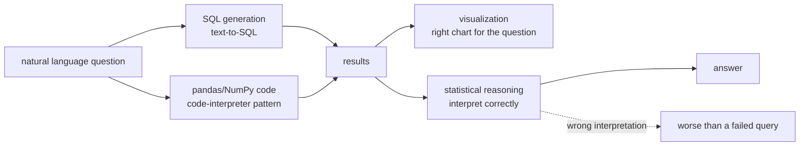
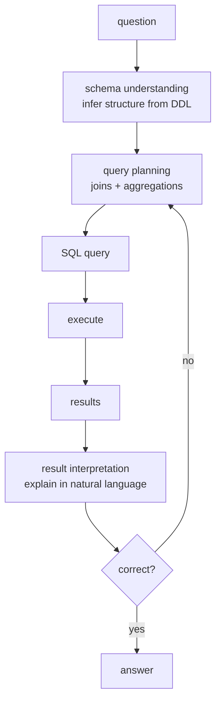
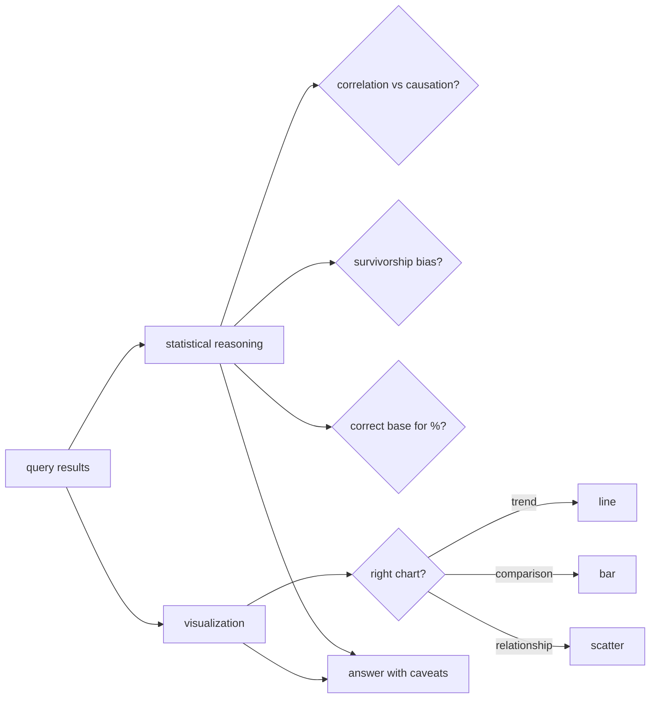

# Chapter 55: Data Analysis and Business Intelligence Agents

> **Lead paragraph.** A business user asks "which regions grew fastest last quarter?" and expects an answer, not a SQL tutorial. The data analysis agent bridges natural language and data: it writes the SQL, generates the pandas code, draws the chart, and — the part that distinguishes it from a code generator — interprets the result correctly. This chapter covers text-to-SQL (the Spider and BIRD benchmarks), the code-interpreter pattern (LLM writes pandas/NumPy, executes, observes), visualization generation, and the architectural discipline that makes it work: schema understanding, query planning, result interpretation, and iterative refinement when the first query is wrong. By the end you will understand why statistical reasoning is the failure mode that matters (a correct query with a wrong interpretation is worse than a failed query), and why iterative refinement — adjusting the query from preliminary results — is what separates a one-shot SQL generator from a data analyst.

---

## 1. The Data Analyst Agent's Four Jobs

A data analyst agent does four things, each a distinct capability:

- **SQL generation** — natural language to database query (text-to-SQL). The entry point: turn "which regions grew fastest?" into a SELECT with joins and aggregations.
- **Code generation** — pandas/NumPy code for manipulation that SQL cannot express (statistical transforms, custom aggregations). This is the code-interpreter pattern: the LLM writes code, executes it, observes the output.
- **Visualization** — generating charts and dashboards from the data. The right chart for the question (a line for trends, a bar for comparisons) is itself a judgment the agent must make.
- **Statistical reasoning** — interpreting results correctly. This is the failure mode that matters: a query that returns the right numbers but an interpretation that draws the wrong conclusion is worse than a query that fails outright, because the wrong conclusion is acted on.



<figcaption>Figure 55.1 — The data analyst agent's four jobs. SQL generation (text-to-SQL), code generation (pandas/NumPy via the code-interpreter pattern — write, execute, observe), visualization (the right chart for the question), and statistical reasoning (interpreting results correctly). The last is the failure mode that matters: a correct query with a wrong interpretation is worse than a failed query, because the wrong conclusion is acted on.</figcaption>

The asymmetry between query correctness and interpretation correctness is the chapter's central caution. Modern text-to-SQL is good enough that the query usually returns the right numbers; the agent then interprets them, and that interpretation is where errors creep in — a correlation read as causation, a survivorship-biased sample read as representative, a percentage change read off the wrong base. A data agent without statistical reasoning is a confident misreader.

---

## 2. Text-to-SQL and the Benchmarks

Text-to-SQL turns natural language into database queries, evaluated on two benchmarks:

- **Spider** (Yale) — complex and cross-domain semantic parsing: questions over many databases, testing whether the agent generalizes across schemas rather than memorizing one.
- **BIRD** — large-scale databases with real-world noise (dirty data, large tables), closer to production databases than Spider's clean schemas.

The agent's challenge is **schema understanding**: inferring the database structure from DDL (data definition language) — the tables, columns, foreign keys, and the relationships that determine joins. A question like "top customers by region" requires the agent to know that customers join to regions through orders, which the DDL encodes but the question does not state.



<figcaption>Figure 55.2 — The text-to-SQL pipeline. Schema understanding (infer table/column/key structure from DDL) feeds query planning (the joins and aggregations the question implies), which produces the SQL. After execution, result interpretation explains the results in natural language, and iterative refinement adjusts the query if the preliminary results are wrong — the loop that separates an analyst from a one-shot generator.</figcaption>

**Query planning** breaks a complex question into the SQL it implies — which joins, which aggregations, which filters. **Iterative refinement** is the loop that matters: the agent runs a preliminary query, inspects the results, and adjusts if they are wrong (a join missing, an aggregation mis-specified). A one-shot SQL generator that cannot refine is brittle; an agent that runs, checks, and revises is an analyst.

---

## 3. The Code-Interpreter Pattern

For analysis SQL cannot express — statistical transforms, custom logic, plotting — the agent uses the **code-interpreter pattern**: it writes pandas/NumPy code, executes it, observes the output, and iterates. This is the same write-execute-observe loop as the coding agent (Chapter 53), applied to data.

The pattern's power is that the agent's reasoning is *grounded* in execution: it does not have to predict what the data looks like, it runs code and sees. The risk is the same as any code-executing agent — sandboxing (Chapter 47) is non-negotiable, because the agent writes and runs arbitrary code against possibly-sensitive data. The data analyst agent is a code-execution agent (Chapter 12's OS-agent family) specialized to dataframes.

```python
def plan_analysis(question, schema, llm):
    """Decide SQL vs code: is this a query or a transform SQL can't express?"""
    prompt = (f"Question: {question}\nSchema: {schema}\n"
              f"Return JSON: {{'mode': 'sql'|'code', 'plan': str}}. "
              f"Use 'sql' for joins/aggregations/filters; 'code' for "
              f"statistical transforms or plotting SQL cannot express.")
    return llm.complete(prompt, temperature=0.1, max_tokens=120)
```

The `plan_analysis` decision — SQL or code — is the agent's first judgment: a question answerable by SQL should not spawn a pandas script (slower, more error-prone), and a question needing a statistical transform should not be forced into contorted SQL. Getting this routing right is what makes the agent efficient; getting it wrong is what makes it slow and fragile.

---

## 4. Statistical Reasoning and Visualization

Two interpretation capabilities round out the analyst:

**Statistical reasoning** is the interpretation of results — and the locus of the dangerous errors. Common failures: correlation read as causation (regions with more sales have more support tickets — but both rise with customer count, not because sales cause tickets); survivorship bias (analyzing only successful products and concluding features that "work"); percentage off the wrong base (growth computed from a cherry-picked starting period). The agent must not just report numbers but flag the interpretation's assumptions and limits — the same scientific-writing discipline (Chapter 54) applied to data.

**Visualization** is choosing the right chart for the question: a line for trends over time, a bar for comparisons across categories, a scatter for relationships. The wrong chart misleads even with correct data — a pie chart for time series, a truncated-y-axis bar exaggerating differences. The agent's judgment is which chart serves the question, not which chart is easiest to generate.



<figcaption>Figure 55.3 — Statistical reasoning and visualization. Statistical reasoning checks the interpretation: correlation vs causation, survivorship bias, correct base for percentages. Visualization chooses the right chart for the question (line for trends, bar for comparisons, scatter for relationships) — the wrong chart misleads even with correct data. Both feed an answer that states its assumptions and caveats.</figcaption>

The answer-with-caveats discipline is what makes a data agent trustworthy. An agent that returns "Region A grew 50%" without noting "computed from a 2-week period, excluding a data outage" is setting up its user to repeat a wrong conclusion. The caveats are not optional commentary; they are part of the answer.

---

## 5. Agentic Code Project: A Data Analyst Agent

This project implements the data analyst loop: route to SQL or code, execute, interpret, and refine. It uses the standard `LLMClient` for generation and interpretation, with an in-memory dataframe for the data (a pandas stand-in) and a SQL-like query interface.

```python
import os, json, re
from dataclasses import dataclass
import openai


class LLMClient:
    """OpenAI-compatible client; flips to a local Ollama endpoint."""

    def __init__(self, model="gpt-5.5", use_ollama=False):
        self.model = model
        if use_ollama:
            self.client = openai.OpenAI(
                base_url="http://localhost:11434/v1", api_key="ollama")
        else:
            self.client = openai.OpenAI(api_key=os.getenv("OPENAI_API_KEY"))

    def complete(self, prompt, temperature=0.2, max_tokens=400):
        resp = self.client.chat.completions.create(
            model=self.model,
            messages=[{"role": "user", "content": prompt}],
            temperature=temperature, max_tokens=max_tokens)
        return resp.choices[0].message.content.strip()


@dataclass
class Table:
    name: str
    columns: list          # [(name, type)]
    rows: list             # list of dicts


class Database:
    """Minimal in-memory database: DDL is the table schemas; a SQL-like
    filter/aggregate subset for the demo. Production uses a real engine."""

    def __init__(self, tables):
        self.tables = {t.name: t for t in tables}

    def schema(self):
        return {n: [c[0] for c in t.columns] for n, t in self.tables.items()}

    def query(self, table, where=None, agg=None):
        rows = self.tables[table].rows
        if where:
            rows = [r for r in rows if where(r)]
        if agg:
            return agg(rows)
        return rows


class DataAnalystAgent:
    """Route (sql/code) -> execute -> interpret -> refine."""

    def __init__(self, llm, db):
        self.llm = llm
        self.db = db

    def route(self, question):
        prompt = (f"Schema: {self.db.schema()}\nQuestion: {question}\n"
                  f"Return JSON: {{'mode':'sql'|'code','plan':str}}.")
        raw = self.llm.complete(prompt, temperature=0.1, max_tokens=80)
        try:
            return json.loads(raw)
        except json.JSONDecodeError:
            return {"mode": "sql", "plan": "filter and aggregate"}

    def execute(self, plan_spec):
        # demo: a hardcoded mapping; production generates real SQL/code
        plan = plan_spec["plan"].lower()
        if "region" in plan and "sum" in plan:
            return self.db.query("sales", agg=lambda rs: {
                r["region"]: r["amount"] for r in rs})
        return self.db.query("sales")

    def interpret(self, question, results):
        """Statistical reasoning: interpret with caveats."""
        return self.llm.complete(
            f"Question: {question}\nResults: {results}\n"
            f"Interpret in one sentence. State any caveat (small sample, "
            f"correlation not causation, biased base).")

    def analyze(self, question, max_refine=2):
        for _ in range(max_refine):
            plan_spec = self.route(question)
            results = self.execute(plan_spec)
            interpretation = self.interpret(question, results)
            # refinement: if interpretation flags uncertainty, revise
            if "caveat" not in interpretation.lower() and "?" not in interpretation:
                return {"results": results, "interpretation": interpretation}
            question = f"{question} (refine: address the caveat)"
        return {"results": results, "interpretation": interpretation}


if __name__ == "__main__":
    llm = LLMClient(use_ollama=True)
    sales = Table("sales", [("region", "str"), ("amount", "float")],
                  [{"region": "North", "amount": 100.0},
                   {"region": "South", "amount": 150.0},
                   {"region": "North", "amount": 120.0}])
    agent = DataAnalystAgent(llm, Database([sales]))
    print(agent.analyze("What is the total sales by region?"))
```

Three capabilities to verify. The `route` decides SQL vs code from the question and schema — the routing judgment that keeps the agent efficient. The `execute` runs the plan against the data, grounding the agent's reasoning in real results rather than prediction. The `interpret` explicitly asks for caveats (small sample, correlation not causation, biased base) — the statistical-reasoning discipline that makes the answer trustworthy. The refinement loop re-routes when the interpretation flags uncertainty, the iterative refinement that separates an analyst from a one-shot generator.

```python
def chart_for_question(question, results):
    """Visualization judgment: pick the chart that serves the question,
    not the easiest to generate."""
    q = question.lower()
    if any(w in q for w in ["over time", "trend", "growth"]):
        return "line"          # trends over time
    if any(w in q for w in ["compare", "by region", "vs"]):
        return "bar"           # comparisons across categories
    if any(w in q for w in ["relationship", "correlate", "vs"]):
        return "scatter"       # relationships
    return "table"             # default: don't force a chart
```

The `chart_for_question` helper is the visualization judgment: a trend question gets a line, a comparison a bar, a relationship a scatter — and an ambiguous question gets a table rather than a misleading chart. The default to "table" when no chart clearly serves is itself a discipline: a wrong chart misleads, so when in doubt, do not chart.

---

## Summary

- The data analyst agent does four jobs: SQL generation (text-to-SQL), code generation (pandas/NumPy via the code-interpreter pattern — write, execute, observe), visualization (the right chart for the question), and statistical reasoning (interpreting results correctly). The last is the failure mode that matters — a correct query with a wrong interpretation is worse than a failed query, because the wrong conclusion is acted on.
- Text-to-SQL is evaluated on Spider (cross-domain semantic parsing) and BIRD (large-scale, real-world noise). The challenge is schema understanding (inferring structure from DDL) and query planning (the joins and aggregations a question implies). Iterative refinement — running a preliminary query, inspecting, adjusting — separates an analyst from a one-shot generator.
- The code-interpreter pattern grounds reasoning in execution: the agent writes pandas/NumPy, runs it, sees the output, iterates. The risk is arbitrary code execution against sensitive data — sandboxing (Ch 47) is non-negotiable. Routing SQL vs code (queries vs transforms) is the efficiency judgment.
- Statistical reasoning checks the interpretation (correlation vs causation, survivorship bias, correct base for percentages); visualization chooses the chart that serves the question (line for trends, bar for comparisons, scatter for relationships). An answer without caveats is setting up a wrong conclusion to be repeated — the caveats are part of the answer, not optional commentary.

---

## Further Reading

- [Spider: A Large Human-Annotated Dataset for Complex and Cross-Domain Semantic Parsing](https://yale-lily.github.io/spider) — text-to-SQL benchmark.
- [BIRD: A Big Bench for Large-Scale Database Grounded Text-to-SQL](https://bird-bench.github.io/) — large-scale, noisy, real-world databases.
- [SQL-PaLM: Improved Text-to-SQL Fine-Tuning](https://arxiv.org/abs/2302.05930) — Google; text-to-SQL with LLMs.
- [Chapter 10 — Code Agents] — the code-generation foundations the code-interpreter pattern builds on.

---